Local Surface Inclination Methods

屈崑

Northwestern Polytechnical Univ.

kunqu@nwpu.edu.cn

September 16, 2021

Overview

1 Newtonian Flow

牛顿流

2 Tangent-Wedge Tangent-Cone Methods 切楔/切锥方法

3 Shock-Expansion Method

激波膨胀法

4 Applications

应用

## Newtonian Flow 牛顿流

## Newtonian Flow

Idea: Wall pressure acts on the flow, changing momentum normal to the wall to ZERO

$$
m = {\rho }_{\infty }\left( {{V}_{\infty }\sin {\theta A}}\right) {\delta t}
$$

$$
P = m{V}_{\infty }\sin \theta
$$

$$
= {\rho }_{\infty }{\left( {V}_{\infty }\sin \theta \right) }^{2}{A\delta t}
$$

$$
p - {p}_{\infty } = \frac{F}{A} = \frac{P/{\delta t}}{A}
$$

$$
= {\rho }_{\infty }{\left( {V}_{\infty }\sin \theta \right) }^{2}
$$

$$
{c}_{p} = \frac{p - {p}_{\infty }}{\frac{1}{2}{\rho }_{\infty }{V}_{\infty }^{2}} = 2\sin \theta
$$

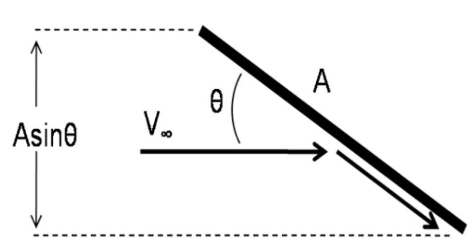

Figure 1. Momentum Transfer of Particle on Inclined Surface. ${}^{2}$

## Modified Newtonian Flow

Problem: It dosen't consider that total pressure decreases after the shock wave.

$$
{c}_{p} = {c}_{p,\max }{\sin }^{2}\theta
$$

$$
{c}_{p,\max } = \frac{{p}_{{O}_{2}} - {p}_{\infty }}{\frac{1}{2}{\rho }_{\infty }{V}_{\infty }^{2}} = 2\frac{{p}_{{O}_{2}} - {p}_{\infty }}{\gamma {p}_{\infty }{M}_{\infty }^{2}}
$$

$$
= \frac{2}{\gamma {M}_{\infty }^{2}}\left\lbrack  {\frac{{p}_{{o}_{2}}}{{p}_{\infty }} - 1}\right\rbrack
$$

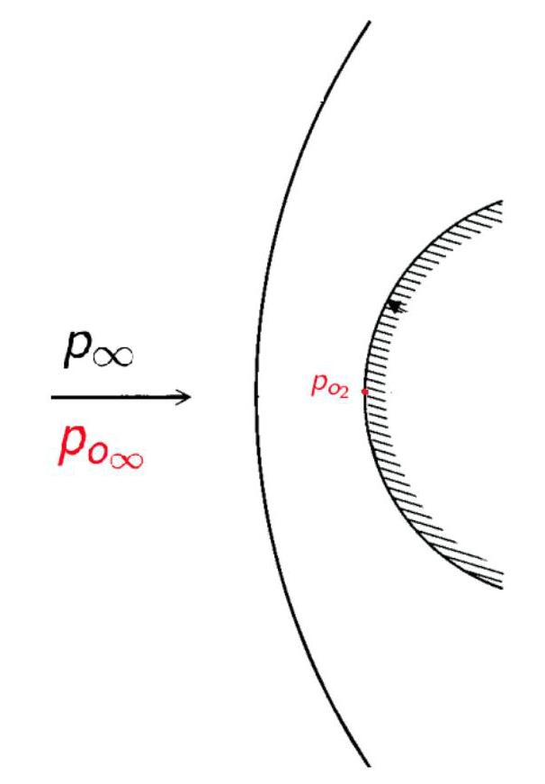

## Modified Newtonian Flow

Rayleigh pitot tube formula

$$
\frac{{p}_{{0}_{2}}}{{p}_{\infty }} = {\left\lbrack  \frac{{\left( \gamma  + 1\right) }^{2}{M}_{\infty }^{2}}{{4\gamma }{M}_{\infty }^{2} - 2\left( {\gamma  - 1}\right) }\right\rbrack  }^{\gamma /\left( {\gamma  - 1}\right) }\left\lbrack  \frac{1 - \gamma  + {2\gamma }{M}_{\infty }^{2}}{\gamma  + 1}\right\rbrack
$$

$$
{c}_{p,\max } = \frac{2}{\gamma {M}_{\infty }^{2}}\left\{  {{\left\lbrack  \frac{{\left( \gamma  + 1\right) }^{2}{M}_{\infty }^{2}}{{4\gamma }{M}_{\infty }^{2} - 2\left( {\gamma  - 1}\right) }\right\rbrack  }^{\gamma /\left( {\gamma  - 1}\right) }\left\lbrack  \frac{1 - \gamma  + {2\gamma }{M}_{\infty }^{2}}{\gamma  + 1}\right\rbrack   - 1}\right\}
$$

$$
\mathop{\lim }\limits_{{M \rightarrow  \infty }}{c}_{p,\max } = {\left\lbrack  \frac{{\left( \gamma  + 1\right) }^{2}}{4\gamma }\right\rbrack  }^{\gamma /\left( {\gamma  - 1}\right) }\frac{4}{\gamma  + 1} = \left\{  \begin{matrix} {1.839} & \gamma  = {1.4} \\  {2.0} & \gamma  = {1.0} \end{matrix}\right.
$$

## Modified Newtonian Flow

Example

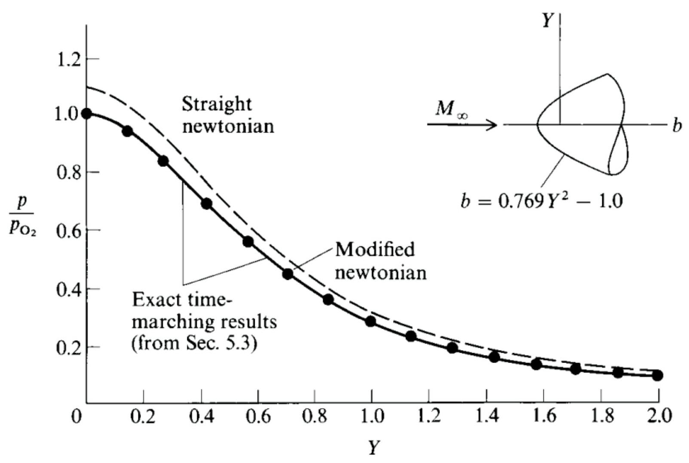

Fig. 3.9 Surface-pressure distribution over a paraboloid at ${M}_{\infty } = {8.0};{p}_{{\mathrm{O}}_{2}}$ is the total pressure behind a normal shock wave at ${M}_{\infty } = {8.0}$ .

# Tangent-Wedge Tangent-Cone Methods 切楔/切锥方法

Tangent-Wedge

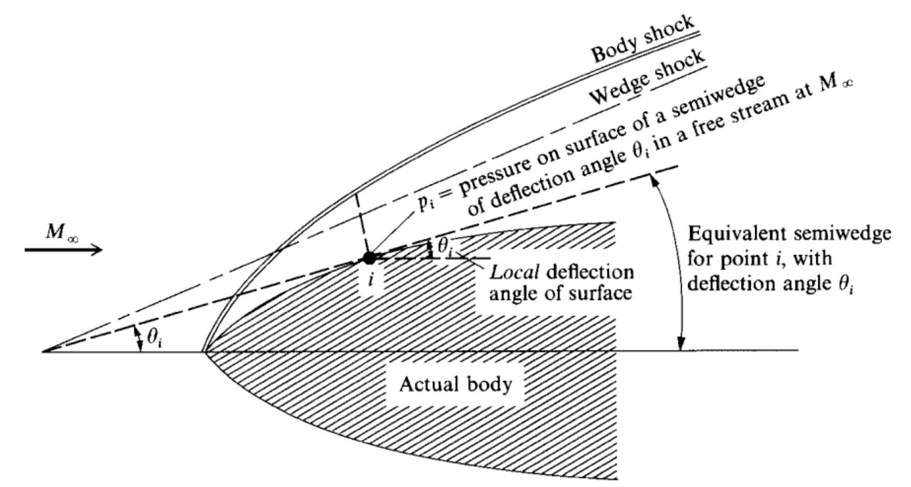

Fig. 3.17 Illustration of the tangent-wedge method.

Tangent-Cone

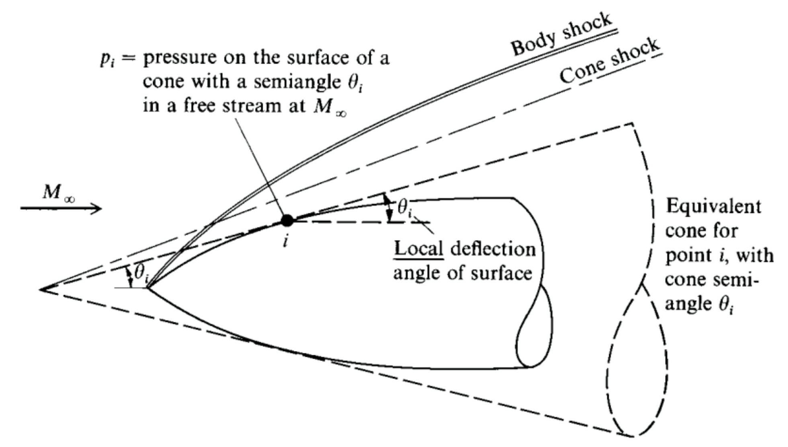

Fig. 3.18 Illustration of the tangent-cone method.

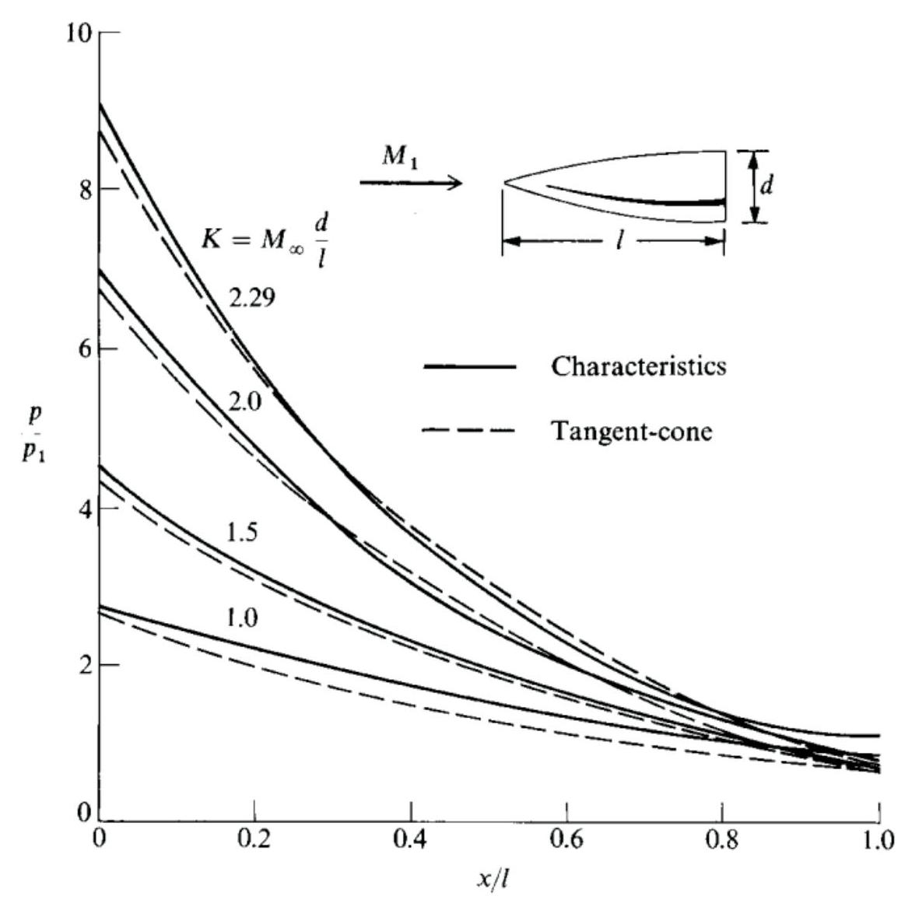

Fig. 3.20 Surface-pressure distributions for ogives of different slenderness ratio $d/l$ (from [19]).

## Shock-Expansion Method 激波膨胀法

Prandtl-Meyer expansion along the surface

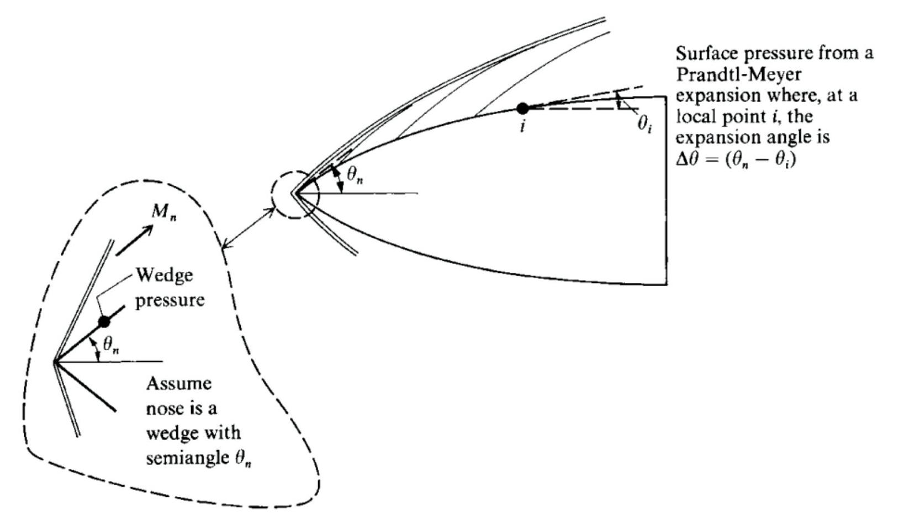

Fig. 3.21 Illustration of the shock-expansion method.

Assume the nose is a wedge with semiangle ${\theta }_{n}$ . Calculate ${M}_{n}$ and ${p}_{n}$ behind the oblique shock at the nose by means of exact oblique-shock theory

- Solve the local Mach number at point $i,{M}_{i}$ according to Prandtl Meyer equation

$$
{\Delta \theta } = {\theta }_{n} - {\theta }_{i}
$$

$$
= \left\lbrack  {\sqrt{\frac{\gamma  + 1}{\gamma  - 1}}{\tan }^{-1}\sqrt{\frac{\gamma  - 1}{\gamma  + 1}\left( {{M}_{n}^{2} - 1}\right) } - {\tan }^{-1}\sqrt{{M}_{n}^{2} - 1}}\right\rbrack
$$

$$
- \left\lbrack  {\sqrt{\frac{\gamma  + 1}{\gamma  - 1}}{\tan }^{-1}\sqrt{\frac{\gamma  - 1}{\gamma  + 1}\left( {{M}_{i}^{2} - 1}\right) } - {\tan }^{-1}\sqrt{{M}_{i}^{2} - 1}}\right\rbrack
$$

2 Calculate ${p}_{i}$ from the isentropic flow relation

$$
\frac{{p}_{i}}{{p}_{n}} = {\left\lbrack  \frac{1 + \left( {\gamma  - 1}\right) /2{M}_{n}^{2}}{1 + \left( {\gamma  - 1}\right) /2{M}_{i}^{2}}\right\rbrack  }^{\gamma /\left( {\gamma  - 1}\right) }
$$

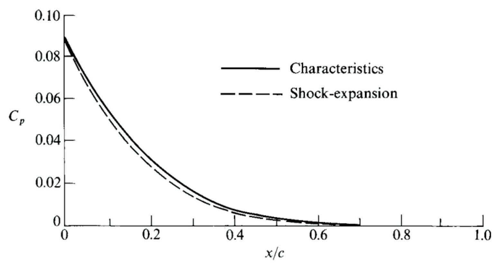

Fig. 3.22 Surface-pressure distribution over the same ${10}\%$ -thick airfoil as shown in Fig. 3.14; comparison of the shock-expansion method with exact results from the method of characteristics: ${M}_{\infty } = \infty$ (from [20]).

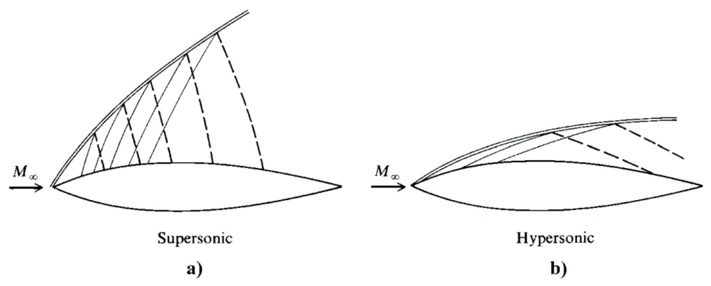

Fig. 3.24 Schematic of shock-wave and Mach-wave patterns: a) supersonic and b) hypersonic.

Shock-expansion theory ignores the effect of these reflected waves on the body surface pressure. Therefore, the real hypersonic picture satisfies the assumption of shock-expansion theory more closely than the supersonic picture, and it is no surprise that shock-expansion theory yields better agreement at higher Mach numbers.

## Applications 应用

## HAPB

The Hypersonic Arbitrary Body program (HABP), developed by the Douglas Aircraft Company in 1964, the code was greatly expanded in 1973, and then further updated in 1980.

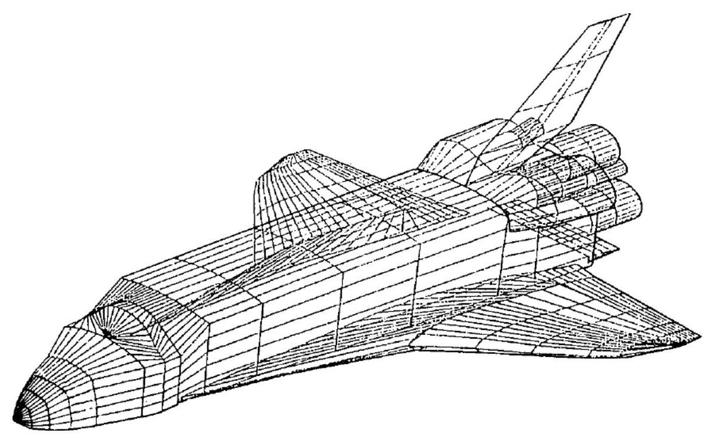

Fig. 3.25 Panel distribution over the space shuttle for an HAPB calculation (from Fisher [225]).

## CBAERO

By Kinney at the NASA Ames Research Center

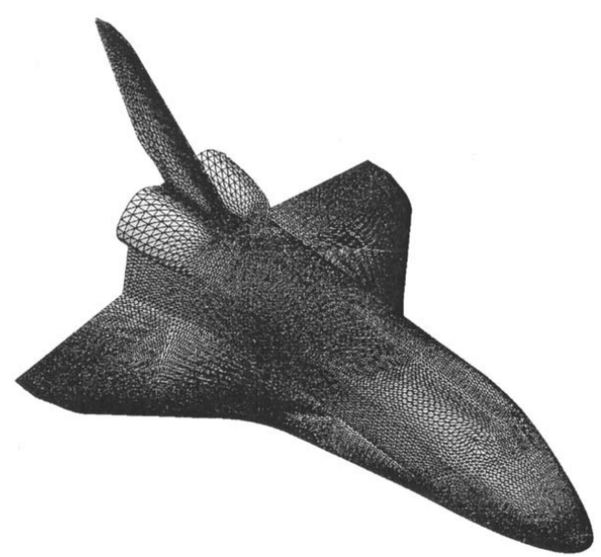

Fig. 3.29 Unstructured triangulated surface for the space shuttle (from Kinney and Garcia [229]).

CBAERO

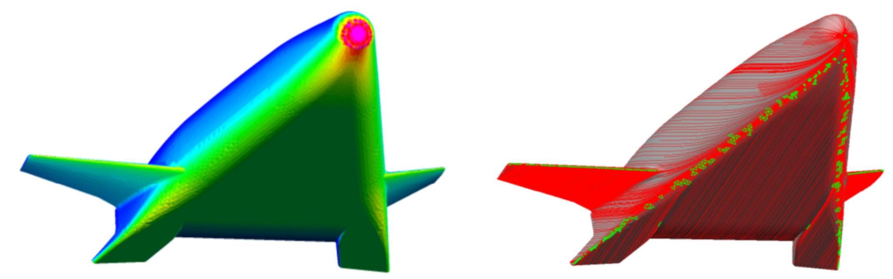

Figure: Surface ${c}_{p}$ contour (left) and surface streamlines (right).

VECC

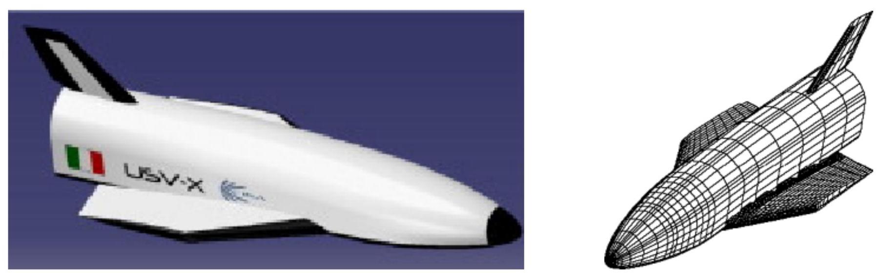

Giuseppe Pezzella, Hypersonic environment assessment of the CIRA FTB-X re-entry vehicle, Aerospace Science and Technology, Volume 25, Issue 1, March 2013, Pages 190-202.

VECC

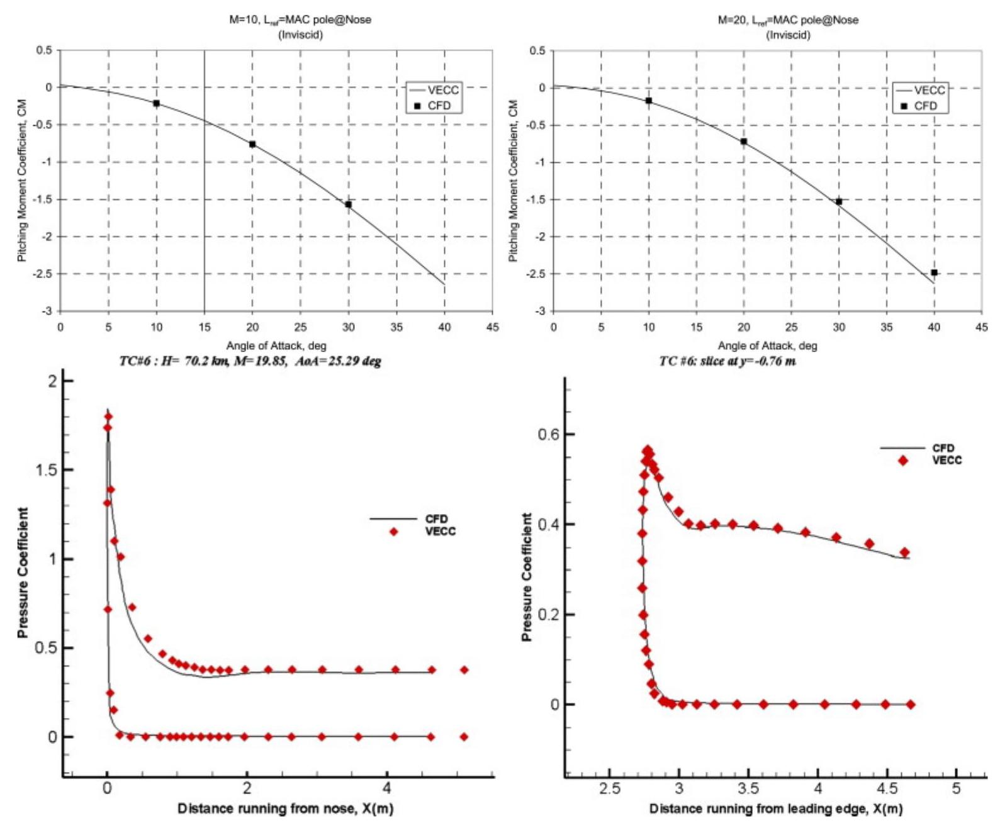

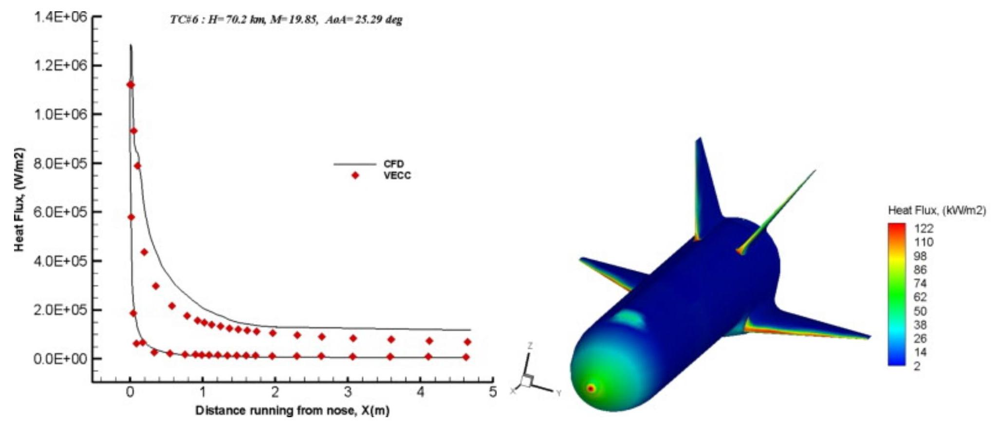

Figure: Surface heat flux distribution at staging conditions for equilibrium turbulent flow. ${M}_{\infty } = 9,\alpha  = {5}^{ \circ  }, H = {55.7}\mathrm{\;{Km}},{T}_{w} = {300}\mathrm{\;K}$