当地表面斜度法

李文丰西北工业大学 w.li@nwpu.edu.cn 2022年10月16日

前情提要-高超声速流动特点

- Thin Shock Layers (激波层变薄、湍流相互作用)

- Entropy Layer (等熵假设失效)

- Viscous Interaction

- High-Temperature Flows

- Low-Density Flow (高空、分子自由程)

$$
\frac{{p}_{2}}{{p}_{1}} = 1 + \frac{2\gamma }{\gamma  + 1}\left( {M{a}_{1}^{2}{\sin }^{2}\beta  - 1}\right)
$$

$$
\frac{{T}_{2}}{{T}_{1}} = \frac{\left( {p}_{2}/{p}_{1}\right) }{\left( {\rho }_{2}/{\rho }_{1}\right) }
$$

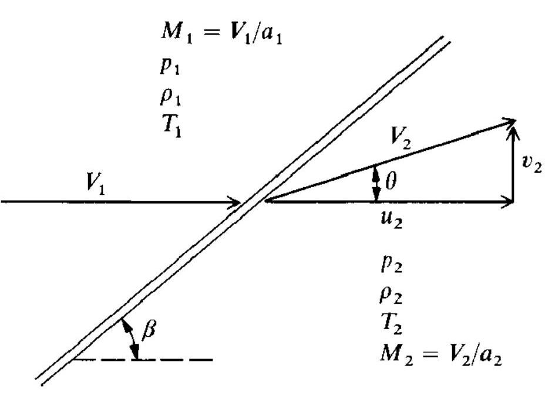

准

$$
\frac{{\rho }_{2}}{{\rho }_{1}} = \frac{\left( {\gamma  + 1}\right) M{a}_{1}^{2}{\sin }^{2}\beta }{\left( {\gamma  - 1}\right) M{a}_{1}^{2}{\sin }^{2}\beta  + 2}
$$

确

解

$$
\frac{{u}_{2}}{{V}_{1}} = 1 - \frac{2\left( {M{a}_{1}^{2}{\sin }^{2}\beta  - 1}\right) }{\left( {\gamma  + 1}\right) M{a}_{1}^{2}}
$$

$$
\frac{{v}_{2}}{{V}_{1}} = \frac{2\left( {M{a}_{1}^{2}{\sin }^{2}\beta  - 1}\right) \cos \beta }{\left( {\gamma  + 1}\right) M{a}_{1}^{2}}
$$

前情提要-高超声速激波-膨胀波关系

- 压强比

$$
\frac{{p}_{2}}{{p}_{1}} = 1 + \frac{2\gamma }{\gamma  + 1}\left( {{M}_{1}^{2}{\sin }^{2}\beta  - 1}\right)
$$

$$
{M}_{1}^{2}{\sin }^{2}\beta  \gg  1
$$

$$
\frac{{p}_{2}}{{p}_{1}} = \frac{2\gamma }{\gamma  + 1}{M}_{1}^{2}{\sin }^{2}\beta
$$

- 密度比

$$
\frac{{\rho }_{2}}{{\rho }_{1}} = \frac{\left( {\gamma  + 1}\right) {M}_{1}^{2}{\sin }^{2}\beta }{\left( {\gamma  - 1}\right) {M}_{1}^{2}{\sin }^{2}\beta  + 2}
$$

$$
\frac{{\rho }_{2}}{{\rho }_{1}} = \frac{\gamma  + 1}{\gamma  - 1}
$$

前情提要-高超声速激波-膨胀波关系

In the hypersonic limit

$$
\frac{{p}_{2}}{{p}_{1}} \rightarrow  \frac{2\gamma }{\gamma  + 1}{M}_{1}^{2}{\sin }^{2}\beta
$$

$$
\frac{{\rho }_{2}}{{\rho }_{1}} \rightarrow  \frac{\gamma  + 1}{\gamma  - 1}
$$

$\frac{{T}_{2}}{{T}_{1}} \rightarrow  \frac{{2\gamma }\left( {\gamma  - 1}\right) }{{\left( \gamma  + 1\right) }^{2}}{M}_{1}^{2}{\sin }^{2}\beta \; \frac{{u}_{2}}{{V}_{1}} \rightarrow  1 - \frac{2{\sin }^{2}\beta }{\gamma  + 1} \; \frac{{v}_{2}}{{V}_{1}} \rightarrow  \frac{\sin \left( {2\beta }\right) }{\gamma  + 1} \; {C}_{p} \rightarrow  \left( \frac{4}{\gamma  + 1}\right) {\sin }^{2}\beta$

In the hypersonic limit

and for small $\theta$

$$
\beta  \rightarrow  \frac{\gamma  + 1}{2}\theta
$$

比精确公式更加简单在一些关系中，Mach 数消失了

## 目录

- 牛顿流

Newtonian Flow

类切割/切锥方法

Tangent-Wedge Tangent-Cone Methods

* 激波膨胀法

Shock-Expansion Method

- 应用

Applications

## 牛顿流 Newtonian Flow

## 牛顿理论

假设:粒子流撞击到物体表面时，粒子垂直于物面的动量分量会全部消失, 沿切线方向不变, 且粒子流将沿着物面切向运动

质量流量: $m = {\rho }_{\infty }\left( {{V}_{\infty }\sin {\theta A}}\right) {\delta t}$ 动量变化率: $P = m{V}_{\infty }\sin \theta$

$$
= {\rho }_{\infty }{\left( {V}_{\infty }\sin \theta \right) }^{2}{A\delta t}
$$

$$
p - {p}_{\infty } = \frac{F}{A} = \frac{P/{\delta t}}{A}
$$

$$
= {\rho }_{\infty }{\left( {V}_{\infty }\sin \theta \right) }^{2}
$$

压力系数: ${C}_{p} = \frac{p - {p}_{\infty }}{\frac{1}{2}{\rho }_{\infty }{V}_{\infty }^{2}} = 2\sin \theta$

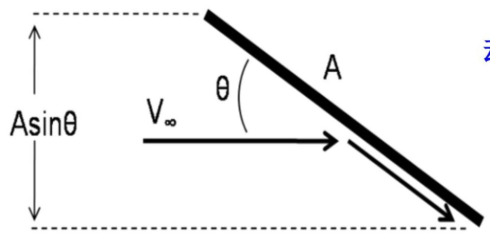

Figure 1. Momentum Transfer of Particle on Inclined Surface. ${}^{2}$

牛顿正弦平方定律

牛顿理论

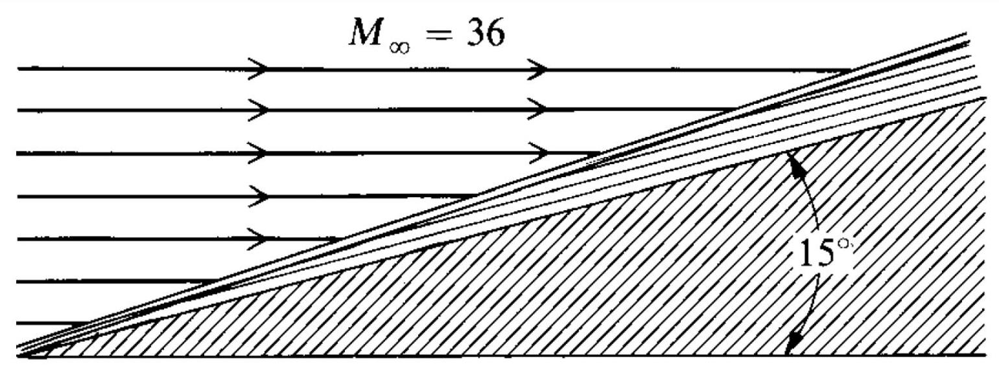

Ma=36的15°尖楔流动

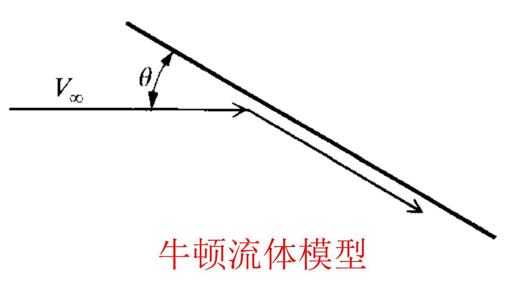

## 牛顿理论

二维三维

n = unit normal vector at $P$

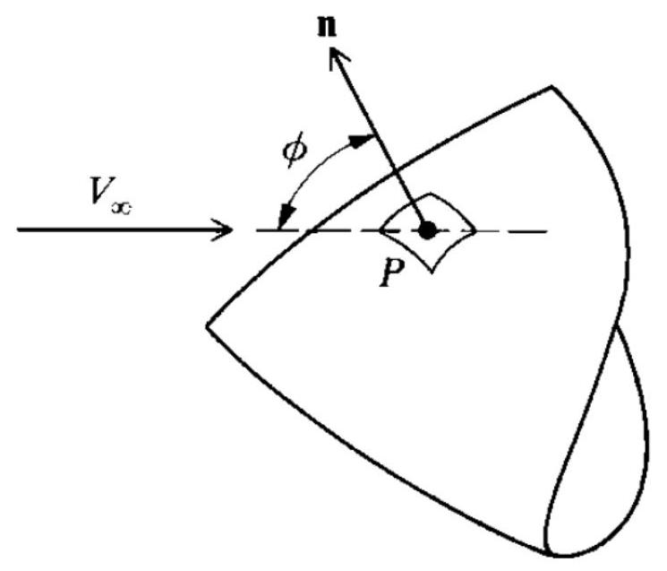

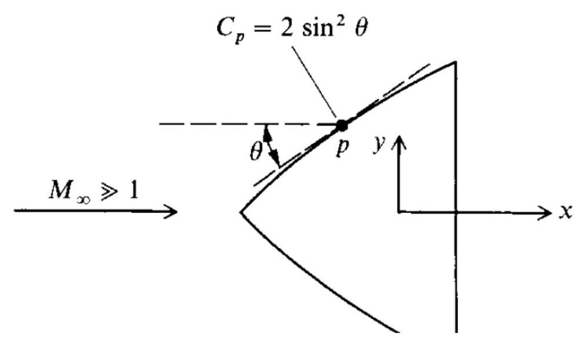

矢量标量乘积和三角关系:

$$
{\mathbf{V}}_{\infty } \cdot  \mathbf{n} = \left| {V}_{\infty }\right| \cos \phi  = \left| {V}_{\infty }\right| \sin \left( {\frac{\pi }{2} - \phi }\right)
$$

三维物体表面压力系数:

由于 $\theta  = \pi /2 - \phi$

$$
{C}_{p} = 2{\sin }^{2}\theta
$$

$$
{V}_{\infty } \cdot  \mathbf{n} = \left| {V}_{\infty }\right| \sin \theta
$$

$$
\sin \theta  = \frac{{V}_{\infty }}{\left| {V}_{\infty }\right| } \cdot  \mathbf{n}
$$

其中: $\sin \theta  = \frac{{V}_{\infty }}{\left| {V}_{\infty }\right| } \cdot  \mathbf{n}$

牛顿理论

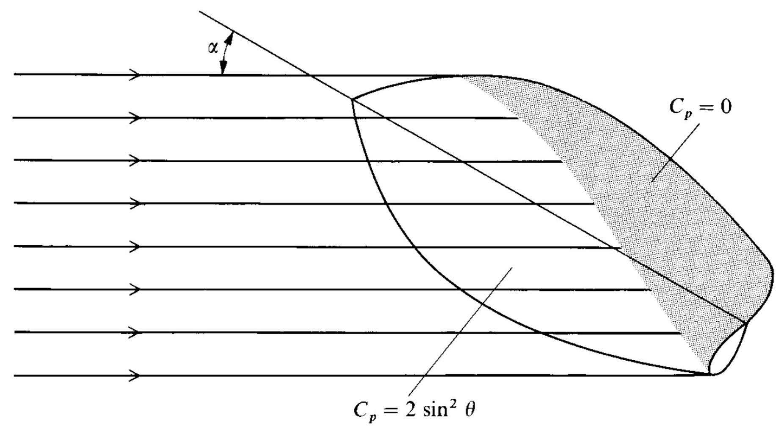

牛顿理论流动模型中, 粒子仅仅撞击迎风面，不可能绕过物面弯曲或者撞击背面

牛顿理论应用

平板模型

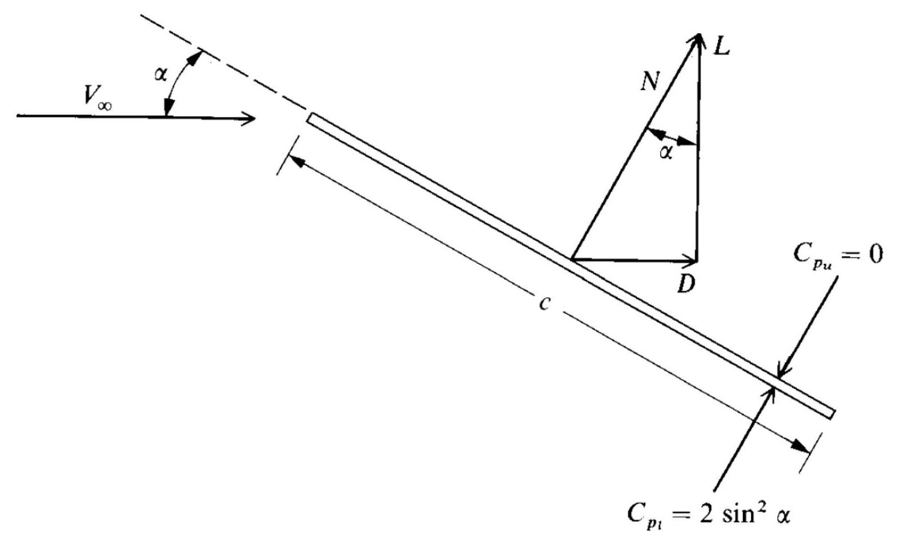

升力系数 ${c}_{l} = 2{\sin }^{2}\alpha \cos \alpha$

阻力系数 ${c}_{d} = 2{\sin }^{3}\alpha$

升阻比

$$
\frac{L}{D} = \cot \alpha
$$

牛顿理论应用

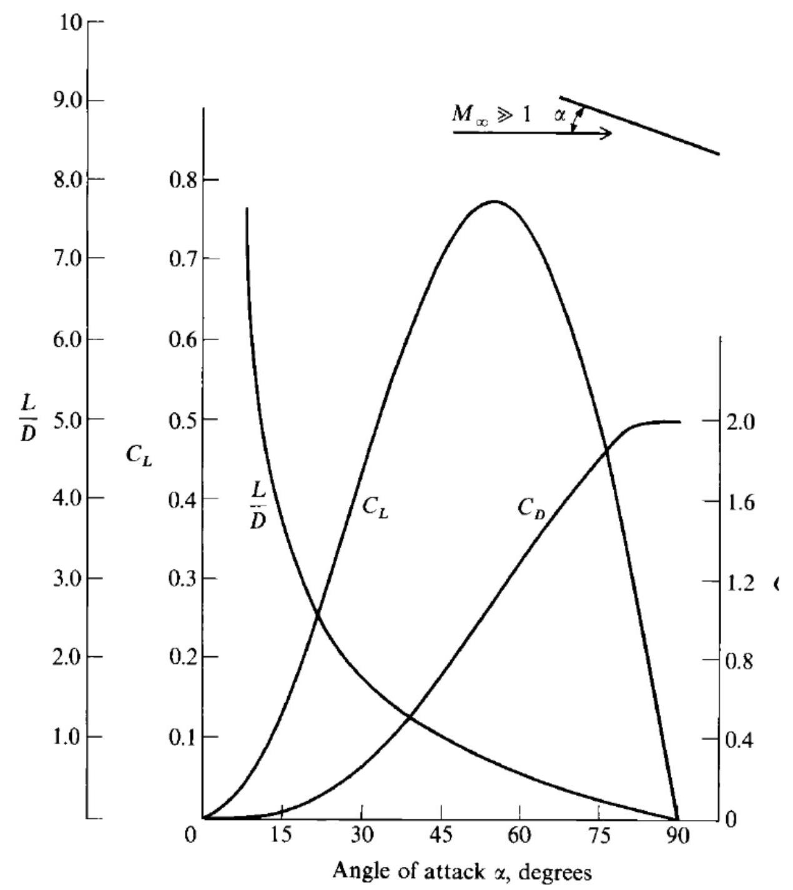

平板模型的牛顿解

(1)L/D随α减小而单调递增;

(2)升力在α约等于55 度达到顶峰;

(3)低迎角下，升力系数随 $\alpha$ 时强非线性地变化

牛顿理论应用

无限展长的圆柱体:

$$
{c}_{d} = \frac{4}{3}
$$

球体:

${C}_{D} = 1$

## 修正牛顿理论

Problem: It dosen't consider that total pressure decreases after the shock wave.

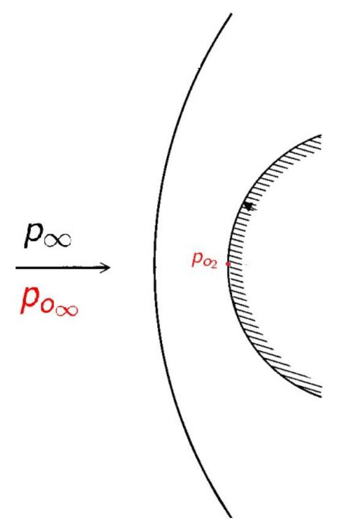

莱斯特.利斯 (Lester Lees) :

$$
{c}_{p} = {c}_{p,\max }{\sin }^{2}\theta
$$

$$
{c}_{p,\max } = \frac{{p}_{{O}_{2}} - {p}_{\infty }}{\frac{1}{2}{\rho }_{\infty }{V}_{\infty }^{2}} = 2\frac{{p}_{{O}_{2}} - {p}_{\infty }}{\gamma {p}_{\infty }{M}_{\infty }^{2}}\;
$$

$$
= \frac{2}{\gamma {M}_{\infty }^{2}}\left\lbrack  {\frac{{p}_{{o}_{2}}}{{p}_{\infty }} - 1}\right\rbrack
$$

## 修正牛顿理论

瑞利皮托管公式

$$
\frac{{p}_{{0}_{2}}}{{p}_{\infty }} = {\left\lbrack  \frac{{\left( \gamma  + 1\right) }^{2}{M}_{\infty }^{2}}{{4\gamma }{M}_{\infty }^{2} - 2\left( {\gamma  - 1}\right) }\right\rbrack  }^{\gamma /\left( {\gamma  - 1}\right) }\left\lbrack  \frac{1 - \gamma  + {2\gamma }{M}_{\infty }^{2}}{\gamma  + 1}\right\rbrack
$$

$$
{c}_{p,\max } = \frac{2}{\gamma {M}_{\infty }^{2}}\left\{  {{\left\lbrack  \frac{{\left( \gamma  + 1\right) }^{2}{M}_{\infty }^{2}}{{4\gamma }{M}_{\infty }^{2} - 2\left( {\gamma  - 1}\right) }\right\rbrack  }^{\gamma /\left( {\gamma  - 1}\right) }\left\lbrack  \frac{1 - \gamma  + {2\gamma }{M}_{\infty }^{2}}{\gamma  + 1}\right\rbrack   - 1}\right\}
$$

$$
\mathop{\lim }\limits_{{M \rightarrow  \infty }}{c}_{p,\max } = {\left\lbrack  \frac{{\left( \gamma  + 1\right) }^{2}}{4\gamma }\right\rbrack  }^{\gamma /\left( {\gamma  - 1}\right) }\frac{4}{\gamma  + 1} = \left\{  \begin{array}{rr} {1.839} & \gamma  = {1.4} \\  {2.0} & \gamma  = {1.0} \end{array}\right.
$$

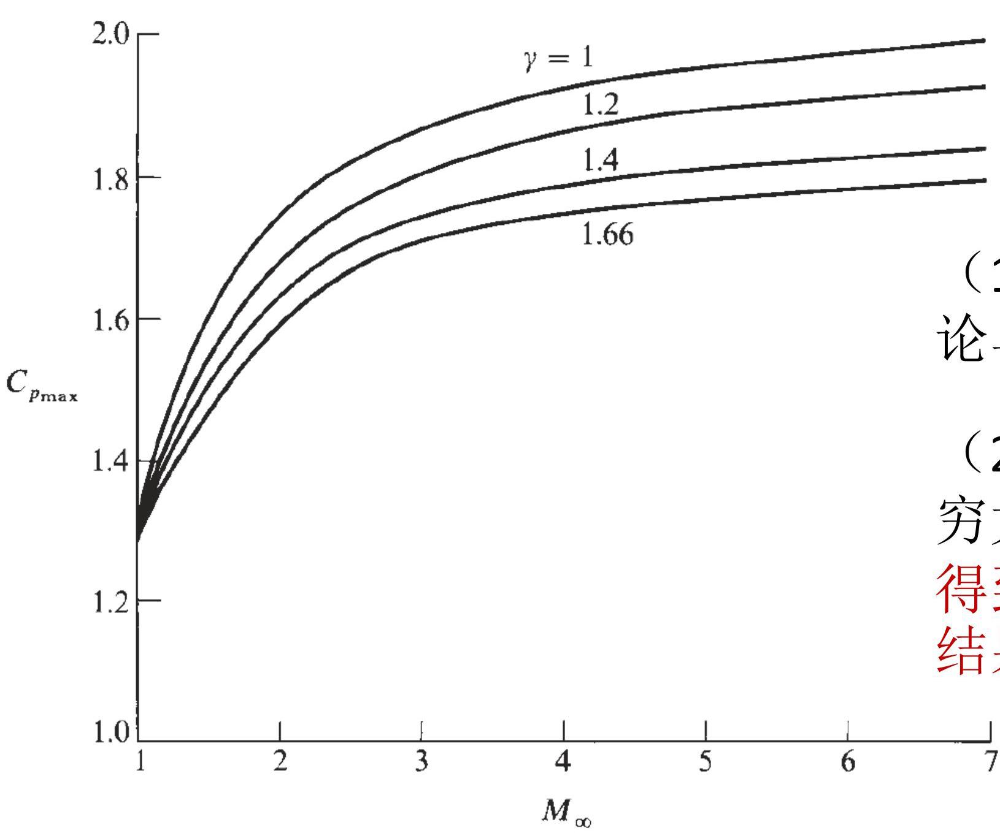

(1)修正的牛顿理论与马赫数相关;

(2)当Ma趋向无穷大, $\gamma$ 趋近与1时, 得到直接牛顿理论结果

滞止压强系数随Ma数和γ变化的曲线

## 修正牛顿理论

## 举例

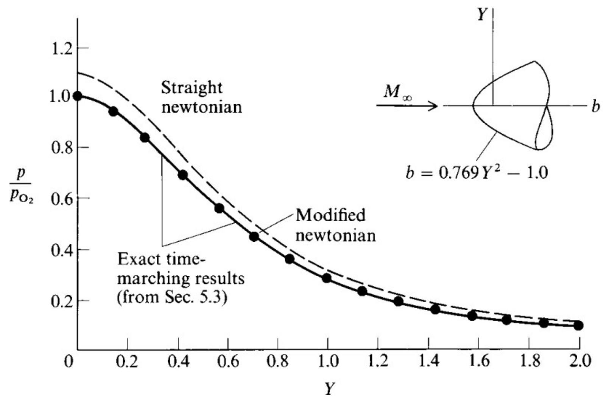

Fig. 3.9 Surface-pressure distribution over a paraboloid at ${M}_{\infty } = {8.0};{p}_{{\mathrm{O}}_{2}}$ is the total pressure behind a normal shock wave at ${M}_{\infty } = {8.0}$ .

切楔/切锥方法 Tangent-Wedge Tangent-Cone Methods

切楔方法

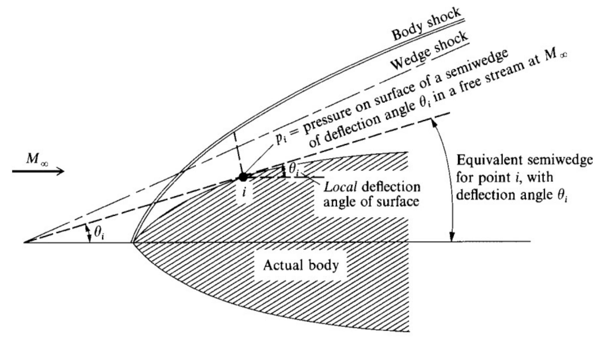

Fig. 3.17 Illustration of the tangent-wedge method.

## 切锥方法

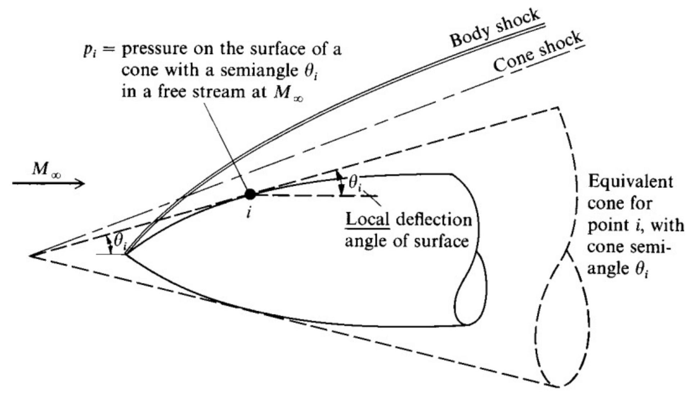

Fig. 3.18 Illustration of the tangent-cone method.

举例

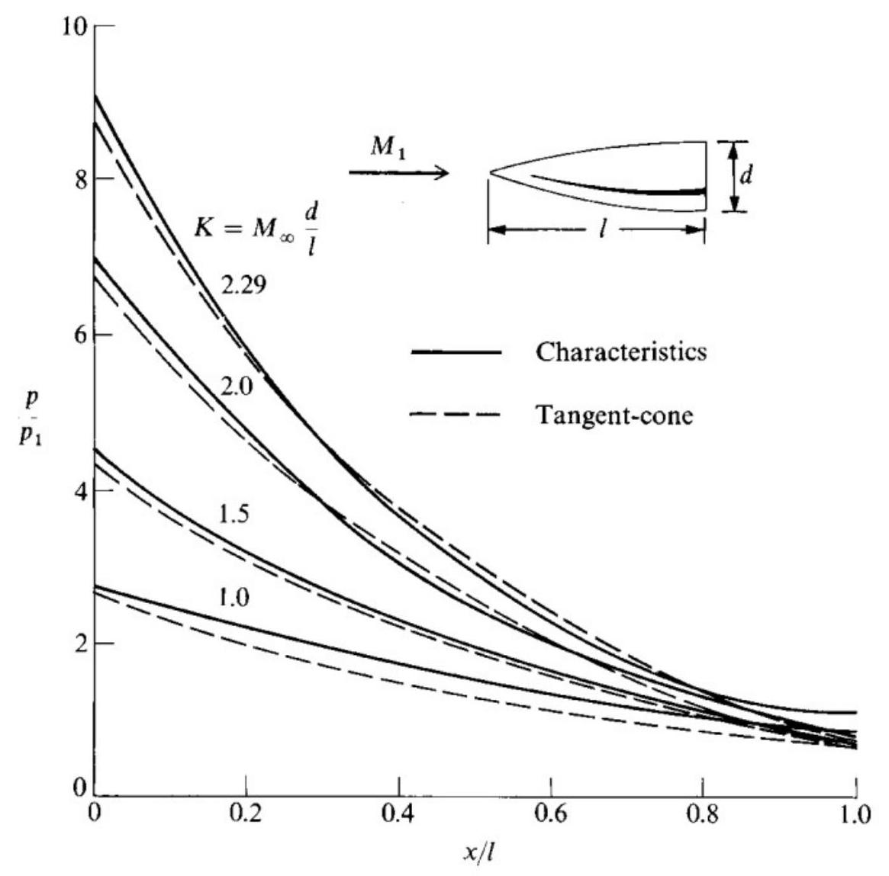

Fig. 3.20 Surface-pressure distributions for ogives of different slenderness ratio $d/l$ (from [19]).

激波-膨胀波法 Shock-Expansion Method

## Prandtl-Meyer expansion along the surface

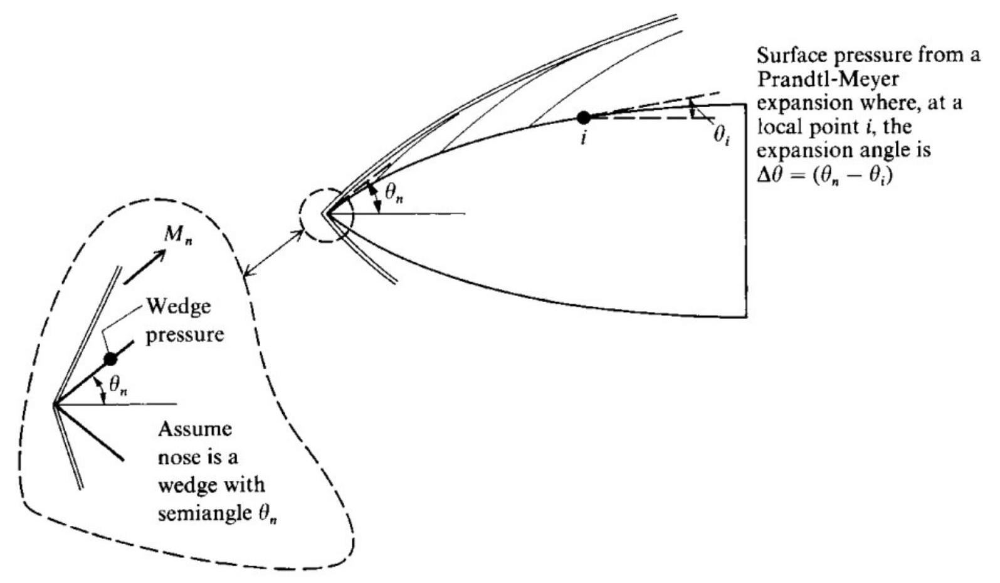

Fig. 3.21 Illustration of the shock-expansion method.

Assume the nose is a wedge with semiangle ${\theta }_{n}$ . Calculate ${M}_{n}$ and ${p}_{n}$ behind the oblique shock at the nose by means of exact oblique-shock theory

## Prandtl-Meyer expansion along the surface

1 Solve the local Mach number at point $i,{M}_{i}$ according to Prandtl Meyer equation

$$
{\Delta \theta } = {\theta }_{n} - {\theta }_{i}
$$

$$
= \left\lbrack  {\sqrt{\frac{\gamma  + 1}{\gamma  - 1}}{\tan }^{-1}\sqrt{\frac{\gamma  - 1}{\gamma  + 1}\left( {{M}_{n}^{2} - 1}\right) } - {\tan }^{-1}\sqrt{{M}_{n}^{2} - 1}}\right\rbrack
$$

$$
- \left\lbrack  {\sqrt{\frac{\gamma  + 1}{\gamma  - 1}}{\tan }^{-1}\sqrt{\frac{\gamma  - 1}{\gamma  + 1}\left( {{M}_{i}^{2} - 1}\right) } - {\tan }^{-1}\sqrt{{M}_{i}^{2} - 1}}\right\rbrack
$$

2 Calculate ${p}_{i}$ from the isentropic flow relation

$$
\frac{{p}_{i}}{{p}_{n}} = {\left\lbrack  \frac{1 + \left( {\gamma  - 1}\right) /2{M}_{n}^{2}}{1 + \left( {\gamma  - 1}\right) /2{M}_{i}^{2}}\right\rbrack  }^{\gamma /\left( {\gamma  - 1}\right) }
$$

Prandtl-Meyer expansion along the surface

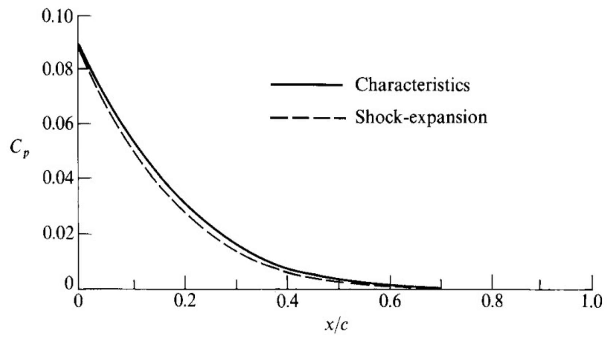

Fig. 3.22 Surface-pressure distribution over the same ${10}\%$ -thick airfoil as shown in Fig. 3.14; comparison of the shock-expansion method with exact results from the method of characteristics: ${M}_{\infty } = \infty$ (from [20]).

Prandtl-Meyer expansion along the surface

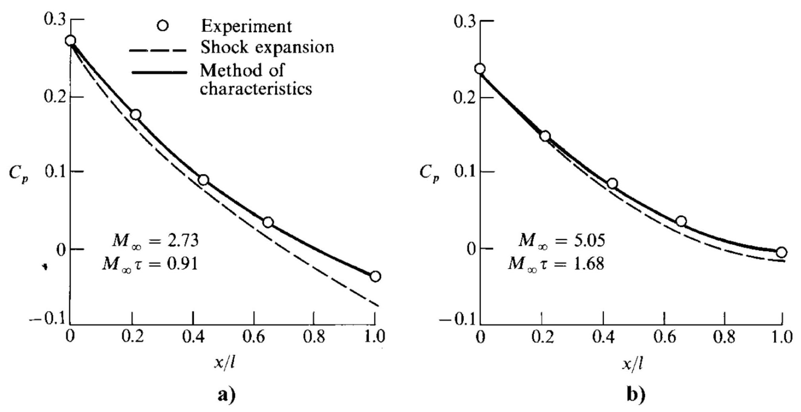

Fig. 3.23 Pressure distribution over an ogive with $d/l = 1/3$ at zero angle of attack with $\gamma  = {1.4}$ (from [21]): a) supersonic case and b) hypersonic case.

Prandtl-Meyer expansion along the surface

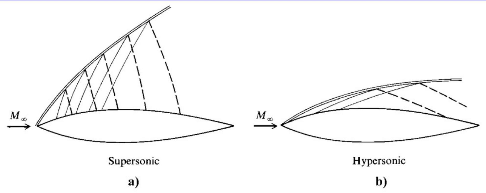

Fig. 3.24 Schematic of shock-wave and Mach-wave patterns: a) supersonic and b) hypersonic.

Shock-expansion theory ignores the effect of these reflected waves on the body surface pressure. Therefore, the real hypersonic picture satisfies the assumption of shock-expansion theory more closely than the supersonic picture, and it is no surprise that shock-expansion theory yields better agreement at higher Mach numbers.

## Applications 应用

## HAPB

The Hypersonic Arbitrary Body program (HABP), developed by the Douglas Aircraft Company in 1964, the code was greatly expanded in 1973, and then further updated in 1980.

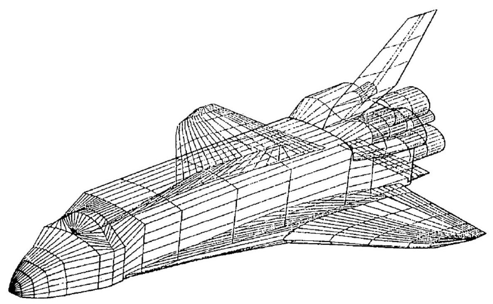

Fig. 3.25 Panel distribution over the space shuttle for an HAPB calculation (from Fisher [225]).

http://www.pdas.com/

CBAERO

By Kinney at the NASA Ames Research Center

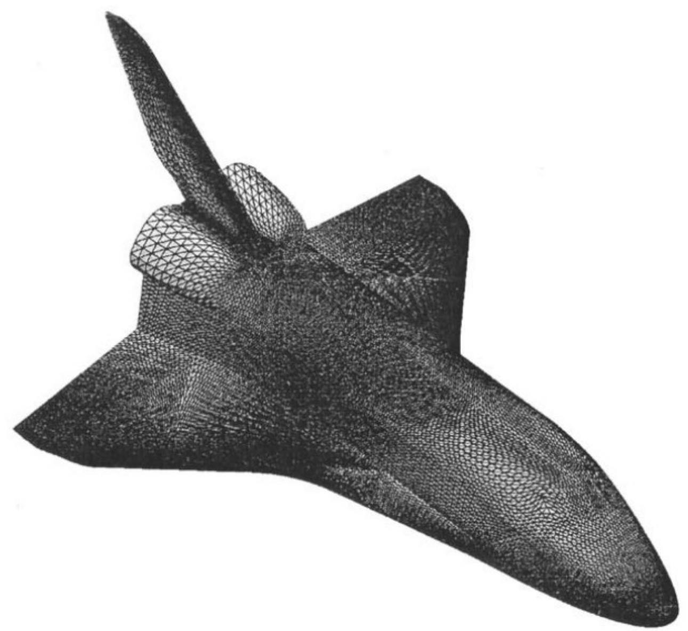

Fig. 3.29 Unstructured triangulated surface for the space shuttle (from Kinney and Garcia [229]).

CBAERO

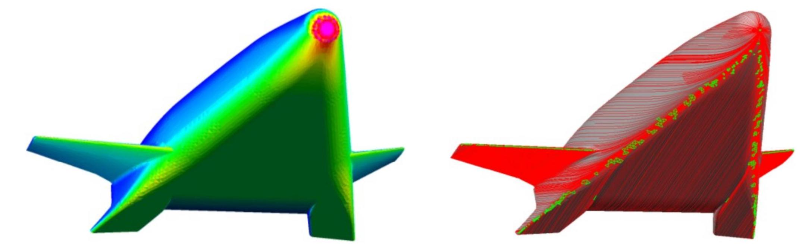

Figure: Surface ${c}_{p}$ contour (left) and surface streamlines (right).

VECC

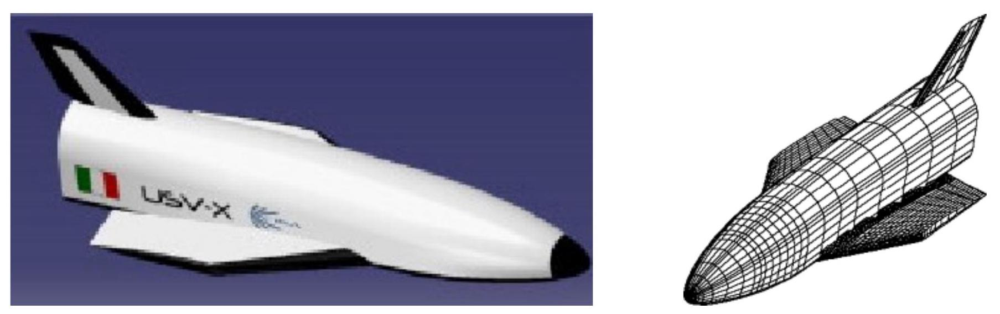

Giuseppe Pezzella, Hypersonic environment assessment of the CIRA FTB-X re-entry vehicle, Aerospace Science and Technology, Volume 25, Issue 1, March 2013, Pages 190-202.

## VECC

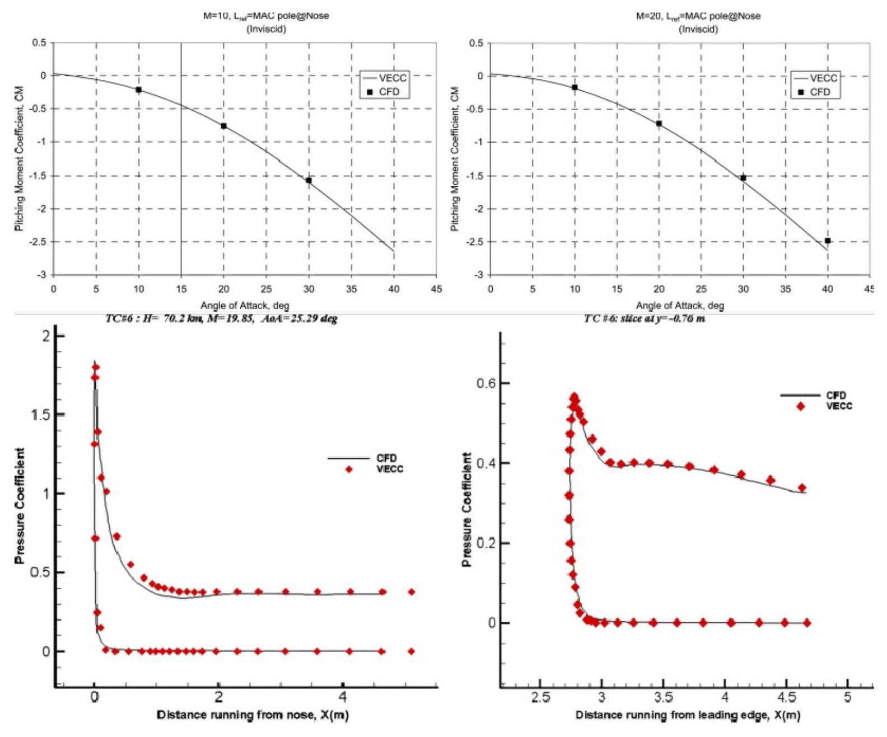

VECC

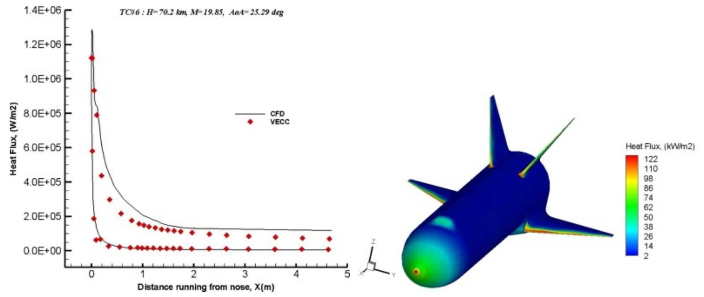

Figure: Surface heat flux distribution at staging conditions for equilibrium turbulent flow. ${M}_{\infty } = 9,\alpha  = {5}^{ \circ  }, H = {55.7}\mathrm{{Km}},{T}_{w} = {300}\mathrm{\;K}$