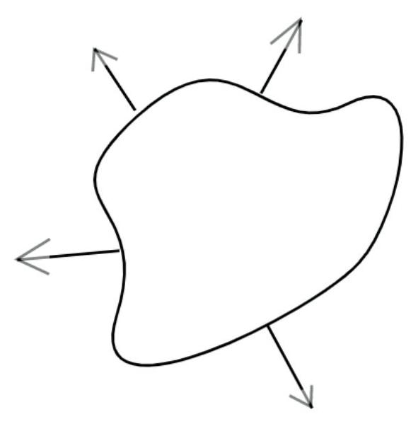
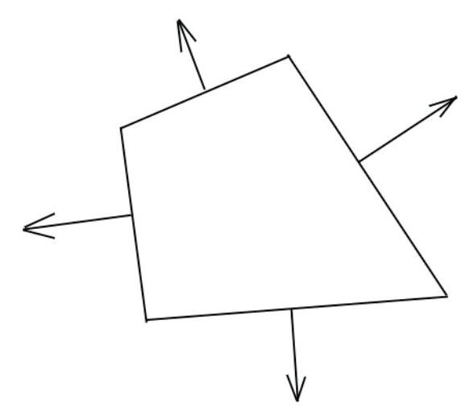
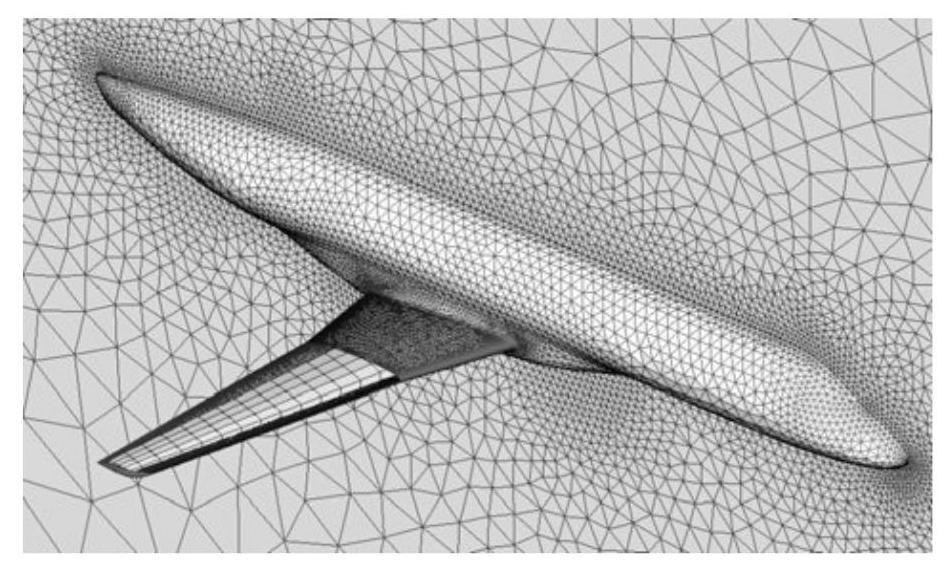
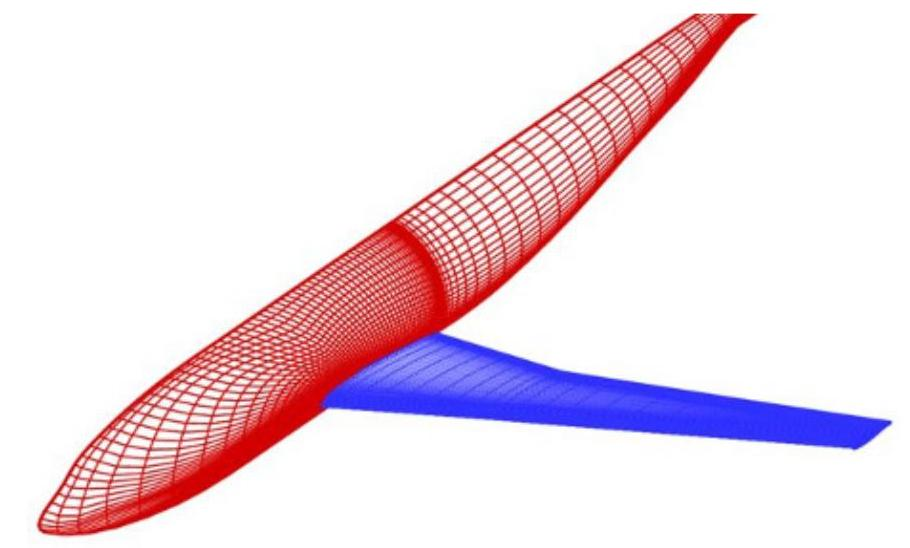
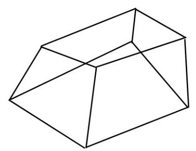
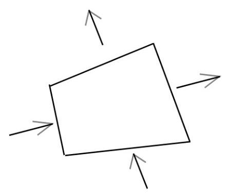
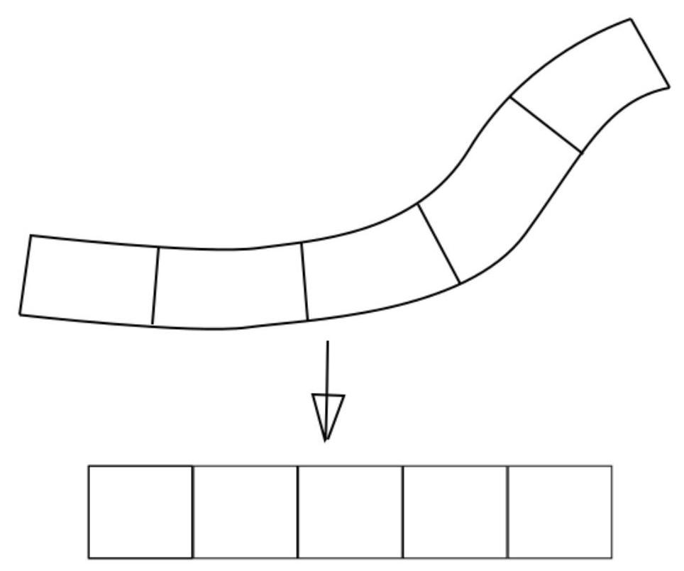
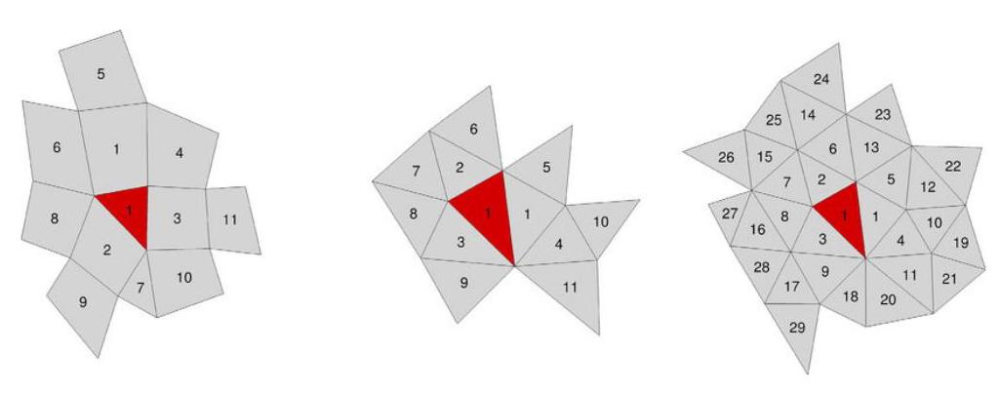

CFD 入门

屈崑

Northwestern Polytechnical Univ.

kunqu@nwpu.edu.cn

September 30, 2021

## Overview

二维 Euler 方程

## 二维 Euler 方程

## 2D Euler Equations

$$
\frac{\partial }{\partial t}\left\lbrack  \begin{matrix} \rho \\  {\rho u} \\  {\rho v} \\  {\rho E} \end{matrix}\right\rbrack   + \frac{\partial }{\partial x}\left\lbrack  \begin{matrix} {\rho u} \\  {\rho uu} + p \\  {\rho uv} \\  \left( {{\rho E} + p}\right) u \end{matrix}\right\rbrack   + \frac{\partial }{\partial y}\left\lbrack  \begin{matrix} {\rho v} \\  {\rho vu} \\  {\rho vv} + p \\  \left( {{\rho E} + p}\right) v \end{matrix}\right\rbrack   = 0
$$

矢量形式

$$
\frac{\partial \mathbf{w}}{\partial t} + \frac{\partial \mathbf{f}\left( \mathbf{w}\right) }{\partial x} + \frac{\partial \mathbf{g}\left( \mathbf{w}\right) }{\partial y} = 0
$$

其中

$$
\mathbf{w} = {\left\lbrack  \rho ,\rho u,\rho v,\rho E\right\rbrack  }^{T}
$$

FVM 形式

对 Euler 方程在单元 $\Omega$ 内进行空间积分

$$
{\int }_{\Omega }\frac{\partial \mathbf{w}}{\partial t}\mathrm{\;d}x\mathrm{\;d}y + {\int }_{\Omega }\left\lbrack  {\frac{\partial \mathbf{f}\left( \mathbf{w}\right) }{\partial x} + \frac{\partial \mathbf{g}\left( \mathbf{w}\right) }{\partial y}}\right\rbrack  \mathrm{d}x\mathrm{\;d}y = 0
$$

$$
\Omega \frac{\mathrm{d}\overline{\mathbf{w}}}{\mathrm{d}t} + {\oint }_{\Gamma }\left\lbrack  \begin{array}{l} \mathrm{f} \\  \mathbf{g} \end{array}\right\rbrack   \cdot  \left\lbrack  \begin{array}{l} \mathrm{d}{s}_{x} \\  \mathrm{\;d}{s}_{y} \end{array}\right\rbrack   = 0
$$

$$
\Omega \frac{\mathrm{d}\overline{\mathbf{w}}}{\mathrm{d}t} + {\oint }_{\Gamma }\left( {\mathbf{f}{n}_{x} + \mathbf{g}{n}_{y}}\right) \mathrm{d}s = 0
$$

注意法向朝外

$\Gamma$ 为单元 $\Omega$ 的边界，单元平均值 $\overline{\mathbf{w}}$ 定义为

$$
\overline{\mathbf{w}} = \frac{{\int }_{\Omega }\mathbf{w}\left( {x, y}\right) \mathrm{d}x\mathrm{\;d}x}{\Omega }
$$

因此关键也在于边界 $\Gamma$ 的法向通量 $\mathbf{f}{n}_{x} + \mathbf{g}{n}_{y}$ 的计算。

## FVM 形式

单元通常采用多边形, 整体边界的积分被分解为多个子边界积分的和

$$
\Omega \frac{\mathrm{d}\overline{\mathbf{w}}}{\mathrm{d}t} + \mathop{\sum }\limits_{k}{\oint }_{{\Gamma }_{k}}\left( {{\mathbf{f}}_{k}{n}_{x} + {\mathbf{g}}_{k}{n}_{y}}\right) \mathrm{d}s = 0
$$

在 $\mathbf{f}$ 和 $\mathbf{g}$ 在 ${\Gamma }_{k}$ 上呈线性分布假设情况下, 我们只需要计算 ${\Gamma }_{k}$ 中心的法向通量作为平均法向通量即可。

$$
\Omega \frac{\mathrm{d}\overline{\mathbf{w}}}{\mathrm{d}t} + \mathop{\sum }\limits_{k}\left( {{\overline{\mathbf{f}}}_{k}{n}_{x} + {\overline{\mathbf{g}}}_{k}{n}_{y}}\right) \Delta {s}_{k} = 0
$$

## 非结构化网格

$$
\Omega \frac{\mathrm{d}\overline{\mathbf{w}}}{\mathrm{d}t} + \mathop{\sum }\limits_{k}\left( {{\overline{\mathbf{f}}}_{k}{n}_{x} + {\overline{\mathbf{g}}}_{k}{n}_{y} + {\overline{\mathbf{h}}}_{k}{n}_{z}}\right) \Delta {s}_{k} = 0
$$

## 结构化网格

Cell [i, j, k] Cell [i, j]

$$
\Omega \frac{\mathrm{d}{\overline{\mathbf{w}}}_{i, j, k}}{\mathrm{\;d}t}
$$

$$
+ \left\lbrack  {{\left( \overline{\mathbf{f}}{n}_{x} + \overline{\mathbf{g}}{n}_{y}\right) }_{i + 1/2, j, k}\Delta {s}_{i + 1/2, j, k} - {\left( \overline{\mathbf{f}}{n}_{x} + \overline{\mathbf{g}}{n}_{y}\right) }_{i - 1/2, j, k}\Delta {s}_{i - 1/2, j, k}}\right\rbrack
$$

$$
+ \left\lbrack  {{\left( \overline{\mathbf{f}}{n}_{x} + \overline{\mathbf{g}}{n}_{y}\right) }_{i, j + 1/2, k}\Delta {s}_{i, j + 1/2, k} - {\left( \overline{\mathbf{f}}{n}_{x} + \overline{\mathbf{g}}{n}_{y}\right) }_{i, j - 1/2, k}\Delta {s}_{i, j - 1/2, k}}\right\rbrack
$$

$$
+ \left\lbrack  {{\left( \overline{\mathbf{f}}{n}_{x} + \overline{\mathbf{g}}{n}_{y}\right) }_{i, j, k + 1/2}\Delta {s}_{i, j, k + 1/2} - {\left( \overline{\mathbf{f}}{n}_{x} + \overline{\mathbf{g}}{n}_{y}\right) }_{i, j, k - 1/2}\Delta {s}_{i, j, k - 1/2}}\right\rbrack
$$

$$
= 0
$$

## 二维结构化网格中的重构

在网格光滑情况下，忽略弯曲与非均匀，仍然采用均匀网格的插值或者重构, 误差可以忽略。

但是在非光滑区域(尖锐转折或者间距突变)，会引入明显误差。

二维非结构化网格中的重构

以二维问题为例, 假设多维多项式为完全二次

$$
u\left( {x, y}\right)  = {\mathbf{p}}^{T}\left( {x, y}\right) \mathbf{a} = {a}_{0} + {a}_{1}x + {a}_{2}y + {a}_{3}{x}^{2} + {a}_{4}{xy} + {a}_{5}{y}^{2}
$$

$$
{\mathbf{p}}^{T}\left( {x, y}\right)  = \left\lbrack  {1, x, y,{x}^{2},{xy},{y}^{2}}\right\rbrack  \;\mathbf{a} = {\left\lbrack  {a}_{0},{a}_{1},{a}_{2},{a}_{3},{a}_{4},{a}_{5}\right\rbrack  }^{T}
$$

根据模板中的单元，构造线性最小二乘问题，可求解 $\mathbf{a}$

$$
\left\{  \begin{matrix} \left\lbrack  {{\int }_{{\Omega }_{1}}{\mathbf{p}}^{T}\left( {x, y}\right) \mathrm{d}x\mathrm{\;d}y}\right\rbrack  \mathbf{a} = {\bar{u}}_{1}{\Omega }_{1} \\  \left\lbrack  {{\int }_{{\Omega }_{2}}{\mathbf{p}}^{T}\left( {x, y}\right) \mathrm{d}x\mathrm{\;d}y}\right\rbrack  \mathbf{a} = {\bar{u}}_{2}{\Omega }_{2} \\  \vdots \;\vdots \\  \left\lbrack  {{\int }_{{\Omega }_{N}}{\mathbf{p}}^{T}\left( {x, y}\right) \mathrm{d}x\mathrm{\;d}y}\right\rbrack  \mathbf{a} = {\bar{u}}_{N}{\Omega }_{N} \end{matrix}\right.
$$

Figure: 二维网格中的多种重构模板