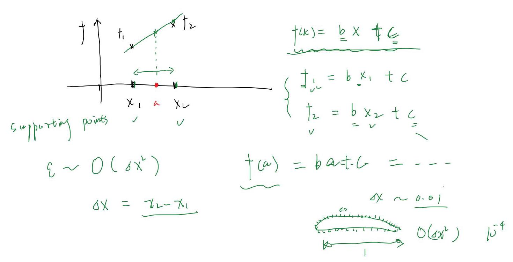
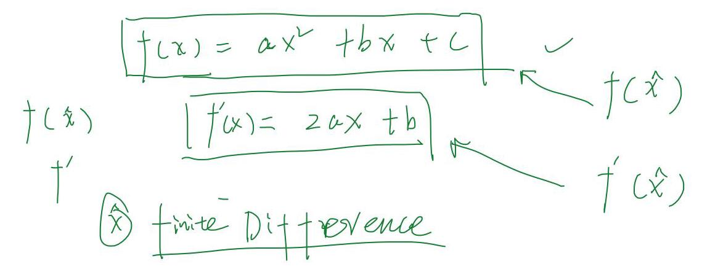
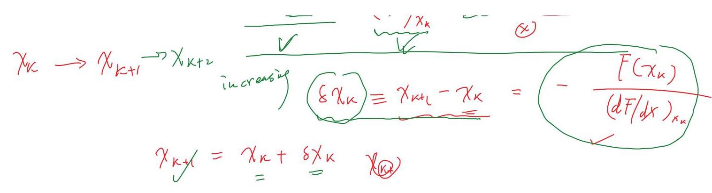

CFD

数值计算方法 Numer: “ Analysis

C. C++ Mat $b{ab}$ Python Fortran 9X

tinite dry $f\left( x\right)$

1

① $\widehat{f}\left( x\right)  < f\left( x\right)$ approximate

with discrete data

② $\;f\left( a\right)  = f\left( a\right)$ f(a)

2D

$f\left( {a, b}\right)$

九

$\left( {a, b}\right)$

$\left( {{x}_{i},{y}_{i}}\right)$

$f\left( {a, b}\right)  \approx  f\left( {a, b}\right)$

$P\left( {x, y, z, t}\right)$

$f\left( {x, y, z}\right) \; f\left( {x, y, z, t}\right)$

${t}_{1x}$

${y}_{1}$

①

$f\left( x\right)  = \frac{a{x}^{2} + {bx} + c}{v}$

interpolate $l = {l}^{\prime }$ extrapolate

$$
f\left( x\right)  = x\sin \left( x\right)  + 4 = 0
$$

$f\left( {x, y}\right)  = \mathop{\sum }\limits_{{1 \leq  a}}{x}^{a} + \mathop{\sum }\limits_{{1 \leq  a}}{y}^{a} + 1$

3 points 3

$a, b, c$

${I}_{n + 1} \sim  P\left( {\mu  \leq  \mu }\right)$

iterative method

$$
\mathop{\lim }\limits_{{i \rightarrow  \infty }}{x}_{0} \rightarrow  {x}_{1} \rightarrow  {x}_{2} \rightarrow  \begin{matrix} {x}_{3} \rightarrow  {x}_{4} \rightarrow  {x}_{5} \rightarrow  \cdots {x}_{k} \rightarrow  {x}_{5} \rightarrow  \cdots {x}_{k} \rightarrow  {x}_{k} \\  {x}_{1} \rightarrow  \infty \\  {x}_{2} \rightarrow  \infty  \end{matrix}
$$

$$
{x}_{K} = \bar{x}
$$

$\varepsilon  = \left\{  {{x}_{k} - \overline{x}I\;{very}\sin \omega \;{cnough}}\right\}$

Newton - Raphson iterative mother

$$
f\left( x\right)  = 0
$$

Trylov Serves exploration $f\left( x\right)  = f\left( {x}_{0}\right)  + {\left( \frac{df}{dx}\right) }_{{x}_{0}}\left( {x - {x}_{0}}\right)$

$$
\cdots {x}_{k} = \cdots {x}_{k}{x}_{k + 1}
$$

$$
+ \frac{1}{2}{\left( \frac{{d}^{2}}{d{x}^{2}}\right) }_{{x}_{0}}{\left( x - {x}_{0}\right) }^{2} + \cdots
$$

$f\left( {x}_{k}\right)  \neq  0$

$\sim  1 \sim  1 \sim  9 \times  {10}^{-3}$

$\frac{F\left( {x}_{k}\right) }{F\left( {x}_{k}\right) } + \frac{dF}{dx}{x}_{k} = \frac{{x}_{k + 1} - {x}_{k})}{\Delta y} = 0$

