Theory of Inviscid Hypersonic Flows

屈崑

Northwestern Polytechnical Univ.

kunqu@nwpu.edu.cn

October 28, 2021

Overview

1 Mach Number Independence

- Roadmap

- Nondimensionlization of Governing Equations

- Nondimensionless Boundary Conditions

- Nondimensionless Shock Wave Boundary Condition

2 Hypersonic Small-Disturbance Equations

- Roadmap

- Determine Reference Values

- 控制方程无量纲化与简化

- Nondimensionalization

Mach Number Independence

Mach Number Independence Roadmap

## Mach Number Independence

- It is not rigourous to "derive" Mach number independency from the relationship of oblique shock-wave;

- A flow field can be decribed with the govening equations and boundary conditions;

- It is more rigourous to derive Mach number independency from the govening equations and boundary conditions

## Mach Number Independence

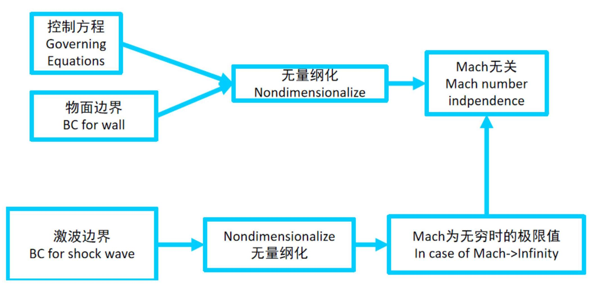

## Uniform Entropy? Isentropic?

- The assumption of "uniform entropy" can greatly simplify analysis;

- Across a shock wave, entropy increase, making the assumption of "uniform entropy" invalid;

- But the entropy is still same along a streamline even behinde the shock wave;

- The condition of isentropic flow along each streamline can simplify the energy equation.

Mach Number Independence Nondimensionlization of Governing Equations

## Governing Equations

$$
\frac{\partial \rho }{\partial t} + \frac{\partial {\rho u}}{\partial x} + \frac{\partial {\rho v}}{\partial y} + \frac{\partial {\rho w}}{\partial z} = 0
$$

$$
\frac{\partial {\rho u}}{\partial t} + {\rho u}\frac{\partial u}{\partial x} + {\rho v}\frac{\partial u}{\partial y} + {\rho w}\frac{\partial u}{\partial z} =  - \frac{\partial p}{\partial x}
$$

$$
\frac{\partial {\rho v}}{\partial t} + {\rho u}\frac{\partial v}{\partial x} + {\rho v}\frac{\partial v}{\partial y} + {\rho w}\frac{\partial v}{\partial z} =  - \frac{\partial p}{\partial y}
$$

$$
\frac{\partial {\rho w}}{\partial t} + {\rho u}\frac{\partial w}{\partial x} + {\rho v}\frac{\partial w}{\partial y} + {\rho w}\frac{\partial w}{\partial z} =  - \frac{\partial p}{\partial z}
$$

$$
\frac{\mathrm{D}s}{\mathrm{D}t} = \frac{\partial s}{\partial t} + u\frac{\partial s}{\partial x} + v\frac{\partial s}{\partial y} + w\frac{\partial s}{\partial z} = 0
$$

where $s = p/{\rho }^{\gamma }$

The energy equation just means that entropy is constant along a streamline.

We only consider the domain between the shock and the wall surface where the flow is isentropic along each streamline.

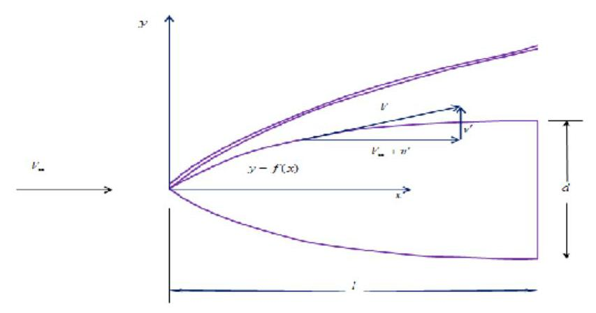

## Nodimensionalization

Convert each variable into a dimensionless ratio by dividing it with a reference value of the same unit

$$
\left\{  \begin{array}{l} \bar{x} = \frac{x}{l}\;\bar{y} = \frac{y}{l}\;\bar{z} = \frac{z}{l} \\  \bar{u} = \frac{u}{{V}_{\infty }}\;\bar{v} = \frac{v}{{V}_{\infty }}\;\bar{w} = \frac{w}{{V}_{\infty }} \\  \bar{t} = \frac{t}{l/{V}_{\infty }} \\  \bar{p} = \frac{p}{{\rho }_{\infty }{V}_{\infty }^{2}} \\  \overline{\rho } = \frac{\rho }{{\rho }_{\infty }{V}_{\infty }^{2}} \end{array}\right.
$$

## Nodimensionalization

Convert each variable into a dimensionless ratio by dividing it with a reference value of the same unit

$$
\left\{  \begin{array}{l} \bar{x} = \frac{x}{l}\;\bar{y} = \frac{y}{l}\;\bar{z} = \frac{z}{l} \\  \bar{u} = \frac{u}{{V}_{\infty }}\;\bar{v} = \frac{v}{{V}_{\infty }}\;\bar{w} = \frac{w}{{V}_{\infty }} \\  \bar{t} = \frac{t}{l/{V}_{\infty }} \\  \bar{p} = \frac{p}{{\rho }_{\infty }{V}_{\infty }^{2}} \\  \overline{\rho } = \frac{\rho }{{\rho }_{\infty }} \end{array}\right.
$$

$$
\Rightarrow  \left\{  \begin{array}{l} x = \bar{x}l \\  y = \bar{y}l \\  z = \bar{z}l \\  u = \bar{u}{V}_{\infty } \\  v = \bar{v}{V}_{\infty } \\  w = \bar{w}{V}_{\infty } \\  p = \bar{p}{\rho }_{\infty }{V}_{\infty }^{2} \\  \rho  = \overline{\rho }{\rho }_{\infty } \\  t = \bar{t}l/{V}_{\infty } \end{array}\right.
$$

Nodimensionalization

Dimensionless Continuity Equation

$$
\frac{\partial \rho }{\partial t} + \frac{\partial {\rho u}}{\partial x} + \frac{\partial {\rho v}}{\partial y} + \frac{\partial {\rho w}}{\partial z} = 0
$$

$$
\frac{\partial \rho }{\partial t} + \frac{\partial {\rho u}}{\partial x} + \frac{\partial {\rho v}}{\partial y} + \frac{\partial {\rho w}}{\partial z} = 0
$$

$$
\downarrow
$$

$$
\frac{\partial \left( {\overline{\rho }{\rho }_{\infty }}\right) }{\partial \left( {\bar{t}l/{V}_{\infty }}\right) } + \frac{\partial \left( {\overline{\rho }{\rho }_{\infty }}\right) \left( {\bar{u}{V}_{\infty }}\right) }{\partial \left( {\bar{x}l}\right) } + \frac{\partial \left( {\overline{\rho }{\rho }_{\infty }}\right) \left( {\bar{v}{V}_{\infty }}\right) }{\partial \left( {\bar{y}l}\right) } + \frac{\partial \left( {\overline{\rho }{\rho }_{\infty }}\right) \left( {\bar{w}{V}_{\infty }}\right) }{\partial \left( {\bar{z}l}\right) } = 0
$$

$$
\frac{\partial \rho }{\partial t} + \frac{\partial {\rho u}}{\partial x} + \frac{\partial {\rho v}}{\partial y} + \frac{\partial {\rho w}}{\partial z} = 0
$$

$$
\downarrow
$$

$$
\frac{\partial \left( {\overline{\rho }{\rho }_{\infty }}\right) }{\partial \left( {\bar{t}l/{V}_{\infty }}\right) } + \frac{\partial \left( {\overline{\rho }{\rho }_{\infty }}\right) \left( {\bar{u}{V}_{\infty }}\right) }{\partial \left( {\bar{x}l}\right) } + \frac{\partial \left( {\overline{\rho }{\rho }_{\infty }}\right) \left( {\bar{v}{V}_{\infty }}\right) }{\partial \left( {\bar{y}l}\right) } + \frac{\partial \left( {\overline{\rho }{\rho }_{\infty }}\right) \left( {\bar{w}{V}_{\infty }}\right) }{\partial \left( {\bar{z}l}\right) } = 0
$$

$$
\downarrow
$$

$$
\frac{{\rho }_{\infty }{V}_{\infty }}{l}\left\lbrack  {\frac{\partial \overline{\rho }}{\partial \bar{t}} + \frac{\partial \overline{\rho }\bar{u}}{\partial \bar{x}} + \frac{\partial \overline{\rho }\bar{v}}{\partial \bar{y}} + \frac{\partial \overline{\rho }\bar{w}}{\partial \bar{z}}}\right\rbrack   = 0
$$

$$
\frac{\partial \rho }{\partial t} + \frac{\partial {\rho u}}{\partial x} + \frac{\partial {\rho v}}{\partial y} + \frac{\partial {\rho w}}{\partial z} = 0
$$

$$
\downarrow
$$

$$
\frac{\partial \left( {\overline{\rho }{\rho }_{\infty }}\right) }{\partial \left( {\bar{t}l/{V}_{\infty }}\right) } + \frac{\partial \left( {\overline{\rho }{\rho }_{\infty }}\right) \left( {\bar{u}{V}_{\infty }}\right) }{\partial \left( {\bar{x}l}\right) } + \frac{\partial \left( {\overline{\rho }{\rho }_{\infty }}\right) \left( {\bar{v}{V}_{\infty }}\right) }{\partial \left( {\bar{y}l}\right) } + \frac{\partial \left( {\overline{\rho }{\rho }_{\infty }}\right) \left( {\bar{w}{V}_{\infty }}\right) }{\partial \left( {\bar{z}l}\right) } = 0
$$

$$
\downarrow
$$

$$
\frac{{\rho }_{\infty }{V}_{\infty }}{l}\left\lbrack  {\frac{\partial \overline{\rho }}{\partial \bar{t}} + \frac{\partial \overline{\rho }\bar{u}}{\partial \bar{x}} + \frac{\partial \overline{\rho }\bar{v}}{\partial \bar{y}} + \frac{\partial \overline{\rho }\bar{w}}{\partial \bar{z}}}\right\rbrack   = 0
$$

$$
\downarrow
$$

$$
\frac{\partial \overline{\rho }}{\partial \bar{t}} + \frac{\partial \overline{\rho }\bar{u}}{\partial \bar{x}} + \frac{\partial \overline{\rho }\bar{v}}{\partial \bar{y}} + \frac{\partial \overline{\rho }\bar{w}}{\partial \bar{z}} = 0
$$

$$
\left\{  \begin{matrix} \frac{\partial \overline{\rho }}{\partial t} + \frac{\partial \overline{\rho }\overline{u}}{\partial \overline{x}} + \frac{\partial \overline{\rho }\overline{v}}{\partial \overline{y}} + \frac{\partial \overline{\rho }\overline{w}}{\partial \overline{z}} = 0 \\  \frac{\partial \overline{\rho }\overline{u}}{\partial t} + \overline{\rho }\overline{u}\frac{\partial \overline{u}}{\partial \overline{x}} + \overline{\rho }\overline{v}\frac{\partial \overline{u}}{\partial \overline{y}} + \overline{\rho }\overline{w}\frac{\partial \overline{u}}{\partial \overline{z}} =  - \frac{\partial \overline{p}}{\partial \overline{x}} \\  \frac{\partial \overline{\rho }\overline{v}}{\partial \overline{t}} + \overline{\rho }u\frac{\partial \overline{v}}{\partial \overline{x}} + \overline{\rho }v\frac{\partial \overline{v}}{\partial \overline{y}} + \overline{\rho }w\frac{\partial \overline{v}}{\partial \overline{z}} =  - \frac{\partial \overline{p}}{\partial \overline{x}} \\  \frac{\partial \overline{\rho }\overline{w}}{\partial \overline{t}} + \overline{\rho }u\frac{\partial \overline{v}}{\partial \overline{x}} + \overline{\rho }v\frac{\partial \overline{w}}{\partial \overline{y}} + \overline{\rho }w\frac{\partial \overline{w}}{\partial \overline{z}} =  - \frac{\partial \overline{p}}{\partial \overline{z}} \\  \frac{\partial \overline{s}}{\partial \overline{t}} + \frac{\partial \overline{v}}{\partial \overline{x}} + \frac{\partial \overline{v}}{\partial \overline{y}} + \frac{\partial \overline{v}}{\partial \overline{x}} + \frac{\partial \overline{p}}{\partial \overline{y}} = 0 \end{matrix}\right.
$$

Nodimensionalization

Further Discussion

Nodimensionalization

- Governing equations contains only three basic unit: time, mass and length;

Nodimensionalization

- Governing equations contains only three basic unit: time, mass and length;

- Thus we only need the least number of reference values to introduce the three basic unit;

Nodimensionalization

- Governing equations contains only three basic unit: time, mass and length;

- Thus we only need the least number of reference values to introduce the three basic unit;

- For example, $\left\lbrack  {{\rho }_{\text{ ref }},{p}_{\text{ ref }}, L}\right\rbrack$ can be used to derive all the other reference values:

- Reference velocity: ${V}_{\text{ ref }} = \sqrt{{p}_{\text{ ref }}/{\rho }_{\text{ ref }}}$

- Reference time: ${t}_{\text{ ref }} = L/{V}_{\text{ ref }}$

- Reference energy: ${E}_{\text{ ref }} = {V}_{\text{ ref }}^{2}$

Nodimensionalization

- Governing equations contains only three basic unit: time, mass and length;

- Thus we only need the least number of reference values to introduce the three basic unit;

- For example, $\left\lbrack  {{\rho }_{\text{ ref }},{p}_{\text{ ref }}, L}\right\rbrack$ can be used to derive all the other reference values:

- Reference velocity: ${V}_{\text{ ref }} = \sqrt{{p}_{\text{ ref }}/{\rho }_{\text{ ref }}}$

- Reference time: ${t}_{\text{ ref }} = L/{V}_{\text{ ref }}$

- Reference energy: ${E}_{\text{ ref }} = {V}_{\text{ ref }}^{2}$

- In this way, the form of dimensionless equations is the same as the original equations;

Nodimensionalization

- Governing equations contains only three basic unit: time, mass and length;

- Thus we only need the least number of reference values to introduce the three basic unit;

- For example, $\left\lbrack  {{\rho }_{\text{ ref }},{p}_{\text{ ref }}, L}\right\rbrack$ can be used to derive all the other reference values:

- Reference velocity: ${V}_{\text{ ref }} = \sqrt{{p}_{\text{ ref }}/{\rho }_{\text{ ref }}}$

- Reference time: ${t}_{\text{ ref }} = L/{V}_{\text{ ref }}$

- Reference energy: ${E}_{\text{ ref }} = {V}_{\text{ ref }}^{2}$

- In this way, the form of dimensionless equations is the same as the original equations;

- If extra reference values are introduced, the final dimensionless equations may contain some dimensionless number, such as Re, Mach

Mach Number Independence Nondimensionless Boundary Conditions

Nodimensionalization

The direction of velocity is in the local tangent direction.

$$
u{n}_{x} + v{n}_{y} + w{n}_{z} = 0\;\text{ or }\;\mathbf{V} \cdot  \mathbf{n} = 0
$$

Nodimensionalization

The direction of velocity is in the local tangent direction.

$$
u{n}_{x} + v{n}_{y} + w{n}_{z} = 0\;\text{ or }\;\mathbf{V} \cdot  \mathbf{n} = 0
$$

$$
\Downarrow
$$

$$
\bar{u}{n}_{x} + \bar{v}{n}_{y} + \bar{w}{n}_{z} = 0
$$

$$
\frac{{p}_{2}}{{p}_{\infty }} = 1 + \frac{2\gamma }{\gamma  + 1}\left( {{M}_{\infty }^{2}{\sin }^{2}\beta  - 1}\right)
$$

$$
\frac{{\rho }_{2}}{{\rho }_{\infty }} = \frac{\left( {\gamma  + 1}\right) {M}_{\infty }^{2}{\sin }^{2}\beta }{\left( {\gamma  - 1}\right) {M}_{\infty }^{2}{\sin }^{2}\beta  + 2}
$$

$$
\frac{{u}_{2}}{{u}_{\infty }} = 1 - \frac{2\left( {{M}_{\infty }^{2}{\sin }^{2}\beta  - 1}\right) }{\left( {\gamma  + 1}\right) {M}_{\infty }^{2}}
$$

$$
\frac{{v}_{2}}{{v}_{\infty }} = \frac{2\left( {{M}_{\infty }^{2}{\sin }^{2}\beta }\right) \cot \beta }{\left( {\gamma  + 1}\right) {M}_{\infty }^{2}}
$$

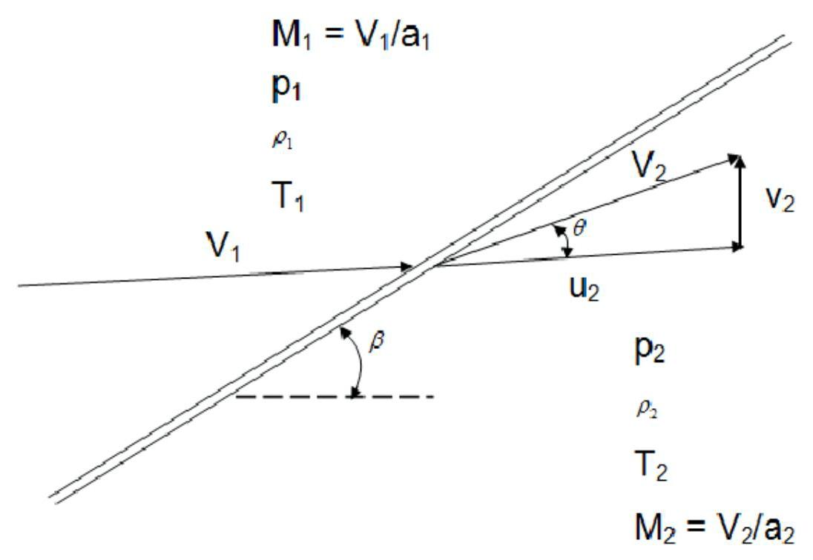

Mach Number Independence Nondimensionless Shock Wave Boundary Condition

Nodimensionalization

Boundary condition behinde the shock wave

Nondimensionalize pressure condtiion

$$
\bar{p} = \frac{p}{{\rho }_{\infty }{V}_{\infty }^{2}}
$$

Nodimensionalization

Boundary condition behinde the shock wave

Nondimensionalize pressure condtiion

$$
\bar{p} = \frac{p}{{\rho }_{\infty }{V}_{\infty }^{2}}\;\frac{{p}_{2}}{{p}_{\infty }}
$$

Nodimensionalization

Nondimensionalize pressure condtiion

$$
\bar{p} = \frac{p}{{\rho }_{\infty }{V}_{\infty }^{2}}\;\frac{{p}_{2}}{{p}_{\infty }} = \frac{{\bar{p}}_{2}{\rho }_{\infty }{V}_{\infty }^{2}}{{p}_{\infty }} = \frac{{\bar{p}}_{2}{V}_{\infty }^{2}}{R{T}_{\infty }}
$$

Nodimensionalization

Nondimensionalize pressure condtiion

$$
\bar{p} = \frac{p}{{\rho }_{\infty }{V}_{\infty }^{2}}\;\frac{{p}_{2}}{{p}_{\infty }} = \frac{{\bar{p}}_{2}{\rho }_{\infty }{V}_{\infty }^{2}}{{p}_{\infty }} = \frac{{\bar{p}}_{2}{V}_{\infty }^{2}}{R{T}_{\infty }}
$$

$$
= \frac{\gamma {\bar{p}}_{2}{V}_{\infty }^{2}}{{\gamma R}{T}_{\infty }} = \frac{\gamma {\bar{p}}_{2}{V}_{\infty }^{2}}{{a}_{\infty }^{2}}
$$

Nodimensionalization

Nondimensionalize pressure condtiion

$$
\bar{p} = \frac{p}{{\rho }_{\infty }{V}_{\infty }^{2}}\;\frac{{p}_{2}}{{p}_{\infty }} = \frac{{\bar{p}}_{2}{\rho }_{\infty }{V}_{\infty }^{2}}{{p}_{\infty }} = \frac{{\bar{p}}_{2}{V}_{\infty }^{2}}{R{T}_{\infty }}
$$

$$
= \frac{\gamma {\bar{p}}_{2}{V}_{\infty }^{2}}{{\gamma R}{T}_{\infty }} = \frac{\gamma {\bar{p}}_{2}{V}_{\infty }^{2}}{{a}_{\infty }^{2}}
$$

$$
= \gamma {\bar{p}}_{2}{M}_{\infty }^{2}
$$

Nodimensionalization

Nondimensionalize pressure condtiion

$$
\bar{p} = \frac{p}{{\rho }_{\infty }{V}_{\infty }^{2}}\;\frac{{p}_{2}}{{p}_{\infty }} = \frac{{\bar{p}}_{2}{\rho }_{\infty }{V}_{\infty }^{2}}{{p}_{\infty }} = \frac{{\bar{p}}_{2}{V}_{\infty }^{2}}{R{T}_{\infty }}
$$

$$
= \frac{\gamma {\bar{p}}_{2}{V}_{\infty }^{2}}{{\gamma R}{T}_{\infty }} = \frac{\gamma {\bar{p}}_{2}{V}_{\infty }^{2}}{{a}_{\infty }^{2}}
$$

$$
= \gamma {\bar{p}}_{2}{M}_{\infty }^{2}
$$

$$
\frac{{p}_{2}}{{p}_{\infty }} = 1 + \frac{2\gamma }{\gamma  + 1}\left( {{M}_{\infty }^{2}{\sin }^{2}\beta  - 1}\right)  = \gamma {\bar{p}}_{2}{M}_{\infty }^{2}
$$

Nodimensionalization

Nondimensionalize pressure condtiion

$$
\bar{p} = \frac{p}{{\rho }_{\infty }{V}_{\infty }^{2}}\;\frac{{p}_{2}}{{p}_{\infty }} = \frac{{\bar{p}}_{2}{\rho }_{\infty }{V}_{\infty }^{2}}{{p}_{\infty }} = \frac{{\bar{p}}_{2}{V}_{\infty }^{2}}{R{T}_{\infty }}
$$

$$
= \frac{\gamma {\bar{p}}_{2}{V}_{\infty }^{2}}{{\gamma R}{T}_{\infty }} = \frac{\gamma {\bar{p}}_{2}{V}_{\infty }^{2}}{{a}_{\infty }^{2}}
$$

$$
= \gamma {\bar{p}}_{2}{M}_{\infty }^{2}
$$

$$
\frac{{p}_{2}}{{p}_{\infty }} = 1 + \frac{2\gamma }{\gamma  + 1}\left( {{M}_{\infty }^{2}{\sin }^{2}\beta  - 1}\right)  = \gamma {\bar{p}}_{2}{M}_{\infty }^{2}
$$

$$
{\bar{p}}_{2} = \frac{1}{\gamma {M}_{\infty }^{2}} + \frac{2}{\gamma  + 1}\left( {{\sin }^{2}\beta  - \frac{1}{{M}_{\infty }^{2}}}\right)
$$

Nodimensionalization

All the dimensionless conditions behinde a shock wave

${\bar{p}}_{2} = \frac{1}{\gamma {M}_{\infty }^{2}} + \frac{2}{\gamma  + 1}\left( {{\sin }^{2}\beta  - \frac{1}{{M}_{\infty }^{2}}}\right)$

$$
\left\{  \begin{array}{l} {\bar{u}}_{2} = 1 - \frac{2\left( {{M}_{\infty }^{2}{\sin }^{2}\beta  - 1}\right) }{\left( {\gamma  + 1}\right) {M}_{\infty }^{2}} \\  {\bar{v}}_{2} = \frac{2\left( {{M}_{\infty }^{2}{\sin }^{2}\beta  - 1}\right) \cot \beta }{\left( {\gamma  + 1}\right) {M}_{\infty }^{2}} \end{array}\right.
$$

$$
\Rightarrow  \left\{  \begin{array}{l} {\bar{p}}_{2} \rightarrow  \frac{2{\sin }^{2}\beta }{\gamma  + 1} \\  {\overline{\rho }}_{2} \rightarrow  \frac{\gamma  + 1}{\gamma  - 1} \\  {\bar{u}}_{2} \rightarrow  1 - \frac{2{\sin }^{2}\beta }{\gamma  + 1} \\  {\bar{v}}_{2} \rightarrow  \frac{\sin {2\beta }}{\gamma  + 1} \end{array}\right.
$$

So, the shock wave boundary condition doesn’t depend on ${M}_{\infty }$ when ${M}_{\infty } \rightarrow  \infty$

- Dimensionless governing equation, No Mach number

- Wall boundary condition: No Mach number

- Shock wave boundary condition: No Mach number when ${M}_{\infty }$ is large enough

Thus the flow field is independent on ${M}_{\infty }$ for hypersonic flows.

Hypersonic Small-Disturbance Equations

# Hypersonic Small-Disturbance Equations Roadmap

## Roadmap of Derivation

Rigorous derivation based on governign equations and boundary conditions

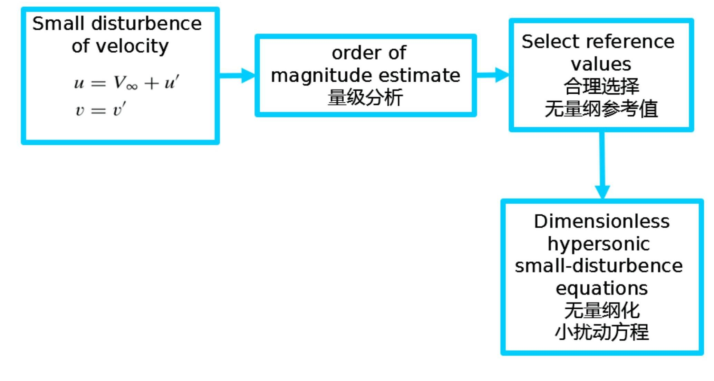

Hypersonic Small-Disturbance Equations Determine Reference Values

Euler Equations with Velosity Disturbance

Only expand velocity here

$$
\frac{\partial \rho \left( {{V}_{\infty } + {u}^{\prime }}\right) }{\partial x} + \frac{\partial \rho {v}^{\prime }}{\partial y} + \frac{\partial \rho {w}^{\prime }}{\partial z} = 0
$$

$$
\rho \left( {{V}_{\infty } + {u}^{\prime }}\right) \frac{\partial \left( {{V}_{\infty } + {u}^{\prime }}\right) }{\partial x} + \rho {v}^{\prime }\frac{\partial \left( {{V}_{\infty } + {u}^{\prime }}\right) }{\partial y} + \rho {w}^{\prime }\frac{\partial \left( {{V}_{\infty } + {u}^{\prime }}\right) }{\partial z} =  - \frac{\partial p}{\partial x}
$$

$$
\rho \left( {{V}_{\infty } + {u}^{\prime }}\right) \frac{\partial {v}^{\prime }}{\partial x} + \rho {v}^{\prime }\frac{\partial {v}^{\prime }}{\partial y} + \rho {w}^{\prime }\frac{\partial {v}^{\prime }}{\partial z} =  - \frac{\partial p}{\partial y}
$$

$$
\rho \left( {{V}_{\infty } + {u}^{\prime }}\right) \frac{\partial {w}^{\prime }}{\partial x} + \rho {v}^{\prime }\frac{\partial {w}^{\prime }}{\partial y} + \rho {w}^{\prime }\frac{\partial {w}^{\prime }}{\partial z} =  - \frac{\partial p}{\partial z}
$$

$$
\left( {{V}_{\infty } + {u}^{\prime }}\right) \frac{\partial s}{\partial x} + {v}^{\prime }\frac{\partial s}{\partial y} + {w}^{\prime }\frac{\partial s}{\partial z} = 0
$$

## Euler Equations with Velosity Disturbance

Only expand velocity here

$$
\frac{\partial \rho \left( {{V}_{\infty } + {u}^{\prime }}\right) }{\partial x} + \frac{\partial \rho {v}^{\prime }}{\partial y} + \frac{\partial \rho {w}^{\prime }}{\partial z} = 0
$$

$$
\rho \left( {{V}_{\infty } + {u}^{\prime }}\right) \frac{\partial \left( {{V}_{\infty } + {u}^{\prime }}\right) }{\partial x} + \rho {v}^{\prime }\frac{\partial \left( {{V}_{\infty } + {u}^{\prime }}\right) }{\partial y} + \rho {w}^{\prime }\frac{\partial \left( {{V}_{\infty } + {u}^{\prime }}\right) }{\partial z} =  - \frac{\partial p}{\partial x}
$$

$$
\rho \left( {{V}_{\infty } + {u}^{\prime }}\right) \frac{\partial {v}^{\prime }}{\partial x} + \rho {v}^{\prime }\frac{\partial {v}^{\prime }}{\partial y} + \rho {w}^{\prime }\frac{\partial {v}^{\prime }}{\partial z} =  - \frac{\partial p}{\partial y}
$$

$$
\rho \left( {{V}_{\infty } + {u}^{\prime }}\right) \frac{\partial {w}^{\prime }}{\partial x} + \rho {v}^{\prime }\frac{\partial {w}^{\prime }}{\partial y} + \rho {w}^{\prime }\frac{\partial {w}^{\prime }}{\partial z} =  - \frac{\partial p}{\partial z}
$$

$$
\left( {{V}_{\infty } + {u}^{\prime }}\right) \frac{\partial s}{\partial x} + {v}^{\prime }\frac{\partial s}{\partial y} + {w}^{\prime }\frac{\partial s}{\partial z} = 0
$$

In order to simplify it, we should perform an analysis of the order of magnitude of each term. Based on that, proper reference values can be selected to take nondimensionalization, making each variable scaled to $O\left( 1\right)$ .

$\frac{\mathrm{d}y}{\mathrm{\;d}x} = O\left( \frac{d}{l}\right) \;$ where $\;\frac{d}{l} \equiv  \tau$

$$
\frac{\mathrm{d}y}{\mathrm{\;d}x} = O\left( \frac{d}{l}\right) \;\text{ where }\;\frac{d}{l} \equiv  \tau
$$

$$
u = {V}_{\infty } + {u}^{\prime }
$$

$$
v = {v}^{\prime }
$$

$$
\frac{\mathrm{d}y}{\mathrm{\;d}x} = O\left( \frac{d}{l}\right) \;\text{ where }\;\frac{d}{l} \equiv  \tau
$$

$$
\begin{array}{ll} u = {V}_{\infty } + {u}^{\prime } & \frac{\mathrm{d}y}{\mathrm{\;d}x} = \frac{v}{u} \\  v = {v}^{\prime } & \frac{\mathrm{d}y}{\mathrm{\;d}x} \end{array}
$$

$$
\left. \begin{array}{l} \frac{\mathrm{d}y}{\mathrm{\;d}x} = O\left( \frac{d}{l}\right) \;\text{ where }\;\frac{d}{l} \equiv  \tau \\  u = {V}_{\infty } + {u}^{\prime }\;\frac{\mathrm{d}y}{\mathrm{\;d}x} = \frac{v}{u} \\  v = {v}^{\prime } \end{array}\right\}   \Rightarrow  \frac{\mathrm{d}y}{\mathrm{\;d}x} = \frac{{v}^{\prime }}{{V}_{\infty } + {u}^{\prime }} = O\left( \tau \right)
$$

$$
\left. \begin{array}{l} \frac{\mathrm{d}y}{\mathrm{\;d}x} = O\left( \frac{d}{l}\right) \;\text{ where }\;\frac{d}{l} \equiv  \tau \\  u = {V}_{\infty } + {u}^{\prime }\;\frac{\mathrm{d}y}{\mathrm{\;d}x} = \frac{v}{u} \\  v = {v}^{\prime } \end{array}\right\}   \Rightarrow  \frac{\mathrm{d}y}{\mathrm{\;d}x} = \frac{{v}^{\prime }}{{V}_{\infty } + {u}^{\prime }} = O\left( \tau \right)
$$

$$
\left. \begin{array}{l} \frac{\mathrm{d}y}{\mathrm{\;d}x} = O\left( \frac{d}{l}\right) \;\text{ where }\;\frac{d}{l} \equiv  \tau \\  u = {V}_{\infty } + {u}^{\prime }\;\frac{\mathrm{d}y}{\mathrm{\;d}x} = \frac{v}{u} \\  v = {v}^{\prime } \end{array}\right\}   \Rightarrow  \frac{\mathrm{d}y}{\mathrm{\;d}x} = \frac{{v}^{\prime }}{{V}_{\infty } + {u}^{\prime }} = O\left( \tau \right)
$$

$$
\Downarrow  \; \leftarrow  \;{u}^{\prime } \ll  {V}_{\infty }
$$

$$
\left. \begin{array}{l} \frac{\mathrm{d}y}{\mathrm{\;d}x} = O\left( \frac{d}{l}\right) \;\text{ where }\;\frac{d}{l} \equiv  \tau \\  u = {V}_{\infty } + {u}^{\prime }\;\frac{\mathrm{d}y}{\mathrm{\;d}x} = \frac{v}{u} \\  v = {v}^{\prime } \end{array}\right\}   \Rightarrow  \frac{\mathrm{d}y}{\mathrm{\;d}x} = \frac{{v}^{\prime }}{{V}_{\infty } + {u}^{\prime }} = O\left( \tau \right)
$$

$\Downarrow   \Leftarrow  {u}^{\prime } \ll  {V}_{\infty }$

$$
\frac{{v}^{\prime }}{{V}_{\infty }} = O\left( \tau \right)
$$

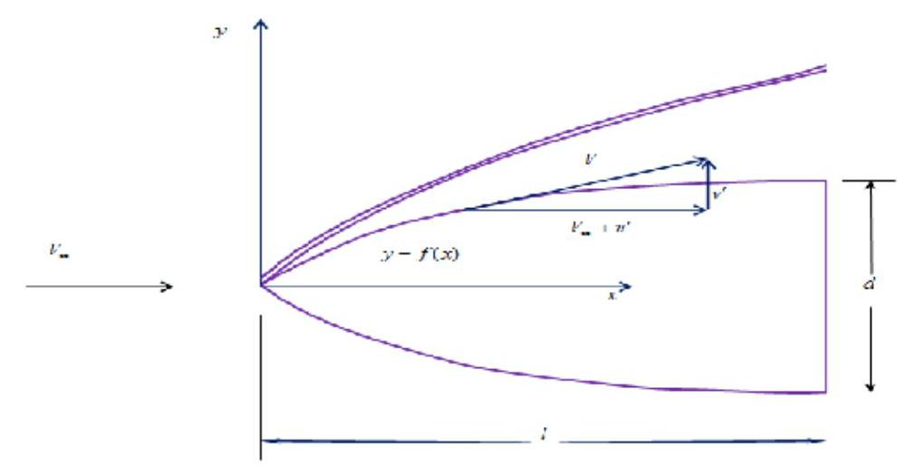

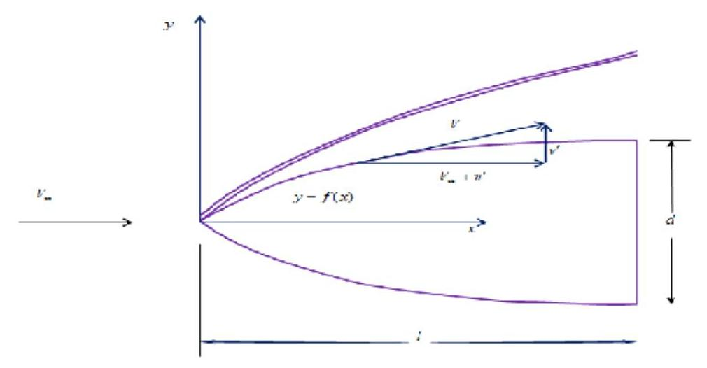

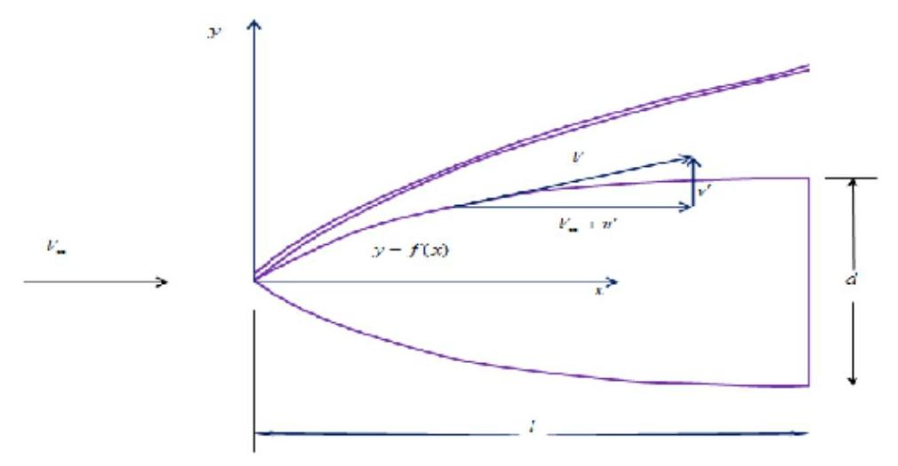

where $\tau$ is slenderness ratio.

$$
\left. \begin{array}{l} \frac{\mathrm{d}y}{\mathrm{\;d}x} = O\left( \frac{d}{l}\right) \;\text{ where }\;\frac{d}{l} \equiv  \tau \\  u = {V}_{\infty } + {u}^{\prime }\;\frac{\mathrm{d}y}{\mathrm{\;d}x} = \frac{v}{u} \\  v = {v}^{\prime } \end{array}\right\}   \Rightarrow  \frac{\mathrm{d}y}{\mathrm{\;d}x} = \frac{{v}^{\prime }}{{V}_{\infty } + {u}^{\prime }} = O\left( \tau \right)
$$

$$
\Downarrow  \; \leftarrow  \;{u}^{\prime } \ll  {V}_{\infty }
$$

$$
\frac{{v}^{\prime }}{{V}_{\infty }} = O\left( \tau \right)
$$

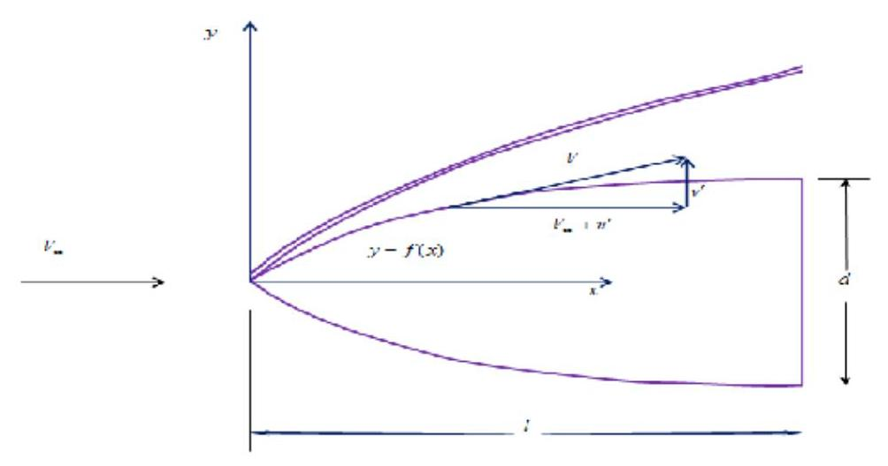

where $\tau$ is slenderness ratio. Here we get the order of the magnitude of ${v}^{\prime }$ . Selecting ${V}_{\infty }\tau$ as reference value of ${v}^{\prime }$ , we can scale it to $O\left( 1\right)$ .

- Pressure

$$
\frac{{p}_{2}}{{p}_{\infty }} = 1 + \frac{2\gamma }{\gamma  + 1}\left( {{M}_{1}^{2}{\sin }^{2}\beta  - 1}\right)
$$

- Pressure

$$
\frac{{p}_{2}}{{p}_{\infty }} = 1 + \frac{2\gamma }{\gamma  + 1}\left( {{M}_{1}^{2}{\sin }^{2}\beta  - 1}\right)
$$

$$
\frac{{p}_{2}}{{p}_{\infty }} \rightarrow  \frac{2\gamma }{\gamma  + 1}{M}_{\infty }^{2}{\sin }^{2}\beta
$$

- Pressure

$$
\frac{{p}_{2}}{{p}_{\infty }} = 1 + \frac{2\gamma }{\gamma  + 1}\left( {{M}_{1}^{2}{\sin }^{2}\beta  - 1}\right)
$$

$$
\frac{{p}_{2}}{{p}_{\infty }} \rightarrow  \frac{2\gamma }{\gamma  + 1}{M}_{\infty }^{2}{\sin }^{2}\beta
$$

$$
\rightarrow  O\left( {{M}_{\infty }^{2}{\tau }^{2}}\right)
$$

- Pressure

$$
\frac{{p}_{2}}{{p}_{\infty }} = 1 + \frac{2\gamma }{\gamma  + 1}\left( {{M}_{1}^{2}{\sin }^{2}\beta  - 1}\right)
$$

$$
\frac{{p}_{2}}{{p}_{\infty }} \rightarrow  \frac{2\gamma }{\gamma  + 1}{M}_{\infty }^{2}{\sin }^{2}\beta
$$

$$
\rightarrow  O\left( {{M}_{\infty }^{2}{\tau }^{2}}\right)
$$

$$
{p}_{2} \rightarrow  O\left( {{M}_{\infty }^{2}{\tau }^{2}{p}_{\infty }}\right)
$$

- Pressure

$$
\frac{{p}_{2}}{{p}_{\infty }} = 1 + \frac{2\gamma }{\gamma  + 1}\left( {{M}_{1}^{2}{\sin }^{2}\beta  - 1}\right)
$$

$$
\frac{{p}_{2}}{{p}_{\infty }} \rightarrow  \frac{2\gamma }{\gamma  + 1}{M}_{\infty }^{2}{\sin }^{2}\beta
$$

$$
\rightarrow  O\left( {{M}_{\infty }^{2}{\tau }^{2}}\right)
$$

$$
{p}_{2} \rightarrow  O\left( {{M}_{\infty }^{2}{\tau }^{2}{p}_{\infty }}\right)
$$

- Density

$$
\frac{{\rho }_{2}}{{\rho }_{\infty }} \rightarrow  \frac{\gamma  + 1}{\gamma  - 1}
$$

- Pressure

$$
\frac{{p}_{2}}{{p}_{\infty }} = 1 + \frac{2\gamma }{\gamma  + 1}\left( {{M}_{1}^{2}{\sin }^{2}\beta  - 1}\right)
$$

$$
\frac{{p}_{2}}{{p}_{\infty }} \rightarrow  \frac{2\gamma }{\gamma  + 1}{M}_{\infty }^{2}{\sin }^{2}\beta
$$

$$
\rightarrow  O\left( {{M}_{\infty }^{2}{\tau }^{2}}\right)
$$

$$
{p}_{2} \rightarrow  O\left( {{M}_{\infty }^{2}{\tau }^{2}{p}_{\infty }}\right)
$$

- Density

$$
\frac{{\rho }_{2}}{{\rho }_{\infty }} \rightarrow  \frac{\gamma  + 1}{\gamma  - 1} \Rightarrow  \overline{\rho } = \frac{\rho }{{\rho }_{\infty }}
$$

$$
{u}^{\prime } = {V}_{\infty } - {u}_{2}\;\frac{{u}_{2}}{{V}_{\infty }} \rightarrow  1 - \frac{2{\sin }^{2}\beta }{\gamma  + 1}
$$

- ${u}^{\prime }$

$$
{u}^{\prime } = {V}_{\infty } - {u}_{2}\;\frac{{u}_{2}}{{V}_{\infty }} \rightarrow  1 - \frac{2{\sin }^{2}\beta }{\gamma  + 1}
$$

$$
\frac{{u}^{\prime }}{{V}_{\infty }} = \frac{{V}_{\infty } - {u}_{2}}{{V}_{\infty }}
$$

$$
{u}^{\prime } = {V}_{\infty } - {u}_{2}\;\frac{{u}_{2}}{{V}_{\infty }} \rightarrow  1 - \frac{2{\sin }^{2}\beta }{\gamma  + 1}
$$

$$
\frac{{u}^{\prime }}{{V}_{\infty }} = \frac{{V}_{\infty } - {u}_{2}}{{V}_{\infty }} \rightarrow  \frac{2{\sin }^{2}\beta }{\gamma  + 1}
$$

$$
{u}^{\prime } = {V}_{\infty } - {u}_{2}\;\frac{{u}_{2}}{{V}_{\infty }} \rightarrow  1 - \frac{2{\sin }^{2}\beta }{\gamma  + 1}
$$

$$
\frac{{u}^{\prime }}{{V}_{\infty }} = \frac{{V}_{\infty } - {u}_{2}}{{V}_{\infty }} \rightarrow  \frac{2{\sin }^{2}\beta }{\gamma  + 1} \rightarrow  O\left( {\tau }^{2}\right)
$$

$$
\overline{{u}^{\prime }} = \frac{{v}^{\prime }}{{V}_{\infty }{\tau }^{2}}
$$

- ${u}^{\prime }$

$$
{u}^{\prime } = {V}_{\infty } - {u}_{2}\;\frac{{u}_{2}}{{V}_{\infty }} \rightarrow  1 - \frac{2{\sin }^{2}\beta }{\gamma  + 1}
$$

$$
\frac{{u}^{\prime }}{{V}_{\infty }} = \frac{{V}_{\infty } - {u}_{2}}{{V}_{\infty }} \rightarrow  \frac{2{\sin }^{2}\beta }{\gamma  + 1} \rightarrow  O\left( {\tau }^{2}\right)
$$

$$
\overline{{u}^{\prime }} = \frac{{v}^{\prime }}{{V}_{\infty }{\tau }^{2}}
$$

- ${v}^{\prime }$

$$
\frac{{v}_{2}}{{V}_{\infty }} \rightarrow  \frac{\sin {2\beta }}{\gamma  + 1} \Rightarrow  \bar{{v}^{\prime }} = \frac{{v}^{\prime }}{{V}_{\infty }\tau }
$$

- ${u}^{\prime }$

$$
{u}^{\prime } = {V}_{\infty } - {u}_{2}\;\frac{{u}_{2}}{{V}_{\infty }} \rightarrow  1 - \frac{2{\sin }^{2}\beta }{\gamma  + 1}
$$

$$
\frac{{u}^{\prime }}{{V}_{\infty }} = \frac{{V}_{\infty } - {u}_{2}}{{V}_{\infty }} \rightarrow  \frac{2{\sin }^{2}\beta }{\gamma  + 1} \rightarrow  O\left( {\tau }^{2}\right)
$$

$$
\overline{{u}^{\prime }} = \frac{{v}^{\prime }}{{V}_{\infty }{\tau }^{2}}
$$

0 ✓

$$
\frac{{v}_{2}}{{V}_{\infty }} \rightarrow  \frac{\sin {2\beta }}{\gamma  + 1} \Rightarrow  \overline{{v}^{\prime }} = \frac{{v}^{\prime }}{{V}_{\infty }\tau }
$$

- $x$ and $y$

$$
\left\{  \begin{array}{l} x \sim  O\left( l\right) \\  y \sim  O\left( d\right) \\  d \sim  O\left( {l\tau }\right)  \end{array}\right.
$$

- ${u}^{\prime }$

$$
{u}^{\prime } = {V}_{\infty } - {u}_{2}\;\frac{{u}_{2}}{{V}_{\infty }} \rightarrow  1 - \frac{2{\sin }^{2}\beta }{\gamma  + 1}
$$

$$
\frac{{u}^{\prime }}{{V}_{\infty }} = \frac{{V}_{\infty } - {u}_{2}}{{V}_{\infty }} \rightarrow  \frac{2{\sin }^{2}\beta }{\gamma  + 1} \rightarrow  O\left( {\tau }^{2}\right)
$$

$$
\overline{{u}^{\prime }} = \frac{{v}^{\prime }}{{V}_{\infty }{\tau }^{2}}
$$

0 ✓

$$
\frac{{v}_{2}}{{V}_{\infty }} \rightarrow  \frac{\sin {2\beta }}{\gamma  + 1} \Rightarrow  \overline{{v}^{\prime }} = \frac{{v}^{\prime }}{{V}_{\infty }\tau }
$$

- $x$ and $y$

$$
\left\{  {\begin{array}{l} x \sim  O\left( l\right) \\  y \sim  O\left( d\right) \\  d \sim  O\left( {l\tau }\right)  \end{array} \Rightarrow  \;\bar{x} = \frac{x}{l}\;\bar{y} = \frac{y}{l\tau }\;\bar{z} = \frac{z}{l\tau }}\right.
$$

$$
\bar{x} = \frac{x}{l}\;\bar{y} = \frac{y}{l\tau }\;\bar{z} = \frac{z}{l\tau }
$$

$$
{\bar{u}}^{\prime } = \frac{{v}^{\prime }}{{V}_{\infty }{\tau }^{2}}
$$

$$
\overrightarrow{v} = \frac{{v}^{\prime }}{{V}_{\infty }\tau }
$$

$$
\bar{w} = \frac{{w}^{\prime }}{{V}_{\infty }\tau }
$$

$$
\overline{\rho } = \frac{\rho }{{\rho }_{\infty }}
$$

$$
\bar{p} = \frac{p}{\gamma {M}_{\infty }^{2}{\tau }^{2}{p}_{\infty }}
$$

Hypersonic Small-Disturbance Equations 控制方程无量纲化与简化

$$
\frac{\partial \rho \left( {{V}_{\infty } + {u}^{\prime }}\right) }{\partial x} + \frac{\partial \rho {v}^{\prime }}{\partial y} + \frac{\partial \rho {w}^{\prime }}{\partial z} = 0
$$

$$
\downarrow
$$

$$
\frac{\partial }{\partial \bar{x}}\left\lbrack  {\overline{\rho }\left( {1 + {\bar{u}}^{\prime }{\tau }^{2}}\right) }\right\rbrack  \left\lbrack  {{\rho }_{\infty }{V}_{\infty }}\right\rbrack
$$

$$
+ \frac{\partial \left( {\overline{\rho }\bar{{v}^{\prime }}}\right) }{\partial y}\left\lbrack  {{\rho }_{\infty }{V}_{\infty }}\right\rbrack
$$

$$
+ \frac{\partial \left( {\overline{\rho }{\bar{w}}^{\prime }}\right) }{\partial z}\left\lbrack  {{\rho }_{\infty }{V}_{\infty }}\right\rbrack   = 0
$$

↓

$$
\frac{\partial \overline{\rho }}{\partial \bar{x}} + \frac{\partial \left( {\overline{\rho }\bar{{v}^{\prime }}}\right) }{\partial y} + \frac{\partial \left( {\overline{\rho }\bar{{w}^{\prime }}}\right) }{\partial z} = 0
$$

$$
\frac{\partial \overline{\rho }}{\partial \bar{x}} + \frac{\partial \left( {\overline{\rho }{\bar{v}}^{\prime }}\right) }{\partial y} + \frac{\partial \left( {\overline{\rho }{\bar{w}}^{\prime }}\right) }{\partial z} = 0
$$

$$
\overline{\rho }\frac{\partial {\bar{u}}^{\prime }}{\partial \bar{x}} + \overline{\rho }{\bar{v}}^{\prime }\frac{\partial {\bar{u}}^{\prime }}{\partial y} + \overline{\rho }\overline{{w}^{\prime }}\frac{\partial \overline{{u}^{\prime }}}{\partial z} =  - \frac{\partial \bar{p}}{\partial \bar{x}}
$$

$$
\overline{\rho }\frac{\partial {\bar{v}}^{\prime }}{\partial \bar{x}} + \overline{\rho }{\bar{v}}^{\prime }\frac{\partial {\bar{v}}^{\prime }}{\partial y} + \overline{\rho }{\bar{w}}^{\prime }\frac{\partial {\bar{v}}^{\prime }}{\partial z} =  - \frac{\partial \bar{p}}{\partial \bar{y}}
$$

$$
\overline{\rho }\frac{\partial {\bar{w}}^{\prime }}{\partial \bar{x}} + \overline{\rho }{\bar{v}}^{\prime }\frac{\partial {\bar{w}}^{\prime }}{\partial y} + \overline{\rho }{\bar{w}}^{\prime }\frac{\partial {\bar{w}}^{\prime }}{\partial z} =  - \frac{\partial \bar{p}}{\partial \bar{z}}
$$

Nondimensionalization

- ${\bar{u}}^{\prime }$ only presents in the X-momentum equation, which means X-momentum equation is decoupled from others

- We can solve ${\bar{v}}^{\prime },{\bar{w}}^{\prime },\overline{\rho }$ and $\bar{p}$ from the other 4 equations first

- And then solve ${\bar{u}}^{\prime }$ from the X-momentum equation

Hypersonic Small-Disturbance Equations Nondimensionalization

Consider nondimensionalization of velocity components

$$
u{n}_{x} + v{n}_{y} + w{n}_{z} = 0
$$

$$
\left( {{V}_{\infty } + {u}^{\prime }}\right) {n}_{x} + {v}^{\prime }{n}_{y} + {w}^{\prime }{n}_{z} = 0
$$

$$
\left( {\frac{1}{{\tau }^{2}} + {\bar{u}}^{\prime }}\right) \left( {{V}_{\infty }{\tau }^{2}}\right) {n}_{x} + {\bar{v}}^{\prime }\left( {{V}_{\infty }\tau }\right) {n}_{y} + {\bar{w}}^{\prime }\left( {{V}_{\infty }\tau }\right) {n}_{z} = 0
$$

$$
\left( {1 + {\tau }^{2}{\bar{u}}^{\prime }}\right) {n}_{x} + {\bar{v}}^{\prime }\tau {n}_{y} + {\bar{w}}^{\prime }\tau {n}_{z} = 0
$$

## Wall Boundary Condition

Consider nondimensionalization of normal vector of the surface

$$
{n}_{x} = \sin \theta  \approx  \tau
$$

$$
{n}_{y} = \cos \theta  \approx  1 - {\tau }^{2}/2 \approx  1
$$

$$
{\bar{n}}_{x} = \frac{\delta \bar{y}}{\sqrt{\delta {\bar{x}}^{2} + \delta {\bar{y}}^{2}}}
$$

$$
{\bar{n}}_{y} = \frac{\delta \bar{x}}{\sqrt{\delta {\bar{x}}^{2} + \delta {\bar{y}}^{2}}}
$$

$$
= \frac{\left( \delta y/l\tau \right) }{\sqrt{{\left( \delta x/l\right) }^{2} + {\left( \delta y/\tau l\right) }^{2}}}
$$

$$
= \frac{\left( \delta x/l\right) }{\sqrt{{\left( \delta x/l\right) }^{2} + {\left( \delta y/\tau l\right) }^{2}}}
$$

$$
= \frac{\sin \theta /\tau }{\sqrt{{\cos }^{2}\theta  + {\sin }^{2}\theta /{\tau }^{2}}} \approx  \frac{1}{\sqrt{2}}
$$

$$
= \frac{\cos \theta }{\sqrt{{\cos }^{2}\theta  + {\sin }^{2}\theta /{\tau }^{2}}} \approx  \sqrt{2}
$$

$$
\Rightarrow  {n}_{x} \approx  \frac{\tau }{\sqrt{2}}{\bar{n}}_{x} \approx  \tau {\bar{n}}_{x}
$$

$$
\Rightarrow  {n}_{y} \approx  \frac{1}{\sqrt{2}}{\bar{n}}_{y} \approx  {\bar{n}}_{y}
$$

For $3\mathrm{D}$ , we have ${n}_{z} \approx  {\bar{n}}_{z}$

$$
{n}_{x} \approx  \tau {\bar{n}}_{x}\;{n}_{y} \approx  {\bar{n}}_{y}\;{n}_{z} \approx  {\bar{n}}_{z}
$$

Wall Boundary Condition

$$
\left( {1 + {\tau }^{2}{\bar{u}}^{\prime }}\right) {n}_{x} + {\bar{v}}^{\prime }\tau {n}_{y} + {\bar{w}}^{\prime }\tau {n}_{z} = 0
$$

$$
\left( {1 + {\tau }^{2}{\bar{u}}^{\prime }}\right) \tau {\bar{n}}_{x} + {\bar{v}}^{\prime }\tau {\bar{n}}_{y} + {\bar{w}}^{\prime }\tau {\bar{n}}_{z} = 0
$$

$$
\downarrow
$$

$$
{\bar{n}}_{x} + {\bar{v}}^{\prime }{\bar{n}}_{y} + {\bar{w}}^{\prime }{\bar{n}}_{z} = 0
$$

Shock Boundary Condition

$$
\frac{{\rho }_{2}}{{\rho }_{\infty }} = \overline{\rho } = \frac{\left( {\gamma  + 1}\right) {M}_{\infty }^{2}{\sin }^{2}\beta }{\left( {\gamma  - 1}\right) {M}_{\infty }^{2}{\sin }^{2}\beta  + 2}
$$

$$
\sin \beta  \approx  \beta  \approx  {\left( \frac{\mathrm{d}y}{\mathrm{\;d}x}\right) }_{s} = {\left( \frac{\mathrm{d}\bar{y}}{\mathrm{\;d}\bar{x}}\right) }_{s}\tau
$$

$$
\overline{\rho } = \left( \frac{\gamma  + 1}{\gamma  - 1}\right) \left\lbrack  \frac{{\left( d\bar{y}/d\bar{x}\right) }_{s}^{2}}{{\left( d\bar{y}/d\bar{x}\right) }_{s}^{2} + 2/\left( {\gamma  - 1}\right) {M}_{\infty }^{2}{\tau }^{2}}\right\rbrack
$$

Shock Boundary Condition

$$
\frac{{p}_{2}}{{p}_{\infty }} = 1 + \frac{2\gamma }{\gamma  + 1}\left( {{M}_{\infty }^{2}{\sin }^{2}\beta  - 1}\right)
$$

$$
\bar{p} = \frac{p}{\gamma {M}_{\infty }^{2}{\tau }^{2}{p}_{\infty }} = \frac{1}{\gamma {M}_{\infty }^{2}{\tau }_{\infty }}\frac{{p}_{2}}{{p}_{\infty }}
$$

$$
= \frac{1}{\gamma {M}_{\infty }^{2}{\tau }_{\infty }} + \frac{2\gamma }{\gamma  + 1}\left( {{M}_{\infty }^{2}{\sin }^{2}\beta  - 1}\right) \frac{1}{\gamma {M}_{\infty }^{2}{\tau }^{2}}
$$

$$
= \frac{1}{\gamma {M}_{\infty }^{2}{\tau }_{\infty }} + \frac{2\gamma }{\gamma  + 1}\left\lbrack  {{M}_{\infty }^{2}{\tau }^{2}{\left( \frac{\mathrm{d}\bar{y}}{\mathrm{\;d}\bar{x}}\right) }_{s}^{2} - 1}\right\rbrack  \frac{1}{\gamma {M}_{\infty }^{2}{\tau }^{2}}
$$

$$
{\bar{p}}_{2} = \frac{2}{\gamma  + 1}\left\lbrack  {{\left( \frac{\mathrm{d}\bar{y}}{\mathrm{\;d}\bar{x}}\right) }_{s}^{2} + \frac{1 - \gamma }{{2\gamma }{M}_{\infty }^{2}{\tau }^{2}}}\right\rbrack
$$

$$
\frac{{u}_{2}}{{V}_{\infty }} = 1 - \frac{2\left( {{M}_{\infty }^{2}{\sin }^{2}\beta  - 1}\right) }{\left( {\gamma  + 1}\right) {M}_{\infty }^{2}}
$$

$$
{\bar{u}}_{2}^{\prime } = \frac{{u}_{2}^{\prime }}{{V}_{\infty }{\tau }^{2}} = \frac{{u}_{2} - {V}_{\infty }}{{V}_{\infty }{\tau }^{2}} = \left( {\frac{{u}_{2}}{{V}_{\infty }} - 1}\right) \frac{1}{{\tau }^{2}}
$$

$$
=  - \frac{2\left( {{M}_{\infty }^{2}{\sin }^{2}\beta  - 1}\right) }{\left( {\gamma  + 1}\right) {M}_{\infty }^{2}{\tau }^{2}}
$$

$$
=  - \frac{2\left\lbrack  {{M}_{\infty }^{2}{\left( \frac{\mathrm{d}\bar{y}}{\mathrm{\;d}\bar{x}}\right) }_{s}^{2} - 1}\right\rbrack  }{\left( {\gamma  + 1}\right) {M}_{\infty }^{2}{\tau }^{2}}
$$

$$
{\bar{u}}_{2}^{\prime } =  - \frac{2}{\gamma  + 1}\left\lbrack  {{\left( \frac{\mathrm{d}\bar{y}}{\mathrm{\;d}\bar{x}}\right) }_{s}^{2} - \frac{1}{{M}_{\infty }^{2}{\tau }^{2}}}\right\rbrack
$$

Shock Boundary Condition

$$
\frac{{v}_{2}}{{V}_{\infty }} = \frac{2\left( {{M}_{\infty }^{2}{\sin }^{2}\beta  - 1}\right) \cot \beta }{\left( {\gamma  + 1}\right) {M}_{\infty }^{2}}
$$

$$
{\bar{v}}_{2}^{\prime } = \frac{{v}_{2}}{{V}_{\infty }\tau } = \frac{2\left( {{M}_{\infty }^{2}{\sin }^{2}\beta  - 1}\right) \cot \beta }{\left( {\gamma  + 1}\right) {M}_{\infty }^{2}\tau }
$$

$$
= \frac{2}{\gamma  + 1}\left\lbrack  {{\beta }^{2} - \frac{1}{{M}_{\infty }^{2}}}\right\rbrack  \frac{1}{\beta \tau }
$$

$$
{\bar{v}}_{2}^{\prime } = \frac{2}{\gamma  + 1}\left\lbrack  {{\left( \frac{\mathrm{d}\bar{y}}{\mathrm{\;d}\bar{x}}\right) }_{s}^{2} - \frac{1}{{M}_{\infty }^{2}{\tau }^{2}}}\right\rbrack  \frac{1}{{\left( \mathrm{d}\bar{y}/\mathrm{d}\bar{x}\right) }_{s}}
$$

$$
K \equiv  {M}_{\infty }\tau
$$

$$
\bar{p} = \bar{p}\left( {\bar{x},\bar{y},\bar{z},\gamma ,{M}_{\infty }\tau ,\frac{\alpha }{\tau }}\right)
$$

$$
\downarrow
$$

$$
{C}_{p} = \frac{p - {p}_{\infty }}{\frac{1}{2}{\rho }_{\infty }{V}_{\infty }^{2}} = \frac{p - {p}_{\infty }}{\gamma {p}_{\infty }{M}_{\infty }^{2}/2}
$$

$$
= \frac{2\left( {p - {p}_{\infty }}\right) {\tau }^{2}}{\gamma {p}_{\infty }{M}_{\infty }^{2}{\tau }^{2}}
$$

$$
= 2{\tau }^{2}\left( {\bar{p} - \frac{1}{\gamma {M}_{\infty }^{2}{\tau }^{2}}}\right)
$$

$$
\frac{{C}_{p}}{{\tau }^{2}} = {f}_{1}\left( {\bar{x},\bar{y},\bar{z},\gamma ,{M}_{\infty }\tau ,\frac{\alpha }{\tau }}\right)
$$

Aerodynamic Coeff in 2D Space

$$
{c}_{l} = \frac{1}{l}{\int }_{0}^{l}\left( {{C}_{{p}_{l}} - {C}_{{p}_{u}}}\right) \mathrm{d}x\;{c}_{d} = \frac{1}{l}{\int }_{0}^{l}\left( {{C}_{{p}_{l}} + {C}_{{p}_{u}}}\right) \mathrm{d}x
$$

$$
\frac{{c}_{l}}{{\tau }^{2}} = {\int }_{0}^{l}\left( \frac{{C}_{{p}_{l}} - {C}_{{p}_{u}}}{{\tau }^{2}}\right) \mathrm{d}\bar{x} = {f}_{2}\left( {\gamma ,{M}_{\infty }\tau ,\frac{\alpha }{\tau }}\right)
$$

$$
\frac{{c}_{d}}{{\tau }^{3}} = {\int }_{0}^{l}\left( \frac{{C}_{{p}_{l}} + {C}_{{p}_{u}}}{{\tau }^{2}}\right) \mathrm{d}\bar{y} = {f}_{3}\left( {\gamma ,{M}_{\infty }\tau ,\frac{\alpha }{\tau }}\right)
$$

Arodynamic Coeff in 3D Space

$$
L = {\iint }_{S}p\left( {x, y, z}\right) \mathrm{d}x\mathrm{\;d}y = \left\lbrack  {{\iint }_{S}\bar{p}\left( {\bar{x},\bar{y},\bar{z}}\right) \mathrm{d}\bar{x}\mathrm{\;d}\bar{y}}\right\rbrack  \left( {\gamma {p}_{\infty }{M}_{\infty }^{2}{\tau }^{8}}\right) \left( \tau \right)
$$

Here, the integral implicitly contains ${\bar{b}}_{x}{\bar{b}}_{y}$

$$
{C}_{L} = \frac{L}{{q}_{\infty }{S}_{\text{ base }}} \propto  \frac{L}{{q}_{\infty }{b}_{y}{b}_{z}} = \frac{L}{{q}_{\infty }{\bar{b}}_{y}{\bar{b}}_{z}{\tau }^{2}} \propto  \frac{L}{{q}_{\infty }{\tau }^{2}}
$$

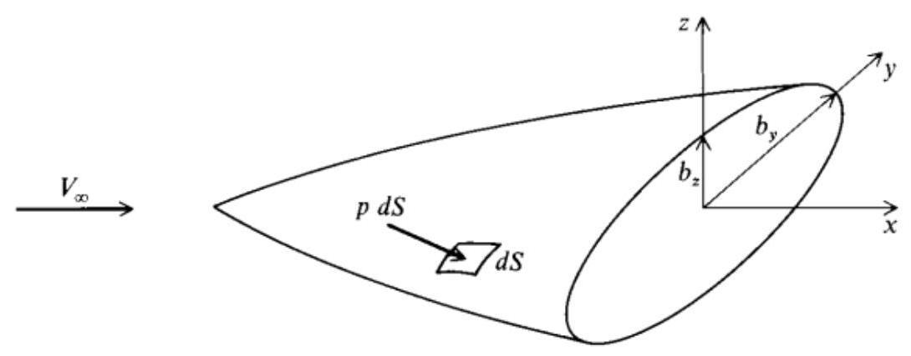

Fig. 4.4 Arbitrary body.

Note: base area is used as reference area here. ${S}_{\text{ base }} \propto  {b}_{y}{b}_{z},{\bar{b}}_{x} \sim  1$ , ${\bar{b}}_{y} \sim  1$ and ${\bar{b}}_{z} \sim  1$

$$
{C}_{L} \propto  \frac{2}{\gamma {p}_{\infty }{M}_{\infty }^{2}{\tau }^{2}}\left\lbrack  {{\iint }_{S}\bar{p}\left( {\bar{x},\bar{y},\bar{z}}\right) \mathrm{d}\bar{x}\mathrm{\;d}\bar{y}}\right\rbrack  \left( {\gamma {p}_{\infty }{M}_{\infty }^{2}{\tau }^{2}}\right) \left( \tau \right)
$$

$$
\frac{{C}_{L}}{\tau } = {F}_{1}\left( {\gamma ,{M}_{\infty }\tau ,\frac{\alpha }{\tau }}\right)
$$

$$
\frac{{C}_{D}}{{\tau }^{2}} = {F}_{2}\left( {\gamma ,{M}_{\infty }\tau ,\frac{\alpha }{\tau }}\right)
$$

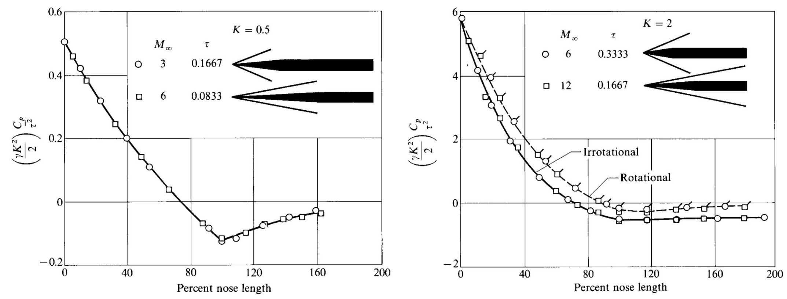

Figure: Pressure distributions over ogive-cylinders, illustration of hypersonic similarity: a) $K = {0.5}$ and b) $K = {2.0}$ (from [26]).

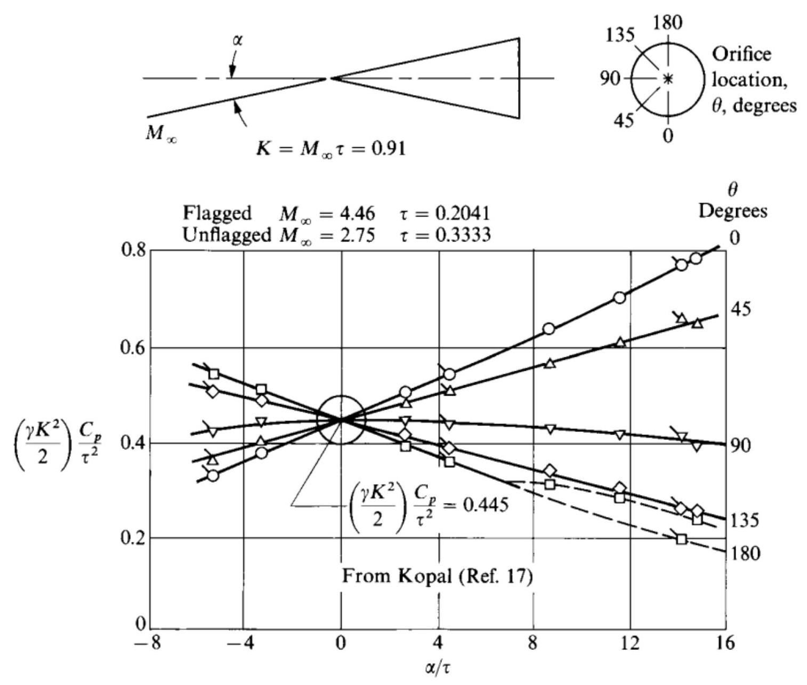

Figure: Cone pressure at different angle of attack but the same $K$ , correlated by hypersonic similarity (from [26])