Mach Number Independence

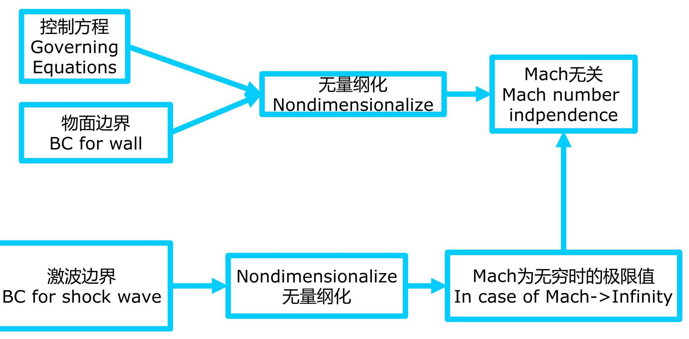

## Isentropic Euler Equations

$$
\frac{\partial \rho }{\partial t} + \frac{\partial \left( {\rho u}\right) }{\partial x} + \frac{\partial \left( {\rho v}\right) }{\partial y} + \frac{\partial \left( {\rho w}\right) }{\partial z} = 0
$$

$$
\rho \frac{\partial u}{\partial t} + {\rho u}\frac{\partial u}{\partial x} + {\rho v}\frac{\partial u}{\partial y} + {\rho w}\frac{\partial u}{\partial z} =  - \frac{\partial p}{\partial x}
$$

$$
\rho \frac{\partial v}{\partial t} + {\rho u}\frac{\partial v}{\partial x} + {\rho v}\frac{\partial v}{\partial y} + {\rho w}\frac{\partial v}{\partial z} =  - \frac{\partial p}{\partial y}
$$

$$
\rho \frac{\partial w}{\partial t} + {\rho u}\frac{\partial w}{\partial x} + {\rho v}\frac{\partial w}{\partial y} + {\rho w}\frac{\partial w}{\partial z} =  - \frac{\partial p}{\partial z}
$$

$$
\frac{\partial s}{\partial t} + u\frac{\partial s}{\partial x} + v\frac{\partial s}{\partial y} + w\frac{\partial s}{\partial z} = 0
$$

Entropy equation can be expressed as

$$
\frac{\partial }{\partial t}\left( \frac{p}{{\rho }^{ \vee  }}\right)  + u\frac{\partial }{\partial x}\left( \frac{p}{{\rho }^{ \vee  }}\right)  + v\frac{\partial }{\partial y}\left( \frac{p}{{\rho }^{ \vee  }}\right)  + w\frac{\partial }{\partial z}\left( \frac{p}{{\rho }^{ \vee  }}\right)  = 0
$$

Note: only valid for isentropic flow!! Not valid for shock waves. 只考虑激波与壁面之间的区域。

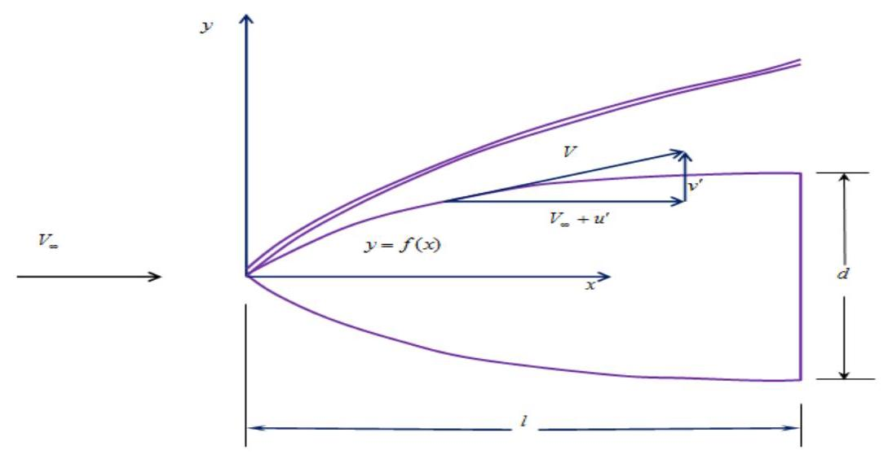

## Nodimensionalization

- Note: there are many ways to apply nondimensional-ization.

- Dimensionless variables are ratios, usually $\sim  \mathrm{O}\left( 1\right)$ , making analysis and computation easier.

- In some fileds, nondimensionlization is not preferred, such as chemical reaction, solid mechanics ...

$$
\rho  = \frac{\widetilde{\rho }}{{\widetilde{\rho }}_{\infty }}
$$

$$
\bar{x} = \frac{x}{l},\bar{y} = \frac{y}{l},\bar{z} = \frac{z}{l}
$$

$$
u = \frac{\widetilde{u}}{{\widetilde{a}}_{\infty }}
$$

${u}_{\infty } = {M}_{\infty }\cos \alpha \cos \beta$

$$
v = \frac{\widetilde{v}}{{\widetilde{a}}_{\infty }}
$$

$$
\bar{u} = \frac{u}{{V}_{\infty }},\bar{v} = \frac{v}{{V}_{\infty }},\bar{W} = \frac{w}{{V}_{\infty }},
$$

$w = \frac{\widetilde{w}}{{\widetilde{a}}_{\infty }} \; {w}_{\infty } = {M}_{\infty }\sin \alpha \cos \beta$

$$
\bar{p} = \frac{p}{{\rho }_{\infty }{V}_{\infty }^{2}},\overline{\rho } = \frac{\rho }{{\rho }_{\infty }},
$$

$p = \frac{\widetilde{p}}{{\widetilde{\rho }}_{\infty }{\left( {\widetilde{a}}_{\infty }\right) }^{2}}$

CFL3D Textbook

## Dimensionless Euler equations

$$
\frac{{\rho }_{\infty }{V}_{\infty }}{l}\left\lbrack  {\frac{\partial \left( {\frac{\rho }{{\rho }_{\infty }} \cdot  \frac{u}{{V}_{\infty }}}\right) }{\partial \left( \frac{x}{l}\right) } + \frac{\partial \left( {\frac{\rho }{{\rho }_{\infty }} \cdot  \frac{v}{{V}_{\infty }}}\right) }{\partial \left( \frac{y}{l}\right) } + \frac{\partial \left( {\frac{\rho }{{\rho }_{\infty }} \cdot  \frac{w}{{V}_{\infty }}}\right) }{\partial \left( \frac{z}{l}\right) }}\right\rbrack   = 0
$$

$$
\frac{\partial }{\partial \left( \bar{x}\right) }\left( {\overline{\rho } \cdot  \bar{u}}\right)  + \frac{\partial }{\partial \left( \bar{y}\right) }\left( {\overline{\rho } \cdot  \bar{v}}\right)  + \frac{\partial }{\partial \left( \bar{z}\right) }\left( {\overline{\rho } \cdot  \bar{w}}\right)  = 0
$$

Continuity equation

$$
\overline{\rho } \cdot  \bar{u}\frac{\partial \bar{u}}{\partial \bar{x}} + \overline{\rho } \cdot  \bar{v}\frac{\partial \bar{u}}{\partial \bar{y}} + \overline{\rho } \cdot  \bar{w}\frac{\partial \bar{u}}{\partial \bar{z}} =  - \frac{\partial \bar{p}}{\partial \bar{x}}
$$

$$
\overline{\rho } \cdot  \bar{u}\frac{\partial \bar{v}}{\partial \bar{x}} + \overline{\rho } \cdot  \bar{v}\frac{\partial \bar{v}}{\partial \bar{y}} + \overline{\rho } \cdot  \bar{w}\frac{\partial \bar{v}}{\partial \bar{z}} =  - \frac{\partial \bar{p}}{\partial \bar{y}}
$$

$$
\overline{\rho } \cdot  \bar{u}\frac{\partial \bar{w}}{\partial \bar{x}} + \overline{\rho } \cdot  \bar{v}\frac{\partial \bar{w}}{\partial \bar{y}} + \overline{\rho } \cdot  \bar{w}\frac{\partial \bar{w}}{\partial \bar{z}} =  - \frac{\partial \bar{p}}{\partial z}
$$

$$
\bar{u}\frac{\partial }{\partial \bar{x}}\left( \frac{\bar{p}}{{\overline{\rho }}^{\gamma }}\right)  + \bar{v}\frac{\partial }{\partial \bar{y}}\left( \frac{\bar{p}}{{\overline{\rho }}^{\gamma }}\right)  + \bar{w}\frac{\partial }{\partial \bar{z}}\left( \frac{\bar{p}}{{\overline{\rho }}^{\gamma }}\right)  = 0
$$

# Boundary condition on the body surface

$$
u{n}_{x} + v{n}_{y} + w{n}_{z} = 0
$$

$$
\bar{u}{n}_{x} + \bar{v}{n}_{y} + \bar{w}{n}_{z} = 0
$$

## Oblique Shock Wave

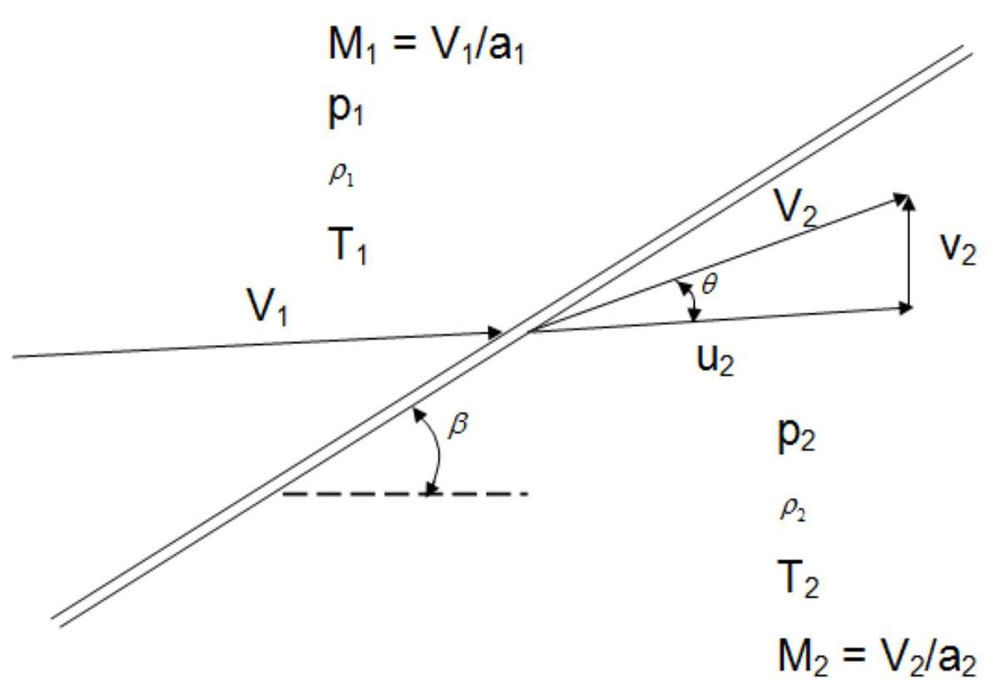

$$
\frac{{p}_{2}}{{p}_{\infty }} = 1 + \frac{2\gamma }{\gamma  + 1}\left( {{M}_{\infty }^{2}{\operatorname{Sin}}^{2}\beta  - 1}\right)
$$

$$
\frac{{\rho }_{2}}{{\rho }_{\infty }} = \frac{\left( {\gamma  + 1}\right) {M}_{\infty }^{2}{\operatorname{Sin}}^{2}\beta }{\left( {\gamma  - 1}\right) {M}_{\infty }^{2}{\operatorname{Sin}}^{2}\beta  + 2}
$$

$$
\frac{{u}_{2}}{{V}_{\infty }} = 1 - \frac{2\left( {{M}_{\infty }^{2}{\operatorname{Sin}}^{2}\beta  - 1}\right) }{\left( {\gamma  + 1}\right) {M}_{\infty }^{2}}
$$

$$
\frac{{v}_{2}}{{V}_{\infty }} = \frac{2\left( {{M}_{\infty }^{2}{\operatorname{Sin}}^{2}\beta  - 1}\right) \operatorname{Cot}\beta }{\left( {\gamma  + 1}\right) {M}_{\infty }^{2}}
$$

$$
\text{ Now, }\frac{{p}_{2}}{{p}_{\infty }} = \frac{{\bar{p}}_{2}{\rho }_{\infty }{V}_{\infty }^{2}}{{p}_{\infty }}
$$

$$
{\bar{p}}_{2} = \frac{1}{\gamma {M}_{\infty }^{2}} + \frac{2\gamma }{\gamma  + 1}\left( \frac{{M}_{\infty }^{2}{\operatorname{Sin}}^{2}\beta  - 1}{\gamma {M}_{\infty }^{2}}\right)
$$

$$
\frac{{p}_{2}}{{p}_{\infty }} = \frac{{\bar{p}}_{2}{V}_{\infty }^{2}}{R{T}_{\infty }}
$$

Or

$$
{\bar{p}}_{2} = \frac{1}{\gamma {M}_{\infty }^{2}} + \frac{2}{\gamma  + 1}\left( {{\operatorname{Sin}}^{2}\beta  - \frac{1}{{M}_{\infty }^{2}}}\right)
$$

$$
\frac{{p}_{2}}{{p}_{\infty }} = \frac{\gamma {\bar{p}}_{2}{V}_{\infty }^{2}}{{\gamma R}{T}_{\infty }}
$$

Also,

$$
{\overline{\rho }}_{2} = \frac{\left( {\gamma  + 1}\right) {M}_{\infty }^{2}{\operatorname{Sin}}^{2}\beta }{\left( {\gamma  - 1}\right) {M}_{\infty }^{2}{\operatorname{Sin}}^{2}\beta  + 2}
$$

$$
\frac{{p}_{2}}{{p}_{\infty }} = \frac{\gamma {\bar{p}}_{2}{V}_{\infty }^{2}}{{a}_{\infty }^{2}}
$$

$$
\overline{{u}_{2}} = 1 - \frac{2\left( {{M}_{\infty }^{2}{\operatorname{Sin}}^{2}\beta  - 1}\right) }{\left( {\gamma  + 1}\right) {M}_{\infty }^{2}}
$$

$$
\frac{{p}_{2}}{{p}_{\infty }} = \gamma {p}_{2}{M}_{\infty }^{2}
$$

$$
\overline{{v}_{2}} = \frac{2\left( {{M}_{\infty }^{2}{\operatorname{Sin}}^{2}\beta  - 1}\right) \operatorname{Cot}\beta }{\left( {\gamma  + 1}\right) {M}_{\infty }^{2}}
$$

在来流马赫数为无穷大的极限情况下，无量纲来流条件分别为 (when Mach approaches to infinity)

$$
{\bar{p}}_{2} \rightarrow  \frac{2{\operatorname{Sin}}^{2}\beta }{\gamma  + 1}
$$

$$
{\overline{\rho }}_{2} \rightarrow  \frac{\gamma  + 1}{\gamma  - 1}
$$

$$
{\bar{v}}_{2} \rightarrow  1 - \frac{{2Si}{n}^{2}\beta }{\gamma  + 1}
$$

$$
{\bar{v}}_{2} \rightarrow  \frac{{2Si}{n}^{2}{\beta Cot\beta }}{\gamma  + 1} = \frac{Sin2\beta }{\gamma  + 1}
$$

So, the flow field doesn't depend on Mach when Mach approaches to infinity.

即在高马赫数情况下，方程与马赫数无关

# Hypersonic Small-Disturbance Equations

Small disturbence

values

of velocity order of

Select reference

合理选择 $u = {V}_{\infty } + {u}^{\prime }$ magnitude estimate

$v = {v}^{\prime }$

量级分析

无量纲参考值

Dimensionless

hypersonic

small-disturbence

equations

无量纲化

小扰动方程

$$
\frac{\partial \left\lbrack  {\rho \left( {{V}_{\infty } + {u}^{\prime }}\right) }\right\rbrack  }{\partial x} + \frac{\partial \left( {\rho {v}^{\prime }}\right) }{\partial y} + \frac{\partial \left( {\rho {w}^{\prime }}\right) }{\partial z} = 0
$$

$$
\rho \left( {{V}_{\infty } + {u}^{\prime }}\right) \frac{\partial \left( {{V}_{\infty } + {u}^{\prime }}\right) }{\partial x} + \rho {v}^{\prime }\frac{\partial \left( {{V}_{\infty } + {u}^{\prime }}\right) }{\partial y} + \rho {w}^{\prime }\frac{\partial \left( {{V}_{\infty } + {u}^{\prime }}\right) }{\partial z} =  - \frac{\partial p}{\partial x}
$$

$$
\rho \left( {{V}_{\infty } + {u}^{\prime }}\right) \frac{\partial {v}^{\prime }}{\partial x} + \rho {v}^{\prime }\frac{\partial {v}^{\prime }}{\partial y} + \rho {w}^{\prime }\frac{\partial {v}^{\prime }}{\partial z} =  - \frac{\partial p}{\partial y}
$$

$$
\rho \left( {{V}_{\infty } + {u}^{\prime }}\right) \frac{\partial {w}^{\prime }}{\partial x} + \rho {v}^{\prime }\frac{\partial {w}^{\prime }}{\partial y} + \rho {w}^{\prime }\frac{\partial {w}^{\prime }}{\partial z} =  - \frac{\partial p}{\partial z}
$$

$$
\left( {{V}_{\infty } + {u}^{\prime }}\right) \frac{\partial }{\partial x}\left( \frac{p}{{\rho }^{\gamma }}\right)  + {v}^{\prime }\frac{\partial }{\partial y}\left( \frac{p}{{\rho }^{\gamma }}\right)  + {w}^{\prime }\frac{\partial }{\partial z}\left( \frac{p}{{\rho }^{\gamma }}\right)  = 0
$$

将Euler方程中的速度做小扰动展开。

为了便于分析，需要选择合理的无量纲方式，将各个变量变换到 1 附近。

Here, we have to select a proper reference value for each variable to scale it to O(1)

$\frac{\mathrm{d}y}{\mathrm{\;d}x} = \mathcal{O}\left( \frac{d}{l}\right) \;\frac{d}{l} = \tau  =$ slender ness ratio

$$
\frac{{v}^{\prime }}{{V}_{\infty } + {u}^{\prime }} = \frac{\mathrm{d}y}{\mathrm{\;d}x} = \mathcal{O}\left( \tau \right)
$$

$$
\frac{{v}^{\prime }}{{V}_{\infty } + {u}^{\prime }} = \frac{\mathrm{d}y}{\mathrm{\;d}x}
$$

$$
u = {V}_{\infty } + {u}^{\prime }
$$

$$
v = {v}^{\prime }
$$

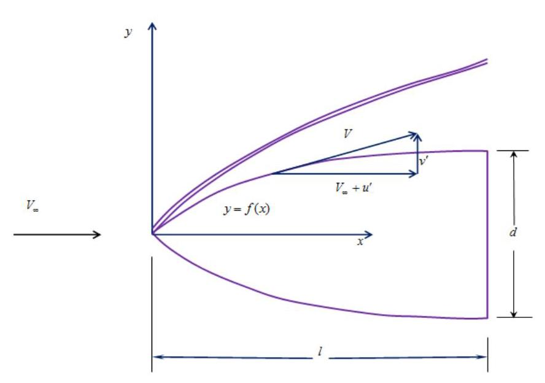

${u}^{\prime } \ll  {V}_{\infty }$

$\frac{{v}^{\prime }}{{V}_{\infty }} = \mathcal{O}\left( \tau \right)$

$$
\frac{{p}_{2}}{{p}_{1}} = 1 + \frac{2\gamma }{\gamma  + 1}\left( {{M}_{1}^{2}{\sin }^{2}\beta  - 1}\right)
$$

$$
\frac{{p}_{2}}{{p}_{\infty }} \rightarrow  \frac{2\gamma }{\gamma  + 1}{M}_{\infty }^{2}{\operatorname{Sin}}^{2}\beta
$$

$$
\frac{{p}_{2}}{{p}_{\infty }} \rightarrow  O\left\lbrack  {{M}_{\infty }^{2}{\tau }^{2}}\right\rbrack
$$

$$
{p}_{2} \rightarrow  O\left\lbrack  {{M}_{\infty }^{2}{\tau }^{2}{p}_{\infty }}\right\rbrack
$$

$$
\frac{{\rho }_{2}}{{\rho }_{\infty }} \rightarrow  \frac{\left( \gamma  + 1\right) }{\left( \gamma  - 1\right) } \rightarrow  \rho  = \frac{\rho }{{\rho }_{\infty }}
$$

${\Delta u} = {V}_{\infty } - {u}_{2} \; \overline{{u}^{\prime }} = \frac{{u}^{\prime }}{\left( {V}_{\infty }{\tau }^{2}\right) }$

$\overline{{v}^{\prime }} = \frac{{v}^{\prime }}{{V}_{\infty }\tau }$

$x \rightarrow  O\left( l\right)$

$\frac{y}{x} \rightarrow  O\left( \mathrm{T}\right) \; \overline{x} = \frac{x}{l}\overline{y} = \frac{y}{l\mathrm{\;T}}\overline{z} = \frac{z}{l\mathrm{\;T}} \; y \rightarrow  O\left( d\right)$

$$
\bar{x} = \frac{x}{l}\;\bar{y} = \frac{y}{l\tau }\;\bar{z} = \frac{z}{l\tau }
$$

$$
{\bar{u}}^{\prime } = \frac{{u}^{\prime }}{{V}_{\infty }{\tau }^{2}}\;{\bar{v}}^{\prime } = \frac{{v}^{\prime }}{{V}_{\infty }\tau }\;{\bar{w}}^{\prime } = \frac{{w}^{\prime }}{{V}_{\infty }\tau }
$$

$$
\bar{p} = \frac{p}{\gamma {M}_{\infty }^{2}{\tau }^{2}{p}_{\infty }}\;\overline{\rho } = \frac{\rho }{{\rho }_{\infty }}
$$

$$
\frac{\partial \left\lbrack  {\rho \left( {{V}_{\infty } + {u}^{\prime }}\right) }\right\rbrack  }{\partial x} + \frac{\partial \left( {\rho {v}^{\prime }}\right) }{\partial y} + \frac{\partial \left( {\rho {w}^{\prime }}\right) }{\partial z} = 0
$$

Continuity equation

连续方程

$$
\frac{\partial }{\partial \bar{x}}\left\lbrack  {\overline{\rho }\left( {\frac{1}{{\tau }^{2}} + \underline{\left\lbrack  {\bar{u}}^{\prime }\right\rbrack  }}\right) }\right\rbrack  \left\lbrack  {{\rho }_{\infty }{V}_{\infty }{\tau }^{2}}\right\rbrack   + \frac{\partial \left( {\overline{\rho }{\bar{v}}^{\prime }}\right) }{\partial \bar{y}}\left\lbrack  \frac{{\rho }_{\infty }{V}_{\infty }\tau }{\tau }\right\rbrack   + \frac{\partial \left( {\overline{\rho }{\bar{w}}^{\prime }}\right) }{\partial \bar{z}}\left\lbrack  \frac{{\rho }_{\infty }{V}_{\infty }\tau }{\tau }\right\rbrack   = 0
$$

$$
\frac{\partial \overline{\rho }}{\partial \bar{x}} + \frac{\partial \left( {\overline{\rho }{\bar{v}}^{\prime }}\right) }{\partial \bar{y}} + \frac{\partial \left( {\overline{\rho }{\bar{w}}^{\prime }}\right) }{\partial \bar{z}} = 0
$$

X momentum 动量方程

$$
\rho \left( {{V}_{\infty } + {u}^{\prime }}\right) \frac{\partial \left( {{V}_{\infty } + {u}^{\prime }}\right) }{\partial x} + \rho {v}^{\prime }\frac{\partial \left( {{V}_{\infty } + {u}^{\prime }}\right) }{\partial y} + \rho {w}^{\prime }\frac{\partial \left( {{V}_{\infty } + {u}^{\prime }}\right) }{\partial z} =  - \frac{\partial p}{\partial x}
$$

$$
\overline{\rho }\left( {\frac{1}{{\tau }^{2}} + {\bar{u}}^{\prime }}\right) \frac{\partial }{\partial \bar{x}}\left( {\frac{1}{{\tau }^{2}} + {\bar{u}}^{\prime }}\right) \left\lbrack  {{\rho }_{\infty }{V}_{\infty }^{2}{\tau }^{4}}\right\rbrack   + \overline{\rho }{\bar{v}}^{\prime }\frac{\partial }{\partial \bar{y}}\left( {\frac{1}{{\tau }^{2}} + {\bar{u}}^{\prime }}\right) \left\lbrack  {{\rho }_{\infty }{V}_{\infty }^{2}{\tau }^{3}}\right\rbrack
$$

$$
+ \overline{\rho }{\bar{w}}^{\prime }\frac{\partial }{\partial \bar{z}}\left( {\frac{1}{{\tau }^{2}} + {\bar{u}}^{\prime }}\right) \left\lbrack  \frac{{\rho }_{\infty }{V}_{\infty }^{2}{\tau }^{3}}{\tau }\right\rbrack   =  - \frac{\partial \bar{p}}{\partial \bar{x}}\left\lbrack  {\gamma {M}_{\infty }^{2}{\tau }^{2}{p}_{\infty }}\right\rbrack
$$

Since ${\rho }_{\infty }{V}_{\infty }^{2} = \gamma {p}_{\infty }{M}_{\infty }^{2}$

$$
\overline{\rho }\left( {1 + \overline{{\bar{u}}^{\prime }{\tau }^{2}}}\right) \frac{\partial {\bar{u}}^{\prime }}{\partial \bar{x}} + \overline{\rho }{\bar{v}}^{\prime }\frac{\partial {\bar{u}}^{\prime }}{\partial \bar{y}} + \overline{\rho }{\bar{w}}^{\prime }\frac{\partial {\bar{u}}^{\prime }}{\partial \bar{z}} =  - \frac{\partial \bar{p}}{\partial \bar{x}}
$$

$$
\left( {{V}_{\infty } + {u}^{\prime }}\right) \frac{\partial }{\partial x}\left( \frac{p}{{\rho }^{\gamma }}\right)  + {v}^{\prime }\frac{\partial }{\partial y}\left( \frac{p}{{\rho }^{\gamma }}\right)  + {w}^{\prime }\frac{\partial }{\partial z}\left( \frac{p}{{\rho }^{\gamma }}\right)  = 0
$$

$$
\left( {\frac{1}{{\tau }^{2}} + {\bar{u}}^{\prime }}\right) \frac{\partial }{\partial \bar{x}}\frac{\bar{p}}{{\overline{\rho }}^{\gamma }}\left\lbrack  {{V}_{\infty }{\tau }^{4}\gamma {p}_{\infty }{M}_{\infty }^{2}{\rho }_{\infty }^{\gamma }}\right\rbrack   + {\bar{v}}^{\prime }\frac{\partial }{\partial \bar{y}}\frac{\bar{p}}{{\overline{\rho }}^{\gamma }}\left\lbrack  \frac{\gamma {V}_{\infty }{\tau }^{3}{p}_{\infty }{M}_{\infty }^{2}{\rho }_{\infty }^{\gamma }}{\tau }\right\rbrack
$$

$$
+ {\bar{w}}^{\prime }\frac{\partial }{\partial \bar{z}}\frac{\bar{p}}{{\overline{\rho }}^{\gamma }}\left\lbrack  \frac{{V}_{\infty }{\tau }^{3}\gamma {p}_{\infty }{M}_{\infty }^{2}{\rho }_{\infty }^{\gamma }}{\tau }\right\rbrack   = 0
$$

$$
\text{ Cancel }\begin{array}{r} {V}_{\infty }{\tau }^{3}\gamma {p}_{\infty }{M}_{\infty }^{2}{\rho }_{\infty }^{\gamma } \\   \cdot   \end{array}
$$

$$
\left( {1 + \overline{\left\lbrack  {\tau }^{2}{\bar{u}}^{\prime }\right\rbrack  }}\right) \frac{\partial }{\partial \bar{x}}\left( \frac{\bar{p}}{{\overline{\rho }}^{\gamma }}\right)  + {\bar{v}}^{\prime }\frac{\partial }{\partial \bar{y}}\left( \frac{\bar{p}}{{\overline{\rho }}^{\gamma }}\right)  + {\bar{w}}^{\prime }\frac{\partial }{\partial \bar{z}}\left( \frac{\bar{p}}{{\overline{\rho }}^{\gamma }}\right)  = 0
$$

Nondimensionalization of wall normal direction and angle of attack

$$
{n}_{x} = \sin \theta  \approx  \tau  \Rightarrow  \operatorname{Set}{\bar{n}}_{x} = \frac{{n}_{x}}{\tau } = O\left( 1\right)  \Rightarrow  {n}_{x} = \tau {\bar{n}}_{x}
$$

$$
{n}_{y} = \cos \theta  \approx  1 \Rightarrow  \text{ Set }{\bar{n}}_{y} = {n}_{y}
$$

Also ${\bar{n}}_{z} = {n}_{z}$

$$
O\left( \alpha \right)  = O\left( \tau \right)  \Rightarrow  \text{ Set }\overline{\alpha } = \frac{\alpha }{\tau }
$$

$$
\frac{\partial \overline{\rho }}{\partial \bar{x}} + \frac{\partial \left( {\overline{\rho }{\bar{v}}^{\prime }}\right) }{\partial \bar{y}} + \frac{\partial \left( {\overline{\rho }{\bar{w}}^{\prime }}\right) }{\partial \bar{z}} = 0
$$

$$
\overline{\rho }\frac{\partial {\bar{u}}^{\prime }}{\partial \bar{x}} + \overline{\rho }{\bar{v}}^{\prime }\frac{\partial {\bar{u}}^{\prime }}{\partial \bar{y}} + \overline{\rho }{\bar{w}}^{\prime }\frac{\partial {\bar{u}}^{\prime }}{\partial \bar{z}} =  - \frac{\partial \bar{p}}{\partial \bar{x}}
$$

$$
\overline{\rho }\frac{\partial {\bar{v}}^{\prime }}{\partial \bar{x}} + \overline{\rho }{\bar{v}}^{\prime }\frac{\partial {\bar{v}}^{\prime }}{\partial \bar{y}} + \overline{\rho }{\bar{w}}^{\prime }\frac{\partial {\bar{v}}^{\prime }}{\partial \bar{z}} =  - \frac{\partial \bar{p}}{\partial \bar{y}}
$$

$$
\overline{\rho }\frac{\partial {\bar{w}}^{\prime }}{\partial \bar{x}} + \overline{\rho }{\bar{v}}^{\prime }\frac{\partial {\bar{w}}^{\prime }}{\partial \bar{y}} + \overline{\rho }{\bar{w}}^{\prime }\frac{\partial {\bar{w}}^{\prime }}{\partial \bar{z}} =  - \frac{\partial \bar{p}}{\partial \bar{z}}
$$

$$
\frac{\partial }{\partial \bar{x}}\left( \frac{\bar{p}}{{\overline{\rho }}^{\gamma }}\right)  + {\bar{v}}^{\prime }\frac{\partial }{\partial \bar{y}}\left( \frac{\bar{p}}{{\overline{\rho }}^{\gamma }}\right)  + {\bar{w}}^{\prime }\frac{\partial }{\partial \bar{z}}\left( \frac{\bar{p}}{{\overline{\rho }}^{\gamma }}\right)  = 0
$$

These equations and the correspoing boundary equations of unity order comprise the equations for Hypersonic Small Disturbance theory. Following inferences can be drawn from the this theory,

1. These equations are limited to hypersonic flow over slender bodies.

2. $u$ is decoupled from the system of equations. Once others are solved, $u$ can be found out.

3. This reasserts the fact that, change in velocity in the flow direction is much smaller than the change in velocity perpendicular to the flow direction.

## Hypersonic Similarity

通过研究小扰动方程的边界条件来得到相似率 from Hypersonic Small Disturbance theory.

# Wall boundary condition

$$
u{n}_{x} + v{n}_{y} + w{n}_{z} = 0
$$

$$
\left( {{V}_{\infty } + {u}^{\prime }}\right) {n}_{x} + {v}^{\prime }{n}_{y} + {w}^{\prime }{n}_{z} = 0
$$

$$
\left( {\frac{1}{{\mathrm{T}}^{2}} + \overline{\imath }{u}^{\prime }}\right) {n}_{x}\left( {{V}_{\infty }{\mathrm{T}}^{2}}\right)  + \overline{\imath }{v}^{\prime }{n}_{y}\left( {{V}_{\infty }\mathrm{T}}\right)  + \overline{\imath }{w}^{\prime }{n}_{z}\left( {{V}_{\infty }\mathrm{T}}\right)  = 0
$$

$$
{n}_{x} = \mathrm{T}{\bar{n}}_{x}\;{n}_{y} = {\bar{n}}_{y}\;{n}_{z} = {\bar{n}}_{z}
$$

$$
\left( {\frac{1}{{\mathrm{T}}^{2}} + \bar{u}{}^{\prime }}\right) \mathrm{T}{\bar{n}}_{x}\left( {{V}_{\infty }{\mathrm{T}}^{2}}\right)  + \bar{v}{}^{\prime }{\bar{n}}_{y}\left( {{V}_{\infty }\mathrm{T}}\right)  + \bar{w}{}^{\prime }{\bar{n}}_{z}\left( {{V}_{\infty }\mathrm{T}}\right)  = 0
$$

$$
\left( {1 + {\tau }^{2}{\bar{u}}^{\prime }}\right) {\bar{n}}_{x} + {v}^{\prime }{\bar{n}}_{y} + {w}^{\prime }{\bar{n}}_{z} = 0
$$

$$
{\bar{n}}_{x} + {v}^{\prime }{\bar{n}}_{y} + {w}^{\prime }{\bar{n}}_{z} = 0
$$

## Shock boundary condition

$$
\frac{{p}_{2}}{{p}_{\infty }} = 1 + \frac{2\gamma }{\gamma  + 1}\left( {{M}_{\infty }^{2}{\operatorname{Sin}}^{2}\beta  - 1}\right)
$$

$$
\frac{{\rho }_{2}}{{\rho }_{\infty }} = \frac{\left( {\gamma  + 1}\right) {M}_{\infty }^{2}{\operatorname{Sin}}^{2}\beta }{\left( {\gamma  - 1}\right) {M}_{\infty }^{2}{\operatorname{Sin}}^{2}\beta  + 2}
$$

nondimensionalize these equations

$$
\frac{{u}_{2}}{{V}_{\infty }} = 1 - \frac{2\left( {{M}_{\infty }^{2}{\operatorname{Sin}}^{2}\beta  - 1}\right) }{\left( {\gamma  + 1}\right) {M}_{\infty }^{2}}
$$

Only consider small angles

$$
\frac{{v}_{2}}{{V}_{\infty }} = \frac{2\left( {{M}_{\infty }^{2}{\operatorname{Sin}}^{2}\beta  - 1}\right) \operatorname{Cot}\beta }{\left( {\gamma  + 1}\right) {M}_{\infty }^{2}}
$$

只考虑小角度

$$
\sin \beta  \approx  \beta  \approx  {\left( \frac{dy}{dx}\right) }_{s} = {\left( \frac{{d}^{ - }y}{{d}^{ - }x}\right) }_{s}T
$$

$$
\frac{{\rho }_{2}}{{\rho }_{\infty }} = {\rho }_{2} = \frac{\left( {\gamma  + 1}\right) {M}_{\infty }^{2}{\sin }^{2}\beta }{\left( {\gamma  - 1}\right) {M}_{\infty }^{2}{\sin }^{2}\beta  + 2} \rightarrow  {\rho }_{2} = \left( \frac{\gamma  + 1}{\gamma  - 1}\right) \left\lbrack  \frac{{\left( {d}^{ - }y/{d}^{ - }x\right) }_{s}^{2}}{{\left( {d}^{ - }y/{d}^{ - }x\right) }_{s}^{2} + 2/\left( {\gamma  - 1}\right) {M}_{\infty }^{2}{\tau }^{2}}\right\rbrack
$$

$$
{\rho }_{2} = \left( \frac{y + 1}{y - 1}\right) \left\lbrack  \frac{{\left( {d}^{ - }y/{d}^{ - }x\right) }_{s}^{2}}{{\left( {d}^{ - }y/{d}^{ - }x\right) }_{s}^{2} + 2/\left( {y - 1}\right) \left( {{M}_{\infty }^{2}{\tau }^{2}}\right) }\right\rbrack
$$

$$
{\bar{p}}_{2} = \frac{2}{y + 1}\left\lbrack  {{\left( \frac{d\bar{y}}{dx}\right) }_{s}^{2} + \frac{1 - y}{2\sqrt{{M}_{\infty }^{2}{\tau }^{2}}}}\right\rbrack
$$

$$
{\bar{u}}_{2}^{\prime } =  - \frac{2}{\gamma  + 1}\left\lbrack  {{\left( \frac{d\bar{y}}{d\bar{x}}\right) }_{s}^{2} - \frac{1}{\left( {\bar{M}}_{\infty }^{2}{\tau }^{2}\right) }}\right\rbrack
$$

$$
{v}_{2}^{\prime } = \frac{2}{\gamma  + 1}\left\lbrack  {{\left( \frac{d\bar{y}}{dx}\right) }_{s}^{2} - \frac{1}{\left( {M}_{\infty }^{2}{\tau }^{2}\right) }}\right\rbrack  \frac{1}{\left( d\bar{y}/d\bar{x}\right) }
$$

$K \equiv  {M}_{\infty }\mathrm{T}$ We can get Hypersonic similarity parameter as

scaling laws for the coefficients of aerodynamic forces

$$
\bar{p} = \bar{p}\left( {\bar{x},\bar{y},\bar{z},\gamma ,{M}_{\infty }\tau ,\frac{\alpha }{\tau }}\right)
$$

$$
{C}_{p} = \frac{2\left( {p - {p}_{\infty }}\right) {\tau }^{2}}{\gamma {p}_{\infty }{M}_{\infty }^{2}{\tau }^{2}} = 2{\tau }^{2}\left( {\bar{p} - \frac{1}{\gamma {M}_{\infty }^{2}{\tau }^{2}}}\right)
$$

For hypersonic small disturbance flows, this is the new definition of "pressure coeff"

$$
\frac{{C}_{p}}{{\tau }^{2}} = {f}_{1}\left( {\bar{x},\bar{y},\bar{z},\gamma ,{M}_{\infty }\tau ,\frac{\alpha }{\tau }}\right)
$$

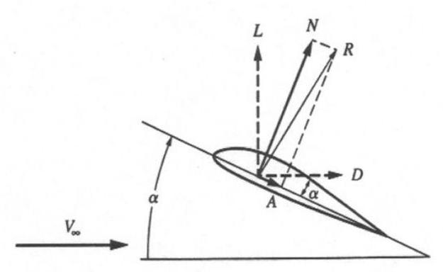

Try to nondimensionalize coeff of lift and drag

$$
{c}_{l} = \frac{1}{l}{\int }_{0}^{l}\left( {{C}_{{p}_{l}} - {C}_{{p}_{u}}}\right) \mathrm{d}x
$$

$$
\frac{{c}_{l}}{{\tau }^{2}} = {\int }_{0}^{1}\left( {\frac{{C}_{{p}_{l}}}{{\tau }^{2}} - \frac{{C}_{{p}_{u}}}{{\tau }^{2}}}\right) \mathrm{d}\bar{x} = {f}_{2}\left( {\gamma ,{M}_{\infty }\tau ,\frac{\alpha }{\tau }}\right)
$$

$$
\bar{x} = \frac{x}{l}
$$

$$
{c}_{d} = \frac{1}{l}{\int }_{0}^{1}\left( {{C}_{{p}_{l}} + {C}_{{p}_{u}}}\right) \mathrm{d}\left( \frac{y}{l\tau }\right) \left( {l\tau }\right)  = \tau {\int }_{0}^{1}\left( {{C}_{{p}_{l}} + {C}_{{p}_{u}}}\right) \mathrm{d}\bar{y}
$$

$$
\frac{{c}_{d}}{{\tau }^{3}} = {\int }_{0}^{1}\left( {\frac{{C}_{{p}_{l}}}{{\tau }^{2}} + \frac{{C}_{{p}_{u}}}{{\tau }^{2}}}\right) \mathrm{d}\bar{y} = {f}_{3}\left( {\gamma ,{M}_{\infty }\tau ,\frac{\alpha }{\tau }}\right)
$$

$$
{c}_{d} = \frac{1}{l}{\int }_{0}^{l}\left( {{C}_{{p}_{l}} + {C}_{{p}_{u}}}\right) \mathrm{d}y
$$

$$
\bar{y} = \frac{y}{l\tau }
$$

$$
L = {\iint }_{S}p\left( {x, y, z}\right) \mathrm{d}x\mathrm{\;d}y
$$

$$
L = \left\lbrack  {{\int }_{S}\bar{p}\left( {\bar{x},\bar{y},\bar{z}}\right) \mathrm{d}\bar{x}\mathrm{\;d}\bar{y}}\right\rbrack  \left( {\gamma {p}_{\infty }{M}_{\infty }^{2}{\tau }^{2}}\right) \left( \tau \right)
$$

$$
{C}_{L} \propto  \frac{2}{\gamma {p}_{\infty }{M}_{\infty }^{2}{\tau }^{2}}\left\lbrack  {\iint \bar{p}\left( {\bar{x},\bar{y},\bar{z}}\right) \mathrm{d}\bar{x}\mathrm{\;d}\bar{y}}\right\rbrack  \left( {\gamma {p}_{\infty }{M}_{\infty }^{2}{\tau }^{2}}\right) \left( \tau \right)
$$

$$
\frac{{C}_{L}}{\tau } = {F}_{1}\left( {\gamma ,{M}_{\infty }\tau ,\frac{\alpha }{\tau }}\right) \;\frac{{C}_{D}}{{\tau }^{2}} = {F}_{2}\left( {\gamma ,{M}_{\infty }\tau ,\alpha /\tau }\right)
$$

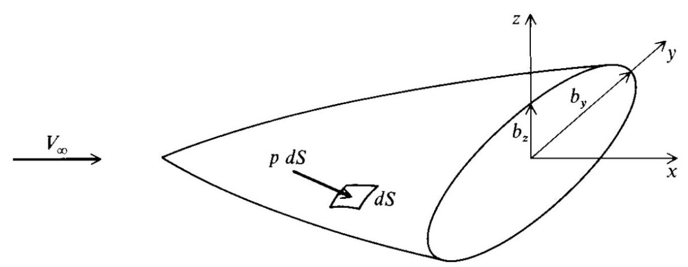

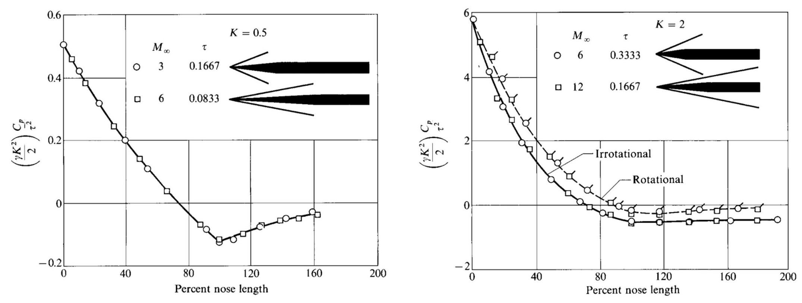

## Different shape and Mach numbers, but the K values are the same

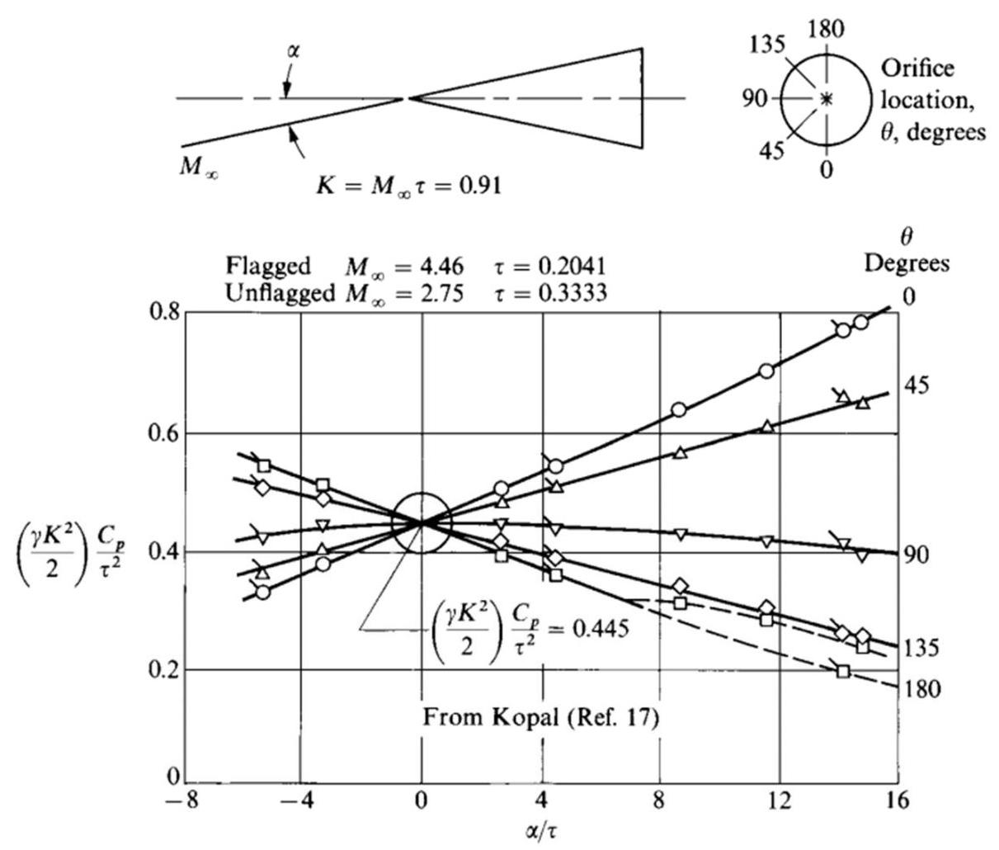

Fig. 4.6 Cone pressure at angle of attack, correlated by hypersonic similarity (from [26]).

## Different angle of attack, but K values are the same

# Small-disturbance solution for a slender body

2D small-disturbance hypersonic equations

$$
\frac{\partial \overline{\rho }}{\partial \bar{x}} + \frac{\partial \left( {\overline{\rho }{\bar{v}}^{\prime }}\right) }{\partial \bar{y}} = 0
$$

$$
\overline{\rho }\frac{\partial {\bar{v}}^{\prime }}{\partial \bar{x}} + \overline{\rho }{\bar{v}}^{\prime }\frac{\partial {\bar{v}}^{\prime }}{\partial \bar{y}} =  - \frac{\partial \bar{p}}{\partial \bar{y}}
$$

$$
\frac{\partial }{\partial \bar{x}}\left( \frac{\bar{p}}{{\overline{\rho }}^{\gamma }}\right)  + {\bar{v}}^{\prime }\frac{\partial }{\partial \bar{y}}\left( \frac{\bar{p}}{{\overline{\rho }}^{\gamma }}\right)  = 0
$$

- Decrease number of unknowns

- Convert PDE(partial differential equation) to ODE (ordinary differential equation)

2D small-disturbence hypersonic equations

By introducing stream function to satisfy the continuity equation

$$
\frac{\partial \psi }{\partial \bar{y}} = \overline{\rho }
$$

$$
\frac{\partial \overline{\rho }}{\partial \bar{x}} + \frac{\partial \left( {\overline{\rho }{\bar{v}}^{\prime }}\right) }{\partial \bar{y}} = 0
$$

$$
\overline{\rho }\frac{\partial {\bar{v}}^{\prime }}{\partial \bar{x}} + \overline{\rho }{\bar{v}}^{\prime }\frac{\partial {\bar{v}}^{\prime }}{\partial \bar{y}} =  - \frac{\partial \bar{p}}{\partial \bar{y}}
$$

$$
\frac{\partial }{\partial \bar{x}}\left( \frac{\bar{p}}{{\overline{\rho }}^{\gamma }}\right)  + {\bar{v}}^{\prime }\frac{\partial }{\partial \bar{y}}\left( \frac{\bar{p}}{{\overline{\rho }}^{\gamma }}\right)  = 0
$$

$$
\frac{\partial \psi }{\partial \bar{x}} =  - \overline{\rho }{\bar{v}}^{\prime }
$$

进一步，考虑将动量方程与能量方程用流函数表达，以减少未知量个数，最终期望将单变量PDE。因此需要将速度、压强和密度表达为流函数。

We try to express the momentum and energy equations in stream function to decrease the number of dependent variables. Thus we have to write u, v and p in stream function.

$$
\frac{\partial \psi }{\partial \bar{y}} = \overline{\rho }
$$

$$
\frac{\partial {\bar{v}}^{\prime }}{\partial \bar{x}} = \frac{-{\psi }_{\bar{y}}{\psi }_{\bar{x}\bar{x}} + {\psi }_{x}{\psi }_{\bar{x}\bar{y}}}{{\left( {\psi }_{\bar{y}}\right) }^{2}}
$$

$$
{\bar{v}}^{\prime } =  - \frac{{\psi }_{\bar{x}}}{\overline{\rho }} =  - \frac{{\psi }_{\bar{x}}}{{\psi }_{\bar{y}}}
$$

$$
\frac{\partial \psi }{\partial \bar{x}} =  - \overline{\rho }{\bar{v}}^{\prime }
$$

$$
\frac{\partial {\bar{v}}^{\prime }}{\partial \bar{y}} = \frac{-{\psi }_{\bar{y}}{\psi }_{\bar{x}\bar{y}} + {\psi }_{\bar{x}}{\psi }_{\bar{y}\bar{y}}}{{\left( {\psi }_{\bar{y}}\right) }^{2}}
$$

$$
\overline{\rho } = {\psi }_{\bar{y}}
$$

沿流线等熵

Entropy is constant along a streamline

$$
\frac{\bar{p}}{{\overline{\rho }}^{\gamma }} = \omega \left( \psi \right)
$$

$\bar{p} = \omega {\overline{\rho }}^{\gamma } = \omega {\left( {\psi }_{\bar{y}}\right) }^{\gamma }$

$$
\frac{\partial \bar{p}}{\partial \bar{y}} = {\omega \gamma }{\left( {\psi }_{\bar{y}}\right) }^{\gamma  - 1}{\psi }_{\bar{y}\bar{y}} + {\left( {\psi }_{\bar{y}}\right) }^{\gamma }\frac{\partial \omega }{\partial \bar{y}}
$$

$$
\overline{\frac{\partial \omega }{\partial \bar{y}}} = \overline{\left( \frac{\partial \omega }{\partial \psi }\right) }\frac{\partial \psi }{\partial \bar{y}} = {\omega }^{\prime }{\psi }_{\bar{y}}
$$

$$
\frac{\partial \bar{p}}{\partial \bar{y}} = {\gamma \omega }{\left( {\psi }_{\bar{y}}\right) }^{\gamma  - 1}{\psi }_{\bar{y}\bar{y}} + {\omega }^{\prime }{\left( {\psi }_{\bar{y}}\right) }^{\gamma  + 1}
$$

$\frac{\partial \psi }{\partial \bar{x}} =  - \overline{\rho }{\bar{v}}^{\prime }$

$$
\frac{\partial {\bar{v}}^{\prime }}{\partial \bar{x}} = \frac{-{\psi }_{\bar{y}}{\psi }_{\bar{x}\bar{x}} + {\psi }_{x}{\psi }_{\bar{x}\bar{y}}}{{\left( {\psi }_{\bar{y}}\right) }^{2}}
$$

$\overline{\rho } = {\psi }_{\bar{y}}$

$$
\frac{\partial {\bar{v}}^{\prime }}{\partial \bar{y}} = \frac{-{\psi }_{\bar{y}}{\psi }_{\bar{x}\bar{y}} + {\psi }_{\bar{x}}{\psi }_{\bar{y}\bar{y}}}{{\left( {\psi }_{\bar{y}}\right) }^{2}}
$$

$$
\overline{\rho }\frac{\partial {\bar{v}}^{\prime }}{\partial \bar{x}} + \overline{\rho }{\bar{v}}^{\prime }\frac{\partial {\bar{v}}^{\prime }}{\partial \bar{y}} =  - \frac{\partial \bar{p}}{\partial \bar{y}}
$$

$$
\frac{\partial \bar{p}}{\partial \bar{y}} = {\gamma \omega }{\left( {\psi }_{\bar{y}}\right) }^{\gamma  - 1}{\psi }_{\bar{y}\bar{y}} + {\omega }^{\prime }{\left( {\psi }_{\bar{y}}\right) }^{\gamma  + 1}
$$

$$
{\psi }_{\bar{y}}\left\lbrack  \frac{-{\psi }_{\bar{y}}{\psi }_{\bar{x}\bar{x}} + {\psi }_{\bar{x}}{\psi }_{\bar{x}\bar{y}}}{{\left( {\psi }_{y}\right) }^{2}}\right\rbrack   + \left( {-{\psi }_{\bar{x}}}\right) \left\lbrack  \frac{-{\psi }_{\bar{y}}{\psi }_{\bar{x}\bar{y}} + {\psi }_{x}{\psi }_{\bar{y}\bar{y}}}{{\left( {\psi }_{\bar{y}}\right) }^{2}}\right\rbrack
$$

$$
=  - {\gamma \omega }{\left( {\psi }_{\bar{y}}\right) }^{\gamma  - 1}{\psi }_{\bar{y}\bar{y}} - {\omega }^{\prime }{\left( {\psi }_{\bar{y}}\right) }^{\gamma  + 1}
$$

$$
{\left( {\psi }_{\bar{y}}\right) }^{2}{\psi }_{\bar{x}\bar{x}} - 2{\psi }_{x}{\psi }_{\bar{y}}{\psi }_{\bar{x}\bar{y}} + {\left( {\psi }_{\bar{x}}\right) }^{2}{\psi }_{\bar{y}\bar{y}} = {\left( {\psi }_{\bar{y}}\right) }^{\gamma  + 1}\left\lbrack  {{\gamma \omega }{\psi }_{\bar{y}\bar{y}} + {\omega }^{\prime }{\left( {\psi }_{\bar{y}}\right) }^{2}}\right\rbrack
$$

Y momentum

$$
\frac{\partial \overline{\rho }}{\partial \bar{x}} + \frac{\partial \left( {\overline{\rho }{\bar{v}}^{\prime }}\right) }{\partial \bar{r}} + \frac{\overline{\rho }{\bar{v}}^{\prime }}{\bar{r}} = 0
$$

$$
\overline{\rho }\frac{\partial {\bar{v}}^{\prime }}{\partial \bar{x}} + \overline{\rho }{\bar{v}}^{\prime }\frac{\partial {\bar{v}}^{\prime }}{\partial \bar{r}} =  - \frac{\partial \bar{p}}{\partial \bar{r}}
$$

$$
\frac{\partial }{\partial \bar{x}}\left( \frac{\bar{p}}{{\overline{\rho }}^{\gamma }}\right)  + {\bar{v}}^{\prime }\frac{\partial }{\partial \bar{r}}\left( \frac{\bar{p}}{{\overline{\rho }}^{\gamma }}\right)  = 0
$$

$$
\frac{\partial \psi }{\partial \bar{r}} = \bar{r}\overline{\rho }
$$

$$
\frac{\partial \psi }{\partial \bar{x}} =  - \bar{r}\overline{\rho }{\bar{v}}^{\prime }
$$

The momentum equation in cylindrical coordinate

$$
{\left( {\psi }_{\bar{r}}\right) }^{2}{\psi }_{\bar{x}\bar{x}} - 2{\psi }_{\bar{x}}{\psi }_{\bar{r}}{\psi }_{\bar{x}\bar{r}} + {\left( {\psi }_{\bar{x}}\right) }^{2}{\psi }_{\bar{r}\bar{r}}
$$

$$
= \frac{{\left( {\psi }_{\bar{r}}\right) }^{\gamma  + 1}}{{\bar{r}}^{\gamma  - 1}}\left\lbrack  {{\gamma \omega }\left( {{\psi }_{\bar{r}\bar{r}} - \frac{{\psi }_{\bar{r}}}{\bar{r}}}\right)  + {\omega }^{\prime }{\left( {\psi }_{\bar{r}}\right) }^{2}}\right\rbrack
$$

So, the PDE contains only one dependent variable: stream function, which makes analytical solution possible.

Energy equation??? Omega ??????

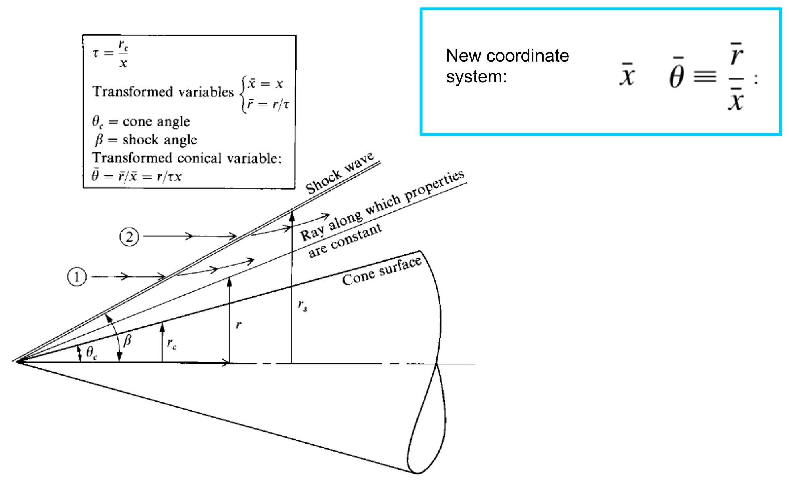

Fig. 4.7 Flow model for a cone.

Idea: PDE system -> PDE -> ODE

According to the definition of stream function

$\frac{\partial \psi }{\partial \bar{r}} = \bar{r}\overline{\rho } \; \psi  \propto  \frac{1}{2}{r}^{2}\rho  \rightarrow  \psi  \propto  {r}^{2}g\left( \theta \right)$ 圆锥流特性

$\psi  = {\bar{x}}^{2}f\left( \overline{\theta }\right)$

$r = x\overline{\theta }$

Segregation variable

method

${\left( \frac{\partial \psi }{\partial \overline{\theta }}\right) }_{\bar{x}} = {\bar{x}}^{2}{f}^{\prime }\left( \overline{\theta }\right) \; {\left( \frac{\partial \overline{\theta }}{\partial \bar{r}}\right) }_{\bar{x}} = \frac{1}{\bar{x}} \; {\left( \frac{\partial \bar{x}}{\partial \bar{r}}\right) }_{\bar{x}} \equiv  0$

$$
{\left( \frac{\partial \psi }{\partial \bar{r}}\right) }_{\bar{x}} = {\left( \frac{\partial \psi }{\partial \overline{\theta }}\right) }_{\bar{x}}{\left( \frac{\partial \overline{\theta }}{\partial \bar{r}}\right) }_{\bar{x}} + {\left( \frac{\partial \psi }{\partial \bar{x}}\right) }_{\overline{\theta }}{\left( \frac{\partial \bar{x}}{\partial \bar{r}}\right) }_{\bar{x}}
$$

${\psi }_{\bar{r}} = \bar{x}{f}^{\prime }\left( \overline{\theta }\right)$

Try to express the PDE with $f$ and its derivatives

$$
\frac{\partial {\psi }_{r}}{\partial x} = {f}^{\prime }\left( \theta \right)
$$

$$
{\psi }_{\bar{r}\bar{x}} \equiv  {\left( \frac{\partial {\psi }_{\bar{r}}}{\partial \bar{x}}\right) }_{\bar{r}} = {\left( \frac{\partial {\psi }_{\bar{r}}}{\partial \overline{\theta }}\right) }_{\bar{x}}{\left( \frac{\partial \overline{\theta }}{\partial \bar{x}}\right) }_{\bar{r}} + {\left( \frac{\partial {\psi }_{\bar{r}}}{\partial \bar{x}}\right) }_{\overline{\theta }}{\left( \frac{\partial \bar{x}}{\partial \bar{x}}\right) }_{\bar{r}}
$$

$$
{\left( \frac{\partial \psi }{\partial \overline{\theta }}\right) }_{\bar{x}} = {\bar{x}}^{2}{f}^{\prime }\left( \overline{\theta }\right)
$$

$$
\frac{\partial {\psi }_{r}}{\partial x} = {f}^{\prime }\left( \theta \right) \;1
$$

$$
\left( \begin{matrix} \partial \overline{\theta } \\  \partial \bar{x} \end{matrix}\right)  =  - \frac{\bar{r}}{{\bar{x}}^{2}}
$$

$$
{\psi }_{\overrightarrow{r}\overrightarrow{x}} = \left\lbrack  {\overrightarrow{x}{f}^{\prime \prime }\left( \overrightarrow{\theta }\right) }\right\rbrack  \left( {-\frac{\overrightarrow{r}}{{\overrightarrow{x}}^{2}}}\right)  + {f}^{\prime \prime }\left( \overrightarrow{\theta }\right)
$$

$$
{\psi }_{\overrightarrow{r}\overrightarrow{x}} =  - \frac{\overrightarrow{r}}{\overrightarrow{x}}{f}^{\prime \prime }\left( \overrightarrow{\theta }\right)  + {f}^{\prime }\left( \overrightarrow{\theta }\right)  =  - \overrightarrow{\theta }{f}^{\prime \prime }\left( \overrightarrow{\theta }\right)  + {f}^{\prime }\left( \overrightarrow{\theta }\right)
$$

$$
{\psi }_{\bar{x}} = {\left( \frac{\partial \psi }{\partial \bar{x}}\right) }_{\bar{r}} = {\left( \frac{\partial \psi }{\partial \overline{\theta }}\right) }_{x}{\left( \frac{\partial \overline{\theta }}{\partial \bar{x}}\right) }_{\bar{r}} + {\left( \frac{\partial \psi }{\partial \bar{x}}\right) }_{\overline{\theta }}{\left( \frac{\partial \bar{x}}{\partial \bar{x}}\right) }_{\bar{r}}
$$

(4.93)

$$
{\psi }_{\bar{x}} =  - \bar{x}\overline{\theta }{f}^{\prime }\left( \overline{\theta }\right)  + 2\bar{x}f\left( \overline{\theta }\right)
$$

(4.99)

(4.99) 1

$$
{\left( \frac{\partial {\psi }_{\bar{x}}}{\partial \overline{\theta }}\right) }_{\bar{x}} =  - \bar{x}\overline{\theta }{f}^{\prime \prime }\left( \overline{\theta }\right)  - \bar{x}{f}^{\prime }\left( \overline{\theta }\right)  + 2\bar{x}{f}^{\prime }\left( \overline{\theta }\right)
$$

$$
=  - \bar{x}\overline{\theta }{f}^{\prime \prime }\left( \theta \right)  + \bar{x}{f}^{\prime }\left( \overline{\theta }\right)
$$

$$
{\left( \frac{\partial {\psi }_{k}}{\partial \bar{x}}\right) }_{\overline{\theta }} =  - \overline{\theta }{f}^{\prime }\left( \overline{\theta }\right)  + {2f}\left( \overline{\theta }\right)
$$

$$
{\psi }_{\bar{x}\bar{x}} = {\left( \frac{\partial {\psi }_{\bar{x}}}{\partial \bar{x}}\right) }_{r} = {\left( \frac{\partial {\psi }_{\bar{x}}}{\partial \overline{\theta }}\right) }_{\bar{x}}{\left( \frac{\partial \overline{\theta }}{\partial \bar{x}}\right) }_{\bar{r}} + {\left( \frac{\partial {\psi }_{\bar{x}}}{\partial \bar{x}}\right) }_{\overline{\theta }}{\left( \frac{\partial \bar{x}}{\partial \bar{x}}\right) }_{\bar{r}}
$$

$$
{\psi }_{\bar{x}\bar{x}} = \left\lbrack  {-\bar{x}\overline{\theta }{f}^{\prime \prime }\left( \overline{\theta }\right)  + \bar{x}{f}^{\prime }\left( \overline{\theta }\right) }\right\rbrack  \left( {-\frac{\bar{r}}{{\bar{x}}^{2}}}\right)  + {2f}\left( \overline{\theta }\right)  - \overline{\theta }{f}^{\prime }\left( \overline{\theta }\right)
$$

$$
= \frac{\bar{r}}{\bar{x}}\overline{\theta }{f}^{\prime \prime }\left( \overline{\theta }\right)  - \frac{\bar{r}}{\bar{x}}{f}^{\prime }\left( \overline{\theta }\right)  + {2f}\left( \overline{\theta }\right)  - \overline{\theta }{f}^{\prime }\left( \overline{\theta }\right)
$$

$$
= {\overline{\theta }}^{2}{f}^{\prime \prime }\left( \overline{\theta }\right)  - \overline{\theta }{f}^{\prime }\left( \overline{\theta }\right)  + {2f}\left( \overline{\theta }\right)  - \overline{\theta }{f}^{\prime }\left( \overline{\theta }\right)
$$

$$
{\psi }_{\overrightarrow{x}\overrightarrow{x}} = {\overline{\theta }}^{2}{f}^{\prime \prime }\left( \overline{\theta }\right)  - 2\overline{\theta }{f}^{\prime }\left( \overline{\theta }\right)  + {2f}\left( \overline{\theta }\right)
$$

$$
{\bar{x}}^{2}{\left( {f}^{\prime }\right) }^{2}\left( {{\overline{\theta }}^{2}{f}^{\prime \prime } - 2\overline{\theta }{f}^{\prime } + {2f}}\right)  - 2\left( {-\bar{x}\overline{\theta }{f}^{\prime } + 2\bar{x}f}\right) \left( {\bar{x}{f}^{\prime }}\right) \left( {-\overline{\theta }{f}^{\prime \prime } + {f}^{\prime }}\right)
$$

$$
+ {\left( -\bar{x}\overline{\theta }{f}^{\prime } + 2\bar{x}f\right) }^{2}{f}^{\prime \prime } = \frac{{\left( \bar{x}\right) }^{\gamma  + 1}{\left( {f}^{\prime }\right) }^{\gamma  + 1}}{{\left( \bar{r}\right) }^{\gamma  - 1}}\left\lbrack  {{\gamma \omega }\left( {{f}^{\prime \prime } - \frac{\bar{x}{f}^{\prime }}{\bar{r}}}\right) }\right\rbrack
$$

$$
{\overline{\theta }}^{2}\left\lbrack  {{\left( {f}^{\prime }\right) }^{2}{f}^{\prime \prime } - 2{\left( {f}^{\prime }\right) }^{2}{f}^{\prime \prime } + {\left( {f}^{\prime }\right) }^{2}{f}^{\prime \prime }}\right\rbrack   + \overline{\theta }\left\lbrack  {-2{\left( {f}^{\prime }\right) }^{3} + 2{\left( {f}^{\prime }\right) }^{3} + {4f}{f}^{\prime }{f}^{\prime \prime } - {4f}{f}^{\prime }{f}^{\prime \prime }}\right\rbrack
$$

$$
+ 2{\left( {f}^{\prime }\right) }^{2}f - {4f}{\left( {f}^{\prime }\right) }^{2} + 4{f}^{2}{f}^{\prime \prime } = \frac{{\left( \bar{x}\right) }^{\gamma  - 1}{\left( {f}^{\prime }\right) }^{\gamma  + 1}}{{\left( \bar{r}\right) }^{\gamma  - 1}}\left\lbrack  {{\gamma \omega }\left( {{f}^{\prime \prime } - \frac{\bar{x}}{\bar{r}}{f}^{\prime }}\right) }\right\rbrack
$$

$$
4{\left( f\right) }^{2}{f}^{\prime \prime } - {2f}{\left( {f}^{\prime }\right) }^{2} = {\gamma \omega }\frac{{\left( {f}^{\prime }\right) }^{\gamma  + 1}}{{\left( \overline{\theta }\right) }^{\gamma  - 1}}\left( {{f}^{\prime \prime } - \frac{{f}^{\prime }}{\overline{\theta }}}\right)
$$

$$
{f}^{\prime \prime } - \frac{{f}^{\prime }}{\overline{\theta }} = \frac{2}{\gamma \omega }\frac{{\left( \overline{\theta }\right) }^{\gamma  - 1}f}{{\left( {f}^{\prime }\right) }^{\gamma  + 1}}\left\lbrack  {{2f}{f}^{\prime \prime } - {\left( {f}^{\prime }\right) }^{2}}\right\rbrack
$$

PDE->ODE but omega???

${\left( \frac{\mathrm{d}\bar{y}}{\mathrm{\;d}\bar{x}}\right) }_{s} \approx  1$

$$
\overline{{\rho }_{2}} = \left( \frac{y + 1}{y - 1}\right) \left\lbrack  \frac{{\left( d\bar{y}/d\bar{x}\right) }_{s}^{2}}{{\left( d\bar{y}/d\bar{x}\right) }_{s}^{2} + 2/\left( {y - 1}\right) {M}_{\infty }^{2}{\tau }^{2}}\right\rbrack
$$

$$
\overline{{p}_{2}} = \frac{2}{y + 1}\left\lbrack  {{\left| \frac{d\bar{y}}{d\bar{x}}\right| }_{s}^{2} + \frac{1 - \gamma }{{2\gamma }{M}_{\infty }^{2}{\tau }^{2}}}\right\rbrack
$$

$$
\omega  = \frac{\bar{p}}{{\overline{\rho }}^{\gamma }} = \frac{2}{\gamma  + 1}\left( {1 + \frac{1 - \gamma }{{2\gamma }{M}_{\infty }^{2}{\tau }^{2}}}\right) {\left( \frac{\gamma  - 1}{\gamma  + 1}\right) }^{\gamma }{\left\lbrack  1 + \frac{2}{\left( {\gamma  - 1}\right) {M}_{\infty }^{2}{\tau }^{2}}\right\rbrack  }^{\gamma }
$$

$$
\omega  = \frac{2}{\gamma  + 1}{\left( \frac{\gamma  - 1}{\gamma  + 1}\right) }^{\gamma }\left( {1 + \frac{1 - \gamma }{{2\gamma }{K}^{2}}}\right) {\left\lbrack  1 + \frac{2}{\left( {\gamma  - 1}\right) {K}^{2}}\right\rbrack  }^{\gamma }
$$

omega is a constant (isentropic condition) since the cone shock wave is straight. So no need for energy equation.

At the body $f\left( 1\right)  = 0$ BC for $f$ and its derivatives

At the shock

$$
f\left( \frac{\beta }{\tau }\right)  = \frac{\overline{\rho }}{2}\left\lbrack  {{\left( \frac{\beta }{\tau }\right) }^{2} - \left( \frac{\beta }{\tau }\right) {\bar{v}}^{\prime }}\right\rbrack
$$

At the shock

$$
{f}^{\prime }\left( \frac{\beta }{\tau }\right)  = \left( \frac{\beta }{\tau }\right) \overline{\rho }
$$

$$
\rho  = \frac{\gamma  + 1}{\gamma  - 1}\left\{  \frac{1}{1 + 2/\left\lbrack  {\left( {\gamma  - 1}\right) {K}^{2}}\right\rbrack  }\right\}
$$

$$
{\bar{v}}^{\prime } = \frac{2}{\gamma  + 1}\left( {1 - \frac{1}{{K}^{2}}}\right)
$$

1. Unknowns: $\beta , f\left( \theta \right)$

2. Shooting method: integrate from the shock to the wall, iteratively modify beta until wall boundary condition $f\left( 1\right)  = 0$ is satisfied.

3. Shooting method is widely used for boundary value problems of ODE.

Obtian flow variables from $f$

$$
\bar{p} = \omega {\overline{\rho }}^{\gamma } = \omega {\left( \frac{{\psi }_{\bar{r}}}{\bar{r}}\right) }^{\gamma } = \omega {\left( \frac{\bar{x}{f}^{\prime }}{\bar{r}}\right) }^{\gamma } = \omega {\left( \frac{{f}^{\prime }}{\overline{\theta }}\right) }^{\gamma }
$$

$$
\frac{{C}_{p}}{{\tau }^{2}} = \frac{2}{\gamma {K}^{2}}\left\lbrack  {\gamma {K}^{2}\omega {\left( \frac{{f}^{\prime }}{\theta }\right) }^{\gamma } - 1}\right\rbrack
$$

Hypersonic Equivalence Principle

$$
\frac{\partial \overline{\rho }}{\partial \bar{t}} + \frac{\partial \left( {\overline{\rho }\bar{v}}\right) }{\partial \bar{y}} + \frac{\partial \left( {\overline{\rho }\bar{w}}\right) }{\partial \bar{z}} = 0
$$

$$
\frac{}{\rho \frac{\partial \bar{v}}{\partial \bar{t}}} + \frac{\partial \bar{v}}{\rho \bar{v}}\frac{\partial \bar{v}}{\partial \bar{y}} + \frac{\partial \bar{w}}{\rho \bar{w}}\frac{\partial \bar{w}}{\partial \bar{z}} =  - \frac{\partial \bar{p}}{\partial \bar{y}}
$$

$$
\frac{\partial }{\partial t}\frac{\partial w}{\partial \bar{t}} + \overline{\rho }\bar{v}\frac{\partial \bar{w}}{\partial \bar{y}} + \overline{\rho }\bar{w}\frac{\partial \bar{w}}{\partial \bar{z}} =  - \frac{\partial \bar{p}}{\partial \bar{z}}
$$

$$
\frac{\partial }{\partial \bar{t}}\left( \frac{\bar{p}}{{\overline{\rho }}^{\gamma }}\right)  + \overline{{v}^{\prime }}\frac{\partial }{\partial \bar{y}}\left( \frac{\bar{p}}{{\overline{\rho }}^{\gamma }}\right)  + \overline{{w}^{\prime }}\frac{\partial }{\partial \bar{z}}\left( \frac{\bar{p}}{{\overline{\rho }}^{\gamma }}\right)  = 0
$$

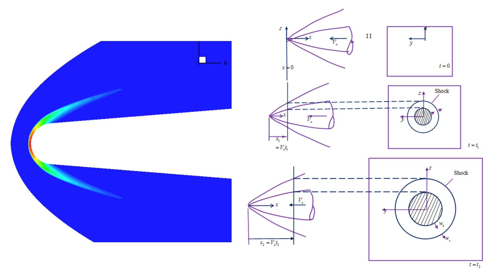

- 2D unsteady Euler equations

$$
\frac{\partial \overline{\rho }}{\partial \bar{x}} + \frac{\partial \left( {\overline{\rho }\overline{{v}^{\prime }}}\right) }{\partial \bar{y}} + \frac{\partial \left( {\overline{\rho }\overline{{w}^{\prime }}}\right) }{\partial \bar{z}} = 0
$$

$$
\frac{\overline{\rho }\frac{\partial \overline{{u}^{\prime }}}{\partial x} + \overline{\rho }\overline{{v}^{\prime }}\frac{\partial \overline{{u}^{\prime }}}{\partial y} + \overline{\rho }\frac{\partial \overline{{u}^{\prime }}}{\partial z}}{\partial y} =  - \frac{\partial \bar{p}}{\partial \bar{x}}
$$

$$
\overline{\rho }\frac{\partial \bar{v}}{\partial \bar{x}} + \overline{\rho }\overline{{v}^{\prime }}\frac{\partial \overline{{v}^{\prime }}}{\partial \bar{y}} + \overline{\rho }\overline{{w}^{\prime }}\frac{\partial \overline{{v}^{\prime }}}{\partial \bar{z}} =  - \frac{\partial \bar{p}}{\partial \bar{y}}
$$

$$
\overline{\rho }\frac{\partial {\bar{w}}^{\prime }}{\partial \bar{x}} + \overline{\rho }\overline{{v}^{\prime }}\frac{\partial \overline{{w}^{\prime }}}{\partial \bar{y}} + \overline{\rho }\overline{{w}^{\prime }}\frac{\partial \overline{{w}^{\prime }}}{\partial \bar{z}} =  - \frac{\partial \bar{p}}{\partial \bar{z}}
$$

$$
\frac{\partial }{\partial \bar{x}}\left( \frac{\bar{p}}{{\overline{\rho }}^{\gamma }}\right)  + \overline{{v}^{\prime }}\frac{\partial }{\partial \bar{y}}\left( \frac{\bar{p}}{{\overline{\rho }}^{\gamma }}\right)  + \overline{{w}^{\prime }}\frac{\partial }{\partial \bar{z}}\left( \frac{\bar{p}}{{\overline{\rho }}^{\gamma }}\right)  = 0
$$

Small-disturbance hypersonic equations

- So, a steady problem described by the small-disturbance hypersonic equations can be also described by 2D unsteady Euler equations.

- Proper initial/boundary conditions must be given

- You can perform numerical computation to obtain the 2D unsteady flow field.

- Since the 2D unsteady flow is like a blast, approximate blast wave theory can be used to compute the 2D unsteady flow.

$$
p = {k}_{2}{\rho }_{a}{\left( \frac{E}{{\rho }_{a}}\right) }^{\frac{2}{3}}{t}^{-2/3}
$$

$$
p = {k}_{1}{\rho }_{\omega }{\left( \frac{E}{{\rho }_{\omega }}\right) }^{\frac{1}{2}}{t}^{-1}
$$

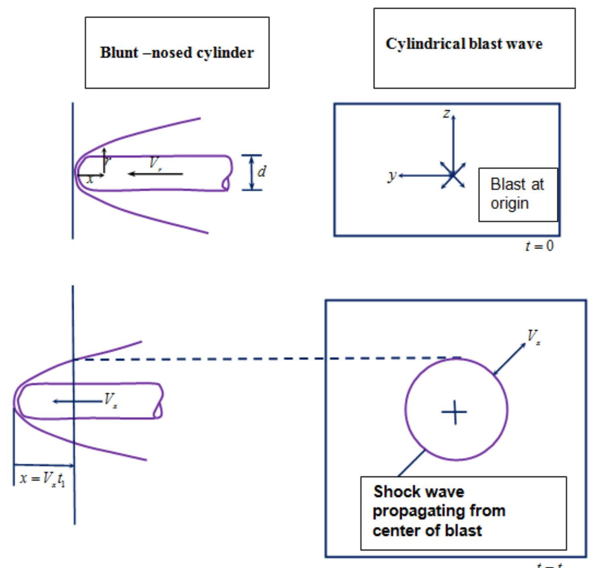

- Blunt-nosed cylinder

- Circular blast wave

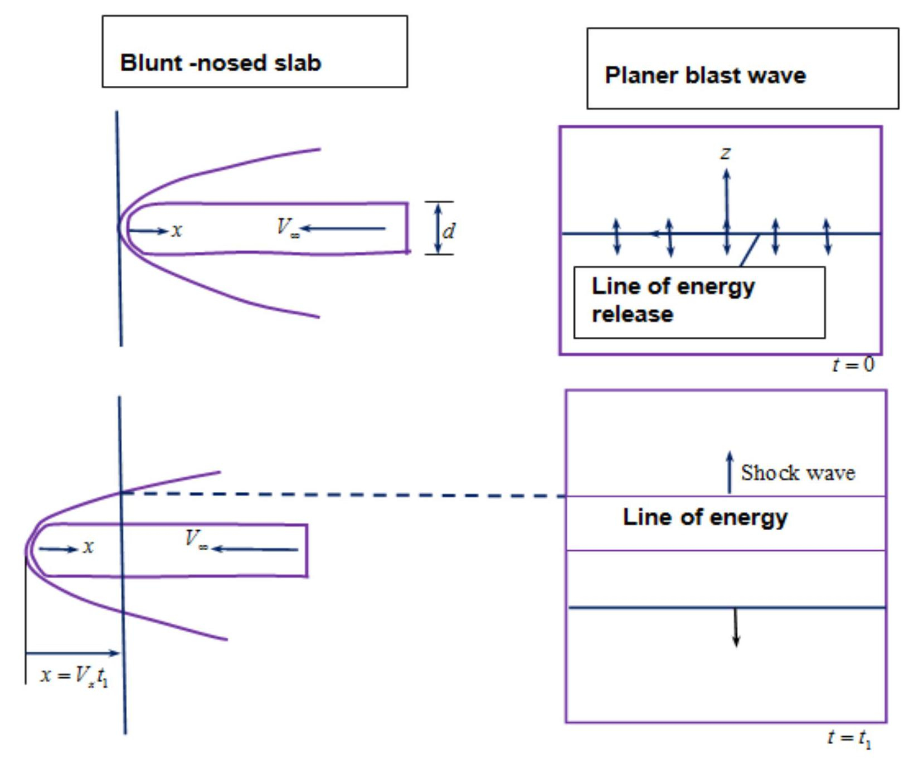

- Blunt-nosed slat

- planar blast wave

Where, ${k}_{2} = \frac{{2}^{7/3}{\left( 2\gamma  - 1\right) }^{\left\lbrack  \left( 5\gamma  - 4\right) /3\left( 2 - \gamma \right) \right\rbrack  }}{9{\left( \gamma  + 1\right) }^{\left\lbrack  2\left( \gamma  + 1\right) /3\left( 2 - \gamma \right) \right\rbrack  }}$

$$
\text{ Where, }{k}_{1} = \frac{{\gamma }^{\left\lbrack  {2\left( {\gamma  - 1}\right) /\left( {2 - \gamma }\right) }\right\rbrack  1}}{{2}^{\left\lbrack  \left( 4 - \gamma \right) /\left( 2 - \gamma \right) \right\rbrack  }}
$$

$$
r = {\left( \frac{E}{{\rho }_{a}}\right) }^{13}{t}^{2/3}
$$

$$
r = {\left( \frac{E}{{\rho }_{a}}\right) }^{1/4}{t}^{1/2}
$$

Planar Blast Wave

Cylindrical Blast Wave

## How to determine the energy of the blast wave $\mathbf{E}$ ?

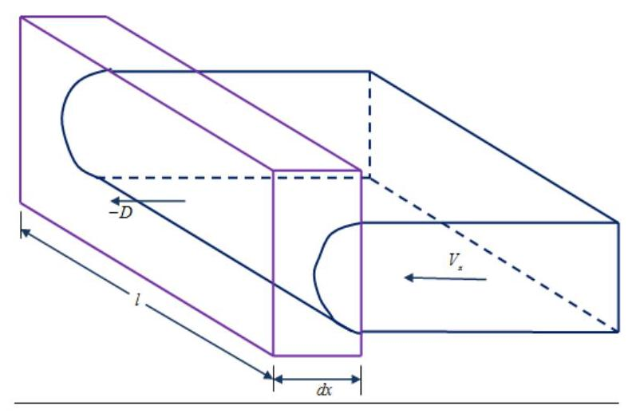

For a blast wave, the energy $\mathbf{E}$ is

the driving energy acted on the gas.

For a hypersonic flow, the energy

E is the work done by drag:

$$
\mathbf{{dE}} = \mathbf{{Ddx}}
$$

If the slab is assumed to be moved by unit distance, then

$$
E = D = \frac{1}{2}{\rho }_{\infty }{V}_{\infty }^{2}{C}_{D}{S}_{\text{ ref }}
$$

$$
t = \frac{x}{{V}_{\infty }}
$$

$$
\frac{p}{{p}_{\infty }} = {0.127}{M}_{\infty }^{2}{C}_{D}^{2/3}{\left( \frac{x}{d}\right) }^{-2/3}
$$

$$
\frac{p}{{p}_{\infty }} = {0.0681}{M}_{\infty }^{2}\frac{\sqrt{{C}_{D}}}{\left( \frac{x}{d}\right) }
$$

$$
\frac{r}{d} = {0.793}{C}_{D}^{1/3}{\left( \frac{x}{d}\right) }^{2/3}
$$

$$
\frac{r}{d} = {0.792}{C}_{D}^{1/4}\sqrt{\frac{x}{d}}
$$

Blast wave equivalence for blunt nosed slab

Blast wave equivalence for blunt nosed cylinder

Blunt-nosed flat plate (first approximation):

$$
\frac{p}{{p}_{\infty }} = {0.121}{M}_{\infty }^{2}{\left( \frac{{C}_{D}}{x/d}\right) }^{2/3} \tag{4.156}
$$

$$
\frac{r}{d} = {0.774}{C}_{D}^{1/3}{\left( \frac{x}{d}\right) }^{2/3} \tag{4.157}
$$

Blunt-nosed flat plate (second approximation):

$$
\frac{p}{{p}_{\infty }} = {0.121}{M}_{\infty }^{2}{\left( \frac{{C}_{D}}{x/d}\right) }^{2/3} + {0.56} \tag{4.158}
$$

$$
\left( \frac{r}{d}\right) /\left( {{M}_{\infty }^{2}{C}_{D}}\right)  = \frac{0.774}{{M}_{\infty }^{2}{\left\lbrack  {C}_{D}/\left( x/d\right) \right\rbrack  }^{2/3} - {1.09}} \tag{4.159}
$$

Blunt-nosed cylinder (first approximation):

$$
\frac{p}{{p}_{\infty }} = {0.067}{M}_{\infty }^{2}\frac{\sqrt{{C}_{D}}}{\left( x/d\right) } \tag{4.160}
$$

$$
\frac{r}{d} = {0.795}{C}_{D}^{1/4}{\left( \frac{x}{d}\right) }^{1/2} \tag{4.161}
$$

Blunt-nosed cylinder (second approximation):

$$
\frac{p}{{p}_{\infty }} = {0.067}{M}_{\infty }^{2}\frac{\sqrt{{C}_{D}}}{\left( x/d\right) } + {0.44} \tag{4.162}
$$

$$
\frac{r/d}{{M}_{\infty }{C}_{D}^{1/2}} = {0.795}\sqrt{\frac{\left( x/d\right) }{{M}_{\infty }^{2}{C}_{D}^{1/2}}\left\lbrack  {1 + {3.15}\frac{\left( x/d\right) }{\left( {M}_{\infty }^{2}{C}_{D}^{1/2}\right) }}\right\rbrack  } \tag{4.163}
$$

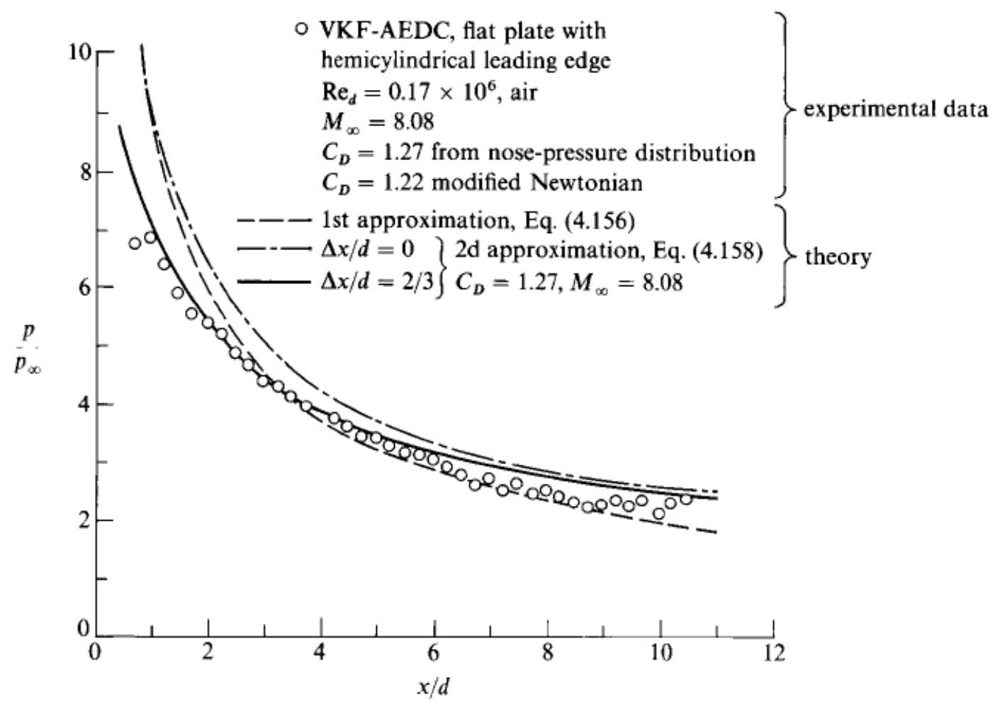

Fig. 4.17 Pressure distribution on a blunt-nosed flat plate (from Lukasiewicz [36]).

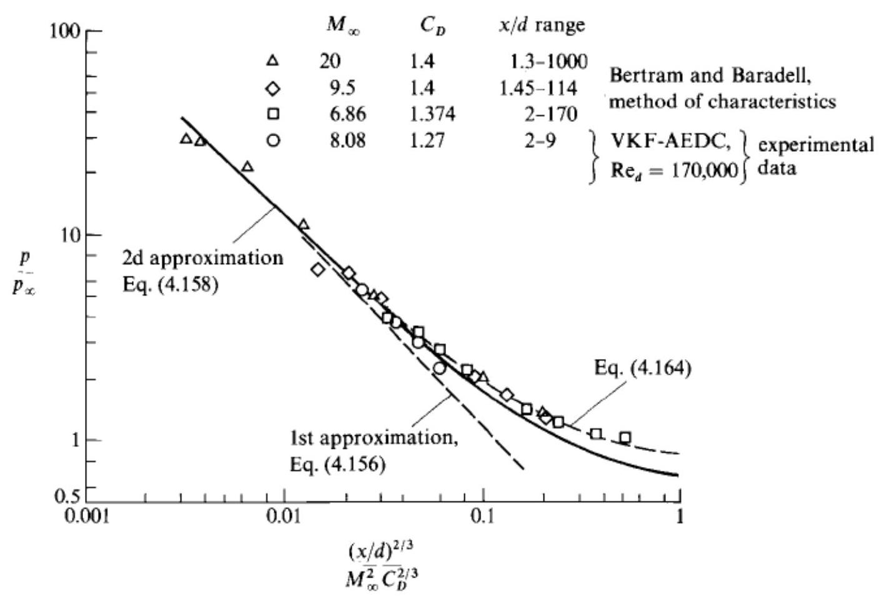

Fig. 4.18 Correlation of pressure distribution for a blunt-nosed flat plate (from [36]).

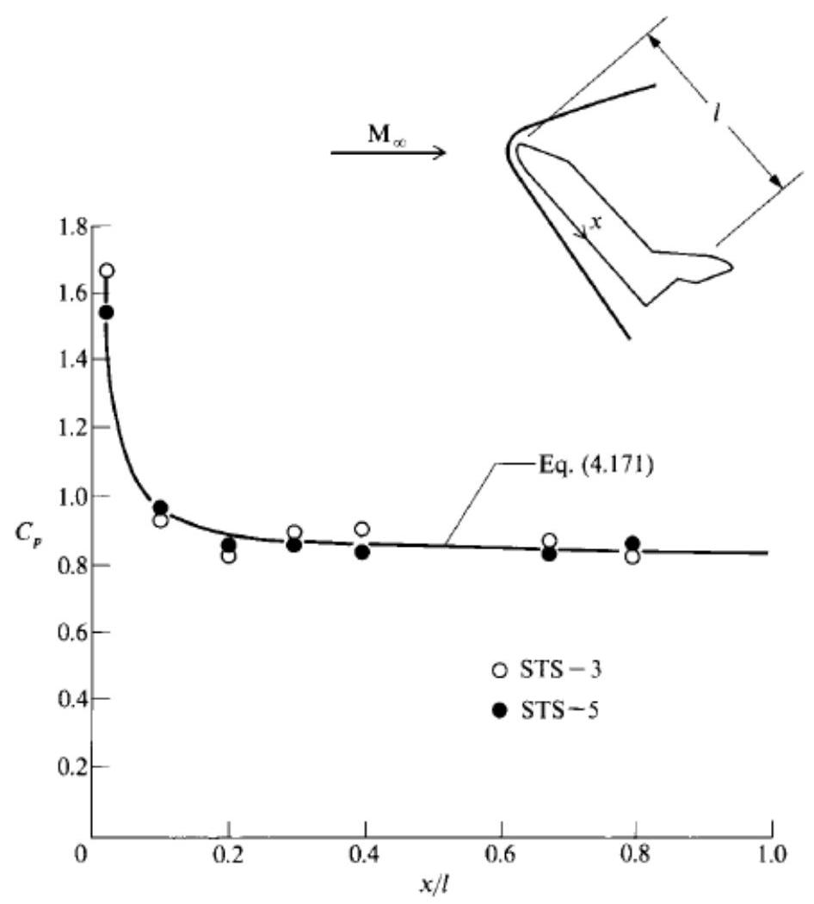

${C}_{p} = {0.096}{C}_{D}^{1/2}{\left( \frac{x}{l}\right) }^{-1}{\left( \frac{l}{d}\right) }^{-1}$

${C}_{p} = \frac{0.0137}{x/l}$

$$
{C}_{p} = \frac{0.0137}{x/l} + 2{\sin }^{2}\alpha
$$

Fig. 4.25 Comparison of pressure coefficients obtained with combined blast-wave/ Newtonian theory [Eq. (4.171)] with flight data for the space shuttle: windward centerline, ${M}_{\infty } = {21.6}$ , and $\alpha  = {40}\mathrm{{deg}}$ .

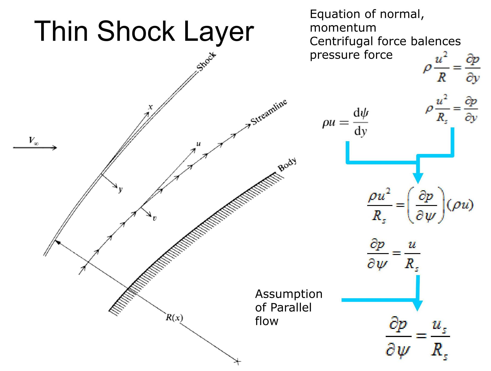

Derivative of pressure is constant

$$
\frac{\partial p}{\partial \psi } = \frac{{u}_{s}}{{R}_{s}}
$$

$$
p\left( {x,\psi }\right)  = {p}_{s}\left( x\right)  + \frac{{u}_{s}\left( x\right) }{{R}_{s}\left( x\right) }\left\lbrack  {\psi  - {\psi }_{s}\left( x\right) }\right\rbrack
$$

$$
{\rho u} = \frac{\partial \psi }{\partial y}
$$

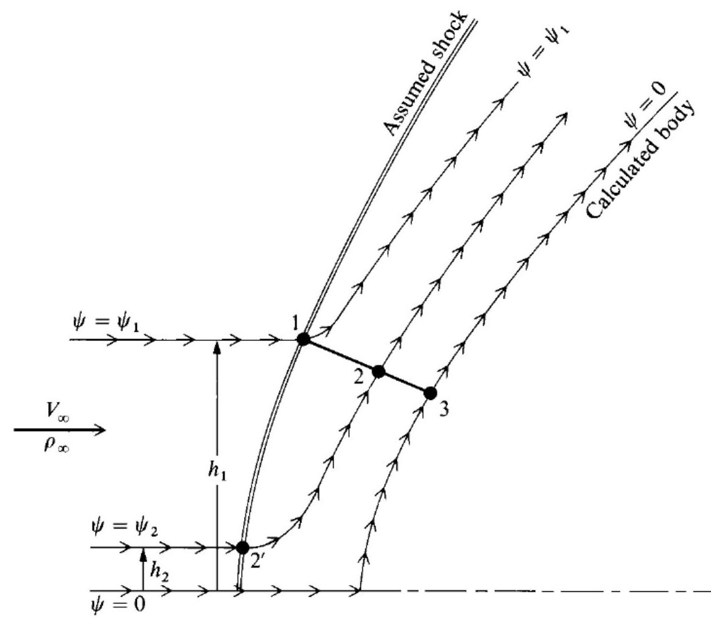

Mass flux $\psi  = {\int }_{0}^{y}{\rho udy}$

$$
\psi \left( 0\right)  = 0
$$

$$
{\psi }_{1} = {\int }_{0}^{{y}_{1}}{\rho udy} = {\rho }_{\infty }{V}_{\infty }{y}_{1}
$$

$$
{\psi }_{2} = {\int }_{0}^{{y}_{2}}{\rho udy} = {\rho }_{\infty }{V}_{\infty }{y}_{2}
$$

Value of stream function can be computed from the uniform flow in front of the shock

1.Assume shock wave

2.Compute quantities at Point $1{p}_{1,}{\Psi }_{1,}{h}_{1,}{y}_{1}$

3.Choose a value, $0 < {\psi }_{2} < {\psi }_{1}$

4.Calculate pressure a Point $2{p}_{2} = {p}_{1} + \frac{{u}_{1}}{\left( {R}_{s}\right) }\left( {{\psi }_{2} - {\psi }_{1}}\right)$

5. Determine point 2’: ${y}_{2} = \frac{{\psi }_{2}}{{\rho }_{\infty }{V}_{\infty }}$ and entropy ${S}_{2} = {S}_{2}$ ,

(where ${S}_{2}$ , can be determined according to oblique shock wave). Then flow state at 2 can be determined.

$$
{h}_{2} = h\left( {{s}_{2},{p}_{2}}\right)
$$

$$
{\rho }_{2} = \rho \left( {{s}_{2},{p}_{2}}\right)
$$

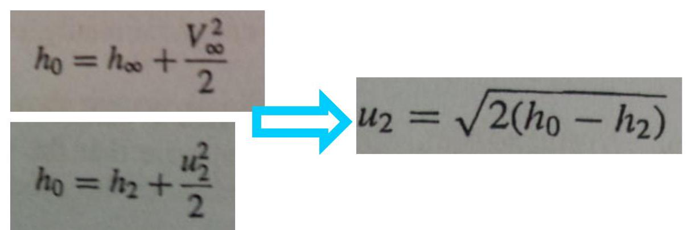

6. Return to Step 3 until $\psi  =$ which means the wall. Thus, we get discrete function $\psi \left( y\right)$

7. $\mathrm{Y}$ can be determined according to

$$
y = {\int }_{\psi }^{{\psi }_{s}}\frac{\mathrm{d}\psi }{\rho u}
$$

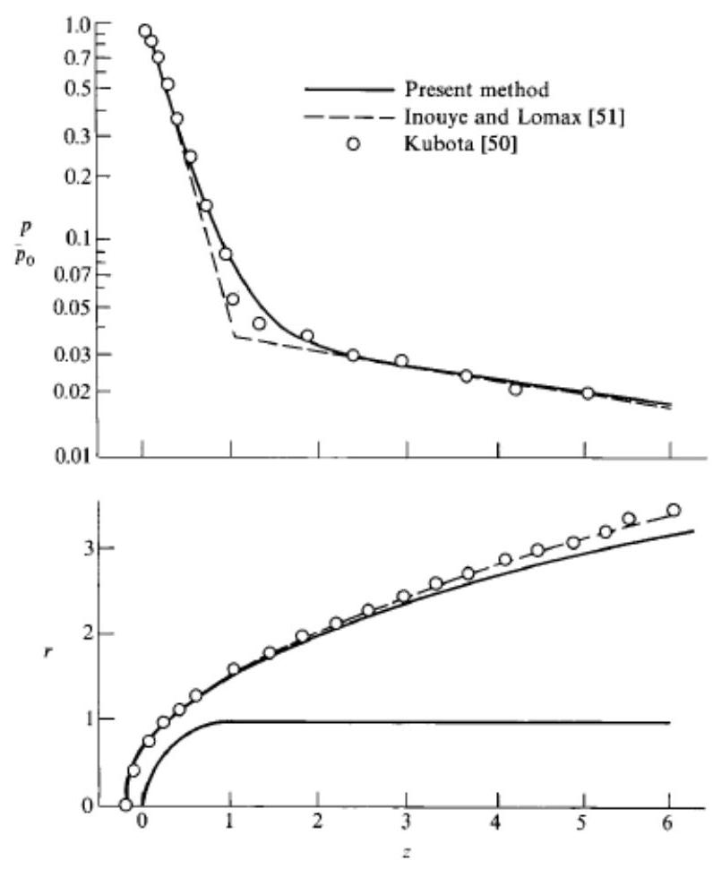

Fig. 4.30 Shock-wave shape and surface pressure for a hemisphere cylinder (from Maslen [47]): ${M}_{\infty } = \infty$ , and $\gamma  = {1.4}$ .

## For non-zero angle of attack

$$
u{n}_{x} + v{n}_{y} + w{n}_{z} = 0
$$

$$
\left( {{V}_{\infty }\cos \alpha  + {u}^{\prime }}\right) {n}_{x} + \left( {{V}_{\infty }\sin \alpha  + {v}^{\prime }}\right) {n}_{y} + {w}^{\prime }{n}_{z} = 0
$$

$$
\left( {\frac{\cos \alpha }{{\mathrm{T}}^{2}} + \bar{u}{}^{\prime }}\right) {n}_{x}\left( {{V}_{\infty }{\mathrm{T}}^{2}}\right)  + \left( {\frac{\sin \alpha }{\mathrm{T}} + \bar{v}{}^{\prime }}\right) {n}_{y}\left( {{V}_{\infty }\mathrm{T}}\right)  + \bar{w}{}^{\prime }{n}_{z}\left( {{V}_{\infty }\mathrm{T}}\right)  = 0
$$

$$
\left( {\cos \alpha  + {\tau }^{2}{\bar{u}}_{y}}\right) T{\bar{n}}_{x}\left( {{V}_{\infty }{\tau }^{2}}\right)  + \left( {\frac{\sin \alpha }{T} + {v}^{\prime }}\right) {\bar{n}}_{y}\left( {{V}_{\infty }\tau }\right)  + {\bar{w}}^{\prime }{\bar{n}}_{z}\left( {{V}_{\infty }\tau }\right)  = 0
$$

$$
\left( {\cos \alpha  + {\tau }^{2} - {u}^{\prime }}\right) {\bar{n}}_{x} + \left( {\frac{\sin \alpha }{r} + {v}^{\prime }}\right) {\bar{n}}_{y} + {w}^{\prime }{\bar{n}}_{z} = 0
$$

$\cos \alpha  \rightarrow  1\;\sin \alpha  \rightarrow  \alpha$

$$
{\bar{n}}_{x} + \left( {\frac{\alpha }{\mathrm{T}} + {\bar{v}}^{\prime }}\right) {\bar{n}}_{y} + {\bar{w}}^{\prime }{\bar{n}}_{z} = 0
$$