德爱乐园

Hypersonic Flows

Lecture - 02

Hypersonic Flows

Dr. Engr. Salimuddin Zahir

PoP AEROSPACE ENGINEERING Chief Manager NESCOM

若山 道人

So the motive of studying any subject should be:

To maintain purity of motive while learning, so there would be no impurity or loss effect on the end-results

## Who is your TVF ?

## DR. ENGR. SALIMUDDIN ZAHIR

PhD Aerospace Engineering

School of Aeronautics,

Northwestern Polytechnical University, Xi'an, China.

MS Aerospace Engineering

Department of Aerospace Engineering & Mechanics, University of Minnesota, Minneapolis, USA.

BE Mechanical Engineering

NED University of Engineering & Technology, Karachi, Pakistan.

## Who is your TVF?

DR. ENGR. SALIMUDDIN ZAHIR

Chief Manager, Centre for Fluid Dynamics, Centres of Excellence in Science & Applied Technologies, Islamabad, Pakistan.

Awarded Pakistan's Presidential Pride of Performance, POP Award in the field of Aerospace Engineering in the year 2004.

Member since 1981 and a Life Member of the American Institute of Aeronautics & Astronautics, AIAA, USA, and a Founding Fellow and member of the Pakistan Academy of Engineering, PAE; got established and registered in 2013.

Served as an Editor and Programme Coordinator of the International Bhurban Conference of Science & Technology, IBCAST since its inception till 2004. Conducted and Chaired several technical sessions of various local and international conferences. Has supervised and co-supervised 2- PhD and more than 10- MS programmes in the local and universities abroad.

Member of the World Scientific and Engineering Academy and Society, WSEAS. Fellow of the Pakistan Nuclear Society, PNS. Associate Member of the American Society of Mechanical Engineers, ASME. Member of the Pakistan Engineering Council, PEC; and an Executive Member of the Computational Modelling, Control & Simulation Society of Pakistan, CCSS-CFD Chapter, Pakistan.

S. Zahir Hypersonic Flows MS FALL 2016

Copyright @ 2016 by S.Zahir. Permission required for copying or display

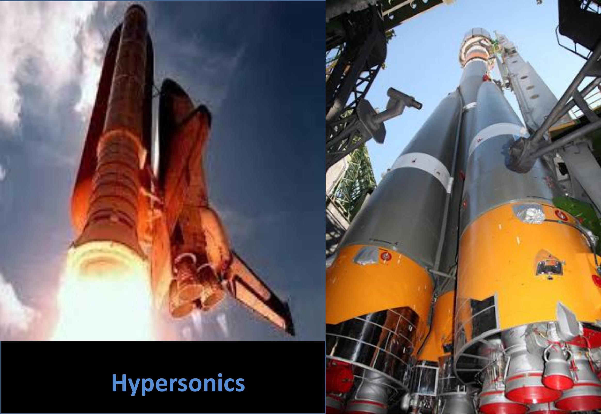

Hypersonic Flows

Copyright @ 2016 by S.Zahir. Permission required for copying or display

## Objective

The objective of this course is to familiarize you with the general concepts and basics of highspeed flows related to aerodynamics and aerothermodynamics.

Further it is motivated by the need to incorporate these concepts and available knowledge base into the design of a highspeed vehicle, and its various components and subsystems.

## COURSE DESCRIPTION

LECTURE HOURS :

Theory - app 30, Lab - 6.

Form of grading: 2 x Assignments [30], 1 x PROJECT [40], Mid Term [10] and 1x End Term [20]

## COURSE OUTLINE

Some concepts of highspeed flows related to aerodynamics, gas dynamics and heat transfer need to brushed up first, including the perception of shock wave, both in simple 2D flow equations, as well as in full 3D with introduction to the ideas of shock reflection and shock interaction and its various types. Hypersonic flows in multiple dimensions have a much richer structure than just standard frontal shocks, so a deeper look into the physical and mathematical character of the highspeed flows in multiple dimensions would be discussed. Further concept of CFD computations, ground testing approach including hypersonic wind tunnel experimentation, model, testing, instrumentation, data analysis for V&V and flow visualization would be covered. Also, plasmatron testing and its associated requirements for simple nose sha would be discussed to cover the reentry body aerodynamic stability and thermal protection aspects. On the other hand, highspeed nozzle flows and air intake for ramjets would be discussed to cover the highspeed internal flow aspects.

## GRADING CRITERIA

70% assessment based on two assignments and single project presentation (in group) conducted during lectures and, and 10% on mid-term and 20% on a end-term test conducted of theory at the end of the lectures.

S. Zahir Hypersonic Flows MS FALL 2016

## Course Outline

- Gas Dynamics

- High-speed Aerodynamics

- Aerothermodynamics

- Shocks, type of shocks

- Nozzle Flows

- Intake Flows

- Nozzle wake flows

- Boundary layer growth

- Shock-boundary layer interaction

- CFD analysis

- V&V analysis

- Drag Reduction- Spikes

- Attitude Control-Side Jets

- Reentry Aerodynamics

- Ground testing facilities, supersonic-

hypersonic wind tunnels

- Hypersonic testing

- Plasmatron testing

- Flow visualization

S. Zahir Hypersonic Flows

Copyright @ 2016 by S.Zahir. Permission required for copying or display

MS FALL 2016

## Course Timeline

## Course Background

Almost everyone has their own definition of the term hypersonic. If we were to conduct something like a public opinion poll among those present, and asked everyone to name a Mach number above which the flow of a gas should properly be described as hypersonic there would be a majority of answers round about 5 or 6, but it would be quite possible for someone to advocate, and defend, numbers as small as 3 , or as high as 12 .

P. L. Roe,

comment made in a lecture

at the von Karman Institute, Belgium

January 1970

## Aerothermodynamics couples the disciplines of aerodynamics and

thermodynamics. The flow field for a vehicle that flies at hypersonic speeds is one in which high-temperature gas effects strongly influence the forces acting on the surface (the pressure and the skin friction) and the energy flux (the convective and the radiative heating).

Hypersonic flows are usually characterized by the presence of strong shocks and equilibrium or nonequilibrium gas chemistry. Accurate prediction of these effects is critical to the design of any vehicle that flies at hypersonic velocities. The pressures and skin friction forces acting on the surface of the vehicles are integrated over the complete configuration to define the aerodynamic forces and moments (e.g., lift, drag, pitching moment, and control surface effectiveness). The peak heat-transfer rate and the heating load, which is the heating rate integrated over time, are mapped over the vehicle surface as part of the process to design the thermal protection system(TPS). Pressure distributions are required for assessing structural loads .

Hypersonic Flows

Copyright @ 2016 by S.Zahir. Permission required for copying or display

## Highspeed Flows

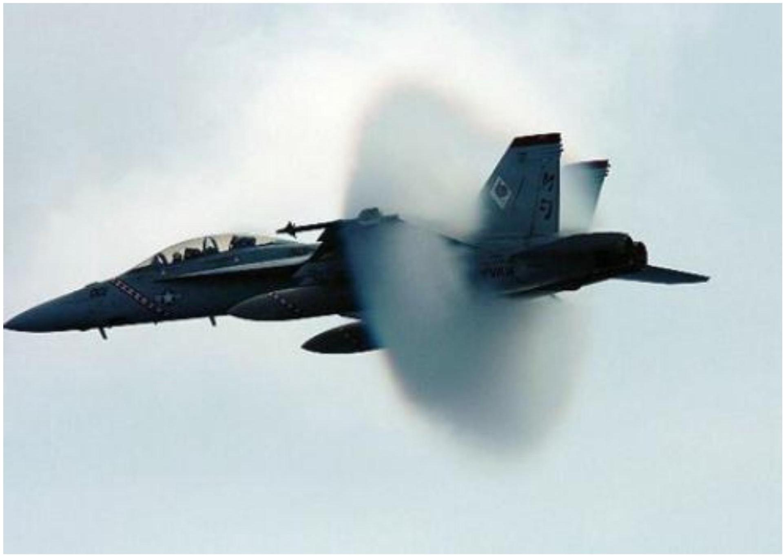

F/A-18F Super Hornet breaking the sound barrier

S. Zahir

## Highspeed Flows

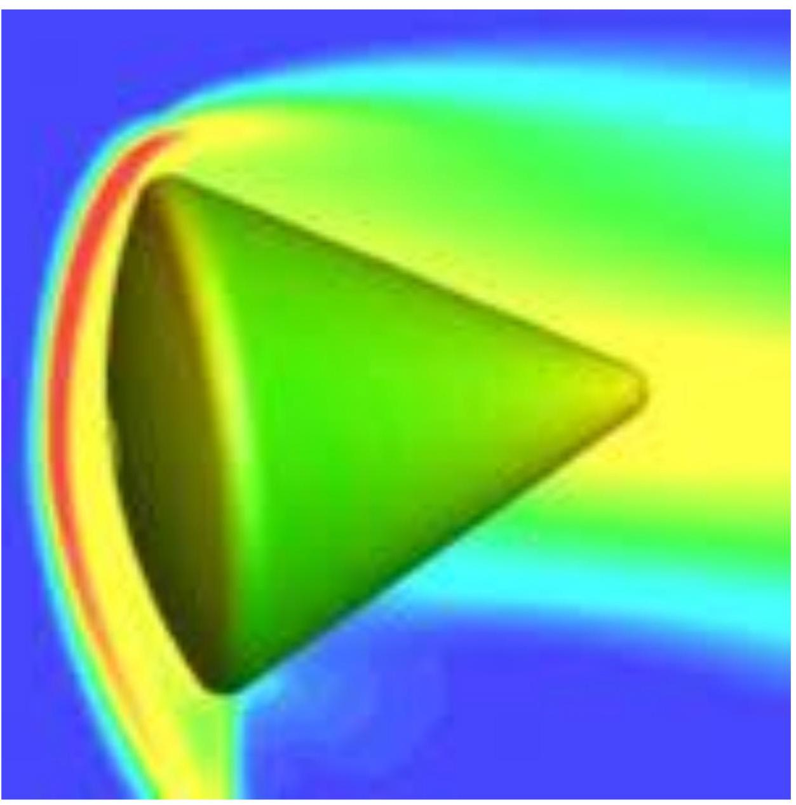

## Highspeed Flows

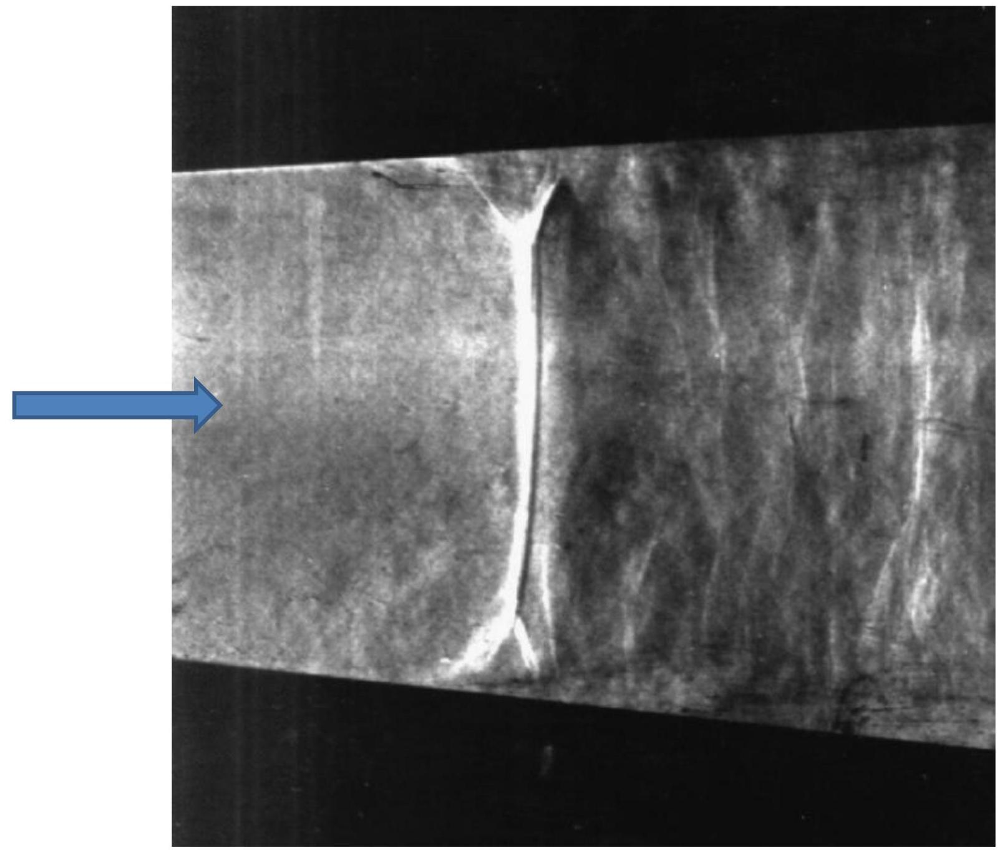

Hypersonic Flows

Copyright @ 2016 by S.Zahir. Permission required for copying or display

## Highspeed Flows

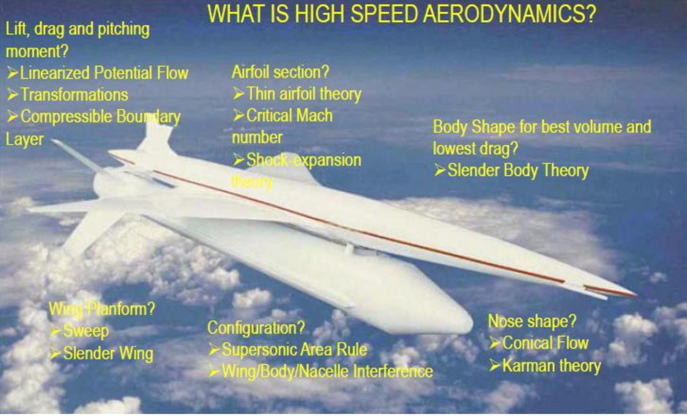

S. Zahir Hypersonic Flows MS FALL 2016

## Typical trajectories of various spacecraft

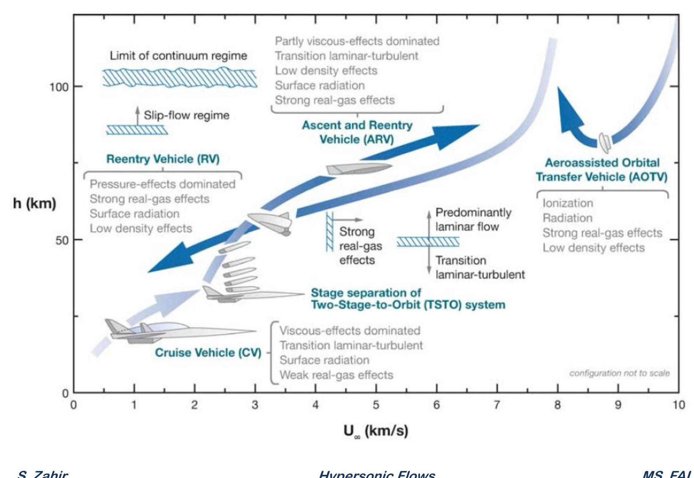

## Knowledge Status

Unaware

## Typical trajectories of various spacecraft

<table><tr><td colspan="3">Chemical species in high-temperature air</td></tr><tr><td>Region</td><td>Alr chemical model</td><td>Species present</td></tr><tr><td>ease</td><td>2 species   5 species   7 species   11 species</td><td>${\mathrm{O}}_{2},{\mathrm{\;N}}_{2}$   ${\mathrm{O}}_{2},{\mathrm{\;N}}_{2},\mathrm{O},\mathrm{N},\mathrm{{NO}}$   ${\mathrm{O}}_{2},{\mathrm{\;N}}_{2},\mathrm{O},\mathrm{N},\mathrm{{NO}},{\mathrm{{NO}}}^{ \dagger  },{\mathrm{e}}^{ - }$   ${\mathrm{O}}_{2},{\mathrm{\;N}}_{2},\mathrm{O},\mathrm{\;N},\mathrm{\;{NO}},{\mathrm{O}}_{2}^{ + },{\mathrm{N}}_{2}^{ + },{\mathrm{O}}^{ + },{\mathrm{N}}^{ + },{\mathrm{{NO}}}^{ + },{\mathrm{e}}^{ - }$</td></tr></table>

Regions with chemical and thermal nonequilibrium

Region Aerothermal phenomenon

⓸ Chemical and thermal equilibrium

⑧ Chemical nonequilibrium

with thermal equilibrium

© Chemical and thermal

nonequilibrium

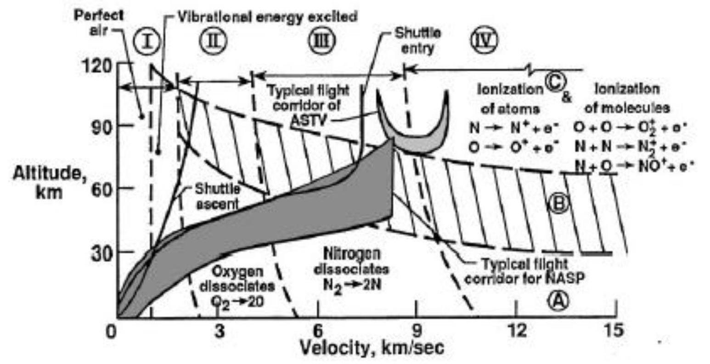

Flow regimes and thermochemical phenomena in the stagnation region of a ${30.5}\mathrm{\;{cm}}$ radius sphere flying in air.

## Neus Break

## Digital clutter

RGFIPL

According to William Treseder, a consultant at BMNT Partners, a key to staying focused at work is keeping your work environment tidy. And not just your physical desk: Treseder suggests that you create folders in which to keep all the random documents likely cluttering your computer's desktop and to keep only the 8-12 most important apps displayed on your home screen.

(Harvard Business Review)

## Hypersonic Flows

Hypersonic Flows

Shock Flows

S. Zahir

## Hypersonic - Basics

When the free stream Mach number is increased to higher supersonic speeds, the oblique shock moves closer to the body surface. At the same time, the pressure, temperature and density across the shock increase explosively. So, the flow field between the shock and body becomes hot enough to ionize the gas. These effects of thin shock layer, hot and chemically reacting gases and many other complicated flow features are the characteristics of hypersonic flow. In reality, these special characteristics associated with hypersonic flows appear gradually as the free stream Mach numbers is increased beyond 5.

As a rule of thumb, the compressible flow regimes are classified as below;

$M < {0.3}$ (incompressible flow) $M < 1$ (subsonic flow) ${0.8} < M < {1.2}$ (transonic flow) $M > 1$ (supersonic flow) $M > 5$ and above (hypersonic flow)

S. Zahir Hypersonic Flows MS FALL 2016

Copyright @ 2016 by S.Zahir. Permission required for copying or display

## Hypersonic - Basics

Reynolds Number: $\;\operatorname{Re} = \frac{{\rho }_{\infty }{V}_{\infty }c}{{\mu }_{\infty }}$

The ratio of inertia forces to viscous forces in a flow.

Mach Number:

$$
\mathrm{M} = {V}_{\infty }/{a}_{\infty }
$$

The ratio of flow velocity to the speed of sound.

Prandtl Number:

$$
\mathrm{{Pr}} = {\mu }_{\infty }{\mathrm{c}}_{p}/{k}_{\infty }
$$

The ratio of momentum diffusivity to thermal diffusivity.

## Hypersonic – Basics

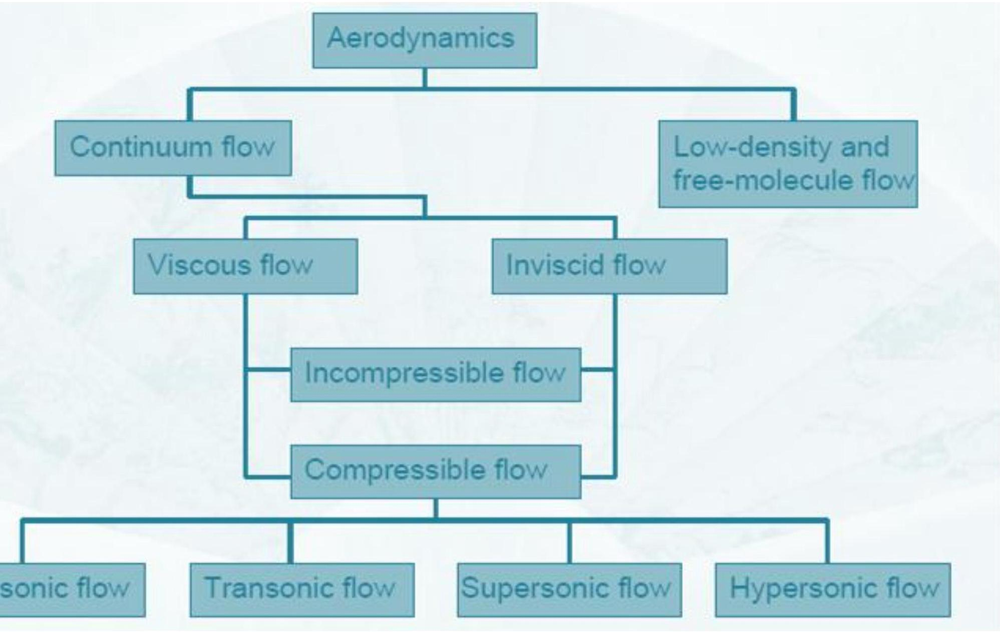

S. Zahir Hypersonic Flows

Copyright @ 2016 by S.Zahir. Permission required for copying or display

## Hypersonic – Basics

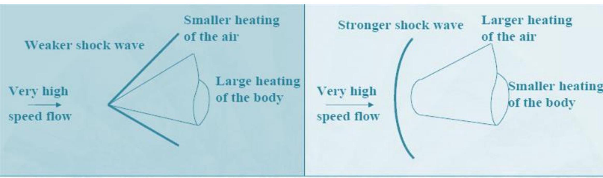

Slender reentry body

<table><tr><td>Kinetic energy   Potential energy</td><td></td></tr></table>

## Hypersonic – Basics

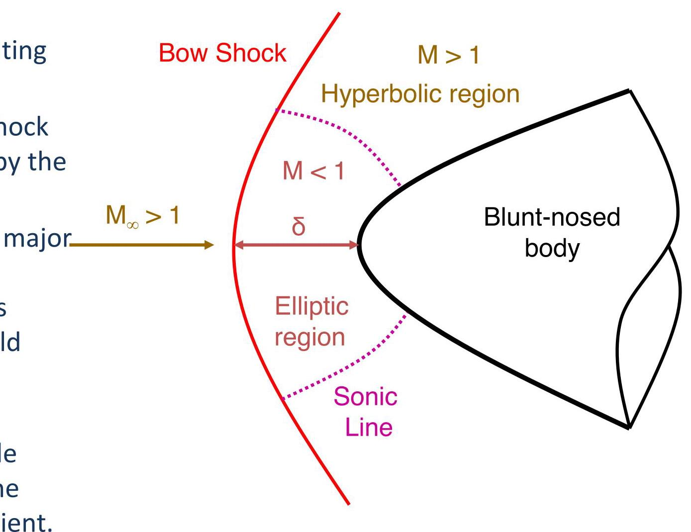

- Blunt-nosed body designs are used for supersonic and hypersonic speeds (e.g. Apollo capsules and space shuttle) because they are less susceptible to aerodynamic heating than sharp nosed bodies.

- There is a strong, curved bow shock wave, detached from the nose by the shock detachment distance $\delta$ .

- Calculating this flow field was a major challenge during the 1950s and 1960s because of the difficulties involved in solving for a flow field that is elliptic in one region and hyperbolic in others.

- CFD solvers can routinely handle such problems, provided that the flow is calculated as being transient.

S. Zahir Hypersonic Flows MS FALL 2016

## Hypersonic - Basics

- Thin shock layer: shock is

very close to the body.

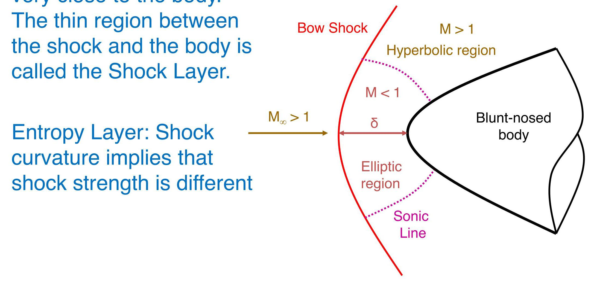

Hypersonic - Basics

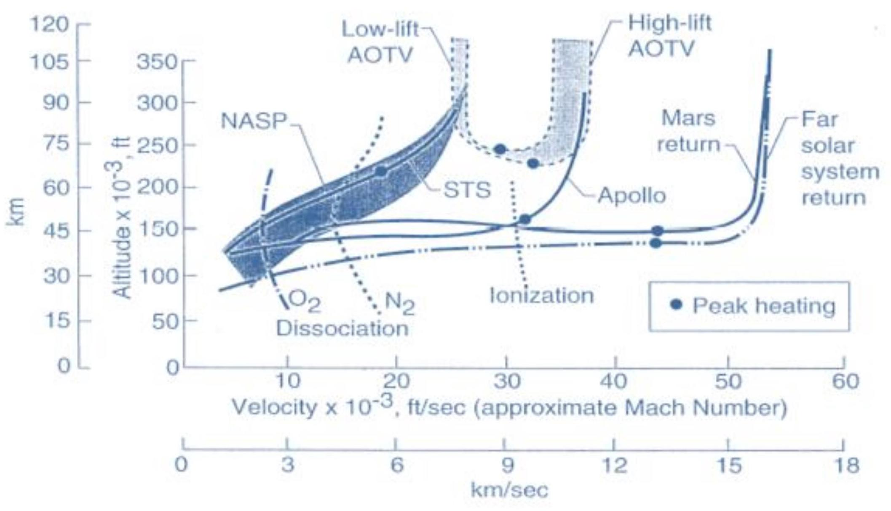

Hypersonic - Basics

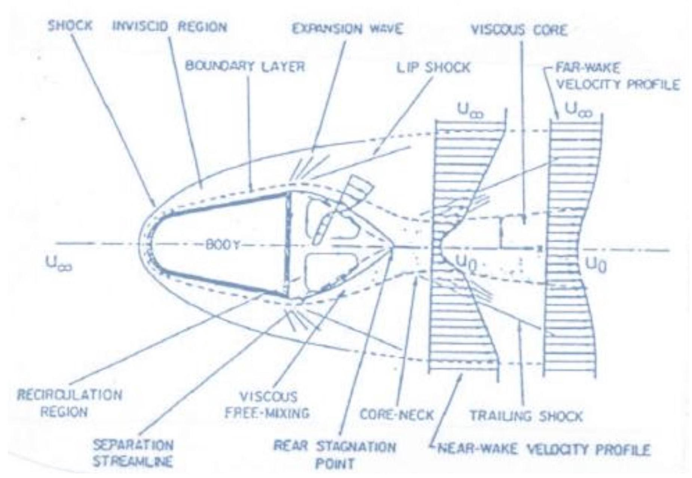

## Hypersonic - Basics

So the high temperatures associated with hypersonic flight are not possible in ground test facilities. In the wind tunnel applications, hypersonic Mach numbers are only possible when using low speeds of sound. For the wind tunnel, M approaches infinity because the speed of sound (the temperature) tends to zero and the free stream velocity is held fixed. As a result, the fluid temperatures remain below the levels that would damage the wind tunnel and the model.

Another assumption for hypersonic flow is

$$
\epsilon  = \frac{{\rho }_{\infty }}{{\rho }_{2}} \ll  1
$$

which is call the small-density-ratio. This assumption is related to the properties of the gas downstream of the shock wave.

In supersonic flows, the relations describing a normal/oblique shock were studied. Remember the definition of the total conditions for the temperature T, the pressure P and the density

$$
\frac{{T}_{0}}{{T}_{1}} = 1 + \left( \frac{\kappa  - 1}{2}\right) {M}_{1}^{2}
$$

$$
\frac{{P}_{0}}{{P}_{1}} = {\left( 1 + \left( \frac{\kappa  - 1}{2}\right) {M}_{1}^{2}\right) }^{\frac{\kappa }{\kappa  - 1}}
$$

$$
\frac{{\rho }_{0}}{{\rho }_{1}} = {\left( 1 + \left( \frac{\kappa  - 1}{2}\right) {M}_{1}^{2}\right) }^{\frac{1}{\kappa  - 1}}
$$

## Hypersonic - Basics

- Hypersonic flow:

Van Dyke-Hypersonic flow is flow past a body at high Mach number, where nonlinearity is an essential feature of the flow.

For thin bodies, that if the thickness-to-chord ratio of the body is of order 1, and M is also of order 1, some special flow features are related to - stagnation region, stagnation pressure and velocity and its gradients.

S. Zahir

## Hypersonic - Basics

The Reynolds number Re is defined as: Re $= \rho$ V L / $\mu$ . where L is a characteristic length, and V is the velocity.

- It is a measure of the ratio between inertial forces and viscous forces.

- If Re >> 1 the flow is dominated by inertia.

- If Re $<  < 1$ the flow is dominated by viscous effects.

## Highspeed Flow - Shock

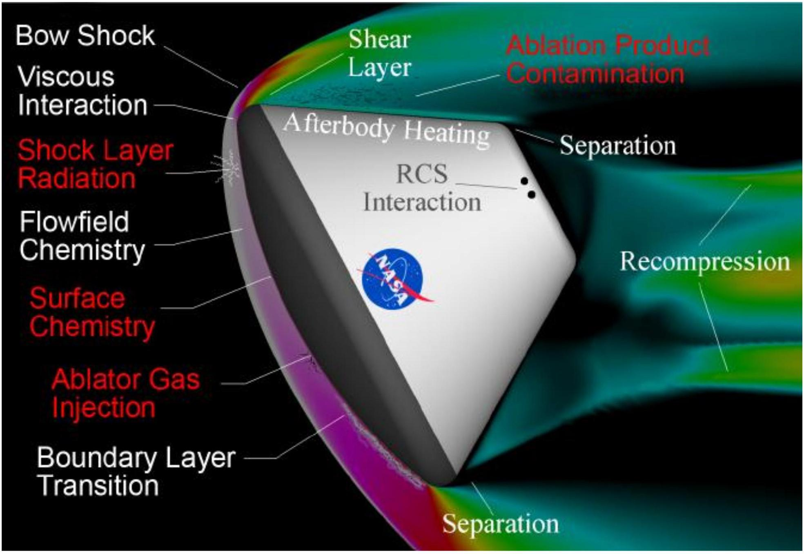

S. Zahir Hypersonic Flows MS FALL 2016

Copyright @ 2016 by S.Zahir. Permission required for copying or display

## Flow Past a Circular Cylinder

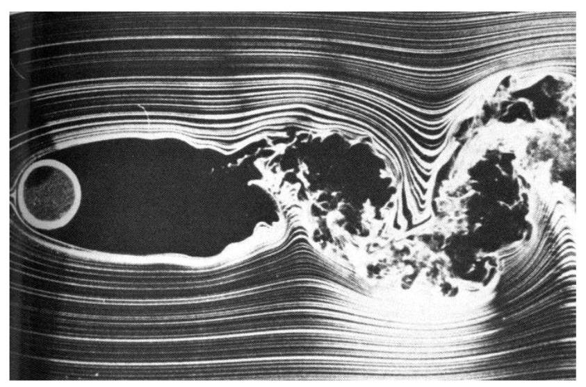

Re = 10,000 and Mach approximately zero

S. Zahir

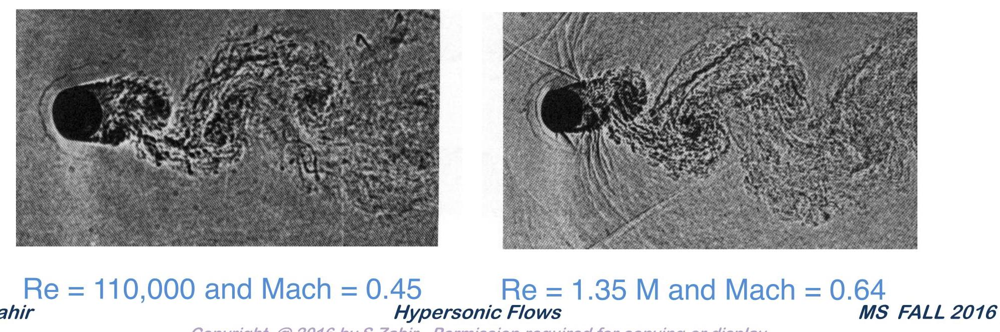

Copyright @ 2016 by S.Zahir. Permission required for copying or display

Shock - Flow Past a Circular Cylinder

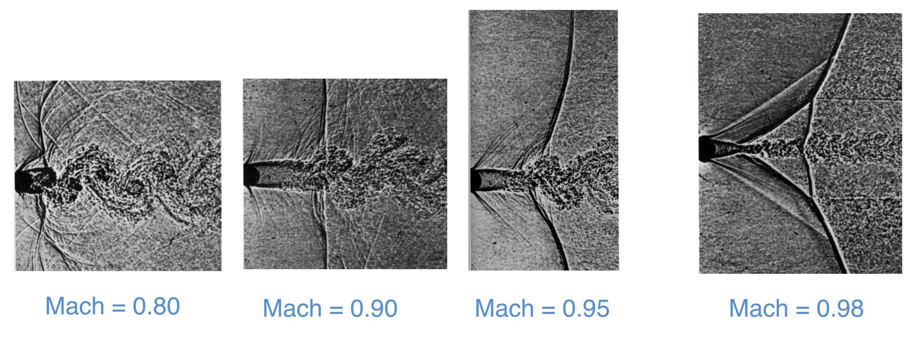

Shock - Flow Past a Sphere

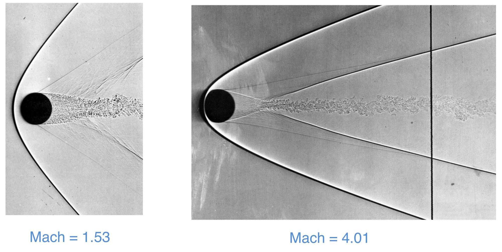

S. Zahir Hypersonic Flows

Copyright @ 2016 by S.Zahir. Permission required for copying or display

## Highspeed Flow - Shock

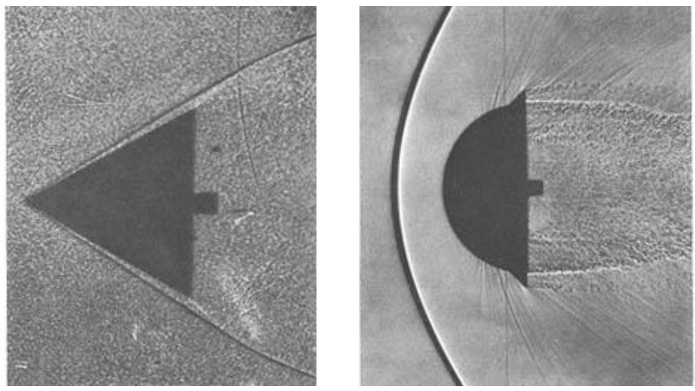

Highspeed Flow - Shock

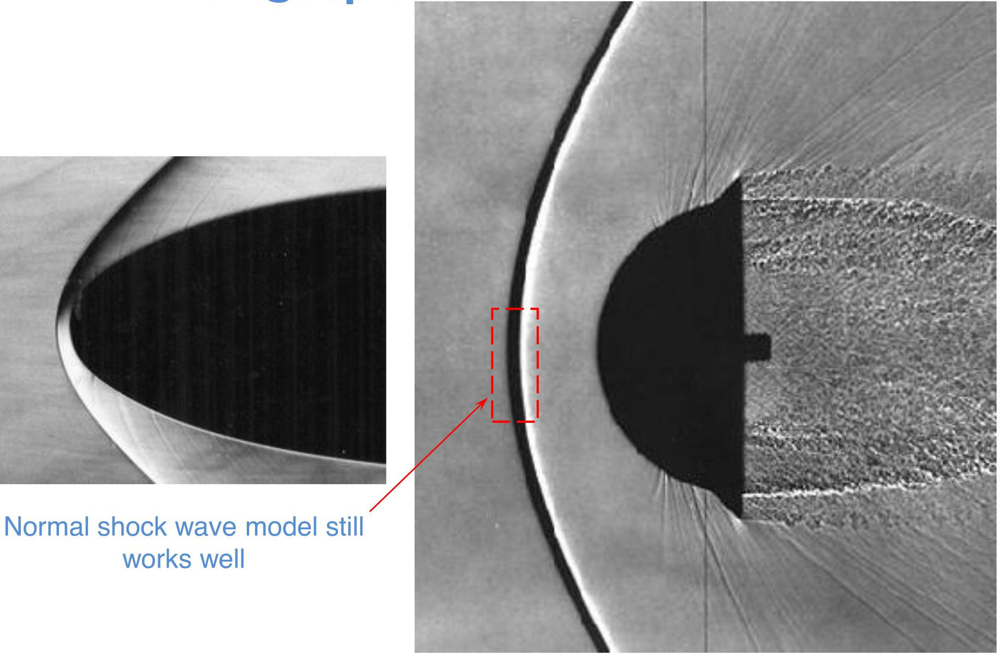

Hypersonic Flows MS FALL 2016

Copyright @ 2016 by S.Zahir. Permission required for copying or display

## Highspeed Flow - Shocks

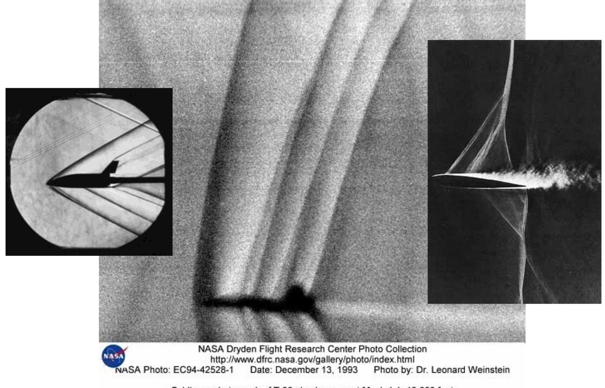

Schlieren photograph of T-38 shock waves at Mach 1.1, 13,000 feet

MS FALL 2016

## DYNAMIC PRESSURE -COMPRESSIBLE FLOWS

- Dynamic pressure is defined as $q = 1/{2\rho }{V}^{2}$

- For high speed flows, where Mach number is used frequently, it is convenient to express q in terms of pressure p and Mach number, M, rather than ρ and V

$$
\mathrm{q} = \frac{1}{2}\rho {\mathrm{V}}^{2}
$$

$$
\mathrm{q} = \frac{1}{2}\rho {\mathrm{V}}^{2} = \frac{1}{2}\frac{\gamma }{\gamma }\frac{\mathrm{p}}{\mathrm{p}}\rho {\mathrm{V}}^{2} = \frac{\gamma }{2}\mathrm{p}\left( \frac{\rho }{\mathrm{p}}\right) {\mathrm{V}}^{2}
$$

$$
{\mathrm{a}}^{2} = \frac{\gamma \mathrm{p}}{\rho }
$$

$$
\mathrm{q} = \frac{\gamma }{2}\mathrm{p}\frac{{\mathrm{V}}^{2}}{{\mathrm{a}}^{2}} = \frac{\gamma }{2}{\mathrm{{pM}}}^{2}
$$

$$
{\mathrm{q}}_{\infty } = \frac{\gamma }{2}{\mathrm{p}}_{\infty }{\mathrm{M}}_{\infty }^{2}
$$

S. Zahir Hypersonic Flows

Copyright @ 2016 by S.Zahir. Permission required for copying or display

## DYNAMIC PRESSURE -Stagnation

- If M > 0.3, flow is compressible (density changes are important) Need to introduce energy equation and isentropic relations

$$
{\mathbf{c}}_{\mathrm{p}}{\mathrm{T}}_{1} + \frac{1}{2}{\mathrm{\;V}}_{1}^{2} = {\mathbf{c}}_{\mathrm{p}}{\mathrm{T}}_{0}
$$

$$
\frac{{\mathrm{p}}_{0}}{{\mathrm{p}}_{1}} = {\left( 1 + \frac{\gamma  - 1}{2}{\mathrm{M}}_{1}^{2}\right) }^{\gamma /\gamma  - 1}
$$

$$
\frac{{\mathrm{T}}_{0}}{{\mathrm{\;T}}_{1}} = 1 + \frac{{\mathrm{V}}_{1}^{2}}{2{\mathrm{c}}_{\mathrm{p}}{\mathrm{T}}_{1}}
$$

$$
\left| {\;\frac{{\rho }_{0}}{{\rho }_{1}} = {\left( 1 + \frac{\gamma  - 1}{2}{\mathbf{M}}_{1}^{2}\right) }^{1/\gamma  - 1}}\right.
$$

$$
\frac{{\mathrm{T}}_{0}}{{\mathrm{\;T}}_{1}} = 1 + \frac{\gamma  - 1}{2}{\mathrm{M}}_{1}^{2}
$$

Must be isentropic

Requires adiabatic, but does not have to be isentropic

S. Zahir

## NORMAL SHOCK WAVES

Upstream: 1 Downstream: 2

${\mathrm{M}}_{1} > 1 \; {\mathrm{M}}_{2} < 1$

${\mathrm{V}}_{1} \; {\mathrm{V}}_{2} < {\mathrm{V}}_{1}$

${p}_{1} \; {\mathrm{P}}_{2} > {\mathrm{p}}_{1}$

${\rho }_{1} \; {\rho }_{2} > {\rho }_{1}$

${T}_{1} \; {T}_{2} > {T}_{1}$

${S}_{1} \; {\mathrm{S}}_{2} > {\mathrm{S}}_{1}$

${p}_{0,1} \; {p}_{0,2} < {p}_{0,1}$

${\mathrm{h}}_{0,1} \; {\mathrm{h}}_{0,2} = {\mathrm{h}}_{0,1}$

${\mathrm{T}}_{0,1} \; {\mathrm{T}}_{0,2} = {\mathrm{T}}_{0,1}$ (if calorically perfect,

${\mathrm{h}}_{0} = {\mathrm{c}}_{\mathrm{p}}{\mathrm{T}}_{0}$ )

Typical shock wave thickness 1/1,000 mm

## SUMMARY OF NORMAL SHOCK RELATIONS

$$
{\mathbf{M}}_{2}^{2} = \frac{1 + \frac{\left( \gamma  - 1\right) }{2}{\mathbf{M}}_{1}^{2}}{\gamma {\mathbf{M}}_{1}^{2} - \frac{\left( \gamma  - 1\right) }{2}}
$$

$$
\frac{{\rho }_{2}}{{\rho }_{1}} = \frac{{\mathrm{u}}_{1}}{{\mathrm{u}}_{2}} = \frac{\left( {\gamma  + 1}\right) {\mathrm{M}}_{1}^{2}}{2 + \left( {\gamma  - 1}\right) {\mathrm{M}}_{1}^{2}}
$$

$$
\frac{{\mathrm{p}}_{2}}{{\mathrm{p}}_{1}} = 1 + \frac{2\gamma }{\gamma  + 1}\left( {{\mathrm{M}}_{1}^{2} - 1}\right)
$$

$$
\frac{{\mathrm{T}}_{2}}{{\mathrm{\;T}}_{1}} = \frac{{\mathrm{h}}_{2}}{{\mathrm{\;h}}_{1}} = \left\lbrack  {1 + \frac{2\gamma }{\gamma  + 1}\left( {{\mathrm{M}}_{1}^{2} - 1}\right) }\right\rbrack  \frac{2 + \left( {\gamma  - 1}\right) {\mathrm{M}}_{1}^{2}}{\left( {\gamma  + 1}\right) {\mathrm{M}}_{1}^{2}}
$$

$$
{\mathrm{T}}_{0,1} = {\mathrm{T}}_{0,2}
$$

- Normal shock is adiabatic but nonisentropic

- Equations are functions of ${M}_{1}$ , only

- Mach number behind a normal shock wave is always subsonic ( ${\mathrm{M}}_{2} < 1$ )

- Density, static pressure, and temperature increase across a normal shock wave

- Velocity and total pressure decrease across a normal shock wave

$$
\frac{{p}_{0,2}}{{p}_{0,1}} = {e}^{-{\left( {s}_{2} - {s}_{1}\right) }^{\gamma }} = \frac{{\left\lbrack  \left( \frac{\gamma  + 1}{2}{M}_{1}^{2}\right) /\left( 1 + \frac{\gamma  - 1}{2}{M}_{1}^{2}\right) \right\rbrack  }^{\gamma /\left( {\gamma  - 1}\right) }}{{\left( \frac{2\gamma }{\gamma  + 1}{M}_{1}^{2} - \frac{\gamma  - 1}{\gamma  + 1}\right) }^{\gamma /\left( {\gamma  - 1}\right) }}
$$

- Total temperature is constant across a stationary normal shock wave

S. Zahir

TABULATION OF NORMAL SHOCK PROPERTIES

Normal Shock Properties

<table><tr><td>$M$</td><td>${p}_{2} \; {p}_{1}$</td><td>$\frac{{\rho }_{2}}{{\rho }_{1}}$</td><td>$\frac{{T}_{2}}{{T}_{1}}$</td><td>${p}_{{0}_{2}} \; p{a}_{1}$</td><td>$\underline{{p}_{0}}$ 。 ${p}_{1}$</td><td>${M}_{2}$</td></tr><tr><td>${01000} + {01}$</td><td>0 1000 + 01</td><td>0 1000 + 01</td><td>01000 + 01</td><td>0.1000 + 01</td><td>${0.1893} + {01}$</td><td>0 1000 + 01</td></tr><tr><td>0 1020 + 01</td><td>0.1047 + 01</td><td>0 1033 + 01</td><td>0 1013 + 01</td><td>0.1000 + 01</td><td>${01938} + {01}$</td><td>0.9805 + 00</td></tr><tr><td>0 1040 + 01</td><td>0 1095 + 01</td><td>${0.1067} + {01}$</td><td>0.1026 + 01</td><td>0.9999 + 00</td><td>${0.1984} + {01}$</td><td>${0.9620} + {00}$</td></tr><tr><td>0.1060 + 01</td><td>${01144} + {01}$</td><td>${0.1101} + {01}$</td><td>0.1039 + 01</td><td>0.9998 + 00</td><td>0 2032 + 01</td><td>0.9444 + 00</td></tr><tr><td>0.1080 + 01</td><td>${01194} + {01}$</td><td>${01135} + {01}$</td><td>0 1052 + 01</td><td>0.9994 + 01</td><td>0 2082 + 01</td><td>0.9277 + 00</td></tr><tr><td>0 1100 + 01</td><td>${01245} + {01}$</td><td>01</td><td>0 1065 + 01</td><td>0.9989 + 00</td><td>02133 + 01</td><td>0.9118 + 00</td></tr><tr><td>0 1120 + 01</td><td>0 1297 + 01</td><td>${0123} + {01}$</td><td>0.1078 + 01</td><td>0.9982 + 00</td><td>0.2185 + 01</td><td>0.8966 + 00</td></tr><tr><td>0.1140 + 01</td><td>01</td><td>${01238} + {01}$</td><td>0 1090 + 01</td><td>0.9973 + 00</td><td>0.2239 + 01</td><td>0.8820 + 00</td></tr><tr><td>0.1160 + 01</td><td>0 1403 + 01</td><td>0.1272 + 01</td><td>0 1103 + 01</td><td>0.9961 + 00</td><td>0.2294 + 01</td><td>0 8682 + 00</td></tr><tr><td>0.1180 + 01</td><td>${0.1458} \pm  {01}$</td><td>0.1307 + 01</td><td>0 1115 + 01</td><td>0.9946 + 00</td><td>${02350} + {01}$</td><td>0 8549 + 00</td></tr><tr><td>0 1200 + 01</td><td>0.1513 + 01</td><td>0.1342 + 01</td><td>0 1128 + 01</td><td>0.9928 + 00</td><td>0.2408 + 01</td><td>0.8422 + 00</td></tr><tr><td>${0.1220} \pm  {01}$</td><td>0 1570 + 01</td><td>0.1376 + 01</td><td>0.1141 + 01</td><td>${09907} + {00}$</td><td>0.2466 + 01</td><td>0.8300 + 00</td></tr><tr><td>${0.1240} + {01}$</td><td>0.1627 + 01</td><td>0.1441 + 01</td><td>0.1153 + 01</td><td>0.9884 + 00</td><td>0.2526 + 01</td><td>0.8183 + 00</td></tr><tr><td>${01260} + {01}$</td><td>0.1686 + 01</td><td>0 1446 + 01</td><td>${01166} + {01}$</td><td>0 9857 + 00</td><td>0.2588 + 01</td><td>0.8071 + 00</td></tr><tr><td>0.1280 + 01</td><td>0 1745 + 01</td><td>${01481} + {01}$</td><td>${0.1178} + {01}$</td><td>0 9827 + 00</td><td>0.2650 + 01</td><td>${07963} + {00}$</td></tr><tr><td>0.1300 + 01</td><td>0 1805 + 01</td><td>${01516} + {01}$</td><td>${01191} + {01}$</td><td>0 9794 + 00</td><td>${02714} + {01}$</td><td>0.7860 + 00</td></tr><tr><td>0.1320 + 01</td><td>0 1866 + 01</td><td>${0.1551} + {01}$</td><td>${01204} + {01}$</td><td>0 9758 + 00</td><td>02778+01</td><td>0.7760 + 00</td></tr><tr><td>${01340} + {01}$</td><td>0 1928 + 01</td><td>${0.1585} \pm  {01}$</td><td>${01216} + {01}$</td><td>${0.9718} + {00}$</td><td>0.2844 + 01</td><td>0.7664 + 00</td></tr><tr><td>${01360} + {01}$</td><td>0.1991 + 01</td><td>0 1620 + 01</td><td>${01229} + {01}$</td><td>0.9676 + 00</td><td>02912 + 01</td><td>0.7572 + 00</td></tr><tr><td>${01380} + {01}$</td><td>0.2055 + 01</td><td>0 1655 + 01</td><td>${01242} + {01}$</td><td>0 9630 + 00</td><td>0.2980 + 01</td><td>0.7483 + 00</td></tr><tr><td>${0.1400} + {01}$</td><td>0.2120 + 01</td><td>0 1690 + 01</td><td>${0.1255} + {01}$</td><td>0 9582 + 00</td><td>0.3049 + 01</td><td>0 7397 + 00</td></tr><tr><td>${0.1420} + {01}$</td><td>${02186} + {01}$</td><td>0.1724 + 01</td><td>0 1268 + 01</td><td>0.9531 + 00</td><td>0.3120+01</td><td>0 7314 + 00</td></tr><tr><td>${01440} + {01}$</td><td>0.2253 + 01</td><td>0 1759 + 01</td><td>0 1281 + 01</td><td>0 9476 + 00</td><td>0.3191+01</td><td>0 7235 + 00</td></tr><tr><td>${0.1460} + {01}$</td><td>02320 + 01</td><td>0 1793 + 01</td><td>0.1294 + 0.1</td><td>${09420} + {00}$</td><td>0.3264+01</td><td>0 7157 + 00</td></tr><tr><td>0.1480 + 01</td><td>0.2389 + 01</td><td>0 1828 + 01</td><td>0.1307 + 0.1</td><td>${09360} + {00}$</td><td>0.3338+01</td><td>0.7083 + 00</td></tr><tr><td>0.1500 + 01</td><td>0.2458 + 01</td><td>0 1862 + 01</td><td>0.1320 + 01</td><td>0.9298 + 00</td><td>0.3413+01</td><td>0.7011 + 00</td></tr><tr><td>0.1520 + 01</td><td>02529 + 01</td><td>0.1896 + 01</td><td>0.1334 + 01</td><td>${09233} + {00}$</td><td>0.3489+01</td><td>0 6941 + 00</td></tr><tr><td>0.1540 + 01</td><td>0.2600 + 01</td><td>0.1930 + 01</td><td>0.1347 + 01</td><td>${0.9166} + {00}$</td><td>${03567} + {01}$</td><td>0 6874 + 00</td></tr><tr><td>0.1560 + 01</td><td>0.2673 + 01</td><td>0.1964 + 01</td><td>0.1361 + 01</td><td>${09097} + {00}$</td><td>0.3645 + 01</td><td>0.6809 + 00</td></tr><tr><td>0.1580 + 01</td><td>02746 + 01</td><td>0.1998 + 01</td><td>0.1374 + 01</td><td>${09026} + {00}$</td><td>0.3724 + 01</td><td>0 6746 + 00</td></tr><tr><td>0.1600 + 01</td><td>0.2820 + 01</td><td>0.2032 + 01</td><td>0.1388 + 01</td><td>${08952} + {00}$</td><td>0.3805 + 01</td><td>0 6684 + 00</td></tr><tr><td>0 1620 + 01</td><td>0.2895 + 01</td><td>0.2065 + 01</td><td>0 1402 + 01</td><td>0 8877 + 00</td><td>0.3887 + 01</td><td>0 6625 + 00</td></tr><tr><td>0 1640 + 01</td><td>0.2971 + 01</td><td>02099 +01</td><td>0 1416 + 01</td><td>0 8799 + 00</td><td>0.3969 + 01</td><td>${0.6568} + {00}$</td></tr><tr><td>0.1660 + 01</td><td>0 3048 + 01</td><td>02132 +01</td><td>0.1430 + 01</td><td>0 8720 + 00</td><td>0.4053 + 01</td><td>${06512} + {00}$</td></tr><tr><td>0.1680 + 01</td><td>03126 + 01</td><td>0.2165 + 01</td><td>0 1444 + 01</td><td>0 8639 + 00</td><td>0.4138 + 01</td><td>${06458} + {00}$</td></tr><tr><td>0.1700 + 01</td><td>0 3205 + 01</td><td>02198 + 01</td><td>0 1458 + 01</td><td>${0.8557} \pm  {00}$</td><td>0.4224 + 01</td><td>${06405} + {00}$</td></tr></table>

Hypersonic Flows MS FALL 2016

Copyright @ 2016 by S.Zahir. Permission required for copying or display

S. Zahir

## SUMMARY OF NORMAL SHOCK RELATIONS

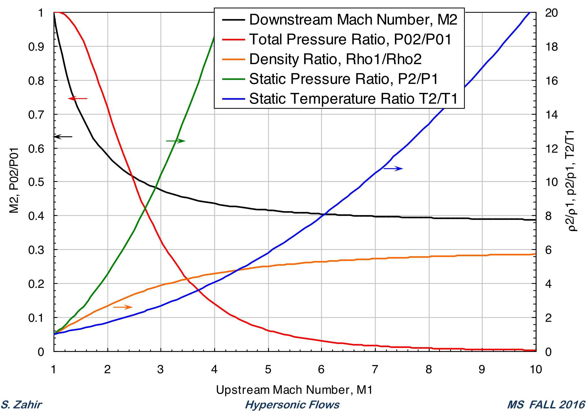

Copyright @ 2016 by S.Zahir. Permission required for copying or display

## NORMAL SHOCK TOTAL PRESSURE LOSSES

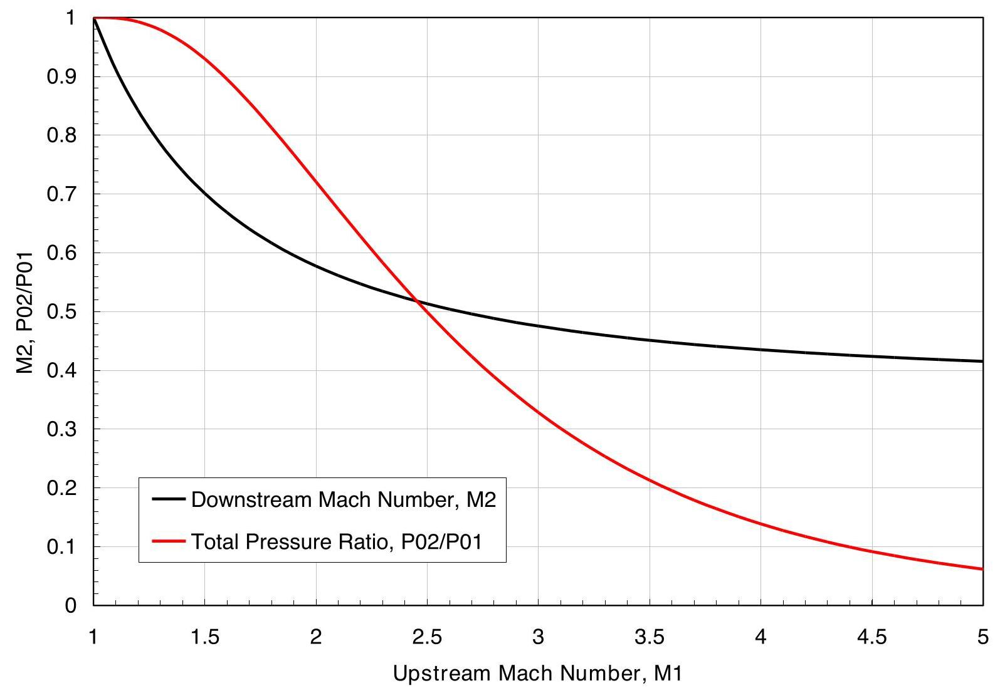

- As ${\mathrm{M}}_{1} \uparrow  {\mathrm{p}}_{02}/{\mathrm{p}}_{01} \downarrow$ very rapidly

- Total pressure is indicator of how much useful work can be done by a flow - Higher ${\mathrm{p}}_{0} \rightarrow$ more useful work extracted from flow

- Loss of total pressure are measure of efficiency of flow process

Hypersonic Flows

Copyright @ 2016 by S.Zahir. Permission required for copying or display

## OBLIQUE SHOCK WAVES

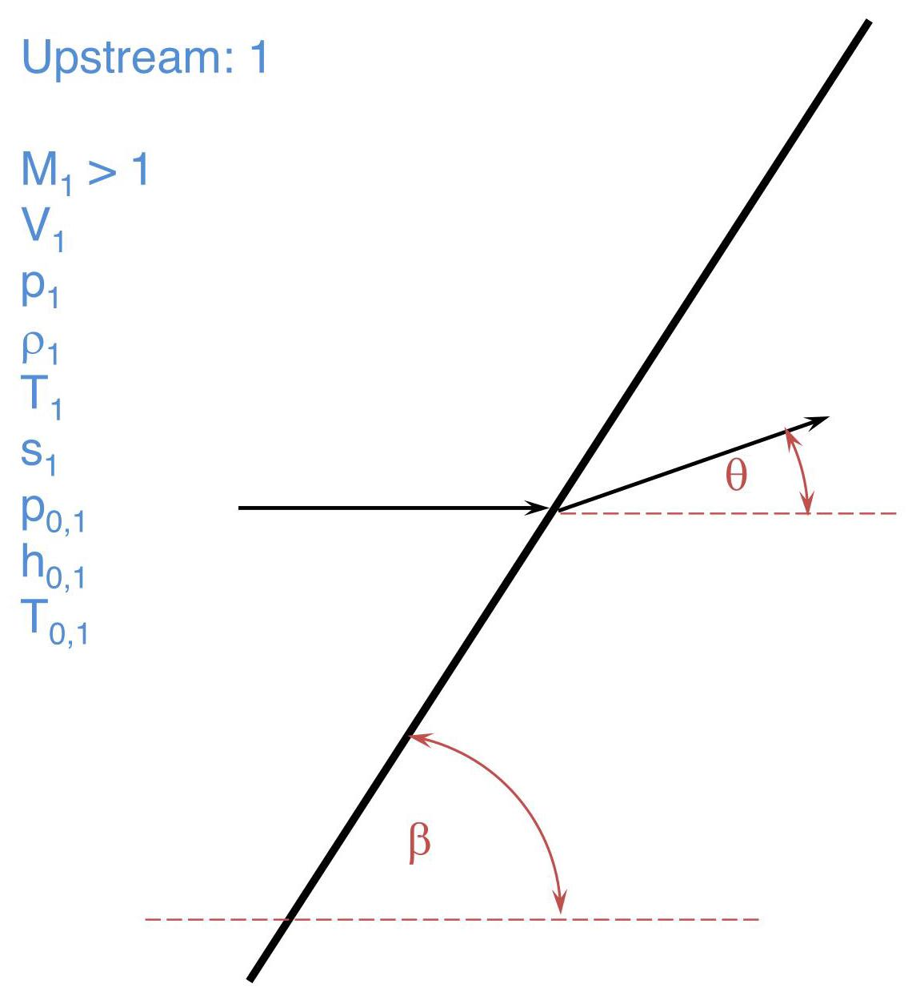

Downstream: 2

${\mathrm{M}}_{2} < {\mathrm{M}}_{1}\left( {{\mathrm{M}}_{2} > 1\text{ or }{\mathrm{M}}_{2} < 1}\right)$

${\mathrm{V}}_{2} < {\mathrm{V}}_{1}$

${\mathrm{P}}_{2} > {\mathrm{p}}_{1}$

${\rho }_{2} > {\rho }_{1}$

${\mathrm{T}}_{2} > {\mathrm{T}}_{1}$

${\mathrm{S}}_{2} > {\mathrm{S}}_{1}$

${p}_{0,2} < {p}_{0,1}$

${\mathrm{h}}_{0,2} = {\mathrm{h}}_{0,1}$

${\mathrm{T}}_{0,2} = {\mathrm{T}}_{0,1}$ (if calorically perfect,

${\mathrm{h}}_{0} = {\mathrm{c}}_{\mathrm{p}}{\mathrm{T}}_{0}$ )

## OBLIQUE SHOCK WAVES

- Split velocity and Mach into tangential (w and ${\mathrm{M}}_{\mathrm{t}}$ ) and normal components (u and ${\mathrm{M}}_{\mathrm{n}}$ )

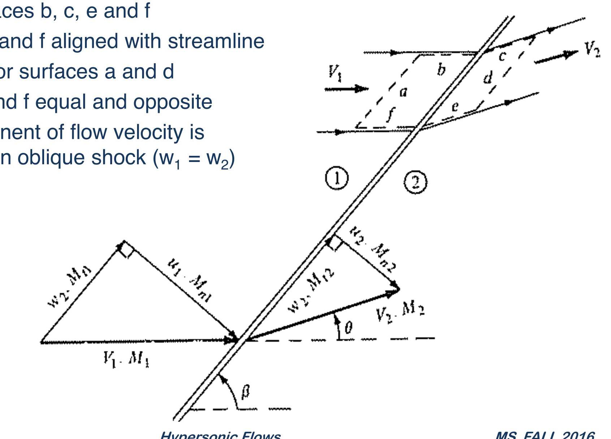

- V.dS = 0 for surfaces b, c, e and f

- (pdS) ${}_{\text{ tangential }} = 0$ for surfaces a and d

- pdS on faces b and f equal and opposite

- Tangential component of flow velocity is constant across an oblique shock $\left( {{w}_{1} = {w}_{2}}\right)$

S. Zahir

## SUMMARY OF SHOCK RELATIONS

$$
{\mathrm{M}}_{\mathrm{n},1} = {\mathrm{M}}_{1}\sin \beta
$$

Normal Shocks

Oblique Shocks

$$
{\mathbf{M}}_{2}^{2} = \frac{1 + \frac{\left( \gamma  - 1\right) }{2}{\mathbf{M}}_{1}^{2}}{\gamma {\mathbf{M}}_{1}^{2} - \frac{\left( \gamma  - 1\right) }{2}}
$$

$$
{\mathrm{M}}_{\mathrm{n},2}^{2} = \frac{1 + \frac{\left( \gamma  - 1\right) }{2}{\mathrm{M}}_{\mathrm{n},1}^{2}}{\gamma {\mathrm{M}}_{\mathrm{n},1}^{2} - \frac{\left( \gamma  - 1\right) }{2}}
$$

$$
\frac{{\rho }_{2}}{{\rho }_{1}} = \frac{\left( {\gamma  + 1}\right) {\mathrm{M}}_{1}^{2}}{2 + \left( {\gamma  - 1}\right) {\mathrm{M}}_{1}^{2}}
$$

$$
\frac{{\rho }_{2}}{{\rho }_{1}} = \frac{\left( {\gamma  + 1}\right) {\mathrm{M}}_{\mathrm{n},1}^{2}}{2 + \left( {\gamma  - 1}\right) {\mathrm{M}}_{\mathrm{n},1}^{2}}
$$

$$
\frac{{\mathrm{p}}_{2}}{{\mathrm{p}}_{1}} = 1 + \frac{2\gamma }{\gamma  + 1}\left( {{\mathrm{M}}_{1}^{2} - 1}\right)
$$

$$
\frac{{\mathrm{p}}_{2}}{{\mathrm{p}}_{1}} = 1 + \frac{2\gamma }{\gamma  + 1}\left( {{\mathrm{M}}_{\mathrm{n},1}^{2} - 1}\right)
$$

$$
{\mathrm{M}}_{2} = \frac{{\mathrm{M}}_{\mathrm{n},2}}{\sin \left( {\beta  - \theta }\right) }
$$

Hypersonic Flows

Copyright @ 2016 by S.Zahir. Permission required for copying or display

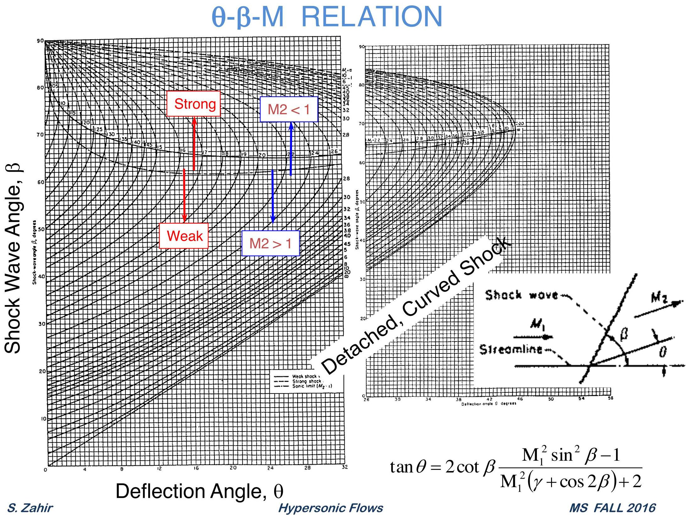

Copyright @ 2016 by S.Zahir. Permission required for copying or display

Shock – Highspeed Interactions

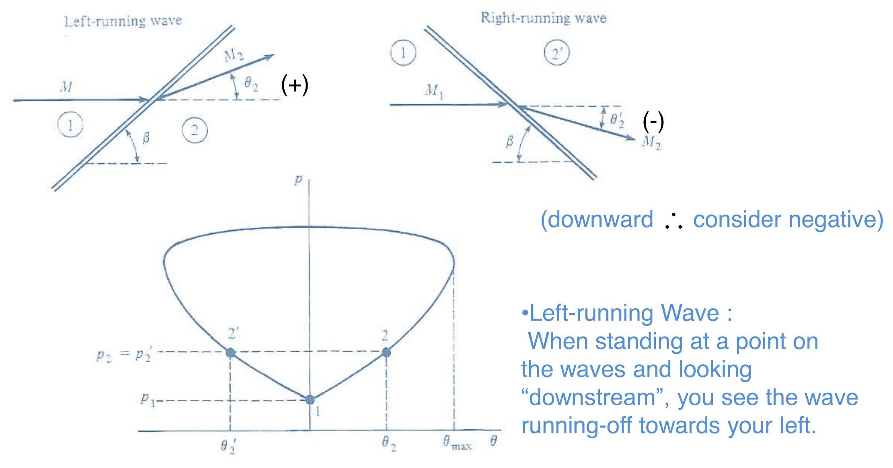

Pressure-deflection diagram for a given ${M}_{1}$ .

## Shock - Summary

- For any given upstream ${M}_{1}$ , there is a maximum deflection angle ${\theta }_{\max }$

- If $\theta  > {\theta }_{\max }$ , then no solution exists for a straight oblique shock, and a curved detached shock wave is formed ahead of the body

- Value of ${\theta }_{\max }$ increases with increasing ${M}_{1}$

- At higher Mach numbers, the straight oblique shock solution can exist at higher deflection angles (as ${\mathrm{M}}_{1} \rightarrow  \infty ,{\theta }_{\max } \rightarrow  {45.5}$ for $\gamma  = {1.4}$ )

- For any given $\theta$ less than ${\theta }_{\max }$ , there are two straight oblique shock solutions for a given upstream ${\mathrm{M}}_{1}$

- Smaller value of $\beta$ is called the weak shock solution

- For most cases downstream Mach number ${\mathrm{M}}_{2} > 1$

- Very near ${\theta }_{\max }$ , downstream Mach number ${\mathrm{M}}_{2} < 1$

- Larger value of $\beta$ is called the strong shock solution

- Downstream Mach number is always subsonic ${\mathrm{M}}_{2} < 1$

- In nature usually weak solution prevails and downstream Mach number >1

- If $\theta  = 0,\beta$ equals either ${90}^{ \circ  }$ or $\mu$

## Shock – Effect on Highspeed Flights

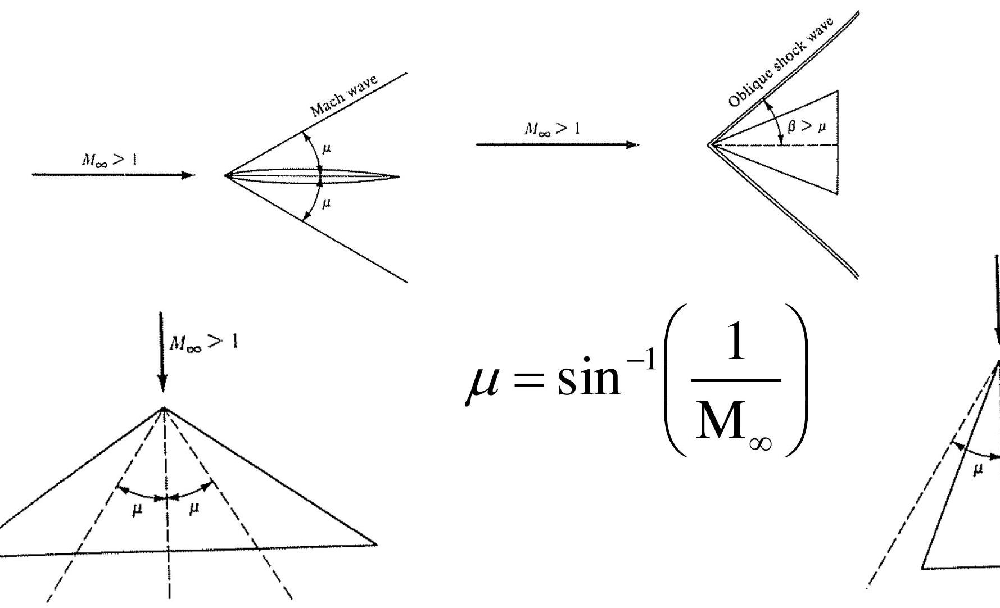

${M}_{\infty } > 1$

口

- If leading edge of swept wing is outside Mach cone, component of Mach number normal to leading edge is supersonic $\rightarrow$ Large Wave Drag

- If leading edge of swept wing is inside Mach cone, component of Mach number normal to leading edge is subsonic $\rightarrow$ Reduced Wave Drag

- For supersonic flight, swept wings reduce wave drag S. Zahir Hypersonic Flows

Aircraft - WING SWEEP

F-100D

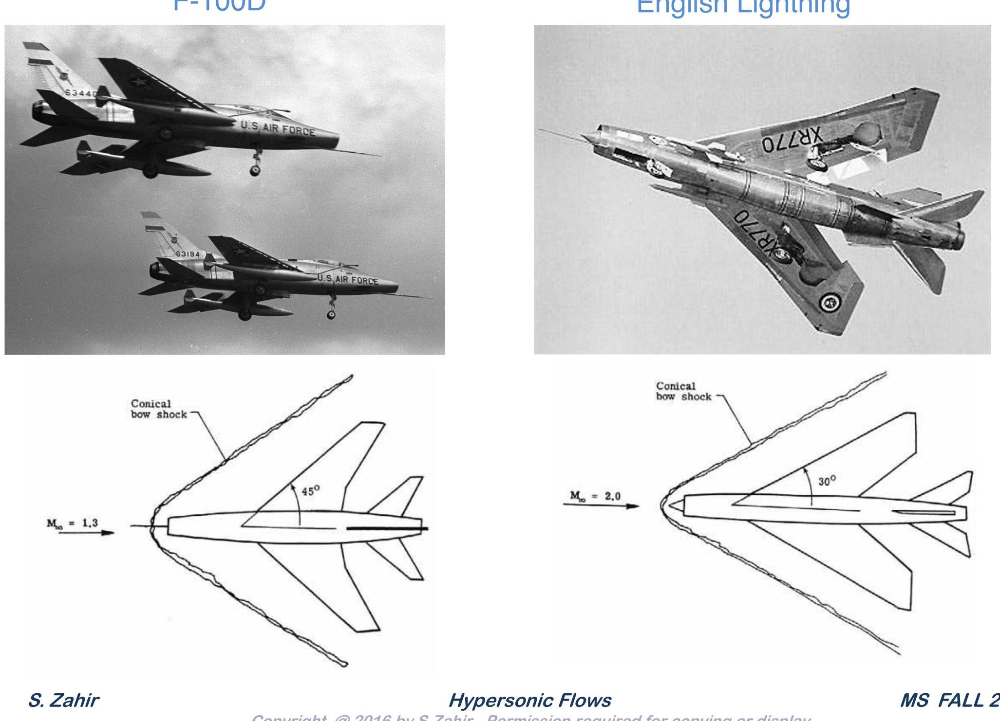

English Lightning

Copyright @ 2016 by S.Zahir. Permission required for copying or display

Aircraft – Wing Sweep

Copyright @ 2016 by S.Zahir. Permission required for copying or display

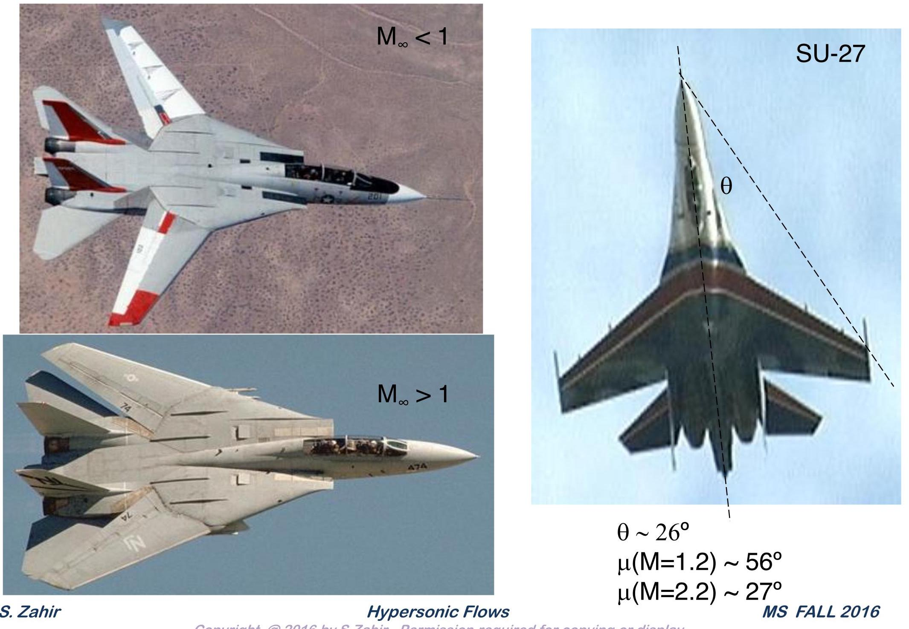

## SUPERSONIC - Wing Airfoils

Supersonic Airfoil at Zero AOA

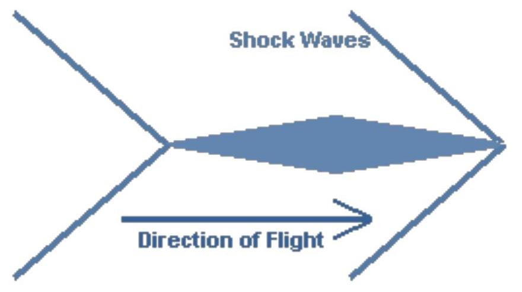

This double wedge airfoil is flying at supersonic speed. At zero degrees angle of attack it produces not lift.

There are four oblique shock waves which form at the Mach Angle.

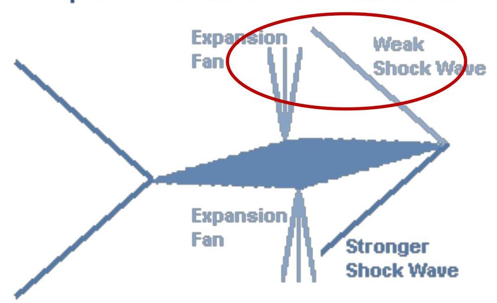

As the angle of attack is increased the upper shock wave becomes weaker but the lower shock wave becomes stronger.

This slows the airflow below the wing. Therefore the wing produces lift.

S. Zahir

MS FALL 2016

Copyright @ 2016 byS.Zahir. Permission required for copying or display

News Break

It pays to attend an elite school \$150,000

According to nationwide surveys, graduates of MBA programmes who join traditional consulting or financial services firms anter college can expect to earn an average yearly salary of about \$100,000 in the US. However, graduates of 'elite' institutions, such as Ivy League schools, can expect to earn more: about \$150,000 per year.

(Harvard Business Review)

Shock Interactions

S. Zahir

## Shock – Highspeed Interactions

Incident oblique shocks, compression corners, swept fins, and normal shocks generate pressure rises which result in thickening or separation of the boundary layer. Unfortunately, because each flow has different characteristic scales, these flows defy a simple two-dimensional analytic parameterization; further difficulty regarding understanding of shock-foot unsteadiness is still a matter of concern.

## Shock – Highspeed Interactions

Pressure - Deflection Diagrams

-locus of all possible static pressure behind an oblique shock wave as a function deflection angle for given upstream conditions.

Shock wave - a solid boundary

## Wave interaction

Shock - shock

Shock - expansion

Shock - free boundaries

Expansion - expansion

Shock – Highspeed Interactions

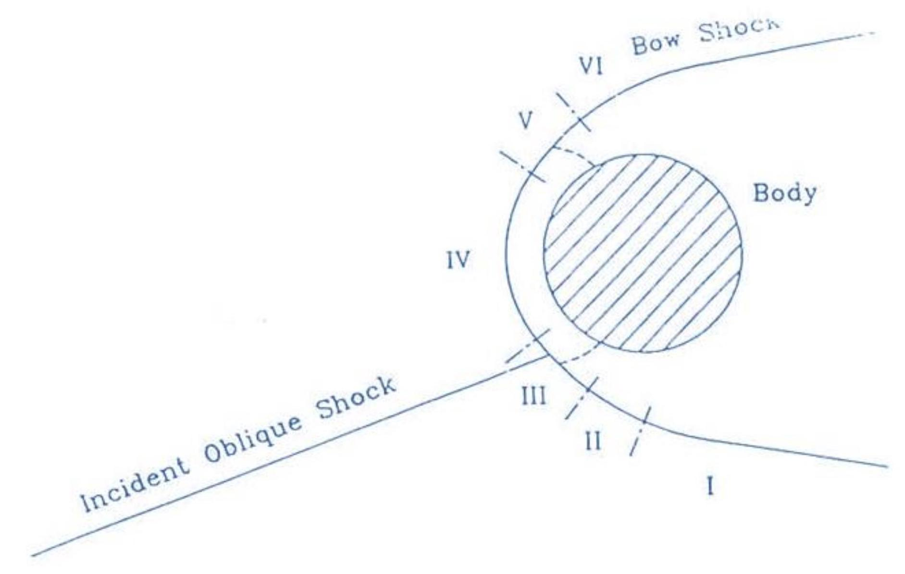

Shock – Highspeed Interactions

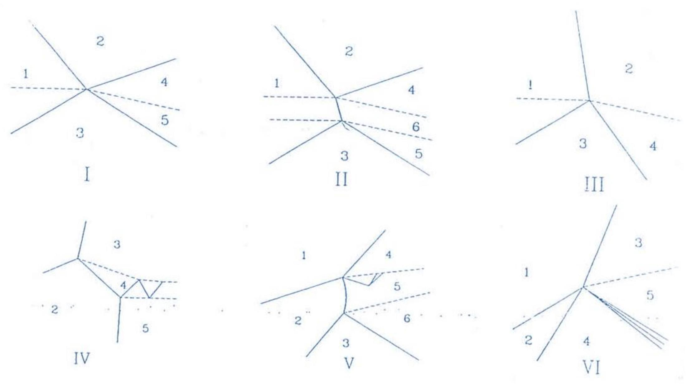

## Shock – Highspeed Interactions

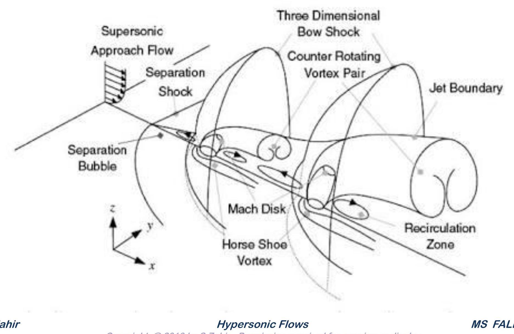

MS FALL 2016

Copyright @ 2016 by S.Zahir. Permission required for copying or display

## Shock – Highspeed Interactions

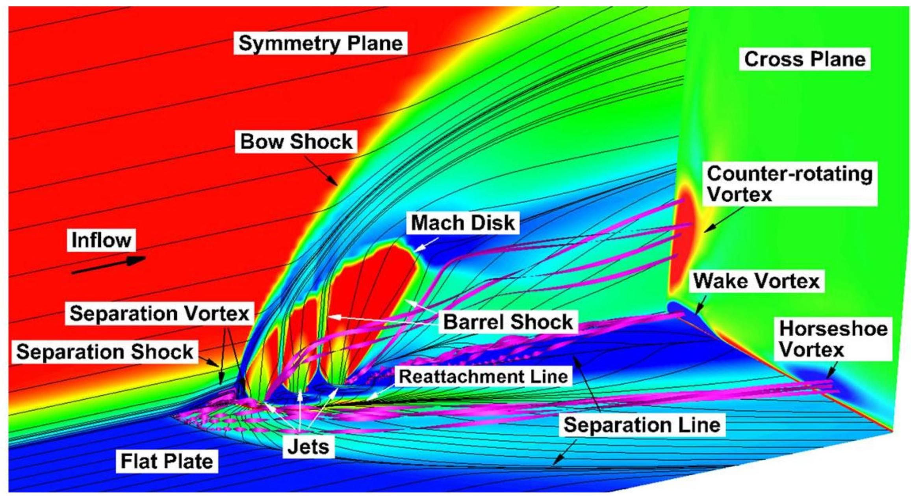

S. Zahir Hypersonic Flows

Copyright @ 2016 by S.Zahir. Permission required for copying or display

Highspeed Flow Interaction Parameters

Pressure at the blunt cone surface is defined by the non-dimensional pressure coefficient

$$
{C}_{p} = \frac{P - {P}_{\infty }}{1/2{\rho }_{\infty }{U}_{\infty }^{2}}
$$

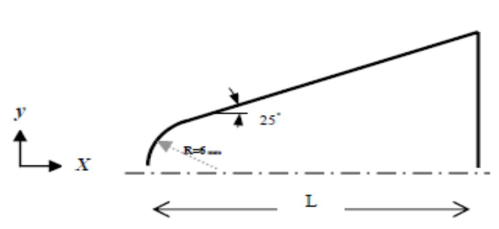

## Highspeed Flow Interaction Parameters

$$
M = \frac{{U}_{\infty }}{C} \tag{1}
$$

Where $\mathrm{C}$ is the sound speed of the gas given as

$$
C = \sqrt{\frac{{\nu K}{T}_{\infty }}{m}} \tag{2}
$$

Where $\mathrm{K}$ is the Boltzman constant, $\mathrm{m}$ is the molecular mass and $v$ is the specific heat ratio.

(2) The Knudsen number allow to expressed the degree of rarefaction of a gas so this parameter is defined as

$$
{Kn} = \frac{\lambda }{L} \tag{3}
$$

Where $\lambda$ is the mean free path of molecule and $\mathrm{L}$ is characteristic dimension, on the other hand, $\lambda$ is given as

$$
\lambda  = \frac{KT}{\sqrt{2}{\pi P}{\sigma }_{c}^{2}} \tag{4}
$$

Where $\mathrm{T}$ is the temperature, $\mathrm{P}$ is the pressure, and ${\sigma }_{c}$ is cross-section of molecule. (3) The Reynolds number is defined as

$$
\operatorname{Re} = \frac{R{U}_{\infty }{\rho }_{\infty }}{\mu } \tag{5}
$$

S. Zahir

## Highspeed Flow Interaction Parameters

Also we can define the Knudsen number with help of Eqs. 1 to 3 that this parameter is obtained of Re and M:

$$
{Kn} = \sqrt{\frac{v\pi }{2}}\frac{M}{\operatorname{Re}} \tag{6}
$$

(4) Pressure to the blunt surface is defined by pressure coefficient to the blunt surface is defined:

$$
{C}_{p} = \frac{P - {P}_{\infty }}{1/2{\rho }_{\infty }{U}_{\infty }^{2}} \tag{7}
$$

Where, $\mathrm{P}$ is the normal pressure of the blunt body. ${\mathrm{P}}_{\infty },{\mathrm{T}}_{\infty }$ and ${\rho }_{\infty }$ are gas pressure, temperature and density of free stream respectively.

Highspeed Aerodynamics

## Highspeed Aerodynamics - Summary

Any object present on the earth surface interacts with its atmosphere up to a certain height till where this blanket of air exists. We study this interaction of air and the body deeply in a branch of dynamics called Aerodynamics, which is a hybrid of fluid and gas dynamics, much of the theories of aerodynamics are shared between the two.

Aerodynamics basically is concerned with the motion of air mostly when it interacts with a moving object. Objects on ground like buildings, bridges etc. also interact with air as they exhibit simple harmonic motion. Besides, them the moving bodies in air be it jets, cars, airplanes have to push through the mass of air in front of them, which takes energy and is very exhausting for a particular body. In case of moving bodies it is termed as wind resistance while the bodies which are stationary with respect to the ground the civil, structural engineers and the town planners term it as wind loading. Understanding this flow field around the object with the help of concepts dealt in aerodynamics enables the calculation of forces and moments acting on the object.

## Highspeed Aerodynamics - Summary

Aerodynamics appeared in early 20th century with advent of aircraft construction, as it was the first invention whose motion was solely in air. The aerodynamics of aircraft and in general of flying vehicle deals with definition of aerodynamic forces and moments acting on the entire vehicle and on its parts, wing, fuselage and tail. The use of aerodynamics through mathematical model analysis, empirical approximation and wind tunnel experiment form the scientific basis for idea of heavier- than-air flight. Typical properties which we calculate for a flow field around a dynamic body includes velocity, pressure , density and temperature as a function of unsteady air flow. By defining a control volume around the flow field, equations for the conservation of mass, momentum, and energy can be defined and used to study such type of interaction.

## Highspeed Aerodynamics - Summary

Hypersonic aerodynamics is a special branch of aerodynamics where we study the property of the flow at mach number greater than the value of 5 . The term "hypersonic" in a way means highly supersonic, but hypersonic aerodynamics is the study of the distinguish flow fields , phenomenon, and problems appearing at flight speeds greater than speed of sound counterparts from those appearing at flight speeds which are at most moderately supersonic. When the Mach number in a fluid approaches 5, the behavior of the fluid depends more upon the Reynolds number than the Mach number.

There exist various criteria which must be satisfied to declare a certain flow to be hypersonic flow which is very high supersonic flow. Depending upon the Mach number, M we have criteria by which the physical flow doesn't change. Moreover, the dependence of Mach number with same parameter may vary with the body shape. Temperature is very important parameter for the dependence of hypersonic flow. For high speed such as in case of hypersonic flow, temperature rises very fast and hence temperature distribution plays an important role, thus thermodynamics also comes to picture thus adding a concept of aerothermodynamics.

## Highspeed Aerodynamics - Summary

## Physical Aspects of Hypersonic Flows

The different factors which enables us to differentiate hypersonic flow from the other Mach flows include:

## Thin shock layers

A characteristic of hypersonic flow is that shock waves lie close to the surface, thus creating thin shock layers, which, in turn , can cause physical complications . At low Reynolds number, boundary layer on the surface can grow quite thick , on the same order as the thickness of shock layer itself . This leads to merging of shock wave with boundary layer, constituting a 'fully viscous shock layer'. Shock wave angle is very small in this case. Hence large change in pressure density and velocity is experienced across this shock layer.

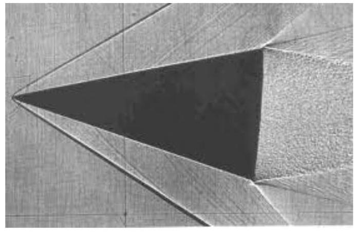

## Highspeed Aerodynamics - Summary

## Entropy layer

In this flow regime, the thin shock waves curves downstream of the vehicle and wraps itself around the nose of the body. The shock layer is thin and is highly curved. Due to this strong curvature large velocity gradients are induced in the flow behind the shock wave in the nose region. These large velocity gradients are accompanied by strong thermodynamic changes in the flow. This entropy layer interacts with the boundary layer growing along the surface which causes an increase in aerodynamic heating to the surface. Since the strength of the entropy layer is related to shock curvature, entropy layer effect is primarily a hypersonic phenomenon.

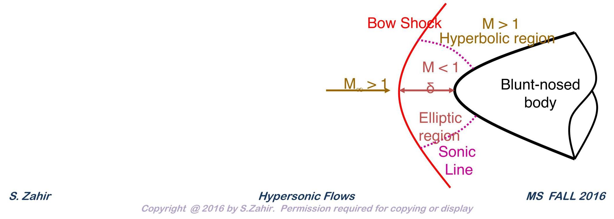

## Highspeed Aerodynamics - Summary

## Viscous interaction

Results for compressible flow boundary layer show that thickness $\left( \delta \right)$ is inversely proportional to square root of the Reynolds number and square of the mach number. As a result, at high mach numbers associated with hypersonic flows $\delta$ is so large that it affects the outer inviscid flow , and the changes in the inviscid flow feedback influencing the boundary layer growth, which increases the surface pressure and the skin friction, leading to increase in drag and aerodynamic heating. Hence, induced pressure increment is seen at the leading edge .

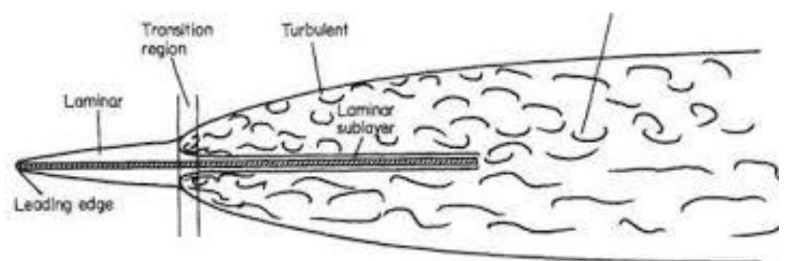

## Highspeed Aerodynamics - Summary

## High temperature effects

The ratio of kinetic energy to internal energy of a system increases as the square of M. Hypersonic flow when enters a boundary layer, is slowed by the effects of friction, Hence the kinetic energy decreases rapidly and transforms to internal energy which results in rise in temperature rapidly and such high temperature results in dissociation of gases like ${\mathrm{O}}_{2}$ (T >2000 K) & ${\mathrm{N}}_{2}$ ( T >4000 K) , the molecules break apart producing an electrically charged plasma around the aircraft. Hence the flow properties change and aerodynamic heating occurs.

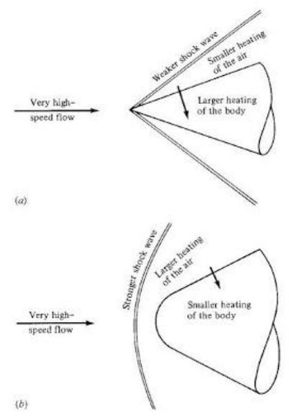

## Highspeed Aerodynamics - Summary

## Low density flow

Instead of exhibiting continnum properties, free molecular flow is observed at such high mach numbers. Body perceives individual molecular impacts. A parameter called Knudsen number , ratio of λ/I is used in low density flows, whenever λ >> I we have a free molecular flow. The thick shock waves lose their identity in such type of flows . Drag coefficient (CD), heat transfer coefficients increases with increase in mach number. CD = 2 for free molecular flows.

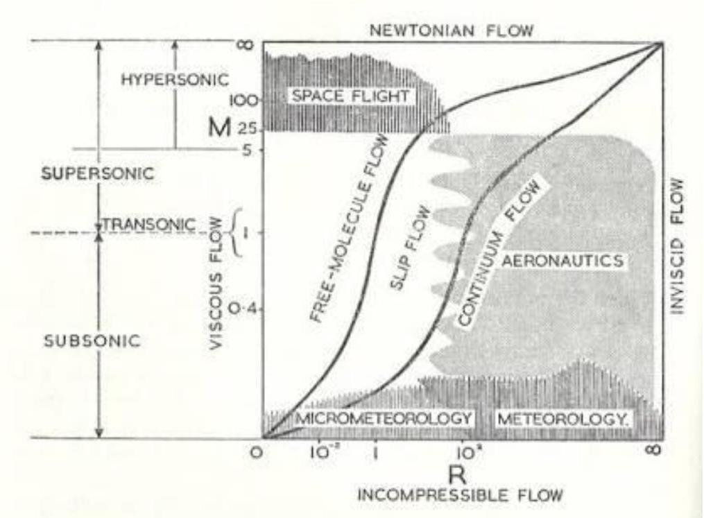

Hypersonic Flows MS FALL 2016

Copyright @ 2016 by S.Zahir. Permission required for copying or display

## Highspeed Aerodynamics - Summary

## Newton's Impact Theory

For estimation of pressure distribution on the surface of hypersonic objects Newton

gave a law which allows us to calculate the pressure coefficient at a point on a surface

where the angle between a tangent to the surface at that point and free stream direction is $\alpha$ .

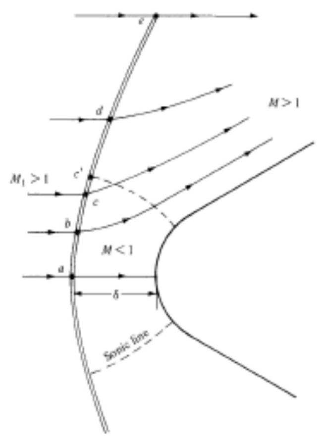

Mathematically,

${\mathrm{C}}_{\mathrm{p}} = 2{\sin }^{2}\alpha$

where,

Cp = the coefficient of pressure,

$\alpha  =$ the angle between the flow and vehicle’s surface

## Highspeed Aerodynamics - Summary

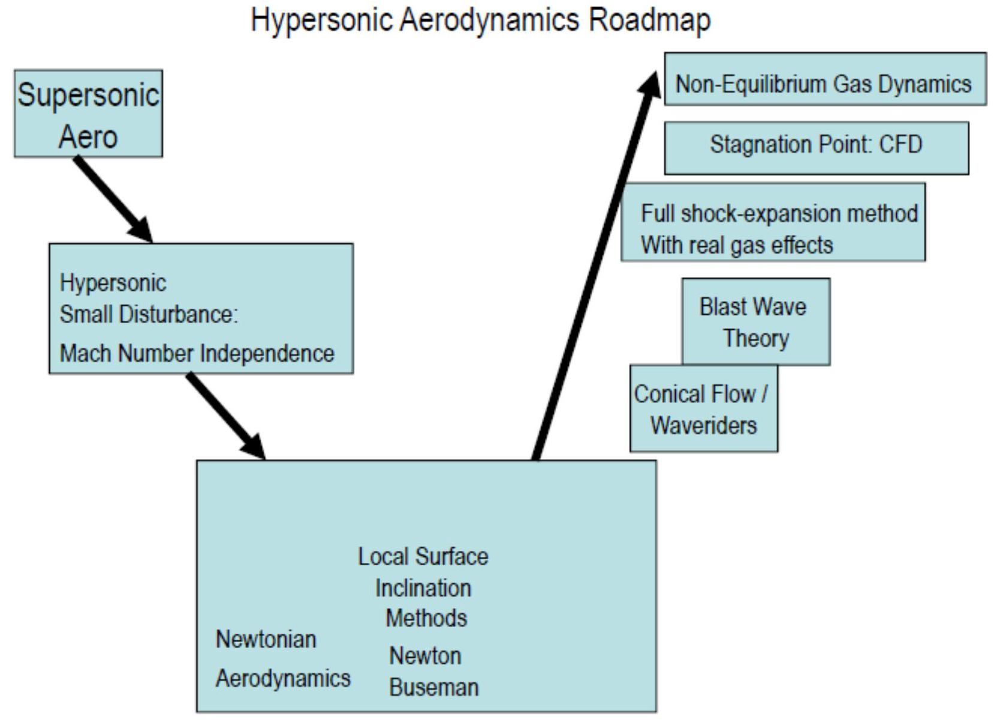

Hypersonic Flows

Copyright @ 2016 by S.Zahir. Permission required for copying or display

## Highspeed Flow - Features

Van Dyke: Hypersonic flow is flow past a body at high Mach number, where nonlinearity is an essential feature of the flow.

Also understood, for thin bodies, that if $\tau$ is the thickness-to-chord ratio of the body, M $\tau$ is of order 1.

## Special Features

Thin shock layer: shock is very close to the body. The thin region between the shock and the body is called the Shock Layer.

Entropy Layer: Shock curvature implies that shock strength is different for different streamlines - stagnation pressure and velocity gradients - rotational flow

S. Zahir MS FALL 2016

## Highspeed Flow - Features

Troposphere: $0 < z < {10}\mathrm{\;{km}}$

Stratosphere: ${10} < z < {50}\mathrm{\;{km}}$

Mesosphere: ${50} < z < {80}\mathrm{\;{km}}$

Thermosphere: $z > {80}\mathrm{{km}}$

lonosphere ${65} < {365}\mathrm{\;{km}}\;$ Contains ions and free electrons

${60} < \mathrm{z} < {85}\mathrm{\;{km}}\;{\mathrm{{NO}}}^{ + }$

${85} < \mathrm{z} < {140}\mathrm{\;{km}}\;{\mathrm{{NO}}}^{ + },{\mathrm{O}}_{2}^{ + }$

${140} < \mathrm{z} < {200}\mathrm{\;{km}}\;\mathrm{{NO}} + ,{\mathrm{O}}^{ + },{\mathrm{O}}^{ + }$

$Z > {200}\mathrm{\;{km}}\;{\mathrm{\;N}}^{ + },{\mathrm{O}}^{ + }$

Highspeed Flow - Features

A Simple Model for Variation of density with altitude

$$
{dp} =  - {\rho gdz}
$$

$$
p = \frac{\rho \widehat{R}T}{\widehat{M}}
$$

Neglect dissociation and ionization - Molecular weight is constant Assume isothermal (T = constant) poor assumption

$$
\frac{dp}{p} \cong   - \frac{g\widehat{M}}{\widehat{R}T}{dz}
$$

$$
\rho  \cong  {\rho }_{0}{\log }_{\mathrm{e}}\left\lbrack  {\frac{g\widehat{M}}{\widehat{R}T}z}\right\rbrack
$$

## Highspeed Flow - Features

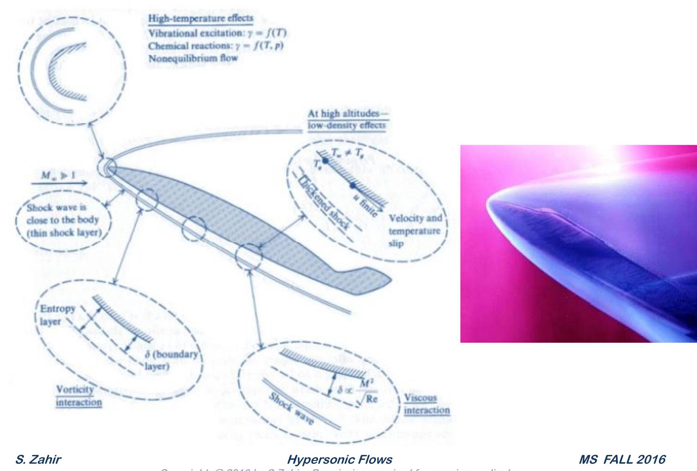

Copyright @ 2016 by S.Zahir. Permission required for copying or display

## Highspeed Flow - Features

Crocco's Theorem:

## $T\nabla s = \nabla {h}_{0} = \overrightarrow{u} \times  \overrightarrow{\omega }$

Implies vorticity in the shock layer.

Viscous Layer:

Thick boundary layer, merges with shock wave to produce a merged shock-viscous layer. Coupled analysis needed.

## High Temperature Effects:

Very large range of properties (temperature, density, pressure) in the flowfield, so that specific heats and mean molecular weight may not be constant.

Low Density Flow:

Most hypersonic flight (except of hypervelocity projectiles) occurs at very high altitudes

$$
\text{ Knudsen No. } = \frac{\lambda }{L}\; = \text{ ratio of Mean Free Path to characteristic length }
$$

Above 120 km, continuum assumption is poor. Below 60 km, mean free path is less than 1mm.

## Highspeed Flow - Theories

Newtonian Aerodynamics: Flow hits surface layer, and abruptly turns parallel to surface. Momentum

normal to the surface is transferred to normal force on the body. Normal force on body $=$ drag of normal flow component.

Normal force is decomposed into lift and drag.

Modified Newtonian Aerodynamics: Account for stagnation pressure drop across shock,

Local Surface Inclination Method : Cp at a point is calculated from static pressure behind an oblique shock caused by local surface slope at freestream Mach number.

"Tangent Cone"approach: similar to local surface slope arguments.

Mach number independence: Shock/expansion relations and Cp become independent of Mach number at very high Mach number.

Blast wave theory: Energy of Disturbance caused by hypersonic vehicle is like a detonation wave. Hypersonic similarity: Allows developing equivalent shock tube experiments for hypersonic aerodynamics.

S. Zahir Hypersonic Flows MS FALL 2016

## Highspeed Flow - Theories

Newtonian Aerodynamics: Flow hits surface layer, and abruptly turns parallel to surface.

Momentum normal to the surface is transferred to normal force on the body.

Normal force on body = drag of normal flow component.

Normal force is decomposed into lift and drag.

-No info on shock. or viscous drag -No influence of body shape

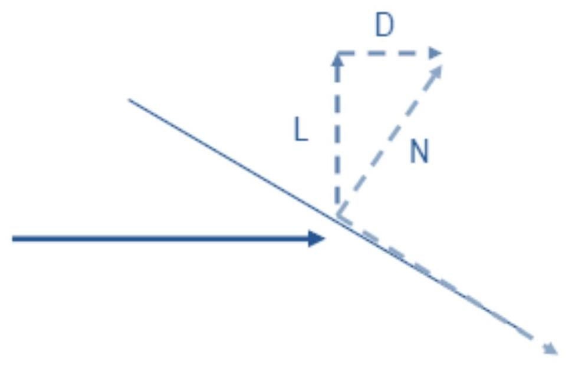

## Highspeed Flow - Theories

## Local Surface Inclination Methods

Approximate methods over arbitrary configurations, in particular, where Cp is a function of local surface slope.

## Newtonian Aerodynamics

Newton (1687) concept was that particles travel along straight lines without Interaction with other particles, let pellets from a shotgun. On striking a surface, they would lose all momentum perpendicular to the surface, but retain all tangential momentum - i.e., slide off the surface.

Net rate of change of momentum $= {\rho }_{\infty }{U}_{\infty }{}^{2}{\operatorname{Sin}}^{2}{\theta \Delta A}$

${Cp} = 2{\operatorname{Sin}}^{2}\theta$

In 3D flows we replace ${U}_{\infty }\operatorname{Sin}\theta$ with ${\overrightarrow{U}}_{\infty } \bullet  \overrightarrow{n}$

$$
{Cp} = 2\frac{{\left| {U}_{\infty } \bullet  \overrightarrow{n}\right| }^{2}}{{U}_{\infty }{}^{2}}
$$

Shadow region: $\;{Cp} = 0$

Shadow region is where ${\overrightarrow{U}}_{\infty } \bullet  \overrightarrow{n} > 0$

Highspeed Flow - Theories

Poor in low speed flow. Predicts . ${C}_{l} \propto  {a}^{2}$

(1) Works well as Mach number gets large and specific heat ratio $\gamma$ tends towards 1.0 Why? Because shock is close to surface, and velocity across the shock is very large – most of the normal momentum is lost.

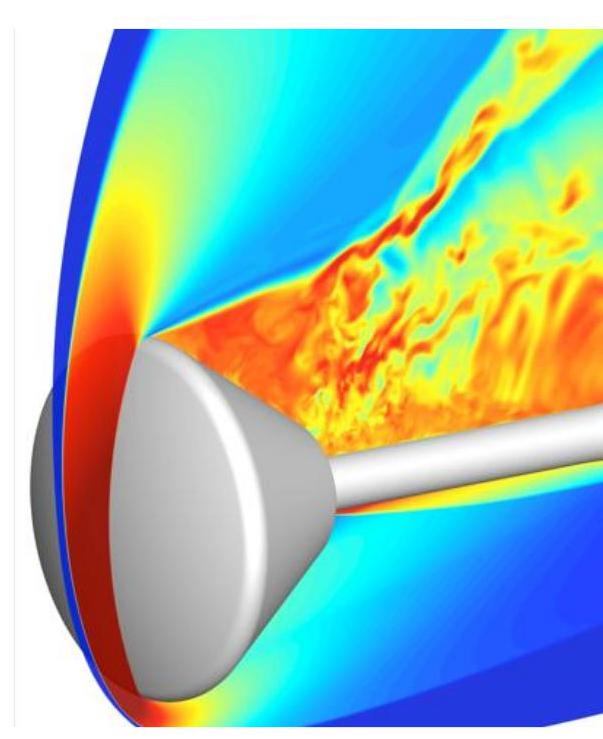

MS FALL 2016

(2) Tends to overpredict ${c}_{p}$ and ${c}_{d}\left( {C}_{D}\right)$ see

(3) Works better in 3-D than in 2-D

(4) In 3-D, works best for blunt bodies; not good for wedges, cones, wings etc.

Highspeed Flow - Theories

## Modified Newtonian

Was proposed by Lester Lees in 1955, as a way of improving Newtonian theory, and bringing in Mach Number dependence . He proposed replacing 2 with ${C}_{p\max }$

$$
{C}_{p} = {C}_{{p}_{\max }}{\sin }^{2}\theta
$$

Here ${C}_{{p}_{\max }}$ is the ${C}_{p}$ behind a Normal shock wave, at the stagnation point. That is,

$$
{C}_{{p}_{\max }} = \frac{{p}_{02} - {p}_{\infty }}{\frac{1}{2}{\rho }_{\infty }{U}_{\infty }^{2}}
$$

From Rankine-Hugoniot relations,

$$
\frac{{p}_{02}}{{p}_{\infty }} = {\left\lbrack  \frac{{\left( \gamma  + 1\right) }^{2}{M}_{\infty }{}^{2}}{{4\gamma }{M}_{\infty }{}^{2} - 2\left( {\gamma  - 1}\right) }\right\rbrack  }^{\frac{\gamma }{\gamma  - 1}}\left\lbrack  \frac{1 - \gamma  + {2\gamma }{M}_{\infty }{}^{2}}{\gamma  + 1}\right\rbrack
$$

Then

$$
{c}_{p} = \frac{\frac{{p}_{02}}{{p}_{\infty }} - 1}{\frac{\gamma }{2}{M}_{\infty }{}^{2}}
$$

Hypersonic Flows

Copyright @ 2016 by S.Zahir. Permission required for copying or display

Highspeed Flow - Theories

In the limit as ${\mathbf{M}}_{\infty } \rightarrow  \infty$ , We get

$$
{\mathbf{c}}_{p} = \left\lbrack  \frac{{\left( \gamma  + 1\right) }^{2\gamma }\gamma  - 1}{{\left( 4\gamma \right) }^{\gamma }\gamma  - 1}\right\rbrack  \frac{4}{\gamma  + 1}
$$

As $\gamma  \rightarrow  {1.4},\;{c}_{{p}_{\max }} \cong  {1.839}$

As $\gamma  \rightarrow  1,\;{c}_{p\max } = 2\;$ Proposed by Newton

## Hypersonic shock wave expansion

1. Simpler than exact expressions - for analysis

2. Key parameter is seen to be $K = {M}_{1}\theta$ where $\theta$ is the flow turning angle, for M>>1 and $\theta  <  < 1$

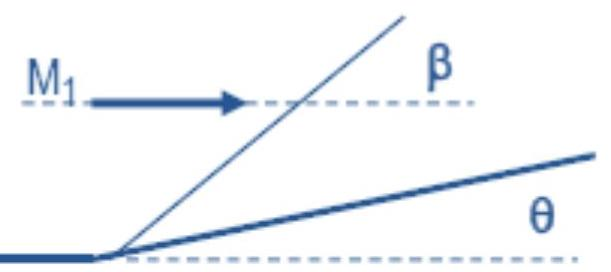

Oblique Shock Relations

$\tan \theta  = 2\cot \beta \frac{{M}_{1}^{2}{\sin }^{2}\beta  - 1}{{M}_{1}^{2}\left( {\gamma  + {\cos }^{2}\beta }\right)  + 2}$

$\tan \theta  \approx  2\cot \beta \frac{{M}_{1}^{2}{\sin }^{2}\beta }{{M}_{1}^{2}\left( {\gamma  + 1}\right) }\;{\mathrm{M}}_{1} >  > 1$ , small $\beta$

${M}_{1} >  > 1$ , small $\beta \;\theta  \cong  \left( \frac{2\beta }{\gamma  + 1}\right)$

Pressure jump:

$$
\frac{{p}_{2}}{{p}_{1}} = 1 + \frac{2\gamma }{\gamma  + 1}{M}_{1}^{2}{\sin }^{2}\beta
$$

${\mathrm{M}}_{1} >  > 1$

$$
\frac{{p}_{2}}{{p}_{1}} \approx  \frac{2\gamma }{\gamma  + 1}{M}_{1}^{2}{\sin }^{2}\beta
$$

## Hypersonic shock wave expansion

$$
\frac{{p}_{2}}{{p}_{1}} = 1 + \left\lbrack  {\frac{2\gamma }{\gamma  + 1}{M}_{1}^{2}{\sin }^{2}\beta  - 1}\right\rbrack
$$

$$
\approx  1 + \left\lbrack  {\frac{2\gamma }{\gamma  + 1}{M}_{1}^{2}{\beta }^{2} - 1}\right\rbrack
$$

$$
\frac{{p}_{2}}{{p}_{1}} = 1 + \frac{\gamma \left( {\gamma  + 1}\right) }{4}{K}^{2} + {K}^{2}\sqrt{{\left( \frac{\left( \gamma  + 1\right) }{4}\right) }^{2} + \frac{1}{{K}^{2}}}
$$

Defining pressure coefficient

$$
{c}_{p} \equiv  \frac{\left( \frac{{p}_{2}}{{p}_{1}} - 1\right) }{\frac{\gamma }{2}{M}_{1}^{2}}
$$

$$
\frac{{C}_{p}}{{\theta }^{2}} \equiv  \frac{\left( \frac{{p}_{2}}{{p}_{1}} - 1\right) }{\frac{\gamma }{2}{K}^{2}} = 2\left\lbrack  {\frac{\gamma  + 1}{4} + \sqrt{{\left( \frac{\gamma  + 1}{4}\right) }^{2} + \frac{1}{{K}^{2}}}}\right\rbrack
$$

$$
{C}_{p} = \frac{{4Si}{n}^{2}\beta }{\gamma  + 1}\;{M}_{1} >  > 1
$$

Next

$$
\frac{{u}_{2}}{{u}_{1}} = 1 - \frac{\left( {M}_{1}^{2}{\sin }^{2}\beta  - 1\right) }{\left( {\gamma  + 1}\right) {M}_{1}^{2}}
$$

In the hypersonic limit,

$$
\frac{{u}_{2}}{{u}_{1}} \approx  1 - \frac{2{\sin }^{2}\beta }{\gamma  + 1}
$$

$$
\text{ Also }\frac{{u}_{2}}{{u}_{1}} = \frac{2\left( {{M}_{1}^{2}{\sin }^{2}\beta  - 1}\right) \cot \beta }{\left( {\gamma  + 1}\right) {M}_{1}^{2}}
$$

$$
\frac{{u}_{2}}{{u}_{1}} \approx  \frac{\sin {2\beta }}{\left( \gamma  + 1\right) }
$$

## Hypersonic shock wave expansion

Density Jump Across Shock

$$
\frac{{\rho }_{2}}{{\rho }_{1}} = \frac{\left( {\gamma  + 1}\right) {M}_{1}^{2}{\sin }^{2}\beta }{\left( {\gamma  - 1}\right) {M}_{1}^{2}{\sin }^{2}\beta  + 2}
$$

In the hypersonic limit, for large ${\mathrm{M}}_{1} >  > 1$ , finite $\beta$

$$
\tan \theta  = 2\cot \beta \frac{{M}_{1}^{2}{\sin }^{2}\beta  - 1}{{M}_{1}^{2}\left( {\gamma  + {\cos }^{2}\beta }\right)  + 2}
$$

$$
\frac{{\rho }_{2}}{{\rho }_{1}} \approx  \frac{\left( \gamma  + 1\right) }{\left( \gamma  - 1\right) }
$$

becomes

Then the temperature jump is:

$$
\frac{\beta }{\theta } \approx  \frac{\gamma  + 1}{4} + \sqrt{\left( \frac{{\left( \gamma  + 1\right) }^{2}}{16} + \frac{1}{{M}_{1}^{2}{\theta }^{2}}\right) }
$$

$$
\frac{{T}_{2}}{{T}_{1}} = \frac{{p}_{2}}{{p}_{1}}\frac{{\rho }_{2}}{{\rho }_{1}} = \frac{2\left( {\gamma  - 1}\right) {M}_{1}^{2}{\sin }^{2}\beta }{{\left( \gamma  + 1\right) }^{2}}
$$

Works for finite values of ${M}_{1}\theta  = K$

$$
{C}_{p} \equiv  \frac{\left( \frac{{p}_{2}}{{p}_{1}} - 1\right) }{\frac{\gamma }{2}{M}_{1}^{2}}\;{C}_{p} = \frac{4{\operatorname{Sin}}^{2}\beta }{\gamma  + 1}
$$

Expansion wave relationships

From Prandtl-Meyer theory, $\theta  = {v}_{2} - {v}_{1}$

$$
v \approx  \sqrt{\frac{\gamma  + 1}{\gamma  - 1}}\left\lbrack  {\frac{\pi }{2} - \frac{1}{M}\sqrt{\frac{\gamma  + 1}{\gamma  - 1}}}\right\rbrack   + \frac{1}{M} - \frac{\pi }{2}
$$

$$
v = \sqrt{\frac{\gamma  + 1}{\gamma  - 1}}\left\lbrack  {{\tan }^{-1}\left( \sqrt{\frac{\gamma  + 1}{\gamma  - 1}\left( {{M}^{2} - 1}\right) }\right) }\right\rbrack   - {\tan }^{-1}\left( \sqrt{{M}^{2} - 1}\right)
$$

$$
v = \frac{\pi }{2}\sqrt{\frac{\gamma  + 1}{\gamma  - 1}} - \frac{2}{\left( {\gamma  - 1}\right) M} - \frac{\pi }{2}
$$

$$
\frac{{p}_{2}}{{p}_{1}} = {\left\lbrack  \frac{1 + \left( {\gamma  + 1}\right) {M}_{1}^{2}}{1 + \left( {\gamma  + 1}\right) {M}_{2}^{2}}\right\rbrack  }^{\frac{\gamma }{\gamma  - 1}} \approx  {\left( \frac{{M}_{1}}{{M}_{2}}\right) }^{\frac{2\gamma }{\gamma  - 1}}
$$

For ${M}_{1} \gg  1\;{M}_{1}^{2} - 1 \approx  {M}_{1}^{2}$

$$
\theta  = {v}_{2} - {v}_{1} = \frac{2}{\left( \gamma  - 1\right) }\left\lbrack  {\frac{1}{{M}_{1}} - \frac{1}{{M}_{2}}}\right\rbrack
$$

Also ${\tan }^{-1}\left( x\right)  = \frac{\pi }{2} - {\tan }^{-1}\left( \frac{1}{x}\right)$ From Taylor series

$$
\frac{{p}_{2}}{{p}_{1}} = {\left\lbrack  1 - \frac{\gamma  - 1}{2}{M}_{1}\theta \right\rbrack  }^{\frac{2\gamma }{\gamma  - 1}} = {\left\lbrack  1 - \frac{\gamma  - 1}{2}K\right\rbrack  }^{\frac{2\gamma }{\gamma  - 1}}
$$

$$
{\tan }^{-1}\left( \frac{1}{x}\right)  = \frac{1}{x} - \frac{1}{3{x}^{3}} + \frac{1}{5{x}^{5}} -
$$

$$
\frac{{c}_{p}}{{\theta }^{2}} \equiv  \frac{\left( \frac{{p}_{2}}{{p}_{1}} - 1\right) }{\frac{\gamma }{2}{K}^{2}} = \frac{2}{\gamma {K}^{2}}\left\lbrack  {{\left\lbrack  1 - \frac{\gamma  - 1}{2}K\right\rbrack  }^{\frac{2\gamma }{\gamma  - 1}} - 1}\right\rbrack
$$

Note that

$$
\frac{{C}_{p}}{{\theta }^{2}} \approx  f\left( {K,\gamma }\right)
$$

Expansion wave relationships

As freestream Mach number becomes large, $\frac{{\rho }_{2}}{{\rho }_{1}} \approx  \frac{\left( \gamma  + 1\right) }{\left( \gamma  - 1\right) }$

$$
\frac{{p}_{2}}{{\rho }_{\infty }{U}_{\infty }{}^{2}} = \frac{{p}_{2}}{{p}_{\infty }}\frac{{p}_{\infty }}{{\rho }_{\infty }{U}_{\infty }{}^{2}} = \left\lbrack  {\frac{2\gamma }{\gamma  + 1}{M}_{\infty }{}^{2}{\sin }^{2}\beta }\right\rbrack  \left\lbrack  \frac{1}{\gamma {M}_{\infty }{}^{2}}\right\rbrack
$$

$$
= \frac{2\gamma }{\gamma  + 1}{\sin }^{2}\beta
$$

Why nondimensionalize by ${\rho }_{\infty }{U}_{\infty }{}^{2}$

Because ${p}_{2} \sim  O\left( {{\rho }_{\infty }{U}_{\infty }{}^{2}}\right) \;$ And it allows cancellation of Mach number

Examine other relations for properties downstream of the shock - freestream Mach number does not appear anywhere.

## Mach Independence

Non-lifting body moving at velocity $U$ , which is inclined at angle $\theta$ to the $x$ -axis:

$$
m\frac{{d}^{2}x}{d{t}^{2}} =  - {DCos\theta }
$$

$$
m\frac{{d}^{2}z}{d{t}^{2}} = {DSin\theta } - {mg}
$$

$$
\frac{m\frac{{d}^{2}z}{d{t}^{2}}}{\left( {c}_{D}s\right. } = \frac{1}{2}\rho {U}^{2}{C}_{D}S\sin \theta  - {mg}
$$

$$
\left( \frac{m}{{C}_{D}S}\right) \text{ is the "Ballistic Parameter". }
$$

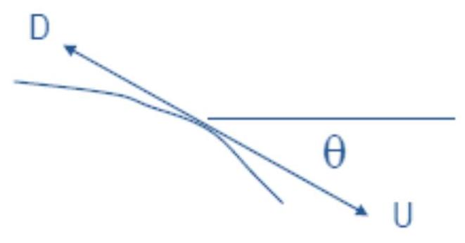

Assuming that the drag force is >> weight and that $\theta$ is constant because gravitational force is too weak to change the flight path much

$$
{\operatorname{Log}}_{e}\left( \frac{U}{{U}_{e}}\right)  =  - \frac{1}{2}\frac{{\rho }_{0}{C}_{D}S}{m\sin \theta }\exp \left( \frac{-{gMz}}{RT}\right)
$$

Mach - Shock wave

A shock wave is an extremely thin region, typically on the order of ${10}^{-5}\mathrm{\;{cm}}$ , across which the flow properties can change drastically. The shock wave is usually at an oblique angle to the flow, however, there are many cases where we are interested in a shock wave normal to the flow:

- Shock waves are very thin regions in a supersonic flow across which the pressure, density, temperature, and entropy increase; the Mach number, flow velocity, and total pressure decrease; and the total enthalpy stays the same.

## Mach - Shock wave

Total temperature TO and total enthalpy hO are defined as the properties that would exist if (in our imagination) we slowed the fluid element at a point in the flow to zero velocity adiabatically. Similarly, total pressure p0 and total density ρ0 are defined as the properties that would exist if (in our imagination) we slowed the fluid element at a point in the flow to zero velocity isentropically. If a general flowfield is adiabatic, h0 is constant throughout the flow; in contrast, if the flow field is nonadiabatic, h0 varies from one point to another. Similarly, if a general flow field is isentropic, p0 and ρ0 are constant throughout the flow; in contrast, if the flow field is nonisentropic, p0 and ρ0 vary from one point to another.

Mach - Shock wave situations

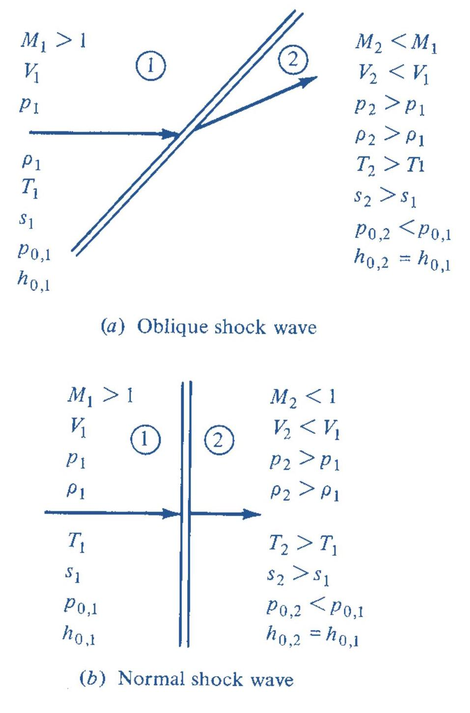

Hypersonic Flows

Copyright @ 2016 by S.Zahir. Permission required for copying or display

## Shock – Density variations

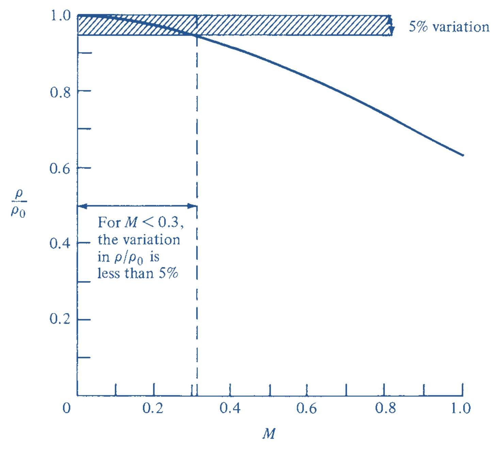

## Shock – Body Interactions

## Shockwave Interactions

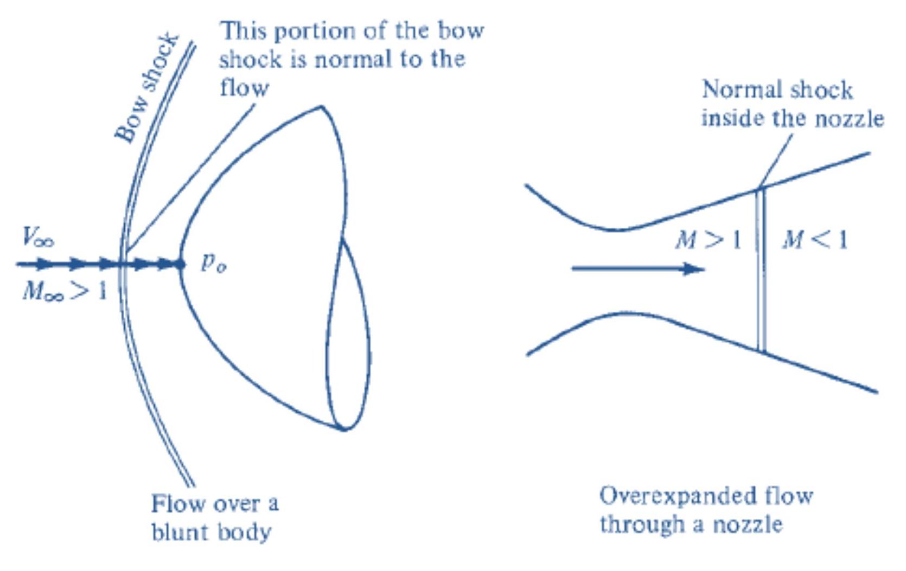

## Shockwave Interactions

Continuity:

$$
{\rho }_{1}{u}_{1} = {\rho }_{2}{u}_{2}
$$

Momentum:

$$
{p}_{1} + {\rho }_{1}{u}_{1}^{2} = {p}_{2} + {\rho }_{2}{u}_{2}^{2}
$$

Energy:

$$
{h}_{1} + \frac{{u}_{1}^{2}}{2} = {h}_{2} + \frac{{u}_{2}^{2}}{2}
$$

Enthalpy:

$$
{h}_{2} = {c}_{p}{T}_{2}
$$

Equation of state:

$$
{p}_{2} = {\rho }_{2}R{T}_{2}
$$

These equations describe the changes that take place in any steady, adiabatic, inviscid flow where only one direction is involved. This type of flow, where the flow-field variables are functions of x only [p = p(x), u = u(x), etc.], is defined as one-dimensional flow.

S. Zahir

Shockwave Interactions

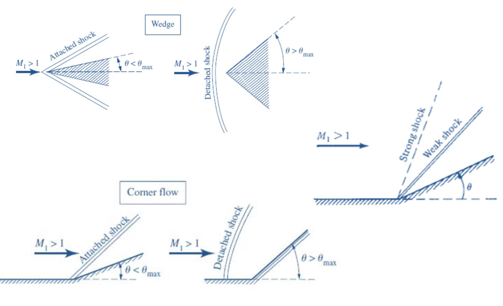

S. Zahir

## Shockwave Interactions

$$
{M}_{2}^{2} = \frac{1 + \left\lbrack  {\left( {\gamma  - 1}\right) /2}\right\rbrack  {M}_{1}^{2}}{\gamma {M}_{1}^{2} - \left( {\gamma  - 1}\right) /2}
$$

The basic normal shock equations are

Continuity:

$$
{\rho }_{1}{u}_{1} = {\rho }_{2}{u}_{2} \tag{8.2}
$$

Momentum:

$$
{p}_{1} + {\rho }_{1}{u}_{1}^{2} = {p}_{2} + {\rho }_{2}{u}_{2}^{2} \tag{8.6}
$$

Energy:

$$
{h}_{1} + \frac{{u}_{1}^{2}}{2} = {h}_{2} + \frac{{u}_{2}^{2}}{2} \tag{8.10}
$$

These equations lead to relations for changes across a normal shock as a function of upstream Mach number ${M}_{1}$ only:

$$
{M}_{2}^{2} = \frac{1 + \left\lbrack  {\left( {\gamma  - 1}\right) /2}\right\rbrack  {M}_{1}^{2}}{\gamma {M}_{1}^{2} - \left( {\gamma  - 1}\right) /2} \tag{8.59}
$$

(continued)

## Shockwave Interactions

$$
\frac{{\rho }_{2}}{{\rho }_{1}} = \frac{{u}_{1}}{{u}_{2}} = \frac{\left( {\gamma  + 1}\right) {M}_{1}^{2}}{2 + \left( {\gamma  - 1}\right) {M}_{1}^{2}}
$$

$$
\frac{{p}_{2}}{{p}_{1}} = 1 + \frac{2\gamma }{\gamma  + 1}\left( {{M}_{1}^{2} - 1}\right)
$$

$$
\frac{{T}_{2}}{{T}_{1}} = \frac{{h}_{2}}{{h}_{1}} = \left\lbrack  {1 + \frac{2\gamma }{\gamma  + 1}\left( {{M}_{1}^{2} - 1}\right) }\right\rbrack  \frac{2 + \left( {\gamma  - 1}\right) {M}_{1}^{2}}{\left( {\gamma  + 1}\right) {M}_{1}^{2}}
$$

$$
{s}_{2} - {s}_{1} = {c}_{p}\ln \left\{  {\left\lbrack  {1 + \frac{2\gamma }{\gamma  + 1}\left( {{M}_{1}^{2} - 1}\right) }\right\rbrack  \frac{2 + \left( {\gamma  - 1}\right) {M}_{1}^{2}}{\left( {\gamma  + 1}\right) {M}_{1}^{2}}}\right\}
$$

$$
- R\ln \left\lbrack  {1 + \frac{2\gamma }{\gamma  + 1}\left( {{M}_{1}^{2} - 1}\right) }\right\rbrack
$$

$$
\frac{{p}_{0,2}}{{p}_{0,1}} = {e}^{-\left( {{s}_{2} - {s}_{1}}\right) /R}
$$

S. Zahir

Shockwave Interactions

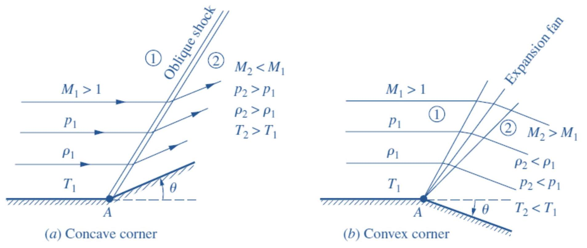

## Shockwave Interactions

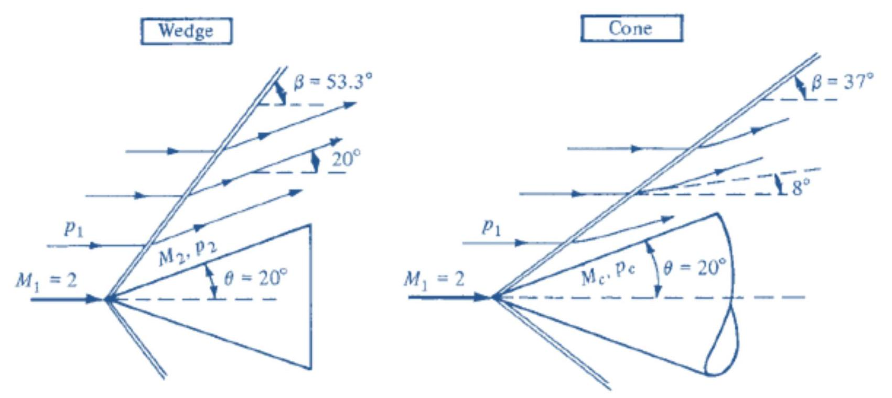

An infinitesimal disturbance in a multidimensional supersonic flow creates a Mach wave that makes an angle $\mu$ with respect to the upstream velocity. This angle is defined as the Mach angle and is given by

$$
\mu  = {\sin }^{-1}\frac{1}{M}
$$

S. Zahir

## Shockwave – Bow shocks

A curved bow shock wave is one of the instances in nature when you can observe all possible oblique shock solutions at once for a given freestream Mach number M1. This takes place between points a and e. To see this more clearly, consider the θ-β-M diagram in conjunction with, point a corresponds to the normal shock, and point e corresponds to the Mach wave. Slightly above the centerline, at point b, the shock is oblique but pertains to the strong shock-wave solution.

The flow is deflected slightly upward behind the shock at point b. As we move further along the shock, the wave angle becomes more oblique, and the flow deflection increases until we encounter point c. Point c on the bow shock corresponds to the maximum deflection angle .

Above point c, from c to e, all points on the shock correspond to the weak shock solution. Slightly above point c, at point c, the flow behind the shock becomes sonic. From a to c, the flow is subsonic behind the bow shock; from c to e, it is supersonic.

Hence, the flow field between the curved bow shock and the blunt body is a mixed region of both subsonic and supersonic flow. The dividing line between the subsonic and supersonic regions is called the sonic line, shown as the dashed line .

S. Zahir Hypersonic Flows MS FALL 2016

## Shock Standoff

The shape of the detached shock wave, its detachment distance $\delta$ , and the complete flow field between the shock and the body depend on M1 and the size and shape of the body. The solution of this flow field is not trivial. Indeed, the supersonic blunt-body problem was a major focus for supersonic aerodynamicists during the 1950s and 1960s, spurred by the need to understand the high-speed flow over blunt-nosed missiles and reentry bodies. Indeed, it was not until the late 1960s that truly sufficient numerical techniques became available for satisfactory engineering solutions of supersonic blunt-body flows.

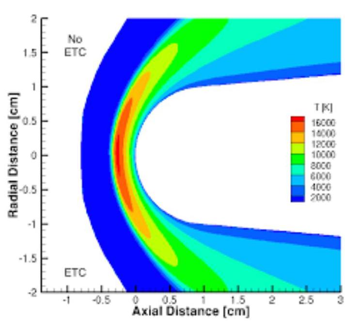

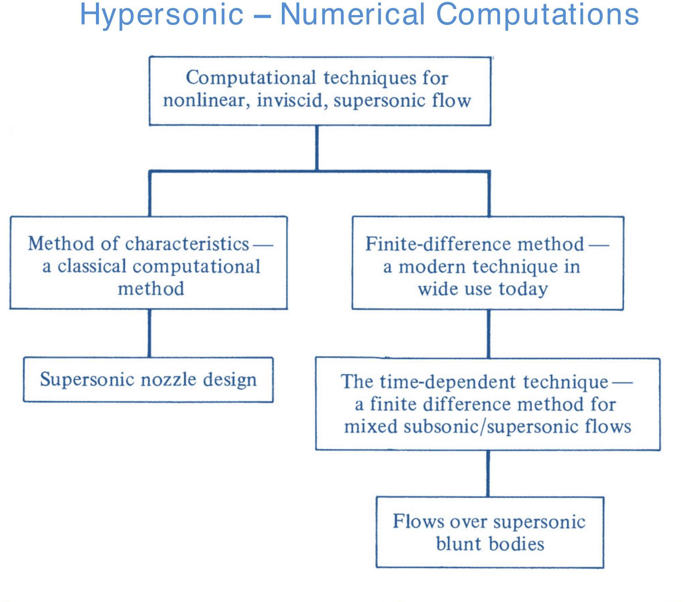

## Computations- Similarity Parameters

There are, generally speaking, three regimes in which hypersonic vehicles travel. They are classified as the continuum, continuum-transition and free-molecular regimes. Typically, the different regimes are distinguished by the Knudsen number, defined as

$$
\operatorname{Kn} = \frac{\lambda }{L} \propto  \frac{1}{\rho L},
$$

where the mean free path, $\lambda$ of a gas is defined as the average distance a particle travels between successive collisions; L is a characteristic length and $\rho$ is the density.

Flow regimes, from the continuum $\left( {\mathrm{{Kn}} < 0 : {01}}\right)$ , through the transitional to the free-molecular (Kn > 10) regime. The Boltzmann equation is valid for all regimes, whereas the Navier-Stokes equations are valid only for those regimes near the continuum limit. Extended hydrodynamic equations, also known as higher-order moment equations, can be used further into the transitional regime than the Navier-Stokes equations.

## Computations- Similarity Parameters

- Knudsen number, ${\mathrm{{Kn}}}_{\infty ,\mathrm{L}} = {\lambda }_{\infty }/\mathrm{L}$

- or equivalent Reynolds number, ${\mathrm{{Re}}}_{0,\mathrm{L}} = {\rho }_{\infty }{\mathrm{U}}_{\infty }\mathrm{L}/\mu \left( {\mathrm{T}}_{0}\right)  \sim  1/{\mathrm{{Kn}}}_{\infty ,\mathrm{L}}$

- Interaction parameter $\chi$ for pressure approximation:

$$
\chi  = \frac{{M}_{\infty }^{2}}{\sqrt{R{e}_{0, x}}}\sqrt{\frac{2}{\gamma  - 1}}
$$

- Viscous-interaction parameter $\mathrm{V}$ for skin-friction approximation:

$$
V = \frac{1}{\sqrt{R{e}_{0, x}}}\sqrt{\frac{2}{\gamma  - 1}}
$$

- Temperature factor, ${\mathrm{t}}_{\mathrm{w}} = {\mathrm{T}}_{\mathrm{w}}/{\mathrm{T}}_{0}$

- Specific heat ratio, $\gamma  = {\mathrm{c}}_{\mathrm{p}}/{\mathrm{c}}_{\mathrm{v}}$

- Viscosity parameter, $\mathrm{n} : \mu  \propto  {\mathrm{T}}^{\mathrm{n}}$

- Upstream Mach number, ${\mathrm{M}}_{\infty }$

- Hypersonic similarity parameter, ${\mathrm{K}}_{\infty } = {\mathrm{M}}_{\infty } \times  \sin \theta$

- Spin rate, $\mathrm{W} = {\Omega D}/2{\mathrm{U}}_{\infty }$

## Limitations of Mathematical Models

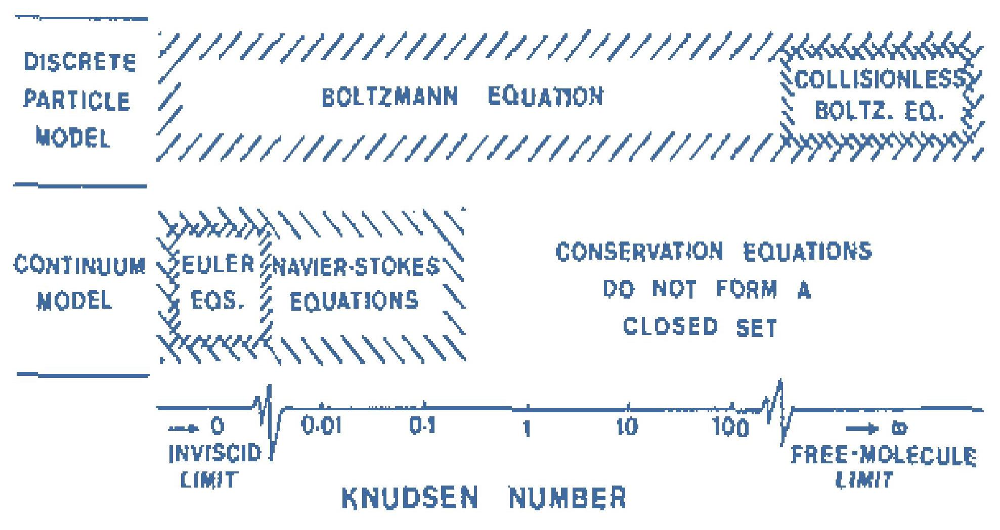

The validity of the conventional mathematical models as a function of the local Knudsen number. From J. N. Moss and G. A. Bird, AIAA Paper, No. 1984-0223.

Hypersonic Flows

Copyright @ 2016 by S.Zahir. Permission required for copying or display

News Break

THE Hybrid Air Vehicles HAV 304 Airlander 10 hybrid airship is seen in the air on its maiden flight from Cardington Airfield near Bedford on Aug 17. It can stay airborne for up to five days at a time if manned, and for over 2 weeks unmanned with a cruising speed of just under 150 km per hour and a payload capacity of up to 10,000 kg.—AFP

Hypersonic Flows

Copyright @ 2016 by S.Zahir. Permission required for copying or display

Highspeed - Propulsion

## Highspeed - Propulsion

Hypersonic design and optimization requires the analysis of the vehicle configuration in its entirety, but predicting "flow past entire configurations with wings, fins, flaps and propulsion system represents one of the major challenges."For this task, a variety of methods from simplified flow models to sophisticated, exact solutions have been established. However, methods such as computer-aided design (CAD) and computational fluid dynamics (CFD) "are best suited to the detailed design task and do not satisfy all requirements of preliminary vehicle design and multidisciplinary design optimisation." For preliminary design aeropropulsion is one of the major considerations.

## Highspeed - Propulsion

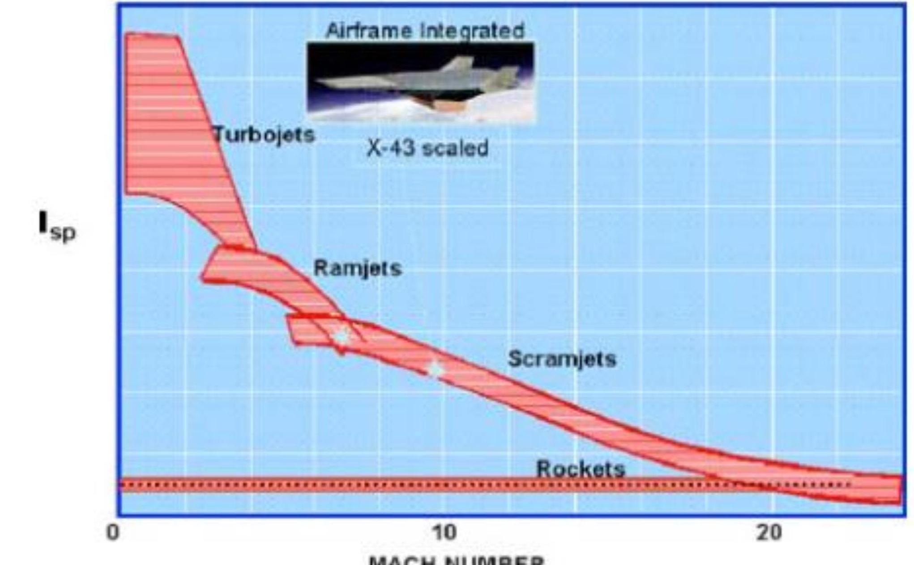

## Highspeed - Propulsion

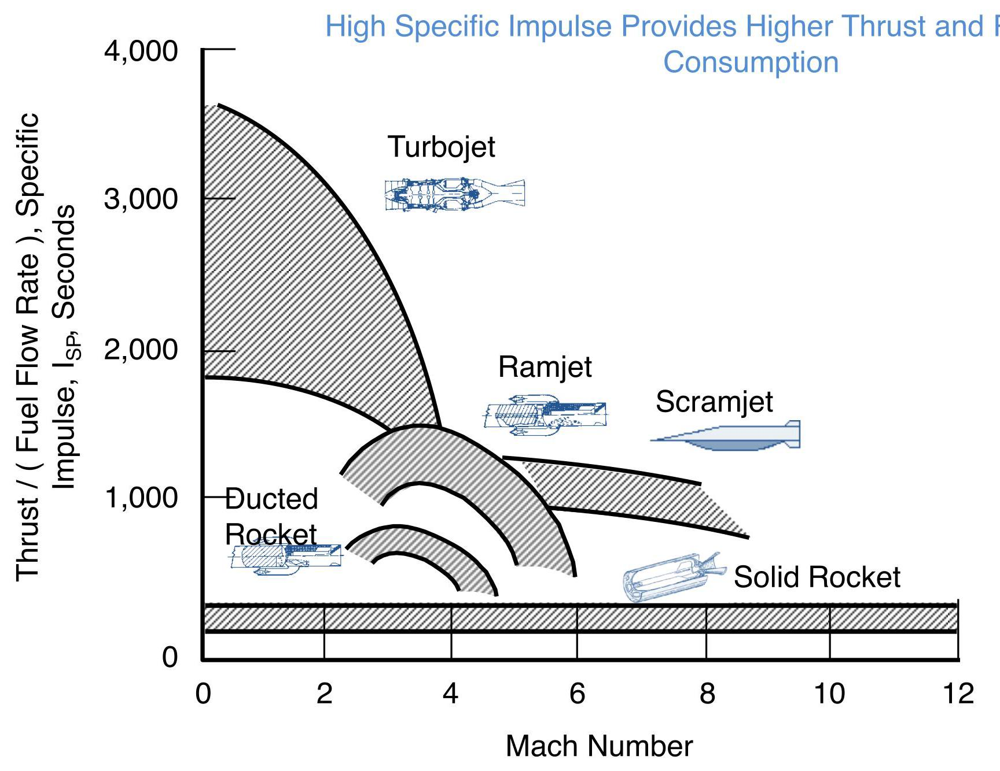

## Highspeed - Propulsion

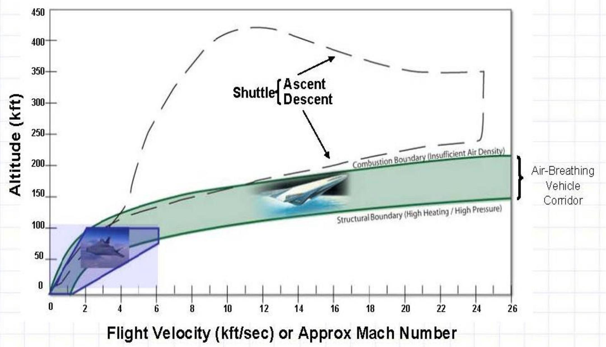

Highspeed - Propulsion

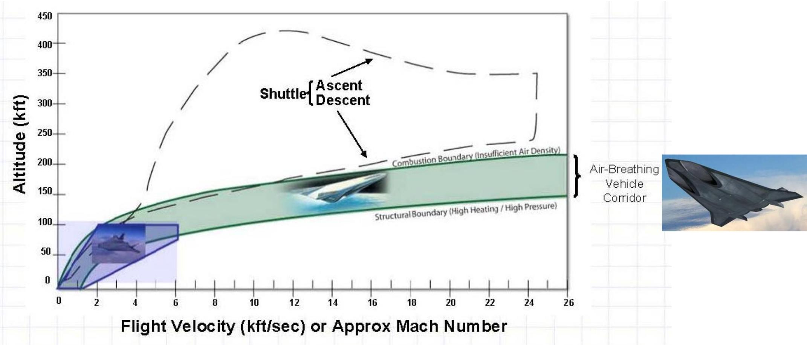

Anticipated flight envelope, altitude vs. flight Mach number, for commercial supersonic and hypersonic flight vehicle operations. The smaller closed envelope is for the Falcon HTV-3X ("Blackswift") hypersonic technology demonstrator under study by Lockheed Martin and DARPA. The larger unclosed envelope (corridor), below the Space Shuttle's ascent/descent flight performance limits, is for future hypersonic vehicles with capabilities superseding those of the TBCC-powered HTV-3X. The right diagram is an artist's conception of a possible HTV-3 variant.

## Highspeed Interaction Parameters - Reentry

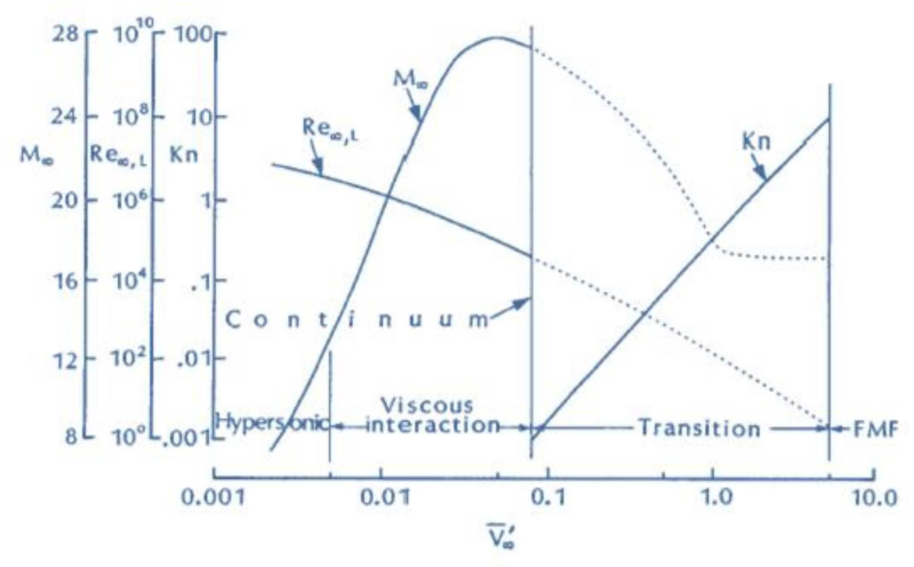

## Highspeed Air Modelling - Reentry

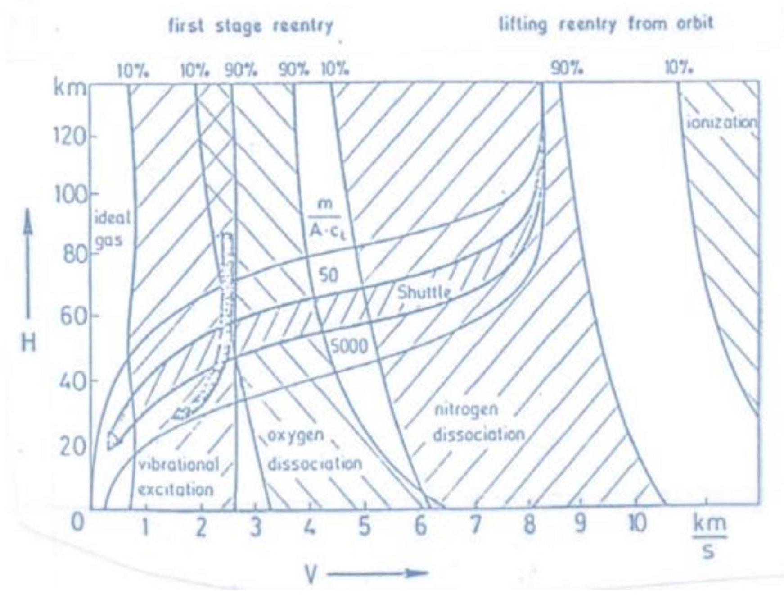

S. Zahir Hypersonic Flows

Copyright @ 2016 by S.Zahir. Permission required for copying or display

## Highspeed Air chemistry - Reentry

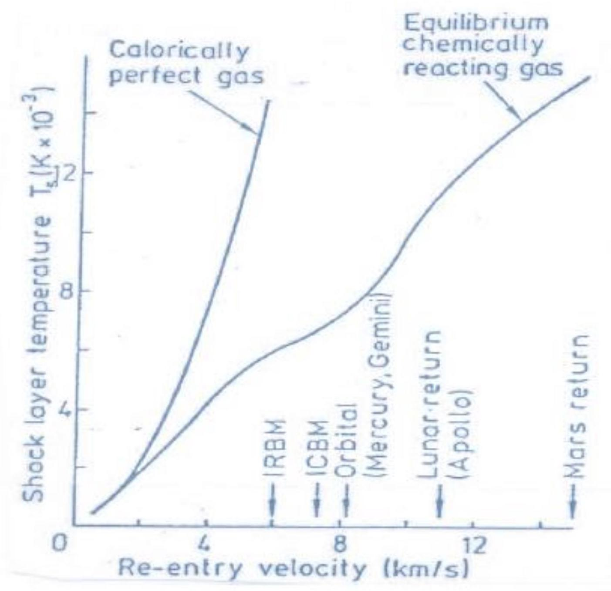

Hypersonic Flows

Copyright @ 2016 by S.Zahir. Permission required for copying or display

## Vehicle Design Phases

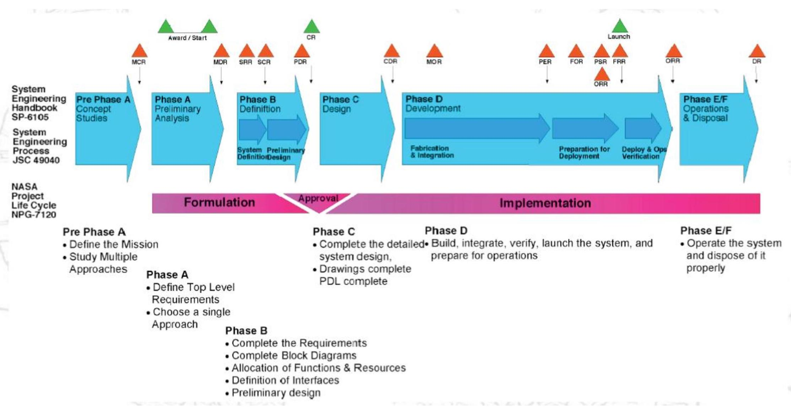

## Hypersonic Flows

## Vehicle Design Phases

## Confirmation Review

- Do the Mission Design, Spacecraft and Instrument Design, as presented at PDR reflect a PDR level design that meets science requirements? Award / Start CR

MCR MDR SRR SCR PDR

-Are Management processes sufficient to develop and System

Engineering Pre Phase A Phase A Phase B

Handbook Concept Preliminary Definition

SP-6105 Studies Analysis

System

Engineering

Process System Preliminary

JSC 49040 Definition Design

NASA

Phase B

- Refine Concept, Consistent Req, Design, Ops Concept

Choose a single Project Execution Cost and Schedule

"Design the Right System" System Definition:

- Complete the Requirements to Subsystem Level

- Identify Requirements flow between and across subsystems

- SRR: Review Requirements as baseline for final Concept

- MCR: Review Overall Approaches as baseline for Phase A

- Define Top Level Requirements, Mission Success & Minimum Mission

- SCR: Review Design & Ops Concept Preliminary Design:

- Allocation of Functions & Resources

- Complete Block Diagrams

- MDR: Review baseline for Phase B - Requirements flow to Box Level

- Definition of Interfaces to at least Subsystem

- Complete a Preliminary design

- PDR: Review Reqs, Design, Ops as Baseline for Detailed Design

## Hypersonic Flows

## Lectures, Labs, Quize & Exam

## LECTURES

Lecture notes will be in pdf format

Soft copy would be available

Students can bring anything they are comfortable with for taking the class notes

LABS

Labs possibly be conducted in the course of lectures

Students can bring Laptops along with MATLAB installed

EXAMS

There will be Assignments and Quizzes during lectures with known weightage.

Absentees in Quizzes will be marked ZERO.

All students shall submit assignments as a hard copy

Mid Term and End Term Exams as per IST's policy.

S. Zahir Hypersonic Flows MS FALL 2016

Copyright @ 2016 by S.Zahir. Permission required for copying or display

## Projects

The Project has a maximum weightage of about 40%

- The projects are proposed to be done in a team of 3 to 4 students and be incorporated into the course with a final presentation and a final report for grading.

- 3 to 4 students can do one project combined

(each student should present his/ her part of the project in the final presentation)

Some References

S. Zahir

## Highspeed Flows-References

1. G A S D Y N A M I C S; James E. A. John, Ph.D.;President Kettering University Flint, Michigan, Theo G. Keith, Jr., Ph.D.;Distinguished University Professor

Department of Mechanical, Industrial, and Manufacturing Engineering

The University of Toledo, Toledo, Ohio;T H I R D E D I T I O N, 2006 by Pearson Education, Inc.

2. G.G.Cherni: Introduction to Hypersonic Flow, Academic Press, New York,1961.

3. H.W. Dorrance: Viscous Hypersonic Flow, McGraw-Hill Company, New York 1962.

4. R.W. Truitt: Hypersonic Aerodynamics, the Ronald Press Company, New York, 1962.

## Highspeed Aerodynamics-References

S. Zahir Hypersonic Flows

Copyright @ 2016 by S.Zahir. Permission required for copying or display

## Reference Material

1. Pitt-Ford, C. W., and Babinsky, H. "Micro-Ramp Control for Oblique Shock Wave Boundary Layer Interactions," 2007.

2. Dupont, P., Piponniau, S., Sidorenko, A., and Debive, J. F. "Investigation by Particle Image Velocimetry Measurements of Oblique Shock Reflection with Separation," AIAA Journal Vol. 46, No. 6, 2008, pp. 1365-1370. doi: 10.2514/1.30154

3. Wu, P. P., and Miles, R. B. "Megahertz Visualzation of Compression-Corner Shock Structures," AIAA Journal Vol. 39, No. 8, 2001, pp. 1542-1547.

4. Panaras, A. "Review of the Physics of Swept-Shock/Boundary Layer Interactions," Progress in Aerospace Sciences Vol. 32, 1996, pp. 173-244.

5. Schmisseur, J. D. "An Experimental Study of Fluctuating wall pressures in a highly swept, sharp fininduced mach 5 shock wave / turbulent boundary layer interaction." Wright Patterson, 1993, p. 150.

6. Lu, F. "Upstream influence scaling of Fin-Generated Shock Wave Boundary Layer Interactions," 28th Aerospace Sciences Meeting. AIAA, Reno, NV, 1990.

7. Lu, F., and Settles, G. S. "Color surface-flow visualization of fin-generated shock wave boundary layer interactions," Experiments in Fluids Vol. 8, 1990, p. 3.

8. Handa, T., Masuda, M., and Matsuo, K. "ThreeDimensional Structure of Normal Shock WaveTurbulent Boundary Layer Interaction in a Rectangular Duct by a Laser-Induced Fluorescence Method," Engineering Sciences Reports Vol. 24, No. 2, 2002, pp. 179-185. doi: 10.1007/s001930050092

9. Doerffer, P. "An experimental investigation of the Mach number effect upon a normal shock wave — Tubulent boundary layer interaction on a curved wall," Acta Mechanica Vol. 76, No. 1, 1989, pp. 35-51. doi: 10.1007/bf01175795

10. Doerffer, P., and Dallmann, U. "Separation Structures Produced by a Normal Shock-Wave Turbulent

Boundary-Layer Interaction in a Narrow Wind Tunnel," 19th Fluid Dynamics, Plasma Dynamics and Lasers Conference. AIAA, Honolulu, Ha, 1987

## Summary

- Recap of keywords

- Gasdynamics, Highspeed Flows, Hypersonic Flows

- Reading assignment

Bertin JJ. 1994. Hypersonic Aerothermodynamics. Washington, DC: AIAA

Chapter-1

Flow regimes and thermochemical phenomena in the stagnation region of a 30.5 cm radius sphere flying in air.

R. N. Gupta et al. NASA-RP-1232, 1990.

S. Zahir Hypersonic Flows MS FALL 2016

Copyright @ 2016 by S.Zahir. Permission required for copying or display