李文丰

西北工业大学

w.li@nwpu.edu.cn

2022年10月30日

前情提要-相似参数

比热比: $\gamma  = \frac{{c}_{p}}{{c}_{v}}$

马赫数:

${M}_{\infty } = \frac{{V}_{\infty }}{{a}_{\infty }} \; M{a}_{\infty } \propto  \frac{\text{ 流动动能 }}{\text{ 流动内能 }}$

雷诺数:

$\operatorname{Re} = \frac{{\rho }_{\infty }{V}_{\infty }c}{{\mu }_{\infty }} \; R{\mathrm{e}}_{\infty } \propto  \frac{\text{ 惯性力 }}{\text{ 黏性力 }}$

普朗特数: ${Pr} = \frac{\mu {c}_{p}}{k} \; P{r}_{\infty } \propto  \frac{\text{ 摩擦耗散 }}{\text{ 热传导 }}$

## 前情提要-自相似解

变换方程:

$$
{\left( C{f}^{\prime \prime }\right) }^{\prime } + f{f}^{\prime \prime } = \frac{2\xi }{{u}_{e}}\left\lbrack  {{\left( {f}^{\prime }\right) }^{2} - \frac{{\rho }_{e}}{\rho }}\right\rbrack  \frac{\mathrm{d}{u}_{e}}{\mathrm{\;d}\xi } + {2\xi }\left( {{f}^{\prime }\frac{\partial {f}^{\prime }}{\partial \xi } - \frac{\partial f}{\partial \xi }{f}^{\prime \prime }}\right) \tag{6.55}
$$

$$
\frac{\partial p}{\partial \eta } = 0 \tag{6.56}
$$

$$
{\left( \frac{C}{\Pr }{g}^{\prime }\right) }^{\prime } + f{g}^{\prime } = {2\xi }\left\lbrack  {{f}^{\prime }\frac{\partial g}{\partial \xi } + \frac{{f}^{\prime }g}{{h}_{e}}\frac{\partial {h}_{e}}{\partial \xi } - {g}^{\prime }\frac{\partial f}{\partial \xi } + \frac{{\rho }_{e}{u}_{e}}{\rho {h}_{e}}{f}^{\prime }\frac{\mathrm{d}{u}_{e}}{\mathrm{\;d}\xi }}\right\rbrack   - C\frac{{u}_{e}^{2}}{{h}_{e}}{\left( {f}^{\prime \prime }\right) }^{2} \tag{6.58}
$$

当地表面摩擦系数为:

$$
{c}_{f} = \frac{2{\mu }_{w}{\rho }_{w}}{{\rho }_{e}\sqrt{2\xi }}{f}^{\prime \prime }\left( {\xi ,0}\right)
$$

当地传热系数为:

$$
{C}_{H} = \frac{1}{\sqrt{2\xi }}\frac{{k}_{w}}{{c}_{{p}_{w}}}\frac{{\rho }_{w}}{{\rho }_{e}}\frac{{h}_{e}}{\left( {h}_{\mathrm{{aw}}} - {h}_{w}\right) }{g}^{\prime }\left( {\xi ,0}\right)
$$

前情提要-自相似解

平板:

$$
{c}_{f}\left( \text{ compressible }\right)  = \frac{F\left( {{M}_{e},\Pr ,\gamma ,{T}_{w}/{T}_{e}}\right) }{\sqrt{R{e}_{x}}}
$$

$$
{C}_{H}\left( \text{ compressible }\right)  = \frac{G\left( {{M}_{e},{Pr},\gamma ,{T}_{w}/{T}_{e}}\right) }{\sqrt{R{e}_{x}}}
$$

驻点:

${q}_{w} = {0.57P}{r}^{-{0.6}}{\left( {\rho }_{e}{\mu }_{e}\right) }^{1/2}\sqrt{\frac{\mathrm{d}{u}_{e}}{\mathrm{\;d}x}}\left( {{h}_{\mathrm{{aw}}} - {h}_{w}}\right) \;\left( \text{ 圆 }\right)$ (圆柱)

${q}_{w} = {0.763}\mathop{\Pr }\limits^{{-{0.6}}}{\left( {\rho }_{e}{\mu }_{e}\right) }^{1/2}\sqrt{\frac{\mathrm{d}{u}_{e}}{\mathrm{\;d}x}}\left( {{h}_{\mathrm{{aw}}} - {h}_{w}}\right) \;$ (圆球)

$$
{q}_{w} \propto  \frac{1}{\sqrt{R}}
$$

相似解方法: 是一种采用自相似解思想的一种近似方法。

差分-微分方法: 本质上是对一般边界层方程的准确解, 方法核心为将方程中的导数项由差商代替。

有限差分方法:

通过将给定的网格点处的各偏导数用有限差分值代替构建该点的偏微分控制方程。

方法一:基于参照边界层动量厚度 $\theta$ 的转捩雷诺数。 马赫数:

环境:

单位雷诺数:

影响因素:

转捩预测:

迎角:

方法二: 基于锥体气动数据的预估关联。 头部钝度:

壁面温度:

前情提要-湍流边界层与参考温度方法

Baldwin - Lomax湍流模型:

内层: ${\left( {\mu }_{T}\right) }_{\text{ inner }} = \rho {l}^{2}\left| \omega \right|$

外层: ${\left( {\mu }_{T}\right) }_{\text{ outer }} = {\rho K}{C}_{\mathrm{{cp}}}{F}_{\text{ wake }}{F}_{\text{ Kleb }}$

参考温度:

可压缩层流:

${c}_{f}^{ * } = \frac{0.664}{\sqrt{R{e}_{c}^{ * }}} \; {C}_{f}^{ * } = \frac{1.328}{\sqrt{R{e}_{c}^{ * }}} \; {C}_{H}^{ * } = \frac{0.332}{\sqrt{R{e}_{x}^{ * }}}{\left( P{r}^{ * }\right) }^{-2/3}$

可压缩湍流:

${c}_{f} = \frac{0.0592}{{\left( R{e}_{x}\right) }^{0.2}} \; {C}_{H} = \frac{{c}_{f}}{2s}$

## 目录

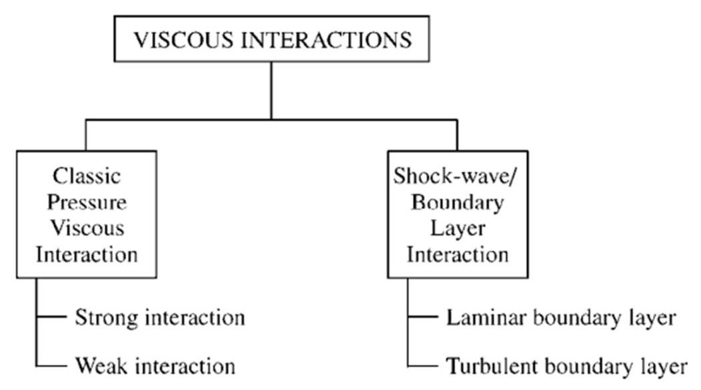

类 经典压力黏性干扰

Classic Pressure Viscous Interaction

● 激波/边界层干扰

Shock-wave/Boundary Layer Interaction

经典压力粘性干扰 (Classic Pressure Viscous Interaction)

## 经典压力黏性干扰

## 什么是黏性干扰？

在外部无黏流动和边界层之间, 典型的高超声速黏性干扰是由在高超声速下出现的非常大的边界层厚度导致的。

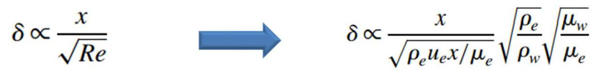

假设壁面压力与主流压力都为同一个常数且在整个边界层内都成立, 根据状态方

程可得:

$$
\frac{{\rho }_{e}}{{\rho }_{w}} = \frac{{p}_{e}}{{p}_{w}}\frac{{T}_{w}}{{T}_{e}} = \frac{{T}_{w}}{{T}_{e}}
$$

假设 $\mu$ 对 $T$ 是线性依赖关系: $\frac{{\mu }_{w}}{{\mu }_{e}} = \frac{{T}_{w}}{{T}_{e}}$

$$
\delta  \propto  \frac{x}{\sqrt{\operatorname{Re}}}\left( \frac{{T}_{w}}{{T}_{e}}\right)
$$

$$
\frac{{T}_{w}}{{T}_{e}} = \frac{{T}_{\mathrm{{aw}}}}{{T}_{e}} = \frac{{T}_{0}}{{T}_{e}} = 1 + \frac{\gamma  - 1}{2}{M}_{e}^{2}
$$

$\left| \frac{\delta }{x}\right|  \propto  \frac{{M}_{e}^{2}}{\sqrt{Re}}$

经典压力黏性干扰

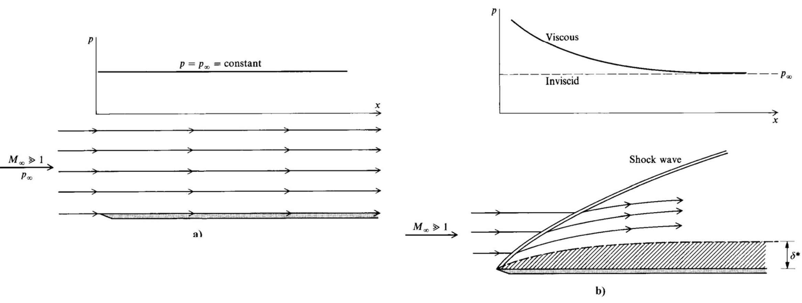

Fig. 7.2 Illustration of pressure distributions over a flat plate: a) inviscid flow and b) viscous flow.

## 经典压力黏性干扰-强黏性干扰与弱黏性干扰

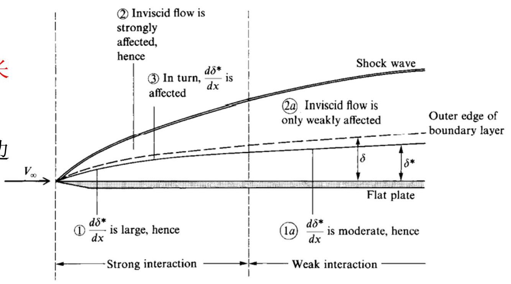

Fig. 7.3 Illustration of strong and weak viscous interactions.

强黏性干扰:

- 前缘区域边界层的位移厚度增长率比较大。

- 无黏流受到了厚度迅速增长的边界层的强烈干扰。

- 外部无黏流会反作用于边界层, 影响其厚度增长与特性。

弱黏性干扰:- 边界层增厚速度缓慢。

- 外部无黏流只受微弱的影响。

- 无黏流反作用于边界层的影响可以忽略。

经典压力黏性干扰-强黏性干扰与弱黏性干扰

主导层流黏性干扰的相似参数:

$$
\overline{\chi } = \frac{{M}_{\infty }^{3}}{\sqrt{Re}}\sqrt{C} \tag{7.10}
$$

其中:

$$
C = \frac{{\rho }_{w}{\mu }_{w}}{{\rho }_{e}{\mu }_{e}}
$$

压力比与位移厚度的关系推导:

${\delta }^{ * } \propto  \frac{x}{\sqrt{Re}}$

$$
{\delta }^{ * } \propto  x\sqrt{\frac{{\mu }^{ * }}{{\rho }^{ * }{V}_{\infty }x}} = x\sqrt{\frac{{\mu }_{\infty }}{{\rho }_{\infty }{V}_{\infty }x}}\sqrt{\frac{{\rho }_{\infty }}{{\rho }^{ * }}\frac{{\mu }^{ * }}{{\mu }_{\infty }}} = \frac{x}{\sqrt{Re}}\sqrt{\frac{{\rho }_{\infty }}{{\rho }^{ * }}\frac{{\mu }^{ * }}{{\mu }_{\infty }}}
$$

$$
{\delta }^{ * } \propto  \frac{x}{\sqrt{Re}}{M}_{\infty }^{2}\sqrt{\frac{C}{{p}_{e}/{p}_{\infty }}}
$$

经典压力黏性干扰-强黏性干扰与弱黏性干扰斜激波理论得到的压力比关系式:

$$
\frac{{p}_{2}}{{p}_{1}} = 1 + \frac{\gamma \left( {\gamma  + 1}\right) }{4}{K}^{2} + \gamma {K}^{2}\sqrt{{\left( \frac{\gamma  + 1}{4}\right) }^{2} + \frac{1}{{K}^{2}}} \tag{2.28}
$$

$$
K = {M}_{1}\theta
$$

采用第三章的切楔法可将上式写为:

$$
\frac{{p}_{e}}{{p}_{\infty }} = 1 + \frac{\gamma \left( {\gamma  + 1}\right) }{4}{K}^{2} + \gamma {K}^{2}\sqrt{{\left( \frac{\gamma  + 1}{4}\right) }^{2} + \frac{1}{{K}^{2}}} \tag{7.20}
$$

$$
K = {M}_{\infty }\left( {\mathrm{d}{\delta }^{ * }/\mathrm{d}x}\right)
$$

强相互干扰:

假设: $\;{K}^{2} \gg  1$

$$
\frac{{p}_{e}}{{p}_{x}} \approx  \frac{\gamma \left( {\gamma  + 1}\right) }{2}{K}^{2} = \frac{\gamma \left( {\gamma  + 1}\right) }{2}{M}_{\infty }^{2}{\left( \frac{\mathrm{d}{\delta }^{ * }}{\mathrm{\;d}x}\right) }^{2} \tag{7.21}
$$

${\delta }^{ * } \propto  {\left( \frac{C{\mu }_{\infty }}{{\rho }_{\infty }{V}_{\infty }}\right) }^{1/4}{M}_{\infty }^{1/2}{x}^{3/4} \; {\delta }^{ * } \propto  {x}^{3/4}$

$$
\frac{\mathrm{d}{\delta }^{ * }}{\mathrm{\;d}x} \propto  {\left( \frac{C{\mu }_{\infty }}{{\rho }_{\infty }{V}_{\infty }}\right) }^{1/4}{M}_{\infty }^{1/2}{x}^{-1/4}
$$

$$
\frac{\mathrm{d}{\delta }^{ * }}{\mathrm{\;d}x} \propto  {x}^{-1/4}
$$

$$
\frac{\mathrm{d}{\delta }^{ * }}{\mathrm{\;d}x} \propto  {\left( \frac{C}{Re}\right) }^{1/4}{M}_{\infty }^{1/2}\;
$$

$$
{K}^{2} = {M}_{\infty }^{2}{\left( \frac{\mathrm{d}{\delta }^{ * }}{\mathrm{\;d}x}\right) }^{2} \propto  \frac{{M}_{\infty }^{3}}{\sqrt{Re}}\sqrt{C} \equiv  \overline{\chi }
$$

$$
\frac{{p}_{e}}{{p}_{x}} \approx  \frac{\gamma \left( {\gamma  + 1}\right) }{2}{K}^{2} = \frac{\gamma \left( {\gamma  + 1}\right) }{2}{M}_{\infty }^{2}{\left( \frac{\mathrm{d}{\delta }^{ * }}{\mathrm{\;d}x}\right) }^{2}
$$

$$
\frac{{p}_{e}}{{p}_{\infty }} \propto  {x}^{-1/2}
$$

$$
\text{ 1 }\frac{{p}_{e}}{{p}_{\infty }} = 1 + {a}_{1}\overline{\chi }
$$

经典压力黏性干扰-强黏性干扰与弱黏性干扰

弱相互干扰:

$$
\frac{{p}_{e}}{{p}_{\infty }} = 1 + \frac{\gamma \left( {\gamma  + 1}\right) }{4}{K}^{2} + \gamma {K}^{2}\sqrt{{\left( \frac{\gamma  + 1}{4}\right) }^{2} + \frac{1}{{K}^{2}}}
$$

$$
\frac{{p}_{e}}{{p}_{\infty }} = 1 + {\gamma K} + \frac{\gamma \left( {\gamma  + 1}\right) }{4}{K}^{2}
$$

${\delta }^{ * } \propto  {x}^{1/2}$

$$
{\delta }^{ * } \propto  \frac{x}{\sqrt{Re}}{M}_{\infty }^{2}\sqrt{C}
$$

$\frac{\mathrm{d}{\delta }^{ * }}{\mathrm{\;d}x} \propto  {x}^{-1/2}$

$$
{r}_{0}\frac{{p}_{e}}{{p}_{\infty }} = 1 + {b}_{1}\overline{\chi } + {b}_{2}{\overline{\chi }}^{2}
$$

经典压力黏性干扰-应用

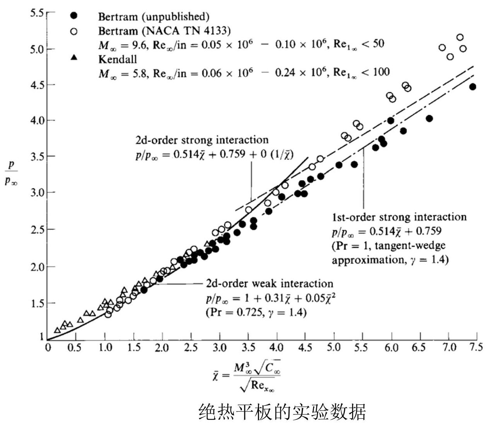

绝热平板:

强干扰: $\;\frac{p}{{p}_{\infty }} = 1 + {0.31}\overline{\chi } + {0.05}{\overline{\chi }}^{2}$

弱干扰: $\frac{p}{{p}_{\infty }} = {0.514}\overline{\chi } + {0.759}$

冷壁平板:

强干扰:

弱干扰:

$$
\frac{p}{{p}_{\infty }} = 1 + {0.078}\overline{\chi }
$$

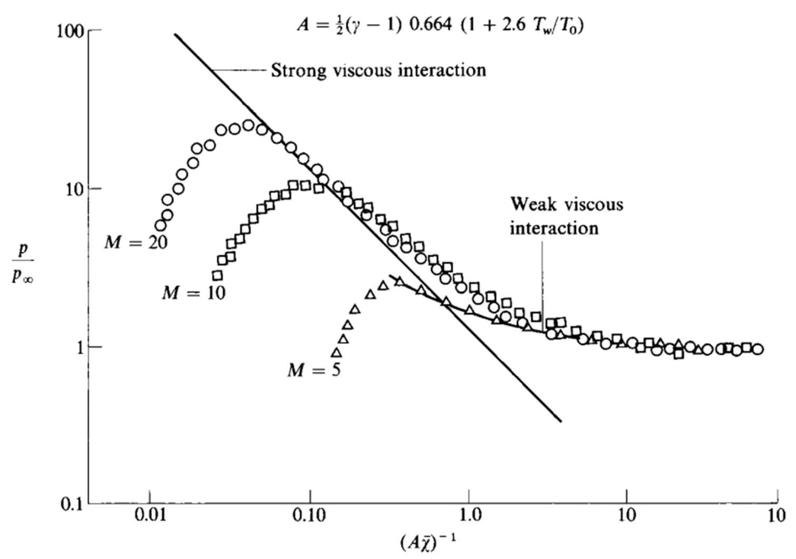

Fig. 7.6 Induced pressures on a flat plate (from [81]).

${C}_{p} = \frac{2}{\gamma {M}_{\infty }^{2}}\left( {\frac{p}{{p}_{\infty }} - 1}\right) \; p/{p}_{\infty } \gg  1$

$\frac{p}{{p}_{\infty }} \propto  \overline{\chi } = \frac{{M}_{\infty }^{3}}{\sqrt{Re}}\sqrt{C}$

${C}_{p} \approx  \frac{2}{\gamma {M}_{\infty }^{2}}\frac{p}{{p}_{\infty }} \; {C}_{p} \propto  \frac{{M}_{\infty }}{\sqrt{Re}}\sqrt{C} \equiv  \bar{V}$

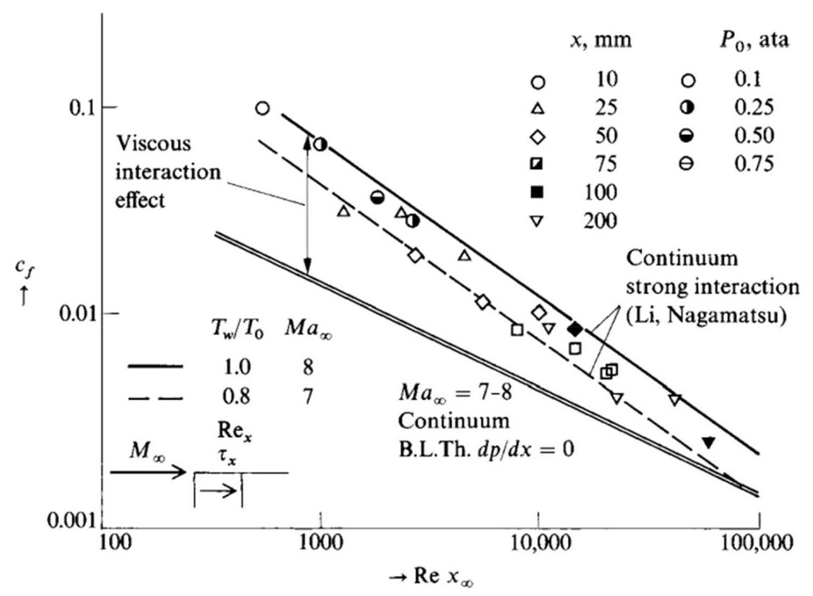

${C}_{L} = {f}_{1}\left( \bar{V}\right)$

${C}_{Dw} = {f}_{2}\left( \overline{V}\right)$

Fig. 7.7 Viscous interaction effect on skin friction (from [81]).

经典压力黏性干扰-其他黏性干扰结果

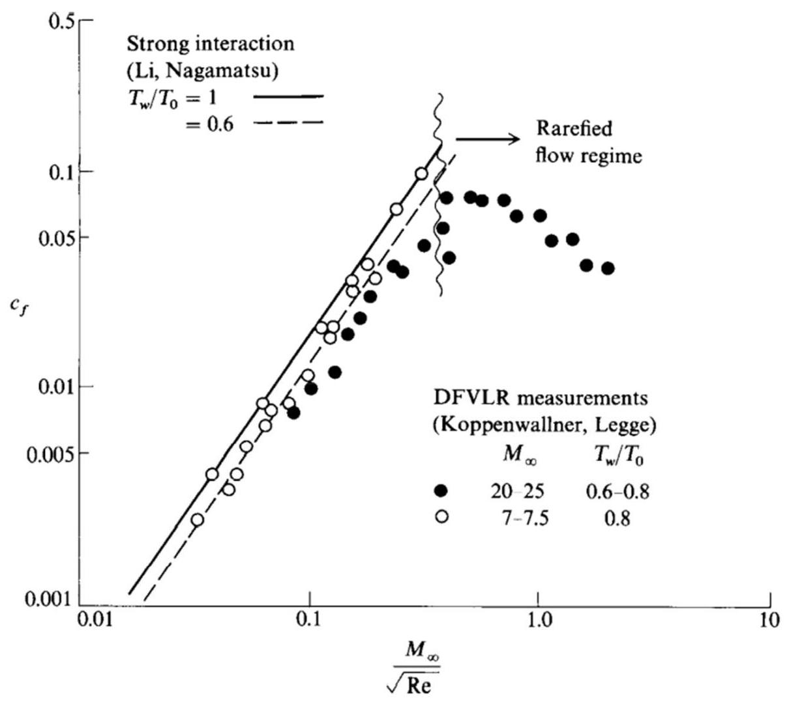

Fig. 7.8 Correlation of the viscous interaction effect on skin friction (from [81]).

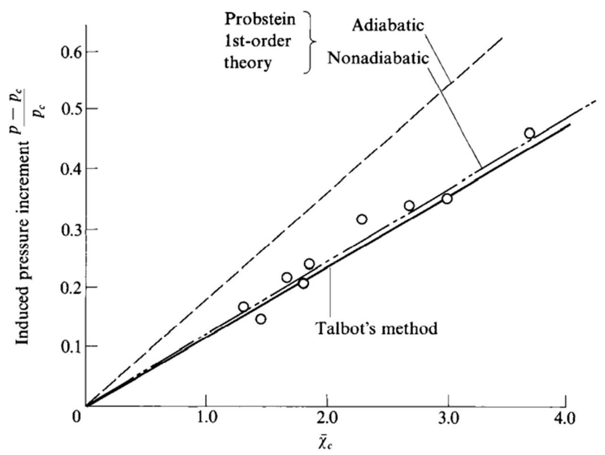

Fig. 7.9 Induced pressure increment vs the hypersonic interaction parameter (from [6]).

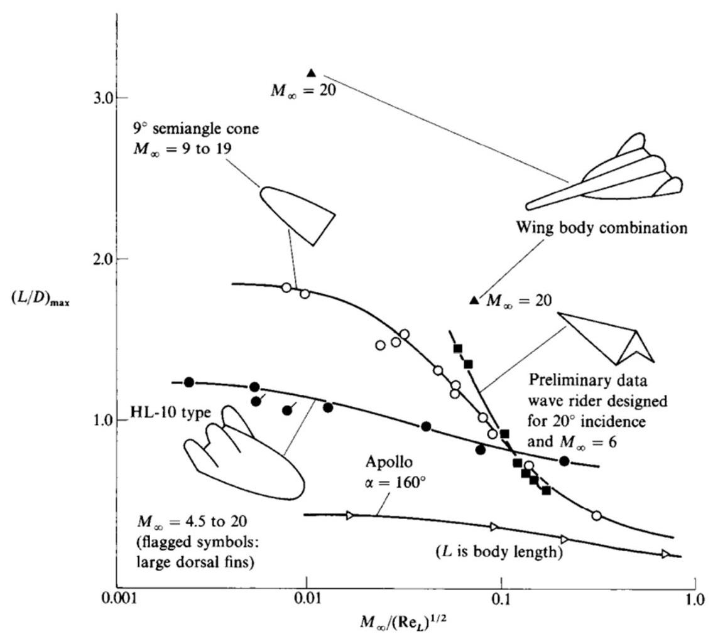

Fig. 7.10 Viscous effects on hypersonic maximum lift-to-drag ratio for five classes of vehicles correlated with the viscous interaction parameter (from Stollery [123]).

对力系数黏性干扰关系式的研究确定了一个改进黏性干扰参数:

$\frac{{T}^{\prime }}{{T}_{\infty }} = {0.468} + {0.532}\frac{{T}_{w}}{{T}_{\infty }} + {0.195}\left( \frac{\gamma  - 1}{2}\right) {M}_{\infty }^{2}$

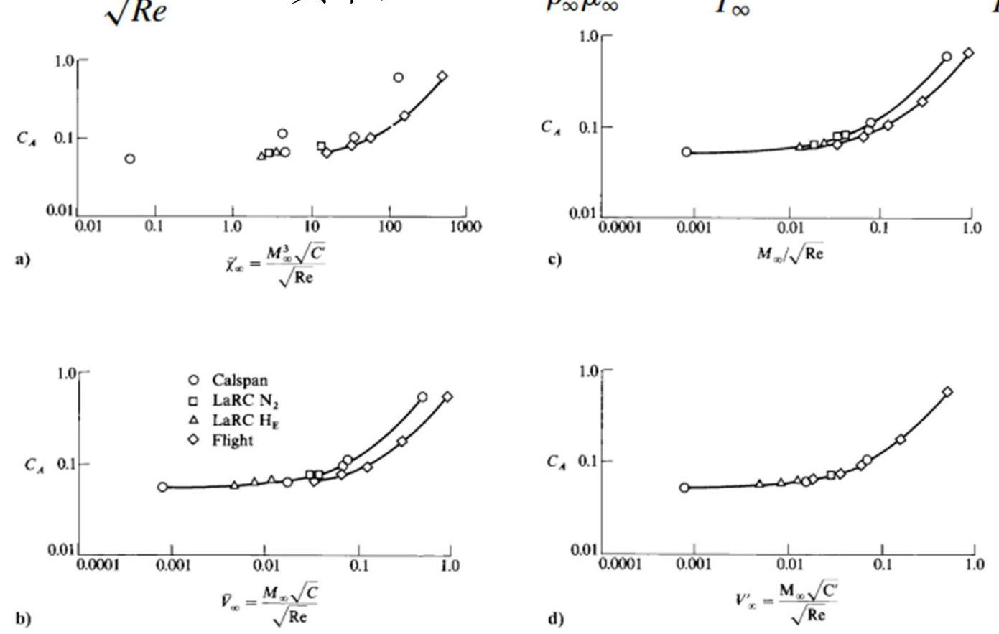

Fig. 7.11 Viscous interaction correlations of the axial-force coefficient on the space shuttle (from Wilhite et al. [126]).

# 激波/边界层干扰 (Shock-wave/Boundary Layer Interaction)

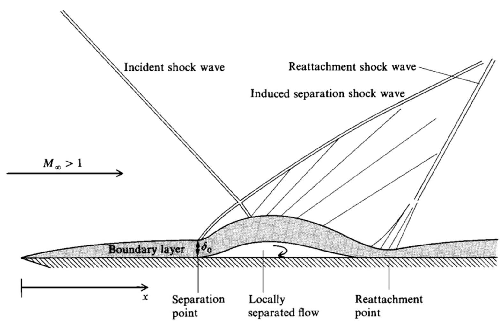

Fig. 7.14 Schematic of the shock-wave boundary-layer interaction.

## 激波边界层干扰

基于湍流边界层的二维平板激波-边界层干扰的试验数据和计算数据对比:

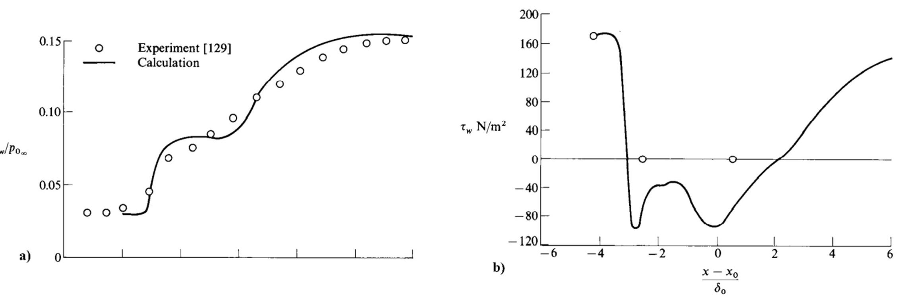

Fig. 7.15 Effects of shock-wave boundary-layer interaction on a) pressure distribution and b) shear stress, for Mach 3 flow over a flat plate. Turbulent flow (from [108]).

## 激波边界层干扰

轴对称的激波-边界层干扰

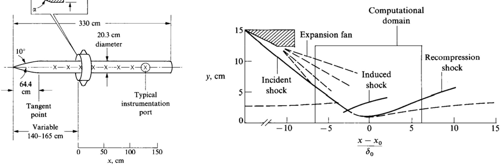

Fig. 7.16 Test model geometry and flowfield sketch for the shock-wave/ boundary-layer interaction studied by Marvin et al. [130].

## 激波边界层干扰

轴对称的激波-边界层干扰实验结果

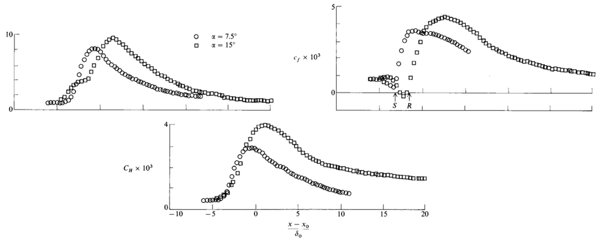

Fig. 7.17 Effects of shock-wave/boundary-layer interaction on pressure, skin friction, and heat-transfer distributions (from [130]).

## 激波边界层干扰

轴对称的激波-边界层干扰计算与实验结果对比

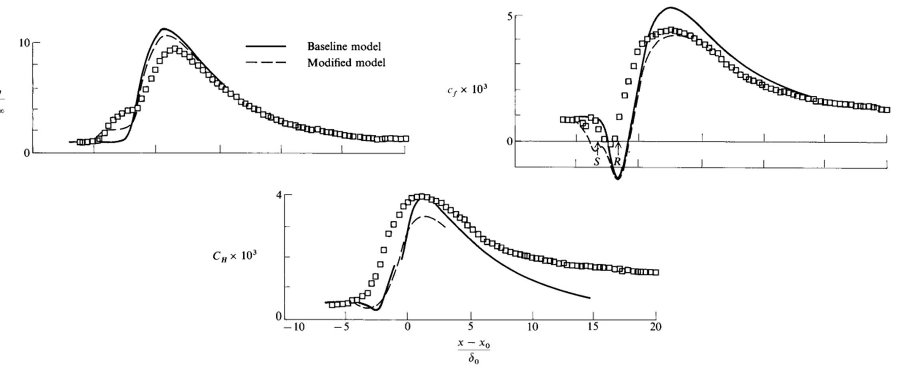

Fig. 7.18 Comparison between computations and experiment for the shock-wave/ boundary-layer interaction on a flat plate (from [130]).

## 激波边界层干扰

比较图7-17中的 $p/{p}_{\infty }$ 和 ${C}_{H}$ 的变化,热传导趋向于随着压力分布的变化而变化。这个可以用来预估平板的基本解。

层流:

$$
{C}_{H} \propto  \frac{1}{\sqrt{Re}} \propto  \frac{1}{\sqrt{{\rho }_{e}}}
$$

${q}_{w} \propto  \sqrt{{\rho }_{e}} \; {q}_{w} \propto  \sqrt{{p}_{e}}$

$$
{q}_{w} = {\rho }_{e}{u}_{e}\left( {{h}_{\mathrm{{aw}}} - {h}_{w}}\right) {C}_{H}
$$

湍流:

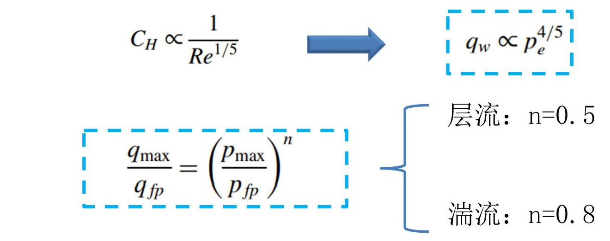

激波边界层干扰

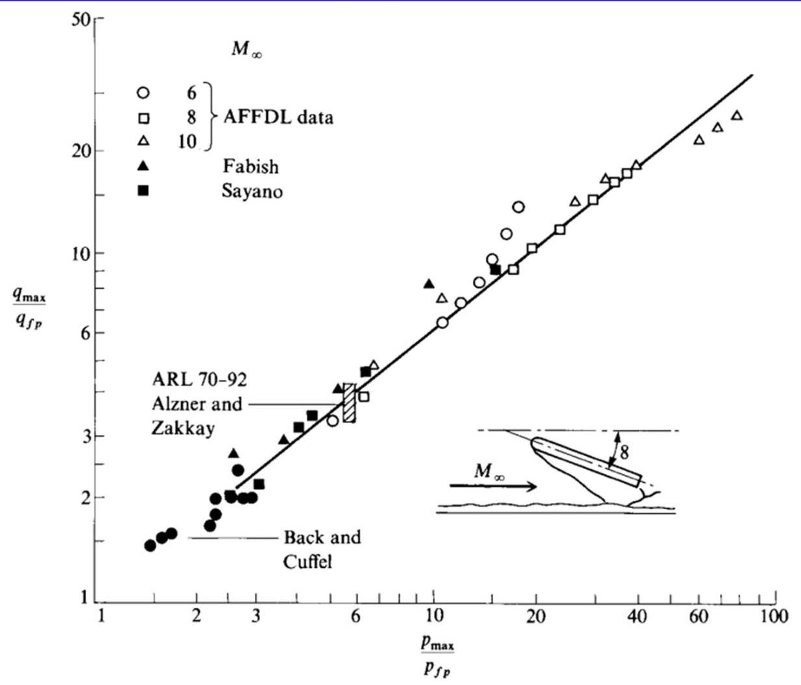

Fig. 7.19 Correlation of turbulent shock-wave/boundary-layer interaction on a flat plate, as given by Neumann [127].

## 激波边界层干扰

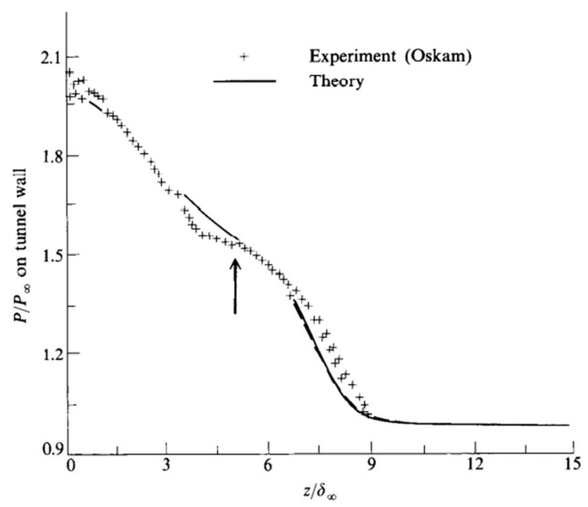

Fig. 7.21 Three-dimensional shock-wave/boundary-layer interaction results; comparison between computations and experiment for pressure distributions (from Knight [133]).

三维激波-边界层干扰

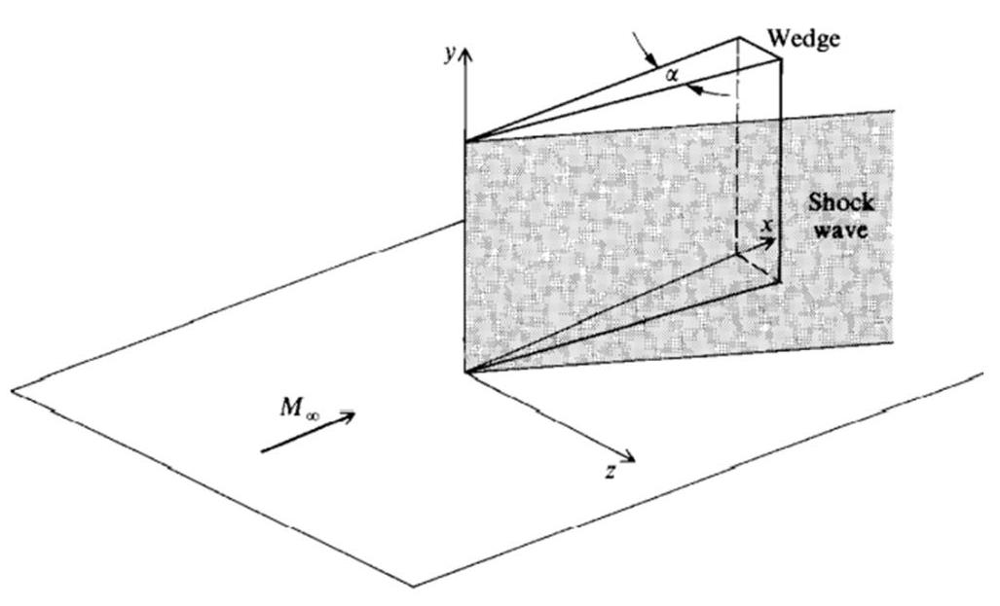

激波边界层干扰

三维激波-边界层干扰

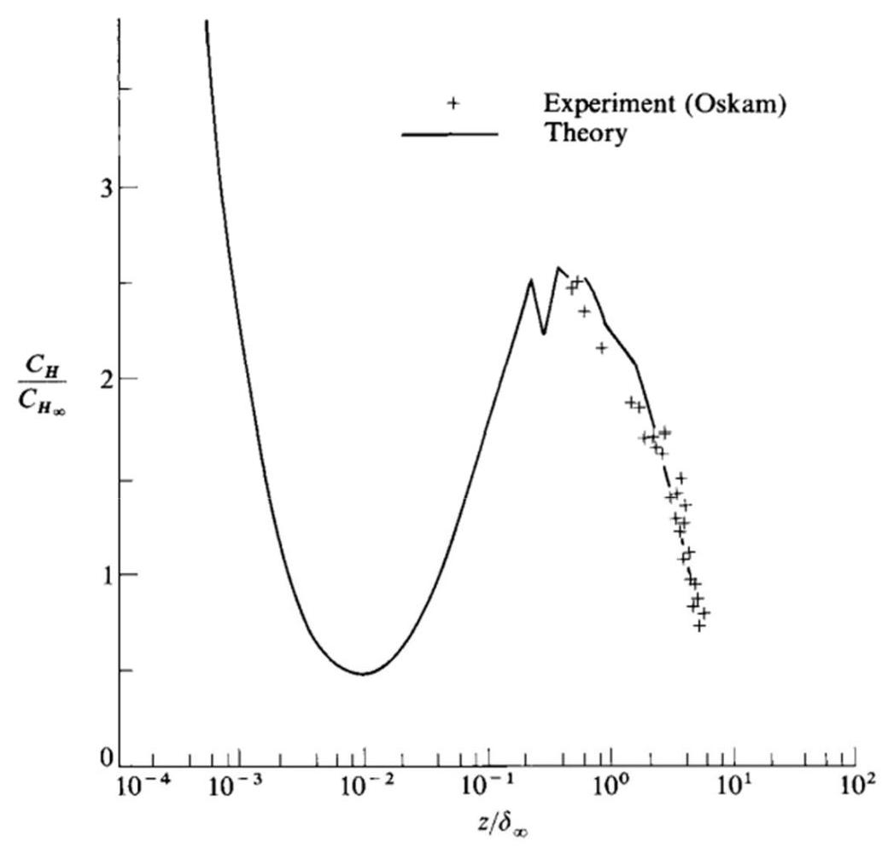

Fig. 7.22 Comparison between computations and experiment for heat-transfer distributions in a three-dimensional shock-wave/boundary-layer interaction (from [133]).