超声速无粘流动 (Hypersonic Inviscid Flow)

李文丰

西北工业大学

w.li@nwpu.edu.cn

2022年10月19日

## 前情提要-牛顿理论及其修正

压力系数:

$$
{C}_{p} = 2{\sin }^{2}\theta
$$

升力系数:

$$
{c}_{l} = 2{\sin }^{2}\alpha \cos \alpha
$$

阻力系数:

$$
{c}_{d} = 2{\sin }^{3}\alpha
$$

平板模型牛顿解的气动特性:升阻比随 $\alpha$ 减小而单调递增；低迎角下，升力系数随 $\alpha$ 时强非线性地变化。

莱斯特. 利斯修正公式: ${c}_{p,\max } = \frac{{p}_{{O}_{2}} - {p}_{\infty }}{\frac{1}{2}{\rho }_{\infty }{V}_{\infty }^{2}} = 2\frac{{p}_{{O}_{2}} - {p}_{\infty }}{\gamma {p}_{\infty }{M}_{\infty }^{2}} = \frac{2}{\gamma {M}_{\infty }^{2}}\left\lbrack  {\frac{{p}_{{o}_{2}}}{{p}_{\infty }} - 1}\right\rbrack$ 瑞利皮托管修正公式: ${c}_{p,\max } = \frac{2}{\gamma {M}_{\infty }^{2}}\left\{  {{\left\lbrack  \frac{{\left( \gamma  + 1\right) }^{2}{M}_{\infty }^{2}}{{4\gamma }{M}_{\infty }^{2} - 2\left( {\gamma  - 1}\right) }\right\rbrack  }^{\gamma /\left( {\gamma  - 1}\right) }\left\lbrack  \frac{1 - \gamma  + {2\gamma }{M}_{\infty }^{2}}{\gamma  + 1}\right\rbrack   - 1}\right\}$

## 前情提要-切楔/切锥与激波-膨胀波方法

切楔/切锥法: 物体表面的某个点的压力由具有半角度的等效楔形表面压力近似表达。需要局部表面角度小于给定自由流马赫数的激波脱离角， 且仅限于带有激波的尖头物体。

激波-膨胀波法:首先根据Prandtl-Meyer方程得到 $i$ 处的马赫数 ${M}_{i}$ 。

$$
{\Delta \theta } = {\theta }_{n} - {\theta }_{i}
$$

$$
= \left\lbrack  {\sqrt{\frac{\gamma  + 1}{\gamma  - 1}}{\tan }^{-1}\sqrt{\frac{\gamma  - 1}{\gamma  + 1}\left( {{M}_{n}^{2} - 1}\right) } - {\tan }^{-1}\sqrt{{M}_{n}^{2} - 1}}\right\rbrack
$$

$$
- \left\lbrack  {\sqrt{\frac{\gamma  + 1}{\gamma  - 1}}{\tan }^{-1}\sqrt{\frac{\gamma  - 1}{\gamma  + 1}\left( {{M}_{i}^{2} - 1}\right) } - {\tan }^{-1}\sqrt{{M}_{i}^{2} - 1}}\right\rbrack
$$

其次根据等熵关系求出其他位置的压强。

$$
\frac{{p}_{i}}{{p}_{n}} = {\left\lbrack  \frac{1 + \left( {\gamma  - 1}\right) /2{M}_{n}^{2}}{1 + \left( {\gamma  - 1}\right) /2{M}_{i}^{2}}\right\rbrack  }^{\gamma /\left( {\gamma  - 1}\right) }
$$

No knowledge can be certain, if it is not based upon mathematics or upon some other knowledge which is itself based upon the mathematical sciences. Instrumental, or mechanical, science is the noblest and, above all others, the most useful.

Leonardo da Vinci (1425-1519)

## 目录

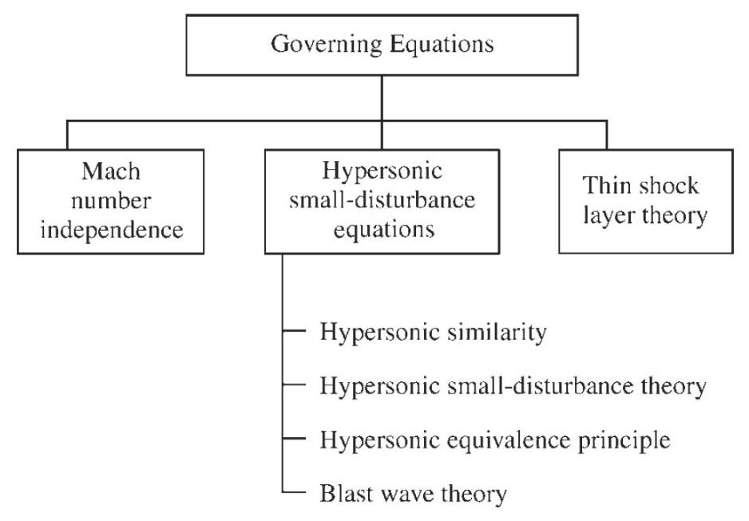

- 马赫数无关性

Mach Number Independence

- 高超声速小扰动方程

Hypersonic Small-Disturbance Equations

- 高超声速相似性

Hypersonic Similarity

- 高超声速小扰动理论的一些结果

Hypersonic Small-Disturbance Theory: Some Results

- 高超声速等效原理与激波理论

Hypersonic Equivalence Principle and Blast-Wave Theory

- 薄激波层理论

Thin Shock-Layer Theory

马赫数无关性 Mach Number Independence

$$
\frac{\partial \rho }{\partial t} + \frac{\partial {\rho u}}{\partial x} + \frac{\partial {\rho v}}{\partial y} + \frac{\partial {\rho w}}{\partial z} = 0
$$

$$
\frac{\partial {\rho u}}{\partial t} + {\rho u}\frac{\partial u}{\partial x} + {\rho v}\frac{\partial u}{\partial y} + {\rho w}\frac{\partial u}{\partial z} =  - \frac{\partial p}{\partial x}
$$

$$
\frac{\partial {\rho v}}{\partial t} + {\rho u}\frac{\partial v}{\partial x} + {\rho v}\frac{\partial v}{\partial y} + {\rho w}\frac{\partial v}{\partial z} =  - \frac{\partial p}{\partial y}
$$

$$
\frac{\partial {\rho w}}{\partial t} + {\rho u}\frac{\partial w}{\partial x} + {\rho v}\frac{\partial w}{\partial y} + {\rho w}\frac{\partial w}{\partial z} =  - \frac{\partial p}{\partial z}
$$

$$
\frac{\mathrm{D}s}{\mathrm{D}t} = \frac{\partial s}{\partial t} + u\frac{\partial s}{\partial x} + v\frac{\partial s}{\partial y} + w\frac{\partial s}{\partial z} = 0
$$

连续方程

动量方程

能量方程

## 欧拉方程

$$
\left\{  \begin{array}{l} \bar{x} = \frac{x}{l}\;\bar{y} = \frac{y}{l}\;\bar{z} = \frac{z}{l} \\  \bar{u} = \frac{u}{{V}_{\infty }}\;\bar{v} = \frac{v}{{V}_{\infty }}\;\bar{w} = \frac{w}{{V}_{\infty }} \\  \bar{t} = \frac{t}{l/{V}_{\infty }} \\  \bar{p} = \frac{p}{{\rho }_{\infty }{V}_{\infty }^{2}} \\  \overline{\rho } = \frac{\rho }{\rho {V}_{\infty }} \end{array}\right.
$$

$\left\{  \begin{array}{l} x = \bar{x}l \\  y = \bar{y}l \\  z = \bar{z}l \\  u = \bar{u}{V}_{\infty } \\  v = \bar{v}{V}_{\infty } \\  u = \bar{u}{V}_{\infty } \end{array}\right.$

$$
\frac{\partial \rho }{\partial t} + \frac{\partial {\rho u}}{\partial x} + \frac{\partial {\rho v}}{\partial y} + \frac{\partial {\rho w}}{\partial z} = 0
$$

$$
\downarrow
$$

$$
\frac{\partial \left( {\overline{\rho }{\rho }_{\infty }}\right) }{\partial \left( {\bar{t}l/{V}_{\infty }}\right) } + \frac{\partial \left( {\overline{\rho }{\rho }_{\infty }}\right) \left( {\bar{u}{V}_{\infty }}\right) }{\partial \left( {\bar{x}l}\right) } + \frac{\partial \left( {\overline{\rho }{\rho }_{\infty }}\right) \left( {\bar{v}{V}_{\infty }}\right) }{\partial \left( {\bar{y}l}\right) } + \frac{\partial \left( {\overline{\rho }{\rho }_{\infty }}\right) \left( {\bar{w}{V}_{\infty }}\right) }{\partial \left( {\bar{z}l}\right) } = 0
$$

$$
\downarrow
$$

$$
\frac{{\rho }_{\infty }{V}_{\infty }}{l}\left\lbrack  {\frac{\partial \overline{\rho }}{\partial \bar{t}} + \frac{\partial \overline{\rho }\bar{u}}{\partial \bar{x}} + \frac{\partial \overline{\rho }\bar{v}}{\partial \bar{y}} + \frac{\partial \overline{\rho }\bar{w}}{\partial \bar{z}}}\right\rbrack   = 0
$$

$$
\downarrow
$$

$$
\frac{\partial \overline{\rho }}{\partial \bar{t}} + \frac{\partial \overline{\rho }\bar{u}}{\partial \bar{x}} + \frac{\partial \overline{\rho }\bar{v}}{\partial \bar{y}} + \frac{\partial \overline{\rho }\bar{w}}{\partial \bar{z}} = 0
$$

## 无量纲化

欧拉方程的无量纲化形式:

$$
\begin{cases} \frac{\partial \overline{\rho }}{\partial \bar{t}} + \frac{\partial \overline{\rho }\bar{u}}{\partial \bar{x}} + \frac{\partial \overline{\rho }\bar{v}}{\partial \bar{y}} + \frac{\partial \overline{\rho }\bar{w}}{\partial \bar{z}} = 0 \\  \frac{\partial \overline{\rho }\bar{u}}{\partial \bar{t}} + \overline{\rho }\bar{u}\frac{\partial \bar{u}}{\partial \bar{x}} + \overline{\rho }\bar{v}\frac{\partial \bar{u}}{\partial \bar{y}} + \overline{\rho }\bar{w}\frac{\partial \bar{u}}{\partial \bar{z}} =  - \frac{\partial \bar{p}}{\partial \bar{x}} \\  \frac{\partial \overline{\rho }\bar{v}}{\partial \bar{t}} + \overline{\rho }\bar{u}\frac{\partial \bar{v}}{\partial \bar{x}} + \overline{\rho }\bar{w}\frac{\partial \bar{v}}{\partial \bar{y}} + \overline{\rho }\bar{w}\frac{\partial \bar{v}}{\partial \bar{x}} + \overline{\rho }\bar{w}\frac{\partial \bar{w}}{\partial \bar{z}} =  - \frac{\partial \bar{p}}{\partial \bar{z}} \\  \frac{\partial \bar{p}}{\partial \bar{t}} + \overline{\rho }\bar{u}\frac{\partial \bar{u}}{\partial \bar{x}} + \overline{\rho }\frac{\partial \bar{w}}{\partial \bar{y}} + \overline{\rho }\bar{w}\frac{\partial \bar{v}}{\partial \bar{z}} =  - \frac{\partial \bar{p}}{\partial \bar{z}} \\  \frac{\partial \bar{s}}{\partial \bar{t}} + \frac{\partial \bar{p}}{\partial \bar{t}} + \frac{\partial \bar{p}}{\partial \bar{x}} + \frac{\partial \bar{p}}{\partial \bar{y}} + \frac{\partial \bar{p}}{\partial \bar{z}} = 0 \end{cases}
$$

## 无量纲化

## 关于控制方程的讨论

- Governing equations contains only three basic unit: time, mass and length;

- Thus we only need the least number of reference values to introduce the three basic unit;

- For example, $\left\lbrack  {{\rho }_{\text{ ref }},{p}_{\text{ ref }}, L}\right\rbrack$ can be used to derive all the other reference values:

- Reference velocity: ${V}_{\text{ ref }} = \sqrt{{p}_{\text{ ref }}/{\rho }_{\text{ ref }}}$

- Reference time: ${t}_{\text{ ref }} = L/{V}_{\text{ ref }}$

- Reference energy: ${E}_{\text{ ref }} = {V}_{\text{ ref }}^{2}$

- In this way, the form of dimensionless equations is the same as the original equations;

- If extra reference values are introduced, the final dimensionless equations may contain some dimensionless number, such as Re, Mach

无量纲化

定常、无粘流动的边界条件: 流动与物面相切

$$
u{n}_{x} + v{n}_{y} + w{n}_{z} = 0\;\text{ or }\;\mathbf{V} \cdot  \mathbf{n} = 0
$$

$$
\bar{u}{n}_{x} + \bar{v}{n}_{y} + \bar{w}{n}_{z} = 0
$$

无量纲化

斜激波关系式:

$$
\frac{{p}_{2}}{{p}_{\infty }} = 1 + \frac{2\gamma }{\gamma  + 1}\left( {{M}_{\infty }^{2}{\sin }^{2}\beta  - 1}\right)
$$

$$
\frac{{\rho }_{2}}{{\rho }_{\infty }} = \frac{\left( {\gamma  + 1}\right) {M}_{\infty }^{2}{\sin }^{2}\beta }{\left( {\gamma  - 1}\right) {M}_{\infty }^{2}{\sin }^{2}\beta  + 2}
$$

$$
\frac{{u}_{2}}{{u}_{\infty }} = 1 - \frac{2\left( {{M}_{\infty }^{2}{\sin }^{2}\beta  - 1}\right) }{\left( {\gamma  + 1}\right) {M}_{\infty }^{2}}
$$

$$
\frac{{v}_{2}}{{v}_{\infty }} = \frac{2\left( {{M}_{\infty }^{2}{\sin }^{2}\beta }\right) \cot \beta }{\left( {\gamma  + 1}\right) {M}_{\infty }^{2}}
$$

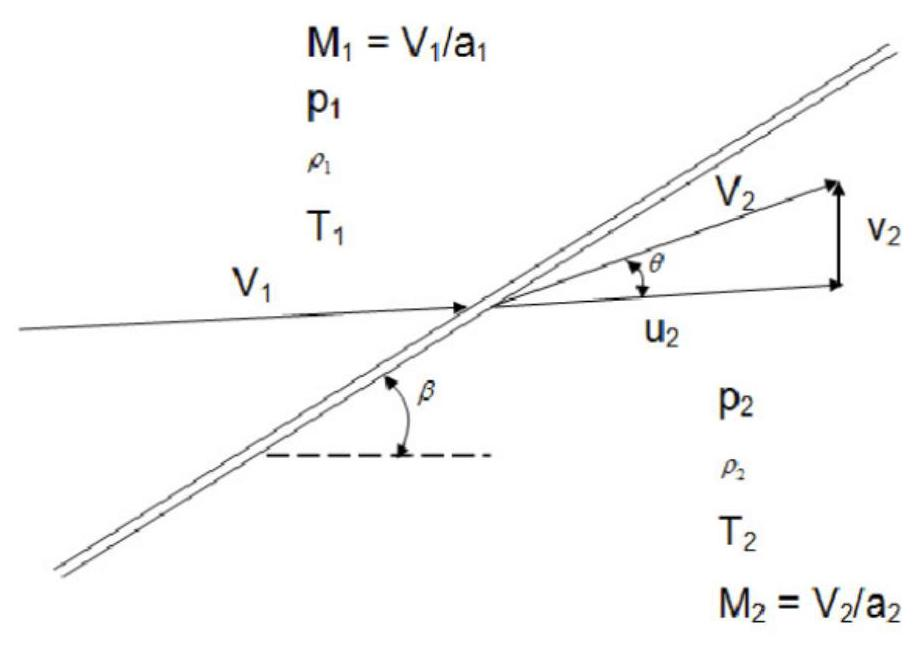

## 无量纲化

对压力进行无量纲:

$$
\bar{p} = \frac{p}{{\rho }_{\infty }{V}_{\infty }^{2}}\;\frac{{p}_{2}}{{p}_{\infty }} = \frac{{\bar{p}}_{2}{\rho }_{\infty }{V}_{\infty }^{2}}{{p}_{\infty }} = \frac{{\bar{p}}_{2}{V}_{\infty }^{2}}{R{T}_{\infty }}
$$

$$
= \frac{\gamma {\bar{p}}_{2}{V}_{\infty }^{2}}{{\gamma R}{T}_{\infty }} = \frac{\gamma {\bar{p}}_{2}{V}_{\infty }^{2}}{{a}_{\infty }^{2}}
$$

$$
= \gamma {\bar{p}}_{2}{M}_{\infty }^{2}
$$

$$
\frac{{p}_{2}}{{p}_{\infty }} = 1 + \frac{2\gamma }{\gamma  + 1}\left( {{M}_{\infty }^{2}{\sin }^{2}\beta  - 1}\right)  = \gamma {\bar{p}}_{2}{M}_{\infty }^{2}
$$

$$
{\bar{p}}_{2} = \frac{1}{\gamma {M}_{\infty }^{2}} + \frac{2}{\gamma  + 1}\left( {{\sin }^{2}\beta  - \frac{1}{{M}_{\infty }^{2}}}\right)
$$

## 无量纲化

对其他参数进行无量纲:

$$
\left\{  \begin{array}{l} {\bar{p}}_{2} = \frac{1}{\gamma {M}_{\infty }^{2}} + \frac{2}{\gamma  + 1}\left( {{\sin }^{2}\beta  - \frac{1}{{M}_{\infty }^{2}}}\right) \\  {\overline{\rho }}_{2} = \frac{\left( {\gamma  + 1}\right) {M}_{\infty }^{2}{\sin }^{2}\beta }{\left( {\gamma  - 1}\right) {M}_{\infty }^{2}{\sin }^{2}\beta  + 2} \\  {\bar{u}}_{2} = 1 - \frac{2\left( {{M}_{\infty }^{2}{\sin }^{2}\beta  - 1}\right) }{\left( {\gamma  + 1}\right) {M}_{\infty }^{2}} \\  {\bar{v}}_{2} = \frac{2\left( {{M}_{\infty }^{2}{\sin }^{2}\beta  - 1}\right) \cot \beta }{\left( {\gamma  + 1}\right) {M}_{\infty }^{2}} \end{array}\right.
$$

$$
\Rightarrow  \left\{  \begin{array}{l} {\bar{p}}_{2} \rightarrow  \frac{2{\sin }^{2}\beta }{\gamma  + 1} \\  {\overline{\rho }}_{2} \rightarrow  \frac{\gamma  + 1}{\gamma  - 1} \\  {\bar{u}}_{2} \rightarrow  1 - \frac{2{\sin }^{2}\beta }{\gamma  + 1} \\  {\bar{v}}_{2} \rightarrow  \frac{\sin {2\beta }}{\gamma  + 1} \end{array}\right.
$$

当马赫数趋近无穷大时, 在激波边界条件内存在马赫数无关性

- Dimensionless governing equation, No Mach number

- Wall boundary condition: No Mach number

- Shock wave boundary condition: No Mach number when ${M}_{\infty }$ is large enough

高超声速流场存在马赫数无关性

马赫数无关性

实例:

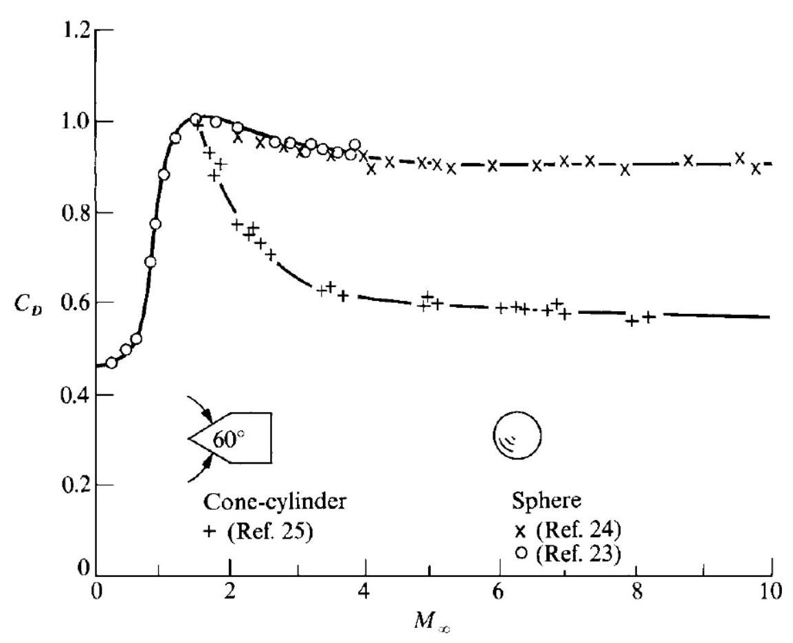

高超声速小扰动方程 (Hypersonic Small-Disturbance Equations)

高超声速小扰动方程路线图

Small disturbence

of velocity order of

Select reference

合理选择 $u = {V}_{\infty } + {u}^{\prime }$ magnitude estimate

values

$v = {v}^{\prime }$

量级分析

无量纲参考值

Dimensionless

hypersonic

small-disturbence

equations

无量纲化

小扰动方程

$$
\frac{\partial \left\lbrack  {\rho \left( {{V}_{\infty } + {u}^{\prime }}\right) }\right\rbrack  }{\partial x} + \frac{\partial \left( {\rho {v}^{\prime }}\right) }{\partial y} + \frac{\partial \left( {\rho {w}^{\prime }}\right) }{\partial z} = 0 \tag{4.28}
$$

$$
\rho \left( {{V}_{\infty } + {u}^{\prime }}\right) \frac{\partial \left( {{V}_{\infty } + {u}^{\prime }}\right) }{\partial x} + \rho {v}^{\prime }\frac{\partial \left( {{V}_{\infty } + {u}^{\prime }}\right) }{\partial y} + \rho {w}^{\prime }\frac{\partial \left( {{V}_{\infty } + {u}^{\prime }}\right) }{\partial z} =  - \frac{\partial p}{\partial x} \tag{4.29}
$$

$$
\rho \left( {{V}_{\infty } + {u}^{\prime }}\right) \frac{\partial {v}^{\prime }}{\partial x} + \rho {v}^{\prime }\frac{\partial {v}^{\prime }}{\partial y} + \rho {w}^{\prime }\frac{\partial {v}^{\prime }}{\partial z} =  - \frac{\partial p}{\partial y} \tag{4.30}
$$

$$
\rho \left( {{V}_{\infty } + {u}^{\prime }}\right) \frac{\partial {w}^{\prime }}{\partial x} + \rho {v}^{\prime }\frac{\partial {w}^{\prime }}{\partial y} + \rho {w}^{\prime }\frac{\partial {w}^{\prime }}{\partial z} =  - \frac{\partial p}{\partial z} \tag{4.31}
$$

$$
\left( {{V}_{\infty } + {u}^{\prime }}\right) \frac{\partial }{\partial x}\left( \frac{p}{{\rho }^{\gamma }}\right)  + {v}^{\prime }\frac{\partial }{\partial y}\left( \frac{p}{{\rho }^{\gamma }}\right)  + {w}^{\prime }\frac{\partial }{\partial z}\left( \frac{p}{{\rho }^{\gamma }}\right)  = 0 \tag{4.32}
$$

高超声速小扰动方程

$$
\frac{\partial \rho }{\partial t} + \frac{\partial \left( {\rho u}\right) }{\partial x} + \frac{\partial \left( {\rho v}\right) }{\partial y} + \frac{\partial \left( {\rho w}\right) }{\partial z} = 0 \tag{4.1}
$$

$$
\rho \frac{\partial u}{\partial t} + {\rho u}\frac{\partial u}{\partial x} + {\rho v}\frac{\partial u}{\partial y} + {\rho w}\frac{\partial u}{\partial z} =  - \frac{\partial p}{\partial x} \tag{4.2}
$$

$y$ momentum:

动量方程

$$
\rho \frac{\partial v}{\partial t} + {\rho u}\frac{\partial v}{\partial x} + {\rho v}\frac{\partial v}{\partial y} + {\rho w}\frac{\partial v}{\partial z} =  - \frac{\partial p}{\partial y} \tag{4.3}
$$

$z$ momentum:

$$
\rho \frac{\partial w}{\partial t} + {\rho u}\frac{\partial w}{\partial x} + {\rho v}\frac{\partial w}{\partial y} + {\rho w}\frac{\partial w}{\partial z} =  - \frac{\partial p}{\partial z} \tag{4.4}
$$

能量方程 Energy:

$$
\frac{\partial }{\partial t}\left( \frac{p}{{\rho }^{\gamma }}\right)  + u\frac{\partial }{\partial x}\left( \frac{p}{{\rho }^{\gamma }}\right)  + v\frac{\partial }{\partial y}\left( \frac{p}{{\rho }^{\gamma }}\right)  + w\frac{\partial }{\partial z}\left( \frac{p}{{\rho }^{\gamma }}\right)  = 0 \tag{4.6}
$$

Let us now express the steady Euler equations in terms of the perturbation velocities ${u}^{\prime }$ and ${v}^{\prime }$ , that is, in Eqs. (4.1-4.4) and (4.6), with zero time derivatives for steady flow, replace $u$ with ${V}_{\infty } + {u}^{\prime }, v$ with ${v}^{\prime }$ , and $w$ with ${w}^{\prime }$ , obtaining

Let us now express the steady Euler equations in terms of the perturbation velocities ${u}^{\prime }$ and ${v}^{\prime }$ , that is, in Eqs. (4.1-4.4) and (4.6), with zero time derivatives for steady flow, replace $u$ with ${V}_{\infty } + {u}^{\prime }, v$ with ${v}^{\prime }$ , and $w$ with ${w}^{\prime }$ , obtaining

压力: $\;\frac{{p}_{2}}{{p}_{\infty }} = 1 + \frac{2\gamma }{\gamma  + 1}\left( {{M}_{1}^{2}{\sin }^{2}\beta  - 1}\right)$

$$
\frac{{p}_{2}}{{p}_{\infty }} \rightarrow  \frac{2\gamma }{\gamma  + 1}{M}_{\infty }^{2}{\sin }^{2}\beta \; \Rightarrow  \bar{p} = \frac{p}{\gamma {M}_{\infty }^{2}{\tau }^{2}{p}_{\infty }}
$$

$$
\rightarrow  O\left( {{M}_{\infty }^{2}{\tau }^{2}}\right)
$$

$$
{p}_{2} \rightarrow  O\left( {{M}_{\infty }^{2}{\tau }^{2}{p}_{\infty }}\right)
$$

密度: $\frac{{\rho }_{2}}{{\rho }_{\infty }} \rightarrow  \frac{\gamma  + 1}{\gamma  - 1} \Rightarrow  \overline{\rho } = \frac{\rho }{{\rho }_{\infty }}$

$$
\left. \begin{array}{l} \frac{\mathrm{d}y}{\mathrm{\;d}x} = O\left( \frac{d}{l}\right) \;\text{ where }\frac{d}{l} \equiv  \tau \\  u = {V}_{\infty } + {u}^{\prime }\;\frac{\mathrm{d}y}{\mathrm{\;d}x} = \frac{v}{u} \\  v = {v}^{\prime } \end{array}\right\}   \Rightarrow  \frac{\mathrm{d}y}{\mathrm{\;d}x} = \frac{{v}^{\prime }}{{V}_{\infty } + {u}^{\prime }} = O\left( \tau \right)
$$

$$
\Downarrow  \; \Leftarrow  \;{u}^{\prime } \ll  {V}_{\infty }
$$

$$
\frac{{v}^{\prime }}{{V}_{\infty }} = O\left( \tau \right)
$$

- ${u}^{\prime }$

$$
{u}^{\prime } = {V}_{\infty } - {u}_{2}\;\frac{{u}_{2}}{{V}_{\infty }} \rightarrow  1 - \frac{2{\sin }^{2}\beta }{\gamma  + 1}
$$

$$
\frac{{u}^{\prime }}{{V}_{\infty }} = \frac{{V}_{\infty } - {u}_{2}}{{V}_{\infty }} \rightarrow  \frac{2{\sin }^{2}\beta }{\gamma  + 1} \rightarrow  O\left( {\tau }^{2}\right)
$$

$$
\overline{{u}^{\prime }} = \frac{{v}^{\prime }}{{V}_{\infty }{\tau }^{2}}
$$

- ${v}^{\prime }$

$$
\frac{{v}_{2}}{{V}_{\infty }} \rightarrow  \frac{\sin {2\beta }}{\gamma  + 1} \Rightarrow  \overline{{v}^{\prime }} = \frac{{v}^{\prime }}{{V}_{\infty }\tau }
$$

- $x$ and $y$

$$
\left\{  {\begin{array}{l} x \sim  O\left( l\right) \\  y \sim  O\left( d\right) \\  d \sim  O\left( {l\tau }\right)  \end{array} \Rightarrow  \;\bar{x} = \frac{x}{l}\;\bar{y} = \frac{y}{l\tau }\;\bar{z} = \frac{z}{l\tau }}\right.
$$

## 高超声速小扰动方程

$$
\frac{\partial \overline{\rho }}{\partial \bar{x}} + \frac{\partial \left( {\overline{\rho }{\bar{v}}^{\prime }}\right) }{\partial \bar{y}} + \frac{\partial \left( {\overline{\rho }{\bar{w}}^{\prime }}\right) }{\partial \bar{z}} = 0
$$

$$
\overline{\rho }\frac{\partial {\bar{u}}^{\prime }}{\partial \bar{x}} + \overline{\rho }{\bar{v}}^{\prime }\frac{\partial {\bar{u}}^{\prime }}{\partial \bar{y}} + \overline{\rho }{\bar{w}}^{\prime }\frac{\partial {\bar{u}}^{\prime }}{\partial \bar{z}} =  - \frac{\partial \bar{p}}{\partial \bar{x}}
$$

$$
\overline{\rho }\frac{\partial {\bar{v}}^{\prime }}{\partial \bar{x}} + \overline{\rho }{\bar{v}}^{\prime }\frac{\partial {\bar{v}}^{\prime }}{\partial \bar{y}} + \overline{\rho }{\bar{w}}^{\prime }\frac{\partial {\bar{v}}^{\prime }}{\partial \bar{z}} =  - \frac{\partial \bar{p}}{\partial \bar{y}}
$$

$$
\overline{\rho }\frac{\partial {\bar{w}}^{\prime }}{\partial \bar{x}} + \overline{\rho }{\bar{v}}^{\prime }\frac{\partial {\bar{w}}^{\prime }}{\partial \bar{y}} + \overline{\rho }{\bar{w}}^{\prime }\frac{\partial {\bar{w}}^{\prime }}{\partial \bar{z}} =  - \frac{\partial \bar{p}}{\partial \bar{z}}
$$

$$
\frac{\partial }{\partial \bar{x}}\left( \frac{\bar{p}}{{\overline{\rho }}^{\gamma }}\right)  + {\bar{v}}^{\prime }\frac{\partial }{\partial \bar{y}}\left( \frac{\bar{p}}{{\overline{\rho }}^{\gamma }}\right)  + {\bar{w}}^{\prime }\frac{\partial }{\partial \bar{z}}\left( \frac{\bar{p}}{{\overline{\rho }}^{\gamma }}\right)  = 0
$$

变量无量纲化:

$$
\bar{x} = \frac{x}{l}\;\bar{y} = \frac{y}{l\tau }\;\bar{z} = \frac{z}{l\tau }
$$

$$
\overline{{u}^{\prime }} = \frac{{v}^{\prime }}{{V}_{\infty }{\tau }^{2}}
$$

$$
{\bar{v}}^{\prime } = \frac{{v}^{\prime }}{{V}_{\infty }\tau }
$$

$$
{\bar{w}}^{\prime } = \frac{{w}^{\prime }}{{V}_{\infty }\tau }
$$

$$
\overline{\rho } = \frac{\rho }{{\rho }_{\infty }}
$$

$$
\bar{p} = \frac{p}{\gamma {M}_{\infty }^{2}{\tau }^{2}{p}_{\infty }}
$$

高超声速相似性 (Hypersonic Similarity)

## 高超声速相似性

流动的流线形状几何相似

当都在无量纲几何空间表示时, 不同流动的无量纲流场参数的变化均相同

实物体几何相似;

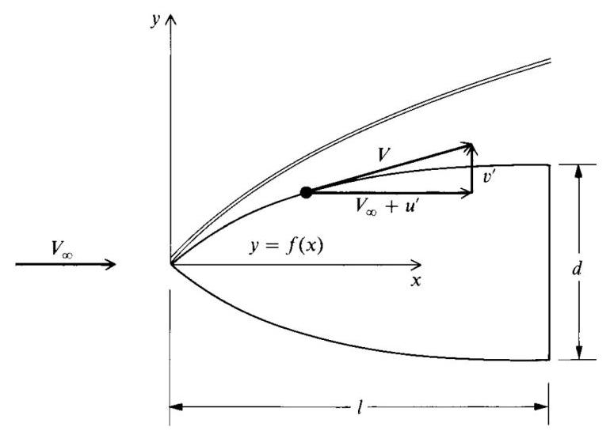

涉及自由来流属性和物体长度的某些无量纲参数, 既相似参数, 在不同的流动中相等

高超声速相似性

表面边界条件: $\left( {{V}_{\infty } + {u}^{\prime }}\right) {n}_{x} + {v}^{\prime }{n}_{y} + {w}^{\prime }{n}_{z} = 0$

$$
{\bar{n}}_{x} + {\bar{v}}^{\prime }{\bar{n}}_{y} + {\bar{w}}^{\prime }{\bar{n}}_{z} = 0
$$

激波边界条件:

$$
\frac{{\rho }_{2}}{{\rho }_{\infty }} = {\overline{\rho }}_{2} = \frac{\left( {\gamma  + 1}\right) {M}_{\infty }^{2}{\sin }^{2}\beta }{\left( {\gamma  - 1}\right) {M}_{\infty }^{2}{\sin }^{2}\beta  + 2}
$$

$$
\frac{{p}_{2}}{{p}_{\infty }} = 1 + \frac{2\gamma }{\gamma  + 1}\left( {{M}_{\infty }^{2}{\sin }^{2}\beta  - 1}\right)
$$

$$
\frac{{u}_{2}}{{V}_{\infty }} = 1 - \frac{2\left( {{M}_{\infty }^{2}{\sin }^{2}\beta  - 1}\right) }{\left( {\gamma  + 1}\right) {M}_{\infty }^{2}}
$$

$$
\frac{{v}_{2}}{{V}_{\infty }} = \frac{2\left( {{M}_{\infty }^{2}{\sin }^{2}\beta  - 1}\right) \cot \beta }{\left( {\gamma  + 1}\right) {M}_{\infty }^{2}}
$$

$$
{\overline{\rho }}_{2} = \left( \frac{\gamma  + 1}{\gamma  - 1}\right) \left\{  \frac{{\left( \mathrm{d}\bar{y}/\mathrm{d}\bar{x}\right) }_{s}^{2}}{{\left( \mathrm{d}\bar{y}/\mathrm{d}\bar{x}\right) }_{s}^{2} + 2/\left( {\gamma  - 1}\right) {M}_{\infty }^{2}{\tau }^{2}}\right\}
$$

$$
{\bar{p}}_{2} = \frac{2}{\gamma  + 1}\left\lbrack  {{\left( \frac{\mathrm{d}\bar{y}}{\mathrm{\;d}\bar{x}}\right) }_{s}^{2} + \frac{1 - \gamma }{{2\gamma }{M}_{\infty }^{2}{\tau }^{2}}}\right\rbrack
$$

$$
{\bar{u}}_{2}^{\prime } =  - \frac{2}{\gamma  + 1}\left\lbrack  {{\left( \frac{\mathrm{d}\bar{y}}{\mathrm{\;d}\bar{x}}\right) }_{s}^{2} - \frac{1}{{M}_{\infty }^{2}{\tau }^{2}}}\right\rbrack
$$

$$
{\bar{v}}_{2}^{\prime } = \frac{2}{\gamma  + 1}\left\lbrack  {{\left( \frac{\mathrm{d}\bar{y}}{\mathrm{\;d}\bar{x}}\right) }_{s}^{2} - \frac{1}{{M}_{\infty }^{2}{\tau }^{2}}}\right\rbrack  \frac{1}{{\left( \mathrm{d}\bar{y}/\mathrm{d}\bar{x}\right) }_{s}}
$$

## 高超声速相似性

高超声速相似参数: $K \equiv  {M}_{\infty }\tau$

压力系数: ${C}_{p} = \frac{p - {p}_{\infty }}{\frac{1}{2}{\rho }_{\infty }{V}_{\infty }^{2}} = \frac{p - {p}_{\infty }}{\left( {\gamma /2}\right) {p}_{\infty }{M}_{\infty }^{2}} = 2{\tau }^{2}\left( {\bar{p} - \frac{1}{\gamma {M}_{\infty }^{2}{\tau }^{2}}}\right)$ [ $\frac{{C}_{p}}{{\tau }^{2}} = {f}_{1}\left( {\bar{x},\bar{y},\bar{z},\gamma ,{M}_{\infty }\tau ,\frac{\alpha }{\tau }}\right)$

升力系数: $\;{c}_{l} = {\int }_{0}^{1}\left( {{C}_{{p}_{l}} - {C}_{{p}_{u}}}\right) \mathrm{d}\bar{x} \; \frac{{c}_{l}}{{\tau }^{2}} = {\int }_{0}^{1}\left( {\frac{{C}_{{p}_{l}}}{{\tau }^{2}} - \frac{{C}_{{p}_{u}}}{{\tau }^{2}}}\right) \mathrm{d}\bar{x} = {f}_{2}\left( {\gamma ,{M}_{\infty }\tau ,\frac{\alpha }{\tau }}\right)$

阻力系数:

$$
{c}_{d} = \frac{1}{l}{\int }_{0}^{1}\left( {{C}_{{p}_{l}} + {C}_{{p}_{u}}}\right) \mathrm{d}\left( \frac{y}{l\tau }\right) \left( {l\tau }\right)  = \tau {\int }_{0}^{1}\left( {{C}_{{p}_{l}} + {C}_{{p}_{u}}}\right) \mathrm{d}\bar{y}
$$

$\frac{{c}_{d}}{{\tau }^{3}} = {\int }_{0}^{1}\left( {\frac{{C}_{{p}_{l}}}{{\tau }^{2}} + \frac{{C}_{{p}_{u}}}{{\tau }^{2}}}\right) \mathrm{d}\bar{y} = {f}_{3}\left( {\gamma ,{M}_{\infty }\tau ,\frac{\alpha }{\tau }}\right)$

高超声速相似性

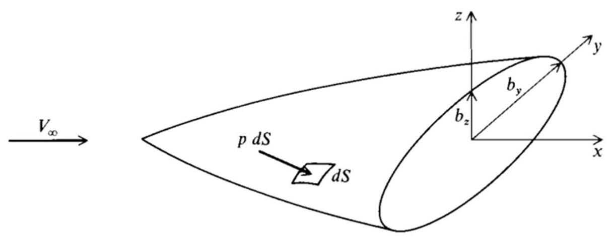

Fig. 4.4 Arbitrary body.

三维物体升力系数:

$$
L = {\iint }_{S}p\left( {x, y, z}\right) \mathrm{d}x\mathrm{\;d}y
$$

$$
\frac{{C}_{L}}{\tau } = {F}_{1}\left( {\gamma ,{M}_{\infty }\tau ,\frac{\alpha }{\tau }}\right)
$$

三维物体阻力系数:

$$
D = {\iint }_{S}p\left( {x, y, z}\right) \mathrm{d}y\mathrm{\;d}z
$$

$$
\frac{{C}_{D}}{{\tau }^{2}} = {F}_{2}\left( {\gamma ,{M}_{\infty }\tau ,\alpha /\tau }\right)
$$

高超声速相似性

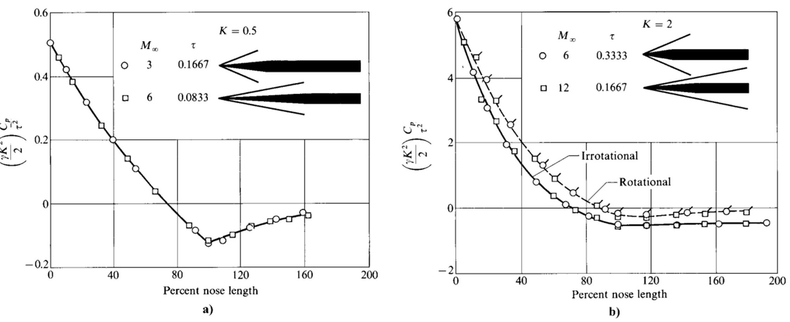

Fig. 4.5 Pressure distributions over ogive-cylinders, illustration of hypersonic similarity: a) $K = {0.5}$ and b) $K = {2.0}$ (from [26]).

高超声速相似性

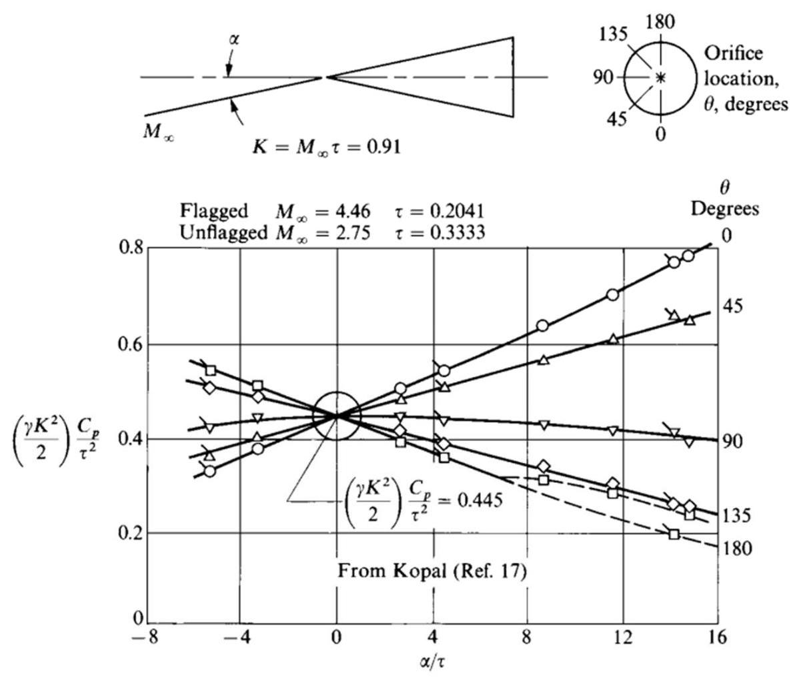

Fig. 4.6 Cone pressure at angle of attack, correlated by hypersonic similarity (from [26]).

研讨内容

1.高超声速流动数值模拟方法

2.高超声速流动实验测量方法

3.高超声速边界层流动稳定性

4. 高超声速湍流边界层

5. 激波边界层相互作用

6. 高超声速流动控制

高超声速小扰动理论的一些结果 (Hypersonic Small-Disturbance Theory: Some Results)

## 高超声速小扰动理论的一些结果

## Hypersonic Small-Disturbance Equations in 2D Space

Consider 3 equations in 2D space (without the x-component momentum equ)

$$
\left\{  \begin{matrix} \frac{\partial \overline{\rho }}{\partial \bar{x}} + \frac{\partial \left( {\overline{\rho }{\bar{v}}^{\prime }}\right) }{\partial \bar{y}} = 0 \\  \overline{\rho }\frac{\partial {\bar{v}}^{\prime }}{\partial \bar{x}} + \overline{\rho }{\bar{v}}^{\prime }\frac{\partial {\bar{v}}^{\prime }}{\partial \bar{y}} =  - \frac{\partial \bar{p}}{\partial \bar{y}} \\  \frac{\partial }{\partial \bar{x}}\left( \frac{\bar{p}}{\overline{\rho }{\bar{v}}^{\prime }}\right)  + {\bar{v}}^{\prime }\frac{\partial }{\partial \bar{y}}\left( \frac{\bar{p}}{\overline{\rho }{\bar{v}}^{\prime }}\right)  = 0 \end{matrix}\right.
$$

A nonlinear multi-component system which is difficult to be solved analytically.

Need more simplification.

- Reduce the number of variables

- Reduce the nonlinear system into a linear system

## 高超声速小扰动理论的一些结果

Stream Function is a powerful tool to get rid of continuity equation in 2D flow.

$$
\left. \begin{array}{r} \overline{\rho } = \frac{\partial \psi }{\partial \bar{y}} \\   - \overline{\rho }{\bar{v}}^{\prime } = \frac{\partial \psi }{\partial \bar{x}} \end{array}\right\}   \Rightarrow  \frac{\partial \overline{\rho }}{\partial \bar{x}} + \frac{\partial \left( {\overline{\rho }{\bar{v}}^{\prime }}\right) }{\partial \bar{y}} = 0
$$

$\psi$ does indeed satisfy the continuity equation which has not to be solved. We only consider the other two equations.

The next task is to express other variables with $\psi$ .

$$
\overline{\rho } = {\psi }_{\bar{y}}
$$

$$
{\bar{v}}^{\prime } =  - \frac{{\psi }_{\bar{x}}}{\overline{\rho }} =  - \frac{{\psi }_{\bar{x}}}{{\psi }_{\bar{y}}}
$$

Consider the condition of "entropy is constant along a streamline". It means entropy only depends on $\psi$ .

$$
\frac{\bar{p}}{{\overline{\rho }}^{\gamma }} = \omega \left( \psi \right)  \Rightarrow  \bar{p} = \omega {\overline{\rho }}^{\gamma } = \omega {\psi }_{\bar{y}}^{\gamma }
$$

The next task is to express all the derivatives with $\psi$

## 高超声速小扰动理论的一些结果

Transform Momentum Equation of Y

$$
\frac{\partial {\bar{v}}^{\prime }}{\partial \bar{x}} = \frac{-{\psi }_{\bar{y}}{\psi }_{\bar{x}\bar{x}} + {\psi }_{\bar{x}}{\psi }_{\bar{x}\bar{y}}}{{\left( {\psi }_{\bar{y}}\right) }^{2}}
$$

$$
\frac{\partial {\bar{v}}^{\prime }}{\partial \bar{y}} = \frac{-{\psi }_{\bar{y}}{\psi }_{\bar{x}\bar{y}} + {\psi }_{\bar{x}}{\psi }_{\bar{y}\bar{y}}}{{\left( {\psi }_{\bar{y}}\right) }^{2}}
$$

$$
\left. \begin{aligned} \frac{\partial \bar{p}}{\partial \bar{y}} &  = \frac{\partial }{\partial \bar{y}}\left( {\omega {\psi }_{\bar{y}}^{\gamma }}\right) \\   &  = {\omega \gamma }{\left( {\psi }_{\bar{y}}\right) }^{\gamma  - 1}{\psi }_{\bar{y}\bar{y}} + {\left( {\psi }_{\bar{y}}\right) }^{\gamma }\frac{\partial \omega }{\partial \bar{y}} \\  \frac{\partial \omega }{\partial \bar{y}} &  = \left( \frac{\partial \omega }{\partial \psi }\right) \frac{\partial \psi }{\partial \bar{y}} = {\omega }^{\prime }\frac{\partial \psi }{\partial \bar{y}} \end{aligned}\right\}   \Rightarrow  \frac{\partial \bar{p}}{\partial \bar{y}} = {\omega \gamma }{\left( {\psi }_{\bar{y}}\right) }^{\gamma  - 1}{\psi }_{\bar{y}\bar{y}} + {\left( {\psi }_{\bar{y}}\right) }^{\gamma }{\omega }^{\prime }\frac{\partial \psi }{\partial \bar{y}}
$$

Insert all these derivatives into momentumn equation of $Y$

$$
{\left( {\psi }_{\bar{y}}\right) }^{2}{\psi }_{\bar{x}\bar{x}} - 2{\psi }_{\bar{x}}{\psi }_{\bar{y}}{\psi }_{\bar{x}\bar{y}} + {\left( {\psi }_{\bar{x}}\right) }^{2}{\psi }_{\bar{y}\bar{y}} = {\left( {\psi }_{\bar{y}}\right) }^{\gamma  + 1}\left\lbrack  {{\gamma \omega }{\psi }_{\bar{y}\bar{y}} + {\omega }^{\prime }{\left( {\psi }_{\bar{y}}\right) }^{2}}\right\rbrack
$$

Although complicated, but it contains only one parameter, $\omega$ .

## 高超声速小扰动理论的一些结果

Momentum Equation in Cylindrical System

$$
\begin{cases} \frac{\partial \overline{\rho }}{\partial \bar{x}} + \frac{\partial \left( {\overline{\rho }{\bar{v}}^{\prime }}\right) }{\partial \bar{r}} + \frac{\overline{\rho }{\bar{v}}^{\prime }}{\bar{r}} &  = 0 \\  \overline{\rho }\frac{\partial {\bar{v}}^{\prime }}{\partial \bar{x}} + \overline{\rho }{\bar{v}}^{\prime }\frac{\partial {\bar{v}}^{\prime }}{\partial \bar{r}} &  =  - \frac{\partial \bar{p}}{\partial \bar{r}} \\  \frac{\partial }{\partial \bar{x}}\left( \frac{\bar{p}}{{\overline{\rho }}^{\gamma }}\right)  + {\bar{v}}^{\prime }\frac{\partial }{\partial \bar{r}}\left( \frac{\bar{p}}{{\overline{\rho }}^{\gamma }}\right) &  = 0 \end{cases}
$$

$$
{\left( {\psi }_{\bar{r}}\right) }^{2}{\psi }_{\bar{x}\bar{x}} - 2{\psi }_{\bar{x}}{\psi }_{\bar{r}}{\psi }_{\bar{x}\bar{r}} + {\left( {\psi }_{\bar{x}}\right) }^{2}{\psi }_{\bar{r}\bar{r}}
$$

$$
= \frac{{\left( {\psi }_{\bar{r}}\right) }^{\gamma  + 1}}{{\bar{r}}^{\gamma  - 1}}\left\lbrack  {{\gamma \omega }\left( {{\psi }_{\bar{r}\bar{r}} - \frac{{\psi }_{\bar{r}}}{\bar{r}}}\right)  + {\omega }^{\prime }{\left( {\psi }_{\bar{r}}\right) }^{2}}\right\rbrack
$$

## 高超声速小扰动理论的一些结果

## Hypersonic Cone Flow

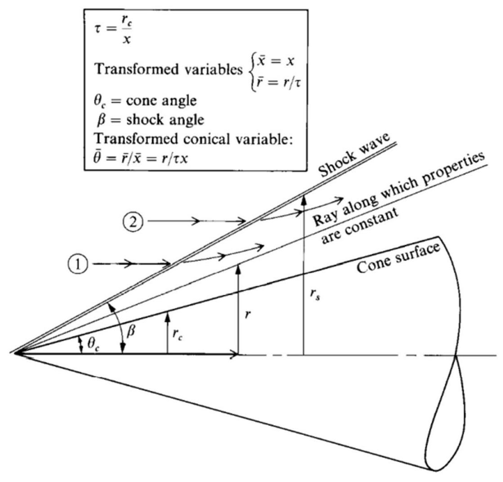

Set $\tau  = \frac{{r}_{c}}{x}$ where ${r}_{c}$ is the radius of the cone at $x$

$$
\left\{  \begin{array}{l} \bar{x} = x \\  \bar{r} = \frac{r}{\tau } = \frac{rx}{{r}_{c}} \end{array}\right.
$$

New coordinate system

$$
\left\{  \begin{array}{l} \bar{x} = x \\  \overline{\theta } = \frac{\bar{r}}{\bar{x}} \end{array}\right.
$$

which is simpler.

## 高超声速小扰动理论的一些结果

Considtions to Simplification

- The flow is self-similar along $x$

- The entropy behined the shock is uniform, $\omega  \equiv$ const

- Flow state is uniform along a given ray emanating from the cone vertex.

$$
\frac{\partial \left( {\rho , u, v, p,\cdots }\right) }{\partial r} \equiv  0\;\text{ in the polar coordinate of }\left\lbrack  {x,\theta }\right\rbrack
$$

- The complicated nonlinear PDE of $\psi$ can be reduced to an ODE in $\overline{\theta }$ domain

## 高超声速小扰动理论的一些结果

Separation of Variables

$\psi$ between two streamlines is equal to the mass flow $\dot{m}$ between these streamlines

$$
\dot{m} \propto  {r}^{2}
$$

$$
\because \bar{r} = \frac{r}{\tau } \Rightarrow  \psi  \propto  {\bar{r}}^{2}
$$

$$
\because \overline{\theta } = \bar{r}/\bar{x} \Rightarrow  \psi  = {\bar{r}}^{2}g\left( \overline{\theta }\right)  = {\bar{x}}^{2}{\overline{\theta }}^{2}g\left( \overline{\theta }\right)  = {\bar{x}}^{2}f\left( \overline{\theta }\right)
$$

$$
\psi  = {\bar{x}}^{2}f\left( \overline{\theta }\right)
$$

Based on this definition, as well as the condition of self-similarity, the 2D PDE might be simplified into an ODE.

## 高超声速小扰动理论的一些结果

## Convert PDE to ODE

Convert all $\psi$ and its derivatives into expressions of $f$ Here, we skip the derivation and give the final form

$$
{f}^{\prime \prime } - \frac{{f}^{\prime }}{\overline{\theta }} = \frac{2}{\gamma \omega }\frac{{\overline{\theta }}^{\gamma  - 1}f}{{\left( {f}^{\prime }\right) }^{\gamma  + 1}}\left\lbrack  {{2f}{f}^{\prime \prime } - {\left( {f}^{\prime }\right) }^{2}}\right\rbrack
$$

At the same time, $\omega  \equiv$ CONST since the angle of the shock wave in the cone flow is uniform.

Wall Boundary Condition for $f$

At the body surface $\overline{\theta } = {\overline{\theta }}_{c} = 1$

$$
\psi  = 0\; \Rightarrow  \;{\bar{x}}^{2}f\left( 1\right)  = 0\; \Rightarrow  \;f\left( 1\right)  = 0
$$

## 高超声速小扰动理论的一些结果

Shock Wave Boundary Condition for $f$

At the shock wave

$$
\overline{\theta } = \frac{{\bar{r}}_{s}}{\bar{x}} = \frac{1}{\tau }\frac{{r}_{s}}{x} = \frac{1}{\tau }\tan \beta  \approx  \frac{\beta }{\tau } = \frac{\beta }{\tan {\theta }_{c}} \approx  \frac{\beta }{{\theta }_{c}} = \frac{\text{ shock angle }}{\text{ cone angle }}
$$

$$
f\left( \frac{\beta }{\tau }\right)  = \frac{\overline{\rho }}{2}\left\lbrack  {{\left( \frac{\beta }{\tau }\right) }^{2} - \left( \frac{\beta }{\tau }\right) {\bar{v}}^{\prime }}\right\rbrack
$$

$$
{f}^{\prime }\left( \frac{\beta }{\tau }\right)  = \left( \frac{\beta }{\tau }\right) \overline{\rho }
$$

where

$$
\overline{\rho } = \frac{\gamma  + 1}{\gamma  - 1}\left\{  \frac{1}{1 + \frac{2}{\left( {\gamma  - 1}\right) {K}^{2}}}\right\}  \;{\bar{v}}^{\prime } = \frac{2}{\gamma  + 1}\left( {1 - \frac{1}{{K}^{2}}}\right)
$$

高超声速小扰动理论的一些结果

Obtain Flow States from $f$

$$
\bar{p} = \omega {\overline{\rho }}^{\gamma } = \omega \left( \frac{{\psi }_{\bar{r}}}{\bar{r}}\right)  = \omega {\left( \frac{\bar{x}{f}^{\prime }}{\bar{r}}\right) }^{\gamma } = \omega {\left( \frac{{f}^{\prime }}{\overline{\theta }}\right) }^{\gamma }
$$

$$
\frac{{C}_{p}}{{\tau }^{2}} = \frac{2}{\gamma {K}^{2}}\left( {\bar{p}\gamma {K}^{2} - 1}\right)
$$

$$
= \frac{2}{\gamma {K}^{2}}\left\lbrack  {\gamma {K}^{2}\omega \left( \frac{{\bar{f}}^{\gamma }}{\overline{\theta }}\right)  - 1}\right\rbrack
$$

高超声速小扰动理论的一些结果

Results

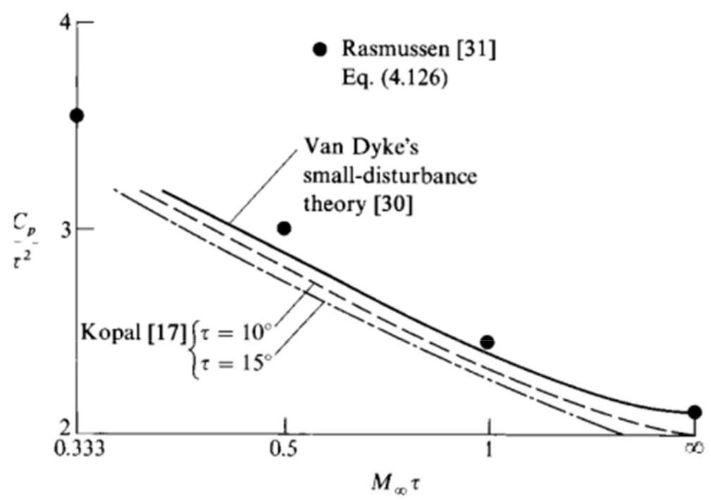

Fig. 4.8 Cone surface pressure: comparison between exact theory [17], hypersonic small-disturbance theory [30], and analytical formula [31].

Figure: Kopal's results: numerical methods

高超声速小扰动理论的一些结果

Results

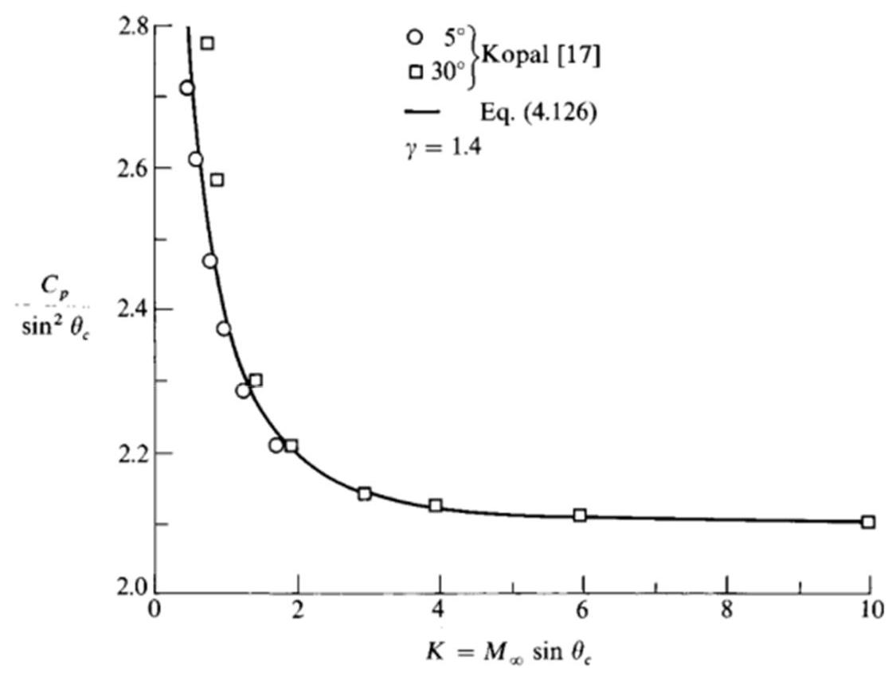

Fig. 4.9 Cone surface pressure: comparison of Rasmussen's formula [31] with exact results [17].

高超声速等效原理与冲击波理论 (Hypersonic Equivalence Principle and Blast-Wave Theory)

## 高超声速等效原理与激波理论

Hypersonic Equivalence Principle

$$
\begin{cases} \frac{\partial \rho }{\partial t} + \frac{\partial {\rho v}}{\partial y} + \frac{\partial {\rho w}}{\partial z} &  = 0 \\  \rho \frac{\partial v}{\partial t} + {\rho v}\frac{\partial v}{\partial y} + {\rho w}\frac{\partial v}{\partial z} &  =  - \frac{\partial p}{\partial y} \\  \rho \frac{\partial w}{\partial t} + {\rho v}\frac{\partial w}{\partial y} + {\rho w}\frac{\partial w}{\partial z} &  =  - \frac{\partial p}{\partial z} \\  \frac{\partial }{\partial t}\left( \frac{p}{{p}^{2}}\right)  + v\frac{\partial }{\partial \left( \frac{p}{{p}^{2}}\right) } + w\frac{\partial }{\partial z}\left( \frac{p}{{p}^{2}}\right) &  = 0 \end{cases}
$$

Let

$$
\widetilde{\rho } = \frac{\rho }{{\rho }_{\infty }}\;\widetilde{v} = \frac{v}{{V}_{\infty }}\;\widetilde{w} = \frac{w}{{V}_{\infty }}
$$

$$
\widetilde{p} = \frac{p}{{\rho }_{\infty }{V}_{\infty }^{2}}\;\widetilde{y} = \frac{y}{l}\;\widetilde{z} = \frac{z}{l}\;\widetilde{t} = \frac{t}{l/{V}_{\infty }}
$$

## 高超声速等效原理与激波理论

Dimensionless unsteady Euler equations in $\mathrm{y} - \mathrm{z}$ plane.

$$
\left\{  \begin{matrix} \frac{\partial \widetilde{\rho }}{\partial \widetilde{t}} + \frac{\partial \widetilde{\rho }\widetilde{v}}{\partial \widetilde{y}} + \frac{\partial \widetilde{\rho }\widetilde{w}}{\partial \widetilde{z}} = 0 \\  \widetilde{\rho }\frac{\partial \widetilde{v}}{\partial \widetilde{t}} + \widetilde{\rho }\widetilde{v}\frac{\partial \widetilde{v}}{\partial \widetilde{y}} + \widetilde{\rho }\widetilde{w}\frac{\partial \widetilde{v}}{\partial \widetilde{z}} =  - \frac{\partial \widetilde{p}}{\partial \widetilde{x}} \\  \widetilde{\rho }\frac{\partial \widetilde{w}}{\partial \widetilde{t}} + \widetilde{\rho }\widetilde{v}\frac{\partial \widetilde{w}}{\partial \widetilde{y}} + \widetilde{\rho }\widetilde{w}\frac{\partial \widetilde{w}}{\partial \widetilde{z}} =  - \frac{\partial \widetilde{p}}{\partial \widetilde{z}} \\  \frac{\partial }{\partial \widetilde{x}}\left( \frac{\widetilde{p}}{\partial \widetilde{t}}\right)  + {\widetilde{v}}_{\widetilde{x}}\left( \frac{\widetilde{p}}{\partial \widetilde{x}}\right)  + {\widetilde{v}}_{\widetilde{y}}\frac{\partial }{\partial \widetilde{x}}\left( \frac{\widetilde{p}}{\partial \widetilde{y}}\right)  = 0 \end{matrix}\right.
$$

## 高超声速等效原理与激波理论

Dimensionless equations of 3D steady small disturbance hypersonic flows.

$$
\left\{  \begin{matrix} \frac{\partial \widetilde{\rho }}{\partial \widetilde{x}} + \frac{\partial \widetilde{\rho }\widetilde{v}}{\partial \widetilde{y}} + \frac{\partial \widetilde{\rho }\widetilde{w}}{\partial \widetilde{z}} = 0 \\  \widetilde{\rho }\frac{\partial \widetilde{v}}{\partial \widetilde{x}} + \widetilde{\rho }\widetilde{v}\frac{\partial \widetilde{v}}{\partial \widetilde{y}} + \widetilde{\rho }\widetilde{w}\frac{\partial \widetilde{v}}{\partial \widetilde{z}} =  - \frac{\partial \widetilde{p}}{\partial \widetilde{y}} \\  \widetilde{\rho }\frac{\partial \widetilde{w}}{\partial \widetilde{x}} + \widetilde{\rho }\widetilde{v}\frac{\partial \widetilde{w}}{\partial \widetilde{y}} + \widetilde{\rho }\widetilde{w}\frac{\partial \widetilde{w}}{\partial \widetilde{z}} =  - \frac{\partial \widetilde{p}}{\partial \widetilde{z}} \\  \frac{\partial }{\partial \widetilde{x}}\left( \frac{\widetilde{p}}{\partial \widetilde{y}}\right)  + \widetilde{v}\frac{\partial }{\partial \widetilde{x}}\left( \frac{\widetilde{p}}{\partial \widetilde{y}}\right)  + \widetilde{w}\frac{\partial }{\partial \widetilde{x}}\left( \frac{\widetilde{p}}{\partial \widetilde{y}}\right)  = 0 \end{matrix}\right.
$$

高超声速等效原理与激波理论

$$
\widetilde{x} = \frac{x}{l} = \widetilde{t} = \frac{t{V}_{\infty }}{l}\; \Rightarrow  \;x = {V}_{\infty }t
$$

- A 3D problem $\Rightarrow$ a seris of 2D problem in $x$ direction.

- Disturbace in supersonic flows can not affect upwind

- Space marching method

高超声速等效原理与激波理论

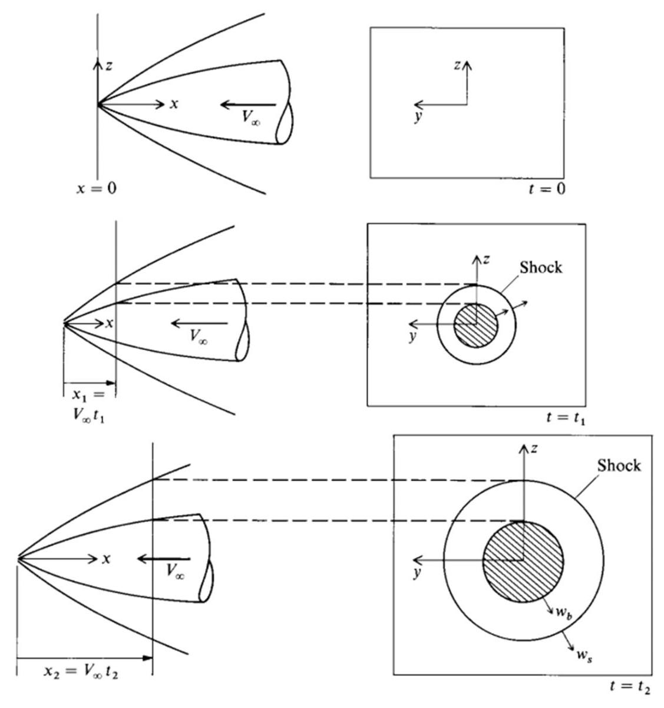

## 高超声速等效原理与激波理论

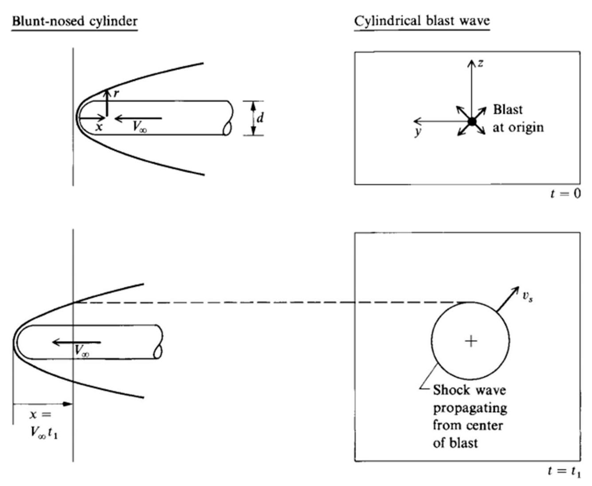

Fig. 4.13 Blast-wave analogy for a blunt-nosed cylinder.

## 高超声速等效原理与激波理论

- It is like a cylindrical blast wave expanding in the $y - z$ plane.

- And it is reasonable according to the equivalence principle

- Thus we might solve this problem with the theory of blast wave.

Cylinderical Blast Wave Formular

$$
p\left( t\right)  = {k}_{1}{\rho }_{\infty }{\left( \frac{E}{{\rho }_{\infty }}\right) }^{\frac{1}{2}}{t}^{-1}\;r\left( t\right)  = {\left( \frac{E}{{\rho }_{\infty }}\right) }^{1/4}{t}^{1/2}
$$

How to determine $E$ ?

## 高超声速等效原理与激波理论

Cylindrical Blast-Wave Formular

$$
\mathrm{d}E = D\mathrm{\;d}x
$$

$$
D = \frac{\mathrm{d}E}{\mathrm{\;d}x}
$$

Word done per unit length along the $x$ axis by the body.

Energy released per unit ${V}_{\infty }t$ by the blast.

## 高超声速等效原理与激波理论

Blast-Wave Theory of a Blunt Cylinder

$$
E = D = \frac{1}{2}{\rho }_{\infty }{V}_{\infty }^{2}{C}_{D}\frac{\pi {d}^{2}}{4}\;t = \frac{x}{{V}_{\infty }}
$$

$$
p\left( t\right)  = {k}_{1}{\rho }_{\infty }\left( {\sqrt{\frac{\pi }{8}}{V}_{\infty }d\sqrt{{C}_{D}}}\right) \frac{{V}_{\infty }}{x}
$$

$$
\because \;{\rho }_{\infty } = \frac{{p}_{\infty }}{R{T}_{\infty }}
$$

$$
= {k}_{1}\frac{\gamma {p}_{\infty }}{{\gamma R}{T}_{\infty }}\sqrt{\frac{\pi }{8}}{V}_{\infty }^{2}\sqrt{{C}_{D}}{\left( \frac{x}{d}\right) }^{-1}
$$

$$
\because \;{a}_{\infty }^{2} = {\gamma R}{T}_{\infty }\;{V}_{\infty }/{a}_{\infty } = {M}_{\infty }\;\gamma  = {1.4}\;{k}_{1} = {0.07768}
$$

$$
\Rightarrow  \;\frac{p}{{p}_{\infty }} = {0.8773}{k}_{1}{M}_{\infty }^{2}\sqrt{{C}_{D}}{\left( \frac{x}{d}\right) }^{-1}
$$

Similar,

$$
\frac{r}{d} = {0.792}{C}_{D}^{1/4}\sqrt{\frac{x}{d}}
$$

## 高超声速等效原理与激波理论

Blast-Wave Theory of a Blunt Slab

$$
\frac{p}{{p}_{\infty }} = {0.127}{M}_{\infty }^{2}{C}_{D}^{2/3}{\left( \frac{x}{d}\right) }^{-2/3}
$$

$$
\frac{r}{d} = {0.794}{C}_{D}^{1/3}{\left( \frac{x}{d}\right) }^{2/3}
$$

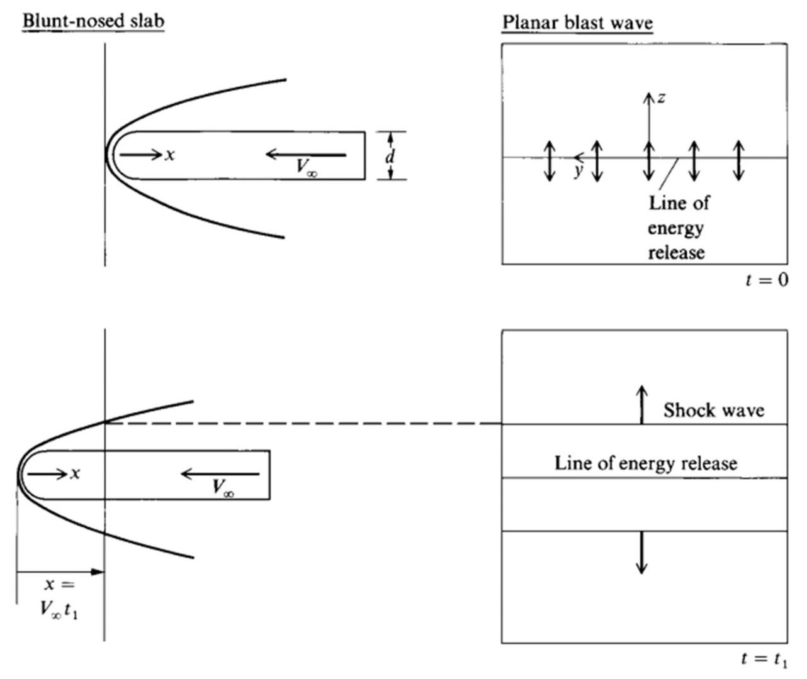

## 高超声速等效原理与激波理论

Examples

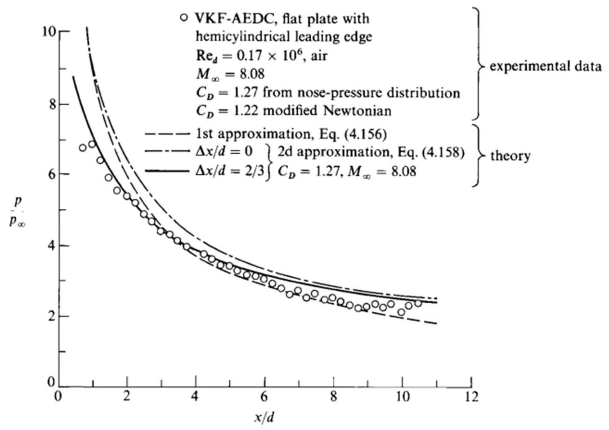

Fig. 4.17 Pressure distribution on a blunt-nosed flat plate (from Lukasiewicz [36]).

高超声速等效原理与激波理论

Examples

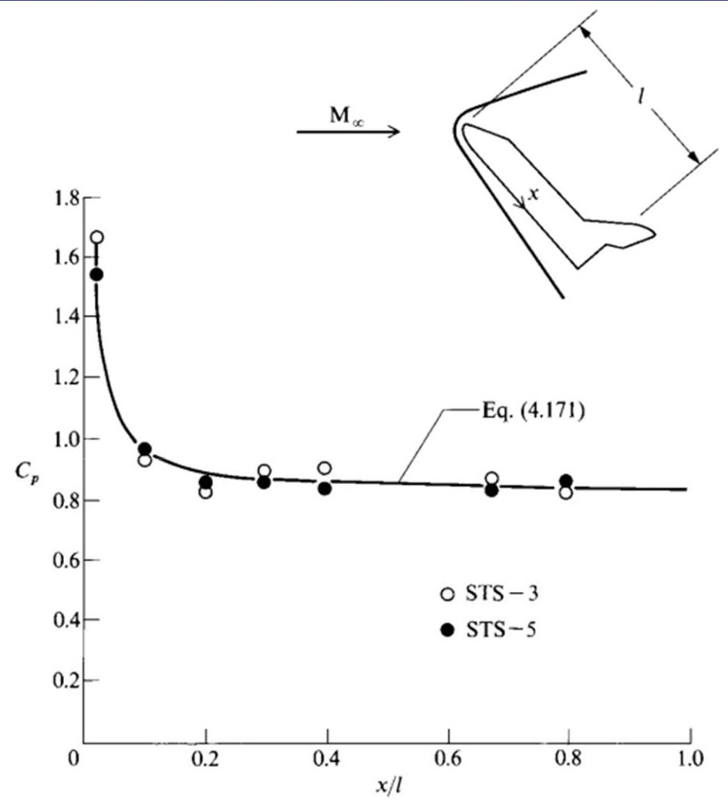

$$
{C}_{p} = \text{ [Blast - wave] }
$$

$$
\text{ + [Newtonian flow] }
$$

$$
= {0.096}{C}_{D}^{1/2}{\left( \frac{x}{d}\right) }^{-1}{\left( \frac{l}{d}\right) }^{-1}
$$

$$
+ 2{\sin }^{2}\alpha
$$

$$
= \frac{0.0137}{x/l} + 2{\sin }^{2}\alpha
$$

Fig. 4.25 Comparison of pressure coefficients obtained with combined blast-wave/ Newtonian theory [Eq. (4.171)] with flight data for the space shuttle: windward centerline, ${M}_{\infty } = {21.6}$ , and $\alpha  = {40}\mathrm{{deg}}$ .

薄激波层理论 (Thin Shock-Layer Theory)

## 薄激波层理论

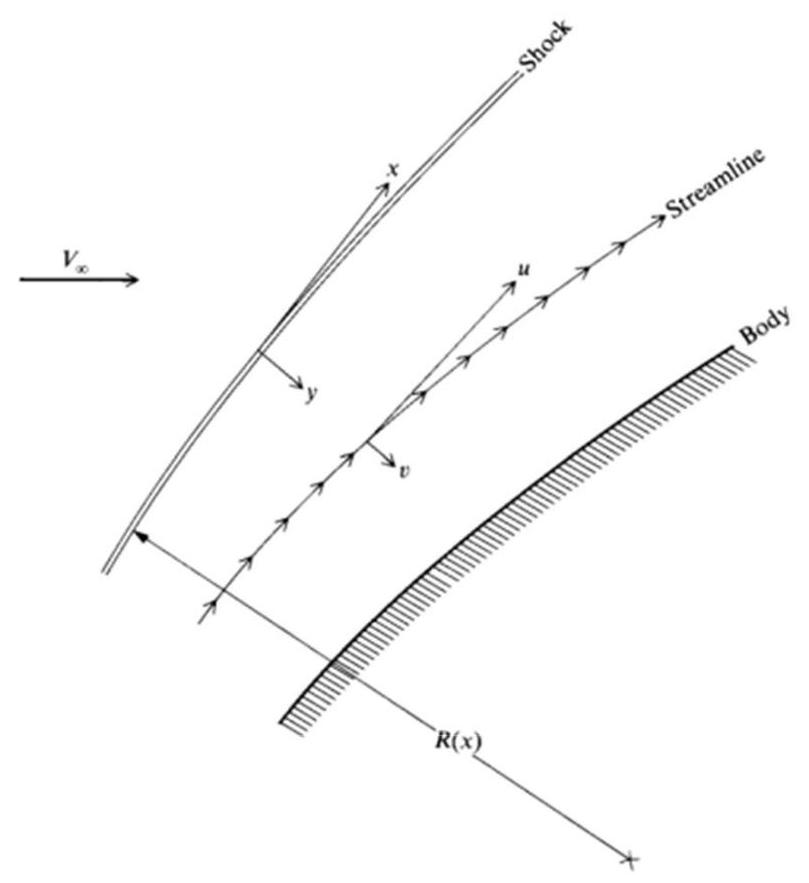

Fig. 4.26 Shock-layer model for thin shock-layer analysis by Maslen.

- 高超声速情况下，激波层极薄， 激波形状、壁面形状，流线形状几乎相同，可以假设流动为平行流在法向，压强梯度作用与旋转离心力平衡

$$
{R}_{s} \approx  {R}_{\text{ wall }} \approx  R
$$

$$
\rho \frac{{u}^{2}}{R} = \frac{\partial p}{\partial y} \approx  \; \Rightarrow  \;\rho \frac{{u}^{2}}{{R}_{s}} = \frac{\partial p}{\partial y}
$$

- 二维情况下, 可视为变截面管流,可定义流函数 ${\rho u} = \frac{\mathrm{d}\psi }{\mathrm{d}y}$ , 可见坐标 $y$ 可以用 $\psi$ 替换

$$
\frac{\partial p}{\partial y} = \left( \frac{\partial p}{\partial \psi }\right) \frac{\partial \psi }{\partial y} = \left( \frac{\partial p}{\partial \psi }\right) {\rho u}
$$

薄激波层理论

$$
\begin{aligned} \frac{\partial p}{\partial y} &  = \left( \frac{\partial p}{\partial \psi }\right) {\rho u} \\  \rho \frac{{u}^{2}}{{R}_{s}} &  = \frac{\partial p}{\partial y} \end{aligned} \Rightarrow  \frac{\partial p}{\partial \psi } = \frac{u}{{R}_{s}}
$$

既然假设类似管道平行流，则激波层内截面上的速度相同，有 $u \approx  {u}_{s}$

$$
\frac{\partial p}{\partial \psi } = \frac{{u}_{s}}{{R}_{s}} \equiv  \text{ const }
$$

因此， $p$ 沿着 $\psi$ 的变化是线性的

$$
p\left( {x,\psi }\right)  = {p}_{s}\left( x\right)  + \frac{{u}_{s}\left( x\right) }{{R}_{s}\left( x\right) }\left\lbrack  {\psi  - {\psi }_{s}\left( x\right) }\right\rbrack
$$

薄激波层理论

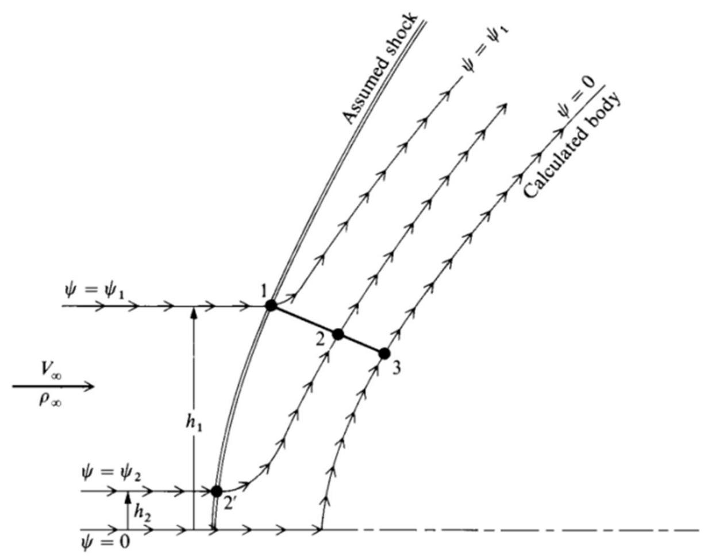

Fig. 4.27 Details for the analysis by Maslen.

- $p\left( \psi \right)$ 已知

- 激波层内部沿流线等熵

$$
s\left( \psi \right)  = \text{ const }
$$

- 气体总焓为常数 ${h}_{0} =$ const

- $\psi  = {\rho }_{\infty }{V}_{\infty }\widehat{h}$ 可以在激波前计算

## 薄激波层理论

计算从假设的激波形状向壁面 $\left( {\psi  = 0}\right)$ 推进

○ 从激波后的点 1 开始 ${\psi }_{1} = {\rho }_{\infty }{V}_{\infty }{\widehat{h}}_{1}$

2 选择 ${\psi }_{2}$ ,可计算 ${p}_{2}$ 并反推其波前点 ${2}^{\prime }$ 流线高度 ${\widehat{h}}_{2}$ 以及波后熵 ${s}_{{2}^{\prime }} = {s}_{2}$

$$
{p}_{2} = {p}_{1} + \frac{{u}_{1}}{{R}_{s}}\left( {{\psi }_{2} - {\psi }_{1}}\right) \;{\widehat{h}}_{2} = \frac{{\psi }_{2}}{{\rho }_{\infty }{V}_{\infty }}
$$

3 在 2 点根据 ${s}_{2}$ 和 ${p}_{2}$ 计算其它热力学状态: 焓 ${h}_{2}\left( {{p}_{2},{s}_{2}}\right)$ ,密度 ${\rho }_{2}\left( {{p}_{2},{s}_{2}}\right)$

4 根据总焓守恒原则，计算 2 点速度

$$
{h}_{2} + \frac{{u}_{2}^{2}}{2} = {h}_{0} \equiv  {h}_{\infty } + \frac{{V}_{\infty }}{2} \Rightarrow  {u}_{2} = \sqrt{2\left( {{h}_{0} - {h}_{2}}\right. }
$$

至此 2 点位置的所有流动状态计算完毕

6 向下一个 ${\psi }_{3}$ 推进,重复上述步骤,计算 3 点位置所有流动状态。 直到抵达壁面 $\psi  = 0$

## 薄激波层理论

以上算法获得离散形式的

$$
\rho \left( \psi \right) \;u\left( \psi \right)
$$

根据流函数定义，将坐标从 $\psi$ 转换回到 $y$

$$
\frac{\mathrm{d}\psi }{\mathrm{d}y} = {\rho u} \Rightarrow  y = {\int }_{\psi }^{{\psi }_{s}}\frac{\mathrm{d}\psi }{\rho u}
$$

如此获得壁面位置

$$
{y}_{b} = {\int }_{0}^{{\psi }_{s}}\frac{\mathrm{d}\psi }{\rho u}
$$

将 ${y}_{b}$ 与真实壁面位置 ${y}_{\text{ wall }}$ 对比,根据误差来调整假设激波形状,再次进行计算。如此反复, 直到壁面误差足够小。

最后同时获得 $\rho \left( y\right) \text{ 、 }p\left( y\right) \text{ 、 }u\left( y\right) \ldots$

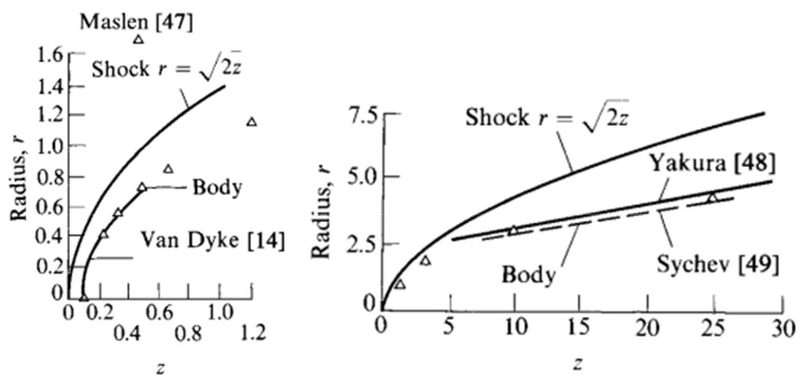

Fig. 4.28 Body associated with paraboloidal shock wave (from Maslen [47]): ${M}_{\infty } = \infty$ , and $\gamma  = {1.4}$ .

薄激波层理论

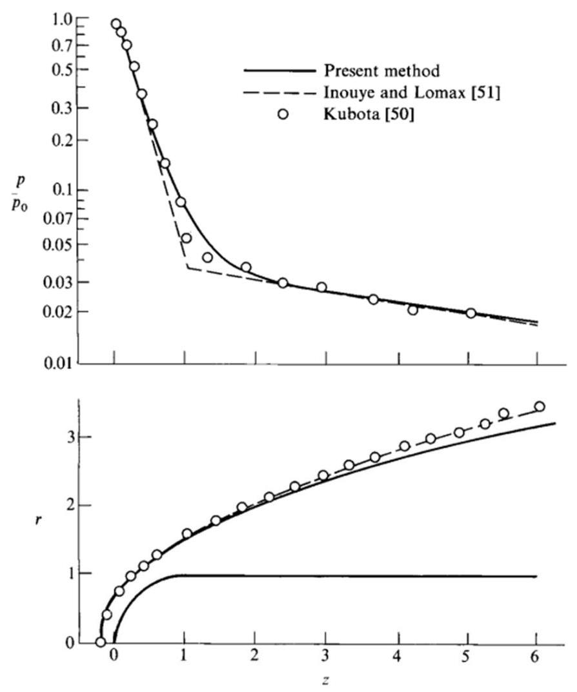

Fig. 4.30 Shock-wave shape and surface pressure for a hemisphere cylinder (from Maslen [47]): ${M}_{\infty } = \infty$ , and $\gamma  = {1.4}$ .