高超声速流动基础理论

李文丰

西北工业大学

w.li@nwpu.edu.cn

2022年11月13日

高温气体动力学: 导论

(High-Temperature Gas Dynamics: Some

Introductory Considerations

## 高温流动的重要性

大气再入:

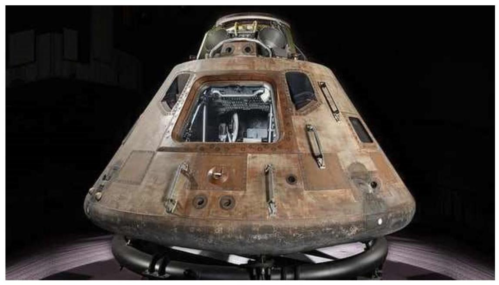

Apollo 11

> 11.2km/s;

> 53km;

> Ma 32.5;

> T_inf=283k

>> 激波层温度 ${58128}\mathrm{k}??$ ?

$> \gamma  = {1.4}$ ? ? ?

## 高温流动的重要性

大气再入:

自由电子、黑障...

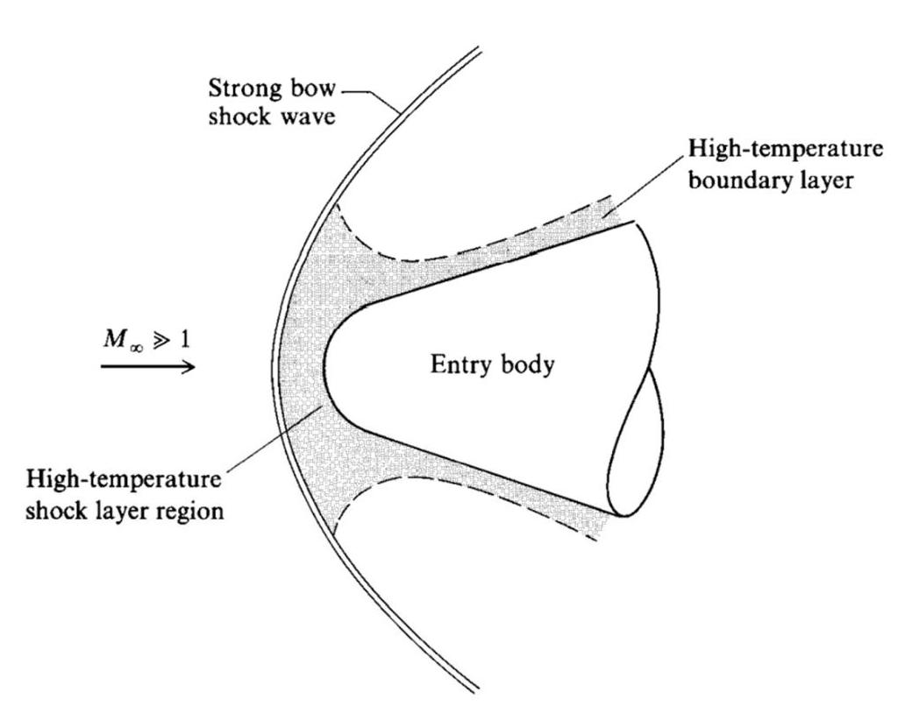

Fig. 9.1 Schematic of the high-temperature regions in an entry-body flowfield.

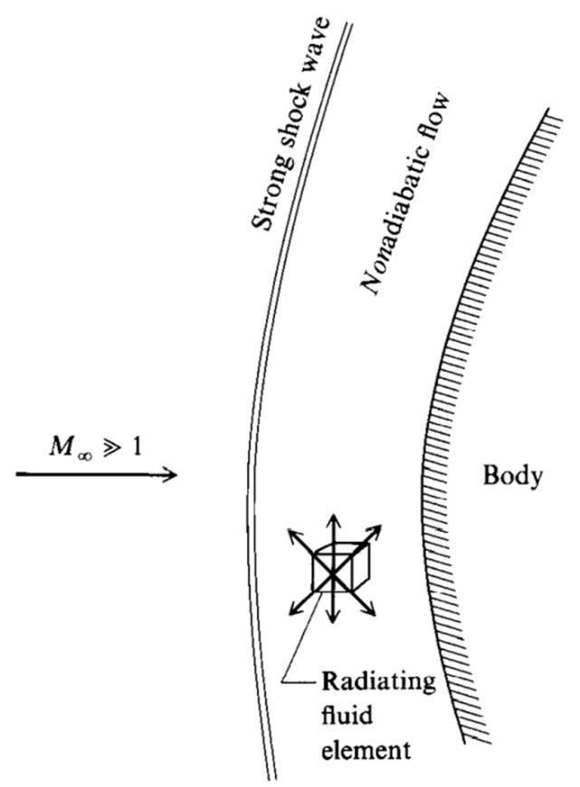

Fig. 9.3 Schematic of the nonadiabatic, radiating flowfield around a body.

## 高温流动的重要性

火箭发动机:

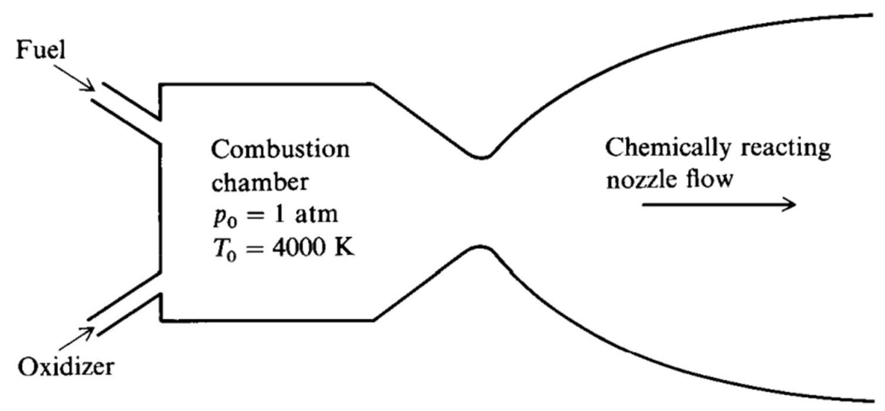

Fig. 9.4 Schematic of a rocket engine.

## 高温流动的重要性

高焓风洞:

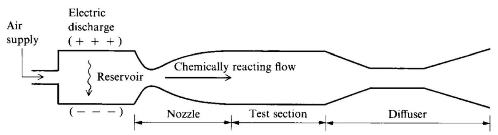

Fig. 9.5 Schematic of an arc tunnel.

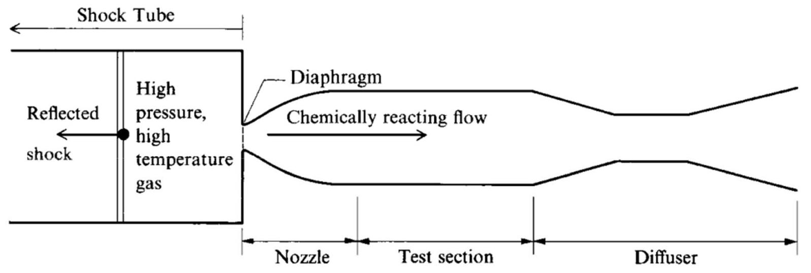

Fig. 9.6 Schematic of a shock tunnel.

高温流动的重要性

大功率激光器:

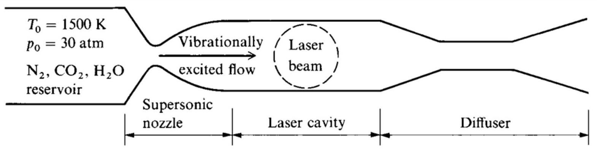

Fig. 9.7 Schematic of a gas dynamic laser.

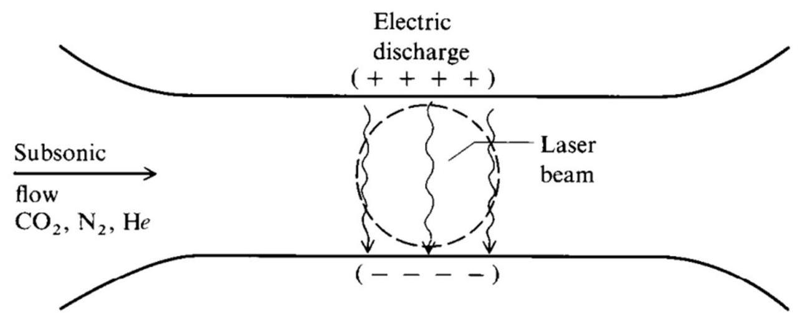

Fig. 9.8 Schematic of an electric discharge laser.

## 高温流动的重要性

超燃冲压发动机:

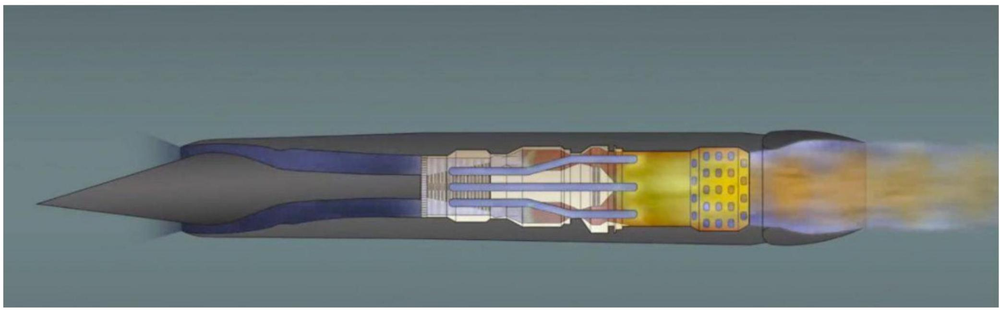

## 高温流动的性质

热力学特性 $\left( {e, h, p, T,\rho , s\text{ 等 }}\right)$ 完全不同。

$>$ 传输特性 ( $\mu$ 和 $k$ ) 完全不同。此外扩散引起的附加传输机制此时变得很重要,体现在关联扩散系数 ${D}_{i, j}$ 。

高热传导率通常是高温流动的一个主导因素。

> 比热比是一个变量。

$\gtrdot$ 所有高温气体流动的分析都需要使用某种数值解，而无法获得解析解。

- 如果温度足够高，能够引发电离，气体将变为部分等离子体，它将具有一定的导电性。

知果气体温度足够高, 将会存在来自气体或对气体的辐射所引起的非绝热效应。

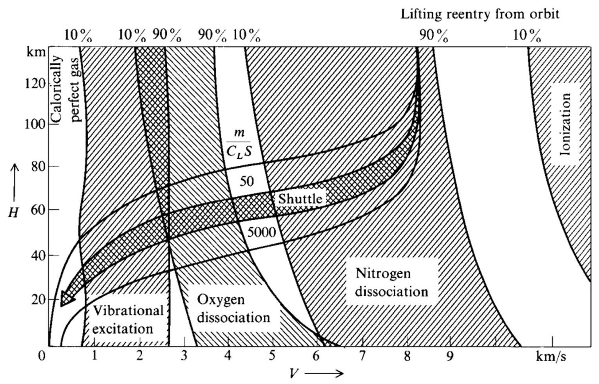

Fig. 9.13 Velocity-amplitude map with superimposed regions of vibrational excitation, dissociation, and ionization (from [79]).

化学反应气体的若干热力学问题 (Some Aspects of the Thermodynamics of Chemically Reacting Gases)

## 目录

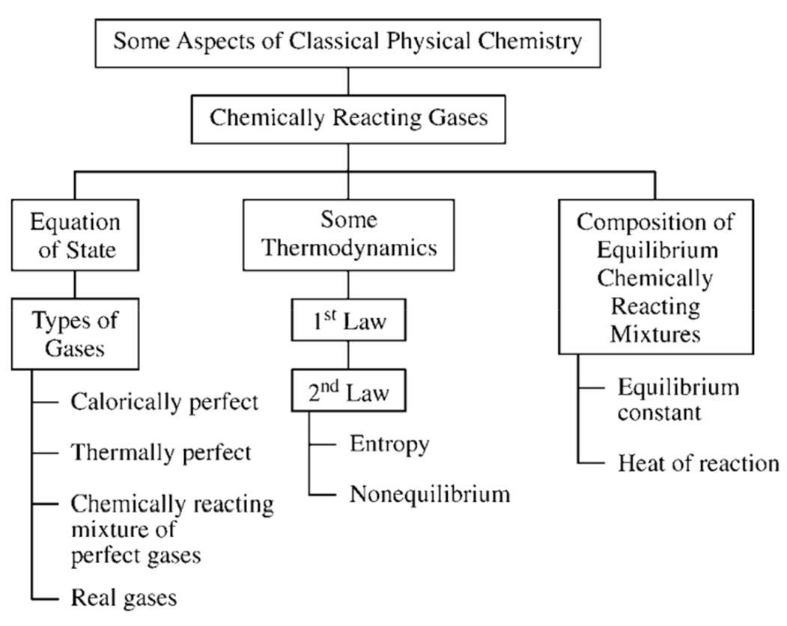

- 不同形式的完全气体状态方程

- 气体混合物组分的不同描述方法

- 气体分类

- 热力学第一定律

4.办分学第二定律

- 熵的计算

- 化学非平衡所产生的吉布斯自由能和熵

- 平衡化学反应混合气体的成分:平衡常数

- 反应热

# 不同形式的完全气体状态方程 (Various Forms of the Perfect-Gas Equation of State

不同形式的完全气体状态方程

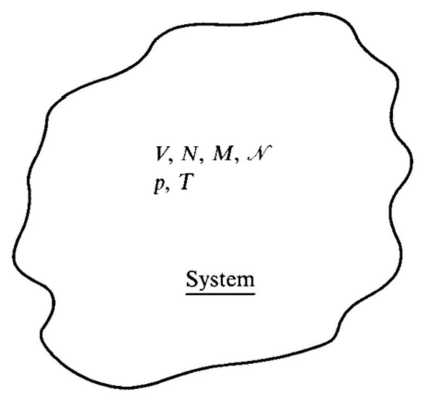

Fig. 10.3 Thermodynamic system.

气体接近标准状态下得经验结果:

1 ${pV} = {MRT}$

其中: $R$ 是比气体常数

不同形式的状态方程:

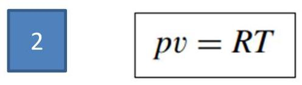

其中: $v$ 是比热容

不同形式的完全气体状态方程不同形式的状态方程:

$3\;p = {\rho RT}$

其中: $\rho$ 是密度

$$
4\;{pV} = \mathcal{N}\mathcal{R}T
$$

其中: $\mathcal{N}$ 是系统物质的量, $\mathcal{R}$ 是摩尔气体常数

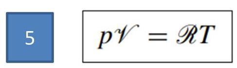

其中: $\mathcal{V}$ 是摩尔体积

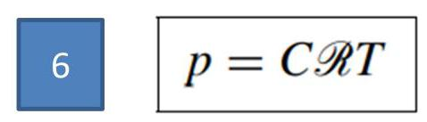

其中: $C$ 是物质的量浓度

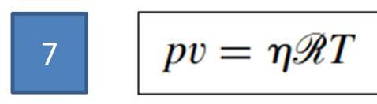

其中: $\eta$ 是摩尔质量比

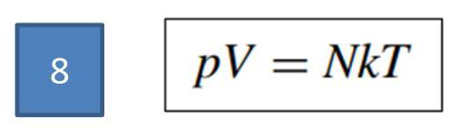

其中: $k$ 是玻尔兹曼常数

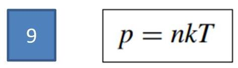

其中: $n$ 是粒子数密度

## 不同形式的完全气体状态方程

对九种不同形式的状态方程进行归类:

$>$ 当方程针对物质的量给出,使用摩尔气体常数 $R$ 。

$$
\mathcal{R} = {8314}\mathrm{\;J}/\left( {\mathrm{{kg}} \cdot  \mathrm{{mol}}\mathrm{K}}\right)
$$

$$
\mathcal{R} = {4.97} \times  {10}^{4}\left( {\mathrm{{ft}}\mathrm{{lb}}}\right) /\left( {\mathrm{{slug}} \cdot  \mathrm{{mol}}{}^{ \circ  }\mathrm{R}}\right)
$$

》当方程针对质量给出，使用比气体常数 $R$ ，它指单位质量的气体常数。

$$
R = {287}\mathrm{\;J}/\left( {\mathrm{{kg}}\mathrm{K}}\right)
$$

$$
R = {1716}\text{ (ft lb)/(slug }{}^{ \circ  }\mathrm{R}\text{ ) }
$$

当方程针对粒子给出，使用玻尔兹曼常数 $k$ ，它是单位粒子的气体常数。

$$
k = {1.38} \times  {10}^{-{23}}\mathrm{\;J}/\mathrm{K}
$$

$$
k = {0.565} \times  {10}^{-{23}}{\left( \mathrm{{ft}}\mathrm{{lb}}\right) }^{ \circ  }\mathrm{R}
$$

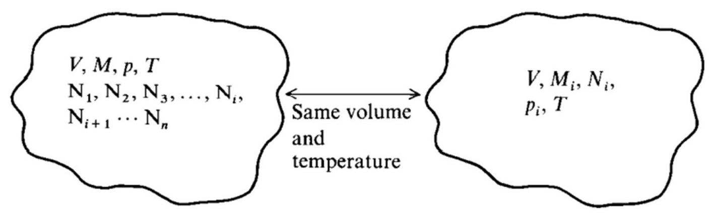

Fig. 10.4 Systems for the definition of partial pressure.

道尔顿分压定律 (Dalton's law) :

$$
p = \mathop{\sum }\limits_{i}{p}_{i}
$$

## 不同形式的完全气体状态方程

对于完全气体， ${p}_{i}$ 也服从不同形式的状态方程，类似于先前讨论的对气体混合物给出的方程， 则有:

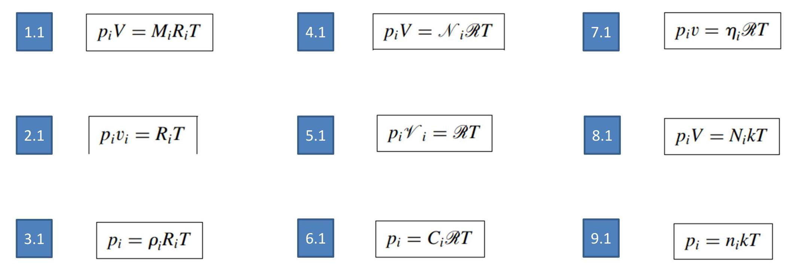

参数的下标 $i$ 表示系统内第 $i$ 组分

气体混合物组分的不同描述方法 (Various Descriptions of the Composition of a Gas Mixture)

气体混合物组分的不同描述方法

> 质量分数

$$
{c}_{i} = \frac{{\rho }_{i}}{\rho }
$$

$\mathop{\sum }\limits_{i}{c}_{i} = 1$

> 摩尔分数

$$
\frac{{p}_{i}}{p} = \frac{{\mathcal{N}}_{i}}{\mathcal{N}} \equiv  {X}_{i}
$$

$$
\mathop{\sum }\limits_{i}{X}_{i} = 1
$$

化学反应混合物的 $R$ 值:

$$
R = \mathop{\sum }\limits_{i}{c}_{i}{R}_{i}
$$

混合物的摩尔质量 $\mathcal{M}$ :

$$
\mathcal{M} = \mathop{\sum }\limits_{i}{X}_{i}{\mathcal{M}}_{i}
$$

气体分类 (Classification of Gases)

气体分类

分类

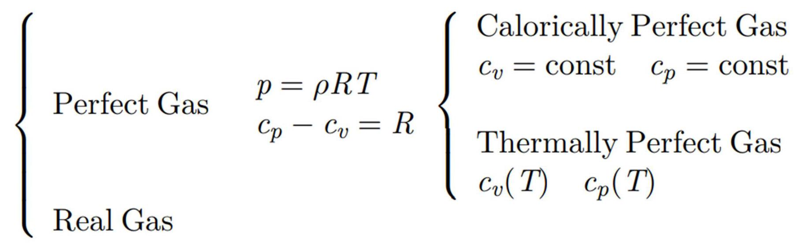

量热完全气体 Calorically Perfect Gas

$> {c}_{v},{c}_{p}$ 和 $\gamma  = {c}_{p}/{c}_{v}$ 都是常数

> 焓和内能都是温度的函数

$$
h = {c}_{p}T\;e = {c}_{v}T
$$

$>$ 状态方程为 $p = {\rho RT}$

$> {c}_{p} - {c}_{v} = R$ 成立

气体分类

热完全气体 Thermally Perfect Gas

of ${c}_{v}$ 和 ${c}_{p}$ 都是变量,但仅仅是温度函数的气体

$$
{c}_{p} = {f}_{1}\left( T\right) \;{c}_{v} = {f}_{2}\left( T\right)
$$

◆ 焓和内能也都是温度的函数

$$
h = h\left( T\right) \;e = e\left( T\right)
$$

◆ 状态方程为

$$
p = {\rho RT}
$$

$\checkmark {c}_{p} - {c}_{v} = R$ 成立

## 气体分类

完全气体混合反应物 Chemically Reacting Mixture of Perfect Gases

- Each species is a kind of perfect gas

- The enthalpy and energy of the mixture depends on $T$ and fractions of the species

$$
h = h\left( {T,{N}_{1},{N}_{2},{N}_{3},\ldots ,{N}_{n}}\right)
$$

$$
e = e\left( {T,{N}_{1},{N}_{2},{N}_{3},\ldots ,{N}_{n}}\right)
$$

$$
{c}_{p} = {c}_{p}\left( {T,{N}_{1},{N}_{2},{N}_{3},\ldots ,{N}_{n}}\right)
$$

$$
{c}_{v} = {c}_{v}\left( {T,{N}_{1},{N}_{2},{N}_{3},\ldots ,{N}_{n}}\right)
$$

- Generally, $T$ and ${N}_{i}$ depends on time $t$ and location $\left\lbrack  {x, y, z}\right\rbrack$ .

- $p = {\rho RT}$ holds, but $R$ is a variable

## 气体分类

## 平衡气体 Equilibrium gas

- The chemical reactions

reactants $\rightleftarrows$ products

approach equilibrium state: forward reactions balance backward reactions. Thus the fractions of all species approach steady values and only depend on $p$ and $T,{N}_{i} = {N}_{i}\left( T\right)$

Thermodynamic states and properties only depend on $p$ and $T$

$$
h = h\left( {T, p}\right)
$$

$$
e = e\left( {T, p}\right)
$$

$$
{c}_{p} = {c}_{p}\left( {T, p}\right)
$$

$$
{c}_{v} = {c}_{v}\left( {T, p}\right)
$$

Else, the gas is non-equilibrium.

## 气体分类

## 平衡气体 Equilibrium gas

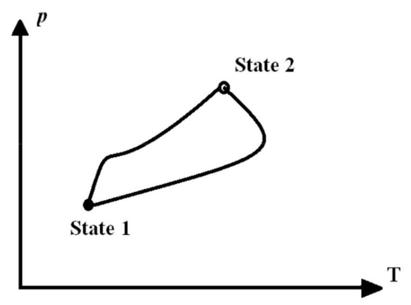

- Among all thermodynamic state variables, only two are independent, others can be derived from arbitrary two state variables

- Two arbitrary state variables uniquely define a state.

- From one (equilibrium) state, the system can move to the other equilibrium state by different process.

## 气体分类

## 真实气体 Real Gas

A gas behaves as a real gas under conditions of very high pressure and low temperature-conditions that accentuate the influence of intermolecular forces on the gas

- For a real gas, with intermolecular forces, h and e depend on p (or v) as well:

$$
h = h\left( {T, p}\right)
$$

$$
e = e\left( {T, v}\right)
$$

$$
{c}_{p} = {f}_{1}\left( {T, p}\right)
$$

$$
{c}_{v} = {f}_{2}\left( {T, v}\right)
$$

- $p = {\rho RT}$ dosn’t hold

- Van der Waals equation is a popular EOS of real gas

$$
\left( {p + \frac{a}{{v}^{2}}}\right) \left( {v - b}\right)  = {RT}
$$

热力学第一定律 (First Law of Thermodynamics)

## 热力学基本概念

状态

- 常用的状态变量有 $E, H, T, P, S$ 等

- 热力学中通常考虑系统处于平衡态，可由两个热力学状态变量描述, 其它热力学状态变量可由此推算;

- 以两个热力学变量为轴建立坐标系, 其中任一点对应一个平衡状态;

- 状态变量可以取微分,如 ${dE}$

D 过程, 从一个平衡态到另一个平衡态的转变途径

- 非静态过程，通过一系列非平衡态，到达最终平衡态

- 准静态过程，无限缓慢的通过一系列无限接近平衡的状态， 达到最终平衡态

- 热力学中，为了简化分析，通常仅讨论准静态过程

- 依赖于过程的量 (加热、做功等), 不能取微分, 只可取变分, 如 ${\delta W}$

What's enthalpy(click this URL

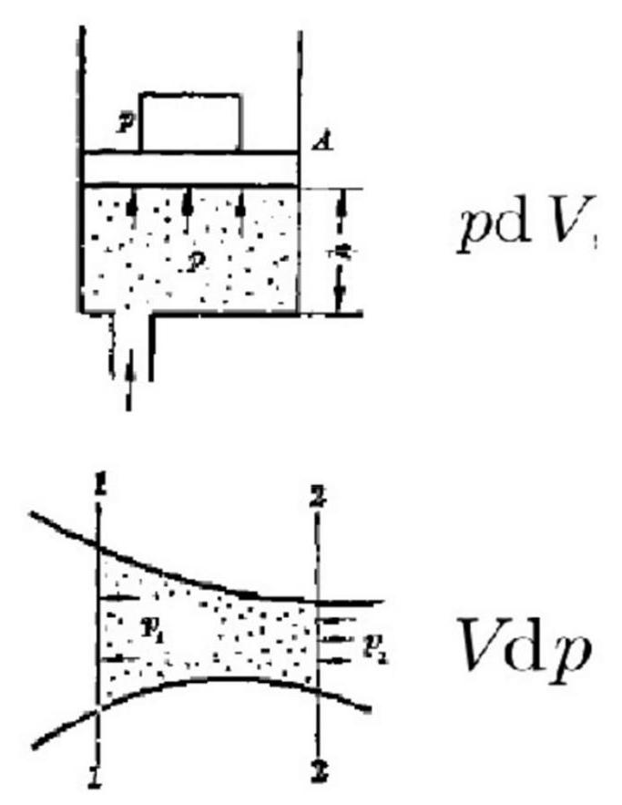

What’s enthalpy(click this URL)? $\mathrm{d}H = \mathrm{d}E + p\mathrm{\;d}V + V\mathrm{\;d}p$

- $H$ , is the thermodynamic quantity equivalent to the total heat content of a system;

- $p\mathrm{\;d}V$ , the boundary work done when the volume $V$ of a system changes;

- $V\mathrm{\;d}p$ , the flow process work which is used for open flow systems like a turbine or a pump in which there is a $\mathrm{d}p$ , i.e. change in pressure.

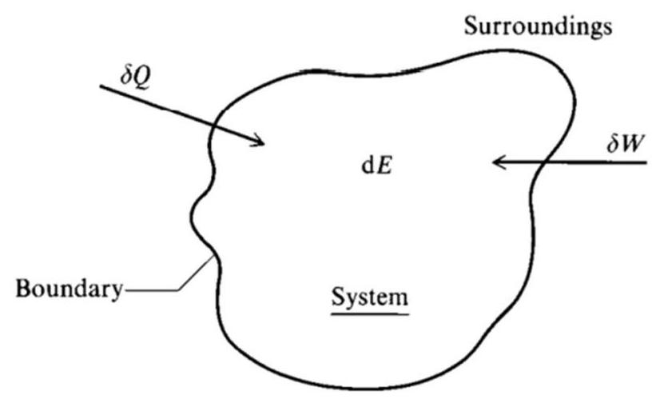

Fig. 10.5 System to illustrate the first law of thermodynamics.

A change in the internal energy $\mathrm{d}E$ can be brought about by

1. adding heat ${\delta Q}$ across the boundary of the system

2. doing work on this system ${\delta W}$ .

${\delta Q} + {\delta W} = \mathrm{d}E$

- $\mathrm{d}E$ , a change in the internal energy of the system

${\delta W}$ , doing work on this system. Here using $\delta$ since $W$ is not a function but a variable depending on the specific process

- ${\delta Q}$ , adding heat across the boundary of the system

## 热力学第一定律

- The internal energy $E$ dosen’t not include mechanical energy

- Thus we don't consider shaft work done on the system

- In this case, the work is caused by the compression or expansion of the system

$$
{\delta W} =  - p\mathrm{\;d}V\;{\delta Q} = \mathrm{d}E + p\mathrm{\;d}V
$$

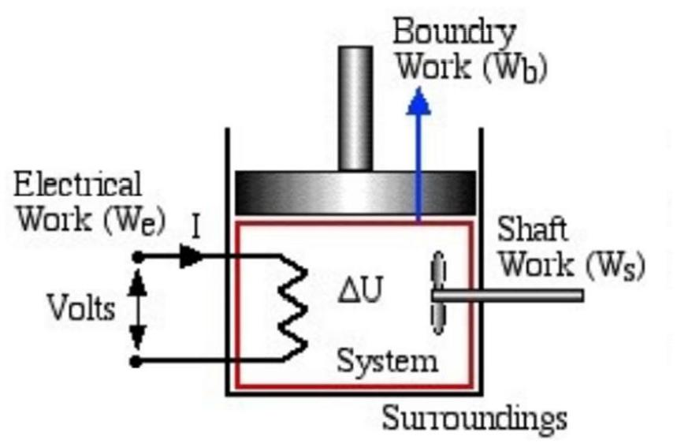

For unit mass

$$
{\delta q} = \mathrm{d}e + p\mathrm{\;d}v
$$

Consider

$$
h = e + {pv} \Leftrightarrow  \mathrm{d}h = \mathrm{d}e + p\mathrm{\;d}v + v\mathrm{\;d}p \Leftrightarrow  \mathrm{d}e = \mathrm{d}h - p\mathrm{\;d}v - v\mathrm{\;d}p
$$

Thus

$$
{\delta q} = \mathrm{d}e + p\mathrm{\;d}v = {dh} - p\mathrm{\;d}v - v\mathrm{\;d}p + p\mathrm{\;d}v = \mathrm{d}h - v\mathrm{\;d}p
$$

$$
{\delta q} = \mathrm{d}h - v\mathrm{\;d}p
$$

Derivation of a general expression for ${c}_{p} - {c}_{v}$ using the first law. For an equilibrium system,

$$
e = e\left( {T, v}\right)  \Rightarrow  \mathrm{d}e = {\left( \frac{\partial e}{\partial T}\right) }_{v}\mathrm{\;d}T + {\left( \frac{\partial e}{\partial v}\right) }_{T}\mathrm{\;d}v = {c}_{v}\mathrm{\;d}T + {\left( \frac{\partial e}{\partial v}\right) }_{T}\mathrm{\;d}v
$$

Insert it into ${\delta q} = \mathrm{d}e + p\mathrm{\;d}v$

$$
{\delta q} = {c}_{v}\mathrm{\;d}T + {\left( \frac{\partial e}{\partial v}\right) }_{T}\mathrm{\;d}v + p\mathrm{\;d}v = {c}_{v}\mathrm{\;d}T + \left\lbrack  {{\left( \frac{\partial e}{\partial v}\right) }_{T} + p}\right\rbrack  \mathrm{d}v
$$

热力学第一定律

Since

$$
{c}_{p} \equiv  {\left( \frac{\partial h}{\partial T}\right) }_{p} \equiv  {\left( \frac{\delta q}{\mathrm{\;d}T}\right) }_{p}
$$

Thus

$$
{c}_{p} = {c}_{v} + \left\lbrack  {{\left( \frac{\partial e}{\partial v}\right) }_{T} + p}\right\rbrack  {\left( \frac{\partial v}{\partial T}\right) }_{p}
$$

then

$$
{c}_{p} - {c}_{v} = \left\lbrack  {{\left( \frac{\partial e}{\partial v}\right) }_{T} + p}\right\rbrack  {\left( \frac{\partial v}{\partial T}\right) }_{p}
$$

For perfect gas,

$e$ only depends on $T,\frac{\partial e}{\partial v} = 0$

according to the EOS, ${pv} = {RT}$ , thus $v = {RT}/p \Rightarrow  {\left( \frac{\partial v}{\partial T}\right) }_{p} = \frac{R}{p}$ ,

$$
{c}_{p} - {c}_{v} = \left\lbrack  {{\left( \frac{\partial e}{\partial v}\right) }_{T} + p}\right\rbrack  {\left( \frac{\partial v}{\partial T}\right) }_{p} = \left\lbrack  {0 + p}\right\rbrack  \frac{R}{p} = R
$$

But for a chemically reacting gas, $e$ is a function of both $T$ and $v$ , this result is not valid.

热力学第二定律 (Second Law of Thermodynamics)

## Reversible Process and Irreversible Process

From one (equilibrium) state, the system can transfer to the other equilibrium state by different processes.

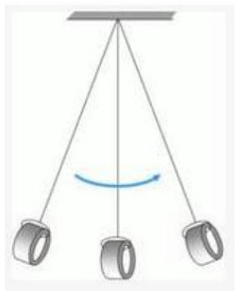

- An irreversible process is one that involves the dissipative effects of viscosity, thermal conduction, or mass diffusion, and/or where the system is in nonequilibrium. Example: a pendulum in our real life which can not return to a previous highest location because of dissipation..

- A reversible process is one that involves none of the above. Example: an ideal pendulum which can always return to a previous highest location because there is no dissipation.

## 热力学第二定律

Entropy

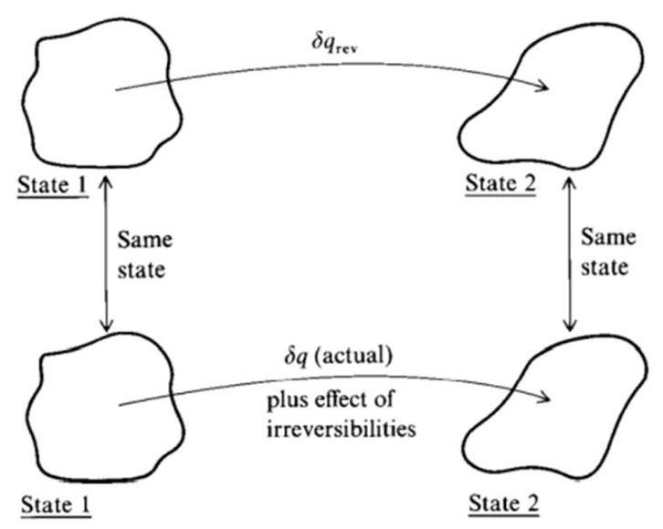

Fig. 10.6 Systems to illustrate the second law of thermodynamics.

- Entropy is a kind of state variable.

- Consider a process from State 1 to State 2, the change of $s$ is defined as

$$
\mathrm{d}s \equiv  \frac{\delta {q}_{\text{ rev }}}{T}
$$

$\delta {q}_{\text{ rev }}$ is the addition of heat during an artificial reversible process between State 1 to State 2

## 热力学第二定律

## Entropy of Irreversible Processes

For an irreversible process, $\mathrm{d}s$ is caused only in part by ${\delta q}$ and is also caused by the effect of any irreversibilities taking place in the system

$$
\mathrm{d}s = \frac{\delta q}{T} + \mathrm{d}{s}_{\text{ irrev }}
$$

${\delta q}$ is the actual amount of heat added during the process

$\mathrm{d}{s}_{\text{ irrev }}$ is the generation of entropy caused by the dissipative phenomena

- The dissipative phenomena always increase the entropy: $\mathrm{d}{s}_{\text{ irrev }} > 0$

$$
\mathrm{d}s > \frac{\delta q}{T}
$$

If the process is adiabatic, where by definition ${\delta q} = 0$ , then: $\mathrm{d}s > 0$

熵的计算 (Calculation of Entropy)

熵的计算

Entropy of a Perfect Gas

For a perfect gas, since $p\mathrm{\;d}v + v\mathrm{\;d}p = R\mathrm{\;d}T$ and $v/T = R/p$

$$
\mathrm{d}s = \frac{\delta {q}_{\text{ rev }}}{T} = \frac{{c}_{v}\left( T\right) \mathrm{d}T + p\mathrm{\;d}v}{T} = \frac{{c}_{v}\left( T\right) \mathrm{d}T + R\mathrm{\;d}T - v\mathrm{\;d}p}{T}
$$

$$
= \left\lbrack  {{c}_{v}\left( T\right)  + R}\right\rbrack  \frac{\mathrm{d}T}{T} - R\frac{\mathrm{d}p}{p} = {c}_{p}\left( T\right) \frac{\mathrm{d}T}{T} - R\frac{\mathrm{d}p}{p}
$$

We have $\mathrm{d}s$ expressed with state variables $T$ and $p$ .

$$
{s}_{2} - {s}_{1} = {\int }_{{T}_{1}}^{{T}_{2}}{c}_{p}\left( T\right) \frac{\mathrm{d}T}{T} - R\ln \frac{{p}_{2}}{{p}_{1}}
$$

By specifying State 1 as a reference state, the specific entropy

$$
s\left( T\right)  = {\int }_{{T}_{ref}}^{T}{c}_{p}\left( T\right) \frac{\mathrm{d}T}{T} - R\ln \frac{p}{{p}_{ref}} + {s}_{ref}
$$

## 熵的计算

Entropy of a Mixture Gas

Since each species is a perfect gas, for Species $i$

$$
\mathrm{d}{s}_{i} = {c}_{p, i}\left( T\right) \frac{\mathrm{d}T}{T} - {R}_{i}\frac{\mathrm{d}{p}_{i}}{{p}_{i}}
$$

Thus, for one mole of Species $i$

$$
{S}_{i} = {\int }_{{T}_{\text{ ref }}}^{T}M{c}_{p, i}\frac{\mathrm{d}T}{T} - M{R}_{i}\ln \frac{{p}_{i}}{{p}_{\text{ ref }}} + {S}_{i,\text{ ref }}
$$

$$
= {\int }_{{T}_{\text{ ref }}}^{T}{C}_{pi}\frac{\mathrm{d}T}{T} - \mathcal{R}\ln \frac{{p}_{i}}{{p}_{\text{ ref }}} + {S}_{i,\text{ ref }}
$$

Thus, the entropy of one mole mixture at a (equilibrium) state

$$
S = \mathop{\sum }\limits_{i}{X}_{i}{S}_{i} = \mathop{\sum }\limits_{i}{X}_{i}\left\lbrack  {{\int }_{{T}_{\text{ ref }}}^{T}{C}_{pi}\frac{\mathrm{d}T}{T} - \mathcal{R}\ln \frac{{p}_{i}}{{p}_{\text{ ref }}}}\right\rbrack   + {S}_{\text{ ref }}
$$

化学非平衡所产生的吉布斯自由能和熵 (Gibbs Free Energy and the Entropy Produced by Chemical Nonequilibrium)

Although entropy is a state variable which is independent on the process, it is sometimes very useful to know, for a specific process connecting states 1 and 2, how much of the ${S}_{2} - {S}_{1}$ is caused by irreversibilities during the process, since any process in our real life is irreversible.

## 化学非平衡所产生的吉布斯自由能和熵

## Gibbs Free Energy

Introduce another important (equilibrium) state variable, Gibbs free energy per mole of mixture, $G$

$$
G \equiv  H - {TS}
$$

$$
\mathrm{d}G = \mathrm{d}H - T\mathrm{\;d}S - S\mathrm{\;d}T
$$

$$
\mathrm{d}H = \mathrm{d}G + T\mathrm{\;d}S + S\mathrm{\;d}T
$$

For a irreversible process

$$
\mathrm{d}S = \frac{\delta Q}{T} + \mathrm{d}{S}_{\text{ irrev }}\;{\delta Q} = \mathrm{d}H - \mathcal{V}\mathrm{d}p
$$

$$
T\mathrm{\;d}S = \mathrm{d}H - \mathcal{V}\mathrm{d}p + T\mathrm{\;d}{S}_{\text{ irrev }}\;\mathrm{d}H = \mathrm{d}G + T\mathrm{\;d}S + S\mathrm{\;d}T
$$

$$
T\mathrm{\;d}S = \mathrm{d}G + T\mathrm{\;d}S + S\mathrm{\;d}T - \mathcal{V}\mathrm{d}p + T\mathrm{\;d}{S}_{\text{ irrev }}
$$

$$
\begin{aligned} \mathrm{d}G &  =  - S\mathrm{\;d}T + \mathcal{V}\mathrm{d}p - T\mathrm{\;d}{S}_{\text{ irrev }} \end{aligned}
$$

$$
\mathrm{d}G =  - S\mathrm{\;d}T + \mathcal{V}\mathrm{d}p - T\mathrm{\;d}{S}_{\text{ irrev }}
$$

Since generally $G = G\left( {p, T,{N}_{1},{N}_{2},\cdots ,{N}_{n}}\right)$ for both equilibrium and non-equilibrium states

$$
\mathrm{d}G = {\left( \frac{\partial G}{\partial T}\right) }_{p}\mathrm{\;d}T + {\left( \frac{\partial G}{\partial p}\right) }_{T}\mathrm{\;d}p + \mathop{\sum }\limits_{i}\frac{\partial G}{\partial {N}_{i}}\mathrm{\;d}{N}_{i}
$$

$$
S =  - {\left( \frac{\partial G}{\partial T}\right) }_{p}\;\mathcal{V} = {\left( \frac{\partial G}{\partial p}\right) }_{T}\; - T\mathrm{\;d}{S}_{\text{ irrev }} = \mathop{\sum }\limits_{i}{\left( \frac{\partial G}{\partial {N}_{i}}\right) }_{p}\mathrm{\;d}{N}_{i}
$$

化学非平衡所产生的吉布斯自由能和熵

$$
G = \mathop{\sum }\limits_{i}{N}_{i}{g}_{i}^{\prime } \Rightarrow  \frac{\partial G}{\partial {N}_{i}} = {g}_{i}^{\prime }
$$

$$
- T\mathrm{\;d}{S}_{\text{ irrev }} = \mathop{\sum }\limits_{i}{\left( \frac{\partial G}{\partial {N}_{i}}\right) }_{p}\mathrm{\;d}{N}_{i}
$$

$$
\Rightarrow  \;\mathrm{d}{S}_{\text{ irrev }} =  - \frac{1}{T}\mathop{\sum }\limits_{i}{g}_{i}^{\prime }\mathrm{d}{N}_{i}
$$

$$
=  - \frac{1}{T}\mathop{\sum }\limits_{i}\left( {{N}_{A}{g}_{i}^{\prime }}\right) \left( \frac{\mathrm{d}{N}_{i}}{{N}_{A}}\right)
$$

$$
\mathrm{d}{S}_{\text{ irrev }} =  - \frac{1}{T}\mathop{\sum }\limits_{i}{G}_{i}\mathrm{\;d}{\mathcal{N}}_{i}
$$

The infinitesimal increase in entropy caused by a nonequilibrium chemically reacting process to the corresponding infinitesimal nonequilibrium changes in the number of moles $d{N}_{i}$ .

化学非平衡所产生的吉布斯自由能和熵

Condition of Equilibrium Reaction

At an equilibrium state,

$$
\mathrm{d}{S}_{\text{ irrev }} = 0\; \Rightarrow  \;\mathop{\sum }\limits_{i}{G}_{i}\mathrm{\;d}{\mathcal{N}}_{i} = 0
$$

This provides a mechanism for calculating the equilibrium chemical composition of the mixture.

平衡化学反应混合气体的成分: 平衡常数 (Composition of Equilibrium Chemically Reacting Mixtures: The Equilibrium Constant)

平衡化学反应混合气体的成分: 平衡常数

Equilibrium of a Reaction

For a chemical reaction:

$$
\mathop{\sum }\limits_{{i = 1}}^{j}{v}_{i}{A}_{i} = 0
$$

$$
\Rightarrow  \mathrm{d}{\mathcal{N}}_{1} : \mathrm{d}{\mathcal{N}}_{2} : \cdots \mathrm{d}{\mathcal{N}}_{j} = {v}_{1} : {v}_{2}\cdots {v}_{j}
$$

$$
\Rightarrow  \frac{\mathrm{d}{\mathcal{N}}_{i}}{{v}_{i}} = \mathrm{d}\xi
$$

$$
\Rightarrow  \mathrm{d}{\mathcal{N}}_{i} = {v}_{i}\mathrm{\;d}\xi
$$

At equilibrium state, since

$$
\mathop{\sum }\limits_{i}{G}_{i}\mathrm{\;d}{\mathcal{N}}_{i} = 0
$$

We have

$$
\mathop{\sum }\limits_{i}{G}_{i}{v}_{i} = 0
$$

平衡化学反应混合气体的成分: 平衡常数

Equilibrium Constant

For a given chemical reaction $\mathop{\sum }\limits_{i}{G}_{i}{v}_{i} = 0$ , since

$$
\left\{  \begin{array}{l} {G}_{i} = {H}_{i} - T{S}_{i} \\  {S}_{i} = {\int }_{{T}_{\text{ ref }}}^{T}{C}_{pi}\frac{\mathrm{d}T}{T} - \mathcal{R}\ln \frac{{p}_{i}}{{p}_{\text{ ref }}} + {S}_{i,\text{ ref }} \end{array}\right.
$$

$$
\Rightarrow  \mathop{\prod }\limits_{i}{p}_{i}^{{v}_{i}} = \exp \left( {-\frac{\mathop{\sum }\limits_{i}{v}_{i}{G}_{i}^{{p}_{i} = 1}}{\mathcal{R}T}}\right)  \equiv  {K}_{p}\left( T\right)
$$

${K}_{p}\left( T\right)$ is defined as the equilibrium constant for the given chemical reaction.

## 平衡化学反应混合气体的成分: 平衡常数

Composition of Equilibrium Chemically Reacting Mixtures:

## The Equilibrium Constant

Given a system with following species: ${H}_{2}, H,{O}_{2}, O,{OH}$ , and ${\mathrm{H}}_{2}\mathrm{O}$ .

Question: What amounts of the species are present in the system in equilibrium at the given $p$ and $T$ ?

- For the $j$ -th chemical reaction, $\mathop{\sum }\limits_{k}{v}_{j, k}{A}_{k} = 0$ , the equilibrium condition $\mathop{\prod }\limits_{i}{p}_{k}^{{v}_{j, k}} = {K}_{pj}\left( T\right)$ should be satisfied

- Dalton’s law of partial pressures, $\mathop{\sum }\limits_{i}{p}_{i} = p$ , should be satisfied

- The ratio between the number of different nuclei should be constant, such as $\frac{{N}_{H}}{{N}_{O}} = \frac{2{p}_{{H}_{2}} + {p}_{H} + 2{p}_{{H}_{2}O} + {p}_{HO}}{2{p}_{{O}_{2}} + {p}_{O} + 2{p}_{H2O} + {p}_{OII}}$ in this system with only $O$ and $H$ .

By solving the equations given by the above conditions, the partial pressure ${p}_{i}$ can be solved.

反应热 (Heat of Reaction)

For a general reaction

$$
\mathop{\sum }\limits_{{i = 1}}{v}_{i}{A}_{i} = 0
$$

The heat of reaction at a given reference temperature ${T}_{\text{ ref }}$ for a given chemical reaction to be denoted (在指定温度下发生反应生成的热量) by $\Delta {H}_{R}^{\text{ ref }}$

$$
\Delta {H}_{R}^{\text{ ref }} = \text{ (enthalpy of the products at }{T}_{\text{ ref }}\text{ ) }
$$

$$
\text{ - (enthalpy of the reactants at }{T}_{\text{ ref }}\text{ ) }
$$

$$
= \mathop{\sum }\limits_{{i = 1}}{v}_{i}{H}_{{A}_{i}}^{\text{ ref }}
$$

Values of ${H}_{{A}_{i}}^{\text{ ref }}$ of different materials can be found in some databases.