粘性流动: 基本概念、边界层解及气动加热

李文丰

西北工业大学

w.li@nwpu.edu.cn

2022年10月26日

## 前情提要

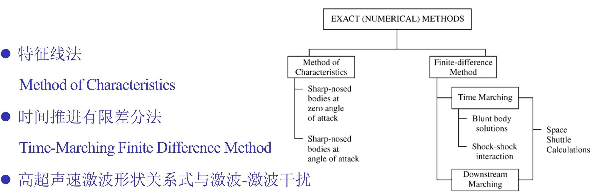

Correlations for Hypersonic Shock-Wave Shapes And Shock-Shock Interactions

- 有限差分空间推进法

Space-Marching Finite Difference Method

前情提要-特征线法

步骤:(1)从一条初值线开始

(a)对于附着激波的尖头物体，可以通过斜激波解或者Taylor - Maccoll锥形流解获得初值线的所有流动特性。

(b)对于脱体弓形激波的钝头体，需要得到适当的钝头体解。初值线必须沿着或者处于极限特征线的下游。

(2)沿着特征线向下游推进求解。

(3)假设通过点3的流线的角度为 ${\theta }_{3},{\theta }_{3}$ 为 ${\theta }_{1}$ 和 ${\theta }_{2}$ 的平均值。反向延长通过点 3的流线，与初值线相交得到点4。

(4)沿着特征线求解相容性方程，求解点3的流场信息。

$$
\frac{\mathrm{d}p}{\rho {V}^{2}\tan \mu } \pm  \mathrm{d}\theta  + \frac{j\sin \theta \sin \mu }{\sin \left( {\theta  \pm  \mu }\right) }\frac{\mathrm{d}y}{y} = 0\;\mathrm{\;d}p =  - {\rho V}\mathrm{\;d}V\;\mathrm{\;d}p = {a}^{2}\mathrm{\;d}\rho
$$

(5)重复第(2)-第(4)步，迭代至收敛。

前情提要-时间推进有限差分法

重点方程:

$$
{u}_{i, j}^{t + {\Delta t}} = {u}_{i, j}^{t} + {\left( \frac{\partial u}{\partial t}\right) }_{\text{ ave }}{\Delta t}
$$

激波边界条件:

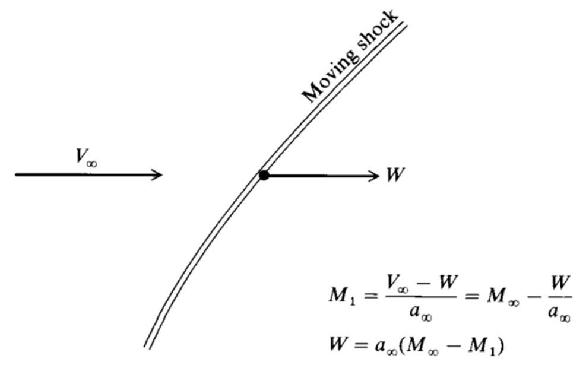

物面边界条件: $\frac{{p}_{\text{ new }}}{{\rho }_{\text{ old }}} = {\left\lbrack  1 \pm  \frac{\gamma  - 1}{2}\left( \frac{{V}_{n}}{{a}_{\text{ old }}}\right) \right\rbrack  }^{{2\gamma }/\left( {\gamma  - t}\right) }\;\frac{{T}_{\text{ new }}}{{T}_{\text{ old }}} = {\left\lbrack  1 \pm  \frac{\gamma  - 1}{2}\left( \frac{{V}_{n}}{{a}_{\text{ old }}}\right) \right\rbrack  }^{2}$

下游和中心线边界条件: $\;{p}_{j + 1} = {p}_{j - 1};\;{T}_{j + 1} = {T}_{j - 1};\;{u}_{j + 1} = {u}_{j - 1}\;{v}_{j + 1} \; {v}_{j + 1} =  - {v}_{j - 1}$

前情提要-高超声速激波形状与激波-激波干扰

激波形状关系式:

$$
x = R + \delta  - {R}_{c}{\cot }^{2}\beta \left\lbrack  {{\left( 1 + \frac{{y}^{2}{\tan }^{2}\beta }{{R}_{c}^{2}}\right) }^{1/2} - 1}\right\rbrack
$$

$\delta$ 和 ${R}_{\mathrm{c}}$ 有如下关系:

和

$$
\frac{{R}_{c}}{R} = \left\{  \begin{array}{l} {1.143}\exp \left\lbrack  {{0.54}/{\left( {M}_{\infty } - 1\right) }^{1.2}}\right\rbrack  \\  {1.386}\exp \left\lbrack  {{1.8}/{\left( {M}_{\infty } - 1\right) }^{0.75}}\right\rbrack   \end{array}\right.
$$

激波-激波干扰:

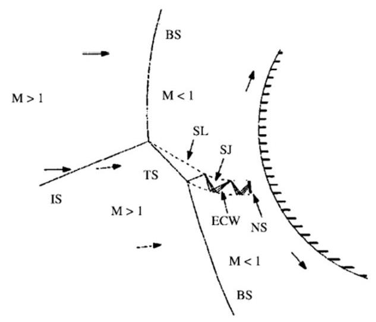

前情提要-有限差分空间推进法

重点方程:

$$
\frac{\partial E}{\partial \xi } =  - H - \frac{1}{\delta }\left( {-\eta \frac{\mathrm{d}\delta }{\mathrm{d}x} - \frac{\mathrm{d}b}{\mathrm{\;d}x}}\right) \frac{\partial E}{\partial \eta } - \frac{1}{\delta }\frac{\partial F}{\partial \eta }
$$

$$
{E}_{i + 1, j} = {E}_{i, j} + {\left( \frac{\partial E}{\partial \xi }\right) }_{\text{ ave }}{\Delta \xi }
$$

激波边界条件:

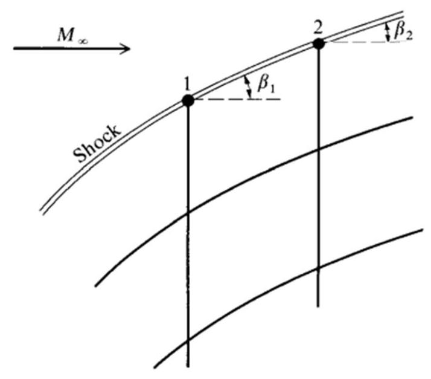

物面边界条件:

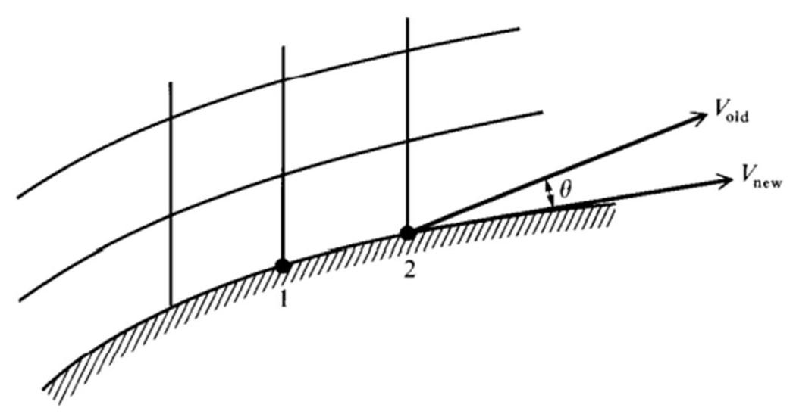

## 目录

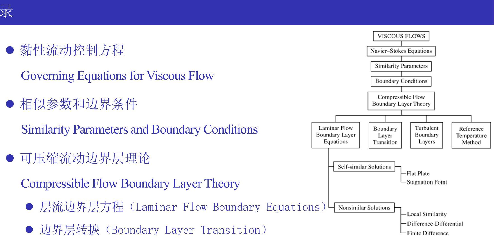

- 湍流边界层 (Turbulent Boundary Layers)

- 参考温度法(Reference Temperature Method)

黏性流动控制方程 (Governing Equations for Viscous Flow)

## 黏性流动控制方程

Continuity equation:

$$
\frac{\partial \rho }{\partial t} + \nabla  \cdot  \left( {\rho \mathbf{V}}\right)  = 0 \tag{6.1}
$$

$x$ Momentum:

$$
\rho \frac{\mathrm{D}u}{\mathrm{D}t} =  - \frac{\partial p}{\partial x} + \frac{\partial {\tau }_{xx}}{\partial x} + \frac{\partial {\tau }_{yx}}{\partial y} + \frac{\partial {\tau }_{zx}}{\partial z} \tag{6.2}
$$

$y$ Momentum:

$$
\rho \frac{\mathrm{D}v}{\mathrm{D}t} =  - \frac{\partial p}{\partial y} + \frac{\partial {\tau }_{xy}}{\partial x} + \frac{\partial {\tau }_{yy}}{\partial y} + \frac{\partial {\tau }_{zy}}{\partial z} \tag{6.3}
$$

$z$ Momentum:

$$
\rho \frac{\mathrm{D}w}{\mathrm{D}t} =  - \frac{\partial p}{\partial z} + \frac{\partial {\tau }_{xz}}{\partial x} + \frac{\partial {\tau }_{yz}}{\partial y} + \frac{\partial {\tau }_{zz}}{\partial z} \tag{6.4}
$$

黏性流动控制方程

Energy:

$$
\rho \frac{\mathrm{D}\left( {e + {V}^{2}/2}\right) }{\mathrm{D}t} = \rho \dot{q} + \frac{\partial }{\partial x}\left( {k\frac{\partial T}{\partial x}}\right)  + \frac{\partial }{\partial y}\left( {k\frac{\partial T}{\partial y}}\right)  + \frac{\partial }{\partial z}\left( {k\frac{\partial T}{\partial z}}\right)  - \nabla  \cdot  p\mathbf{V}
$$

$$
+ \frac{\partial \left( {u{\tau }_{xx}}\right) }{\partial x} + \frac{\partial \left( {u{\tau }_{yx}}\right) }{\partial y} + \frac{\partial \left( {u{\tau }_{zx}}\right) }{\partial z} + \frac{\partial \left( {v{\tau }_{xy}}\right) }{\partial x} + \frac{\partial \left( {v{\tau }_{yy}}\right) }{\partial y}
$$

$$
+ \frac{\partial \left( {v{\tau }_{zy}}\right) }{\partial z} + \frac{\partial \left( {w{\tau }_{xz}}\right) }{\partial x} + \frac{\partial \left( {w{\tau }_{yz}}\right) }{\partial y} + \frac{\partial \left( {w{\tau }_{zz}}\right) }{\partial z} \tag{6.5}
$$

where

$$
{\tau }_{xy} = {\tau }_{yx} = \mu \left( {\frac{\partial v}{\partial x} + \frac{\partial u}{\partial y}}\right) \tag{6.6a}
$$

$$
{\tau }_{xx} = \lambda \left( {\nabla  \cdot  \mathbf{V}}\right)  + {2\mu }\frac{\partial u}{\partial x} \tag{6.6d}
$$

$$
{\tau }_{yz} = {\tau }_{zy} = \mu \left( {\frac{\partial w}{\partial y} + \frac{\partial v}{\partial z}}\right) \tag{6.6b}
$$

$$
{\tau }_{yy} = \lambda \left( {\nabla  \cdot  \mathbf{V}}\right)  + {2\mu }\frac{\partial v}{\partial y} \tag{6.6e}
$$

$$
{\tau }_{zx} = {\tau }_{xz} = \mu \left( {\frac{\partial u}{\partial z} + \frac{\partial w}{\partial x}}\right) \tag{6.6c}
$$

$$
{\tau }_{zz} = \lambda \left( {\nabla  \cdot  \mathbf{V}}\right)  + {2\mu }\frac{\partial w}{\partial z} \tag{6.6f}
$$

相似参数和边界条件 (Similarity Parameters and Boundary Conditions)

相似参数对二维定常流动方程进行无量纲化:

$$
\frac{\partial \left( {\overline{\rho }\bar{u}}\right) }{\partial \bar{x}} + \frac{\partial \left( {\overline{\rho }\bar{v}}\right) }{\partial \bar{y}} = 0 \tag{6.7}
$$

$$
\overline{\rho }\bar{u}\frac{\partial \bar{u}}{\partial \bar{x}} + \overline{\rho }\bar{v}\frac{\partial \bar{u}}{\partial \bar{y}} =  - \frac{1}{\gamma {M}_{\infty }^{2}}\frac{\partial \bar{p}}{\partial \bar{x}} + \frac{1}{R{e}_{\infty }}\frac{\partial }{\partial \bar{y}}\left\lbrack  {\overline{\mu }\left( {\frac{\partial \bar{v}}{\partial \bar{x}} + \frac{\partial \bar{u}}{\partial \bar{y}}}\right) }\right\rbrack \tag{6.8}
$$

$$
\overline{\rho }\bar{u}\frac{\partial \bar{v}}{\partial \bar{x}} + \overline{\rho }\bar{v}\frac{\partial \bar{v}}{\partial \bar{y}} =  - \frac{1}{\gamma {M}_{\infty }^{2}}\frac{\partial \bar{p}}{\partial \bar{y}} + \frac{1}{R{e}_{\infty }}\frac{\partial }{\partial \bar{x}}\left\lbrack  {\overline{\mu }\left( {\frac{\partial \bar{v}}{\partial \bar{x}} + \frac{\partial \bar{u}}{\partial \bar{y}}}\right) }\right\rbrack \tag{6.9}
$$

$$
\overline{\rho }\bar{u}\frac{\partial \bar{e}}{\partial \bar{x}} + \rho \bar{v}\frac{\partial \bar{e}}{\partial \bar{y}} =  - \frac{\gamma \left( {\gamma  - 1}\right) }{2}{M}_{\infty }^{2}\left\lbrack  {\overline{\rho }\bar{u}\frac{\partial }{\partial \bar{x}}\left( {{\bar{u}}^{2} + {\bar{v}}^{2}}\right)  + \overline{\rho }\bar{v}\frac{\partial }{\partial \bar{y}}\left( {{\bar{u}}^{2} + {\bar{v}}^{2}}\right) }\right\rbrack
$$

$$
+ \frac{\gamma }{{\Pr }_{\infty }{\operatorname{Re}}_{\infty }}\left\lbrack  {\frac{\partial }{\partial \bar{x}}\left( {\bar{k}\frac{\partial \bar{T}}{\partial \bar{x}}}\right)  + \frac{\partial }{\partial \bar{y}}\left( {\bar{k}\frac{\partial \bar{T}}{\partial \bar{y}}}\right) }\right\rbrack   - \left( {\gamma  - 1}\right) \left\lbrack  {\frac{\partial \left( {\bar{u}\bar{p}}\right) }{\partial \bar{x}} + \frac{\partial \left( {\bar{v}\bar{p}}\right) }{\partial \bar{y}}}\right\rbrack
$$

$$
+ \gamma \left( {\gamma  - 1}\right) \frac{{M}_{\infty }^{2}}{R{e}_{\infty }}\left\{  {\frac{\partial }{\partial \bar{x}}\left\lbrack  {\overline{\mu }\bar{v}\left( {\frac{\partial \bar{v}}{\partial \bar{x}} + \frac{\partial \bar{u}}{\partial \bar{y}}}\right) }\right\rbrack   + \frac{\partial }{\partial \bar{y}}\left\lbrack  {\overline{\mu }\bar{u}\left( {\frac{\partial \bar{v}}{\partial \bar{x}} + \frac{\partial \bar{u}}{\partial \bar{y}}}\right) }\right\rbrack  }\right\}
$$

(6.10)

## 相似参数

无量纲化后的N-S方程出现几个无量纲参数:

比热比:

$$
\gamma  = \frac{{c}_{p}}{{c}_{v}}
$$

马赫数:

$$
{M}_{\infty } = \frac{{V}_{\infty }}{{a}_{\infty }}
$$

$$
M{a}_{\infty } \propto  \frac{\text{ 流动动能 }}{\text{ 流动内能 }}
$$

雷诺数:

$$
{Re} = \frac{{\rho }_{\infty }{V}_{\infty }c}{{\mu }_{\infty }}
$$

$$
R{\mathrm{e}}_{\infty } \propto  \frac{\text{ 惯性力 }}{\text{ 黏性力 }}
$$

普朗特数:

$$
P{r}_{\infty } \propto  \frac{\text{ 摩擦耗散 }}{\text{ 热传导 }}
$$

边界条件

物面边界条件: $u = v = 0$

壁面常温边界条件: $T = {T}_{w}$

传热壁边界条件:

${q}_{w} =  - k{\left( \frac{\partial T}{\partial n}\right) }_{w}$

可压缩流动边界层理论 (Compressible Flow Boundary Layer Theory)

## 层流边界层方程

对二维定常流动无量纲方程进行简化:

连续方程:

$$
\frac{\partial \left( {\overline{\rho }\bar{u}}\right) }{\partial \bar{x}} + \frac{\partial \left( {\overline{\rho }\bar{v}}\right) }{\partial \bar{y}} = 0 \tag{6.7}
$$

边界层的厚度相对物体尺寸非常薄: $\delta  \ll  c$

$$
\frac{\left\lbrack  {0\left( 1\right) }\right\rbrack  \left\lbrack  {0\left( 1\right) }\right\rbrack  }{0\left( 1\right) } + \frac{\left\lbrack  {0\left( 1\right) }\right\rbrack  \left\lbrack  \bar{v}\right\rbrack  }{0\left( \delta \right) } = 0
$$

## 层流边界层方程

X方向动量方程:

$$
\overline{\rho }\bar{u}\frac{\partial \bar{u}}{\partial \bar{x}} + \overline{\rho }\bar{v}\frac{\partial \bar{u}}{\partial \bar{y}} =  - \frac{1}{\gamma {M}_{\infty }^{2}}\frac{\partial \bar{p}}{\partial \bar{x}} + \frac{1}{R{e}_{\infty }}\frac{\partial }{\partial \bar{y}}\left\lbrack  {\overline{\mu }\left( {\frac{\partial \bar{v}}{\partial \bar{x}} + \frac{\partial \bar{u}}{\partial \bar{y}}}\right) }\right\rbrack
$$

$$
\overline{\rho }\bar{u}\frac{\partial \bar{u}}{\partial \bar{x}} = 0\left( 1\right) \;\overline{\rho }\bar{v}\frac{\partial \bar{u}}{\partial \bar{y}} = 0\left( 1\right) \;\frac{\partial \bar{p}}{\partial \bar{x}} = 0\left( 1\right)
$$

$$
\frac{\partial }{\partial \bar{y}}\left( {\overline{\mu }\frac{\partial \bar{v}}{\partial \bar{x}}}\right)  = 0\left( 1\right) \;\frac{\partial }{\partial \bar{y}}\left( {\overline{\mu }\frac{\partial \bar{u}}{\partial \bar{y}}}\right)  = 0\left( \frac{1}{{\delta }^{2}}\right)
$$

$$
0\left( 1\right)  + 0\left( 1\right)  =  - \frac{1}{\gamma {M}_{\infty }^{2}}0\left( 1\right)  + \frac{1}{R{e}_{\infty }}\left\lbrack  {0\left( 1\right)  + 0\left( \frac{1}{{\delta }^{2}}\right) }\right\rbrack
$$

$$
\frac{1}{R{e}_{\infty }} = 0\left( {\delta }^{2}\right)
$$

$$
0\left( 1\right)  + 0\left( 1\right)  =  - \frac{1}{\gamma {M}_{\infty }^{2}}0\left( 1\right)  + 0\left( {\delta }^{2}\right) \left\lbrack  {0\left( 1\right)  + 0\left( \frac{1}{{\delta }^{2}}\right) }\right\rbrack
$$

(6.8)

大雷诺数假设:

## 层流边界层方程

Y方向动量方程:

$$
\overline{\rho }\bar{u}\frac{\partial \bar{v}}{\partial \bar{x}} + \overline{\rho }\bar{v}\frac{\partial \bar{v}}{\partial \bar{y}} =  - \frac{1}{\gamma {M}_{\infty }^{2}}\frac{\partial \bar{p}}{\partial \bar{y}} + \frac{1}{R{e}_{\infty }}\frac{\partial }{\partial \bar{x}}\left\lbrack  {\overline{\mu }\left( {\frac{\partial \bar{v}}{\partial \bar{x}} + \frac{\partial \bar{u}}{\partial \bar{y}}}\right) }\right\rbrack \tag{6.9}
$$

$$
0\left( \delta \right)  + 0\left( \delta \right)  =  - \frac{1}{\gamma {M}_{\infty }^{2}}\frac{\partial \bar{p}}{\partial \bar{y}} + 0\left( {\delta }^{2}\right) \left\lbrack  {0\left( \delta \right)  + 0\left( \frac{1}{\delta }\right) }\right\rbrack \tag{6.24}
$$

假设:

$$
\gamma {M}_{\infty }^{2} = 0\left( 1\right)
$$

$$
\partial \bar{p}/\partial \bar{y} = 0\left( \delta \right)
$$

即:

$$
\frac{\partial p}{\partial y} = 0 \tag{6.25}
$$

层流边界层方程

能量方程:

$$
\overline{\rho }\bar{u}\frac{\partial \bar{e}}{\partial \bar{x}} + \rho \bar{v}\frac{\partial \bar{e}}{\partial \bar{y}} =  - \frac{\gamma \left( {\gamma  - 1}\right) }{2}{M}_{\infty }^{2}\left\lbrack  {\overline{\rho }\bar{u}\frac{\partial }{\partial \bar{x}}\left( {{\bar{u}}^{2} + {\bar{v}}^{2}}\right)  + \overline{\rho }\bar{v}\frac{\partial }{\partial \bar{y}}\left( {{\bar{u}}^{2} + {\bar{v}}^{2}}\right) }\right\rbrack
$$

$$
+ \frac{\gamma }{{\Pr }_{\infty }{\operatorname{Re}}_{\infty }}\left\lbrack  {\frac{\partial }{\partial \bar{x}}\left( {\bar{k}\frac{\partial \bar{T}}{\partial \bar{x}}}\right)  + \frac{\partial }{\partial \bar{y}}\left( {\bar{k}\frac{\partial \bar{T}}{\partial \bar{y}}}\right) }\right\rbrack   - \left( {\gamma  - 1}\right) \left\lbrack  {\frac{\partial \left( {\bar{u}\bar{p}}\right) }{\partial \bar{x}} + \frac{\partial \left( {\bar{v}\bar{p}}\right) }{\partial \bar{y}}}\right\rbrack
$$

$$
+ \gamma \left( {\gamma  - 1}\right) \frac{{M}_{\infty }^{2}}{R{e}_{\infty }}\left\{  {\frac{\partial }{\partial \bar{x}}\left\lbrack  {\overline{\mu }\bar{v}\left( {\frac{\partial \bar{v}}{\partial \bar{x}} + \frac{\partial \bar{u}}{\partial \bar{y}}}\right) }\right\rbrack   + \frac{\partial }{\partial \bar{y}}\left\lbrack  {\overline{\mu }\bar{u}\left( {\frac{\partial \bar{v}}{\partial \bar{x}} + \frac{\partial \bar{u}}{\partial \bar{y}}}\right) }\right\rbrack  }\right\}
$$

(6.10)

假设:

$$
{\rho u}\frac{\partial h}{\partial x} + {\rho v}\frac{\partial h}{\partial y} = \frac{\partial }{\partial y}\left( {k\frac{\partial T}{\partial y}}\right)  + u\frac{\partial p}{\partial x} + \mu {\left( \frac{\partial u}{\partial y}\right) }^{2} \tag{6.26}
$$

层流边界层方程

简化后的方程:

$$
\text{ Continuity: }\frac{\partial \left( {\rho u}\right) }{\partial x} + \frac{\partial \left( {\rho v}\right) }{\partial y} = 0
$$

(6.27)

$$
x\text{ Momentum: }{\rho u}\frac{\partial u}{\partial x} + {\rho v}\frac{\partial u}{\partial y} =  - \frac{\mathrm{d}{p}_{e}}{\mathrm{\;d}x} + \frac{\partial }{\partial y}\left( {\mu \frac{\partial u}{\partial y}}\right) \tag{6.28}
$$

$y$ Momentum: $\frac{\partial p}{\partial y} = 0$(6.29)

$$
\text{ Energy: }{\rho u}\frac{\partial h}{\partial x} + {\rho v}\frac{\partial h}{\partial y} = \frac{\partial }{\partial y}\left( {k\frac{\partial T}{\partial y}}\right)  + u\frac{\mathrm{d}{p}_{e}}{\mathrm{\;d}x} + \mu {\left( \frac{\partial u}{\partial y}\right) }^{2} \tag{6.30}
$$

在物面处:

$$
y = 0,\;u = 0,\;v = 0,\;T = {T}_{w}
$$

边界条件: 在绝热壁:

$$
{\left( \frac{\partial T}{\partial n}\right) }_{w} = 0
$$

在边界层边缘:

$$
y \rightarrow  \infty ,\;u \rightarrow  {u}_{e},\;T \rightarrow  {T}_{e}
$$

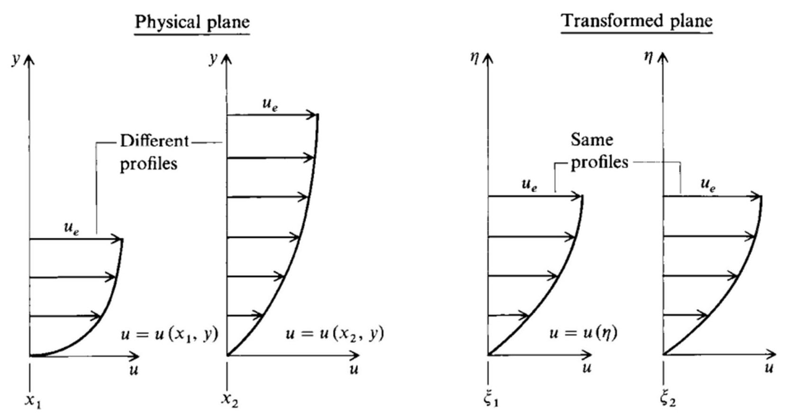

Fig. 6.5 Illustration of the concept of self-similarity.

## 自相似解

对边界层方程式 (6-27) -式 (6-30) 进行变换:

$$
\xi  = {\int }_{0}^{x}{\rho }_{e}{u}_{e}{\mu }_{e}\mathrm{\;d}x \tag{6.33}
$$

$$
\eta  = \frac{{u}_{e}}{\sqrt{2\xi }}{\int }_{0}^{y}\rho \mathrm{d}y \tag{6.34}
$$

步骤1: 自变量变换。

$$
\frac{\partial }{\partial x} = \left( \frac{\partial }{\partial \xi }\right) \left( \frac{\partial \xi }{\partial x}\right)  + \left( \frac{\partial }{\partial \eta }\right) \left( \frac{\partial \eta }{\partial x}\right) \tag{6.35}
$$

$$
\frac{\partial }{\partial y} = \left( \frac{\partial }{\partial \xi }\right) \left( \frac{\partial \xi }{\partial y}\right)  + \left( \frac{\partial }{\partial \eta }\right) \left( \frac{\partial \eta }{\partial y}\right) \tag{6.36}
$$

自相似解

$$
\frac{\partial \xi }{\partial x} = {\rho }_{e}{u}_{e}{\mu }_{e} \tag{6.37a}
$$

$$
\frac{\partial \xi }{\partial y} = 0 \tag{6.37b}
$$

$$
\frac{\partial \eta }{\partial y} = \frac{{u}_{e}\rho }{\sqrt{2\xi }} \tag{6.37c}
$$

引入流函数定义:

$$
\frac{\partial \psi }{\partial y} = {\rho u} \tag{6.40a}
$$

$$
\frac{\partial \psi }{\partial x} =  - {\rho v} \tag{6.40b}
$$

$$
\frac{\partial \psi }{\partial y}\frac{\partial u}{\partial x} - \frac{\partial \psi }{\partial x}\frac{\partial u}{\partial y} =  - \frac{\mathrm{d}{p}_{e}}{\mathrm{\;d}x} + \frac{\partial }{\partial y}\left( {\mu \frac{\partial u}{\partial y}}\right) \tag{6.41}
$$

$$
\frac{\partial \psi }{\partial \eta }\left\lbrack  {{\rho }_{e}{u}_{e}{\mu }_{e}\frac{\partial u}{\partial \xi } + \left( \frac{\partial \eta }{\partial x}\right) \frac{\partial u}{\partial \eta }}\right\rbrack   - \left\lbrack  {{\rho }_{e}{u}_{e}{\mu }_{e}\frac{\partial \psi }{\partial \xi } + \left( \frac{\partial \eta }{\partial x}\right) \frac{\partial \psi }{\partial \eta }}\right\rbrack  \frac{\partial u}{\partial \eta }
$$

$$
=  - \sqrt{2\xi }\frac{{\rho }_{e}}{\rho }{\mu }_{e}\frac{\mathrm{d}{p}_{e}}{\mathrm{\;d}\xi } + \frac{\partial }{\partial \eta }\left( {\frac{{u}_{e}{\rho \mu }}{\sqrt{2\xi }}\frac{\partial u}{\partial \eta }}\right) \tag{6.43}
$$

## 自相似解

步骤2: 因变量变换。

$$
\frac{u}{{u}_{e}} = \frac{\partial f}{\partial \eta } \equiv  {f}^{\prime } \tag{6.44}
$$

$$
\frac{\partial u}{\partial \xi } = {f}^{\prime }\frac{\mathrm{d}{u}_{e}}{\mathrm{\;d}\xi } + {u}_{e}\frac{\partial {f}^{\prime }}{\partial \xi } \tag{6.45}
$$

$$
\frac{\partial u}{\partial \eta } = {u}_{e}{f}^{\prime \prime } \tag{6.46}
$$

步骤3:用 $\psi$ 对 $f$ 进行表达。

对式 (6-40) 进行变换，有: $\;\frac{\partial \psi }{\partial \eta } = \sqrt{2\xi }{f}^{\prime }$(6.47)

$$
\frac{\partial \psi }{\partial \xi } = \sqrt{2\xi }\frac{\partial f}{\partial \xi } + \frac{1}{\sqrt{2\xi }}f \tag{6.50}
$$

## 自相似解

步骤4:得到最终变换方程。将式(6-45)-式(6-47)和式(6-50)代入式(6-43)， 得到:

$$
\sqrt{2\xi }{f}^{\prime }\left\lbrack  {{\rho }_{e}{u}_{e}{\mu }_{e}\left( {{f}^{\prime }\frac{\mathrm{d}{u}_{e}}{\mathrm{\;d}\xi } + {u}_{e}\frac{\partial {f}^{\prime }}{\partial \xi }}\right)  + \left( \frac{\partial \eta }{\partial x}\right) {u}_{e}{f}^{\prime \prime }}\right\rbrack
$$

$$
- \left\lbrack  {{\rho }_{e}{u}_{e}{\mu }_{e}\left( {\sqrt{2\xi }\frac{\partial f}{\partial \xi } + \frac{1}{\sqrt{2\xi }}f}\right)  + \left( \frac{\partial \eta }{\partial x}\right) \sqrt{2\xi }{f}^{\prime }}\right\rbrack  {u}_{e}{f}^{\prime \prime }
$$

$$
=  - \sqrt{2\xi }\frac{{\rho }_{e}}{\rho }{\mu }_{e}\frac{\mathrm{d}{p}_{e}}{\mathrm{\;d}\xi } + \frac{\partial }{\partial \eta }\left( {\frac{{u}_{e}^{2}{\rho \mu }}{\sqrt{2\xi }}{f}^{\prime \prime }}\right) \tag{6.51}
$$

另有:

$$
\mathrm{d}{p}_{e} =  - {\rho }_{e}{u}_{e}\mathrm{\;d}{u}_{e}
$$

$$
\frac{1}{{u}_{e}}{\left( {f}^{\prime }\right) }^{2}\frac{\mathrm{d}{u}_{e}}{\mathrm{\;d}\xi } + {f}^{\prime }\frac{\partial {f}^{\prime }}{\partial \xi } - \frac{\partial f}{\partial \xi }{f}^{\prime \prime } - \frac{1}{2\xi }f{f}^{\prime \prime } = \frac{{\rho }_{e}}{\rho }\frac{1}{{u}_{e}}\frac{\mathrm{d}{u}_{e}}{\mathrm{\;d}\xi } + \frac{\partial }{\partial \eta }\left( {\frac{1}{2\xi }\frac{\rho \mu }{{\rho }_{e}{\mu }_{e}}{f}^{\prime \prime }}\right) \tag{6.54}
$$

## 自相似解

最终变换方程为:

$$
{\left( C{f}^{\prime \prime }\right) }^{\prime } + f{f}^{\prime \prime } = \frac{2\xi }{{u}_{e}}\left\lbrack  {{\left( {f}^{\prime }\right) }^{2} - \frac{{\rho }_{e}}{\rho }}\right\rbrack  \frac{\mathrm{d}{u}_{e}}{\mathrm{\;d}\xi } + {2\xi }\left( {{f}^{\prime }\frac{\partial {f}^{\prime }}{\partial \xi } - \frac{\partial f}{\partial \xi }{f}^{\prime \prime }}\right) \tag{6.55}
$$

$$
\frac{\partial p}{\partial \eta } = 0 \tag{6.56}
$$

$$
{\left( \frac{C}{\Pr }{g}^{\prime }\right) }^{\prime } + f{g}^{\prime } = {2\xi }\left\lbrack  {{f}^{\prime }\frac{\partial g}{\partial \xi } + \frac{{f}^{\prime }g}{{h}_{e}}\frac{\partial {h}_{e}}{\partial \xi } - {g}^{\prime }\frac{\partial f}{\partial \xi } + \frac{{\rho }_{e}{u}_{e}}{\rho {h}_{e}}{f}^{\prime }\frac{\mathrm{d}{u}_{e}}{\mathrm{\;d}\xi }}\right\rbrack   - C\frac{{u}_{e}^{2}}{{h}_{e}}{\left( {f}^{\prime \prime }\right) }^{2} \tag{6.58}
$$

其中: $\;C = {\rho \mu }/{\rho }_{e}{\mu }_{e}$

## 自相似解

最终变换方程为:

$$
{\left( C{f}^{\prime \prime }\right) }^{\prime } + f{f}^{\prime \prime } = \frac{2\xi }{{u}_{e}}\left\lbrack  {{\left( {f}^{\prime }\right) }^{2} - \frac{{\rho }_{e}}{\rho }}\right\rbrack  \frac{\mathrm{d}{u}_{e}}{\mathrm{\;d}\xi } + {2\xi }\left( {{f}^{\prime }\frac{\partial {f}^{\prime }}{\partial \xi } - \frac{\partial f}{\partial \xi }{f}^{\prime \prime }}\right) \tag{6.55}
$$

$$
\frac{\partial p}{\partial \eta } = 0 \tag{6.56}
$$

$$
{\left( \frac{C}{\Pr }{g}^{\prime }\right) }^{\prime } + f{g}^{\prime } = {2\xi }\left\lbrack  {{f}^{\prime }\frac{\partial g}{\partial \xi } + \frac{{f}^{\prime }g}{{h}_{e}}\frac{\partial {h}_{e}}{\partial \xi } - {g}^{\prime }\frac{\partial f}{\partial \xi } + \frac{{\rho }_{e}{u}_{e}}{\rho {h}_{e}}{f}^{\prime }\frac{\mathrm{d}{u}_{e}}{\mathrm{\;d}\xi }}\right\rbrack   - C\frac{{u}_{e}^{2}}{{h}_{e}}{\left( {f}^{\prime \prime }\right) }^{2} \tag{6.58}
$$

其中: $\;C = {\rho \mu }/{\rho }_{e}{\mu }_{e}$

自相似解

在固定壁面温度的壁面: $\;\eta  = 0,\;f = {f}^{\prime } = 0,\;g = {g}_{w}$

边界条件: 在绝热壁: ${g}^{\prime } = 0$

在边界层边缘:

$$
\eta  \rightarrow  \infty ,\;{f}^{\prime } = 1,\;g = 1
$$

通常，采用合适的边界时，对式(6-55)、式(6-56)和式(6-58) 进行求解， 可得到通过 $u = {u}_{e}{f}^{\prime \prime }\left( {\xi ,\eta }\right)$ 和 $h = {h}_{e}g\left( {\xi ,\eta }\right)$ 表现的在整个边界层内的速度和焓的变化。 从图中可以看出壁面速度和焓梯度是一般边界层解中的一部分, 以 ${f}^{\prime \prime }\left( {\xi ,0}\right)$ 和 ${g}^{\prime }\left( {\xi ,0}\right)$ 给出。从应用角度出发, 这才是边界层解真正要得到的结果, 因为当地表面摩擦系数与 ${f}^{\prime \prime }\left( {\xi ,0}\right)$ 相关,当地壁面热换率与 ${g}^{\prime }\left( {\xi ,0}\right)$ 相关。

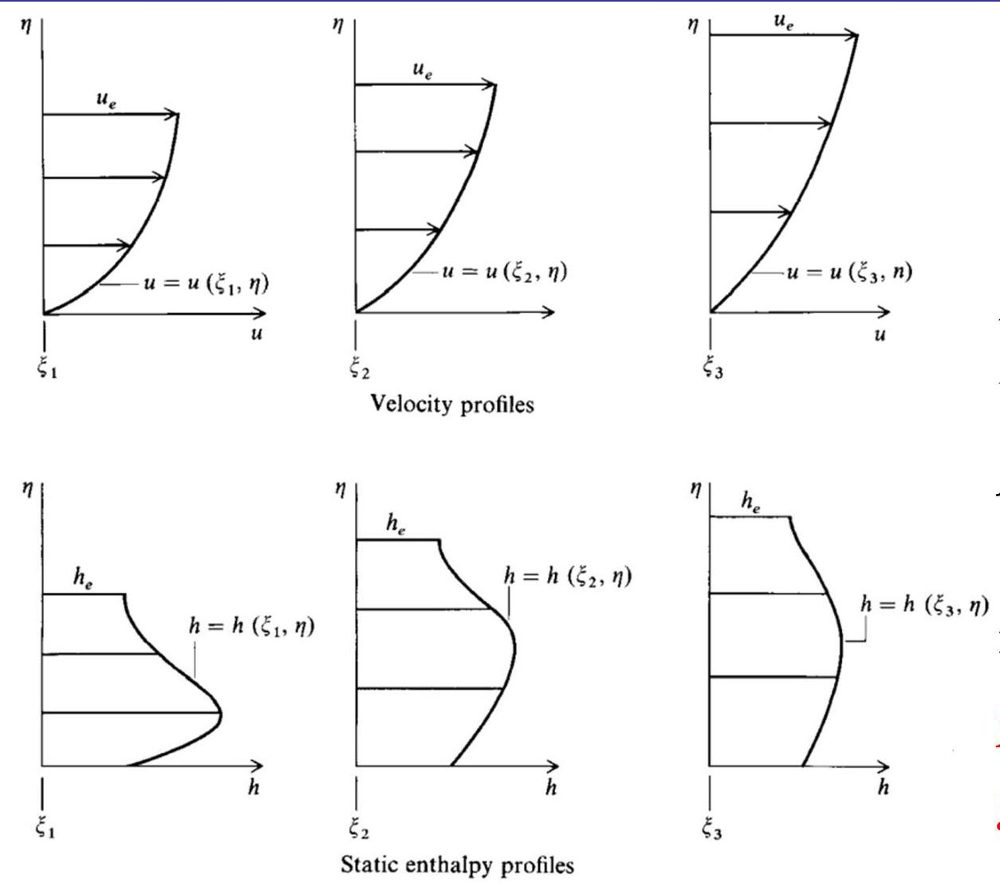

Fig. 6.6 Qualitative sketches of nonsimilar boundary-layer profiles.

## 自相似解

当地表面摩擦系数为: $\;{c}_{f} = \frac{{\tau }_{w}}{\frac{1}{2}{\rho }_{e}{u}_{e}^{2}}\;$ 其中: $\;{\tau }_{w} = {\left\lbrack  \mu \left( \frac{\partial u}{\partial y}\right) \right\rbrack  }_{w}$

$$
{c}_{f} = \frac{2{\mu }_{w}{\rho }_{w}}{{\rho }_{e}\sqrt{2\xi }}{f}^{\prime \prime }\left( {\xi ,0}\right) \tag{6.61}
$$

当地传热系数可以用努塞尔数或者斯坦顿数表示:

$$
{Nu} = \frac{{q}_{w}x}{{k}_{e}\left( {{T}_{\mathrm{{aw}}} - {T}_{w}}\right) } \tag{6.62}
$$

$$
{C}_{H} = \frac{{q}_{w}}{{\rho }_{e}{u}_{e}\left( {{h}_{\mathrm{{aw}}} - {h}_{w}}\right) } \tag{6.63}
$$

$$
{Nu} = {C}_{H}{RePr}
$$

$$
{C}_{H} = \frac{1}{\sqrt{2\xi }}\frac{{k}_{w}}{{c}_{{p}_{w}}}\frac{{\rho }_{w}}{{\rho }_{e}}\frac{{h}_{e}}{\left( {h}_{\mathrm{{aw}}} - {h}_{w}\right) }{g}^{\prime }\left( {\xi ,0}\right) \tag{6.65}
$$

自相似解一平板问题

$$
{\left( C{f}^{\prime \prime }\right) }^{\prime } + f{f}^{\prime \prime } = 0
$$

(6.68)

常微分方程:

$$
{\left( \frac{C}{Pr}{g}^{\prime }\right) }^{\prime } + f{g}^{\prime } + C\frac{{u}_{e}^{2}}{{h}_{e}}{\left( {f}^{\prime \prime }\right) }^{2} = 0 \tag{6.69}
$$

壁面条件:

$$
f\left( 0\right)  = 0\;{f}^{\prime }\left( 0\right)  = 0\;g\left( 0\right)  = {g}_{w}
$$

根据以下方法求出 ${f}^{\prime \prime }\left( 0\right)$ 和 ${g}^{\prime }\left( 0\right)$ 的值:

1) Assume values for ${f}^{\prime \prime }\left( 0\right)$ and ${g}^{\prime }\left( 0\right)$ . Numbers on the order of 0.5 to 1.0 are usually good assumptions.

2) Numerically integrate Eqs. (6.68) and (6.69) across the boundary layer, going to large enough values of $\eta$ such that ${f}^{\prime }\left( \eta \right)$ and $g\left( \eta \right)$ become relatively constant with $\eta$ . This would correspond to conditions outside the boundary layer.

3) Do the resulting values of ${f}^{\prime }\left( \eta \right)$ and $g\left( \eta \right)$ at large $\eta$ approach ${f}^{\prime }\left( \eta \right)  = 1$ and $g\left( \eta \right)  = 1$ , which are the appropriate boundary conditions at the edge of the boundary layer? If not, return to step 1, and assume new values for ${f}^{\prime \prime }\left( 0\right)$ and ${g}^{\prime }\left( 0\right)$ .

4) Repeat steps 1-3 until the proper values for ${f}^{\prime \prime }\left( 0\right)$ and ${g}^{\prime }\left( 0\right)$ are assumed at the wall such that the integration of Eqs. (6.68) and (6.69) produces the proper results at large $\eta$ , namely, ${f}^{\prime }\left( \eta \right)  = 1$ and $g\left( \eta \right)  = 1$ .

自相似解一平板问题

对式 (6-61) 和式 (6-65) 进行简化得:

$$
{c}_{f} = \sqrt{2}\frac{{\rho }_{w}{\mu }_{w}}{{\rho }_{e}{\mu }_{e}}\frac{{f}^{\prime \prime }\left( 0\right) }{\sqrt{R{e}_{x}}} \tag{6.71}
$$

$\frac{{\rho }_{w}}{{\rho }_{e}} = \frac{{T}_{e}}{{T}_{w}}$

$\frac{{\mu }_{w}}{{\mu }_{e}} = {\left( \frac{{T}_{w}}{{T}_{e}}\right) }^{n}$

${c}_{f} = \sqrt{2}{\left( \frac{{T}_{w}}{{T}_{e}}\right) }^{n - 1}\frac{{f}^{\prime \prime }\left( 0\right) }{\sqrt{R{e}_{x}}}$

$$
{c}_{f}\left( \text{ compressible }\right)  = \frac{F\left( {{M}_{e},{Pr},\gamma ,{T}_{w}/{T}_{e}}\right) }{\sqrt{R{e}_{x}}}
$$

$$
{c}_{f}\left( \text{ incompressible }\right)  = \frac{0.664}{\sqrt{R{e}_{x}}}
$$

## 自相似解一平板问题

同理, 对于传热系数也有:

$$
{C}_{H} = \frac{1}{\sqrt{2}}\frac{1}{{\mu }_{e}}\frac{{k}_{w}}{{c}_{pw}}\frac{{\rho }_{w}}{{\rho }_{e}}\frac{{h}_{e}}{\left( {h}_{\mathrm{{aw}}} - {h}_{w}\right) }\frac{{g}^{\prime }\left( 0\right) }{\sqrt{R{e}_{x}}} \tag{6.77}
$$

$$
{C}_{H} = \frac{1}{\sqrt{2}}{\left( \frac{{T}_{w}}{{T}_{e}}\right) }^{n - 1}\frac{1}{P{r}_{w}}\frac{1}{\left( {T}_{\mathrm{{aw}}}/{T}_{e} - {T}_{w}/{T}_{e}\right) }\frac{{g}^{\prime }\left( 0\right) }{\sqrt{R{e}_{x}}}
$$

$$
{C}_{H}\left( \text{ compressible }\right)  = \frac{G\left( {{M}_{e},{Pr},\gamma ,{T}_{w}/{T}_{e}}\right) }{\sqrt{R{e}_{x}}}
$$

$$
{C}_{H}\left( \text{ incompressible }\right)  = \frac{0.332}{\sqrt{R{e}_{x}}}P{r}^{-2/3}
$$

壁面摩擦系数与传热系数的关系:

$$
\frac{{C}_{H}}{{C}_{f}}\text{ (incompressible) } = \frac{1}{2}P{r}^{-2/3}\;\frac{{C}_{H}}{{C}_{f}}\text{ (compressible) } = \frac{G}{F} = f\left( {{M}_{e},{Pr},\gamma ,\frac{{T}_{w}}{{T}_{e}}}\right)
$$

## 自相似解-平板问题

结果:

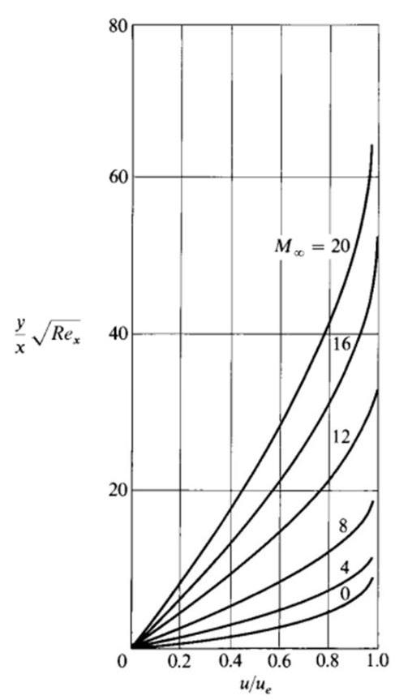

Fig. 6.7 Velocity profiles in a compressible laminar boundary layer over an insulated flat plate (from Van Driest [90]).

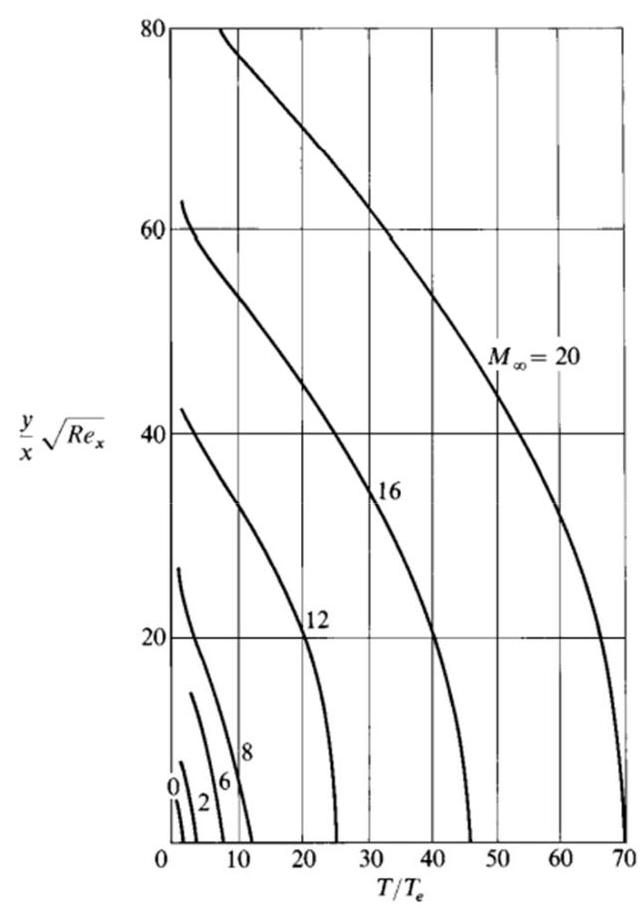

Fig. 6.8 Temperature profiles in a compressible laminar boundary layer over an insulated flat plate (from [90]).

## 自相似解-平板问题

结果:

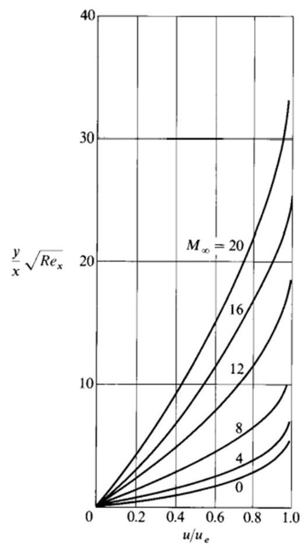

Fig. 6.9 Velocity profiles in a laminar, compressible boundary layer over a cold plate [90].

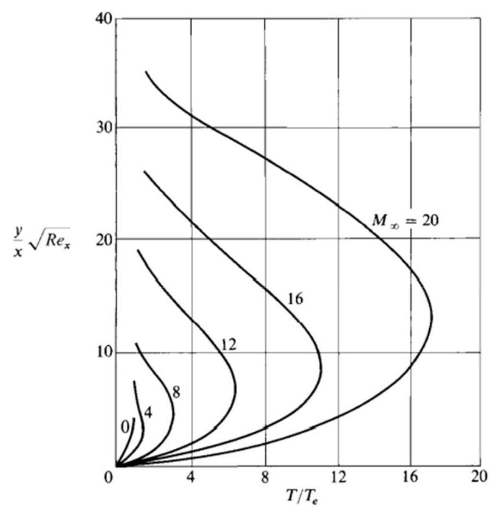

Fig. 6.10 Temperature profiles in a laminar, compressible boundary layer over a cold flat plate [90].

自相似解一平板问题

## 结果:

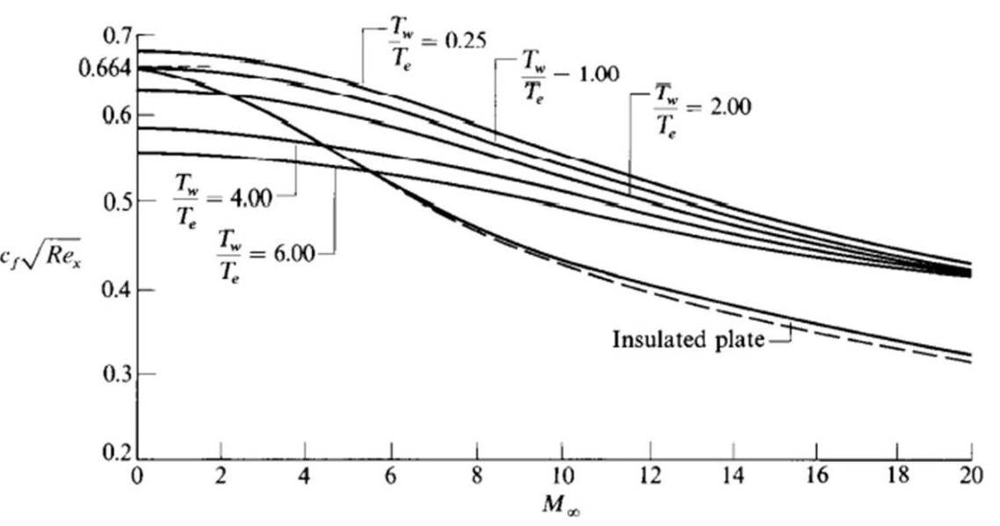

Fig. 6.11 Flat-plate skin-friction coefficients [90].

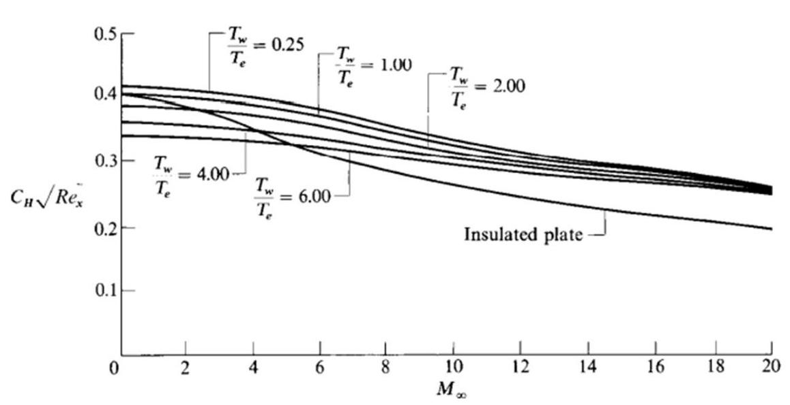

Fig. 6.12 Flat-plate Stanton numbers [90].

## 自相似解-驻点问题

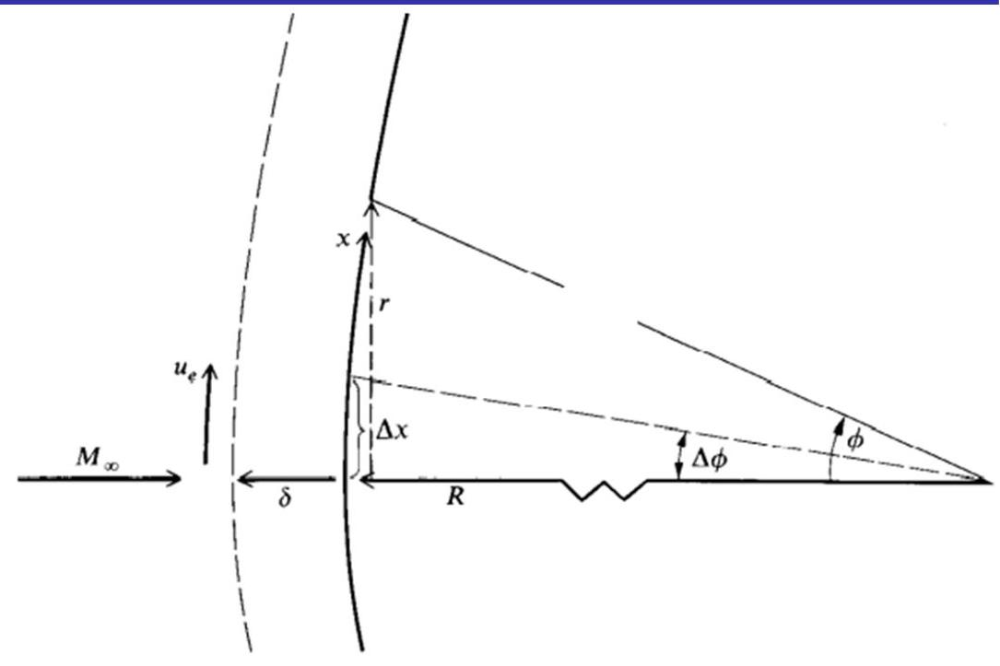

与平板问题相同的化简过程, 得到驻点边界层可压缩流动控制方程:

$$
{\left( C{f}^{\prime \prime }\right) }^{\prime } + f{f}^{\prime \prime } = {\left( {f}^{\prime }\right) }^{2} - g \tag{6.104}
$$

$$
{\left( \frac{C}{Pr}{g}^{\prime }\right) }^{\prime } + f{g}^{\prime } = 0 \tag{6.105}
$$

柱体:

$$
{q}_{w} = {0.57}\mathop{\Pr }\limits^{{-{0.6}}}{\left( {\rho }_{e}{\mu }_{e}\right) }^{1/2}\sqrt{\frac{\mathrm{d}{u}_{e}}{\mathrm{\;d}x}}\left( {{h}_{\mathrm{{aw}}} - {h}_{w}}\right) \tag{6.106}
$$

球体:

$$
{q}_{w} = {0.763P}{r}^{-{0.6}}{\left( {\rho }_{e}{\mu }_{e}\right) }^{1/2}\sqrt{\frac{\mathrm{d}{u}_{e}}{\mathrm{\;d}x}}\left( {{h}_{\mathrm{{aw}}} - {h}_{w}}\right) \tag{6.111}
$$

## 自相似解一驻点问题

前驻点气动加热与速度梯度有关:

$$
\mathrm{d}{p}_{e} =  - {\rho }_{e}{u}_{e}\mathrm{\;d}{u}_{e} \tag{6.112}
$$

$$
\frac{\mathrm{d}{u}_{e}}{\mathrm{\;d}x} =  - \frac{1}{{\rho }_{e}{u}_{e}}\frac{\mathrm{d}{p}_{e}}{\mathrm{\;d}x} \tag{6.113}
$$

根据牛顿理论, 可以化简为:

$$
\frac{\mathrm{d}{u}_{e}}{\mathrm{\;d}x} = \frac{1}{R}\sqrt{\frac{2\left( {{p}_{e} - {p}_{\infty }}\right) }{{\rho }_{e}}} \tag{6.121}
$$

$$
{q}_{w} \propto  \frac{1}{\sqrt{R}} \tag{6.122}
$$

自相似解一驻点问题

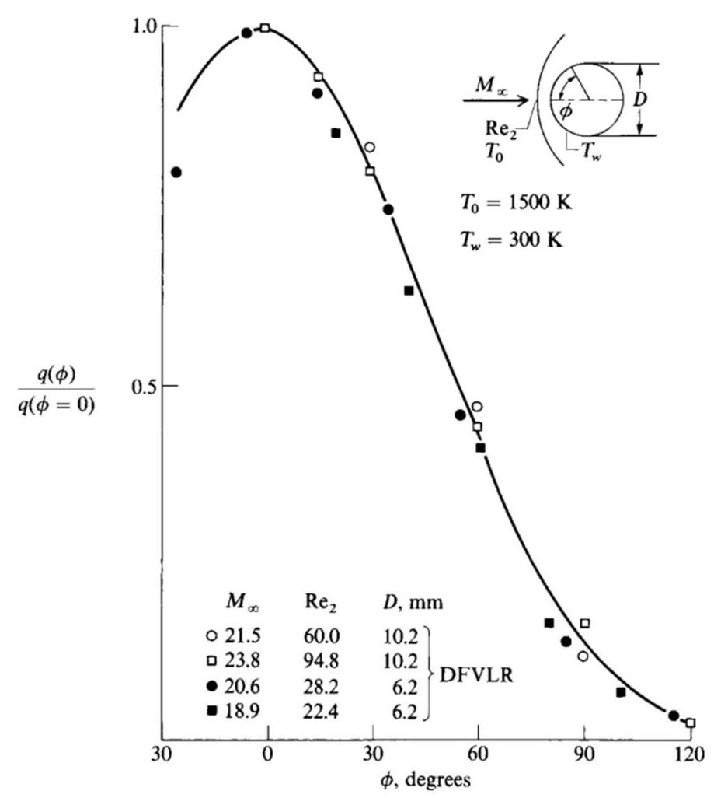

Fig. 6.17 Heat-transfer distribution around a circular cylinder (from [81]).

结果:

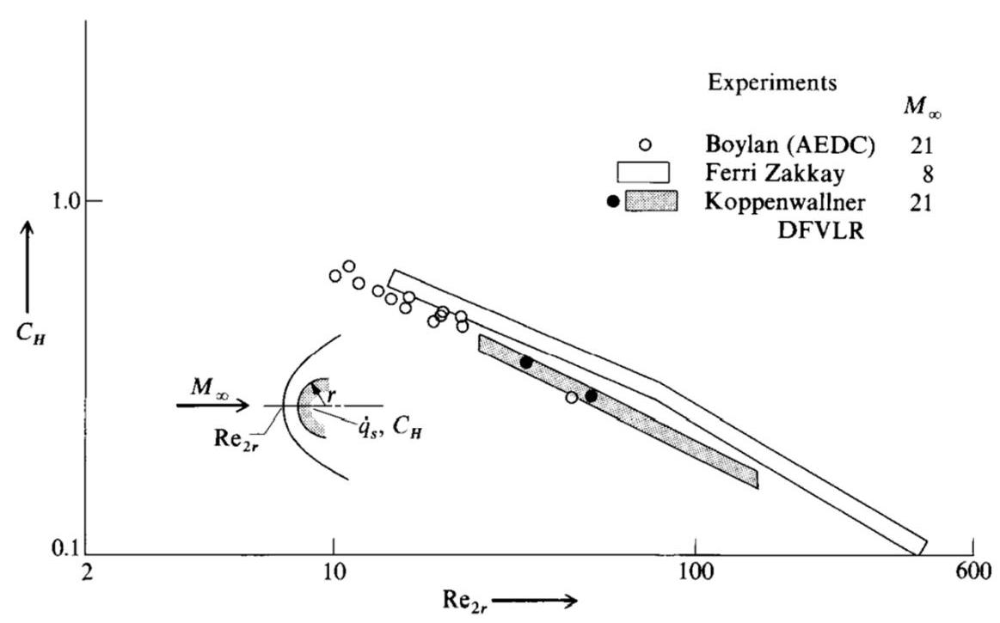

Fig. 6.16 Stagnation-point Stanton number vs Re based on nose radius (from Koppenwallner [81]).

非相似解-当地相似解法

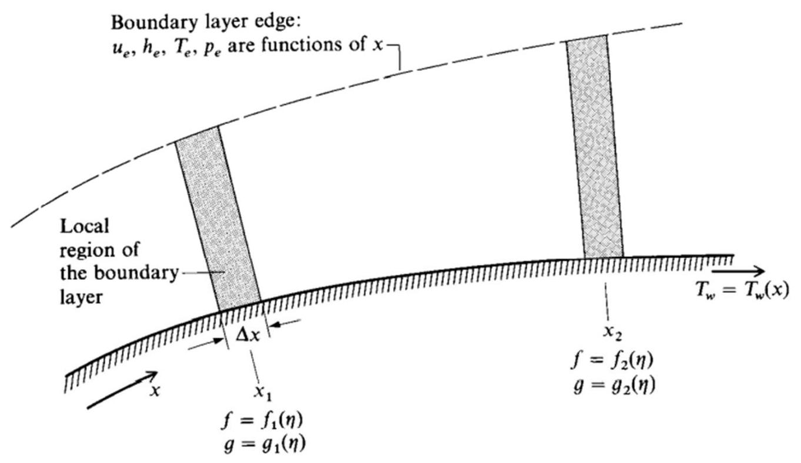

Fig. 6.18 Schematic for the concept of local similarity.

当地相似解方法的概念:

(1)考虑一个边界层，其外缘及壁面流动参数沿x方向是任意变换的。

非相似解-当地相似解法

$$
{\left( C{f}^{\prime \prime }\right) }^{\prime } + f{f}^{\prime \prime } = \frac{2\xi }{{u}_{e}}\left\lbrack  {{\left( {f}^{\prime }\right) }^{2} - \frac{{\rho }_{e}}{\rho }}\right\rbrack  \frac{\mathrm{d}{u}_{e}}{\mathrm{\;d}\xi } + {2\xi }\left( {{f}^{\prime }\frac{\partial {f}^{\prime }}{\partial \xi } - \frac{\partial f}{\partial \xi }{f}^{\prime \prime }}\right) \tag{6.55}
$$

$$
{\left( \frac{C}{\Pr }{g}^{\prime }\right) }^{\prime } + f{g}^{\prime } = {2\xi }\left\lbrack  {{f}^{\prime }\frac{\partial g}{\partial \xi } + \frac{{f}^{\prime }g}{{h}_{e}}\frac{\partial {h}_{e}}{\partial \xi } - {g}^{\prime }\frac{\partial f}{\partial \xi } + \frac{{\rho }_{e}{u}_{e}}{\rho {h}_{e}}{f}^{\prime }\frac{\mathrm{d}{u}_{e}}{\mathrm{\;d}\xi }}\right\rbrack   - C\frac{{u}_{e}^{2}}{{h}_{e}}{\left( {f}^{\prime \prime }\right) }^{2} \tag{6.58}
$$

(2)将经一般变换的边界层方程式(6-55)和式(6-58)应用在某点 $x$ ，如 $x = {x}_{1}$ 处边界层的小片上。所取切片厚度 ${\Delta x}$ 足够小， ${T}_{w}$ ， ${u}_{e}$ ， ${h}_{e}$ 等变量的值等于各自在 ${x}_{1}$ 处的当地值。

(3)在式(6-55)和式(6-58)中忽略小量。

## 非相似解一当地相似解法

(4)在上面的假设下，有:

${\left( C{f}^{\prime \prime }\right) }^{\prime } + f{f}^{\prime \prime } = \frac{2\xi }{{u}_{e}}\left\lbrack  {{\left( {f}^{\prime }\right) }^{2} - g}\right\rbrack  \frac{\mathrm{d}{u}_{e}}{\mathrm{\;d}\xi }$(6.123)

$$
{\left( \frac{C}{Pr}{g}^{\prime }\right) }^{\prime } + f{g}^{\prime } = {2\xi }\frac{{\rho }_{e}{u}_{e}}{\rho {h}_{e}}{f}^{\prime }\frac{\mathrm{d}{u}_{e}}{\mathrm{\;d}\xi } - C\frac{{u}_{e}^{2}}{{h}_{e}}{\left( {f}^{\prime \prime }\right) }^{2} + {2\xi }\frac{{f}^{\prime }g}{{h}_{e}}\frac{\partial {h}_{e}}{\partial \xi } \tag{6.124}
$$

利用打靶法求解常微分方程

(5)在另外一个 $x$ 位置，即 $x = {x}_{2}$ ，取另外一个边界层切片，重复前面的过程。 且有:

$$
{f}_{1}\left( \eta \right)  \neq  {f}_{2}\left( \eta \right)
$$

$$
{g}_{1}\left( \eta \right)  \neq  {g}_{2}\left( \eta \right)
$$

(6)将上述求解过程应用到所有 $x$ 值，可以得到关于 $x$ 的表面摩擦和热传导。

非相似解-当地相似解法

结果:

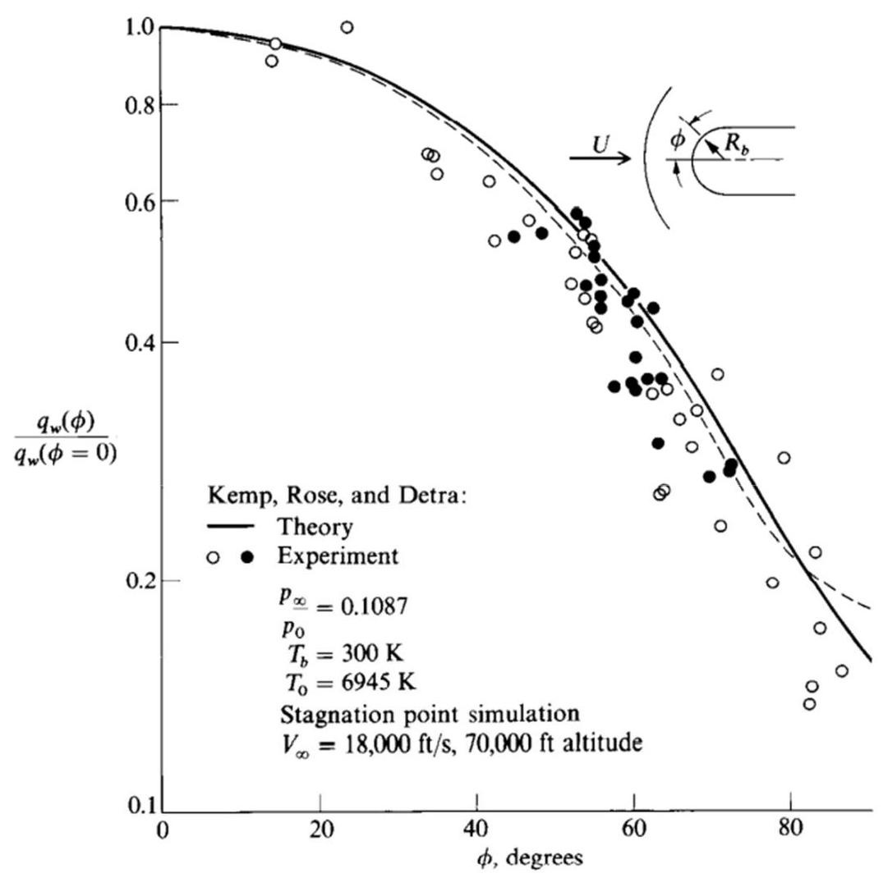

Fig. 6.19 Comparison of the local similarity method with shock-tube data for the heat-transfer distribution over a hemisphere-cylinder (from [95]).

非相似解-差分-微分方法(6.127) (6.128)

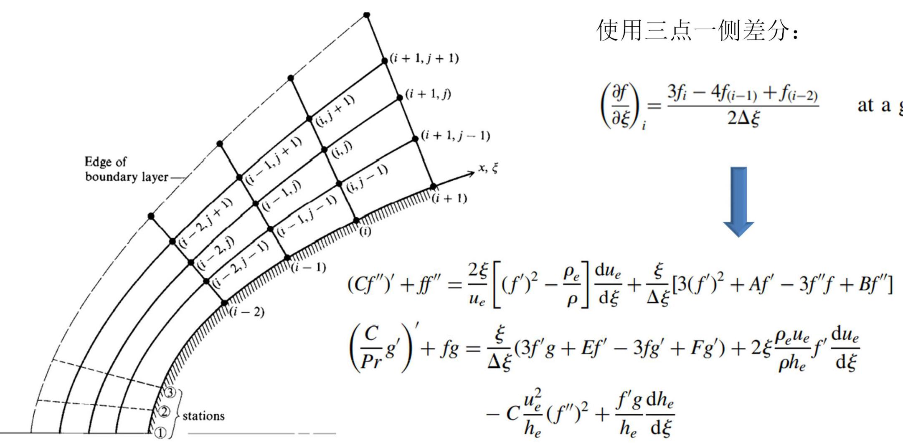

Fig. 6.20 Schematic for finite difference solution of the boundary layer.

非相似解-差分-微分方法

结果:

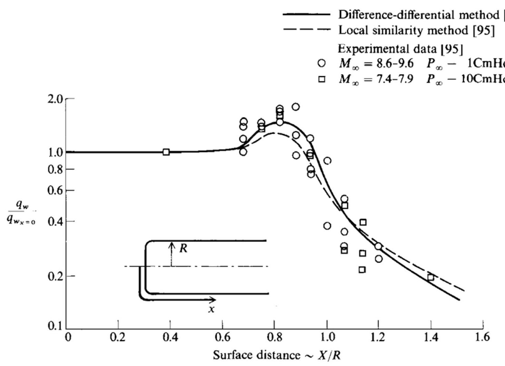

Fig. 6.21 Heat-transfer distribution over a flat-faced cylinder (from [97]).

## 非相似解一有限差分方法

一般的有限差分的求解过程是, 通过将给定的网格点处的各偏导数用有限差分值代替构建该点的偏微分控制方程。则式(6-55)和式(6-58)中的各偏导数为:

$$
\frac{\partial f}{\partial \xi } = \frac{{f}_{i + 1, j} - {f}_{i, j}}{\Delta \xi } \tag{6.129}
$$

$$
\frac{\partial f}{\partial \eta } = \frac{\theta \left( {{f}_{i + 1, j + 1} - {f}_{i + 1, j - 1}}\right) }{2\Delta \eta } + \frac{\left( {1 - \theta }\right) \left( {{f}_{i, j + 1} - {f}_{i, j - 1}}\right) }{2\Delta \eta } \tag{6.130}
$$

$$
\frac{{\partial }^{2}f}{\partial {\eta }^{2}} = \frac{\theta \left( {{f}_{i + 1, j + 1} - 2{f}_{i + 1, j} + {f}_{i + 1, j - 1}}\right) }{{\left( \Delta \eta \right) }^{2}} + \frac{\left( {1 - \theta }\right) \left( {{f}_{i, j + 1} - 2{f}_{i, j} + {f}_{i, j - 1}}\right) }{{\left( \Delta \eta \right) }^{2}} \tag{6.131}
$$

$$
f = \theta {f}_{i + 1, j} + \left( {1 - \theta }\right) {f}_{i, j} \tag{6.132}
$$

## 非相似解-有限差分方法

有限差分方法解一般非相似边界层问题的数值过程:

(1)求解过程中必须从前缘点或者驻点处给定的解开始。给定的解可以从适当的相似解得到。

(2)在下一个下游点，即站位2处。式(6-129)-式(6-132)所反映的有限差分解方法给出穿过边界层的流场变量。

(3)在得到边界层的速度型和温度型后，物面上的表面摩擦应力和热传输

可以由下式确定:

$$
{\left( \frac{\partial u}{\partial y}\right) }_{w} = \frac{-3{u}_{1} + 4{u}_{2} - {u}_{3}}{2\Delta y} \tag{6.133}
$$

$$
\tau  = {\left\lbrack  \mu \left( \frac{\partial u}{\partial y}\right) \right\rbrack  }_{w}\;q = {\left( k\frac{\partial T}{\partial y}\right) }_{w}
$$

$$
{\left( \frac{\partial T}{\partial y}\right) }_{w} = \frac{-3{T}_{1} + 4{T}_{2} - {T}_{3}}{2\Delta y} \tag{6.134}
$$

(4)对再接下来的下游位置，即站位3处，前面的各步重复执行。

非相似解-有限差分方法

结果:

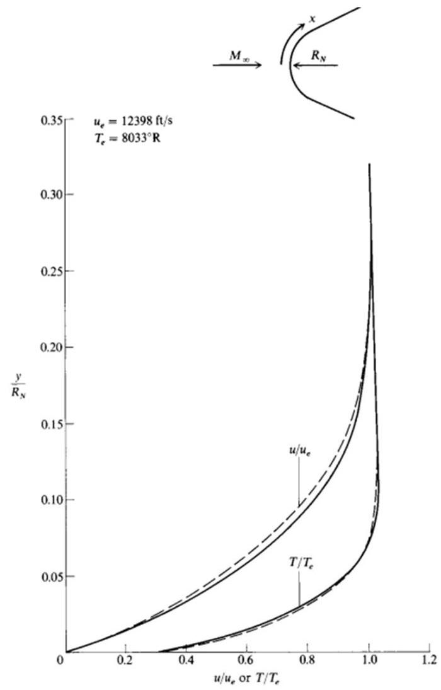

Fig. 6.22 Velocity and temperature profiles across the boundary layer at $x/{R}_{N} = {50}$ on an axisymmetric hyperboloid (from Blottner [94]).

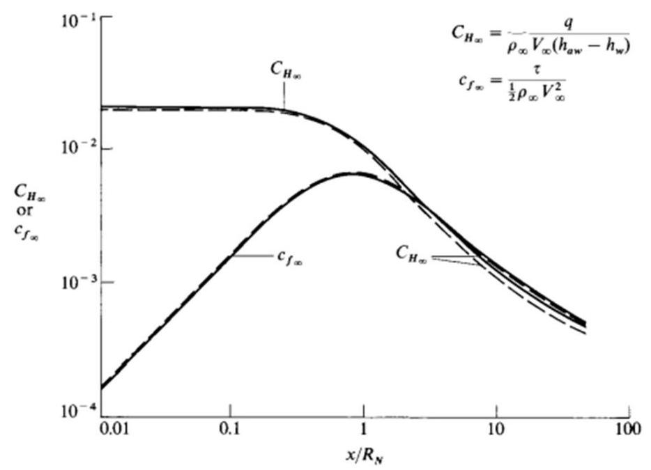

Fig. 6.23 Stanton number and skin-friction coefficient (based on freestream properties) along a hyperboloid (from [94]).

高超声速转捩

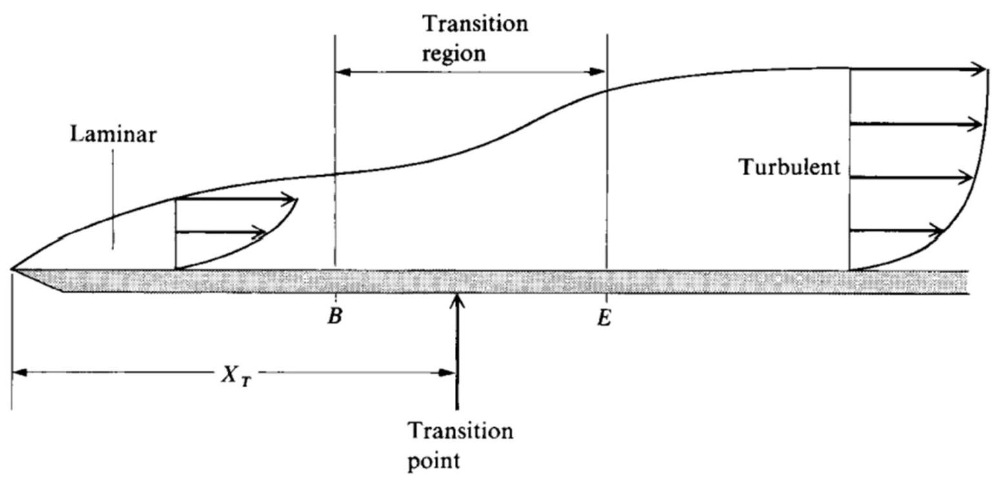

转捩雷诺数:

$$
R{e}_{T} = \frac{{\rho }_{e}{u}_{e}{x}_{T}}{{\mu }_{e}}
$$

$$
R{e}_{T} = f\left( {{M}_{e},{\theta }_{c},{T}_{w},\dot{m},\alpha ,{k}_{R}, E,\frac{\partial p}{\partial x},{R}_{N}, R{e}_{\infty }/\mathrm{{ft}},\frac{x}{{R}_{N}}, V, C,\frac{\partial w}{\partial z},{T}_{0},{d}^{ * },\tau , Z}\right)
$$

## 高超声速转捩-影响因素

马赫数: 边界层稳定性理论表明, 通过增大马赫数可以增强层流边界层的稳定性, 所以, $R{\mathrm{e}}_{T}$ 随 $M{a}_{e}$ 的增大而增大。

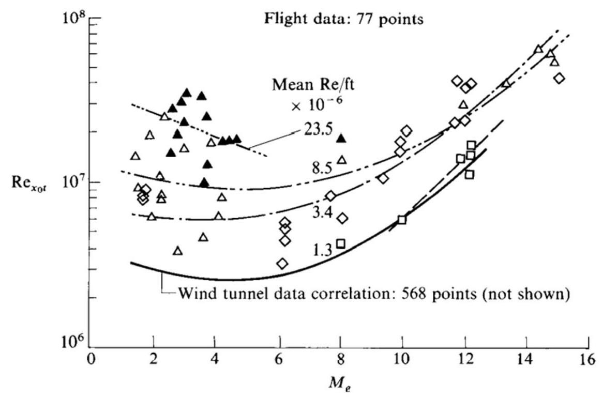

Fig. 6.25 Transition Reynolds-number data on sharp cones from wind tunnels and free flight (from Stetson [100]).

## 高超声速转捩-影响因素

环境:

转捩对环境产生的扰动很敏感，如来流湍流度、源自物体内外的声激励、 由风洞壁面活跃的湍流边界层在风洞中诱发的扰动。

单位雷诺数:

没有物理成因表明单位雷诺数会影响转捩, 然而, 试验数据明显表现出与单位雷诺数的关联性。

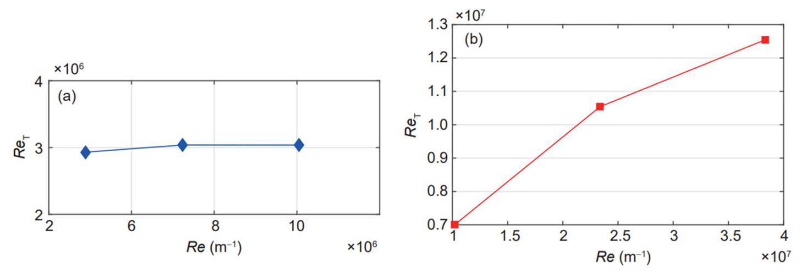

图 2 (网络版彩图)单位雷诺数对转捩雷诺数的影响. (a) $r = {0.05}\mathrm{\;{mm}}$ ; (b) $r = 5\mathrm{\;{mm}}$

陈坚强等.高超声速边界层转捩的几点认识[J].中国科学:物理学 力学 天文学,2019,49(11):125-138.

高超声速转捩-影响因素

## 迎角:

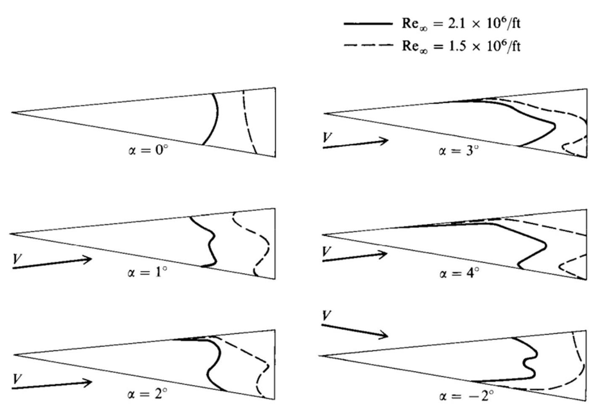

Fig. 6.26 Effect on angle of attack on boundary-layer transition on a sharp cone; ${\theta }_{c} = 8\deg$ (from DiCristina,[102]).

高超声速转捩-影响因素

头部钝度:

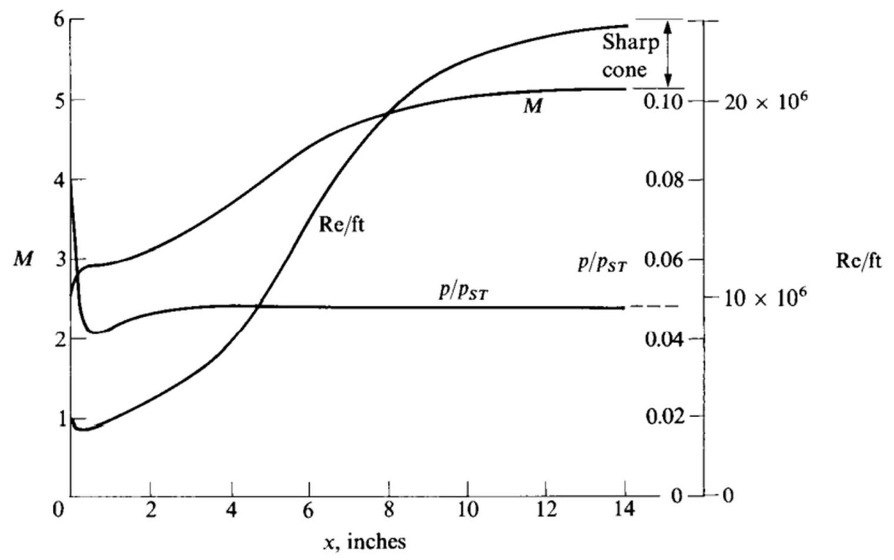

Fig. 6.28 Calculations of inviscid flow over a slender, blunted cone at $\alpha  = 0$ deg, ${M}_{\infty } = {5.9}$ , and ${\theta }_{c} = 8$ deg. Nose-tip radius ${R}_{N} = {0.04}$ in. (from [100]).

## 高超声速转捩-影响因素

壁面温度:

对于中等冷却对高超声速边界层起稳定作用, 且转捩雷诺数增大。然而对于深冷却壁面, 出现了相反的迹象。

## 转捩的预测:

方法一:基于参照边界层动量厚度 $\theta$ 的转捩雷诺数。

$$
\theta  = {\int }_{0}^{\delta }\frac{\rho u}{{\rho }_{e}{u}_{e}}\left( {1 - \frac{u}{{u}_{e}}}\right) \mathrm{d}y
$$

$R{e}_{{\theta }_{T}} = \frac{{\rho }_{e}{u}_{e}{\theta }_{T}}{{\mu }_{e}}$ 经验关系式: $\frac{R{e}_{{\theta }_{T}}}{{M}_{e}} = {100}$

方法二: 基于锥体气动数据的预估关联。

$$
{\log }_{10}\left( {R{e}_{T}}\right)  = {6.421}\exp \left\lbrack  {{1.209} \times  {10}^{-4}{M}_{e}^{2.641}}\right\rbrack
$$

## 高超声速湍流边界层

Baldwin - Lomax湍流模型:

湍流的 $x$ 分量边界层方程:

$$
{\rho u}\frac{\partial u}{\partial x} + {\rho v}\frac{\partial u}{\partial y} =  - \frac{\partial p}{\partial x} + \frac{\partial }{\partial y}\left\lbrack  {\left( {\mu  + {\mu }_{T}}\right) \frac{\partial u}{\partial y}}\right\rbrack \tag{6.141}
$$

$$
{\mu }_{T} = \left\{  \begin{array}{l} {\left( {\mu }_{T}\right) }_{\text{ inner }}y \leq  {y}_{\text{ crossover }} \\  {\left( {\mu }_{T}\right) }_{\text{ outer }}y \geq  {y}_{\text{ crossover }} \end{array}\right. \tag{6.142}
$$

对于内层:

$$
{\left( {\mu }_{T}\right) }_{\text{ inner }} = \rho {l}^{2}\left| \omega \right|
$$

$$
l = {ky}\left\lbrack  {1 - \exp \left( \frac{-{y}^{ + }}{{A}^{ + }}\right) }\right\rbrack \tag{6.144}
$$

其中:

$$
{y}^{ + } = \frac{\sqrt{{\rho }_{w}{\tau }_{w}}y}{{\mu }_{w}} \tag{6.145}
$$

对于外层:

$$
{\left( {\mu }_{T}\right) }_{\text{ outer }} = {\rho K}{C}_{\mathrm{{cp}}}{F}_{\text{ wake }}{F}_{\text{ Kleb }}
$$

where $K$ and ${C}_{\mathrm{{cp}}}$ are two additional constants and ${F}_{\text{ wake }}$ and ${F}_{\text{ Kleb }}$ are related to the function

$$
F\left( y\right)  = y\left| \omega \right| \left\lbrack  {1 - \exp \left( \frac{-{y}^{ + }}{{A}^{ + }}\right) }\right\rbrack \tag{6.148}
$$

其中: $\;\omega  = \frac{\partial u}{\partial y} - \frac{\partial v}{\partial x}$

$$
{F}_{\mathrm{{Klcb}}}\left( y\right)  = {\left\lbrack  1 + {5.5}{\left( {C}_{\mathrm{{Klcb}}}\frac{y}{{y}_{\max }}\right) }^{6}\right\rbrack  }^{-1}
$$

高超声速湍流边界层

结果:

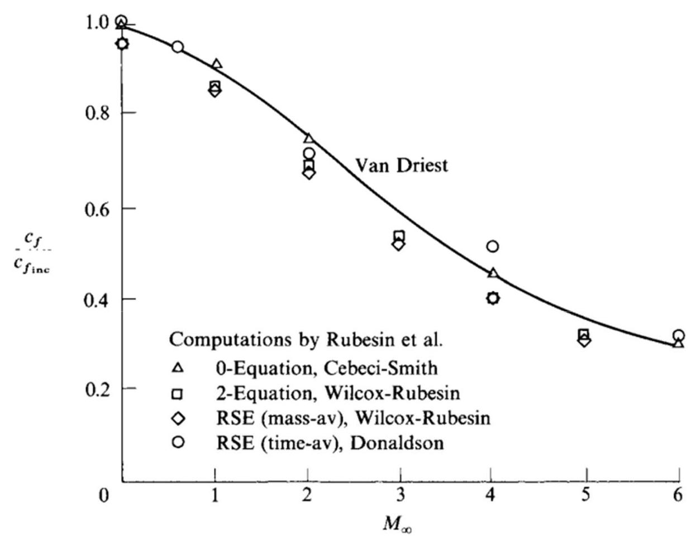

Fig. 6.30 Effects of compressibility on turbulent skin friction on a flat plate: adiabatic wall, where $R{e}_{L} = {10}^{7}$ (from Marvin [107]).

## 参考温度方法

参考温度方法: 该方法时高超声速层流和湍流摩擦阻力和传热的近似工程方法。它基于应用由不可压缩流动理论得到的公式的简单思想, 这些公式中的热力学和传输特性是以能够代表边界层内某处的温度的参考温度来估算的。

不可压层流:

$$
{c}_{f} = \frac{0.664}{\sqrt{R{e}_{x}}} \tag{6.153}
$$

$$
{C}_{f} = \frac{1.328}{\sqrt{R{e}_{c}}} \tag{6.153a}
$$

$$
{C}_{H} = \frac{0.332}{\sqrt{R{e}_{x}}}P{r}^{-2/3} \tag{6.154}
$$

参考温度方法

可压缩层流:

$$
{c}_{f}^{ * } = \frac{0.664}{\sqrt{R{e}_{c}^{ * }}} \tag{6.155}
$$

$$
{C}_{f}^{ * } = \frac{1.328}{\sqrt{R{e}_{c}^{ * }}} \tag{6.155a}
$$

$$
{C}_{H}^{ * } = \frac{0.332}{\sqrt{R{e}_{x}^{ * }}}{\left( P{r}^{ * }\right) }^{-2/3} \tag{6.156}
$$

where ${c}_{f}^{ * },{C}_{f}^{ * },{C}_{H}{}^{ * }, R{e}_{x}{}^{ * }, R{e}_{c}{}^{ * }$ , and $P{r}^{ * }$ are evaluated at a reference temperature ${T}^{ * }$ . That is,

$$
{c}_{f}^{ * } = \frac{{\tau }_{w}}{\frac{1}{2}{\rho }^{ * }{u}_{e}^{2}}
$$

(6.157a)

$$
R{e}_{x}^{ * } = \frac{{\rho }^{ * }{u}_{e}x}{{\mu }^{ * }}
$$

(6.158a)

$$
{C}_{f}^{ * } = \frac{{D}_{f}}{\frac{1}{2}{\rho }^{ * }{u}_{e}^{2}S}
$$

(6.157b)

$$
R{e}_{c}^{ * } = \frac{{\rho }^{ * }{u}_{e}c}{{\mu }^{ * }} \tag{6.158b}
$$

$$
{C}_{H}^{ * } = \frac{{q}_{w}}{{\rho }^{ * }{u}_{e}\left( {{h}_{\mathrm{{aw}}} - {h}_{w}}\right) }
$$

(6.157c)

$$
P{r}^{ * } = \frac{{\mu }^{ * }{c}_{p}^{ * }}{{k}^{ * }} \tag{6.158c}
$$

参考温度方法 where ${\rho }^{ * },{\mu }^{ * },{c}_{p}^{ * }$ and ${k}^{ * }$ are evaluated for the reference temperature ${T}^{ * }$ ,

$$
\frac{{T}^{ * }}{{T}_{e}} = 1 + {0.032}{M}_{e}^{2} + {0.58}\left( {\frac{{T}_{w}}{{T}_{e}} - 1}\right) \tag{6.159}
$$

不可压湍流流动:

$$
{c}_{f} = \frac{0.0592}{{\left( R{e}_{x}\right) }^{0.2}} \tag{6.160}
$$

可压缩湍流流动:

$$
{c}_{f}^{ * } = \frac{0.0592}{{\left( R{e}_{x}^{ * }\right) }^{0.2}} \tag{6.161}
$$

绕平板湍流流动的传热可以由雷诺比拟的形式进行近似估算:

$$
{C}_{H} = \frac{{c}_{f}}{2s} \tag{6.162}
$$