# 高超声速黏性流动中的计算流体力学方法 (Computational-Fluid-Dynamic Solutions of Hypersonic Viscous Flows)

李文丰

西北工业大学

w.li@nwpu.edu.cn

2022年11月2日

## 前情提要-压力黏性干扰

黏性干扰:在外部无黏流动和边界层之间，典型的高超声速黏性干扰是由在高超声速下出现的非常大的边界层厚度导致的。

$$
\frac{\delta }{x} \propto  \frac{{M}_{e}^{2}}{\sqrt{Re}}
$$

主导层流黏性干扰的相似参数: $\;\overline{\chi } = \frac{{M}_{\infty }^{3}}{\sqrt{Re}}\sqrt{C}\;C = \frac{{\rho }_{w}{\mu }_{w}}{{\rho }_{e}{\mu }_{e}}$

强相互作用:

$$
\frac{{p}_{e}}{{p}_{\infty }} = 1 + {a}_{1}\overline{\chi }
$$

弱相互作用:

$$
\frac{{p}_{e}}{{p}_{\infty }} = 1 + {b}_{1}\overline{\chi } + {b}_{2}{\overline{\chi }}^{2}
$$

前情提要-激波/边界层干扰

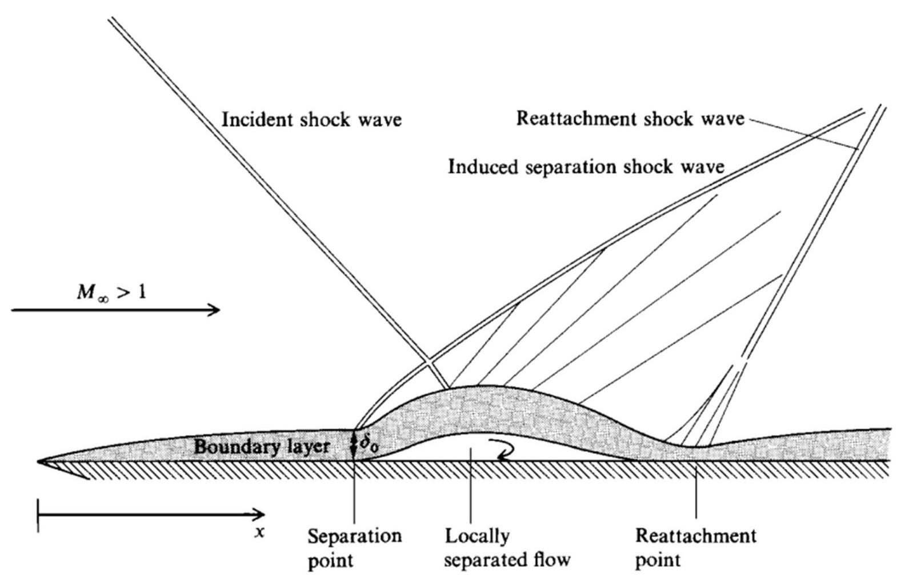

Fig. 7.14 Schematic of the shock-wave boundary-layer interaction.

## 目录

• 黏性激波层技术

Viscous Shock-Layer Technique

- 抛物化N-S方程

Parabolized Navier-Stokes Solutions

- 全N-S方程

Full Navier-Stokes Solutions

黏性激波层技术 (Viscous Shock-Layer Technique)

## 黏性激波层技术

## 什么是黏性激波层技术(VSL)？

用一个于N-S方程相近的方程组求解绕过钝头体的高超声速流动的全黏性激波层。

黏性激波层方程式通过在边界层坐标 (平行和垂直于物面)中列出全N-S 方程, 并且对方程中的数量级进行分析得到。

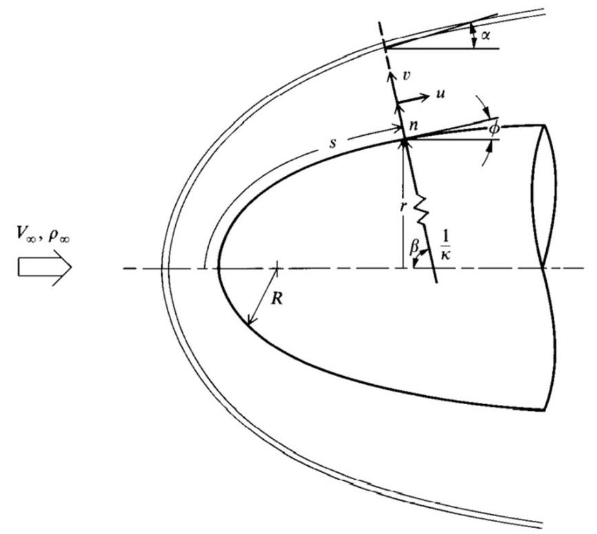

VSL方程坐标系

## 黏性激波层技术

$$
: \;\frac{\partial }{\partial {s}^{ * }}\left\lbrack  {{\left( {r}^{ * } + {m}^{ * }\cos \phi \right) }^{m}{\rho }^{ * }{u}^{ * }}\right\rbrack   + \frac{\partial }{\partial {n}^{ * }}\left\lbrack  {\left( {1 + {\kappa }^{ * }{n}^{ * }}\right) {\left( {r}^{ * } + {n}^{ * }\cos \phi \right) }^{m}{\rho }^{ * }{v}^{ * }}\right\rbrack   = 0 \tag{8.1}
$$

s方向动量方程:

$$
{\rho }^{ * }\left\{  {{u}^{ * }\left\lbrack  {\frac{1}{\left( 1 + {\kappa }^{ * }{n}^{ * }\right) }\frac{\partial {u}^{ * }}{\partial {s}^{ * }}}\right\rbrack   + {v}^{ * }\frac{\partial {u}^{ * }}{\partial {n}^{ * }} + \left\lbrack  \frac{{\kappa }^{ * }}{\left( 1 + {\kappa }^{ * }{n}^{ * }\right) }\right\rbrack  {u}^{ * }{v}^{ * }}\right\}   + \frac{1}{\left( 1 + {\kappa }^{ * }{n}^{ * }\right) }\frac{\partial {p}^{ * }}{\partial {s}^{ * }}
$$

$$
= \left\lbrack  \frac{{\varepsilon }^{2}}{{\left( 1 + {\kappa }^{ * }{n}^{ * }\right) }^{2}{\left( {r}^{ * } + {n}^{ * }\cos \phi \right) }^{m}}\right\rbrack  \frac{\partial }{\partial {n}^{ * }}\left\lbrack  {{\left( 1 + {\kappa }^{ * }{n}^{ * }\right) }^{2}{\left( {r}^{ * } + {n}^{ * }\cos \phi \right) }^{m}\tau }\right\rbrack
$$

其中: $\tau  = {\mu }^{ * }\left\lbrack  {\frac{\partial {u}^{ * }}{\partial {n}^{ * }} - \frac{{\kappa }^{ * }{u}^{ * }}{1 + {\kappa }^{ * }{n}^{ * }}}\right\rbrack$(8.2)

n方向动量方程:

$$
\text{ 方程: }\;{\rho }^{ * }\left\{  {{u}^{ * }\left\lbrack  {\frac{1}{\left( 1 + {\kappa }^{ * }{n}^{ * }\right) }\frac{\partial {v}^{ * }}{\partial {s}^{ * }}}\right\rbrack   + {v}^{ * }\frac{\partial {v}^{ * }}{\partial {n}^{ * }} - \left\lbrack  \frac{{\kappa }^{ * }}{\left( 1 + {\kappa }^{ * }{n}^{ * }\right) }\right\rbrack  {u}^{*2}}\right\}   + \frac{\partial {p}^{ * }}{\partial {n}^{ * }} = 0 \tag{8.3}
$$

$$
\text{ 能量方程: }{\rho }^{ * }\left\{  {{u}^{ * }\left\lbrack  {\frac{1}{\left( 1 + {\kappa }^{ * }{n}^{ * }\right) }\frac{\partial {T}^{ * }}{\partial {s}^{ * }}}\right\rbrack   + {v}^{ * }\frac{\partial {T}^{ * }}{\partial {n}^{ * }}}\right\}   - \left\{  {{u}^{ * }\left\lbrack  {\frac{1}{\left( 1 + {\kappa }^{ * }{n}^{ * }\right) }\frac{\partial {p}^{ * }}{\partial {s}^{ * }}}\right\rbrack   + {v}^{ * }\frac{\partial {p}^{ * }}{\partial {n}^{ * }}}\right\}   = \left\lbrack  \frac{{\varepsilon }^{2}}{\left( {1 + {\kappa }^{ * }{n}^{ * }}\right) {\left( {r}^{ * } + {n}^{ * }\cos \phi \right) }^{m}}\right\rbrack  \frac{\partial }{\partial {n}^{ * }}
$$

$$
\times  \left\lbrack  {\left( {1 + {\kappa }^{ * }{n}^{ * }}\right) {\left( {r}^{ * } + {n}^{ * }\cos \phi \right) }^{m}\left( \frac{{\mu }^{ * }}{{P}_{r}}\right) \frac{\partial {T}^{ * }}{\partial {n}^{ * }}}\right\rbrack   + \left( \frac{{\varepsilon }^{2}}{{\mu }^{ * }}\right) {\tau }^{2} \tag{8.4}
$$

## 黏性激波层技术

让 $\mathrm{m} = 0,{\kappa }^{ * } = 0,{x}^{ * } = {s}^{ * },{y}^{ * } = {n}^{ * }$ ,将VSL方程无量纲简化后的方程转化为二维笛卡尔坐标系下的方程:

连续方程:

$$
\frac{\partial \left( {\rho u}\right) }{\partial x} + \frac{\partial \left( {\rho v}\right) }{\partial y} = 0
$$

x方向动量方程: $\;{\rho u}\frac{\partial v}{\partial x} + {\rho v}\frac{\partial v}{\partial y} =  - \frac{\partial p}{\partial y}$

$$
{\rho u}\frac{\partial u}{\partial x} + {\rho v}\frac{\partial u}{\partial y} =  - \frac{\partial p}{\partial x} + \frac{\partial }{\partial y}\left( {\mu \frac{\partial u}{\partial y}}\right)
$$

$y$ 方向动量方程: $\;{\rho u}\frac{\partial v}{\partial x} + {\rho v}\frac{\partial v}{\partial y} =  - \frac{\partial p}{\partial y}$

能量方程:

$$
{\rho u}\frac{\partial h}{\partial x} + {\rho v}\frac{\partial h}{\partial y} = \frac{\partial }{\partial y}\left( {\kappa \frac{\partial T}{\partial y}}\right)  + u\frac{\partial p}{\partial x} + v\frac{\partial p}{\partial y} + \mu {\left( \frac{\partial u}{\partial y}\right) }^{2}
$$

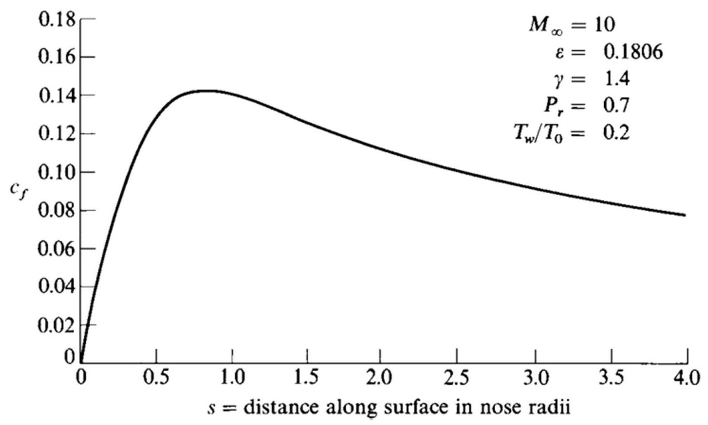

Fig. 8.2 Skin friction on a 45-deg hyperboloid: VSL calculations of Davis [134].

黏性激波层技术-结果

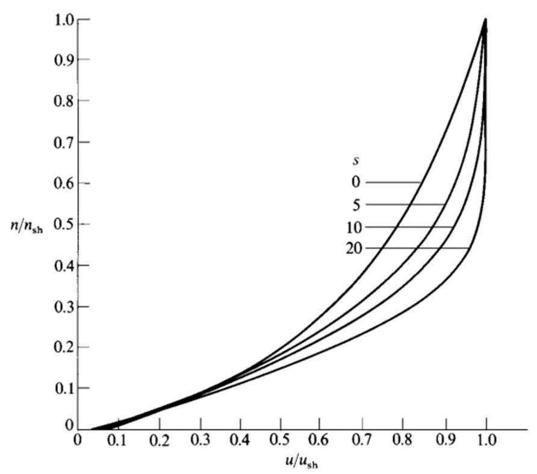

Fig. 8.3 Tangential velocity profiles on a 45-deg hyperboloid at various streamwise stations. Same conditions as Fig. 8.2 (from [134]).

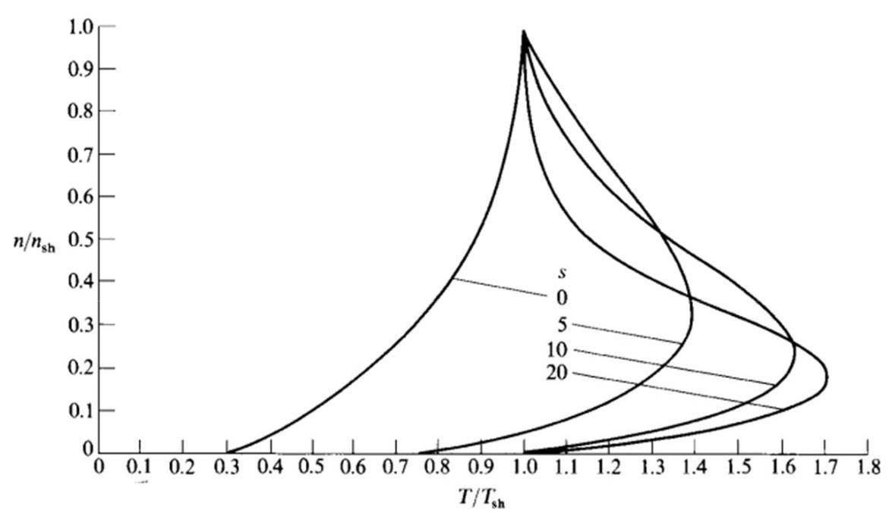

Fig. 8.4 Temperature profiles on a 45-deg hyperboloid at various streamwise stations. Same conditions as Fig. 8.2 (from [134]).

黏性激波层技术-结果

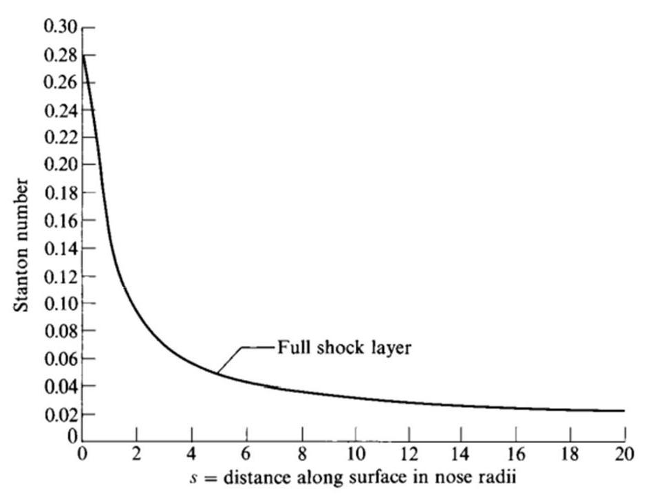

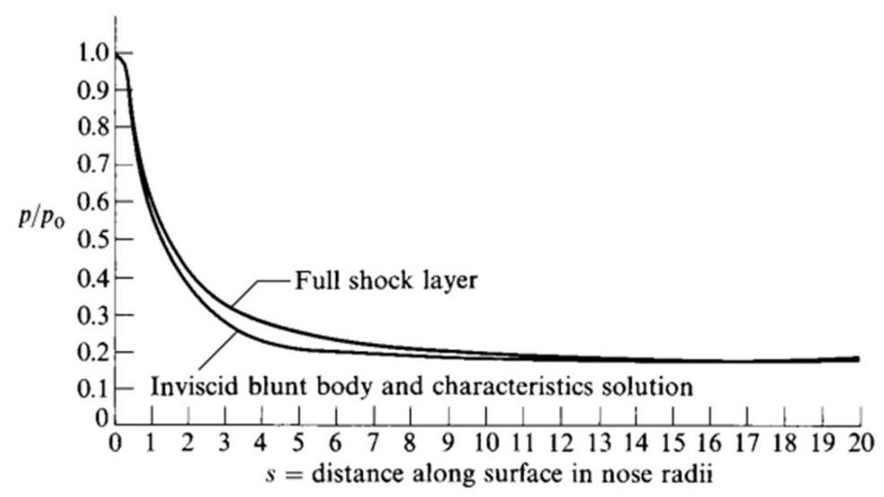

Fig. 8.5 Heat-transfer distribution over a 45-deg hyperboloid. Same conditions as a 45-deg hyperboloid. Same conditions as Fig. 8.6 Pressure distribution on a 45-deg hyperboloid. Same conditions as Fig. 8.2 Fig. 8.2 (from [134]). (from [134]).

抛物化N-S方程 (Parabolized Navier-Stokes Solutions)

## 抛物化N-S方程

抛物化N-S方程比VSL方程包含更多项、理论上更为精确, 但它仍然比全N-S 方程简单。

$$
\frac{\partial \left( {\rho u}\right) }{\partial x} + \frac{\partial \left( {\rho v}\right) }{\partial y} + \frac{\partial \left( {\rho w}\right) }{\partial z} = 0
$$

$$
{\rho u}\frac{\partial u}{\partial x} + {\rho v}\frac{\partial u}{\partial y} + {\rho w}\frac{\partial u}{\partial z} =  - \frac{\partial p}{\partial x} + \frac{\partial }{\partial y}\left( {\mu \frac{\partial u}{\partial y}}\right)  + \frac{\partial }{\partial z}\left( {\mu \frac{\partial u}{\partial z}}\right)
$$

$$
{\rho u}\frac{\partial v}{\partial x} + {\rho v}\frac{\partial v}{\partial y} + {\rho w}\frac{\partial v}{\partial z} =  - \frac{\partial p}{\partial y} + \frac{\partial }{\partial y}\left\lbrack  {\left( {\lambda  + {2\mu }}\right) \frac{\partial v}{\partial y} + \lambda \frac{\partial w}{\partial z}}\right\rbrack
$$

$$
\begin{array}{l}  + \frac{\partial }{\partial z}\left\lbrack  {\mu \left( {\frac{\partial w}{\partial y} + \frac{\partial v}{\partial z}}\right) }\right\rbrack   \end{array}
$$

连续方程:

x方向动量方程:

y方向动量方程:

$\mathrm{z}$ 方向动量方程:

$$
{\rho u}\frac{\partial w}{\partial x} + {\rho v}\frac{\partial w}{\partial y} + {\rho w}\frac{\partial w}{\partial z} =  - \frac{\partial p}{\partial z} + \frac{\partial }{\partial y}\left\lbrack  {\mu \left( {\frac{\partial w}{\partial y} + \frac{\partial v}{\partial z}}\right) }\right\rbrack
$$

$$
+ \frac{\partial }{\partial z}\left\lbrack  {\left( {\lambda  + {2\mu }}\right) \frac{\partial w}{\partial z} + \lambda \frac{\partial v}{\partial z}}\right\rbrack
$$

能量方程:

$$
{\rho u}\frac{\partial }{\partial x}\left( {e + \frac{{V}^{2}}{2}}\right)  + {\rho v}\frac{\partial }{\partial y}\left( {e + \frac{{V}^{2}}{2}}\right)  + {\rho w}\frac{\partial }{\partial z}\left( {e + \frac{{V}^{2}}{2}}\right)
$$

$$
= \rho \dot{q} + \frac{\partial }{\partial y}\left( {k\frac{\partial T}{\partial y}}\right)  + \frac{\partial }{\partial z}\left( {k\frac{\partial T}{\partial z}}\right)  - \left\lbrack  {\frac{\partial \left( {pu}\right) }{\partial x} + \frac{\partial \left( {pv}\right) }{\partial y} + \frac{\partial \left( {pw}\right) }{\partial z}}\right\rbrack
$$

$$
+ \frac{\partial }{\partial y}\left\lbrack  {{u\mu }\left( \frac{\partial u}{\partial y}\right) }\right\rbrack   + \frac{\partial }{\partial z}\left\lbrack  {{u\mu }\left( \frac{\partial u}{\partial z}\right) }\right\rbrack   + \frac{\partial }{\partial y}\left\lbrack  {{v\lambda }\left( {\frac{\partial v}{\partial y} + \frac{\partial w}{\partial z}}\right)  + {2v\mu }\frac{\partial v}{\partial y}}\right\rbrack
$$

$$
+ \frac{\partial }{\partial z}\left\lbrack  {{v\mu }\left( {\frac{\partial w}{\partial y} + \frac{\partial v}{\partial z}}\right) }\right\rbrack   + \frac{\partial }{\partial y}\left\lbrack  {{w\mu }\left( {\frac{\partial w}{\partial y} + \frac{\partial v}{\partial z}}\right) }\right\rbrack
$$

$$
+ \frac{\partial }{\partial z}\left\lbrack  {{w\lambda }\left( {\frac{\partial v}{\partial y} + \frac{\partial w}{\partial z}}\right)  + {2w\mu }\frac{\partial w}{\partial z}}\right\rbrack
$$

抛物化N-S方程-结果

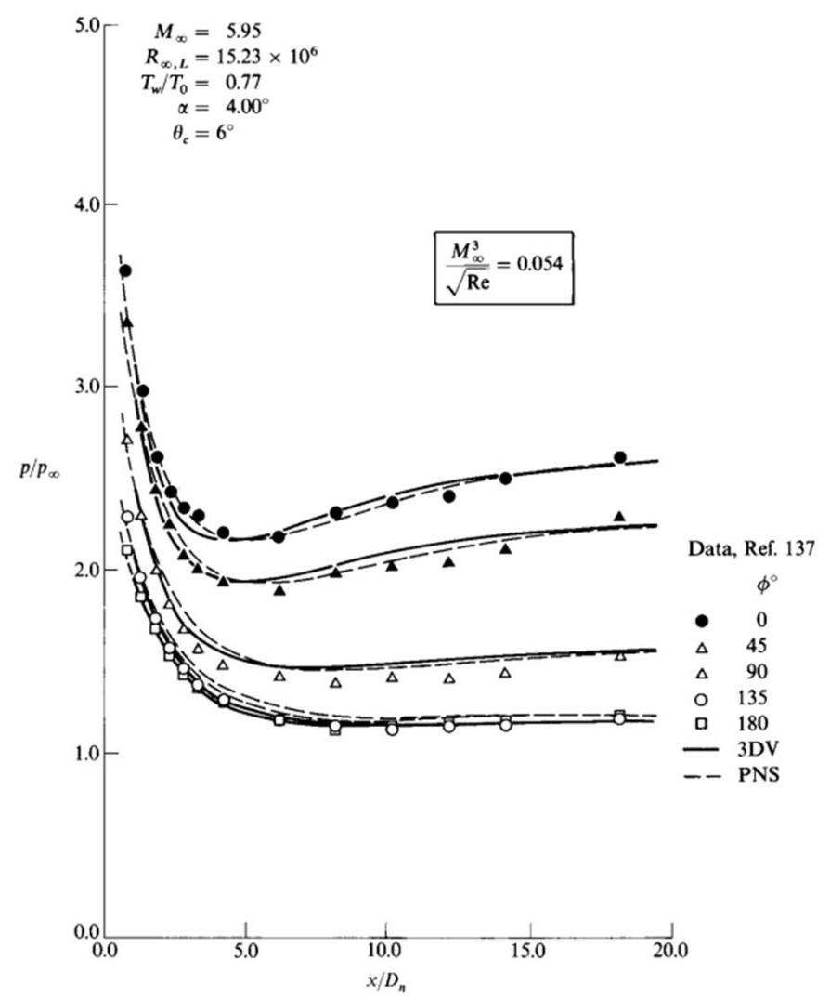

Fig. 8.7 Pressure distributions over a slightly blunted cone; comparison between experiment and computations (from McWherter et al. [136]).

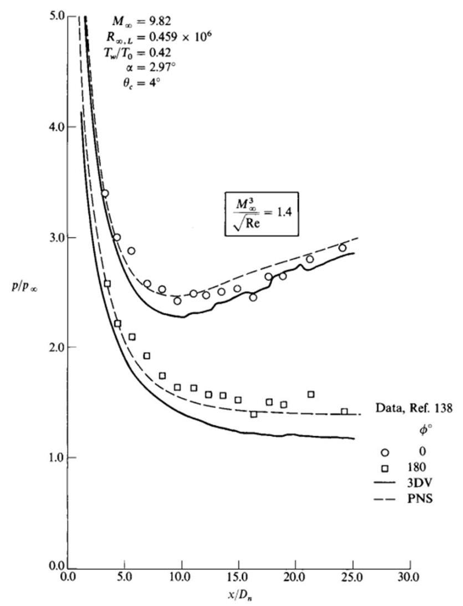

Fig. 8.8 Pressure distributions (as affected by viscous interaction) over a slightly blunted cone; comparison between experiment and computations (from [136]).

抛物化N-S方程-结果

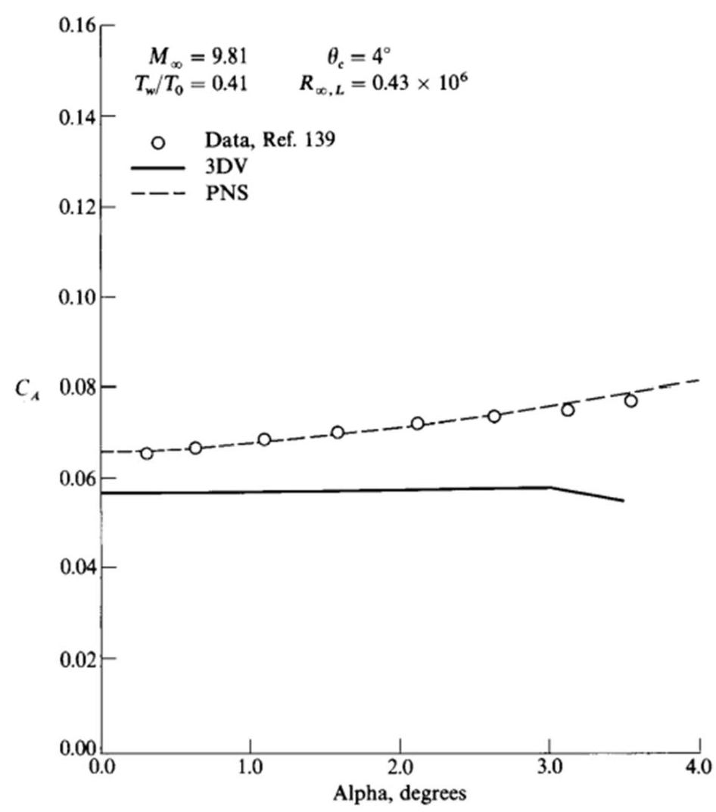

Fig. 8.9 Viscous interaction effects on axial-force coefficient on slightly blunted cones; comparison between experiment and computations (from [136]).

全N-S方程

(Full Navier-Stokes Solutions)

## 全N-S方程

连续方程:

$$
\frac{\partial \rho }{\partial t} =  - \frac{\partial \left( {\rho u}\right) }{\partial x} - \frac{\partial \left( {\rho v}\right) }{\partial y} - \frac{\partial \left( {\rho w}\right) }{\partial z}
$$

x方向动量方程:

$$
\frac{\partial u}{\partial t} =  - u\frac{\partial u}{\partial x} - v\frac{\partial u}{\partial y} - w\frac{\partial u}{\partial z} + \frac{1}{\rho }\left( {-\frac{\partial \rho }{\partial x} + \frac{\partial {\tau }_{xx}}{\partial x} + \frac{\partial {\tau }_{yx}}{\partial y} + \frac{\partial {\tau }_{zx}}{\partial z}}\right)
$$

y方向动量方程:

$$
\frac{\partial v}{\partial t} =  - u\frac{\partial v}{\partial x} - v\frac{\partial v}{\partial y} - w\frac{\partial v}{\partial z} + \frac{1}{\rho }\left( {-\frac{\partial \rho }{\partial y} + \frac{\partial {\tau }_{xy}}{\partial x} + \frac{\partial {\tau }_{yy}}{\partial y} + \frac{\partial {\tau }_{zy}}{\partial z}}\right)
$$

$\mathrm{z}$ 方向动量方程:

$$
\frac{\partial w}{\partial t} =  - u\frac{\partial w}{\partial x} - v\frac{\partial w}{\partial y} - w\frac{\partial w}{\partial z} + \frac{1}{\rho }\left( {-\frac{\partial \rho }{\partial z} + \frac{\partial {\tau }_{xz}}{\partial x} + \frac{\partial {\tau }_{yz}}{\partial y} + \frac{\partial {\tau }_{zz}}{\partial z}}\right)
$$

能量方程:

$$
\frac{\partial }{\partial t}\left( {e + \frac{{V}^{2}}{2}}\right)  =  - u\frac{\partial }{\partial x}\left( {e + \frac{{V}^{2}}{2}}\right)  - v\frac{\partial }{\partial y}\left( {e + \frac{{V}^{2}}{2}}\right)  - w\frac{\partial }{\partial z}\left( {e + \frac{{V}^{2}}{2}}\right)  + \dot{q}
$$

$$
+ \frac{1}{\rho }\left\lbrack  {\frac{\partial }{\partial x}\left( {k\frac{\partial T}{\partial x}}\right)  + \frac{\partial }{\partial y}\left( {k\frac{\partial T}{\partial y}}\right)  + \frac{\partial }{\partial z}\left( {k\frac{\partial T}{\partial z}}\right)  - \frac{\partial \left( {pu}\right) }{\partial x}}\right.
$$

$$
- \frac{\partial \left( {pv}\right) }{\partial y} - \frac{\partial \left( {pw}\right) }{\partial z} + \frac{\partial \left( {u{\tau }_{xx}}\right) }{\partial x} + \frac{\partial \left( {u{\tau }_{yx}}\right) }{\partial y} + \frac{\partial \left( {u{\tau }_{zx}}\right) }{\partial z} + \frac{\partial \left( {v{\tau }_{xy}}\right) }{\partial x}
$$

$$
\left. {+\frac{\partial \left( {v{\tau }_{yy}}\right) }{\partial y} + \frac{\partial \left( {v{\tau }_{zy}}\right) }{\partial z} + \frac{\partial \left( {w{\tau }_{xz}}\right) }{\partial x} + \frac{\partial \left( {w{\tau }_{yz}}\right) }{\partial y} + \frac{\partial \left( {w{\tau }_{zz}}\right) }{\partial z}}\right\rbrack
$$

## 全N-S方程

全N-S方程采用时间推进解法, 步骤如下:

① 对流场区域进行网格划分，并且对每个网格点上的各个物理量赋值。

② 把全N-S方程中的时间作为自变量，采用时间有限差分方法求解对应的 $\rho \text{ 、 }u\text{ 、 }v\text{ 、 }w$ 和 $e + {V}^{2}/2$ 的值。

③ 当时间推进到很大时得到定常流动。

## 全N-S方程-结果

例子:计算绕X-24C高超声速验证机的粘性流场

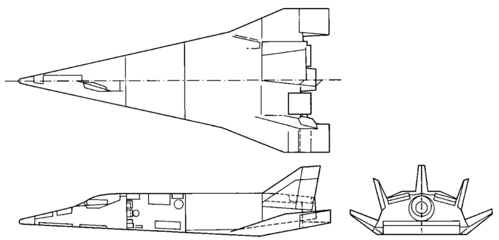

Fig. 8.13 Three view of the X-24C hypersonic test vehicle.

全N-S方程-结果

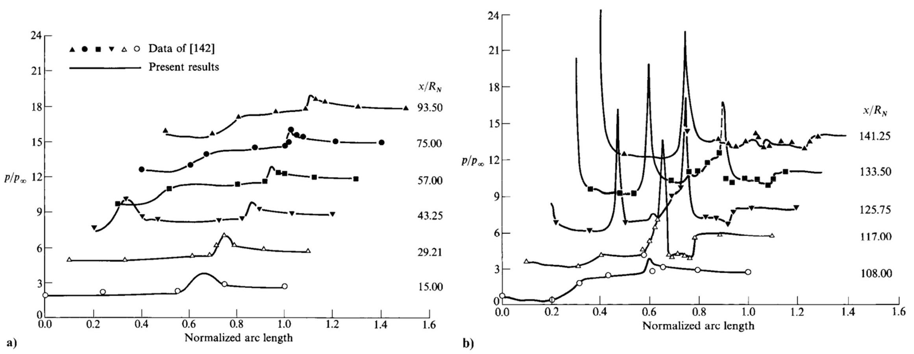

Fig. 8.14 Peripheral surface-pressure distributions around the X-24C, comparison between experiment [142] and the Navier-Stokes calculations of Shang [141].

全N-S方程-结果

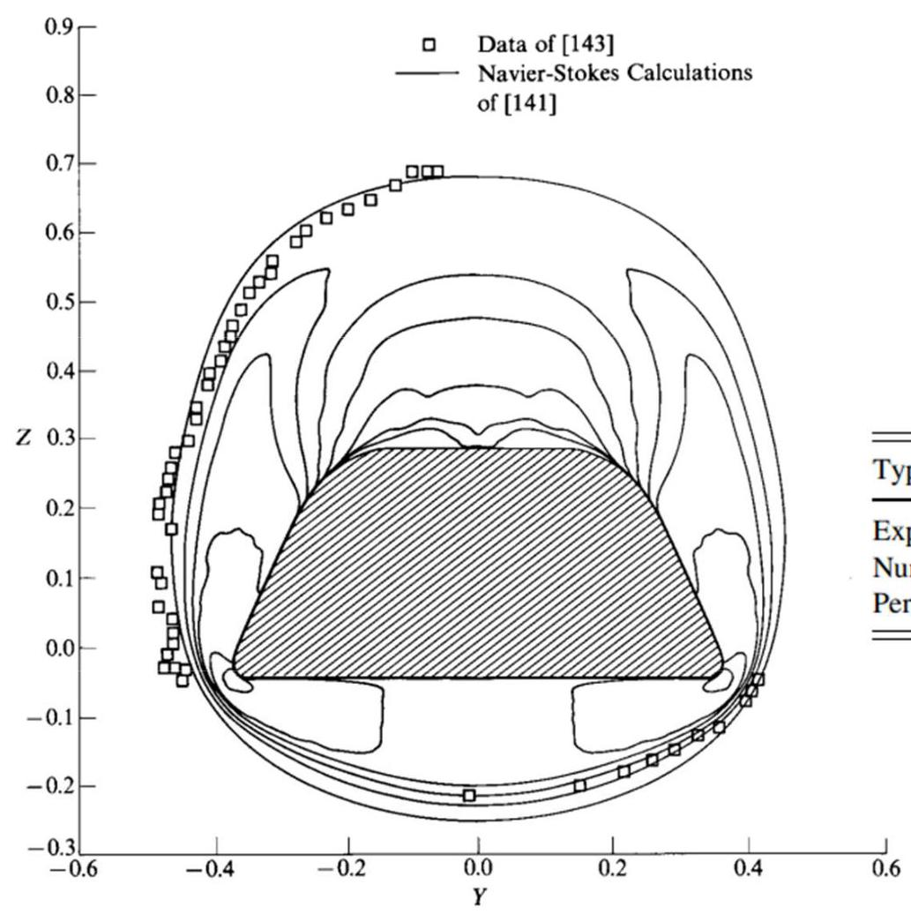

Table 8.1 Lift and drag data

<table><tr><td>Type of data</td><td>${C}_{L}$</td><td>${C}_{D}$</td><td>$L/D$</td></tr><tr><td>Experimental data</td><td>${3.676} \times  {10}^{-2}$</td><td>${3.173} \times  {10}^{-2}$</td><td>1.158</td></tr><tr><td>Numerical results</td><td>${3.503} \times  {10}^{-2}$</td><td>${2.960} \times  {10}^{-2}$</td><td>1.183</td></tr><tr><td>Percent error</td><td>4.71</td><td>6.71</td><td>2.16</td></tr></table>

Fig. 8.16 Pitot-pressure contours at the longitudinal station $x/{R}_{N} = {108}$ ; comparison between experiment and calculations (from [141]).

## 全N-S方程-结果

## 流动分离:

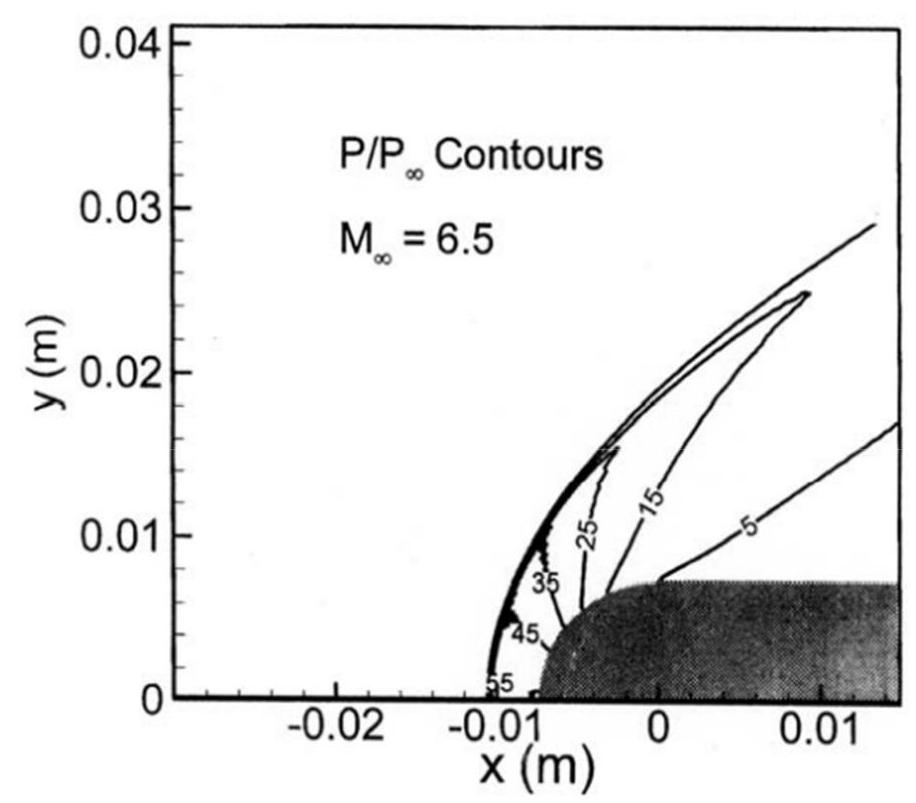

Fig. 8.19 Nondimensional pressure distribution for the no-injection case (Meyer et al. [260]).

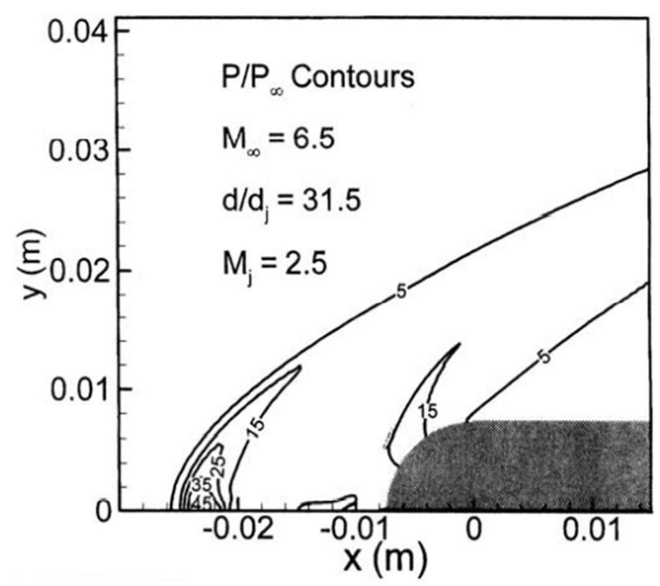

Fig. 8.20 Nondimensional pressure distribution for the injection case [260].

## 全N-S方程-结果

流动分离:

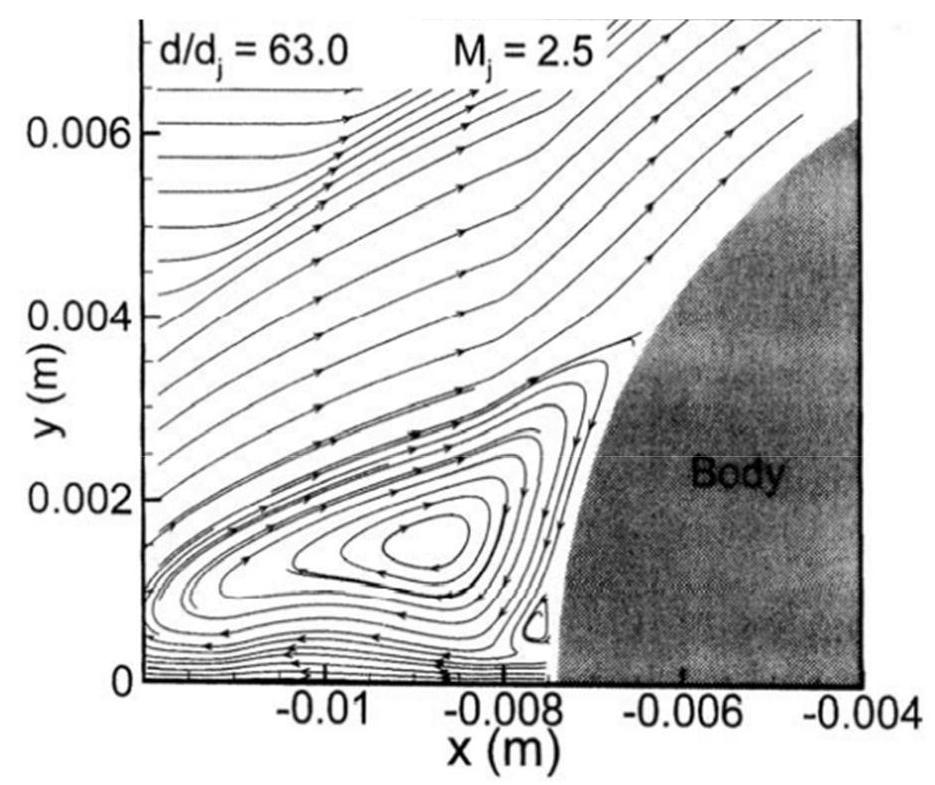

Fig. 8.21 Streamlines showing reattachment point for injection diameter ratio of 63 [260].

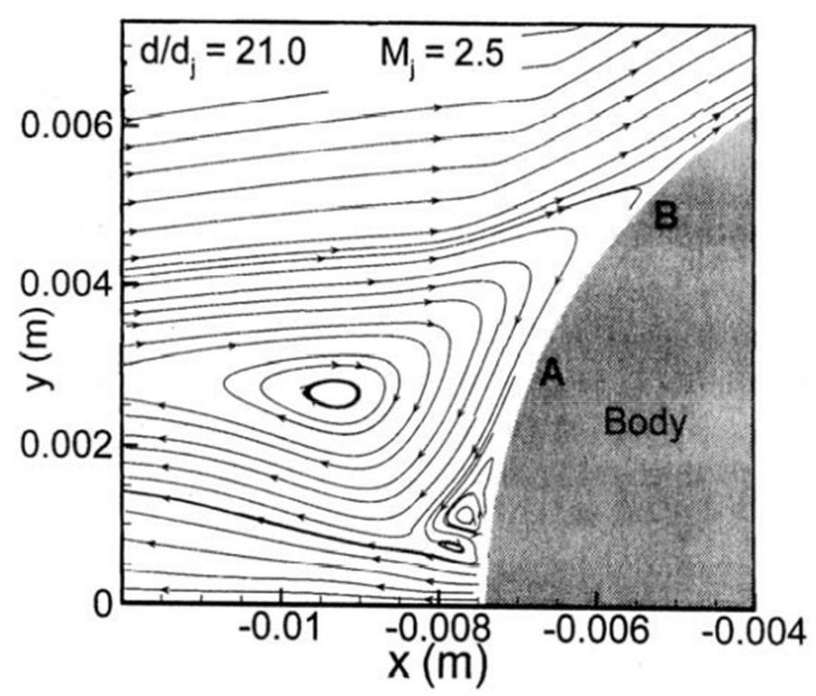

Fig. 8.22 Streamlines showing reattachment point for injection diameter ratio of 2 [260].