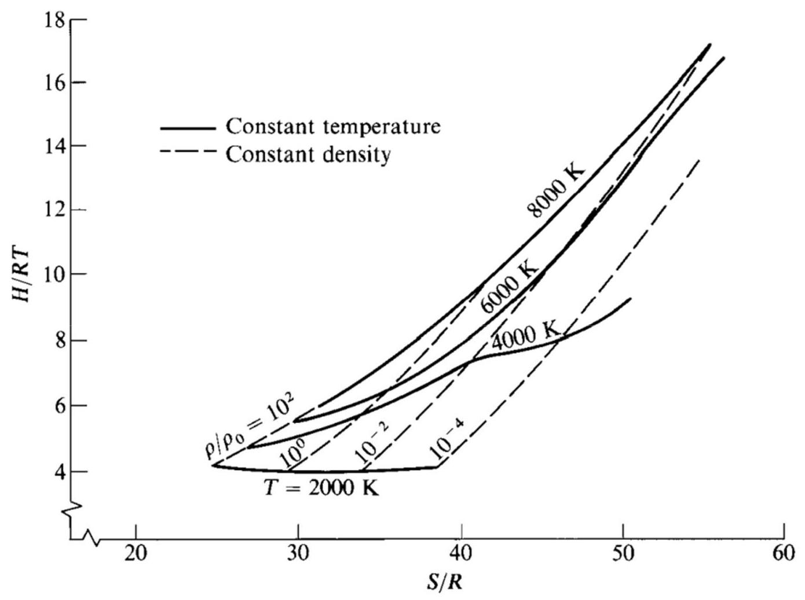

# 统计热力学基础

李文丰

西北工业大学

w.li@nwpu.edu.cn

2022年11月16日

## 前情提要-状态方程

> 标准状态方程:

$$
p = {\rho RT}
$$

> 混合物状态方程:

$$
{p}_{i} = {\rho }_{i}{R}_{i}T
$$

气体混合物组分的不同描述方法:

摩尔分数: $\;\frac{{p}_{i}}{p} = \frac{{\mathcal{N}}_{i}}{\mathcal{N}} \equiv  {X}_{i} \; \mathop{\sum }\limits_{i}{X}_{i} = 1$

气体分类:量热完全气体、热完全气体、完全气体混合反应物、平衡气体、 真实气体

前情提要一一些热力学概念

> 热力学第一定律:

$$
{\delta Q} + {\delta W} = \mathrm{d}E
$$

$>$ 热力学第二定律:

$$
\mathrm{d}s = \frac{\delta q}{T} + \mathrm{d}{s}_{\text{ irrev }}
$$

熵的计算:

$$
S = \mathop{\sum }\limits_{i}{X}_{i}\left\lbrack  {{\int }_{{T}_{\text{ ref }}}^{T}{C}_{pi}\frac{\mathrm{d}T}{T} - \mathcal{R}\ln \frac{{p}_{i}}{{p}_{\text{ ref }}}}\right\rbrack   + {S}_{\text{ ref }}
$$

$$
S =  - {\left( \frac{\partial G}{\partial T}\right) }_{p}\;\mathcal{V} = {\left( \frac{\partial G}{\partial p}\right) }_{T}
$$

$$
\mathrm{a}{S}_{\text{ irrev }} =  - \frac{1}{T}\mathop{\sum }\limits_{i}{G}_{i}\mathrm{\;d}{\mathcal{N}}_{i}
$$

前情提要一平衡化学反应混合物的组成成

> 平衡常数:

$$
\mathop{\prod }\limits_{i}{p}_{i}^{{v}_{i}} = \exp \left( {-\frac{\mathop{\sum }\limits_{i}{v}_{i}{G}_{i}^{{p}_{i} = 1}}{\mathcal{R}T}}\right)  \equiv  {K}_{p}\left( T\right)
$$

$>$ 热传导:

$$
\Delta {H}_{R}^{\text{ ref }} = \text{ (enthalpy of the products at }{T}_{\text{ ref }}\text{ ) }
$$

$$
\text{ - (enthalpy of the reactants at }{T}_{\text{ ref }}\text{ ) }
$$

$$
= \mathop{\sum }\limits_{{i = 1}}{v}_{i}{H}_{{A}_{i}}^{\text{ ref }}
$$

# 统计热力学基础

李文丰

西北工业大学

w.li@nwpu.edu.cn

2022年11月16日

## 引言

$S = {klogW}$

W: 微观状态数

S:玻尔兹曼熵

K:玻尔兹曼常数

## 目录

- 气体的微观描述

- 系统微观态数量的计算

- 最概然宏观态

- 玻尔兹曼分布

C 依据配分函数计算热力学性质

- 根据T和V计算分配函数

- 单一化学组分热力学性质的实际计算

- 平衡常数计算

- 高温空气平衡状态下组分的计算

- 平衡化学反应气体的热力学性质

- 高温空气的平衡性质

气体的微观描述 (Microscopic Description of Gases)

## 一些概念

在统计热力学的发展中, 研究的对象是由相当复杂的分子内部力结合在一起的原子团所形成的一个分子的性质。

双原子概念图: Diatomic molecule

Source

该分子有数种形式的能量, 如下所示:

④ 电子能 Electronic energy ${\varepsilon }_{\mathrm{{el}}}^{\prime }$

1. Kinetic energy of electrons in orbit

2. Potential energy of electrons in orbit

$$
{\varepsilon }^{\prime } = {\varepsilon }_{\text{ trans }}^{\prime } + {\varepsilon }_{\text{ rot }}^{\prime } + {\varepsilon }_{\text{ vib }}^{\prime } + {\varepsilon }_{\text{ el }}^{\prime }
$$

$$
{\varepsilon }^{\prime } = {\varepsilon }_{\text{ trans }}^{\prime } + {\varepsilon }_{\text{ el }}^{\prime }
$$

连续 or 间断? ??

直觉 VS 实际

宏观 VS 微观

## 分子能级

量子力学结论已证实前面所说得每种能量都是量子化的(等于一些特定的离散值)。

Fig. 11.3 Schematic of energy levels for the different molecular energy modes.

## 分子能级

用最小可能的能级定义为分子的基态 $\left( {{\varepsilon }_{0\text{ trans }}^{\prime }\text{ 、 }{\varepsilon }_{0\text{ rot }}^{\prime }\text{ 、 }{\varepsilon }_{0\text{ vib }}^{\prime }\text{ 和 }{\varepsilon }_{0\text{ el }}^{\prime }}\right.$ )。

理论上处于绝对零度时分子的总零点: ${\varepsilon }_{0}^{\prime } = {\varepsilon }_{{0}_{\text{ trans }}}^{\prime } + {\varepsilon }_{{0}_{\text{ vib }}}^{\prime } + {\varepsilon }_{{0}_{\text{ el }}}^{\prime }$

分子能量是以分子零点能为起点来计量。以零点能为基准, 平动能、转动能、振动能和电子能可以重新定义为:

$$
{\varepsilon }_{{j}_{\text{ trans }}} = {\varepsilon }_{{j}_{\text{ trans }}}^{\prime } - {\varepsilon }_{{0}_{\text{ trans }}}^{\prime }
$$

$$
{\varepsilon }_{{l}_{\mathrm{{vib}}}} = {\varepsilon }_{{l}_{\mathrm{{vib}}}}^{\prime } - {\varepsilon }_{{0}_{\mathrm{{vib}}}}^{\prime }
$$

$$
{\varepsilon }_{{m}_{\mathrm{{el}}}} = {\varepsilon }_{{m}_{\mathrm{{el}}}}^{\prime } - {\varepsilon }_{{0}_{\mathrm{{el}}}}^{\prime }
$$

${\varepsilon }_{0}^{\prime }$ 原子总能:

All are measured above the

This represents zero-point energy, a fixed quantity for a given molecular species that is equal to the energy of the molecule at absolute zero.

$$
{\varepsilon }_{i}^{\prime } = {\varepsilon }_{{j}_{\text{ trans }}} + {\varepsilon }_{{m}_{\mathrm{{el}}}} + {\varepsilon }_{0}^{\prime }
$$

zero-point energy; thus, all are equal to zero at $T = 0\mathrm{\;K}$ .

## 分子能态

## 什么是分子能态?

量子力学不仅根据能量, 而且根据角转动量(矢量)来确定分子。如下图, 具有相同能量却有不同的状态。

Fig. 11.4 Illustration of different energy states for the same energy level.

## 分子能态

对于特定的能级, 可能存在许多不同的能态, 这些能态的数目成为对应能级的简并度或者统计权重。

Fig. 11.5 Illustration of statistical weights.

## 分子能态

由 $N$ 个分子组成的系统,特定能级 ${\varepsilon }_{j}^{\prime }$ 的分子数目定义为 ${N}_{j}$ 。

则各能级的粒子总数 $N$ 为:

$$
N = \mathop{\sum }\limits_{j}{N}_{j}
$$

系统总能 $E$ 定义为:

$$
E = \mathop{\sum }\limits_{j}{\varepsilon }_{j}^{\prime }{N}_{j}
$$

Given a system with a fixed number of identical particles,

$N = \mathop{\sum }\limits_{j}{N}_{j}$ , and a fixed energy

$E = \mathop{\sum }\limits_{j}{\varepsilon }_{j}^{\prime }{N}_{j}$ , find the most probable macrostate

## 分子能态

宏观态

Energy levels:

${\varepsilon }_{0}^{\prime } \; {\varepsilon }_{1}^{\prime } \; {\varepsilon }_{2}^{\prime }$ ... ${\varepsilon }_{j}^{\prime }$ ...

${g}_{0} \; {g}_{1} \; {g}_{2}$ ... ${g}_{j}$ ...

${N}_{0} = 2 \; {N}_{1} = 3 \; {N}_{2} = 5$ ... ${N}_{j} = 3$

One macrostate

${N}_{0} = 3 \; {N}_{1} = 1 \; {N}_{2} = 3$ ... ${N}_{j} = 6$

Another macrostate

Statistical weights:

Populations at one instant:

Populations at the next instant:

最概然宏观态

## 微观态

## 基本微粒分类

根据基本微粒子数量分类: 服从玻色-爱因斯坦统计学的统计分布, 称之为玻色子。

基本微粒子数为偶数的分子或原子:

任意一简并态中的分子数量没有

限制(除了必须小于或等于 ${N}_{j}$ )。

服从费米-狄拉克统计学的统计分布, 称之为费米子。

基本微粒子数为奇数的分子或原子:

任何瞬时任何一简并态都只能有一个分子)。

## 计算过程

(1)考虑玻色-爱因斯坦统计学。

① 将某个能级 ${\varepsilon }_{j}^{\prime }$ 拥有 ${\mathrm{g}}_{j}$ 个简并态,并将其看作 ${\mathrm{g}}_{j}$ 个容器。

② 将 ${N}_{j}$ 个分子分布到各容器中,计算分布方式的数量。

$$
\frac{\left( {{N}_{j} + {g}_{j} - 1}\right) !}{\left( {{g}_{j} - 1}\right) !{N}_{j}!}
$$

③ 对所有能级进行累加。

$$
W = \mathop{\prod }\limits_{j}\frac{\left( {{N}_{j} + {g}_{j} - 1}\right) !}{\left( {{g}_{j} - 1}\right) !{N}_{j}!}
$$

## 计算过程

(2)考虑费米-狄拉克统计学。

① 将某个能级 ${\varepsilon }_{j}^{\prime }$ 拥有 ${\mathrm{g}}_{j}$ 个简并态,并将其看作 ${\mathrm{g}}_{j}$ 个容器。

② 将 ${N}_{j}$ 个分子分布到各容器中,一个容器中只有一个分子或者没有分子, 计算分布方式的数量:

$$
\frac{{g}_{j}!}{\left( {{g}_{j} - {N}_{j}}\right) !{N}_{j}!}
$$

③ 对所有能级进行累加。

$$
W = \mathop{\prod }\limits_{j}\frac{{g}_{j}!}{\left( {{g}_{j} - {N}_{j}}\right) !{N}_{j}!}
$$

最概然宏观态

(Most Probable Macrostate)

最概然宏观态-最常见的宏观态; 工程系统热力学平衡的状态, 包含最多数量微观态的宏观态，既具有最大值Wmax的宏观态

Fig. 11.8 Illustration of most probable macrostate as that macrostate that has the maximum number of microstates.

最概然宏观态

(1)考虑玻色子。

$$
W = \mathop{\prod }\limits_{j}\frac{\left( {{N}_{j} + {g}_{j} - 1}\right) !}{\left( {{g}_{j} - 1}\right) !{N}_{j}!}
$$

$$
\ln W = \mathop{\sum }\limits_{j}\left\lbrack  {\ln \left( {{N}_{j} + {g}_{j} - 1}\right) ! - \ln \left( {{g}_{j} - 1}\right) ! - \ln {N}_{j}!}\right\rbrack
$$

斯特林公式: $\;\ln a! = a\ln a - a$

$$
\ln W = \mathop{\sum }\limits_{j}\left\lbrack  {{N}_{j}\ln \left( {1 + \frac{{g}_{j}}{{N}_{j}}}\right)  + {g}_{j}\ln \left( {\frac{{N}_{j}}{{g}_{j}} + 1}\right) }\right\rbrack
$$

$\mathrm{d}\left( {\ln W}\right)  = 0$

$$
\mathrm{d}\left( {\ln W}\right)  = \mathop{\sum }\limits_{j}\left\lbrack  {\ln \left( {1 + \frac{{g}_{j}}{{N}_{j}}}\right) }\right\rbrack  \mathrm{d}{N}_{j} = 0
$$

最概然宏观态 $d{N}_{j}$ 服从两个物理约束:

① $N = \mathop{\sum }\limits_{j}{N}_{j} =$ const $\;\mathop{\sum }\limits_{j}\mathrm{\;d}{N}_{j} = 0$

② $E = \mathop{\sum }\limits_{j}{\varepsilon }_{j}^{\prime }{N}_{j} =$ const $\;\mathop{\sum }\limits_{j}{\varepsilon }_{j}^{\prime }\mathrm{d}{N}_{j} = 0$

引入拉格朗日乘子 $\alpha$ 和 $\beta$ 最概然宏观态:

${N}_{j}^{ * } = \frac{{g}_{j}}{{e}^{\alpha }{e}^{\beta {\varepsilon }_{j}^{\prime }} - 1}$

(2)考虑费米子。

最概然宏观态:

${N}_{j}^{ * } = \frac{{g}_{j}}{{e}^{\alpha }{e}^{\beta {\varepsilon }_{j}^{\prime }} + 1}$

玻尔兹曼分布

## 玻尔兹曼分布

在温度非常低,小于5k的情况下,系统的分子聚集于底层能级或者附近,因此这些低能级的简并态高度密集。相反, 在较高温度时分子散步于众多能级上, 因此简并态通常分布稀疏。

在较高温度时:

玻尔兹曼分布

玻尔兹曼分布

根据经典热力学于统计热力学之间的关系: $\;\beta  = \frac{1}{kT}$

玻尔兹曼分布以零点能为基准表示:

配分函数, 是T和V的方程

$$
{N}_{j}^{ * } = N\frac{{g}_{j}{e}^{-{\varepsilon }_{j}/{kT}}}{Q}
$$

其中: $\;Q \equiv  \mathop{\sum }\limits_{j}{g}_{j}{e}^{-{\varepsilon }_{j}/{kT}}$

(Evaluation of Thermodynamic Properties in

(1)内能

$$
\left. \begin{array}{l} E = \mathop{\sum }\limits_{j}{\varepsilon }_{j}{N}_{j}^{ * } \\  {N}_{j}^{ * } = N\frac{{g}_{j}{e}^{-{\varepsilon }_{j}/{kT}}}{Q} \end{array}\right\}  \;E = \mathop{\sum }\limits_{j}{\varepsilon }_{j}N\frac{{g}_{j}{e}^{-{\varepsilon }_{j}/{kT}}}{Q} = \frac{N}{Q}\mathop{\sum }\limits_{j}{g}_{j}{\varepsilon }_{j}{e}^{-{\varepsilon }_{j}/{kT}}
$$

其中:

$$
Q \equiv  \mathop{\sum }\limits_{j}{g}_{j}{e}^{-{\varepsilon }_{j}/{kT}} = f\left( {V, T}\right)
$$

因此:

$$
{\left( \frac{\partial Q}{\partial T}\right) }_{v} = \frac{1}{k{T}^{2}}\mathop{\sum }\limits_{j}{g}_{j}{\varepsilon }_{j}{e}^{-{\varepsilon }_{j}/{kT}}
$$

包含 $N$ 个分子或原子的系统的内能:

$$
{}_{1}^{1}E = {Nk}{T}^{2}{\left( \frac{\partial \ln Q}{\partial T}\right) }_{v1}^{1}
$$

单位质量的内能 $e$ :

$e = \frac{E}{M} = \frac{{Nk}{T}^{2}}{Nm}{\left( \frac{\partial \ln Q}{\partial T}\right) }_{v}$

$$
e = R{T}^{2}{\left( \frac{\partial \ln Q}{\partial T}\right) }_{v}
$$

定义比焓为:

$$
h = e + {pv} = e + {RT}
$$

${}_{1}^{1}h = {RT} + R{T}^{2}{\left( \frac{\partial \ln Q}{\partial T}\right) }_{{v}_{1}^{1}}^{1}$

## 依据配分函数计算热力学性质

(2)熵

经典热力学和系统热力学之间的桥梁: $S = {kln}{W}_{\max }$

在玻尔兹曼极限条件下, 则有:

$$
\ln W = \mathop{\sum }\limits_{j}\left\lbrack  {{N}_{j}\ln \left( {1 + \frac{{g}_{j}}{{N}_{j}}}\right)  + {g}_{j}\ln \left( {\frac{{N}_{j}}{{g}_{j}} + 1}\right) }\right\rbrack   \rightarrow  \ln W = \mathop{\sum }\limits_{j}\left\lbrack  {{N}_{j}\ln \frac{{g}_{j}}{{N}_{j}} + {N}_{j}}\right\rbrack   = \mathop{\sum }\limits_{j}{N}_{j}\left( {\ln \frac{{g}_{j}}{{N}_{j}} + 1}\right)
$$

$$
{N}_{j}^{ * } = N\frac{{g}_{j}{e}^{-{\varepsilon }_{j}/{kT}}}{Q}
$$

$$
\frac{{g}_{j}}{{N}_{j}^{ * }} = \frac{Q}{N}{e}^{\beta {\varepsilon }_{j}}
$$

$$
\beta  = \frac{1}{kT}
$$

$$
\ln W = \mathop{\sum }\limits_{j}\left\lbrack  {{N}_{j}\ln \frac{{g}_{j}}{{N}_{j}} + {N}_{j}}\right\rbrack   = \mathop{\sum }\limits_{j}{N}_{j}\left( {\ln \frac{{g}_{j}}{{N}_{j}} + 1}\right)
$$

$$
\ln {W}_{\max } = N\left( {\ln \frac{Q}{N} + 1}\right)  + {\beta E}
$$

$$
\frac{{g}_{j}}{{N}_{j}^{ * }} = \frac{Q}{N}{e}^{\beta {\varepsilon }_{j}}
$$

$$
S = {kln}{W}_{\max }
$$

$$
S = {kN}\left( {\ln \frac{Q}{N} + 1}\right)  + {k\beta E}
$$

$$
S = {kN}\left( {\ln \frac{Q}{N} + 1}\right)  + \frac{E}{T}
$$

$$
\beta  = \frac{1}{kT}
$$

$$
E = {Nk}{T}^{2}{\left( \frac{\partial \ln Q}{\partial T}\right) }_{v}
$$

$$
\mathrm{{IS}} = {Nk}\left( {\ln \frac{Q}{N} + 1}\right)  + {NkT}{\left( \frac{\partial \ln Q}{\partial T}\right) }_{v}
$$

(3)压力

$$
T\mathrm{\;d}S = \mathrm{d}E + p\mathrm{\;d}V
$$

$$
T{\left( \frac{\partial S}{\partial V}\right) }_{T} = {\left( \frac{\partial E}{\partial V}\right) }_{T} + p
$$

单一组分和热完全气体, 因此:

$$
p = T{\left( \frac{\partial S}{\partial V}\right) }_{T}
$$

$$
S = {kN}\left( {\ln \frac{Q}{N} + 1}\right)  + \frac{E}{T}
$$

$$
{\left( \frac{\partial S}{\partial V}\right) }_{T} = {Nk}{\left( \frac{\partial \ln Q}{\partial V}\right) }_{T} + \frac{1}{T}{\left( \frac{\partial E}{\partial V}\right) }_{T} = {Nk}{\left( \frac{\partial \ln Q}{\partial V}\right) }_{T}
$$

$$
{}_{1}^{1}p = {NkT}{\left( \frac{\partial \ln Q}{\partial V}\right) }_{T}
$$

# 根据分配函数计算热力学性质 (Evaluation of the Partition Function in Terms of T and V)

## 根据T和V计算分配函数

分配函数的定义:

$$
Q \equiv  \mathop{\sum }\limits_{j}{g}_{j}{e}^{-{\varepsilon }_{j}/{kT}}
$$

为了计算 $Q$ ,需要能级 ${\varepsilon }_{j}$ 的表达式。分子的总能为:

$$
{\varepsilon }^{\prime } = {\varepsilon }_{\text{ trans }}^{\prime } + {\varepsilon }_{\text{ rot }}^{\prime } + {\varepsilon }_{\text{ vib }}^{\prime } + {\varepsilon }_{\text{ el }}^{\prime }
$$

根据量子力学原理，有:

$$
{\varepsilon }_{\text{ trans }}^{\prime } = \frac{{h}^{2}}{8m}\left( {\frac{{n}_{1}^{2}}{{a}_{1}^{2}} + \frac{{n}_{2}^{2}}{{a}_{2}^{2}} + \frac{{n}_{3}^{2}}{{a}_{3}^{2}}}\right) \;{\varepsilon }_{\text{ rot }}^{\prime } = \frac{{h}^{2}}{8{\pi }^{2}I}J\left( {J + 1}\right)
$$

${\varepsilon }_{\text{ vib }}^{\prime } = {hv}\left( {n + \frac{1}{2}}\right)$

根据T和V计算分配函数

每种能量的零点能为:

$$
{\varepsilon }_{{\text{ trans }}_{0}}^{\prime } = \frac{{h}^{2}}{8m}\left( {\frac{1}{{a}_{1}^{2}} + \frac{1}{{a}_{2}^{2}} + \frac{1}{{a}_{3}^{2}}}\right) \;{\varepsilon }_{{\text{ rot }}_{0}}^{\prime } = 0\;{\varepsilon }_{{\text{ vib }}_{0}}^{\prime } = \frac{1}{2}
$$

以零点为起点的能量:

${\varepsilon }_{\text{ rot }} = {\varepsilon }_{\text{ rot }}^{\prime } - {\varepsilon }_{{\text{ rot }}_{0}} = \frac{{h}^{2}}{8{\pi }^{2}I}J\left( {J + 1}\right)$

$$
{\varepsilon }_{\text{ vib }} = {\varepsilon }_{\text{ vib }}^{\prime } - {\varepsilon }_{{\text{ vib }}_{0}} = {nhv}
$$

${\varepsilon }_{\mathrm{{el}}} = {\varepsilon }_{\mathrm{{el}}}^{\prime } - {\varepsilon }_{{\mathrm{{el}}}_{0}}$

## 根据T和V计算分配函数

因此, 总能为:

$$
{\varepsilon }^{\prime } = {\varepsilon }_{\text{ trans }} + {\varepsilon }_{\text{ rot }} + {\varepsilon }_{\text{ vib }} + {\varepsilon }_{\text{ el }} + {\varepsilon }_{0}
$$

以零点能 $\varepsilon$ 为起点的总量:

结合分配函数的定义, 则有:

$$
Q = \left\lbrack  {\mathop{\sum }\limits_{i}{g}_{i}\exp \left( {-\frac{{\varepsilon }_{{i}_{\text{ trans }}}}{kT}}\right) }\right\rbrack  \left\lbrack  {\mathop{\sum }\limits_{i}{g}_{i}\exp \left( {-\frac{{\varepsilon }_{{j}_{\text{ rot }}}}{kT}}\right) }\right\rbrack   \times  \left\lbrack  {\mathop{\sum }\limits_{n}{g}_{n}\exp \left( {-\frac{{\varepsilon }_{{n}_{\text{ vib }}}}{kT}}\right) }\right\rbrack  \left\lbrack  {\mathop{\sum }\limits_{l}{g}_{l}\exp \left( {-\frac{{\varepsilon }_{{l}_{\text{ ci }}}}{kT}}\right) }\right\rbrack
$$

$$
Q = \left\lbrack  {\mathop{\sum }\limits_{i}{g}_{i}\exp \left( {-\frac{{\varepsilon }_{{i}_{\text{ trans }}}}{kT}}\right) }\right\rbrack  \left\lbrack  {\mathop{\sum }\limits_{i}{g}_{i}\exp \left( {-\frac{{\varepsilon }_{{j}_{\text{ rot }}}}{kT}}\right) }\right\rbrack   \times  \left\lbrack  {\mathop{\sum }\limits_{n}{g}_{n}\exp \left( {-\frac{{\varepsilon }_{{n}_{\text{ vib }}}}{kT}}\right) }\right\rbrack  \left\lbrack  {\mathop{\sum }\limits_{l}{g}_{l}\exp \left( {-\frac{{\varepsilon }_{{l}_{\text{ el }}}}{kT}}\right) }\right\rbrack
$$

$$
{Q}_{\text{ trans }}\;{Q}_{\text{ rot }}\;{Q}_{\text{ vib }}
$$

分别计算每个能量。

① $\;{Q}_{\text{ trans }}$

$$
{Q}_{\text{ trans }} = \mathop{\sum }\limits_{i}{g}_{{i}_{\text{ trans }}}\exp \left( {-\frac{{\varepsilon }_{{i}_{\text{ trans }}}}{kT}}\right)
$$

$$
{Q}_{\text{ trans }} = \mathop{\sum }\limits_{j}\exp \left( {-\frac{{\varepsilon }_{{j}_{\text{ trans }}}}{kT}}\right)
$$

$$
= \mathop{\sum }\limits_{{{n}_{1} = 1}}^{\infty }\mathop{\sum }\limits_{{{n}_{2} = 1}}^{\infty }\mathop{\sum }\limits_{{{n}_{3} = 1}}^{\infty }\exp \left\lbrack  {-\frac{{h}^{2}}{8mkT}\left( {\frac{{n}_{1}^{2}}{{a}_{1}^{2}} + \frac{{n}_{2}^{2}}{{a}_{2}^{2}} + \frac{{n}_{3}^{2}}{{a}_{3}^{2}}}\right) }\right\rbrack
$$

$$
{Q}_{\text{ trans }} = {\left( \frac{2\pi mkT}{{h}^{2}}\right) }^{3/2}V
$$

② ${Q}_{\text{ rot }}$

$$
{Q}_{\text{ rot }} = \mathop{\sum }\limits_{J}{g}_{J}\exp \left( {-\frac{{\varepsilon }_{J}}{kT}}\right)  = \mathop{\sum }\limits_{{J = 0}}^{\infty }\left( {{2J} + 1}\right) \exp \left\lbrack  {-\frac{{h}^{2}}{8{\pi }^{2}{IkT}}J\left( {J + 1}\right) }\right\rbrack
$$

${Q}_{\text{ rot }} = \frac{8{\pi }^{2}{IkT}}{{h}^{2}}$

③ ${Q}_{\mathrm{{vib}}}$

$$
{Q}_{\text{ vib }} = \mathop{\sum }\limits_{n}{g}_{n}{e}^{-{\varepsilon }_{n}/{kT}} = \mathop{\sum }\limits_{{n = 0}}^{\infty }{e}^{-{nhv}/{kT}}
$$

${Q}_{\text{ vib }} = \frac{1}{1 - {e}^{-{hv}/{kT}}}$

④ ${Q}_{\text{ el }}$

$$
{Q}_{\mathrm{{el}}} \equiv  \mathop{\sum }\limits_{{l = 0}}^{\infty }{g}_{l}{e}^{-{\varepsilon }_{l}/{kT}} = {g}_{0} + {g}_{1}{e}^{-{\varepsilon }_{1}/{kT}} + {g}_{2}{e}^{-{\varepsilon }_{2}/{kT}} + \cdots
$$

单一化学组分热力学性质的实际计算 (Practical Evaluation of Thermodynamic Properties for a Single Chemical Species)

单一化学组分热力学性质的实际计算

(1)平动能

$$
\ln {Q}_{\text{ trans }} = \frac{3}{2}\ln T + \frac{3}{2}\ln \frac{2\pi mk}{{h}^{2}} + \ln V
$$

$$
\begin{array}{l} {e}^{2} = R{T}^{2}{\left( \frac{\partial \ln Q}{\partial T}\right) }_{V} = \frac{3}{2}\frac{1}{T} \\  \end{array}
$$

(2)转动能

$$
{Q}_{\text{ rot }} = \frac{8{\pi }^{2}{IkT}}{{h}^{2}}
$$

$$
\ln {Q}_{\text{ rot }} = \ln T + \ln \frac{8{\pi }^{2}{Ik}}{{h}^{2}}
$$

$$
\begin{array}{l} \frac{\partial \ln {Q}_{\text{ rot }}}{\partial T} = \frac{1}{T} \\  e = R{T}^{2}{\left( \frac{\partial \ln Q}{\partial T}\right) }_{e} \\  \end{array}
$$

(3)振动能

$$
{Q}_{\mathrm{{vib}}} = \frac{1}{1 - {e}^{-{hv}/{kT}}}
$$

$$
\frac{\partial \ln {Q}_{\mathrm{{vib}}}}{\partial \mathrm{T}} = \frac{{hv}/k{T}^{2}}{{e}^{{hv}/{kT}} - 1}
$$

$$
e = R{T}^{2}{\left( \frac{\partial \ln Q}{\partial T}\right) }_{v}
$$

$\ln {Q}_{\mathrm{{vib}}} =  - \ln \left( {1 - {e}^{-{hv}/{kT}}}\right)$

单一化学组分热力学性质的实际计算

总之对于原子有:

${c}_{v} = \frac{3}{2}R + \frac{\partial {e}_{\mathrm{{el}}}}{\partial T}$

对于分子有:

单一化学组分热力学性质的实际计算结论:

1. 内能e与定容比热容 ${c}_{V}$ 都只是 $T$ 的函数。

$$
e = {f}_{1}\left( T\right) \;\text{ and }\;{c}_{v} = f\left( T\right)
$$

前提假设:微观态的计算中分子独立，每种微观态出现概率相同。

2. 对只有平动能和转动能的气体, 有以下结论:

对于原子:

$$
{c}_{v} = \frac{3}{2}R
$$

对于双原子分子:

$$
{c}_{v} = \frac{5}{2}R
$$

结论:

3. 当 $T \rightarrow  \infty$ 时,分子的比定容热容公式指出 ${c}_{V} \rightarrow  \frac{7}{2}R$ 。然而,远在这种情况发生之前,由于高温作用气体将会电解和电离,由于化学反应的存在 ${c}_{V}$ 将会变化。

4. 统计热力学只能计算潜能(以零点为基准的内能)或焓。因为通常不能计算零点能的值, 总能的绝对值计算不可实现。 结论:

5. 空气的比定容热容 ${c}_{V}$ 随温度的理论变化规律如下图所示。

Fig. 11.9 Schematic of the temperature variation of the specific heat for a diatomic gas.

# 平衡常数计算 (Calculation of the Equilibrium Constant)

## 平衡常数计算

考虑由3个任意化学组分A、B和AB组成的混合气体。控制3个组分间反应关系的化学方程式为:

$$
{AB} \Leftrightarrow  A + B
$$

混合气体的间并态:

$$
{\varepsilon }_{0}^{\prime },{\varepsilon }_{1}^{\prime A},{\varepsilon }_{2}^{\prime A},\ldots ,{\varepsilon }_{j}^{\prime A},\ldots \;{\varepsilon }_{0}^{\prime },{\varepsilon }_{1}^{\prime B},{\varepsilon }_{2}^{\prime B},\ldots ,{\varepsilon }_{j}^{\prime B},\ldots
$$

$$
{N}_{0}^{A},{N}_{1}^{A},{N}_{2}^{A},\ldots ,{N}_{j}^{A},\ldots \;{N}_{0}^{B},{N}_{1}^{B},{N}_{2}^{B},\ldots ,{N}_{j}^{B},\ldots
$$

$$
{g}_{0}^{A},{g}_{1}^{A},{g}_{2}^{A},\ldots ,{g}_{j}^{A},\ldots \;{g}_{0}^{B},{g}_{1}^{B},{g}_{2}^{B},\ldots ,{g}_{j}^{B},\ldots
$$

$$
{\varepsilon }_{0}^{\prime {AB}},{\varepsilon }_{1}^{\prime {AB}},{\varepsilon }_{2}^{\prime {AB}},\ldots ,{\varepsilon }_{j}^{\prime {AB}},\ldots
$$

$$
{N}_{0}^{AB},{N}_{1}^{AB},{N}_{2}^{AB},\ldots ,{N}_{j}^{AB},\ldots
$$

$$
{g}_{0}^{AB},{g}_{1}^{AB},{g}_{2}^{AB},\ldots ,{g}_{j}^{AB},\ldots
$$

平衡常数计算

混合气体的能级图:

## 平衡常数计算

反应中零点能的变化图:

A、B和AB粒子的平衡混合物要满足两个约束。

(1)总能 $E$ 为常数:

$$
{E}^{A} = \mathop{\sum }\limits_{j}{N}_{j}^{A}{\varepsilon }_{j}^{\prime A} = \mathop{\sum }\limits_{j}{N}_{j}^{A}\left( {{\varepsilon }_{j}^{A} + {\varepsilon }_{0}^{A}}\right)
$$

$$
{E}^{AB} = \mathop{\sum }\limits_{j}{N}_{j}^{AB}{\varepsilon }_{j}^{\prime {AB}} = \mathop{\sum }\limits_{j}{N}_{j}^{AB}\left( {{\varepsilon }_{j}^{AB} + {\varepsilon }_{0}^{AB}}\right)
$$

$$
{E}^{B} = \mathop{\sum }\limits_{j}{N}_{j}^{B}{\varepsilon }_{j}^{\prime B} = \mathop{\sum }\limits_{j}{N}_{j}^{B}\left( {{\varepsilon }_{j}^{B} + {\varepsilon }_{0}^{B}}\right)
$$

$$
E = {E}^{A} + {E}^{B} + {E}^{AB} = \text{ const }
$$

## 平衡常数计算

(2)粒子A的总数 ${N}_{A}$ 应为常数，这其中包括了自由粒子和合成粒子。

$$
\mathop{\sum }\limits_{j}{N}_{j}^{A} + \mathop{\sum }\limits_{j}{N}_{j}^{AB} = {N}_{A} = \text{ const }
$$

$$
\mathop{\sum }\limits_{j}{N}_{j}^{B} + \mathop{\sum }\limits_{j}{N}_{j}^{AB} = {N}_{B} = \text{ const }
$$

为了得到化学平衡系统的性质, 必须求得系统的最概然宏观态。

$$
{N}_{j}^{A} = {N}^{A}\frac{{g}_{j}^{A}{e}^{-{\varepsilon }_{j}A/{kT}}}{{Q}^{A}}
$$

$$
{N}_{j}^{B} = {N}^{B}\frac{{g}_{j}^{B}{e}^{-{\varepsilon }_{j}B/{kT}}}{{Q}^{B}}
$$

$$
{N}_{j}^{AB} = {N}^{AB}\frac{{g}_{j}^{AB}{e}^{-{\varepsilon }_{j}{AB}/{kT}}}{{Q}^{AB}}
$$

$$
\frac{{N}^{A}{N}^{B}}{{N}^{AB}} = {e}^{-\Delta {\varepsilon }_{0}/{kT}}\frac{{Q}^{A}{Q}^{B}}{{Q}^{AB}}
$$

$$
\frac{{N}^{A}{N}^{B}}{{N}^{AB}} = {e}^{-\Delta {\varepsilon }_{0}/{kT}}\frac{{Q}^{A}{Q}^{B}}{{Q}^{AB}}
$$

$\frac{{p}_{A}{p}_{B}}{{p}_{AB}} = {K}_{p}\left( T\right)$

${K}_{p}\left( T\right)  \equiv  \mathop{\prod }\limits_{i}{\rho }_{i}^{{v}_{i}} = {\left( \frac{kT}{V}\right) }^{\sum {v}_{i}}{e}^{-\Delta {\varepsilon }_{0}/{kT}}\mathop{\prod }\limits_{i}{Q}_{i}^{{v}_{i}}$ 例如: $\;{\mathrm{N}}_{2} = 2\mathrm{\;N}$ : ${K}_{p,{\mathrm{\;N}}_{2}} = \frac{{\left( {p}_{\mathrm{N}}\right) }^{2}}{{p}_{{\mathrm{N}}_{2}}}$

${K}_{p,{\mathrm{H}}_{2}{\mathrm{O}}_{2}} = \frac{{\left( {p}_{\mathrm{H}}\right) }^{2}{\left( {p}_{\mathrm{O}}\right) }^{2}}{{P}_{{\mathrm{H}}_{2}{\mathrm{O}}_{2}}}$ 结论:

1. 通过统计热力学的方法得到平衡常数表达式。

2. 证明了平衡常数仅是温度的函数。

3. 证明了一个公式, 由这个公式, 平衡常数可以从分配函数中计算出来。

高温空气平衡状态下组分的计算 (Calculation of the Equilibrium Composition for High-Temperature Air)

## 化学平衡的进一步说明

将空气加热至高温( ${2500K} < T < {9000K}$ )氮气和氧气间会发生化学反应，这个温度范围内的一些重要反应包括:

$$
{\mathrm{O}}_{2} \leftrightharpoons  2\mathrm{O}
$$

$$
{\mathrm{N}}_{2} \leftrightharpoons  2\mathrm{\;N}
$$

$$
\mathrm{N} + \mathrm{O} \leftrightharpoons  \mathrm{{NO}}
$$

$$
\mathrm{N} + \mathrm{O} = {\mathrm{{NO}}}^{ + } + {e}^{ - }
$$

也就是说,在高温情况下,在空气混合物中不仅存在 ${O}_{2}$ 和 ${N}_{2}$ ,还有 $O\text{ 、 }N\text{ 、 }{NO}\text{ 、 }N{O}^{ + }$ 和 ${\mathrm{e}}^{ - }$ 。

## 高温空气平衡状态下组分的计算

考虑给定 $T$ 和 $p$ 条件下的高温系统,假设它存在下列组分: ${O}_{2}\text{ 、 }{N}_{2}\text{ 、 }O\text{ 、 }N\text{ 、 }{NO}$ 、 ${\mathrm{{NO}}}^{ + }$ 和 ${\mathrm{e}}^{ - }$ 。求解混合物温度和压力下的分压 ${p}_{{O}_{2}}\text{ 、 }{p}_{O}\text{ 、 }{p}_{{N}_{2}}\text{ 、 }{p}_{N}\text{ 、 }{p}_{NO}\text{ 、 }{p}_{N{O}^{ + }}$ 和 ${p}_{{e}^{ - }}$ 。有 7 个未知数,需要 7 个方程。

I.

$$
p = {p}_{{\mathrm{O}}_{2}} + {p}_{\mathrm{O}} + {p}_{{\mathrm{N}}_{2}} + {p}_{\mathrm{N}} + {p}_{\mathrm{{NO}}} + {p}_{{\mathrm{{NO}}}^{ + }} + {p}_{{e}^{ - }}
$$

II.

$$
\frac{{\left( {p}_{\mathrm{O}}\right) }^{2}}{{p}_{{\mathrm{O}}_{2}}} = {K}_{p,{\mathrm{O}}_{2}}\left( T\right)
$$

III.

$$
\frac{{\left( {p}_{\mathrm{N}}\right) }^{2}}{{p}_{{\mathrm{\;N}}_{2}}} = {K}_{p,{\mathrm{\;N}}_{2}}\left( T\right)
$$

高温空气平衡状态下组分的计算

IV.

$$
\frac{{p}_{\mathrm{{NO}}}}{{p}_{\mathrm{N}}{p}_{\mathrm{O}}} = {K}_{p,\mathrm{{NO}}}\left( T\right)
$$

V.

$$
\frac{{p}_{\mathrm{{NO}}}{p}_{{e}^{ - }}}{{p}_{\mathrm{N}}{p}_{\mathrm{O}}} = {K}_{p,{\mathrm{{NO}}}^{ + }}\left( T\right)
$$

事实: $O$ 和 $N$ 原子核的数量，包括自由和合并状态，必须保持不变。

$$
{N}_{\mathrm{A}}\left( {2{\eta }_{{\mathrm{O}}_{2}} + {\eta }_{\mathrm{O}} + {\eta }_{\mathrm{{NO}}} + {\eta }_{{\mathrm{{NO}}}^{ + }}}\right)  = {N}_{\mathrm{O}}
$$

$$
{N}_{\mathrm{A}}\left( {2{\eta }_{{\mathrm{N}}_{2}} + {\eta }_{\mathrm{N}} + {\eta }_{\mathrm{{NO}}} + {\eta }_{{\mathrm{{NO}}}^{ + }}}\right)  = {N}_{\mathrm{N}}
$$

VI.

$$
\frac{2{p}_{{\mathrm{O}}_{2}} + {p}_{\mathrm{O}} + {p}_{\mathrm{{NO}}} + {p}_{{\mathrm{{NO}}}^{ + }}}{2{p}_{{\mathrm{N}}_{2}} + {p}_{\mathrm{N}} + {p}_{\mathrm{{NO}}} + {p}_{{\mathrm{{NO}}}^{ + }}} = \frac{{N}_{\mathrm{O}}}{{N}_{\mathrm{N}}}
$$

$$
{\eta }_{i} = {p}_{i}\frac{v}{\mathcal{R}T}
$$

事实:应用电荷必须守恒。

$$
{\eta }_{{\mathrm{{NO}}}^{ + }} = {\eta }_{{e}^{ - }}
$$

$$
{p}_{{\mathrm{{NO}}}^{ + }} = {p}_{{e}^{ - }}
$$

高温空气平衡状态下组分的计算

Fig. 11.12 Composition of equilibrium air vs temperature at 1 atm.

1. ${O}_{2}$ 在温度高于 ${2000K}$ 时开始离解,在温度高于4000K时几乎完全离解。

2. ${N}_{2}$ 在温度高于 ${4000K}$ 时开始离解,在为温度高于9000K时几乎完全离解。

3. NO在温度介于 ${2000} - {6000K}$ 时出现, 温度大约为3500K时摩尔分数达到最大值。

平衡化学反应气体的热力学性质 (Thermodynamic Properties of an Equilibrium Chemically Reacting Gas

平衡化学反应气体的热力学性质对于化学反应混合物, 单位物质的量混合物的焓定义为:

$$
H = \mathop{\sum }\limits_{i}{X}_{i}{H}_{i}
$$

${H}_{i}$ 的意义:

$$
{\left( H - {E}_{0}\right) }_{i} = {\left( E - {E}_{0}\right) }_{i} + \mathcal{R}T
$$

$$
{\left( H - {E}_{0}\right) }_{i} = \frac{3}{2}\mathcal{R}T + \mathcal{R}T + \frac{{h\nu }/{kT}}{{e}^{{h\nu }/{kT}} - 1}\mathcal{R}T + \mathcal{R}T + \text{ electronic energy }
$$

$$
\begin{array}{l} \dot{\overbrace{\text{ Translation }}} \\  \end{array} \tag{11.92}
$$

## 平衡化学反应气体的热力学性质

在复杂的化学反应混合物中,给定组分的所有能量以绝对零点能 ${E}_{{O}_{i}}$ 为基准进行度量。

Fig. 11.13 Schematic showing the contrast between sensible enthalpy and zero-point energy.

内能变化的计算:令点1和2表示流场中的两个不同位置，则有

应用

水-气反应:

$$
{\mathrm{{CO}}}_{2} + {\mathrm{H}}_{2} \rightarrow  {\mathrm{H}}_{2}\mathrm{O} + \mathrm{{CO}}
$$

由零点能变化的定义:

由绝对零度下生成热的定义可得:

$$
{\mathrm{H}}_{2} + \frac{1}{2}{\mathrm{O}}_{2} \rightarrow  {\mathrm{H}}_{2}\mathrm{O} : \;{\left( \Delta {H}_{f}\right) }_{{\mathrm{H}}_{2}\mathrm{O}}^{ \circ  } = {\left( {E}_{0}\right) }_{{\mathrm{H}}_{2}\mathrm{O}} - {\left( {E}_{0}\right) }_{{\mathrm{H}}_{2}} - \frac{1}{2}{\left( {E}_{0}\right) }_{{\mathrm{O}}_{2}}
$$

$$
\mathrm{C} + \frac{1}{2}{\mathrm{O}}_{2} \rightarrow  \mathrm{{CO}} : \;{\left( \Delta {H}_{f}\right) }_{\mathrm{{CO}}}^{ \circ  } = {\left( {E}_{0}\right) }_{\mathrm{{CO}}} - {\left( {E}_{0}\right) }_{\mathrm{C}} - \frac{1}{2}{\left( {E}_{0}\right) }_{{\mathrm{O}}_{2}}
$$

$$
\mathrm{C} + {\mathrm{O}}_{2} \rightarrow  {\mathrm{{CO}}}_{2} : \;{\left( \Delta {H}_{f}\right) }_{{\mathrm{{CO}}}_{2}}^{ \circ  } = {\left( {E}_{0}\right) }_{{\mathrm{{CO}}}_{2}} - {\left( {E}_{0}\right) }_{\mathrm{C}} - \frac{1}{2}{\left( {E}_{0}\right) }_{{\mathrm{O}}_{2}}
$$

$$
{\mathrm{H}}_{2} \rightarrow  {\mathrm{H}}_{2} : \;{\left( \Delta {H}_{f}\right) }_{{\mathrm{H}}_{2}}^{ \circ  } = 0
$$

$$
{\left( \Delta {\mathrm{H}}_{f}\right) }_{{\mathrm{H}}_{2}\mathrm{O}}^{ \circ  } + {\left( \Delta {\mathrm{H}}_{f}\right) }_{\mathrm{{CO}}}^{ \circ  } - {\left( \Delta {\mathrm{H}}_{f}\right) }_{{\mathrm{{CO}}}_{2}}^{ \circ  } - {\left( \Delta {\mathrm{H}}_{f}\right) }_{{\mathrm{H}}_{2}} = {\left( {\mathrm{E}}_{0}\right) }_{{\mathrm{H}}_{2}\mathrm{O}}
$$

$$
+ {\left( {E}_{0}\right) }_{\mathrm{{CO}}} - {\left( {E}_{0}\right) }_{{\mathrm{{CO}}}_{2}} - {\left( {E}_{0}\right) }_{{\mathrm{H}}_{2}} \equiv  \Delta {E}_{0}
$$

证明了:

$$
\Delta {E}_{0} = {\left( \Delta {H}_{f}\right) }_{{\mathrm{H}}_{2}\mathrm{O}}^{ \circ  } + {\left( \Delta {H}_{f}\right) }_{\mathrm{{CO}}}^{ \circ  } - {\left( \Delta {H}_{f}\right) }_{{\mathrm{{CO}}}_{2}}^{ \circ  } - {\left( \Delta {H}_{f}\right) }_{{\mathrm{H}}_{2}}^{ \circ  }
$$

混合物焓:

单位质量的焓:

$$
h = \mathop{\sum }\limits_{i}{c}_{i}{\left( h - {e}_{0}\right) }_{i} + \mathop{\sum }\limits_{i}{c}_{i}{\left( \Delta {h}_{f}\right) }_{i}^{ \circ  }
$$

结论:

1. 混合物的显焓可由以下方式得到:①通过各组分的显焓来求，其中各组分的值由统计力学公式来算; ②用已知的由 ${p}_{i}\text{ 、 }{x}_{i}\text{ 、 }{\eta }_{i}$ 或 ${c}_{i}$ 表示的平衡合成物的值来计算。

2. 用绝对零度下的生成热代替零点能的话, 零点能可视为一个 “有效值”

# 高温空气的平衡性质 (Equilibrium Properties of High-Temperature Air)

## 高温空气的平衡性质

## 求得的高温热力学性质实际是以什么方式应用于流动计算?

1. 本章给出的统计热力学公式可以直接用于计算流动, 热力学性质可以在计算中 “从无到有” 地求得。

2. 关于高温空气热力学性质的数据表是现成的。

3. 高温空气性质的绘图法对手工计算同样非常有用。

4. 可将第2项中讨论的列表数据用多项式关系式表示, 然后简单便利地应用于流场计算体系中。

Fig. 11.14 Mollier diagram for high-temperature equilibrium air.

## 高温空气的平衡性质

把高温平衡空气性质引入流场计算的一个非常方便的方法是:把计算所得并形成列表的数据用多项式关系式来表示。

根据压强为内能和密度的函数:

$$
p = p\left( {e,\rho }\right)
$$

$$
p = {\rho e}\left( {\widetilde{\gamma } - 1}\right)
$$

$$
\text{ 其中: }\widetilde{\gamma } = {a}_{1} + {a}_{2}Y + {a}_{3}Z + {a}_{4}{YZ} + {a}_{5}{Y}^{2} + {a}_{6}{Z}^{2} + {a}_{7}Y{Z}^{2} + {a}_{8}{Z}^{3}
$$

$$
+ \frac{{a}_{9} + {a}_{10}Y + {a}_{11}Z + {a}_{12}{YZ}}{1 + \exp \left\lbrack  {\left( {{a}_{13} + {a}_{14}Y}\right) \left( {Z + {a}_{15}Y + {a}_{16}}\right) }\right\rbrack  }
$$

$$
Y = \log \left( {\rho /{1.292}}\right) \text{ and }Z = \log \left( {e/{78408.4}}\right)
$$

高温空气的平衡性质

根据温度为内能和密度的函数:

$$
\log \left( \frac{T}{151.78}\right)  = {b}_{1} + {b}_{2}Y + {b}_{3}Z + {b}_{4}{YZ} + {b}_{5}{Y}^{2} + {b}_{6}{Z}^{2} + {b}_{7}{Y}^{2}Z + {b}_{8}Y{Z}^{2}
$$

$$
+ \frac{{b}_{9} + {b}_{10}Y + {b}_{11}Z + {b}_{12}{YZ} + {b}_{13}{Z}^{2}}{1 + \exp \left\lbrack  {\left( {{b}_{14}Y + {b}_{15}}\right) \left( {Z + {b}_{16}}\right) }\right\rbrack  } \tag{11.109}
$$

$$
\text{ 其中: }Y = \log \left( {\rho /{1.225}}\right) , X = \log \left( {p/{1.0314} \times  {10}^{5}}\right) , Z = X - Y\text{ , }
$$

根据比焓为压力和密度的函数:

$h = h\left( {p,\rho }\right)$

$$
h = \frac{p}{\rho }\left\lbrack  \frac{\widetilde{\gamma }}{\widetilde{\gamma } - 1}\right\rbrack
$$

$$
\text{ 其中: }\widetilde{\gamma } = {c}_{1} + {c}_{2}Y + {c}_{3}Z + {c}_{4}{YZ} + \frac{{c}_{5} + {c}_{6}Y + {c}_{7}Z + {c}_{8}{YZ}}{1 + \exp \left\lbrack  {{c}_{9}\left( {X + {c}_{10}Y + {c}_{11}}\right) }\right\rbrack  }
$$

$$
Y = \log \left( {\rho /{1.292}}\right) , X = \log \left( {p/{1.013} \times  {10}^{5}}\right) \text{ , and }Z = X - Y\text{ . }
$$

根据温度为压力和密度的函数:

$T = T\left( {p,\rho }\right)$

$$
\log \left( \frac{T}{{T}_{0}}\right)  = {d}_{1} + {d}_{2}Y + {d}_{3}Z + {d}_{4}{YZ} + {d}_{5}{Z}^{2}
$$

$$
+ \frac{{d}_{6} + {d}_{7}Y + {d}_{8}Z + {d}_{9}{YZ} + {d}_{10}{Z}^{2}}{1 + \exp \left\lbrack  {{d}_{11}\left( {Z + {d}_{12}}\right) }\right\rbrack  }
$$

其中: ${T}_{0} = {288.16}\mathrm{\;K},\;Y = \log \left( {\rho /{1.225}}\right) ,\;X = \log \left( {p/{1.0134} \times  {10}^{5}}\right)$

$$
Z = X - Y
$$