高温黏性流动

(Viscous High-Temperature Flows)

李文丰

西北工业大学

w.li@nwpu.edu.cn

2022年11月30日

## 目录

- 化学反应中的黏性流动控制方程

- 能量方程的其他形式

C 化学反应气体的边界层方程

自边界层条件: 催化壁

自边界层解: 离解气体的驻点热转换

- 化学反应流动的黏性激波层解

- 化学反应流动的抛物化纳维-斯托克斯解

C 化学反应流动的全纳维-斯托克斯解

化学反应中的黏性流动控制方程 ( Governing Equations for Chemically Reacting Viscous Flow)

化学反应中的黏性流动控制方程

Global continuity:

$$
\frac{\partial \rho }{\partial t} + \nabla  \cdot  \left( {\rho \mathbf{V}}\right)  = 0
$$

$x$ Momentum:

$$
\rho \frac{\mathrm{D}u}{\mathrm{D}t} =  - \frac{\partial p}{\partial x} + \frac{\partial {\tau }_{xx}}{\partial x} + \frac{\partial {\tau }_{yx}}{\partial y} + \frac{\partial {\tau }_{zx}}{\partial z}
$$

$y$ Momentum:

$$
\rho \frac{\mathrm{D}v}{\mathrm{D}x} =  - \frac{\partial p}{\partial y} + \frac{\partial {\tau }_{xy}}{\partial x} + \frac{\partial {\tau }_{yy}}{\partial y} + \frac{\partial {\tau }_{zy}}{\partial z}
$$

$z$ Momentum:

$$
\rho \frac{\mathrm{D}w}{\mathrm{D}t} =  - \frac{\partial p}{\partial z} + \frac{\partial {\tau }_{xz}}{\partial x} + \frac{\partial {\tau }_{yz}}{\partial y} + \frac{\partial {\tau }_{zz}}{\partial z}
$$

Energy:

$$
\rho \frac{\mathrm{D}\left( {e + {V}^{2}/2}\right) }{\mathrm{D}t} =  - \nabla  \cdot  \mathbf{q} - \nabla  \cdot  p\mathbf{V} + \frac{\partial \left( {u{\tau }_{xx}}\right) }{\partial x} + \frac{\partial \left( {u{\tau }_{yx}}\right) }{\partial y} + \frac{\partial \left( {u{\tau }_{zx}}\right) }{\partial z} + \frac{\partial \left( {v{\tau }_{xy}}\right) }{\partial x}
$$

$$
+ \frac{\partial \left( {v{\tau }_{yy}}\right) }{\partial y} + \frac{\partial \left( {v{\tau }_{zy}}\right) }{\partial z} + \frac{\partial \left( {w{\tau }_{xz}}\right) }{\partial x} + \frac{\partial \left( {w{\tau }_{yz}}\right) }{\partial y} + \frac{\partial \left( {w{\tau }_{zz}}\right) }{\partial z}
$$

where, from Eq. (16.31), the heat-flux vector is

$$
\mathbf{q} =  - k\nabla T + \mathop{\sum }\limits_{i}{\rho }_{i}{\mathbf{U}}_{i}{h}_{i} + {\mathbf{q}}_{R}
$$

能量方程表明流体单元沿流线运动时的总温 $\mathrm{e} + {V}^{2}/2$ 的改变是由于:

①流体单元表面的热传导; ②通过扩散进入(或出) 流体单元表面带来的能量输运; ③流体单元发出或吸收的辐射能量；④施加在流体单元表面的压力的功率； ⑤施加在流体单元表面的切应力和正应力的功率。

化学反应中的黏性流动控制方程

黏性是怎样对这些推导出的方程产生影响的?

答: 组分 $i$ 的质量传递一定要包含于组分连续性方程。

$$
\frac{\partial \rho }{\partial t} + \nabla  \cdot  \left( {\rho \mathbf{V}}\right)  = 0
$$

$$
\rho \frac{\mathrm{D}{c}_{i}}{\mathrm{D}t} + \nabla  \cdot  \left( {{\rho }_{i}{\mathbf{U}}_{i}}\right)  = {\dot{w}}_{i}
$$

如果我们有n个化学组分,我们仅仅需要 $\left( {\mathrm{n} - 1}\right)$ 个连续方程,因为还有附加的关系式 “求和” $\mathop{\sum }\limits_{i}{c}_{i} = 1$ 。另外,关于 $e$ 的常用表达式也成立,即:

$$
e = \mathop{\sum }\limits_{i}{c}_{i}{e}_{i}
$$

$$
{e}_{i} = \frac{5}{2}{RT} + {e}_{{\mathrm{{vib}}}_{i}} + {e}_{\mathrm{e}1} + {\left( \Delta {h}_{f}\right) }_{i}^{\mathrm{o}}
$$

化学反应中的黏性流动控制方程化学反应黏性流动控制方程与无反应黏性流动方程区别:

> 需要使用组分连续性方程(对化学非平衡流动，无论是黏性或无黏的)

- 包括扩散的影响，这是在组分连续性方程和能量方程中的扩散项中出现的

> 包含焓(或内能)在绝对零度的生成热

# 能量方程的其他形式 ( Alternate Forms of the Energy Equation)

能量方程的其他形式能量方程的其他形式:

①

$$
\rho \frac{\mathrm{D}{h}_{0}}{\mathrm{D}t} = \frac{\partial p}{\partial t} - \nabla  \cdot  \mathbf{q} + \frac{\partial \left( {u{\tau }_{xx}}\right) }{\partial x} + \frac{\partial \left( {u{\tau }_{yx}}\right) }{\partial y} + \frac{\partial \left( {u{\tau }_{zx}}\right) }{\partial z} + \frac{\partial \left( {v{\tau }_{xy}}\right) }{\partial x}
$$

$$
+ \frac{\partial \left( {v{\tau }_{yy}}\right) }{\partial y} + \frac{\partial \left( {v{\tau }_{zy}}\right) }{\partial z} + \frac{\partial \left( {w{\tau }_{xz}}\right) }{\partial x} + \frac{\partial \left( {w{\tau }_{yz}}\right) }{\partial y} + \frac{\partial \left( {w{\tau }_{zz}}\right) }{\partial z}
$$

②

$$
\rho \frac{\mathrm{D}h}{\mathrm{D}t} =  - \nabla  \cdot  \mathbf{q} + \frac{\mathrm{D}p}{\mathrm{D}t} + \Phi
$$

$$
\Phi  = {\tau }_{xx}\frac{\partial u}{\partial x} + {\tau }_{yy}\frac{\partial v}{\partial y} + {\tau }_{zz}\frac{\partial w}{\partial z} + {\tau }_{xy}\left( {\frac{\partial u}{\partial y} + \frac{\partial v}{\partial x}}\right)
$$

其中:

$$
+ {\tau }_{xz}\left( {\frac{\partial u}{\partial z} + \frac{\partial w}{\partial x}}\right)  + {\tau }_{yz}\left( {\frac{\partial v}{\partial z} + \frac{\partial w}{\partial y}}\right)
$$

能量方程的其他形式

能量方程的其他形式:

$$
\rho \frac{\mathrm{D}h}{\mathrm{D}t} = \nabla  \cdot  \left( {k\nabla T}\right)  - \nabla  \cdot  \mathop{\sum }\limits_{i}{\rho }_{i}{\mathbf{U}}_{i}{h}_{i} - \nabla  \cdot  {\mathbf{q}}_{R} + \frac{\mathrm{D}p}{\mathrm{D}t} + \Phi
$$

④

$$
\rho \frac{\mathrm{D}{h}_{\text{ sens }}}{\mathrm{D}t} = \nabla  \cdot  \left( {k\nabla T}\right)  - \nabla  \cdot  \mathop{\sum }\limits_{i}{\rho }_{i}{\mathbf{U}}_{i}{h}_{i,\text{ sens }}
$$

$$
- \nabla  \cdot  {\mathbf{q}}_{R} + \frac{\mathrm{D}p}{\mathrm{D}t} + \Phi  - \mathop{\sum }\limits_{l}{\dot{w}}_{i}{\left( \Delta {h}_{f}\right) }_{i}^{\mathrm{o}}
$$

化学反应气体的边界层方程 ( Boundary-Layer Equations for a Chemically Reacting Gas)

## 化学反应气体的边界层方程

Global continuity:

$$
\frac{\partial \left( {{\rho u}{r}^{i}}\right) }{\partial x} + \frac{\partial \left( {{\rho v}{r}^{j}}\right) }{\partial y} = 0
$$

у Momentum:

$$
\frac{\partial p}{\partial y} = 0
$$

Species continuity: Energy:

$$
{\rho u}\frac{\partial {c}_{i}}{\partial x} + {\rho v}\frac{\partial {c}_{i}}{\partial y} = \frac{\partial }{\partial y}\left( {\rho {D}_{12}\frac{\partial {c}_{i}}{\partial y}}\right)  + {\dot{w}}_{i}
$$

$$
{\rho u}\frac{\partial h}{\partial x} + {\rho v}\frac{\partial h}{\partial y} = \frac{\partial }{\partial y}\left( {k\frac{\partial T}{\partial y}}\right)
$$

$$
+ \frac{\partial }{\partial y}\left( {\rho {D}_{12}\mathop{\sum }\limits_{i}{h}_{i}\frac{\partial {c}_{i}}{\partial y}}\right)  + \mu {\left( \frac{\partial u}{\partial y}\right) }^{2} + u\frac{\partial p}{\partial x}
$$

$x$ Momentum:

$$
{\rho u}\frac{\partial u}{\partial x} + {\rho v}\frac{\partial u}{\partial y} =  - \frac{\partial p}{\partial x} + \frac{\partial }{\partial y}\left( {\mu \frac{\partial u}{\partial y}}\right)
$$

## 化学反应气体的边界层方程

边界层能量方程的其他形式:

①

$$
{\rho u}\frac{\partial {h}_{0}}{\partial x} + {\rho v}\frac{\partial {h}_{0}}{\partial y} = \frac{\partial }{\partial y}\left( {k\frac{\partial T}{\partial y}}\right)  + \frac{\partial }{\partial y}\left( {\rho {D}_{12}\mathop{\sum }\limits_{i}{h}_{i}\frac{\partial {c}_{i}}{\partial y}}\right)  + \frac{\partial }{\partial y}\left( {{\mu u}\frac{\partial u}{\partial y}}\right)
$$

$$
{\rho u}{c}_{{p}_{f}}\frac{\partial T}{\partial x} + {\rho v}{c}_{{p}_{f}}\frac{\partial T}{\partial y} = \frac{\partial }{\partial y}\left( {k\frac{\partial T}{\partial y}}\right)  + \mu {\left( \frac{\partial u}{\partial y}\right) }^{2}
$$

$$
+ u\frac{\partial p}{\partial x} + \mathop{\sum }\limits_{i}{c}_{{p}_{i}}\left( {\rho {D}_{12}\frac{\partial {c}_{i}}{\partial y}}\right) \left( \frac{\partial T}{\partial y}\right)  - \mathop{\sum }\limits_{i}{h}_{i}{\dot{w}}_{i}
$$

引入无量纲参数:

$$
\overline{\rho } = \frac{\rho }{{\rho }_{e}}\;\bar{u} = \frac{u}{{u}_{e}}\;\bar{v} = \frac{v}{{v}_{e}}\;{\bar{h}}_{0} = \frac{{h}_{0}}{{h}_{e}}\;\bar{x} = \frac{x}{L}\;\bar{y} = \frac{y}{L}
$$

$$
\overline{\mu } = \frac{\mu }{{\mu }_{e}}\;{\bar{h}}_{i} = \frac{{h}_{i}}{{h}_{e}}\;{\bar{c}}_{i} = {c}_{i}\;{\bar{D}}_{12} = \frac{{D}_{12}}{{\left( {D}_{12}\right) }_{e}}
$$

含有 ${h}_{0}$ 的能量方程变为:

$$
\overline{\rho }\bar{u}\frac{\partial {\bar{h}}_{0}}{\partial \bar{x}} + \overline{\rho },\bar{v}\frac{\partial {\bar{h}}_{0}}{\partial \bar{y}} = {\left( \frac{1}{\operatorname{Re}\Pr }\right) }_{e}\frac{\partial }{\partial \bar{y}}\left( {\bar{k}\frac{\partial \bar{T}}{\partial \bar{y}}}\right)  + {\left( \frac{Le}{\operatorname{Re}\Pr }\right) }_{e}\frac{\partial }{\partial \bar{y}}\left( {\overline{\rho }{\bar{D}}_{12}\mathop{\sum }\limits_{i}{\bar{h}}_{i}\frac{\partial {\bar{c}}_{i}}{\partial \bar{y}}}\right)
$$

$$
+ {\left( \frac{E}{Re}\right) }_{e}\frac{\partial }{\partial \bar{y}}\left( {\overline{\mu }\bar{u}\frac{\partial \bar{u}}{\partial \bar{y}}}\right) \tag{17.57}
$$

化学反应气体的边界层方程

$$
\overline{\rho }\bar{u}\frac{\partial {\bar{h}}_{0}}{\partial \bar{x}} + \overline{\rho },\bar{v}\frac{\partial {\bar{h}}_{0}}{\partial \bar{y}} = {\left( \frac{1}{\operatorname{Re}\Pr }\right) }_{e}\frac{\partial }{\partial \bar{y}}\left( {\bar{k}\frac{\partial \bar{T}}{\partial \bar{y}}}\right)  + {\left( \frac{Le}{\operatorname{Re}\Pr }\right) }_{e}\frac{\partial }{\partial \bar{y}}\left( {\overline{\rho }{\bar{D}}_{12}\mathop{\sum }\limits_{i}{\bar{h}}_{i}\frac{\partial {\bar{c}}_{i}}{\partial \bar{y}}}\right)
$$

$$
+ {\left( \frac{E}{Re}\right) }_{e}\frac{\partial }{\partial \bar{y}}\left( {\overline{\mu }\bar{u}\frac{\partial \bar{u}}{\partial \bar{y}}}\right) \tag{17.57}
$$

其中:

Reynolds number: Prandtl number:

$$
{\left( Re\right) }_{e} = \frac{{\rho }_{e}{u}_{e}L}{{\mu }_{e}}
$$

$$
{\left( Pr\right) }_{e} = \frac{{\mu }_{e}{c}_{pfe}}{{k}_{e}}
$$

Lewis number: Eckert number:

$$
{\left( Le\right) }_{e} = \frac{{\rho }_{e}{\left( {D}_{12}\right) }_{e}{c}_{{pf}{e}^{\prime }}}{{k}_{e}}
$$

$$
{\left( E\right) }_{e} = \frac{{u}_{e}^{2}}{{h}_{e}}
$$

化学反应气体的边界层方程

④

$$
{\rho u}\frac{\partial {h}_{0}}{\partial x} + {\rho v}\frac{\partial {h}_{0}}{\partial y} = \frac{\partial }{\partial y}\left\lbrack  {\frac{\mu }{\Pr }\frac{\partial {h}_{0}}{\partial y} + \left( {1 - \frac{1}{\Pr }}\right) {\mu u}\frac{\partial u}{\partial y}}\right.
$$

$$
\left. {+\left( {1 - \frac{1}{Le}}\right) \rho {D}_{12}\mathop{\sum }\limits_{i}{h}_{i}\frac{\partial {c}_{i}}{\partial y}}\right\rbrack
$$

边界层条件: 催化壁 Boundary Conditions: Catalytic Walls)

边界层条件: 催化壁

在壁面上无质量传递:

At $y = 0$ ,

$u = v = 0$ (no mass transfer)

在壁面上存在质量传递:

At $y = 0$ ,

$u = 0$

$v = {v}_{w}$

边界层条件: 催化壁

对于恒温壁面:

At $y = 0$ ,

$T = {T}_{w}$ (specified)

对于绝热壁面:

At $y = 0$ ,

$$
{\left( k\frac{\partial T}{\partial y} + \rho {D}_{12}\mathop{\sum }\limits_{i}{h}_{i}\frac{\partial {c}_{i}}{\partial y}\right) }_{w} = 0
$$

(adiabatic wall)

## 边界层条件: 催化壁

在化学反应流动中,组分 $\mathrm{i}$ 的质量分数是一个变量。因此,需要 ${c}_{i}$ 的边界条件。 在壁面上， ${c}_{i}$ 的边界条件值得探讨，因为一般它涉及和壁面处的气体间的相互化学作用。壁面可以使用某些催化化学反应的材料制成。这种表面叫催化壁面。有如下定义:

① 平衡催化壁面就是指化学反应在此被催化到无限速率。

② 部分催化壁面指化学反应在此催化到有限速率。

③ 完全催化壁面是指所有的原子在此被重组，不考虑在局部化学平衡条件下允许存在的原子的质量分数。

边界层条件: 催化壁

对于完全催化壁面:

At $y = 0$ ,

${c}_{A} = 0$ (fully catalytic wall)

对于平衡催化壁面:

At $y = 0$ ,

${c}_{i} = {\left( {c}_{i}\right) }_{\text{ equil }}$ (equilibrium catalytic wall)

边界层条件: 催化壁

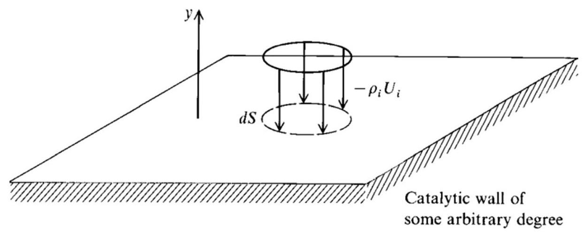

Fig. 17.1 Model for catalytic wall effects.

对于部分催化壁面:

At $y = 0$ ,

$$
{\left( {\dot{w}}_{c}\right) }_{i} = \rho {D}_{12}{\left( \frac{\partial {c}_{i}}{\partial y}\right) }_{w}
$$

对于无催化壁面:

$$
\text{ At }y = 0\text{ , }
$$

$$
{\left( \frac{\partial {c}_{i}}{\partial y}\right) }_{w} = 0
$$

(noncatalytic wall)

边界层条件: 催化壁

边界层外边界的边界条件是由流过给定物体的无黏流动这一独立知识给出的, 即:

$$
\text{ At }y = {\delta }_{u}
$$

$$
u = {u}_{e}
$$

$$
\text{ At }y = {\delta }_{T}
$$

$$
T = {T}_{e}
$$

$$
\text{ At }y = {\delta }_{c}\text{ , }
$$

$$
{c}_{i} = {\left( {c}_{i}\right) }_{e}
$$

边界层解: 离解气体的驻点热转换 ( Boundary-Layer Solutions: Stagnation-Point Heat Transfer for a Dissociating Gas)

## 边界层解: 离解气体的驻点热转换

了解离解气体的驻点流动的原因:

① 这是一个包含平衡和非平衡的化学反应流动自相似解的粒子。

) 由该相似解得到的驻点热转换的结果对于高超声速流动的应用及其重要。

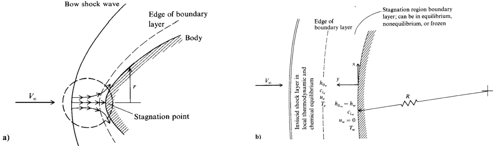

Fig. 17.2 Stagnation region flow model.

## 边界层解: 离解气体的驻点热转换

对物理模型做以下假设:

① 边界层的外边界流动条是局部热力学和化学平衡下的边界条件。激波层是部分离解的。

② 根据流动微粒在边界层中花费时间的长短和化学反应速率，边界层自身可以包含平衡流、非平衡流或冻结流的不同区域。

③ 驻点区域边界层外边界无黏速度分布由经典不可压解给出:

$$
{u}_{e} = {ax}\;\text{ 其中: }\;a = {\left( \frac{\mathrm{d}{u}_{e}}{\mathrm{\;d}x}\right) }_{s}
$$

## 边界层解: 离解气体的驻点热转换

对物理模型做以下假设:

④ 壁面可以是平衡催化的或非催化的。

⑤ 气体假设为双组分混合气体，由“重微粒”和“轻微粒”组成。

对边界层方程的自变量进行利斯-多罗德尼岑变换:

$$
\xi  = \xi \left( x\right)  = {\int }_{0}^{x}{\rho }_{w}{\mu }_{w}{u}_{e}{r}^{2}\mathrm{\;d}x
$$

$$
\eta  = \eta \left( {x, y}\right)  = \frac{r{u}_{e}}{\sqrt{2\xi }}{\int }_{0}^{y}\rho \mathrm{d}y
$$

## 边界层解: 离解气体的驻点热转换

对边界层方程的因变量进行变换:

$$
\frac{u}{{u}_{e}} = {f}^{\prime }\left( {\xi ,\eta }\right)  \equiv  \frac{\partial f}{\partial n}
$$

$$
\frac{T}{{T}_{e}} = \theta \left( {\xi ,\eta }\right)
$$

$$
\frac{{h}_{0}}{{h}_{{0}_{e}}} = \left( {h + \frac{{u}^{2}}{2}}\right) {h}_{{0}_{e}} = g\left( {\xi ,\eta }\right)
$$

$$
\frac{{c}_{i}}{{c}_{{i}_{e}}} = {s}_{i}\left( {\xi ,\eta }\right)
$$

变换后的边界层方程:

Momentum:

$$
{\left( l{f}^{\prime \prime }\right) }^{\prime } + f{f}^{\prime \prime } + 2\left\lbrack  {\frac{{\rho }_{e}}{\rho } - {\left( {f}^{\prime }\right) }^{2}}\right\rbrack  \frac{\mathrm{d}\left( {\ell n{u}_{e}}\right) }{\mathrm{d}\left( {ln\xi }\right) } = {2\xi }\left( {{f}^{\prime }\frac{{\partial }^{2}f}{\partial \eta \partial \xi } - {f}^{\prime \prime }\frac{\partial f}{\partial \xi }}\right)
$$

## 边界层解: 离解气体的驻点热转换

变换后的边界层方程:

Species continuity:

$$
\frac{\partial }{\partial \eta }\left\lbrack  {\frac{l}{\Pr }\left( \operatorname{Le}\right) {s}_{i}^{\prime }}\right\rbrack   + f{s}_{i}^{\prime } + \frac{{2\xi }{\dot{w}}_{i}}{{\rho }_{w}{\mu }_{w}{u}_{e}^{2}{r}^{2}\rho {c}_{{i}_{e}}} = {2\xi }\left( {{f}^{\prime }\frac{\partial {s}_{i}}{\partial \xi } - \frac{\partial f}{\partial \xi }{s}_{i}^{\prime }}\right)
$$

$$
+ 2{f}^{\prime }{s}_{i}\frac{\mathrm{d}\left( {\ln {c}_{{i}_{e}}}\right) }{\mathrm{d}\left( {\ln \xi }\right) }
$$

Energy:

$$
\frac{\partial }{\partial \eta }\left( {\frac{l}{Pr}{g}^{\prime }}\right)  + f{g}^{\prime } + \frac{{u}_{e}^{2}}{{h}_{{0}_{e}}}\frac{\partial }{\partial \eta }\left\lbrack  {\left( {1 - \frac{1}{Pr}}\right) l{f}^{\prime }{f}^{\prime \prime }}\right\rbrack   + \frac{\partial }{\partial \eta }\left\lbrack  {\frac{l}{Pr}\left( {\mathop{\sum }\limits_{i}\frac{{c}_{{i}_{e}}}{{h}_{{0}_{e}}}{h}_{i}}\right) \left( {{Le} - 1}\right) {s}_{i}^{\prime }}\right\rbrack
$$

$$
= {2\xi }\left( {{f}^{\prime }\frac{\partial g}{\partial \xi } - \frac{\partial f}{\partial \xi }{g}^{\prime }}\right)
$$

## 边界层解: 离解气体的驻点热转换

对圆球驻点区域应用变换后的边界层方程, 得到:

Momentum:

$$
{\left( l{f}^{\prime \prime }\right) }^{\prime } + f{f}^{\prime \prime } + \frac{1}{2}\left\lbrack  {\frac{{\rho }_{e}}{\rho } - {\left( {f}^{\prime }\right) }^{2}}\right\rbrack   = 0
$$

Species continuity:

$$
{\left( \frac{l}{Pr}Le{s}_{i}^{\prime }\right) }^{\prime } + f{s}_{i}^{\prime } + \frac{{\dot{w}}_{i}}{2{\left( \mathrm{\;d}{u}_{e}/\mathrm{d}x\right) }_{s}\rho {c}_{{i}_{e}}} = 0
$$

Energy:

$$
{\left( \frac{l}{Pr}{g}^{\prime }\right) }^{\prime } + f{g}^{\prime } + \frac{\mathrm{d}}{\mathrm{d}\eta }\left\lbrack  {\frac{l}{Pr}\left( {\mathop{\sum }\limits_{i}\frac{{c}_{{i}_{e}}}{{h}_{{0}_{e}}}{h}_{i}}\right) \left( {{Le} - 1}\right) {s}_{i}^{\prime }}\right\rbrack   = 0
$$

## 边界层解: 离解气体的驻点热转换

边界层外边界的转换边界条件为,当 $\eta  \rightarrow  \infty$ 有:

$$
{f}^{\prime } = 1\;g = 1\;\theta  = 1\;\text{ and }\;{s}_{i} = 1
$$

转换后的壁面上的边界条件为:

$$
{f}^{\prime }\left( 0\right)  = 0\;f\left( 0\right)  = 0\;g\left( 0\right)  = {g}_{w}\;\text{ and }\;\theta \left( 0\right)  = {\theta }_{w}
$$

对于平衡边界层和平衡催化壁面的非平衡或冻结边界层, 有以下结论:

$$
\text{ At }\eta  = 0,\;{s}_{i}\left( 0\right)  = \frac{{c}_{i}\left( 0\right) }{{c}_{{i}_{e}}} = \frac{{\left\lbrack  {c}_{i}\left( 0\right) \right\rbrack  }_{\text{ equil }}}{{c}_{{i}_{e}}}
$$

对于非催化壁面，有以下结论:

$$
\text{ At }\eta  = 0,\;{s}_{i}^{\prime }\left( 0\right)  = 0
$$

边界层解:离解气体的驻点热转换

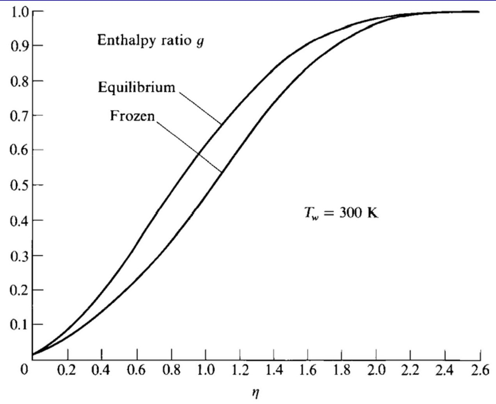

Fig. 17.3 Enthalpy profiles for an equilibrium and a frozen stagnation-point boundary layer. Equilibrium catalytic wall (from Fay and Riddell [196]).

## 边界层解: 离解气体的驻点热转换

表面的热传递, 写出如下形式:

$$
{q}_{w} = \underset{\text{ conduction }}{\underbrace{{\left( k\frac{\partial T}{\partial y}\right) }_{w}}} + \underset{\text{ diffusion }}{\underbrace{{\left( \rho {D}_{12}\mathop{\sum }\limits_{i}{h}_{i}\frac{\partial {c}_{i}}{\partial y}\right) }_{w}}}
$$

1. 平衡边界层:

$$
{q}_{w} = {0.76}{\Pr }^{-{0.6}}{\left( {\rho }_{e}{\mu }_{e}\right) }^{0.4}{\left( {\rho }_{w}{\mu }_{w}\right) }^{0.1}\sqrt{{\left( \frac{\mathrm{d}{u}_{e}}{\mathrm{\;d}x}\right) }_{s}}\left( {{h}_{{0}_{e}} - {h}_{w}}\right)  \times  \left\lbrack  {1 + \left( {L{e}^{0.52} - 1}\right) \left( \frac{{h}_{D}}{{h}_{{0}_{e}}}\right) }\right\rbrack
$$

2. 平衡催化壁面的冻结边界层:

$$
{q}_{w} = {0.76}{\Pr }^{-{0.6}}{\left( {\rho }_{e}{\mu }_{e}\right) }^{0.4}{\left( {\rho }_{w}{\mu }_{w}\right) }^{0.1}\sqrt{{\left( \frac{\mathrm{d}{u}_{e}}{\mathrm{\;d}x}\right) }_{s}}\left( {{h}_{{0}_{e}} - {h}_{w}}\right)  \times  \left\lbrack  {1 + \left( {L{e}^{0.63} - 1}\right) \left( \frac{{h}_{D}}{{h}_{{0}_{e}}}\right) }\right\rbrack
$$

3. 无催化壁面的冻结边界层:

$$
{q}_{w} = {0.76}{\Pr }^{-{0.6}}{\left( {\rho }_{e}{\mu }_{e}\right) }^{0.4}{\left( {\rho }_{w}{\mu }_{w}\right) }^{0.1}\sqrt{{\left( \frac{\mathrm{d}{u}_{e}}{\mathrm{\;d}x}\right) }_{s}\left( {1 - \frac{{h}_{D}}{{h}_{{0}_{e}}}}\right) }
$$

边界层解: 离解气体的驻点热转换

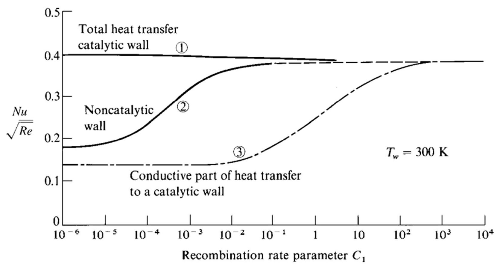

Fig. 17.5 Catalytic wall effect on stagnation-point heat transfer (from [196]).

化学反应流动的黏性激波层解 ( Viscous-Shock-Layer Solutions to Chemically Reacting Flow)

## 化学反应流动的黏性激波层解

对于化学反应气体，黏性激波层的基本方程不变(第八章内容)，还需增加一个新的能量方程和组分连续性方程:

$$
\text{ y: }\;{\rho }^{ * }{c}_{pf}^{ * }\left( {\frac{{u}^{ * }}{1 + {n}^{ * }{\kappa }^{ * }}\frac{\partial {T}^{ * }}{\partial {s}^{ * }} + {v}^{ * }\frac{\partial {T}^{ * }}{\partial {n}^{ * }}}\right)  - \left( {\frac{{u}^{ * }}{1 + {n}^{ * }{\kappa }^{ * }}\frac{\partial {p}^{ * }}{\partial {s}^{ * }} + {v}^{ * }\frac{\partial {p}^{ * }}{\partial {n}^{ * }}}\right)
$$

$$
= {\varepsilon }^{2}\left\lbrack  {\frac{{\partial }^{ * }}{\partial {n}^{ * }}\left( {{k}^{ * }\frac{\partial {T}^{ * }}{\partial {n}^{ * }}}\right)  + \left( {\frac{{\kappa }^{ * }}{1 + {n}^{ * }{\kappa }^{ * }} + \frac{m\cos \phi }{{r}^{ * } + {n}^{ * }\cos \phi }}\right) {k}^{ * }\frac{\partial {T}^{ * }}{\partial {n}^{ * }}}\right.
$$

$$
\left. {-\mathop{\sum }\limits_{i}{c}_{pf}^{ * }\left( {{\rho }^{ * }{D}_{12}^{ * }\frac{\partial {c}_{i}}{\partial {n}^{ * }}}\right) \left( \frac{\partial {T}^{ * }}{\partial {n}^{ * }}\right)  + {\mu }^{ * }{\left( \frac{\partial {u}^{ * }}{\partial {n}^{ * }} - \frac{{\kappa }^{ * }{u}^{ * }}{1 + {n}^{ * }{\kappa }^{ * }}\right) }^{2}}\right\rbrack   - \mathop{\sum }\limits_{i}{h}_{i}^{ * }{\dot{w}}_{i}^{ * }
$$

Species continuity: ${\rho }^{ * }\left( {\frac{{u}^{ * }}{1 + {n}^{ * }{\kappa }^{ * }}\frac{\partial {c}_{i}}{\partial {s}^{ * }} + {v}^{ * }\frac{\partial {c}_{i}}{\partial {n}^{ * }}}\right)  = {\dot{w}}_{i}^{ * } + \frac{{\varepsilon }^{2}}{\left( {1 + {n}^{ * }{\kappa }^{ * }}\right) {\left( {r}^{ * } + {n}^{ * }\cos \phi \right) }^{m}}$

$$
\times  \left\{  {\frac{\partial }{\partial {n}^{ * }}\left\lbrack  {\left( {1 + {n}^{ * }{\kappa }^{ * }}\right) {\left( {r}^{ * } + {n}^{ * }\cos \phi \right) }^{m}{\rho }^{ * }{D}_{12}^{ * }\frac{\partial {c}_{i}}{\partial {n}^{ * }}}\right\rbrack  }\right\}
$$

化学反应流动的黏性激波层解

结果:

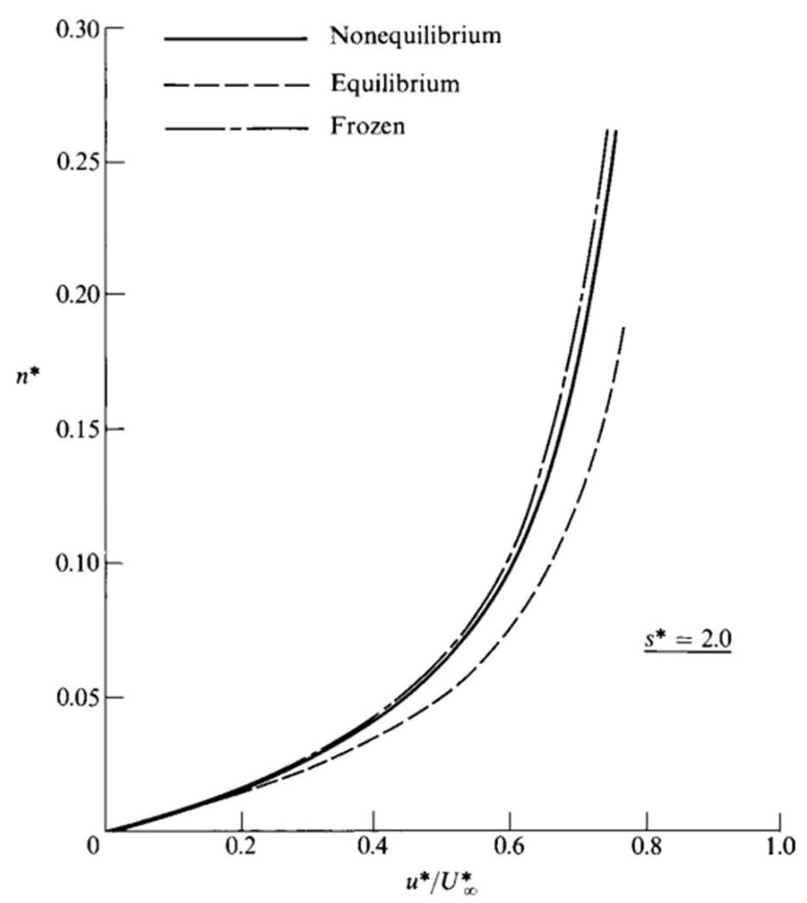

Fig. 17.9 Shock-layer velocity profiles on a hyperboloid. VSL calculations by Moss [199].

化学反应流动的黏性激波层解

结果:

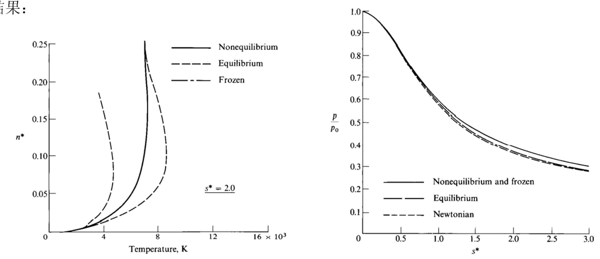

Fig. 17.10 Shock-layer temperature profiles on a hyperboloid. VSL calculation Fig. 17.11 Pressure distributions along a hyperboloid (from [199]). Moss [199].

化学反应流动的黏性激波层解

结果:

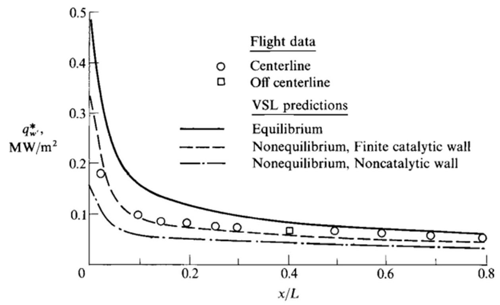

Fig. 17.16 Catalytic wall effects on convective heating along the windward centerline of the space shuttle: ${V}_{\infty } = {6.73}\mathrm{\;{km}}/\mathrm{s}$ , and altitude $= {71}\mathrm{\;{km}}$ (from Shinn et al. [202]).

化学反应流动的抛物化纳维-斯托克斯解 ( Parabolized Navier-Stokes Solutions to Chemically Reacting Flows)

结果:

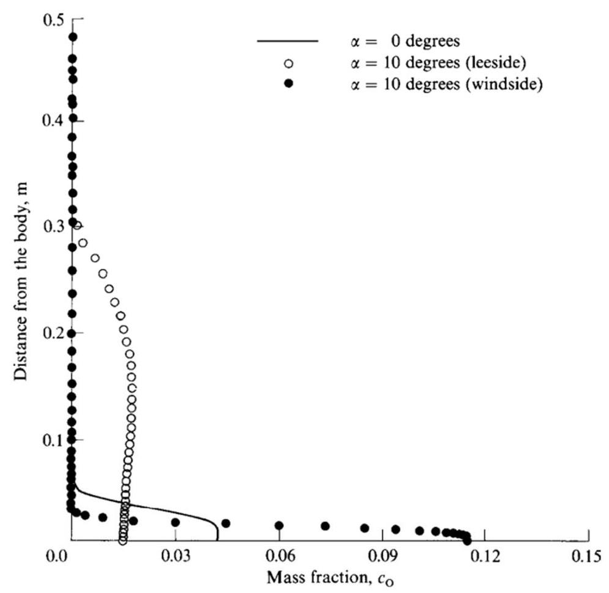

Fig. 17.18 Shock-layer atomic-oxygen mass fraction profiles for the nonequilibrium flow over a 10-deg cone at angle of attack. PNS calculations of Prabhu and Marvin [204].

化学反应流动的抛物化纳维-斯托克斯解

结果:

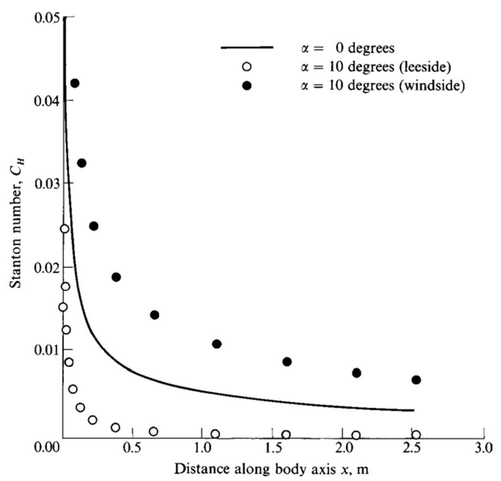

Fig. 17.19 Heat-transfer distributions on a 10-deg cone at angle of attack. Nonequilibrium flow (from [204]).

化学反应流动的全纳维-斯托克斯解 ( Full Navier-Stokes Solutions to Chemically Reacting Flows

化学反应流动的全纳维-斯托克斯解

例子1:

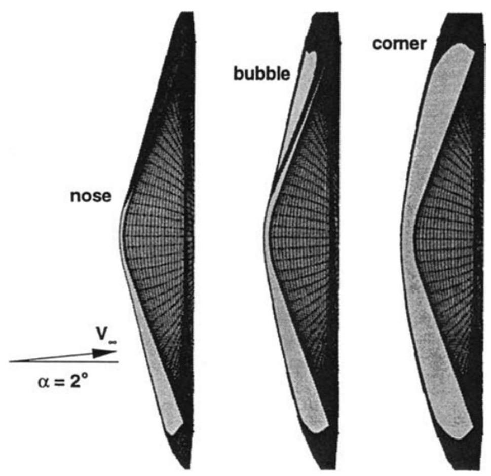

Fig. 17.20 Sonic line locations for the Mars Pathfinder at 2-deg angle of attack in the symmetry plane at Mach 22.3 (left), 16 (center), and 9.4 (right) showing the effect of gas chemisry (Gnoffo [266]).

化学反应流动的全纳维-斯托克斯解

例子2:

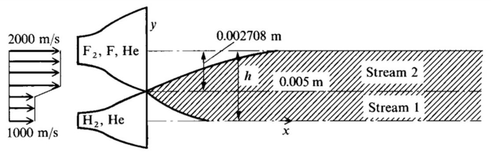

Nozzle configuration

<table><tr><td></td><td>Stream 1</td><td>Stream 2</td></tr><tr><td>$P,\mathrm{\;n}/{\mathrm{m}}^{2}$</td><td>500</td><td>500</td></tr><tr><td>$T,\mathrm{\;K}$</td><td>150</td><td>150</td></tr><tr><td>$\rho ,\mathrm{{kg}}/{\mathrm{m}}^{3}$</td><td>${1.2862} \times  {10}^{-3}$</td><td>${2.4514} \times  {10}^{-3}$</td></tr><tr><td>${\rho }_{{\mathrm{F}}_{2}},\mathrm{{kg}}/{\mathrm{m}}^{3}$</td><td></td><td>${7.3128} \times  {10}^{-4}$</td></tr><tr><td>${\rho }_{{\mathrm{H}}_{2}},\mathrm{\;{kg}}/{\mathrm{m}}^{3}$</td><td>${3.2328} \times  {10}^{-4}$</td><td></td></tr><tr><td>${\rho }_{\mathrm{F}},\mathrm{{kg}}/{\mathrm{m}}^{3}$</td><td></td><td>${2.4376} \times  {10}^{-4}$</td></tr><tr><td>${\rho }_{\mathrm{H}},\mathrm{{kg}}/{\mathrm{m}}^{3}$</td><td></td><td></td></tr><tr><td>${\rho }_{\mathrm{{He}}},\mathrm{{kg}}/{\mathrm{m}}^{3}$</td><td>${9.6288} \times  {10}^{-4}$</td><td>${1.4764} \times  {10}^{-3}$</td></tr></table>

Fig. 17.21 Chemical laser model used by Kothari et al. [208].