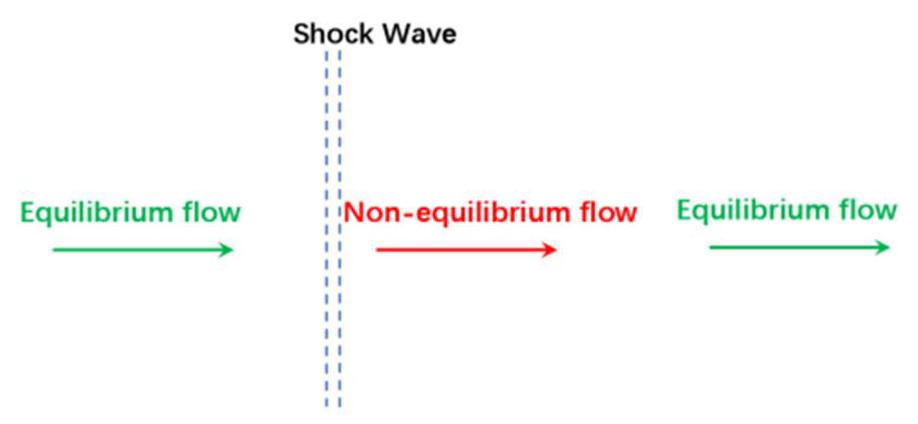
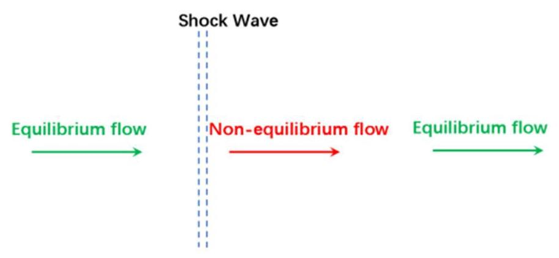
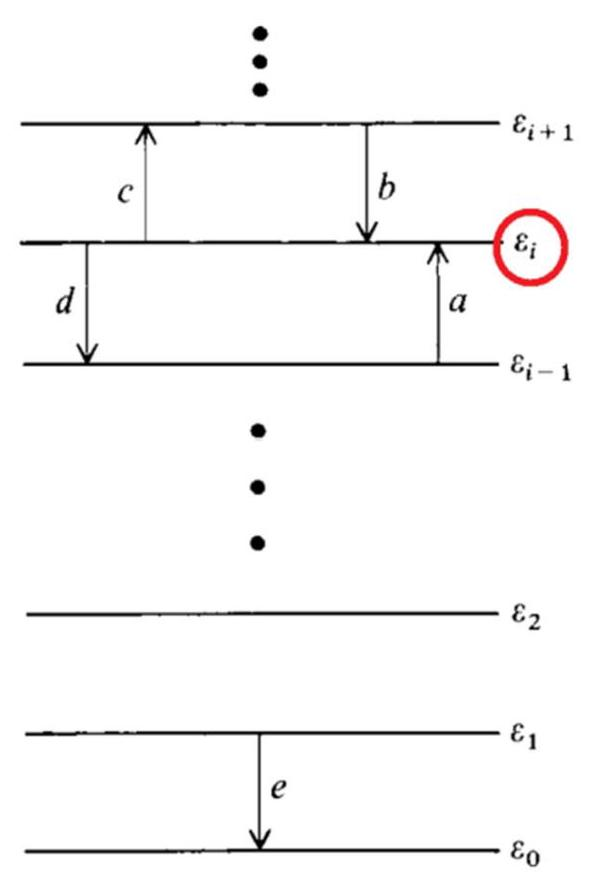
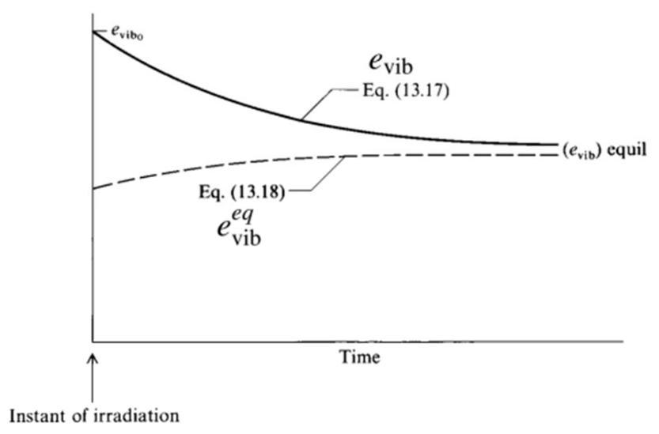
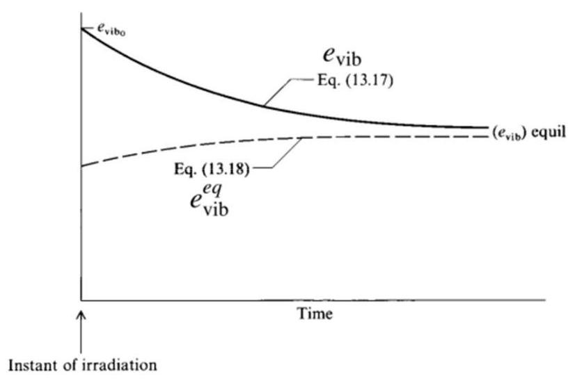

# 化学与振动的非平衡 (Chemical and Vibrational Nonequilibrium)

李文丰

西北工业大学

w.li@nwpu.edu.cn

2022年11月23日

## 目录

2 引言

Introduction

实 振动的非平衡: 振动率方程

Vibrational Nonequilibrium: The Vibrational Rate Equation

C 化学非平衡: 化学速率方程

Chemical Nonequilibrium: The Chemical Rate Equation

- 高温空气的化学非平衡

Chemical Nonequilibrium in High-Temperature Air

## 引言 (Introduction)

## Nonequilibrium flow

- All vibrational and chemical processes take place by molecular collisions and/or radiative interactions.

- Collisions take time to occur. Hence, vibrational and chemical changes in a gas take time to occur.

- For equilibrium systems, it is assumed that the gas always has enough time for the necessary collisions to keep properties of the system at a fixed $p$ and $T$ are constant.

- However, there are many problems in high-speed gas dynamics where the gas is not given the luxury of the necessary time to come to equilibrium.

In this case, the gas (flow) is non-equilibrium.

Nonequilibrium flow

Consider a fluid element passing through this shock front.

- Since its $p$ and $T$ are suddenly increased, its equilibrium vibrational and chemical properties will change.

- The fluid element will need molecular collisions(hence time) to seek new equilibrium properties.

## Nonequilibrium flow

Consider a fluid element passing through this shock front.

- By the time equilibrium properties have been approached, the fluid element has moved a certain distance downstream.

- Hence, there will be a nonequilibrium region immediately behind the shock wave.

# 振动的非平衡: 振动率方程 (Vibrational Nonequilibrium: The Vibrational Rate Equation)

Vibrational Nonequilibrium: The Vibrational Rate Equation

## frame title

Fig. 13.1 Single quantum transition for vibrational energy exchange.

- Assume vibrational energy is quantumized

Variation of the population of Level $i$ is resulted from exchanging between neighbor levels $(i - 1$ and $i + 1)$

- In equilibrium, each transition in a given direction is exactly balanced by its counterpart in the opposite direction.

$$
a \equiv  \Delta {N}_{i - 1 \rightarrow  i} = \Delta {N}_{i \rightarrow  i - 1} \equiv  d
$$

## The Vibrational Rate Equation

Skip details of the derivation, finally we can obtain the vibrational rate equation (Equ. 13.7)

$$
\frac{d{e}_{vib}}{dt} = \frac{1}{\tau }\left( {{e}_{vib}^{eq} - {e}_{vib}}\right)
$$

The equilibrium vibrational energy for given $T$ (Equ. 13.8)

$$
{e}_{vib}^{eq} = \frac{{hv}/{kT}}{{e}^{{hv}/{kT}} - 1}{RT}
$$

The relaxation time for given $T$

$$
\tau  \equiv  \frac{1}{{k}_{1,0}\left( {1 - {e}^{-{hv}/{kT}}}\right) }
$$

The Vibrational Rate Equation

Fig. 13.2 Vibrational relaxation toward equilibrium.

- Initially, ${e}_{vib}\left( {t = 0}\right)  > {e}_{vib}^{eq}$

- Because of molecular collisions, the excited particles will exchange this "excess" vibrational energy with the translational and rotational energy of the gas, making ${e}_{vib}$ decrease and approach to its equilibrium value.

The Vibrational Rate Equation

Fig. 13.2 Vibrational relaxation toward equilibrium.

- However, translational energy increases, $T$ increases. In turn, the equilibrium value of vibrational energy, ${e}_{vib}^{eq}\left( T\right)$ , will also increase.

- At large times, ${e}_{vib}$ and ${e}_{vib}^{eq}$ will approach the same value.

Vibrational Nonequilibrium: The Vibrational Rate Equation

## The Vibrational Rate Equation

Limitations

- It holds only for diatomic molecules that are harmonic oscillators

- It considers only single quantum jumps between energy levels, although this knid of jumps is dominant

- It assumes that spacings between all energy levels are the same.

- It considers only translation-vibration (T-V) transfers, such as

$$
{CO}\left( n\right)  + {CO}\left( n\right)  \Leftrightarrow  {CO}\left( {n - 1}\right)  + \left\lbrack  {{CO}\left( n\right)  + {KE}}\right\rbrack
$$

but not vibration-vibration (V-V) transfers

$$
{CO}\left( n\right)  + {CO}\left( n\right)  \Leftrightarrow  {CO}\left( {n - 1}\right)  + {CO}\left( {n + 1}\right)
$$

# 化学非平衡: 化学速率方程 (Chemical Nonequilibrium: The Chemical Rate Equation)

Chemical Nonequilibrium: The Chemical Rate Equation

## The Chemical Rate Equation

For a chemical reaction

$$
\mathop{\sum }\limits_{{i = 1}}{v}_{i}^{\prime }{X}_{i} \leftrightarrow  \mathop{\sum }\limits_{{i = 1}}{v}_{i}^{\prime \prime }{X}_{i}
$$

Forward reaction

$$
\frac{\mathrm{d}\left\lbrack  {X}_{j}\right\rbrack  }{\mathrm{d}t} = \left( {{v}_{j}^{\prime \prime } - {v}_{j}^{\prime }}\right) {k}_{f}\mathop{\prod }\limits_{i}{\left\lbrack  {X}_{i}\right\rbrack  }^{{v}_{i}^{\prime }}
$$

Backward reaction

$$
\frac{\mathrm{d}\left\lbrack  {X}_{j}\right\rbrack  }{\mathrm{d}t} =  - \left( {{v}_{j}^{\prime \prime } - {v}_{j}^{\prime }}\right) {k}_{b}\mathop{\prod }\limits_{i}{\left\lbrack  {X}_{i}\right\rbrack  }^{{v}_{i}^{\prime \prime }}
$$

The net rate of variation of $\left\lbrack  {X}_{i}\right\rbrack$ is

$$
\frac{\mathrm{d}\left\lbrack  {X}_{j}\right\rbrack  }{\mathrm{d}t} = \left( {{v}_{j}^{\prime \prime } - {v}_{j}^{\prime }}\right) \left\lbrack  {{k}_{f}\mathop{\prod }\limits_{i}{\left\lbrack  {X}_{i}\right\rbrack  }^{{v}_{i}^{\prime }} - {k}_{b}\mathop{\prod }\limits_{i}{\left\lbrack  {X}_{i}\right\rbrack  }^{{v}_{i}^{\prime \prime }}}\right\rbrack
$$

Chemical Nonequilibrium: The Chemical Rate Equation

## Chemical Rate

At equilibrium states

$$
0 = {k}_{f}\mathop{\prod }\limits_{i}{\left\lbrack  {X}_{i}\right\rbrack  }^{*{v}_{i}^{\prime }} - {k}_{b}\mathop{\prod }\limits_{i}{\left\lbrack  {X}_{i}\right\rbrack  }^{*{v}_{i}^{\prime \prime }} \Rightarrow  \frac{{k}_{f}}{{k}_{b}} = \frac{\mathop{\prod }\limits_{i}{\left\lbrack  {X}_{i}\right\rbrack  }^{*{v}_{i}^{\prime \prime }}}{\mathop{\prod }\limits_{i}{\left\lbrack  {X}_{i}\right\rbrack  }^{*{v}_{i}^{\prime }}} = \frac{\mathop{\prod }\limits_{i}{p}_{i}^{{v}_{i}^{\prime \prime }}}{\mathop{\prod }\limits_{i}{p}_{i}^{{v}_{i}^{\prime }}} = {K}_{c}
$$

${k}_{f}$ and ${k}_{b}$ can be calculated as follows

$$
{k}_{f} = {c}_{1}{T}^{\alpha }{e}^{-{\varepsilon }_{0}/{kT}}\;\frac{{k}_{f}}{{k}_{b}} = {K}_{c}
$$

where constants ${c}_{1},\alpha ,{\varepsilon }_{0}$ and ${K}_{c}$ are obtained by experiments.

## Elementary Reactions

It is important to note that all of the preceding formalism applies only to elementary reactions. An elementary chemical reaction is one that takes place in a single step.

An elementary chemical reaction

$$
{O}_{2} + M \Rightarrow  {2O} + M
$$

- A non-elementary chemical reaction

$$
2{\mathrm{H}}_{2} + {\mathrm{O}}_{2} \Rightarrow  2{\mathrm{H}}_{2}\mathrm{O}
$$

## Elementary Reactions

$$
2{\mathrm{H}}_{2} + {\mathrm{O}}_{2} \Rightarrow  2{\mathrm{H}}_{2}\mathrm{O}
$$

is a statement of an overall reaction that actually takes place through a series of elementary steps:

$$
{H2} \rightarrow  {2H}
$$

$$
{O2} \rightarrow  {2O}
$$

$$
H + {O}_{2} \rightarrow  {HO} + O
$$

$$
\mathrm{O} + {\mathrm{H}}_{2} \rightarrow  \mathrm{{HO}} + \mathrm{H}
$$

$$
\mathrm{{OH}} + {\mathrm{H}}_{2} \rightarrow  {\mathrm{H}}_{2}\mathrm{O} + \mathrm{H}
$$

The Third Party

$$
{NO} + M \Leftrightarrow  N + O + M
$$

The third party $M$ , any of the different species.

If all the species are ${N}_{2}\text{ 、 }{O}_{2}\text{ 、 }{NO}\text{ 、 }O\text{ 、 }N\text{ 、 }{e}^{ - }$ , this statement is really the following equations:

$$
\begin{array}{l} {NO} + {N}_{2} \Leftrightarrow  N + O + {N}_{2} \\  \end{array}
$$

$$
{NO} + {O}_{2} \Leftrightarrow  N + O + {O}_{2}
$$

$$
{NO} + {NO} \Leftrightarrow  N + O + {NO}
$$

$$
{NO} + O \Leftrightarrow  N + O + O
$$

$$
{NO} + N \Leftrightarrow  N + O + N
$$

$$
{NO} + {e}^{ - } \Leftrightarrow  N + O + {e}^{ - }
$$

# 高温空气的化学非平衡 (Chemical Nonequilibrium in High-Temperature Air)

Chemical Nonequilibrium in High-Temperature Air

$$
{\mathrm{O}}_{2} + M\overset{{k}_{{f}_{1}}}{\underset{{k}_{{b}_{1}}}{ \rightleftharpoons  }}2\mathrm{O} + M \tag{13.38}
$$

$$
{\mathrm{N}}_{2} + M\overset{{k}_{{f}_{2}}}{\underset{{k}_{{b}_{2}}}{ \rightleftharpoons  }}2\mathrm{\;N} + M \tag{13.39}
$$

$$
\mathrm{{NO}} + M\overset{{k}_{{f}_{3}}}{\underset{{k}_{{b}_{3}}}{ \rightleftharpoons  }}\mathrm{\;N} + \mathrm{O} + M \tag{13.40}
$$

$$
{\mathrm{O}}_{2} + \mathrm{N}\underset{{k}_{{b}_{4}}}{\overset{{k}_{{f}_{4}}}{ \rightleftharpoons  }}\mathrm{{NO}} + \mathrm{O} \tag{13.41}
$$

$$
{\mathrm{N}}_{2} + \mathrm{O}\overset{{k}_{{f}_{5}}}{\underset{{k}_{{b}_{5}}}{ \rightleftharpoons  }}\mathrm{{NO}} + \mathrm{N} \tag{13.42}
$$

$$
{\mathrm{N}}_{2} + {\mathrm{O}}_{2}\underset{{k}_{{b}_{6}}}{\overset{{k}_{{f}_{6}}}{ \rightleftharpoons  }}2\mathrm{{NO}} \tag{13.43}
$$

Chemical Nonequilibrium in High-Temperature Air

$$
{NO} + M \Leftrightarrow  N + O + M
$$

is really the following equations:

$$
\mathrm{{NO}} + {\mathrm{O}}_{2}\overset{{k}_{{f}_{3a}}}{\underset{{k}_{{b}_{3a}}}{ \rightleftharpoons  }}\mathrm{\;N} + \mathrm{O} + {\mathrm{O}}_{2} \tag{13.40a}
$$

$$
\mathrm{{NO}} + {\mathrm{N}}_{2} \rightleftharpoons  \frac{{k}_{{f}_{3b}}}{{k}_{{b}_{3b}}}\mathrm{\;N} + \mathrm{O} + {\mathrm{N}}_{2} \tag{13.40b}
$$

$$
\mathrm{{NO}} + \mathrm{{NO}}\overset{{k}_{{f}_{3c}}}{\underset{{k}_{{b}_{3c}}}{ \rightleftharpoons  }}\mathrm{\;N} + \mathrm{O} + \mathrm{{NO}} \tag{13.40c}
$$

$$
\mathrm{{NO}} + \mathrm{O}\overset{\overset{{k}_{{f}_{3d}}}{ \rightleftharpoons  }}{\underset{{k}_{{b}_{3d}}}{ \rightleftharpoons  }}\mathrm{\;N} + \mathrm{O} + \mathrm{O} \tag{13.40d}
$$

$$
\mathrm{{NO}} + \mathrm{N}\overset{{k}_{{f}_{3e}}}{\underset{{k}_{{b}_{3e}}}{ \rightleftharpoons  }}\mathrm{\;N} + \mathrm{O} + \mathrm{N} \tag{13.40e}
$$

Chemical Nonequilibrium in High-Temperature Air

The chemical rate equation for ${NO}$ is

$$
\frac{\mathrm{d}\left\lbrack  \mathrm{{NO}}\right\rbrack  }{\mathrm{d}t} =  - {k}_{{f}_{3a}}\left\lbrack  \mathrm{{NO}}\right\rbrack  \left\lbrack  {\mathrm{O}}_{2}\right\rbrack   + {k}_{{b}_{3a}}\left\lbrack  \mathrm{\;N}\right\rbrack  \left\lbrack  \mathrm{O}\right\rbrack  \left\lbrack  {\mathrm{O}}_{2}\right\rbrack
$$

$$
- {k}_{{f}_{3b}}\left\lbrack  \mathrm{{NO}}\right\rbrack  \left\lbrack  {\mathrm{N}}_{2}\right\rbrack   + {k}_{{b}_{3b}}\left\lbrack  \mathrm{\;N}\right\rbrack  \left\lbrack  \mathrm{O}\right\rbrack  \left\lbrack  {\mathrm{N}}_{2}\right\rbrack
$$

$$
- {k}_{{f}_{3c}}{\left\lbrack  \mathrm{{NO}}\right\rbrack  }^{2} + {k}_{{b}_{3c}}\left\lbrack  \mathrm{\;N}\right\rbrack  \left\lbrack  \mathrm{O}\right\rbrack  \left\lbrack  \mathrm{{NO}}\right\rbrack
$$

$$
- {k}_{{f}_{3d}}\left\lbrack  \mathrm{{NO}}\right\rbrack  \left\lbrack  \mathrm{O}\right\rbrack   + {k}_{{b}_{3d}}\left\lbrack  \mathrm{\;N}\right\rbrack  \left\lbrack  {\mathrm{O}}^{2}\right\rbrack
$$

$$
- {k}_{{f}_{3e}}\left\lbrack  \mathrm{{NO}}\right\rbrack  \left\lbrack  \mathrm{N}\right\rbrack   + {k}_{{b}_{3e}}{\left\lbrack  \mathrm{\;N}\right\rbrack  }^{2}\left\lbrack  \mathrm{O}\right\rbrack
$$

$$
- {k}_{{f}_{3f}}\left\lbrack  \mathrm{{NO}}\right\rbrack  {\left\lbrack  \mathrm{{NO}}\right\rbrack  }^{ + } + {k}_{{b}_{3f}}\left\lbrack  \mathrm{\;N}\right\rbrack  \left\lbrack  \mathrm{O}\right\rbrack  \left\lbrack  {\mathrm{{NO}}}^{ - }\right\rbrack
$$

$$
- {k}_{{f}_{3g}}\left\lbrack  \mathrm{{NO}}\right\rbrack  \left\lbrack  {e}^{ - }\right\rbrack   + {k}_{{b}_{3g}}\left\lbrack  \mathrm{\;N}\right\rbrack  \left\lbrack  \mathrm{O}\right\rbrack  \left\lbrack  {e}^{ - }\right\rbrack
$$

$$
+ {k}_{{f}_{4}}\left\lbrack  {\mathrm{O}}_{2}\right\rbrack  \left\lbrack  \mathrm{N}\right\rbrack   - {k}_{{b}_{4}}\left\lbrack  \mathrm{{NO}}\right\rbrack  \left\lbrack  \mathrm{O}\right\rbrack
$$

$$
+ {k}_{{f}_{5}}\left\lbrack  {\mathrm{\;N}}_{2}\right\rbrack  \left\lbrack  \mathrm{O}\right\rbrack   - {k}_{{b}_{5}}\left\lbrack  \mathrm{\;{NO}}\right\rbrack  \left\lbrack  \mathrm{\;N}\right\rbrack
$$

$$
+ 2{k}_{{f}_{6}}\left\lbrack  {\mathrm{\;N}}_{2}\right\rbrack  \left\lbrack  {\mathrm{O}}_{2}\right\rbrack   - 2{k}_{{b}_{6}}{\left\lbrack  \mathrm{\;{NO}}\right\rbrack  }^{2}
$$

(13.45)

Chemical Nonequilibrium in High-Temperature Air

## Two-Temperature Kinetic Model

- The temperature $T$ that appears in all preceding sections is labeled the translational temperature. Both vibrational relaxation time ${\tau }_{vib}$ , chemical rate ${k}_{f}$ and ${k}_{b}$ depend on $T$ . This reflects the contribution of collision of molecules.

However, in the special case that both vibrational and chemical nonequilibrium simultaneously exist in a mixture of gases, there is a coupling between the chemical reaction rates and the vibrational relaxation rates that affects the values of each.

## Chemical Nonequilibrium in High-Temperature Air

## Two-Temperature Kinetic Model

- The precise accounting of this mutual coupling phenomena on both the vibrational and chemical rates is complex.

- An attempt to deal approximately with this coupling involves the definition of a vibrational temperature ${T}_{vib}$ as follows.

$$
{e}_{vib}^{eq} = \frac{{hv}/k{T}_{vib}}{{e}^{{hv}/k{T}_{vib}} - 1}{RT}
$$

- To account for this effect on the chemical rate constant, Park suggests that the instantaneous vibrational and translational temperatures be combined to form an average temperature ${T}_{a} = \sqrt{T{T}_{vib}}$ (or more generally ${T}_{a} = {T}^{q}{T}_{vib}^{1 - q}$ , $q \in  \left\lbrack  {{0.3} \backsim  {0.5}}\right\rbrack  )$ . And that ${T}_{a}$ rather than $T$ be used to calculate the chemical rate constants.