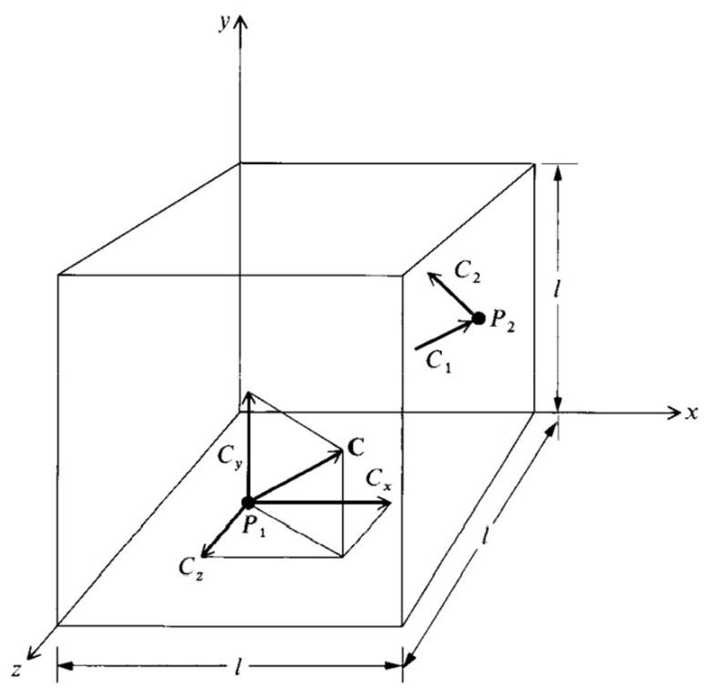
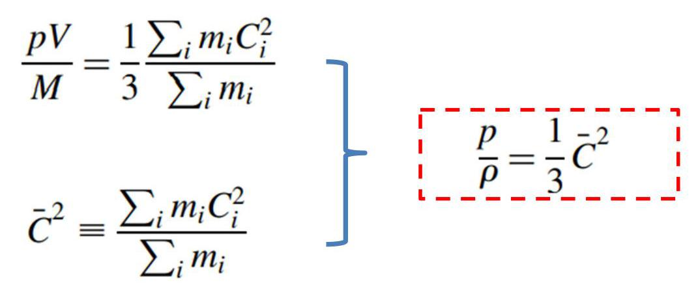
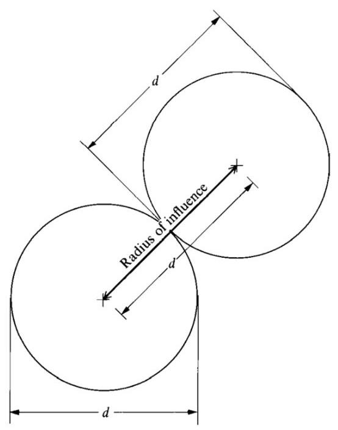
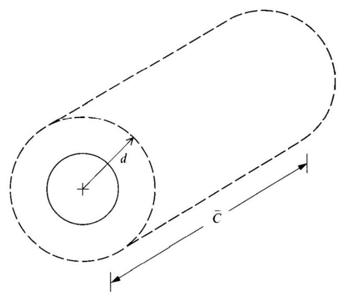
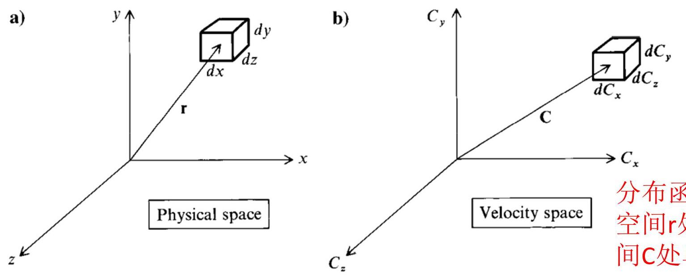
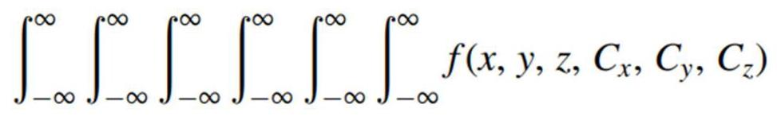
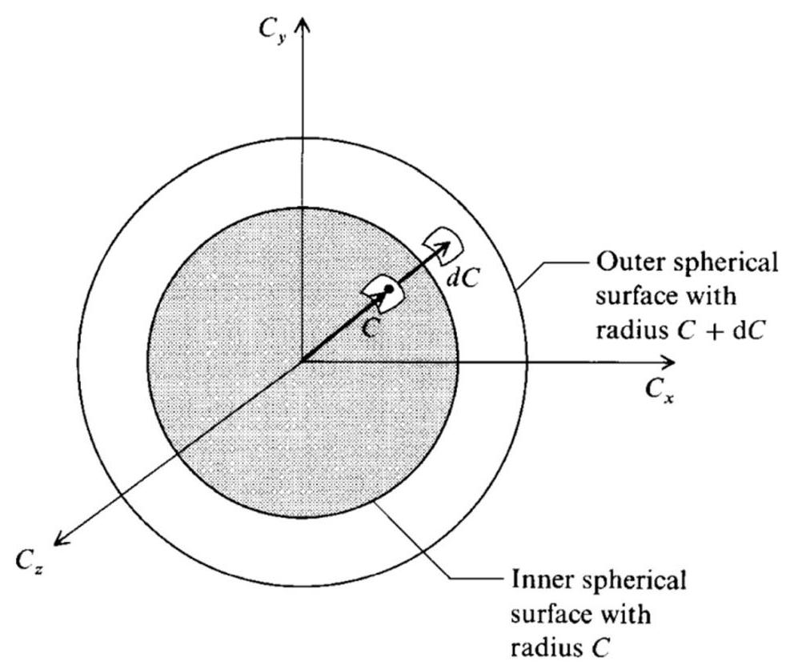
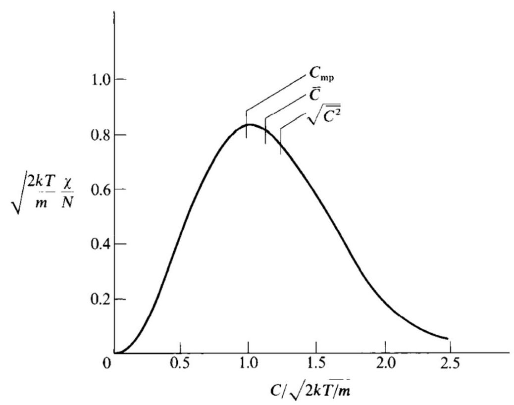

(Elements of Kinetic Theory)

李文丰

西北工业大学

w.li@nwpu.edu.cn

2022年11月23日

## 目录

C 完全气体状态方程 (再次讨论)

Perfect-Gas Equation of State (Revisited)

- 碰撞频率和平均自由程

Collision Frequency and Mean Free Path

类, 速度和速率分布函数: 平均速度

Velocity and Speed Distribution Functions: Mean Velocities

# 完全气体状态方程(再次讨论) (Perfect-Gas Equation of State (Revisited))

$$
p = \frac{1}{V}\mathop{\sum }\limits_{i}{m}_{i}{C}_{i, z}^{2}
$$

Fig. 12.1 Particle moving in a box; illustration of particle velocity components.

系统中的所有微粒作用于右表面的压力为:

$$
p = \frac{1}{V}\mathop{\sum }\limits_{i}{m}_{i}{C}_{i, x}^{2}
$$

上表面的压力为:

$$
p = \frac{1}{V}\mathop{\sum }\limits_{i}{m}_{i}{C}_{i, y}^{2}
$$

作用于垂直于 $\mathrm{z}$ 轴表面的压力为:

$$
p = \frac{1}{3V}\mathop{\sum }\limits_{i}{m}_{i}\left( {{C}_{i, x}^{2} + {C}_{i, y}^{2} + {C}_{i, z}^{2}}\right)  = \frac{1}{3V}\mathop{\sum }\limits_{i}{m}_{i}{C}_{i}^{2}
$$

## 完全气体状态方程

系统的总动能为:

$$
\left. \begin{array}{l} {E}_{\text{ trans }}^{\prime } = \frac{1}{2}\mathop{\sum }\limits_{i}{m}_{i}{C}_{i}^{2} \\  p = \frac{1}{3V}\mathop{\sum }\limits_{i}{m}_{i}{C}_{i}^{2} \end{array}\right\}
$$

完全气体状态方程的分子运动论等价方程

其他等价形式:

# 碰撞频率和平均自由程 (Velocity and Speed Distribution Functions: Mean Velocities)

碰撞频率和平均自由程

Fig. 12.2 Illustration of radius of influence.

单微粒碰撞频率为:

$$
{Z}^{\prime } = {n\pi }{d}^{2}\bar{C}
$$

Fig. 12.3 Cylindrical volume swept out in 1 s by a particle with a radius of influence $d$ , moving at a mean speed $\bar{C}$ .

平均自由程:粒子两次碰撞间经过的平均距离。

$$
\lambda  = \frac{\bar{C}}{{Z}^{\prime }} = \frac{1}{{n\pi }{d}^{2}}
$$

## 碰撞频率和平均自由程

以上推导不考虑分子之间的相对速度, 实际情况更为复杂化学组分 $A$ 的单个分子和化学组分B的分子之间的单微粒碰撞频率为:

$$
{Z}_{AB} = {n}_{B}\pi {d}^{2}{\bar{C}}_{AB}
$$

其中:

$$
{\bar{C}}_{AB} = \sqrt{\frac{8kT}{\pi {m}_{AB}^{ * }}}
$$

$$
{Z}_{AB} = {n}_{B}\pi {d}_{AB}^{2}\sqrt{\frac{8kT}{\pi {m}_{AB}^{ * }}}
$$

约化质量定义为:

$$
{m}_{AB}^{ * } \equiv  \frac{{m}_{A}{m}_{B}}{{m}_{A} + {m}_{B}}
$$

## 碰撞频率和平均自由程

单一组分气体, 单微粒碰撞频率为:

$$
Z = \frac{n}{\sqrt{2}}\pi {d}^{2}\bar{C} = \frac{n}{\sqrt{2}}\pi {d}^{2}\sqrt{\frac{8kT}{\pi m}}
$$

考虑分子相对速度, 单一组分气体的平均自由程为:

$$
\lambda  = \frac{1}{\sqrt{2}\pi {d}^{2}n}
$$

给出上面两个式子的目的:指出碰撞频率和平均自由程如何随气体压强和温度变化。

$$
Z \propto  \frac{p}{\sqrt{T}}
$$

$$
\lambda  \propto  \frac{T}{p}
$$

# 速度和速率分布函数: 平均速度 (Collision Frequency and Mean Free Path)

速度和速率分布函数: 平均速度

Fig. 12.4 Illustration of volume elements in physical and velocity spaces.

空间 $r$ 处单位体积,和速度空间C处单位体积上的微粒子数

$f\left( {x, y, z,{C}_{x},{C}_{y},{C}_{z}}\right) \mathrm{d}x\mathrm{\;d}y\mathrm{\;d}z\mathrm{\;d}{C}_{x}\mathrm{\;d}{C}_{y}\mathrm{\;d}{C}_{z}$

$\times  \mathrm{d}x\mathrm{\;d}y\mathrm{\;d}z\mathrm{\;d}{C}_{x}\mathrm{\;d}{C}_{y}\mathrm{\;d}{C}_{z} = N$

$$
f\left( {{C}_{x},{C}_{y},{C}_{z}}\right)  = N{\left( \frac{m}{2\pi kT}\right) }^{3/2}\exp \left\lbrack  {-\frac{m}{2kT}\left( {{C}_{x}^{2} + {C}_{y}^{2} + {C}_{z}^{2}}\right) }\right\rbrack
$$

麦克斯维分布

平衡速度分布函数两个球面之间的空间的微粒数为:

$$
{4\pi N}{\left( \frac{m}{2\pi kT}\right) }^{3/2}{C}^{2}\exp \left( {-\frac{m{C}^{2}}{2kT}}\right) \mathrm{d}C
$$

Fig. 12.5 Concentric spherical surfaces with radii $C$ and $C + \mathrm{d}C$ .

具有速率 $\mathrm{C}$ 的单位速度变化量上的微粒数:

$$
\chi  = {4\pi N}{\left( \frac{m}{2\pi kT}\right) }^{3/2}{C}^{2}{e}^{-\left( {m{C}^{2}/{2kT}}\right) }
$$

速度和速率分布函数: 平均速度

Fig. 12.6 Speed distribution function and the values of most probable speed ${C}_{\mathrm{{mp}}}$ , mean speed $\bar{C}$ , and rms speed ${\left( {\bar{C}}^{2}\right) }^{1/2}$ .

① 最概然速率:

$$
{C}_{\mathrm{{mp}}} = \sqrt{2RT}
$$

② 平均速率:

$$
\bar{C} = \sqrt{\frac{8RT}{\pi }}
$$

③ 均方根速率:

$$
\sqrt{{C}^{2}} = \sqrt{3RT}
$$