# 无粘高温非平衡流动 (Inviscid High-Temperature Nonequilibrium Flows)

李文丰

西北工业大学

w.li@nwpu.edu.cn

2022年11月30日

## 目录

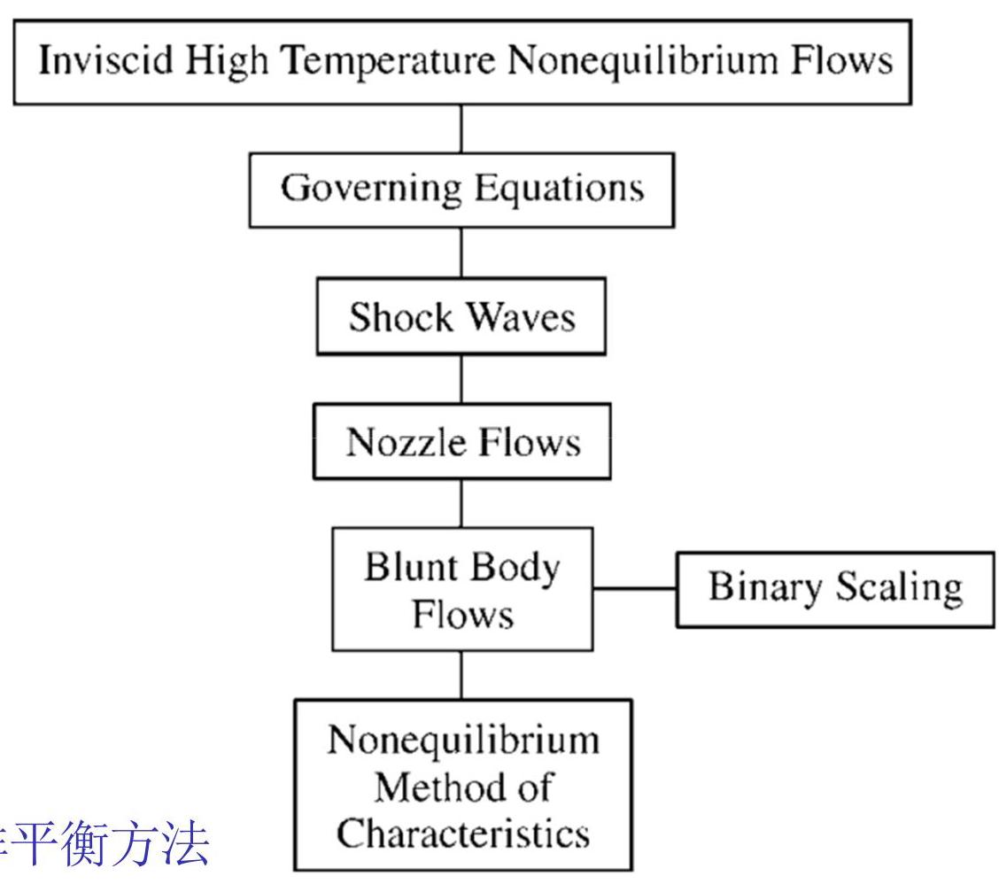

- 引言

- 无粘非平衡流动的控制方程

- 正激波和斜激波的非平衡流动

- 准一维喷管的非平衡流动

- 非平衡钝头体流动

- 二元缩放

- 流过其他形状的非平衡流动:特征线的非平衡方法

## 引言 ( Introduction)

## 引言

## frozen flow and equilibrium flow

Definition

- A frozen flow is one where the reaction rate constants ${k}_{f} = {k}_{b} = 0$ and the vibrational relaxation time $\tau  \rightarrow  \infty$ .

- An equilibrium flow is one where ${k}_{f} = {k}_{b} \rightarrow  \infty$ and $\tau  = 0$ .

${\tau }_{f} \approx  L/{V}_{\infty }$ , characteristic time for a fluid element to traverse the flowfield of interest

- ${\tau }_{c}$ , characteristic time for the chemical reactions and/or vibrational energy to approach equilibrium.

1. We can assume local equilibrium flow if ${\tau }_{f} \gg  {\tau }_{c}$

2. We can assume frozen flow if ${\tau }_{f} \ll  {\tau }_{c}$

3. Else, the reacting and/or vibrationally excited flow is nonequilibrium.

无粘非平衡流动的控制方程 ( Governing Equations for Inviscid, Nonequilibrium Flows)

## 无粘非平衡流动的控制方程

Species Continuity Equation 组分连续方程

$$
\frac{\partial {\rho }_{i}}{\partial t} + \nabla  \cdot  \left( {{\rho }_{i}\mathbf{V}}\right)  = {\dot{w}}_{i}
$$

$$
\frac{\mathrm{d}\left\lbrack  \mathrm{{NO}}\right\rbrack  }{\mathrm{d}t} =  - {k}_{f3a}\left\lbrack  \mathrm{{NO}}\right\rbrack  \left\lbrack  {\mathrm{O}}_{2}\right\rbrack   + \cdots
$$

$$
{\dot{w}}_{\mathrm{{NO}}} = {\mathcal{M}}_{\mathrm{{NO}}}\frac{\mathrm{d}\left\lbrack  \mathrm{{NO}}\right\rbrack  }{\mathrm{d}t}
$$

由于化学反应引起的pi的当地变化速率

Since $\mathop{\sum }\limits_{i}{\rho }_{i} = \rho$ and ${\rho }_{i} = \rho {c}_{i}$

$$
\frac{\partial \rho {c}_{i}}{\partial t} + \nabla  \cdot  \left( {\rho {c}_{i}\mathbf{V}}\right)  = {\dot{w}}_{i}\; \Rightarrow  \;\frac{\mathrm{D}{c}_{i}}{\mathrm{D}t} = \frac{{\dot{w}}_{t}}{\rho }
$$

无粘非平衡流动的控制方程

## Momentum Equation and Energy Equation 动量方程与能 量方程

$$
\frac{\partial \rho \mathbf{V}}{\partial t} + \nabla  \cdot  \left( {\rho \mathbf{V}\mathbf{V}}\right)  =  - \nabla p\; \Rightarrow  \;\rho \frac{\mathrm{D}\mathbf{V}}{\mathrm{D}t} =  - \nabla p
$$

$$
\frac{\partial {\rho E}}{\partial t} + \nabla  \cdot  \left( {\rho {h}_{0}\mathbf{V}}\right)  = 0\; \Rightarrow  \;\rho \frac{\mathrm{D}{h}_{0}}{\mathrm{D}t} = \frac{\partial p}{\partial t} + q
$$

where

$$
{h}_{0} = h + \frac{{V}^{2}}{2}
$$

## 无粘非平衡流动的控制方程

Vibrational Energy Equation 振动能方程

For species $i$

$$
\frac{\partial {\rho }_{i}{e}_{{\mathrm{{vib}}}_{i}}}{\partial t} + \nabla  \cdot  \left( {{\rho }_{i}{e}_{{\mathrm{{vib}}}_{i}}\mathbf{V}}\right)  = \frac{{\rho }_{i}}{{\tau }_{i}}\left( {{e}_{{\mathrm{{vib}}}_{i}}^{eq} - {e}_{{\mathrm{{vib}}}_{i}}}\right)
$$

$$
\Rightarrow  \frac{\mathrm{D}{c}_{i}{e}_{{\mathrm{{vib}}}_{i}}}{\mathrm{D}t} = \frac{{c}_{i}}{{\tau }_{i}}\left( {{e}_{{\mathrm{{vib}}}_{i}}^{eq} - {e}_{{\mathrm{{vib}}}_{i}}}\right)
$$

$$
\mathop{\sum }\limits_{i}\frac{\partial {\rho }_{i}{e}_{{\mathrm{{vib}}}_{i}}}{\partial t} + \nabla  \cdot  \left( {{\rho }_{i}{e}_{{\mathrm{{vib}}}_{i}}\mathbf{V}}\right)  = \mathop{\sum }\limits_{i}\frac{{\rho }_{i}}{{\tau }_{i}}\left( {{e}_{{\mathrm{{vib}}}_{i}}^{eq} - {e}_{{\mathrm{{vib}}}_{i}}}\right)
$$

$$
\Rightarrow  \frac{\mathrm{D}{e}_{\mathrm{{vib}}}}{\mathrm{D}t} = \frac{1}{\tau }\left( {{e}_{\mathrm{{vib}}}^{eq} - {e}_{\mathrm{{vib}}}}\right)
$$

where

$$
{e}_{\mathrm{{vib}}} = \frac{{\rho }_{i}{e}_{{\mathrm{{vib}}}_{i}}}{\rho }\;{e}_{\mathrm{{vib}}}^{eq} = \frac{{\rho }_{i}{e}_{{\mathrm{{vib}}}_{i}}^{eq}}{\rho }\;\tau  = \frac{\mathop{\sum }\limits_{i}{X}_{i}}{\mathop{\sum }\limits_{i}{X}_{i}/{\tau }_{i}}
$$

P. A. Knoffo, NASA Technical Paper 2867, 1989

无粘非平衡流动的控制方程

Equation of State 状态方程

$$
p = {\rho RT}
$$

$$
R = \frac{\mathcal{R}}{\mathcal{M}}\;\mathcal{M} = {\left( \mathop{\sum }\limits_{i}\frac{{c}_{i}}{{\mathcal{M}}_{i}}\right) }^{-1}
$$

$$
h = \mathop{\sum }\limits_{i}{c}_{i}{h}_{i}
$$

$$
{h}_{i} = {\left( {e}_{\text{ trans }} + {e}_{\text{ rot }} + {e}_{\text{ vib }} + {e}_{\mathrm{e}}\right) }_{i} + {R}_{i}T + {\left( \Delta {h}_{f}^{o}\right) }_{i}
$$

$$
= {\int }_{{T}_{\text{ ref }}}^{T}{C}_{p, i}\left( T\right) \mathrm{d}T + {\left( \Delta {h}_{i}^{f}\right) }_{{T}_{\text{ ref }}}
$$

where ${C}_{p, i}\left( T\right)$ and ${\left( \Delta {h}_{i}^{f}\right) }_{{T}_{\text{ ref }}}$ can be found in some standard databases.

正激波和斜激波的非平衡流动 ( Nonequilibrium Normal and Oblique ShockWave Flows)

## 正激波和斜激波的非平衡流动

Normal Shock

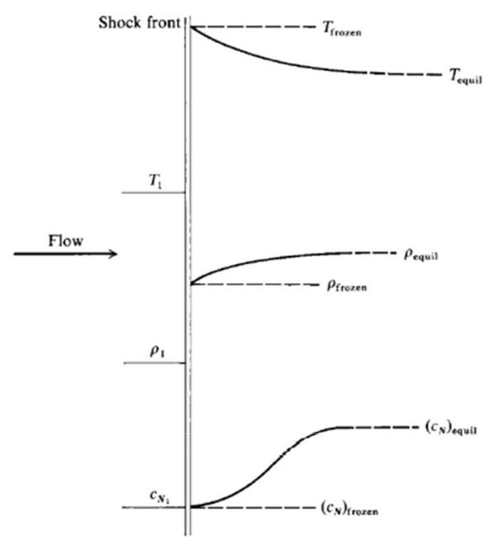

Figure: 15.3 Schematic of chemically reacting nonequilibrium flow behind a normal shock wave.

- Right behind the shock, the flow can be assumed in frozen state.

- From the shock, the flow is nonequilibrium

- After enough distance, the flow approaches to its equilibrium state.

## 正激波和斜激波的非平衡流动

## Normal Shock

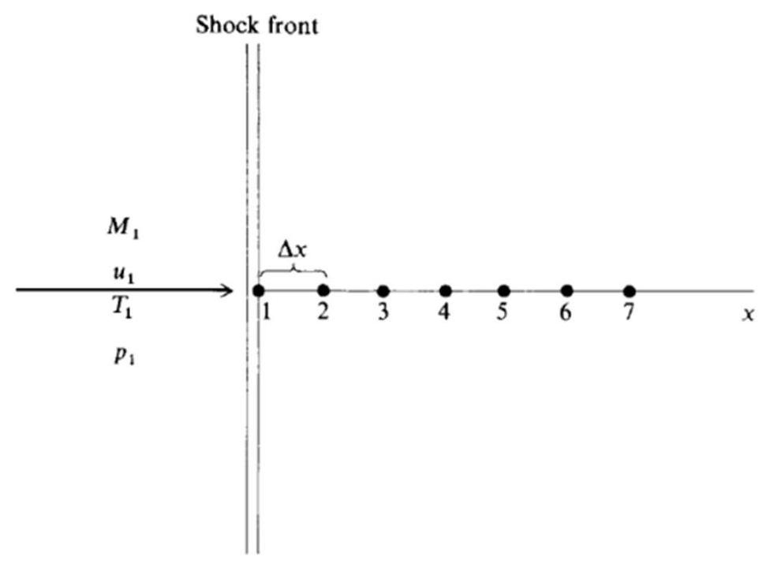

Figure: 15.4 Schematic of grid points for the numerical solution of nonequilibrium normal shock flows.

$$
\begin{cases} \rho \mathrm{d}u + u\mathrm{\;d}\rho &  = 0 \\  \mathrm{\;d}p &  =  - {\rho u}\mathrm{\;d}u \\  \mathrm{\;d}{h}_{0} &  = 0 \\  u\mathrm{\;d}{c}_{i} &  = \frac{{\dot{w}}_{i}}{\rho }\mathrm{d}x \end{cases}
$$

We can solve this system from the shock (Point 1) to downstream with RK scheme.

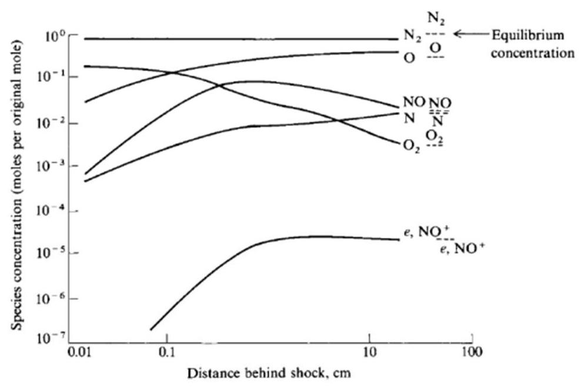

- Only slight dissociation of ${\mathrm{N}}_{2}$

Figure: 15.5 Distributions of the chemical species for the nonequilibrium flow through a normal shock wave in air: ${M}_{\infty } = {12.28}$ , ${p}_{\infty } = {1.0}\mathrm{\;{mm}}\mathrm{{Hg}}$ , and ${T}_{\infty } = {300}\mathrm{\;K}$ .

正激波和斜激波的非平衡流动

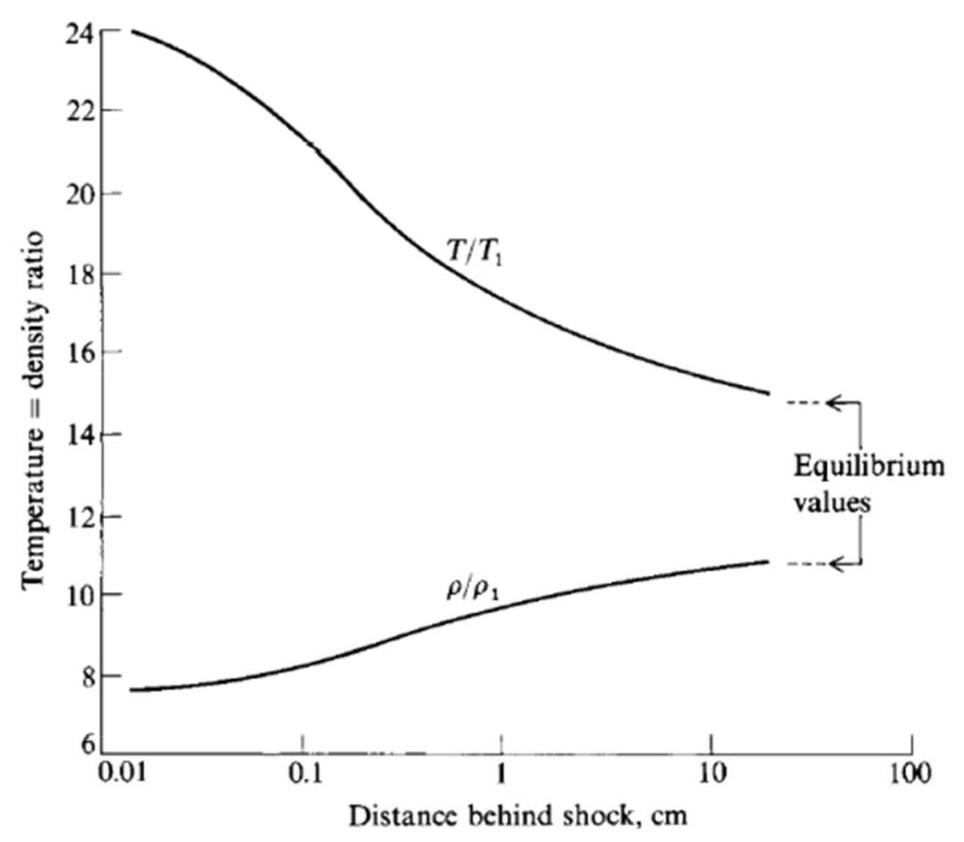

Figure: Distributions of the temperature and density for the nonequilibrium flow through a normal shock wave in air: M 1 512.28, r 1 5 1.0 mm Hg, and T 1 5 300 K (from [174]).

## 正激波和斜激波的非平衡流动

Oblique Shock Wave

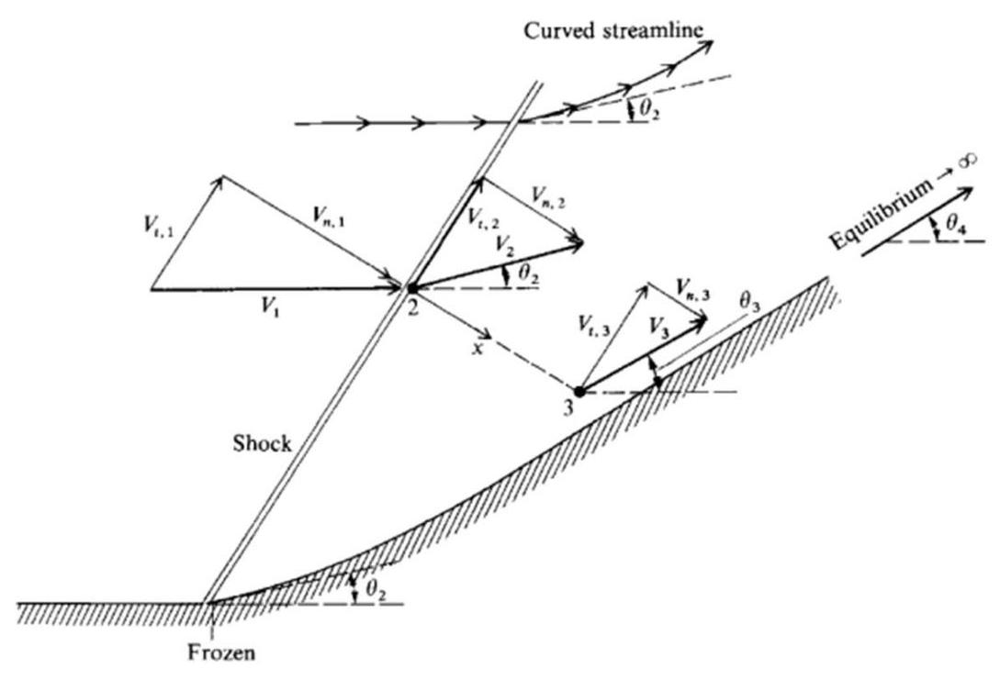

Figure: 15.7 Geometry for nonequilibrium flow behind a straight oblique shock wave.

- ${V}_{t,3} = {V}_{t,2} = {V}_{t,1}$

- ${\rho }_{3} > {\rho }_{2}$ making ${V}_{n,3} < {V}_{n,2}$ since $\rho {V}_{n} =$ CONST

- Thus ${\theta }_{3} > {\theta }_{2}$

- $\theta$ increases along a streamline

- The streamline must be a curve.

正激波和斜激波的非平衡流动

Oblique Shock Wave

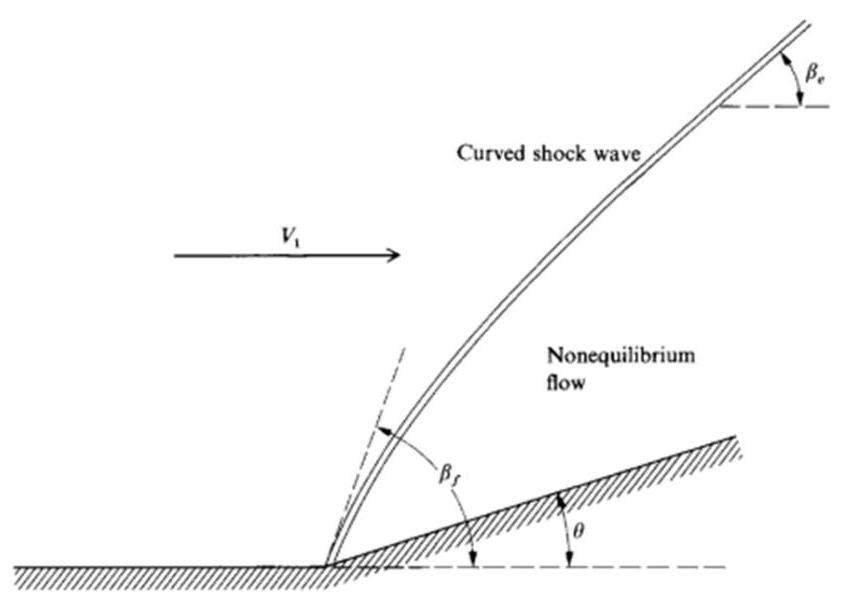

Figure: 15.8 Schematic of nonequilibrium flow over a compression corner.

For the supersonic or hypersonic nonequilibrium flow over a straight compression corner as sketched above, the shock wave will be curved.

# 准一维喷管的非平衡流动 ( Nonequilibrium Quasi-One-Dimensional Nozzle Flows)

准一维喷管的非平衡流动

Governing Equations

$$
\frac{\partial \rho }{\partial t} =  - \frac{1}{A}\frac{\partial {\rho uA}}{\partial x}
$$

$$
\frac{\partial u}{\partial t} =  - \frac{1}{\rho }\left( {\frac{\partial p}{\partial x} + {\rho u}\frac{\partial u}{\partial x}}\right)
$$

$$
\frac{\partial e}{\partial t} =  - \frac{1}{\rho }\left( {p\frac{\partial u}{\partial x} + {\rho u}\frac{\partial e}{\partial x} + {pu}\frac{\partial \ln A}{\partial x}}\right)
$$

$$
\frac{\partial {e}_{\mathrm{{vib}}}}{\partial t} = \frac{1}{\tau }\left( {{e}_{\mathrm{{vib}}}^{eq} - {e}_{\mathrm{{vib}}}}\right)  - u\frac{\partial {e}_{\mathrm{{vib}}}}{\partial x}
$$

$$
\frac{\partial {c}_{i}}{\partial t} =  - u\frac{\partial {c}_{i}}{\partial x} + \frac{{\dot{w}}_{i}}{\rho }
$$

where

$$
{e}_{\mathrm{{vib}}} = \left\lbrack  \frac{{hv}/k{T}_{\mathrm{{vib}}}}{{e}^{{hv}/k{T}_{\mathrm{{vib}}}} - 1}\right\rbrack  R{T}_{\mathrm{{vib}}}
$$

准一维喷管的非平衡流动

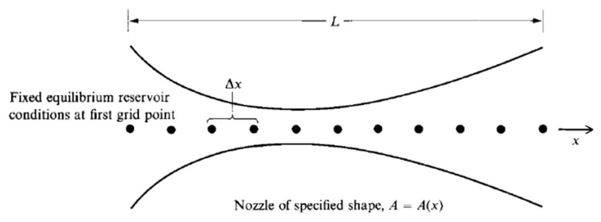

Figure: 15.11 Coordinate system and grid points for the time marching of quasi-one- dimensional flow through a nozzle.

${\Delta t} < {B\tau }$ , for vibrational nonequilibrium

- ${\Delta t} < {\rho }_{i}{\left( \partial {\left( w\right) }_{i}/\partial {c}_{i}\right) }^{-1}$ , for chemical nonequilibrium

- ${\Delta t} < \frac{\Delta x}{u + a}$

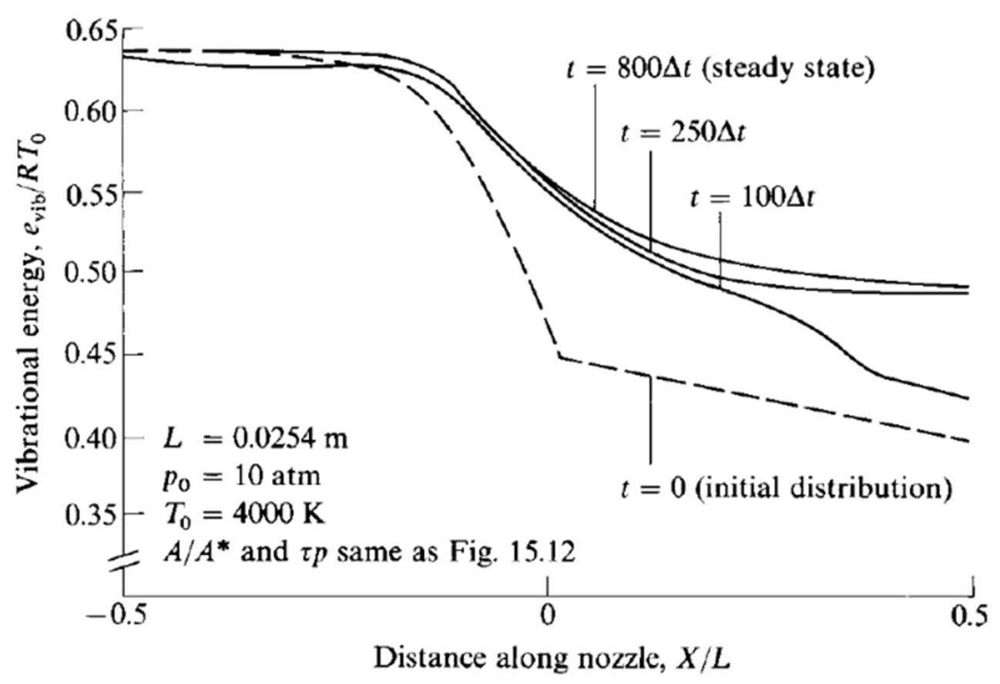

Figure: 15.12 Transient and final steady-state ${e}_{vib}$ distributions for the nonequilibrium expansion of ${N}_{2}$ obtained from the time-marching analysis (from Anderson [175]).

准一维喷管的非平衡流动

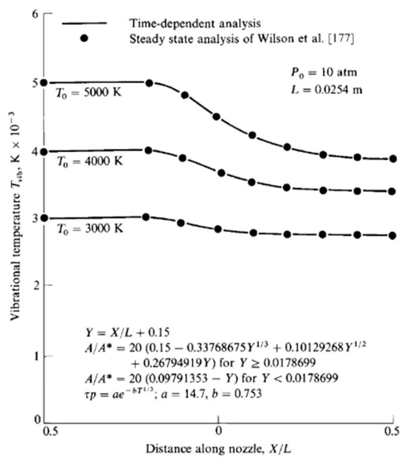

Figure: 15.13 Steady-state ${T}_{\mathrm{{vib}}}$ distributions for the nonequilibrium expansion of ${N}_{2}$ ; comparison of the time-marching analysis with the steady-flow analysts of Wilson et al. (from [175]).

非平衡钝头体流动 ( Nonequilibrium Blunt-Body Flows)

非平衡钝头体流动结果:

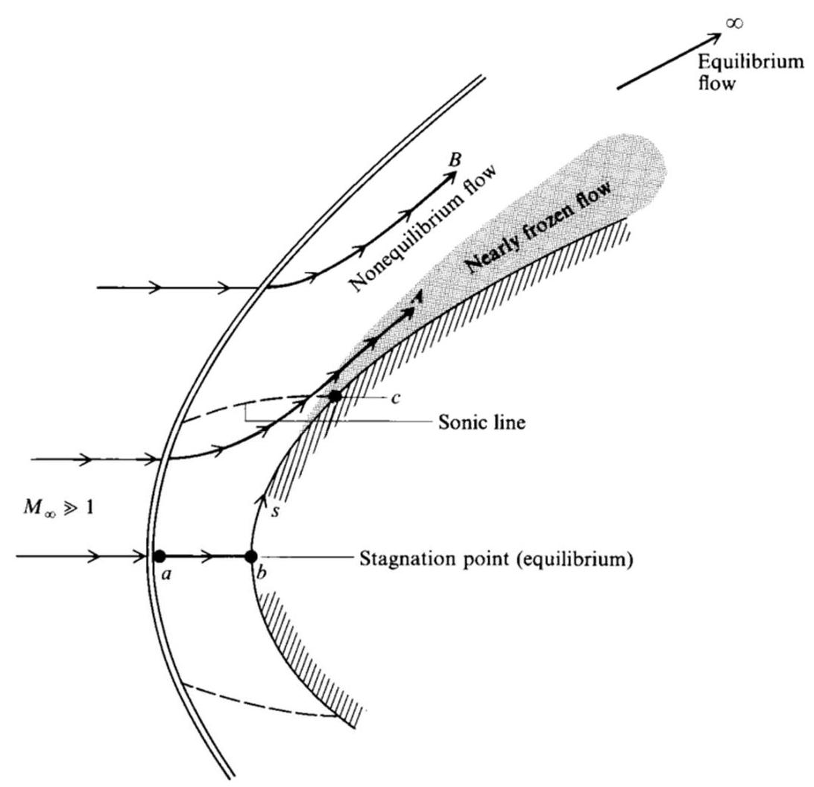

- 流体微团经过极长时间流过距离ab， 意味着当地平衡条件必须纯在与驻点。

$> {dp}/{ds}$ 和 ${dT}/{ds}$ 有很大的负值。

> 形成流向物体下游的高度离解和电离的气体的薄区域。

Fig. 15.18 Schematic of different regions in a high-temperature blunt-body flowfield.

Bohachevsky 和 Rubin 通过对一个离解气体的简单模型给出。

时间推进解法

Li首次给出了空气的钝头体的无粘非平衡时间推进解。

应用激波捕捉法的显式麦科马克方法。

非平衡钝头体流动的解法

非时间推进解法

逆解法: 假定给出激波形状, 积分给定激波下游的非平衡流场, 找到支持给定激波的物体形状。

非平衡钝头体流动

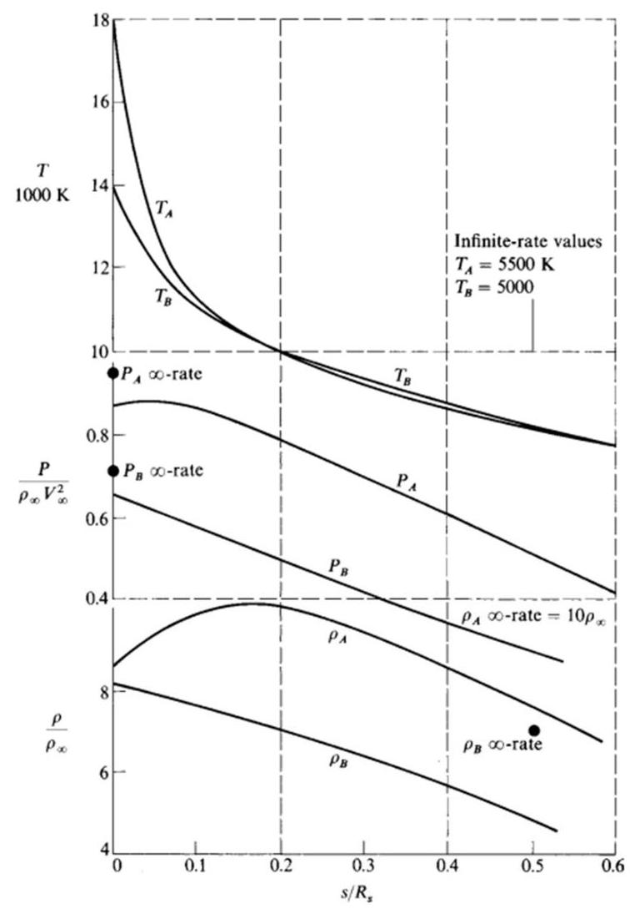

Fig. 15.21 Temperature, pressure, and density variations along streamlines $A$ and $B$ in the nonequilibrium blunt-body flowfield (from [186]).

> 由于 ${O}_{2}$ 和 ${N}_{2}$ 发生有限速率离解, 温度在激波后快速降低。

物体附近气体的动力学膨胀导致当 $s/{R}_{s} > {0.2}$ 时, ${T}_{A}$ 的梯度逐渐变小。

* 非平衡影响导致 ${p}_{A}$ 略有增大和 ${\rho }_{A}$ 大幅增加。

二元缩放

( Binary Scaling)

二元缩放

For nonequilibrium inviscid flow,

$$
{\mathrm{O}}_{2} + \mathrm{M} \rightarrow  2\mathrm{O} + \mathrm{M}
$$

$$
u\frac{\partial {c}_{O}}{\partial x} + v\frac{\partial {c}_{O}}{\partial y} = \frac{{\dot{w}}_{O}}{\rho } = \frac{{\mathcal{M}}_{O}}{\rho }\frac{\mathrm{d}\left\lbrack  \mathrm{O}\right\rbrack  }{\mathrm{d}t}
$$

$$
= \frac{{\mathcal{M}}_{O}}{\rho }2{k}_{f}\left( \frac{\rho {c}_{{O}_{2}}}{{\mathcal{M}}_{{O}_{2}}}\right) \left( \frac{\rho {c}_{M}}{{\mathcal{M}}_{M}}\right)
$$

$$
= {K}_{1}\left( T\right) \rho {c}_{{O}_{2}}{c}_{M}
$$

Consider nondimensionalization:

$$
{x}^{\prime } = \frac{x}{R}\;{y}^{\prime } = \frac{y}{R}\;{u}^{\prime } = \frac{u}{{V}_{\infty }}\;{v}^{\prime } = \frac{v}{{V}_{\infty }}\;{\rho }^{\prime } = \frac{\rho }{{\rho }_{\infty }}
$$

$$
{u}^{\prime }\frac{\partial {c}_{O}}{\partial {x}^{\prime }} + {v}^{\prime }\frac{\partial {c}_{O}}{\partial {y}^{\prime }} = {K}_{1}\frac{{\rho }_{\infty }R}{{V}_{\infty }}{c}_{{O}_{2}}{c}_{M}
$$

Consider two different flows with the same ${T}_{\infty }$ and ${V}_{\infty }$ (hence, with essentially the same value for ${K}_{1}$ ), but with different values of ${\rho }_{\infty }$ and $R$ . Plots of ${c}_{O}$ (and all other mass fractions) vs ${x}^{\prime }$ or ${y}^{\prime }$ will be the same for the two flows if the product ${\rho }_{\infty }R$ is the same between the two flows.

二元缩放

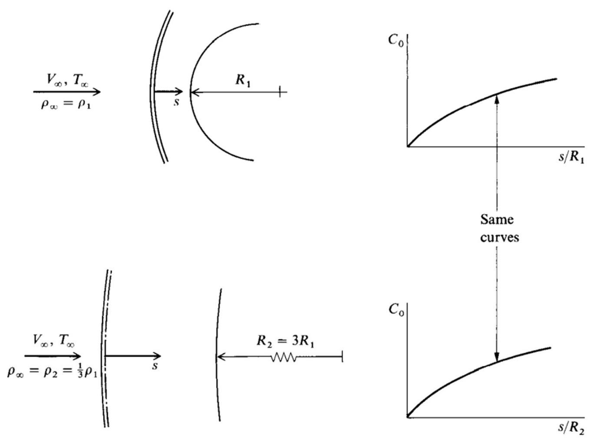

Fig. 15.24 Illustration of binary scaling.

二元缩放的意义: 二元比例参数在两种不同流动之间时相同的。在这种情况下, ${c}_{o}$ 与 $s/{R}_{1}$ 和与 $s/{R}_{2}$ 的曲线时相同的。

流过其他形状的非平衡流动: 特征线的非平衡方法 ( Nonequilibrium Flow over Other Shapes: Nonequilibrium Method of Characteristics)

流过其他形状的非平衡流动: 特征线的非平衡方法

非平衡气体是怎样修正特征线方法？

1. 在非平衡气体中, 不可逆的有限反应速率的机制总是使熵增加。因此, 在非平衡气体中当流体微团沿流线运动时熵是增加的。这导致所有二维和三维非平衡流动是有旋的,因此在非平衡流动中流线是特征线。

2. 另外的特征线是基于冻结声速 ${c}_{f}$ 的马赫线,即与流线的夹角等于 $\mu  = \; \arcsin \left( {1/M{a}_{f}}\right)  = \arcsin \left( {{c}_{f}/V}\right)$ 的曲线。

特征线对的非平衡方法的相容性方程:

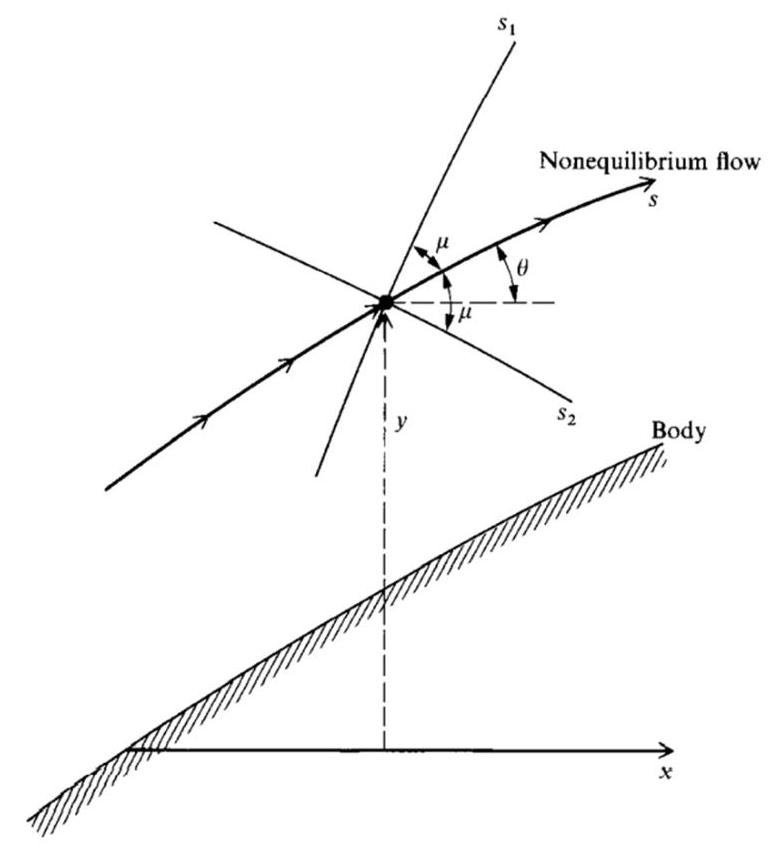

Fig. 15.25 Illustration of characteristic lines in a nonequilibrium flow.

Along ${s}_{1}$ :

$$
\frac{\partial \theta }{\partial {s}_{1}} + \frac{{\left( {M}_{f}^{2} - 1\right) }^{1/2}}{\rho {V}^{2}}\frac{\partial p}{\partial {s}_{1}} + \sin \mu \left\lbrack  {\frac{j\sin \theta }{y} - \mathop{\sum }\limits_{i}\left( {\mathcal{M} - \frac{\rho \mathcal{R}}{p}\frac{{H}_{i}}{{C}_{pf}}}\right) \frac{\partial {\eta }_{i}}{\partial s}}\right\rbrack   = 0 \tag{15.37}
$$

Along ${s}_{2}$ :

$$
- \frac{\partial \theta }{\partial {s}_{2}} + \frac{{\left( {M}_{f}^{2} - 1\right) }^{1/2}}{\rho {V}^{2}}\frac{\partial p}{\partial {s}_{2}} + \sin \mu \left\lbrack  {\frac{j\sin \theta }{y} - \mathop{\sum }\limits_{i}\left( {\mathcal{M} - \frac{\rho \mathcal{R}{H}_{i}}{p}}\right) \frac{\partial {\eta }_{i}}{\partial s}}\right\rbrack   = 0 \tag{15.38}
$$

Along $s$ :

$$
{\rho V}\frac{\partial {\eta }_{i}}{\partial s} = \frac{{\dot{w}}_{i}}{{\mathcal{M}}_{i}\rho } \tag{15.39}
$$

Along $s$ :

$$
{\rho V}\frac{\partial V}{\partial s} = \frac{\partial p}{\partial s} \tag{15.40}
$$

流过其他形状的非平衡流动: 特征线的非平衡方法

结果:

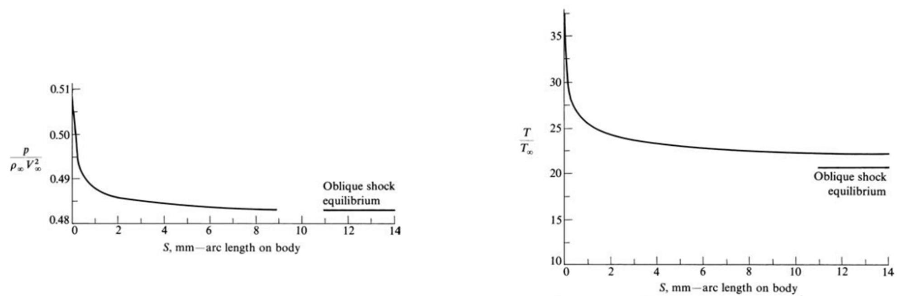

Fig. 15.26 Pressure and temperature along a wedge surface. Nonequilibrium flow. ${V}_{\infty } = {6638}\mathrm{\;m}/\mathrm{s},{T}_{\infty } = {273.16}\mathrm{\;K},{p}_{\infty } = {0.01}$ atm, and $\theta  = {41.04}\mathrm{{deg}}$ (from Spurk et al. [187]).

压力和温度沿楔形体表面随距离增大而减小, 另外在下游较大距离物面条件没有逼近给出的平衡斜激波结果。

流过其他形状的非平衡流动: 特征线的非平衡方法

结果:

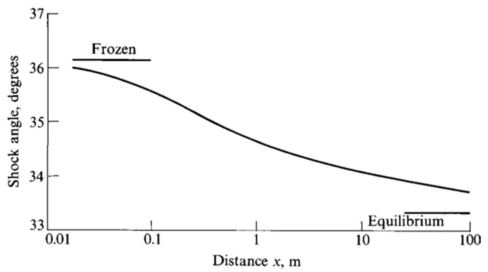

Fig. 15.27 Variation of shock-wave angle with distance in the nonequilibrium flow over a wedge (from Rakich et al. [188]).