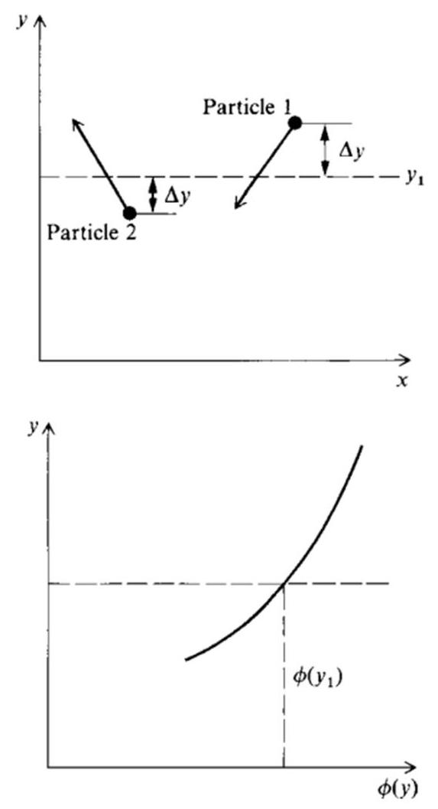
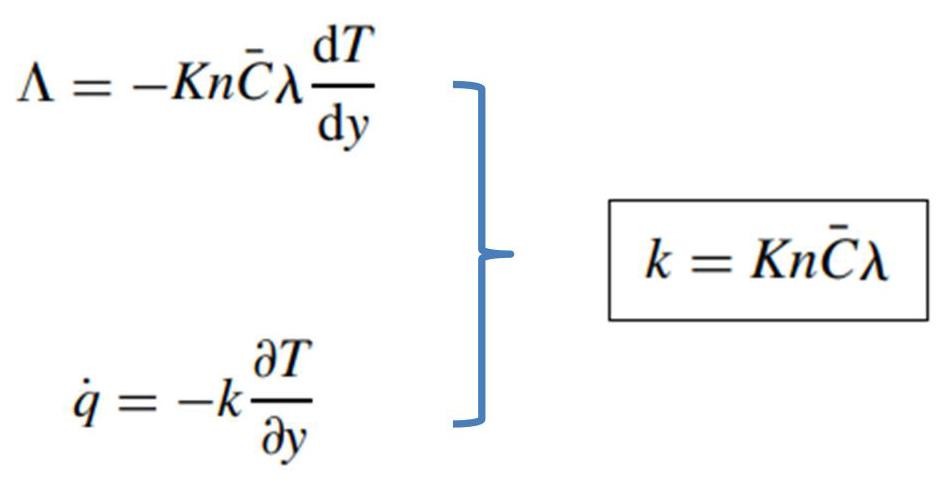
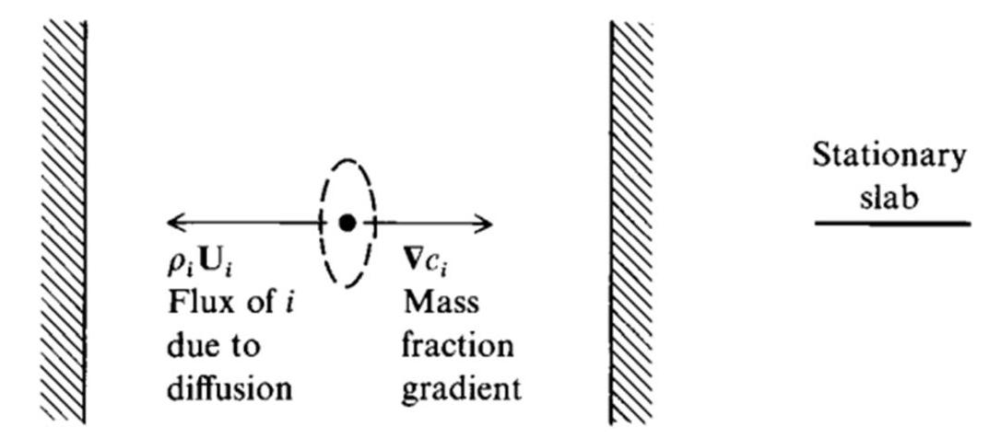
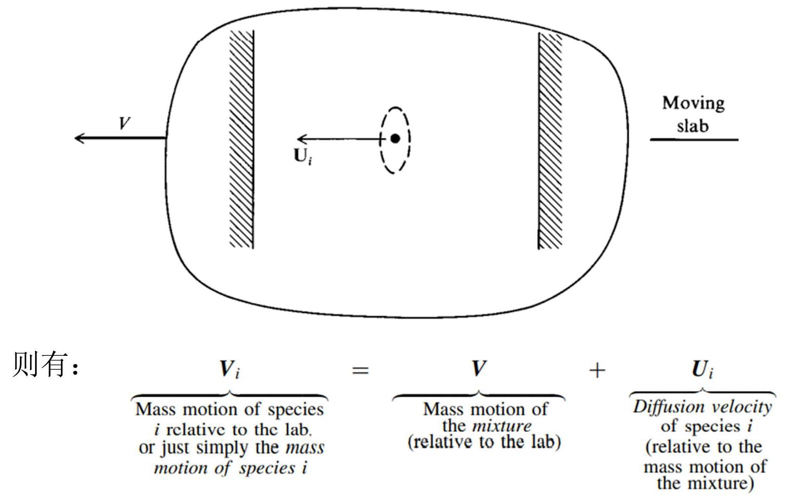
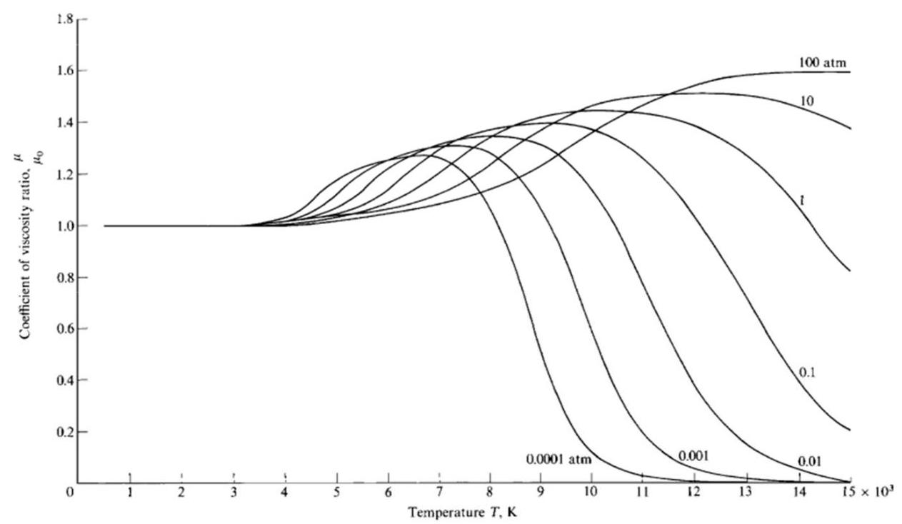
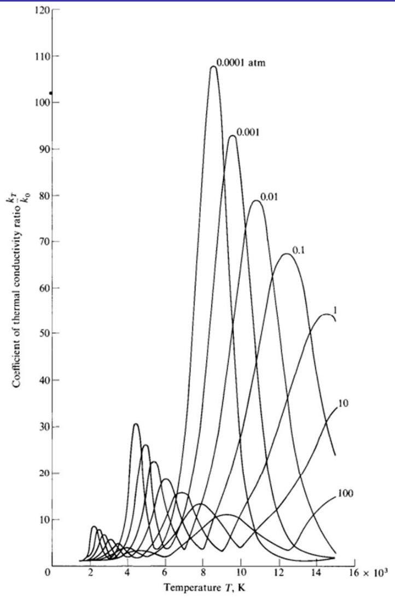

# 高温气体中的输运特性 (Transport Properties in High-Temperature Gases)

李文丰

西北工业大学

w.li@nwpu.edu.cn

2022年11月30日

## 目录

- 输运现象的定义

Definition of Transport Phenomena

- 输运系数

Transport Coefficients

- 扩散机理

Mechanism of Diffusion

- 由热传导和扩散引起的能量输运: 总热导率

Energy Transport by Thermal Conduction and Diffusion: Total Thermal Conductivity

- 高温空气的输运特性

Transport Properties for High-Temperature Air

输运现象的定义 ( Definition of Transport Phenomena)

输运现象的定义由两方向穿过 ${y}_{1}$ 的 $\phi$ 的通量等于:

$$
\Lambda  = {an}\bar{C}\left\lbrack  {\phi \left( {{y}_{1} - \lambda }\right)  - \phi \left( {{y}_{1} + \lambda }\right) }\right\rbrack
$$

Fig. 16.1 Model for transport phenomena.

在 $y = {y}_{1}$ 处用泰勒级数展开 $\phi$ :

$$
\phi \left( {{y}_{1} + \lambda }\right)  = \phi \left( {y}_{1}\right)  + \frac{\mathrm{d}\phi }{\mathrm{d}y}\lambda  + \frac{{\mathrm{d}}^{2}\phi }{\mathrm{d}{y}^{2}}\frac{{\lambda }^{2}}{2} + \cdots
$$

$$
\phi \left( {{y}_{1} - \lambda }\right)  = \phi \left( {y}_{1}\right)  - \frac{\mathrm{d}\phi }{\mathrm{d}y}\lambda  + \frac{{\mathrm{d}}^{2}\phi }{\mathrm{d}{y}^{2}}\frac{{\lambda }^{2}}{2} - \cdots
$$

忽略 ${\lambda }^{2}$ 项及其高阶项，得到 $\phi$ 的一般输运方程:

$$
\Lambda  =  - {2an}\bar{C}\lambda \frac{\mathrm{d}\phi }{\mathrm{d}y}
$$

## 输运现象的定义

令 $\phi$ 是粒子的平均动量。仅考察 $x$ 方向的动量,用 $m{\bar{C}}_{x}$ 给出,其中 $m$ 是粒子质量, ${\bar{C}}_{x}$ 是 $x$ 方向的平均速度。因此有:

$$
\Lambda  =  - {2an}\bar{C}{\lambda m}\frac{\mathrm{d}{\bar{C}}_{x}}{\mathrm{\;d}y}
$$

参考牛顿力学知识,由 ${\tau }_{xy} =  - \Lambda$ ,则有:

从宏观流体力学, 我们可以有:

$$
\begin{array}{l} \left. {{\tau }_{xy} = {2an}\bar{C}{\lambda m}\frac{\mathrm{d}{\bar{C}}_{x}}{\mathrm{\;d}y}}\right\}  \\  \left. {\;{\tau }_{xy} = \mu \frac{\partial \alpha }{\partial y} = \mu \frac{\partial {C}_{x}}{\partial y}}\right\}   \end{array}
$$

## 输运现象的定义

令 $\phi$ 是粒子的平均能量。穿过 ${y}_{1}$ 的能量通量为:

由经典的热传导知识, 能量通量为:

最后考虑分子质量的输运,令 $\Lambda$ 是 $A$ 粒子穿过 ${y}_{1}$ 的通量:

定义 $A$ 粒子单位面积单位时间的通量为 ${\Gamma }_{A}$ :

$$
{\Gamma }_{A} =  - {D}_{AB}\frac{\mathrm{d}{n}_{A}}{\mathrm{\;d}y}
$$

输运系数 ( Transport Coefficients)

输运系数

Lennard - Jones (6 - 12) potential模型的分子力为:

$$
F =  - \frac{\mathrm{d}{\Phi }_{m}}{\mathrm{\;d}r}
$$

其中:

$$
{\Phi }_{m}\left( r\right)  = {4\varepsilon }\left\lbrack  {{\left( \frac{d}{r}\right) }^{12} - {\left( \frac{d}{r}\right) }^{6}}\right\rbrack
$$

对于纯净单原子气体, 有:

$$
\mu  = {2.6693} \times  {10}^{ - 5}\frac{\sqrt{MT}}{{d}^{2}{\Omega }_{\mu }}\;k = {1.9891} \times  {10}^{ - 4}\frac{\sqrt{T/M}}{{d}^{2}{\Omega }_{k}}
$$

对于纯净双原子或者多原子气体, 有:

$$
\mu  = {2.6693} \times  {10}^{ - 5}\frac{\sqrt{MT}}{{d}^{2}{\Omega }_{\mu }}\;k = \mu (\frac{5}{2}{c}_{{v}_{trans}} + {c}_{{v}_{rot}} + {c}_{{v}_{vib}} + {c}_{{v}_{el}})
$$

## 输运系数

对于粒子A和B的二元混合气体，组分A质量通量的表达式为:

$$
{j}_{A} =  - \rho {D}_{AB} \bigtriangledown  {c}_{A}
$$

其中:

$$
{D}_{AB} = {0.0018583} - \frac{\sqrt{{T}^{3}\left( {\left( {1/{M}_{A}}\right)  + \left( {1/{M}_{B}}\right) }\right) }}{p{d}_{AB}^{2}{\Omega }_{d,{AB}}}
$$

对于多元气体，有:

$$
\mu  = \mathop{\sum }\limits_{i}\frac{{X}_{i}{\mu }_{i}}{\mathop{\sum }\limits_{j}{X}_{j}{\phi }_{ij}}
$$

其中:

$$
{\phi }_{ij} = \frac{1}{\sqrt{8}}{\left( 1 + \frac{{\mathcal{M}}_{i}}{{\mathcal{M}}_{j}}\right) }^{-1/2}{\left\lbrack  1 + {\left( \frac{{\mu }_{i}}{{\mu }_{j}}\right) }^{1/2}{\left( \frac{{\mathcal{M}}_{j}}{{\mathcal{M}}_{i}}\right) }^{1/4}\right\rbrack  }^{2}
$$

扩散机理 ( Mechanism of Diffusion)

## 扩散机理

固定的平板层:

相应的组分 $i$ 的质量通量可由菲克定律近似给出:

$$
{j}_{i} \equiv  {\rho }_{i}{U}_{i} =  - \rho {D}_{im} \bigtriangledown  {c}_{i}
$$

## 扩散机理

平板层以速度 $V$ 运动:

## 扩散机理

平板层以速度 $V$ 运动:

流动速度事实上是所有 ${V}_{i}$ 质量平均: $\mathbf{V} = \mathop{\sum }\limits_{i}{c}_{i}{\mathbf{V}}_{i}$

${V}_{i} = V + {U}_{i} \; \mathop{\sum }\limits_{i}{c}_{i}{\mathbf{V}}_{i} = \mathbf{V}\mathop{\sum }\limits_{i}{c}_{i} + \mathop{\sum }\limits_{i}{c}_{i}{\mathbf{U}}_{i}$

回顾: $\;\mathop{\sum }\limits_{i}{c}_{i} = 1$

$\mathop{\sum }\limits_{i}{\rho }_{i}{\mathbf{U}}_{i} = 0$

由热传导和扩散引起的能量输运: 总热导率 ( Energy Transport by Thermal Conduction and Diffusion: Total Thermal Conductivity)

## 由热传导和扩散引起的能量输运: 总热导率

能量是通过热传导来输运, 其中这种能量的通量是:

$$
{\mathbf{q}}_{c} =  - k\nabla T
$$

对于化学反应混合气体，还存在由扩散引起的能量输运。能量输运可以写为:

$$
\left\{  \begin{array}{l} \text{ Energy flux caused by } \\  \text{ diffusion of species }i \end{array}\right\}   = {\rho }_{i}{\mathbf{U}}_{i}{h}_{i}
$$

In turn,

$$
\left\{  \begin{matrix} \text{ Energy flux caused by diffusion } \\  \text{ of all species at the point } \end{matrix}\right\}   = {\mathbf{q}}_{D} = \mathop{\sum }\limits_{i}{\rho }_{i}{\mathbf{U}}_{i}{h}_{i}
$$

高温、化学反应气体总能量通量:

$$
\mathbf{q} =  - k\nabla T + \mathop{\sum }\limits_{i}{\rho }_{i}{\mathbf{U}}_{i}{h}_{i} + {\mathbf{q}}_{R}
$$

考虑 $\mathrm{y}$ 方向有温度和质量分数梯度的流场,能量通量为:

$$
\left. \begin{array}{l} {q}_{y} =  - k\frac{\partial T}{\partial y} + \mathop{\sum }\limits_{i}{\rho }_{i}{U}_{i, y}{h}_{i} \\  {\rho }_{i}{U}_{i, y} =  - \rho {D}_{im}\frac{\partial {c}_{i}}{\partial y} \end{array}\right\}  \;{q}_{y} =  - k\frac{\partial T}{\partial y} - \rho \mathop{\sum }\limits_{i}{D}_{im}{h}_{i}\frac{\partial {c}_{i}}{\partial y}
$$

假设气体是处于局部化学平衡, 则有:

$$
\mathrm{d}{c}_{i} = {\left( \frac{\partial {c}_{i}}{\partial T}\right) }_{p}\mathrm{\;d}T + {\left( \frac{\partial {c}_{i}}{\partial p}\right) }_{T}\mathrm{\;d}p\;\frac{\partial {c}_{i}}{\partial y} = \frac{\partial {c}_{i}}{\partial T}\frac{\partial T}{\partial y}
$$

$$
{q}_{y} =  - k\frac{\partial T}{\partial y} - \rho \mathop{\sum }\limits_{i}{D}_{im}{h}_{i}\frac{\partial {c}_{i}}{\partial y}
$$

$$
{q}_{y} =  - k\frac{\partial T}{\partial y} - {k}_{r}\frac{\partial T}{\partial y} =  - {k}_{T}\frac{\partial T}{\partial y}
$$

$$
\frac{\partial {c}_{i}}{\partial y} = \frac{\partial {c}_{i}}{\partial T}\frac{\partial T}{\partial y}
$$

其中 ${k}_{r}$ 为反应传导率:

$$
{k}_{r} = \rho \mathop{\sum }\limits_{i}{D}_{im}{h}_{i}\frac{\partial {c}_{i}}{\partial T}
$$

${k}_{T}$ 为总传导率:

$$
{k}_{T} = k + \rho \mathop{\sum }\limits_{i}{D}_{im}{h}_{i}\frac{\partial {c}_{i}}{\partial T}
$$

假设沿 $y$ 方向压力不变:

$$
\mathrm{d}h = {\left( \frac{\partial h}{\partial T}\right) }_{p}\mathrm{\;d}T + {\left( \frac{\partial h}{\partial p}\right) }_{T}\mathrm{\;d}p
$$

$\frac{\partial T}{\partial y} = \frac{1}{{c}_{p}}\frac{\partial h}{\partial y}$

$$
{q}_{y} =  - k\frac{\partial T}{\partial y} - {k}_{r}\frac{\partial T}{\partial y} =  - {k}_{T}\frac{\partial T}{\partial y}.
$$

${q}_{y} = {k}_{T}\frac{\partial T}{\partial y} = \frac{{k}_{T}}{{c}_{p}}\frac{\partial h}{\partial y} = \frac{\mu }{P{r}_{\mathrm{{eq}}}}\frac{\partial h}{\partial y}$ 其中 $P{r}_{eq}$ 为平衡普朗特数: $\;P{r}_{\mathrm{{eq}}} = \frac{\mu {c}_{p}}{{k}_{T}}$

高温空气的输运特性 ( Transport Properties for High-Temperature Air)

## 高温空气的输运特性

化学平衡空气的高温输运系数:

$$
{\mu }_{0} = {1.462} \times  {10}^{-5}\frac{{T}^{1/2}}{1 + {112}/T}\frac{\mathrm{{gm}}}{\mathrm{{cm}}\mathrm{s}}
$$

$$
{k}_{0} = {1.364}{\mu }_{0}\frac{\mathrm{J}}{\left( \mathrm{{cm}}\right) \left( \mathrm{s}\right) \left( \mathrm{K}\right) }
$$

结果:

Fig. 16.3 Viscosity coefficient for equilibrium high-temperature air (from Hansen [167]).

高温空气的输运特性

结果:

Fig. 16.4 Total thermal conductivity for equilibrium high-temperature air (from Hansen [167]).