# 无粘高温平衡流动 (Inviscid High-Temperature Equilibrium Flows)

李文丰

西北工业大学

w.li@nwpu.edu.cn

2022年11月27日

## 目录

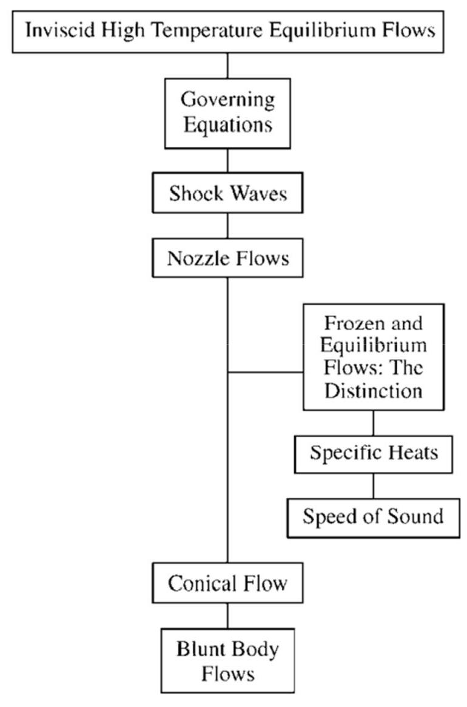

- 无粘高温平衡流动的控制方程

- 平衡正激波和斜激波流动

- 平衡准一维喷管流动

- 平衡流动和冻结流动: 差别比较

- 平衡比热和冻结比热

- 平衡声速

- 绕圆锥的平衡流动

○ 绕钝头体平衡流动

无粘高温平衡流动的控制方程 (Governing Equations for Inviscid High-Temperature Equilibrium Flow)

## 无粘高温平衡流动的控制方程

Governing Equations

Continuity:

Momentum:

$$
\frac{\partial \mathbf{\rho }}{\partial t} + \nabla  \cdot  \left( {\mathbf{\rho }\mathbf{V}}\right)  = 0 \tag{14.2}
$$

Energy:

$$
\rho \frac{\mathrm{D}\mathbf{V}}{\mathrm{D}t} =  - \nabla p \tag{14.3}
$$

$$
\rho \frac{\mathrm{D}{h}_{0}}{\mathrm{D}t} = \frac{\partial p}{\partial t} \tag{14.4}
$$

where

$$
{h}_{0} = h + \frac{{V}^{2}}{2} \tag{14.5}
$$

高温影响不改变控制方程的基本形式

无粘高温平衡流动的控制方程

## Equation of State

1. Direct calculation of the equilibrium thermodynamic properties (直接计算平衡态属性). Such as NASA CEA (https://www.grc.nasa.gov/WWW/CEAWeb/)

Select problem and code and click on the 'Submit' button:

Chemical Equilibrium Problem Types

<table><tr><td></td><td>Type Code</td><td>Description</td></tr><tr><td></td><td>rocket</td><td>Rocket</td></tr><tr><td></td><td>hp</td><td>Assigned Enthalpy & Pressure</td></tr><tr><td></td><td>tp</td><td>Assigned Temperature & Pressure</td></tr><tr><td></td><td>det</td><td>Chapman-Jouguet Detonation</td></tr><tr><td></td><td>shock</td><td>Shock Tube</td></tr><tr><td></td><td>tv</td><td>Assigned Temperature & Density</td></tr><tr><td></td><td>uv</td><td>Combustion at Assigned Density</td></tr><tr><td></td><td>sp</td><td>Assigned Entropy & Pressure</td></tr><tr><td></td><td>sv</td><td>Assigned Entropy & Density</td></tr></table>

Enter an alphanumeric code: I

The code is optional and is used to identify your data. Use no more than 15 characters. Blank spaces, hyphens and underscores are allowed, but no special characters (\$, #, etc).

## Equation of State

2. Tabulation of the equilibrium thermodynamic properties(查表法), such as Ref. 154. Or you can make your own table with CEA.

3. Correlations of the equilibrium thermodynamic properties(关联式), such as Ref. 155, or TGAS subroutine

(http://www.dept.aoe.vt.edu/ devenpor/tgas/tgas.f) for air.

4. Graphical plots of the equilibrium thermodynamic properties(图算法).

# 平衡正激波和斜激波流动 (Equilibrium Normal and Oblique Shock-Wave Flows)

平衡正激波和斜激波流动

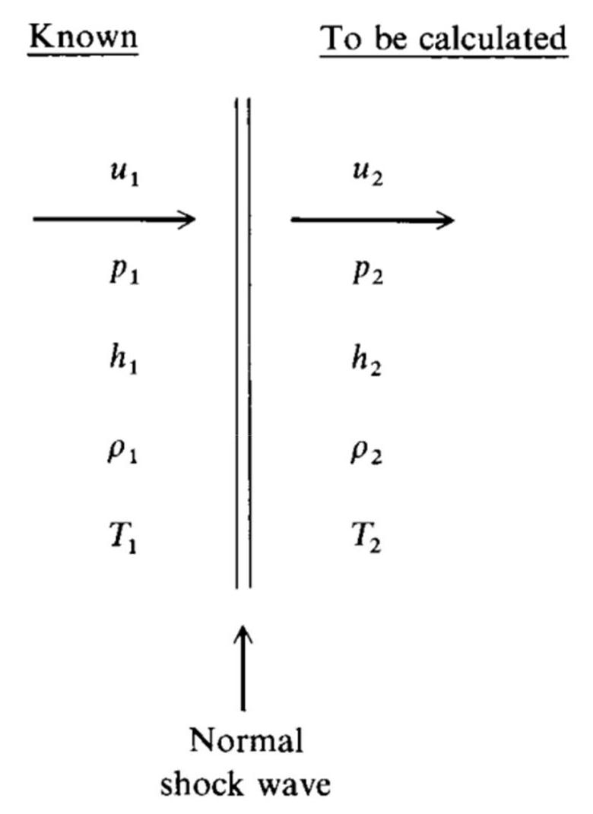

Fig. 14.2 Normal shock geometry.

连续性方程:

$$
{\rho }_{1}{u}_{1} = {\rho }_{2}{u}_{2}
$$

动量方程:

$$
{p}_{1} + {\rho }_{1}{u}_{1}^{2} = {p}_{2} + {\rho }_{2}{u}_{2}^{2}
$$

能量方程:

$$
{h}_{1} + \frac{{u}_{1}^{2}}{2} = {h}_{2} + \frac{{u}_{2}^{2}}{2}
$$

状态方程:

$$
{\rho }_{2} = \rho \left( {{p}_{2},{h}_{2}}\right)
$$

$$
{T}_{2} = T\left( {{p}_{2},{h}_{2}}\right)
$$

①

$$
{\rho }_{1}{u}_{1} = {\rho }_{2}{u}_{2}
$$

$$
{u}_{2} = \frac{{\rho }_{1}{u}_{1}}{{\rho }_{2}}
$$

② ${p}_{1} + {\rho }_{1}{u}_{1}^{2} = {p}_{2} + {\rho }_{2}{u}_{2}^{2}$

$$
{p}_{2} = {p}_{1} + {\rho }_{1}{u}_{1}^{2}\left( {1 - \frac{{\rho }_{1}}{{\rho }_{2}}}\right)
$$

③ $\;{h}_{1} + \frac{{u}_{1}^{2}}{2} = {h}_{2} + \frac{{u}_{2}^{2}}{2}$

$$
{h}_{2} = {h}_{1} + \frac{{u}_{1}^{2}}{2}\left\lbrack  {1 - {\left( \frac{{\rho }_{1}}{{\rho }_{2}}\right) }^{2}}\right\rbrack
$$

上游的所有参数 ${\rho }_{1}\text{ 、 }{u}_{1}\text{ 、 }{p}_{1}\text{ 、 }{h}_{1}$ 均已知,关于 ${p}_{2}\text{ 、 }{h}_{2}$ 计算公式,仅有一个参数 ${\rho }_{1}/{\rho }_{2}$ 未知。可以建立基本迭代关系,首先假定一个 ${\rho }_{1}/{\rho }_{2}$ 的初始值,然后通过公式计算 ${p}_{2}\text{ 、 }{h}_{2}$ ,再然后计算出 ${\rho }_{2}$ 得到新的 ${\rho }_{1}/{\rho }_{2}$ 值。反复迭代直至结果收敛,最后计算 ${u}_{2}$ 。

Table 14.1 Properties across a normal shock wave in air at a velocity of 36,000 ft/s and an altitude of 170,000 ft

<table><tr><td>Flow property</td><td>For calorically perfect air,   $\gamma  = {1.4}$</td><td>For equilibrium chemically reacting air (CAL Report AG-1729-A-2)</td></tr><tr><td>${p}_{2}/{p}_{1}$</td><td>1233</td><td>1387</td></tr><tr><td>${\rho }_{2}/{\rho }_{1}$</td><td>5.972</td><td>15.19</td></tr><tr><td>${h}_{2}/{h}_{1}$</td><td>206.35</td><td>212.8</td></tr><tr><td>${T}_{2}/{T}_{1}$</td><td>206.35</td><td>41.64</td></tr></table>

> 压力变化率收到的影响很小

由于 ${u}_{2} \ll  {u}_{2}$ 且 ${p}_{2} \gg  {p}_{1}$ ,因此 ${p}_{2} \approx  {\rho }_{1}{u}_{1}^{2}$ 在高压下，气体离解和电离效应减弱，因此更多的能量以分子动能形式表现，因此温度更高。

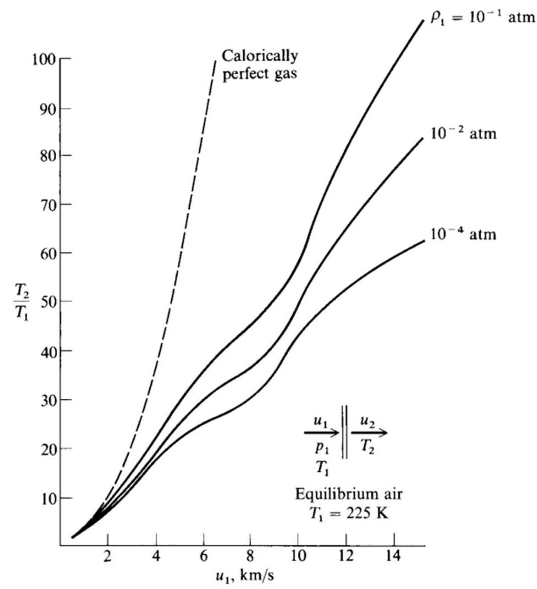

Fig. 14.3 Influence of pressure on the normal shock temperature in equilibrium air.

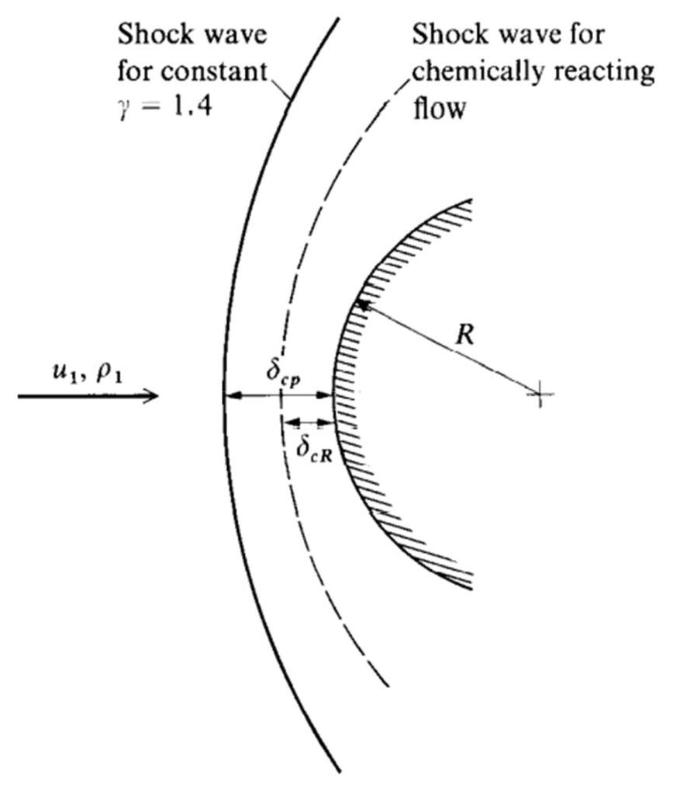

平衡反应假设下, 密度比更大, 导致激波层变得更薄。

$$
\frac{\delta }{R} = \frac{{\rho }_{1}/{\rho }_{2}}{1 + \sqrt{2\left( {{\rho }_{1}/{\rho }_{2}}\right) }}
$$

$$
\frac{\delta }{R} \approx  \frac{{\rho }_{1}}{{\rho }_{2}} = \frac{1}{\left( {\rho }_{2}/{\rho }_{1}\right) }
$$

化学反应斜激波更贴近物面是由于此时通过斜激波的密度比 ${\rho }_{2}/{\rho }_{1}$ 更大, 如同正激波情形。

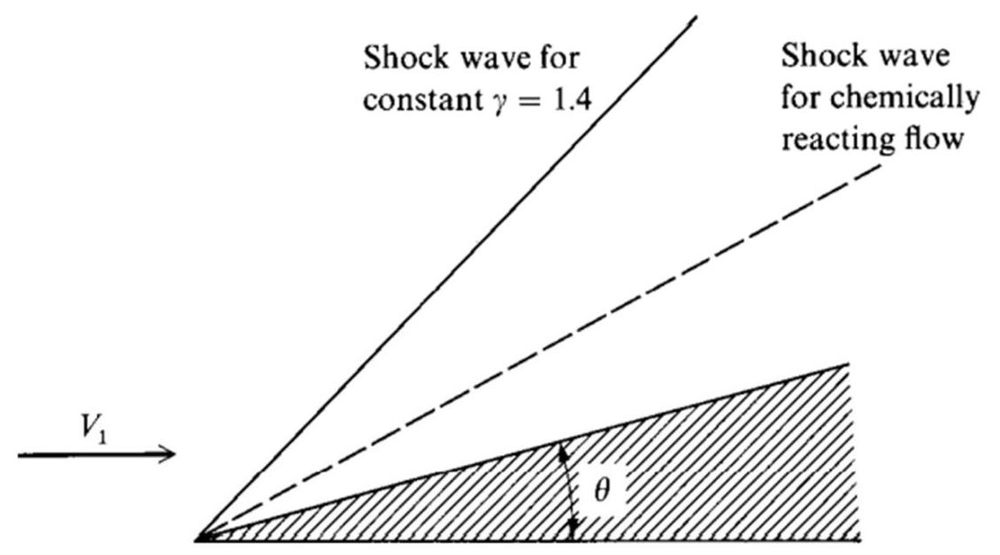

Fig. 14.8b Comparison of oblique shock waves for a calorically perfect gas vs an equilibrium chemically reacting gas.

平衡准一维喷管流动 (Equilibrium Quasi-One-Dimensional Nozzle Flows)

平衡准一维喷管流动平衡的化学反应喷管流动:

$$
{h}_{0} = \text{ const }
$$

$$
{h}_{1} + \frac{{u}_{1}^{2}}{2} = {h}_{2} + \frac{{u}_{2}^{2}}{2} = {h}_{0}
$$

$$
{\Delta h} = {h}_{0} - {h}_{2} = \frac{{u}_{2}^{2}}{2}
$$

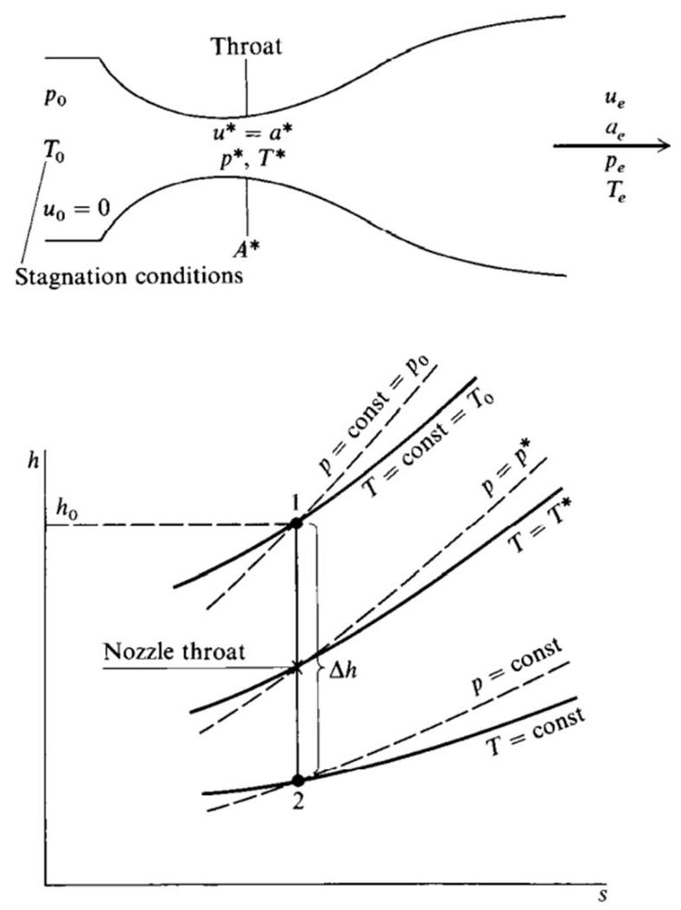

Fig. 14.12 Illustration of the solution of an equilibrium nozzle flow on a Mollier diagram.

因此,对于给定的速度 ${u}_{2}$ ,由上面公式可以确定对应点在莫利尔图上的位置。

平衡准一维喷管流动

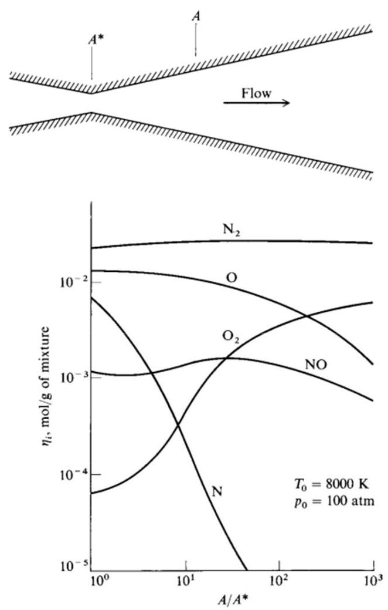

Fig. 14.13 Chemical composition for the equilibrium nozzle expansion of high-temperature air (from [264]).

- 上游的高温高压气体处于充分的离解状态

加速流过喷管时, 气体膨胀导致温度降低

温度降低,导致 $N$ 和 $O$ 发生复合反应,放出热量, 补偿气体由于膨胀导致的温度降低。因此平衡反应情况下喷管内温度较无反应时更高。

平衡流动和冻结流动: 差别比较 (Frozen and Equilibrium Flows: The Distinction)

平衡流动: 无限大的化学反应速率和振动率冻结流动: 化学反应速率为零的流动

平衡流动和冻结流动: 差别比较

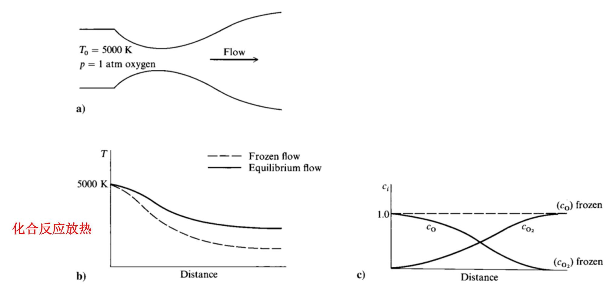

Fig. 14.15 Schematic comparing equilibrium and frozen chemically reacting flows through a nozzle.

平衡流动和冻结流动；差别比较

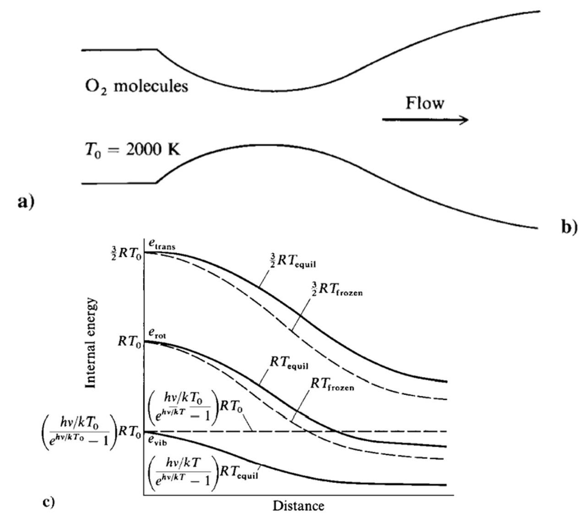

Fig. 14.16 Schematic comparing equilibrium and frozen vibrationally relaxing flows through a nozzle.

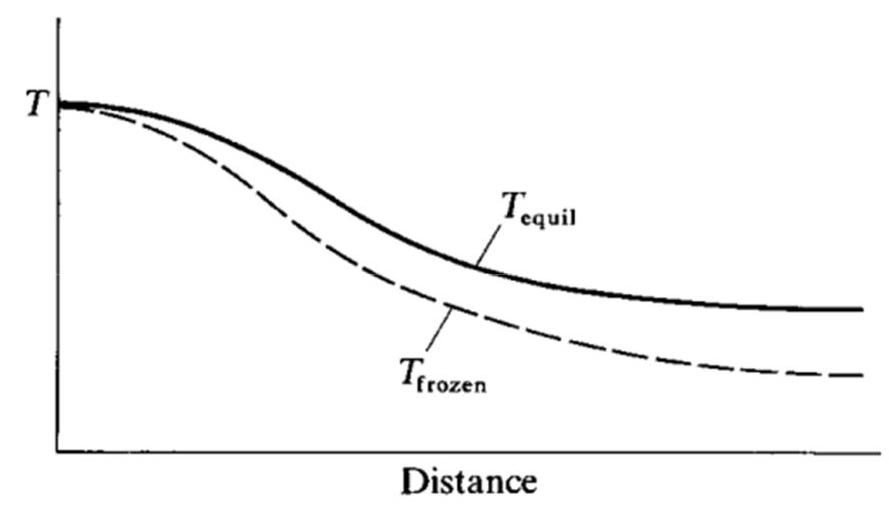

> 平衡流的温度分布比冻结流的要高

$> {e}_{\text{ trans }}$ 和 ${e}_{\text{ rot }}$ 对于振动冻结流会更低

平衡比热容和冻结比热容 (Equilibrium and Frozen Specific Heats)

$$
h = \mathop{\sum }\limits_{i}{c}_{i}{h}_{i}
$$

$$
{c}_{p} \equiv  {\left( \frac{\partial h}{\partial T}\right) }_{p} = {\left\lbrack  \frac{\partial }{\partial T}\left( \mathop{\sum }\limits_{i}{c}_{i}{h}_{i}\right) \right\rbrack  }_{p} = \mathop{\sum }\limits_{i}{c}_{i}{\left( \frac{\partial {h}_{i}}{\partial T}\right) }_{p} + \mathop{\sum }\limits_{i}{h}_{i}{\left( \frac{\partial {c}_{i}}{\partial T}\right) }_{p}
$$

反应混合气体的等压比热为曲线的三个峰值依次由 ${O}_{2}$ 和 ${N}_{2}$ 离解, 以及在极高温下 $O$ 和 $N$ 的电离导致。 这些化学反应的吸热效应, 表现为较高的比热值。

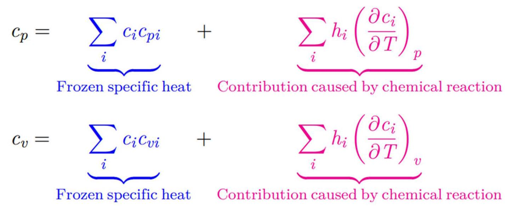

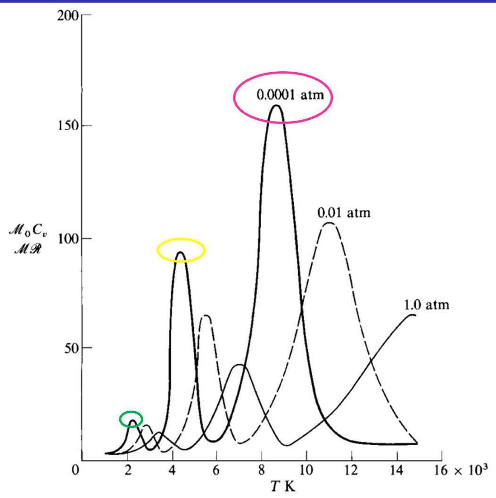

Fig. 14.17 Specific heat of equilibrium air at constant pressure as a function of temperature (from Hansen [167]).

平衡声速 (Equilibrium Speed of Sound)

平衡化学反应混合物中的声速是多少? ?

$$
h = h\left( {p, T}\right)  \Rightarrow  \mathrm{d}h = {\left( \frac{\partial h}{\partial p}\right) }_{T}\mathrm{\;d}p + {c}_{p}\mathrm{\;d}T
$$

因为声传播是一个等熵现象

$$
T\mathrm{\;d}s = \mathrm{d}e + p\mathrm{\;d}v = 0
$$

因此

$$
- p\mathrm{\;d}v = {\left( \frac{\partial e}{\partial v}\right) }_{T}\mathrm{\;d}v + {c}_{v}\mathrm{\;d}T
$$

$$
{c}_{v} =  - \left\lbrack  {{\left( \partial e/\partial v\right) }_{T} + p}\right\rbrack  \frac{\mathrm{d}v}{\mathrm{\;d}T}
$$

$$
h = h\left( {p, T}\right)  \Rightarrow  \mathrm{d}h = {\left( \frac{\partial h}{\partial p}\right) }_{T}\mathrm{\;d}p + {c}_{p}\mathrm{\;d}T
$$

由于声波是等熵的

$$
T\mathrm{\;d}s = \mathrm{d}h - v\mathrm{\;d}p = 0
$$

因此

$$
v\mathrm{\;d}p = {\left( \frac{\partial h}{\partial p}\right) }_{T}\mathrm{\;d}p + {c}_{p}\mathrm{\;d}T
$$

$$
{c}_{p} =  - \left\lbrack  {{\left( \partial h/\partial p\right) }_{T} - v}\right\rbrack  \frac{\mathrm{d}p}{\mathrm{\;d}T}
$$

$$
\frac{{c}_{p}}{{c}_{v}} = \frac{{\left( \partial h/\partial p\right) }_{T} - v}{{\left( \partial e/\partial v\right) }_{T} + p}\frac{\mathrm{d}p}{\mathrm{\;d}v} = \frac{{\left( \partial h/\partial p\right) }_{T} - v}{{\left( \partial e/\partial v\right) }_{T} + p}\left( {-{\rho }^{2}}\right) \frac{\mathrm{d}p}{\mathrm{\;d}\rho }
$$

$$
{a}_{e}^{2} = {\left( \frac{\partial p}{\partial \rho }\right) }_{s} = \frac{{c}_{p}}{{c}_{v}}\frac{1}{{\rho }^{2}}\frac{p + {\left( \partial e/\partial v\right) }_{T}}{1/\rho  - {\left( \partial h/\partial p\right) }_{T}}
$$

$$
= \frac{{c}_{p}}{{c}_{v}}\frac{p}{\rho }\frac{1 + \left( {1/p}\right) {\left( \partial e/\partial v\right) }_{T}}{1 - \rho {\left( \partial h/\partial p\right) }_{T}}
$$

$$
= {\gamma RT}\frac{1 + \left( {1/p}\right) {\left( \partial e/\partial v\right) }_{T}}{1 - \rho {\left( \partial h/\partial p\right) }_{T}}
$$

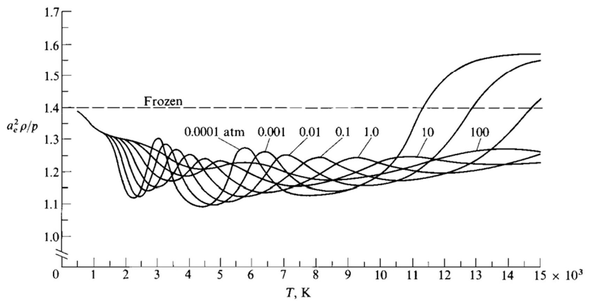

Fig. 14.18 Equilibrium speed of sound for air as a function of temperature (from [167]).

Tannehill 和 Mugge [155] 提出的高温空气的平衡声速关联式 (其中 ${K}_{1},{K}_{2}$ 和 ${K}_{3}$ 由表 11.1 给出， $\widetilde{\gamma }$ 由 11.108 式计算。)

$$
a = {\left\lbrack  e\left\{  {K}_{1} + \left( \widetilde{\gamma } - 1\right) \left\lbrack  \widetilde{\gamma } + {K}_{2}{\left( \frac{\partial \widetilde{\gamma }}{\partial \ln e}\right) }_{p}\right\rbrack   + {K}_{3}{\left( \frac{\partial \widetilde{\gamma }}{\partial \ln \rho }\right) }_{e}\right\}  \right\rbrack  }^{1/2} \tag{14.54}
$$

where ${K}_{1},{K}_{2}$ , and ${K}_{3}$ are given in Table 11.1 found in Sec. 11.13 and $\widetilde{\gamma }$ is defined by Eq. (11.108).

绕圆锥的平衡流动 (Equilibrium Conical Flow) 连续性方程:

$$
{2\rho }{V}_{r} + \rho {V}_{\theta }\cot \theta  + \frac{\mathrm{d}\left( {\rho {V}_{\theta }}\right) }{\mathrm{d}\theta } = 0
$$

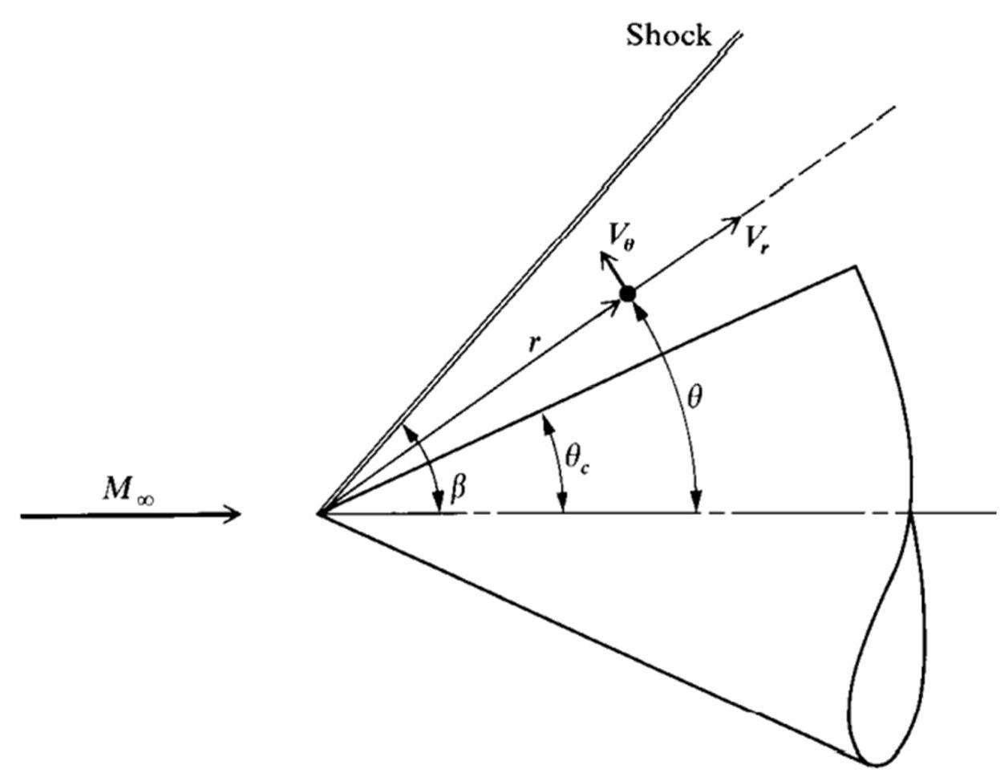

$r$ 方向动量方程:

$$
{V}_{\theta } = \frac{\mathrm{d}{V}_{r}}{\mathrm{\;d}\theta }
$$

$\theta$ 方向动量方程:

$$
{V}_{\theta }\frac{\mathrm{d}{V}_{\theta }}{\mathrm{d}\theta } + {V}_{r}{V}_{\theta } =  - \frac{1}{\rho }\frac{\mathrm{d}p}{\mathrm{\;d}\theta }
$$

压力变化与密度变化关系:

$$
{a}^{2} = {\left( \frac{\partial p}{\partial \rho }\right) }_{s} = \frac{\mathrm{d}p}{\mathrm{\;d}\rho }
$$

$$
{a}^{2} = {\left( \frac{\partial p}{\partial \rho }\right) }_{s} = \frac{\mathrm{d}p}{\mathrm{\;d}\rho }
$$

$$
{2\rho }{V}_{r} + \rho {V}_{\theta }\cot \theta  + \frac{\mathrm{d}\left( {\rho {V}_{\theta }}\right) }{\mathrm{d}\theta } = 0
$$

$$
{V}_{\theta }\frac{\mathrm{d}{V}_{\theta }}{\mathrm{d}\theta } +
$$

$$
\frac{\mathrm{d}{V}_{\theta }}{\mathrm{d}\theta } = \frac{{a}^{2}}{{V}_{\theta }^{2} - {a}^{2}}\left( {2{V}_{r} + {V}_{\theta }\cot \theta  - \frac{{V}_{r}{V}_{\theta }^{2}}{{a}^{2}}}\right)
$$

$$
\frac{\mathrm{d}p}{\mathrm{\;d}\theta } =  - \frac{\rho {V}_{\theta }{a}^{2}}{{V}_{\theta }^{2} - {a}^{2}}\left( {{V}_{r} + {V}_{\theta }\cot \theta }\right)
$$

$$
\left. \begin{array}{l} \frac{\mathrm{d}{V}_{\theta }}{\mathrm{d}\theta } + \frac{{V}_{\theta }}{\rho {a}^{2}}\frac{\mathrm{d}p}{\mathrm{\;d}\theta } = 0 \\  {V}_{r}{V}_{\theta } =  - \frac{1}{\rho }\frac{\mathrm{d}p}{\mathrm{\;d}\theta } \end{array}\right\}
$$

平衡高温热力学参数方程:

$$
\rho  = \rho \left( {p, s}\right)
$$

$$
a = a\left( {p, s}\right)
$$

## 绕圆锥的平衡流动

求解数值解过程:

1. 假定激波角 $\beta$

2. 根据本章第三节的方法计算斜激波后平衡流动参数

3. 将这些激波体条件作为初始值，利用本节的常微分方程求解

4. 积分这些方程直到圆锥表面

5. 重复这一迭代过程直到结果收敛

结果:

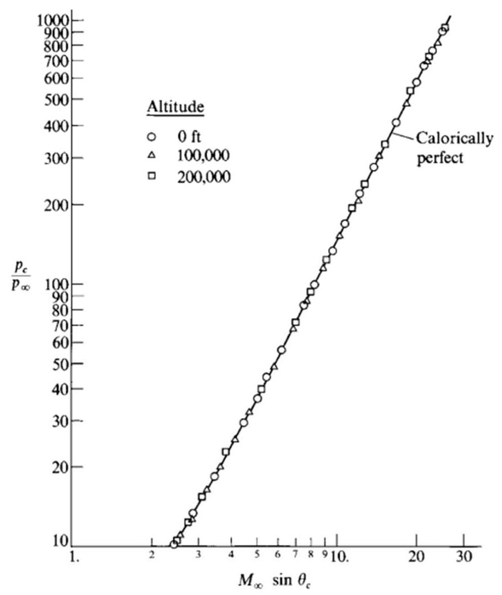

Fig. 14.20 Surface pressures on cones; comparison between equilibrium air and calorically perfect results (from Hudgins [169]).

绕圆锥的平衡流动

结果:

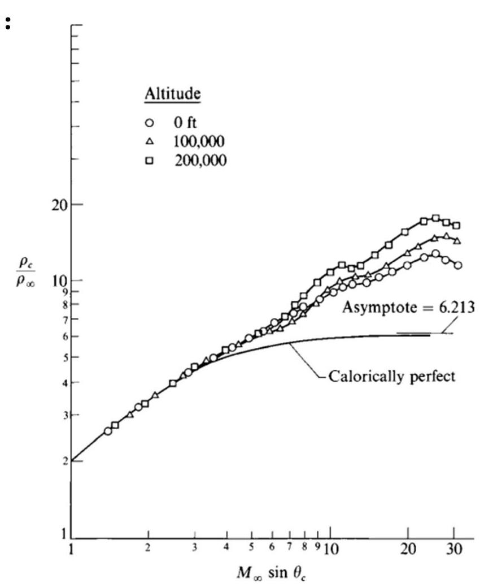

Fig. 14.21 Surface density on cones; comparison between equilibrium air and calorically perfect results (from [169]).

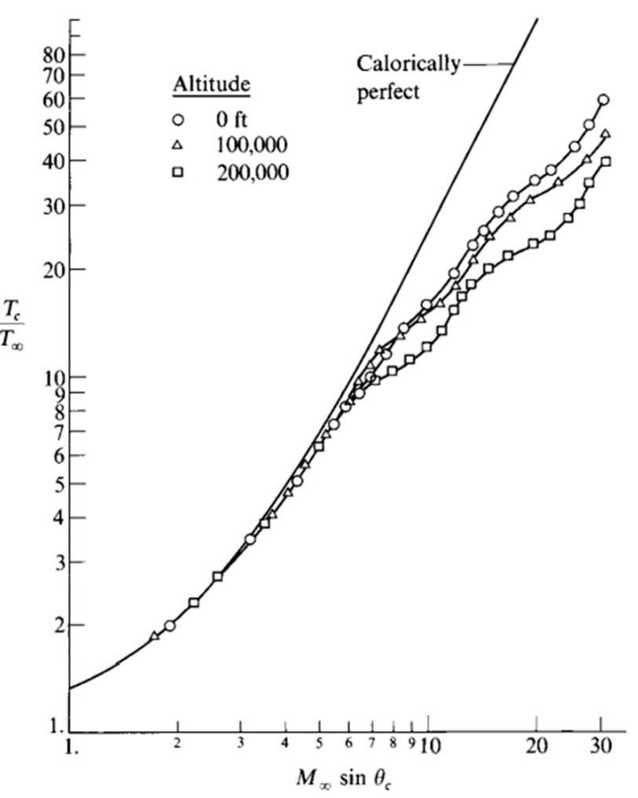

Fig. 14.22 Surface temperature on cones; comparison between equilibrium air and calorically perfect results (from [169]).

绕头体平衡流动 (Equilibrium Blunt-Body Flows)

## 绕头体平衡流动

利用二维或轴对称流动的强守恒形式方程:

$$
\frac{\partial Q}{\partial t} + \frac{\partial F}{\partial x} + \frac{\partial G}{\partial y} + {rH} = 0
$$

其中:

$$
\mathbf{Q} = \left\lbrack  \begin{matrix} \rho \\  {\rho u} \\  {\rho v} \\  \rho \left( {e + \frac{{V}^{2}}{2}}\right)  \end{matrix}\right\rbrack  \;\mathbf{F} = \left\lbrack  \begin{matrix} {\rho u} \\  \rho {u}^{2} + p \\  {\rho uv} \\  \rho \left( {e + \frac{{V}^{2}}{2} + \frac{p}{\rho }}\right) u \end{matrix}\right\rbrack
$$

$$
\mathbf{G} = \left\lbrack  \begin{matrix} {\rho v} \\  {\rho uv} \\  \rho {v}^{2} + p \\  \rho \left( {e + \frac{{V}^{2}}{2} + \frac{p}{\rho }}\right) v \end{matrix}\right\rbrack  \;\mathbf{H} = \frac{1}{y}\left\lbrack  \begin{matrix} {\rho v} \\  {\rho uv} \\  \rho {v}^{2} \\  \rho \left( {e + \frac{{V}^{2}}{2} + \frac{p}{\rho }}\right) v \end{matrix}\right\rbrack
$$

绕头体平衡流动

结果:

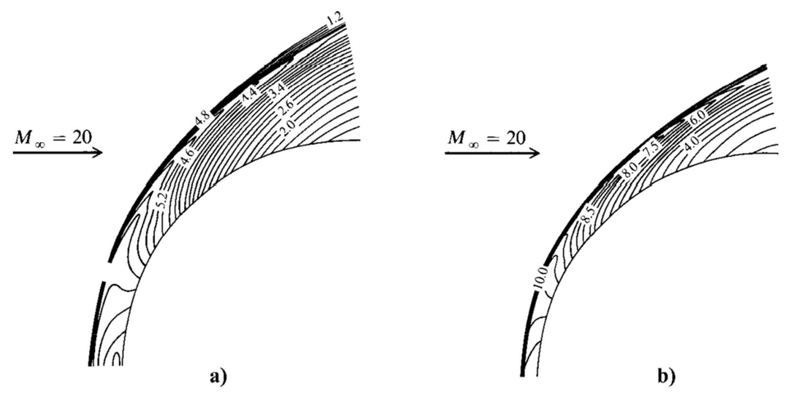

Fig. 14.23 Normalized density contours for blunt-body flow: a) calorically perfect-gas results and b) equilibrium chemically reacting air results. ${M}_{\infty } = {20}$ and altitude = 20 km (from Palmer [171]).

绕头体平衡流动

结果:

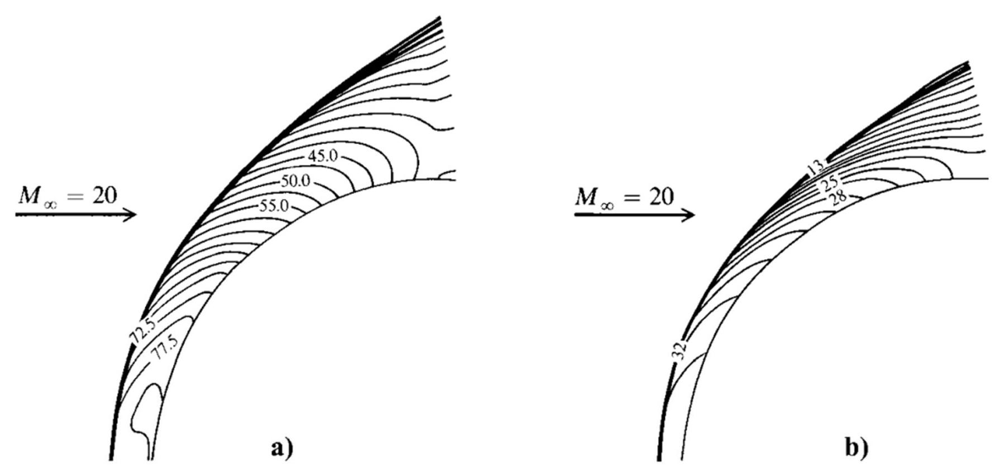

Fig. 14.24 Normalized temperature contours for blunt-body flow: a) calorically perfect gas and b) equilibrium chemically reacting air. ${M}_{\infty } = {20}$ and altitude $=$ 20 km (from [171]).