超声速无粘流动: 精确方法 (Hypersonic Inviscid Flowfields:Exact Methods)

李文丰

西北工业大学

w.li@nwpu.edu.cn

2022年10月23日

前情提要-马赫数无关性

- Dimensionless governing equation, No Mach number

- Wall boundary condition: No Mach number

- Shock wave boundary condition: No Mach number when ${M}_{\infty }$ is large enough

$$
{\bar{p}}_{2} \rightarrow  \frac{2{\sin }^{2}\beta }{\gamma  + 1}\;{\overline{\rho }}_{2} \rightarrow  \frac{\gamma  + 1}{\gamma  - 1}\;{\bar{u}}_{2} \rightarrow  1 - \frac{2{\sin }^{2}\beta }{\gamma  + 1}\;{\bar{v}}_{2} \rightarrow  \frac{\sin {2\beta }}{\gamma  + 1}
$$

## 前情提要-相似性

表面边界条件:

$$
{\bar{n}}_{x} + {\bar{v}}^{\prime }{\bar{n}}_{y} + {\bar{w}}^{\prime }{\bar{n}}_{z} = 0
$$

激波边界条件:

$$
{\overline{\rho }}_{2} = \left( \frac{\gamma  + 1}{\gamma  - 1}\right) \left\{  \frac{{\left( \mathrm{d}\bar{y}/\mathrm{d}\bar{x}\right) }_{s}^{2}}{{\left( \mathrm{d}\bar{y}/\mathrm{d}\bar{x}\right) }_{s}^{2} + 2/\left( {\gamma  - 1}\right) {M}_{\infty }^{2}{\tau }^{2}}\right\}
$$

${\bar{p}}_{2} = \frac{2}{\gamma  + 1}\left\lbrack  {{\left( \frac{\mathrm{d}\bar{y}}{\mathrm{\;d}\bar{x}}\right) }_{s}^{2} + \frac{1 - \gamma }{{2\gamma }{M}_{\infty }^{2}{\tau }^{2}}}\right\rbrack$

$$
{\bar{u}}_{2}^{\prime } =  - \frac{2}{\gamma  + 1}\left\lbrack  {{\left( \frac{\mathrm{d}\bar{y}}{\mathrm{\;d}\bar{x}}\right) }_{s}^{2} - \frac{1}{{M}_{\infty }^{2}{\tau }^{2}}}\right\rbrack
$$

${\bar{u}}_{2}^{\prime } =  - \frac{2}{\gamma  + 1}\left\lbrack  {{\left( \frac{\mathrm{d}\bar{y}}{\mathrm{\;d}\bar{x}}\right) }_{s}^{2} - \frac{1}{{M}_{\infty }^{2}{\tau }^{2}}}\right\rbrack$

高超声速相似参数:

$$
K \equiv  {M}_{\infty }\tau
$$

$$
\frac{{C}_{p}}{{\tau }^{2}} = {f}_{1}\left( {\bar{x},\bar{y},\bar{z},\gamma ,{M}_{\infty }\tau ,\frac{\alpha }{\tau }}\right)
$$

$$
\frac{{c}_{l}}{{\tau }^{2}} = {\int }_{0}^{1}\left( {\frac{{C}_{{p}_{l}}}{{\tau }^{2}} - \frac{{C}_{{p}_{u}}}{{\tau }^{2}}}\right) \mathrm{d}\bar{x} = {f}_{2}\left( {\gamma ,{M}_{\infty }\tau ,\frac{\alpha }{\tau }}\right)
$$

$$
\frac{{c}_{d}}{{\tau }^{3}} = {\int }_{0}^{1}\left( {\frac{{C}_{{p}_{l}}}{{\tau }^{2}} + \frac{{C}_{{p}_{u}}}{{\tau }^{2}}}\right) \mathrm{d}\bar{y} = {f}_{3}\left( {\gamma ,{M}_{\infty }\tau ,\frac{\alpha }{\tau }}\right)
$$

压力系数:

升力系数:

阻力系数:

前情提要-小扰动方程及其结果

小扰动方程:

$$
\frac{\partial \overline{\rho }}{\partial \bar{x}} + \frac{\partial \left( {\overline{\rho }{\bar{v}}^{\prime }}\right) }{\partial \bar{y}} + \frac{\partial \left( {\overline{\rho }{\bar{w}}^{\prime }}\right) }{\partial \bar{z}} = 0
$$

$$
\overline{\rho }\frac{\partial {\bar{u}}^{\prime }}{\partial \bar{x}} + \overline{\rho }{\bar{v}}^{\prime }\frac{\partial {\bar{u}}^{\prime }}{\partial \bar{y}} + \overline{\rho }{\bar{w}}^{\prime }\frac{\partial {\bar{u}}^{\prime }}{\partial \bar{z}} =  - \frac{\partial \bar{p}}{\partial \bar{x}}
$$

$$
\overline{\rho }\frac{\partial {\bar{v}}^{\prime }}{\partial \bar{x}} + \overline{\rho }{\bar{v}}^{\prime }\frac{\partial {\bar{v}}^{\prime }}{\partial \bar{y}} + \overline{\rho }{\bar{w}}^{\prime }\frac{\partial {\bar{v}}^{\prime }}{\partial \bar{z}} =  - \frac{\partial \bar{p}}{\partial \bar{y}}
$$

$$
\overline{\rho }\frac{\partial {\bar{w}}^{\prime }}{\partial \bar{x}} + \overline{\rho }{\bar{v}}^{\prime }\frac{\partial {\bar{w}}^{\prime }}{\partial \bar{y}} + \overline{\rho }{\bar{w}}^{\prime }\frac{\partial {\bar{w}}^{\prime }}{\partial \bar{z}} =  - \frac{\partial \bar{p}}{\partial \bar{z}}
$$

$$
\frac{\partial }{\partial \bar{x}}\left( \frac{\bar{p}}{{\overline{\rho }}^{\gamma }}\right)  + {\bar{v}}^{\prime }\frac{\partial }{\partial \bar{y}}\left( \frac{\bar{p}}{{\overline{\rho }}^{\gamma }}\right)  + {\bar{w}}^{\prime }\frac{\partial }{\partial \bar{z}}\left( \frac{\bar{p}}{{\overline{\rho }}^{\gamma }}\right)  = 0
$$

二维平板:

$$
{\left( {\psi }_{\bar{y}}\right) }^{2}{\psi }_{\bar{x}\bar{x}} - 2{\psi }_{\bar{x}}{\psi }_{\bar{y}}{\psi }_{\bar{x}\bar{y}} + {\left( {\psi }_{\bar{x}}\right) }^{2}{\psi }_{\bar{y}\bar{y}} = {\left( {\psi }_{\bar{y}}\right) }^{\gamma  + 1}\left\lbrack  {{\gamma \omega }{\psi }_{\bar{y}\bar{y}} + {\omega }^{\prime }{\left( {\psi }_{\bar{y}}\right) }^{2}}\right\rbrack
$$

圆锥:

$$
{f}^{\prime \prime } - \frac{{f}^{\prime }}{\overline{\theta }} = \frac{2}{\gamma \omega }\frac{{\overline{\theta }}^{\gamma  - 1}f}{{\left( {f}^{\prime }\right) }^{\gamma  + 1}}\left\lbrack  {{2f}{f}^{\prime \prime } - {\left( {f}^{\prime }\right) }^{2}}\right\rbrack
$$

前情提要-等效原理与冲击波理论

等效原理: 绕细长体的定常高超声速流与降一维空间内的非定常流动互为等价。

$$
\widetilde{x} = \frac{x}{l} = \widetilde{t} = \frac{t{V}_{\infty }}{l}\; \Rightarrow  \;x = {V}_{\infty }t
$$

冲击波理论:冲击波理论是高超声速等效原理的一个重要变体。前提假设是瞬时的能量释放发生在空间的某个点或者某条线。

钝头平板:

钝头圆柱体: $\frac{p}{{p}_{\infty }} = {0.8773}{k}_{1}{M}_{\infty }^{2}\sqrt{{C}_{D}}{\left( \frac{x}{d}\right) }^{-1}$

$$
\text{ 平板: }\;\frac{p}{{p}_{\infty }} = {0.127}{M}_{\infty }^{2}{C}_{D}^{2/3}{\left( \frac{x}{d}\right) }^{-2/3}\;\frac{r}{d} = {0.794}{C}_{D}^{1/3}{\left( \frac{x}{d}\right) }^{2/3}
$$

## 前情提要-薄激波层理论

核心公式:

$$
p\left( {x,\psi }\right)  = {p}_{s}\left( x\right)  + \frac{{u}_{s}\left( x\right) }{{R}_{s}\left( x\right) }\left\lbrack  {\psi  - {\psi }_{s}\left( x\right) }\right\rbrack
$$

计算从假设的激波形状向壁面 $\left( {\psi  = 0}\right)$ 推进

4 从激波后的点 1 开始 ${\psi }_{1} = {\rho }_{\infty }{V}_{\infty }{\widehat{h}}_{1}$

2 选择 ${\psi }_{2}$ ,可计算 ${p}_{2}$ 并反推其波前点 ${2}^{\prime }$ 流线高度 ${\widehat{h}}_{2}$ 以及波后熵 ${s}_{{2}^{\prime }} = {s}_{2}$

$$
{p}_{2} = {p}_{1} + \frac{{u}_{1}}{{R}_{s}}\left( {{\psi }_{2} - {\psi }_{1}}\right) \;{\widehat{h}}_{2} = \frac{{\psi }_{2}}{{\rho }_{\infty }{V}_{\infty }}
$$

9 在 2 点根据 ${s}_{2}$ 和 ${p}_{2}$ 计算其它热力学状态: 焓 ${h}_{2}\left( {{p}_{2},{s}_{2}}\right)$ ,密度 ${\rho }_{2}\left( {{p}_{2},{s}_{2}}\right)$

4 根据总焓守恒原则，计算 2 点速度

$$
{h}_{2} + \frac{{u}_{2}^{2}}{2} = {h}_{0} \equiv  {h}_{\infty } + \frac{{V}_{\infty }}{2}\; \Rightarrow  \;{u}_{2} = \sqrt{2\left( {{h}_{0} - {h}_{2}}\right. }
$$

至此 2 点位置的所有流动状态计算完毕

9 向下一个 ${\psi }_{3}$ 推进,重复上述步骤,计算 3 点位置所有流动状态。 直到抵达壁面 $\psi  = 0$

高超声速无粘流动: 精确方法 (Hypersonic Inviscid Flowfields:Exact Methods)

Regarding computing as a straightforward routine, some theoreticians still tend to underestimate its intellectual value and challenge, while practitioners often ignore its accuracy and overrate its validity.

C. K. Chu, Columbia University, 1978

## 目录

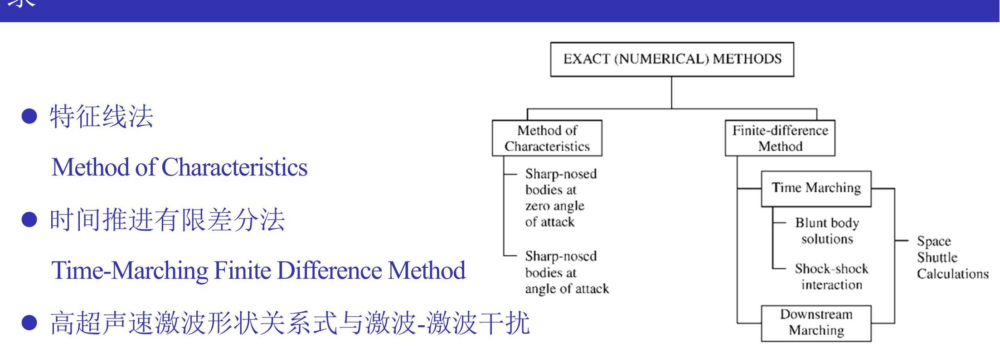

Correlations for Hypersonic Shock-Wave Shapes And Shock-Shock Interactions

- 有限差分空间推进法

Space-Marching Finite Difference Method

特征线法 (Method of Characteristics)

二维特征线法

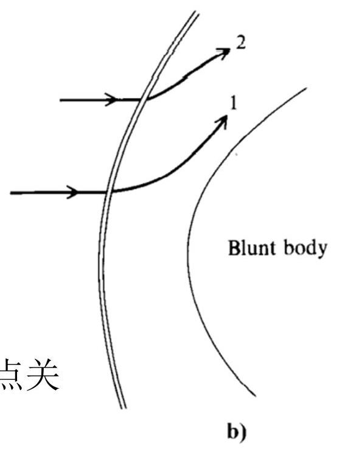

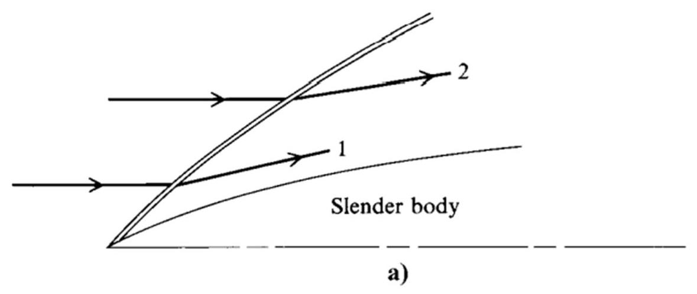

在高超声速外部流动中应用特征线法, 旋度成为了重点关注对象。

高超声速流动的激波较超声速情况下更强、更弯, 因此熵梯度更剧烈。无黏高超声速流动引入了可观的旋转运动。根据Crocco定理, 可以定量计算旋度:

$$
T{\nabla }_{S} = \nabla {h}_{0} - \mathbf{V} \times  \left( {\nabla  \times  \mathbf{V}}\right)
$$

二维特征线法

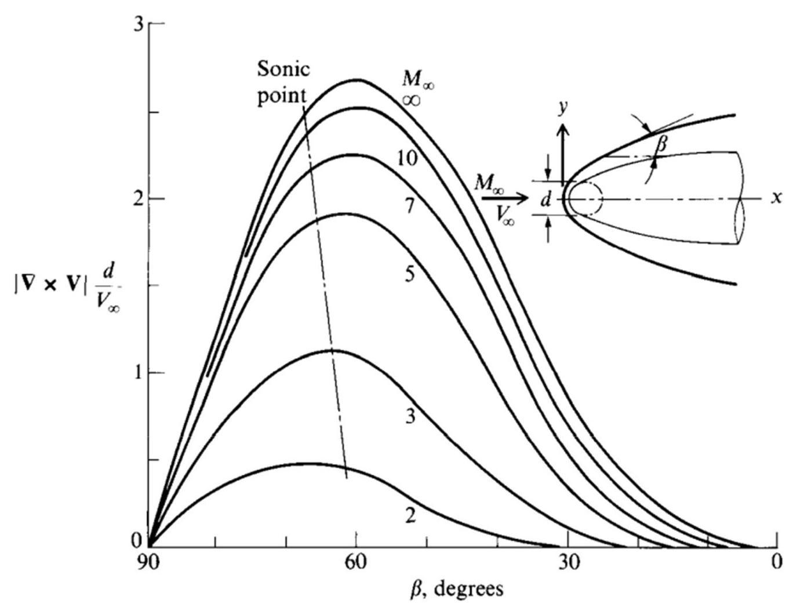

Fig. 5.6 Vorticity behind a parabolic shock wave: $y/d = {\left( {x}^{\prime }/d\right) }^{1/2}$ , and $\gamma  = {1.4}$

①涡量的峰值在激波的声速点附近。

②涡量随马赫数增大而增大。

使用特征线法来计算高超声速的无黏流动时必须使用有旋特征线法。

二维特征线法

步骤:(1)从一条初值线开始

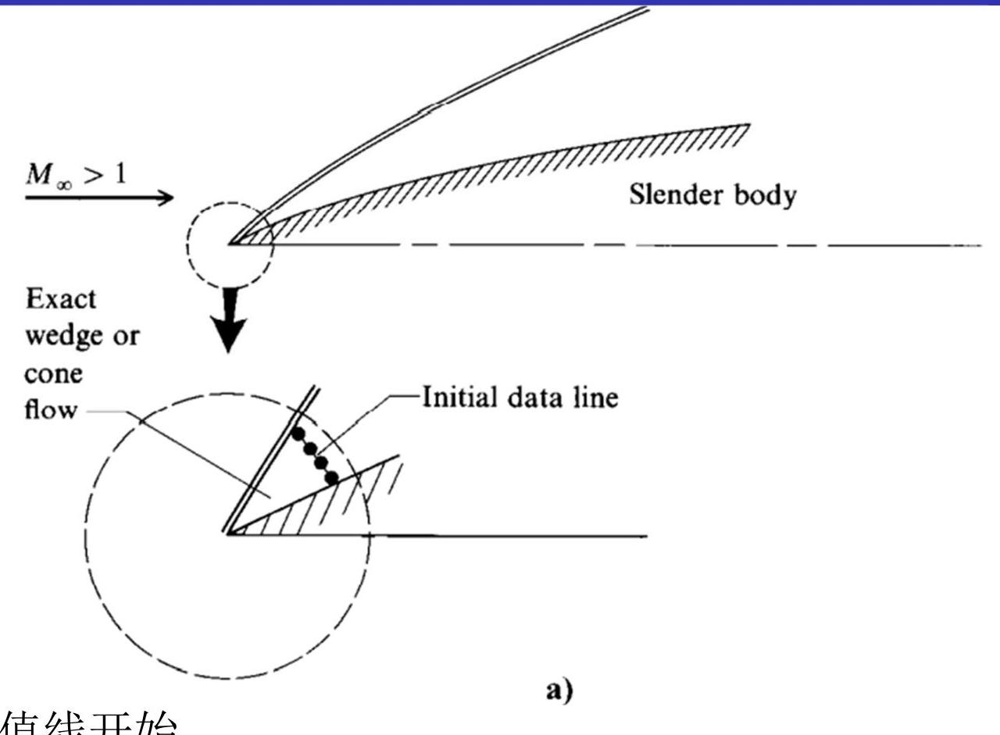

(a)对于附着激波的尖头物体，可以通过斜激波解或者Taylor - Maccoll锥形流解获得初值线的所有流动特性。

二维特征线法

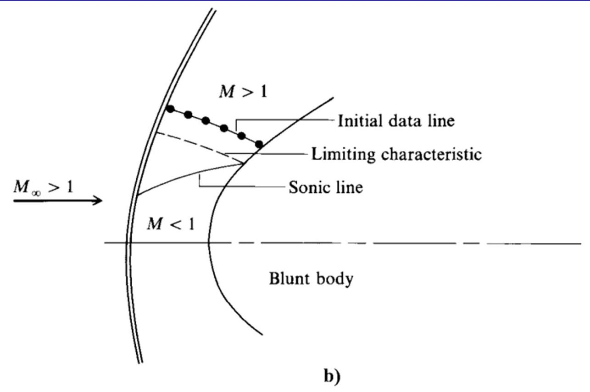

(b) 对于脱体弓形激波的钝头体，需要得到适当的钝头体解。初值线必须沿着或者处于极限特征线的下游。

## 二维特征线法

(2)沿着特征线向下游推进求解。

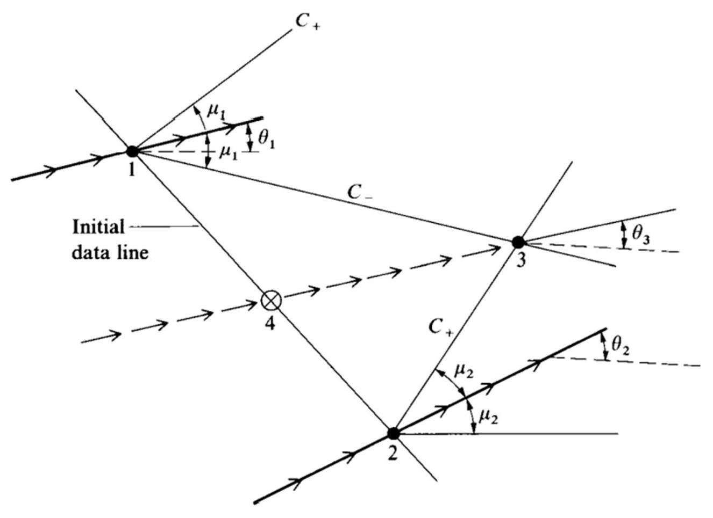

## 二维特征线法

(3)假设通过点3的流线的角度为 ${\theta }_{3}$ ， ${\theta }_{3}$ 为 ${\theta }_{1}$ 和 ${\theta }_{2}$ 的平均值。反向延长通过点3的流线, 与初值线相交得到点4。

(4)沿着特征线求解相容性方程, 求解点3的流场信息。

沿马赫数线:

$$
\frac{\mathrm{d}p}{\rho {V}^{2}\tan \mu } \pm  \mathrm{d}\theta  + \frac{j\sin \theta \sin \mu }{\sin \left( {\theta  \pm  \mu }\right) }\frac{\mathrm{d}y}{y} = 0
$$

沿流线:

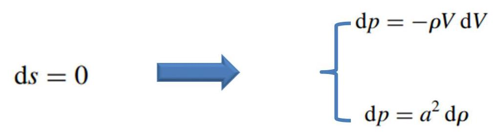

(5)重复第(2)-第(4)步，迭代至收敛。

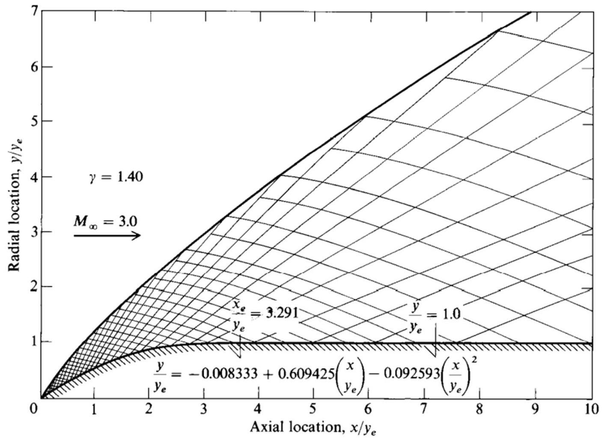

Fig. 5.9 Typical characteristics mesh (from Zucrow and Hoffman [53]).

应用

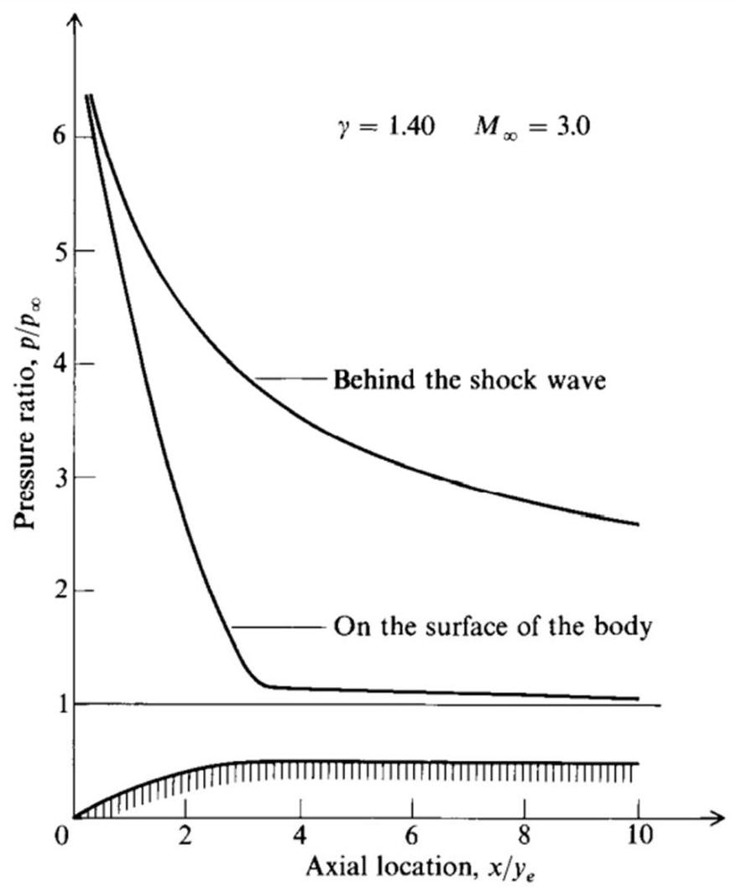

Fig. 5.10 Pressure distributions behind the shock and on the body for the case shown in Fig. 5.9 (from [53]).

## 三维特征线法

在定常的三维有旋流动中, 特征线变成了特征面, 即马赫锥和流面。

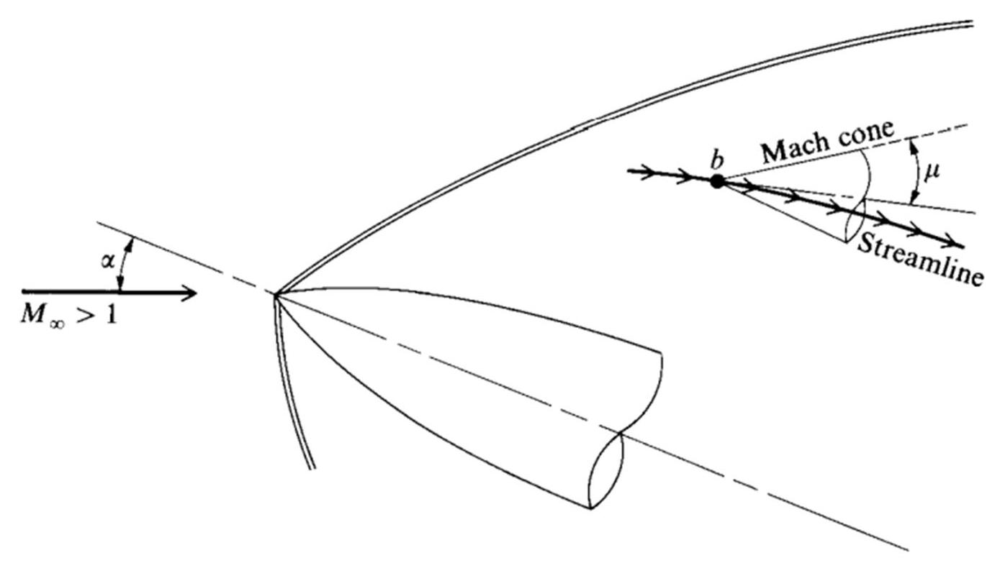

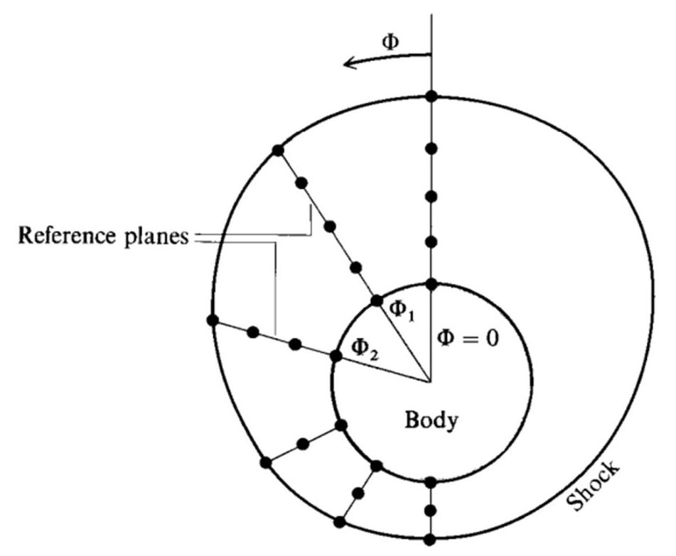

$d$ ___

${C}_{ + }$ -S

Reference plane $b \; C$ _

$r$ ↑ 1

$a$

$\frac{\beta }{\rho {V}^{2}}\frac{\partial \rho }{\partial {C}_{ + }} + \cos \phi \frac{\partial \theta }{\partial {C}_{ + }} = \left( {{f}_{1} + \beta {f}_{2}}\right) \sin {\mu }^{\prime } \; \frac{\beta }{\rho {V}^{2}}\frac{\partial \rho }{\partial {C}_{ - }} - \cos \phi \frac{\partial \theta }{\partial {C}_{ - }} = \left( {{f}_{1} - \beta {f}_{2}}\right) \sin {\mu }^{ * } \; \frac{\partial \phi }{\partial S} = {f}_{3}$

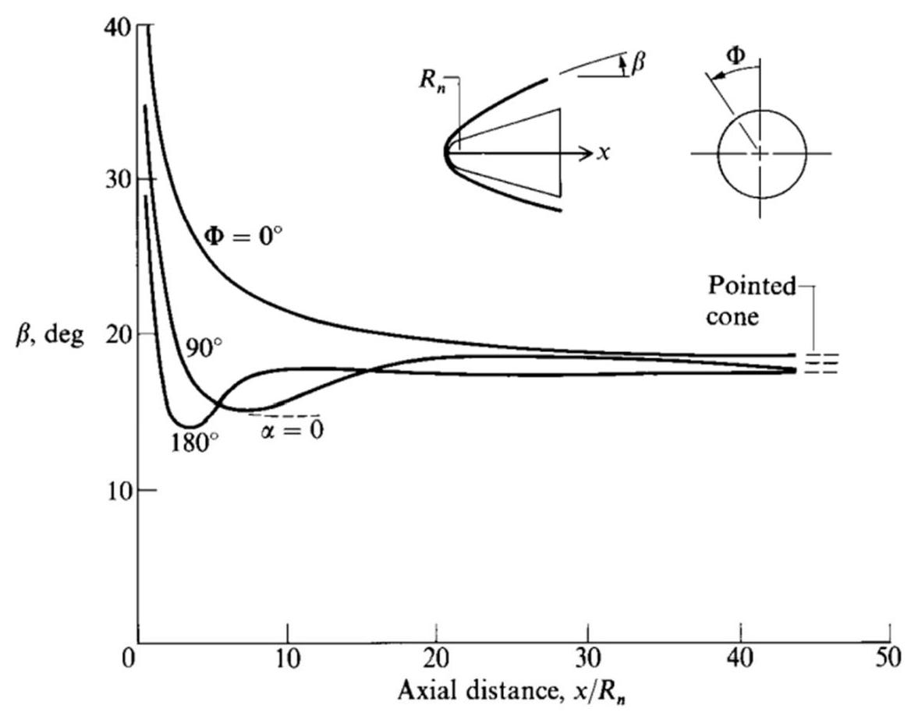

Fig. 5.15 Variation of shock-wave angle; calculations from the three-dimensional method of characteristics: ${\theta }_{c} = {15}\mathrm{{deg}},\alpha  = {10}\mathrm{{deg}},{M}_{\infty } = {10}$ , and $\gamma  = {1.4}$ (from [59]).

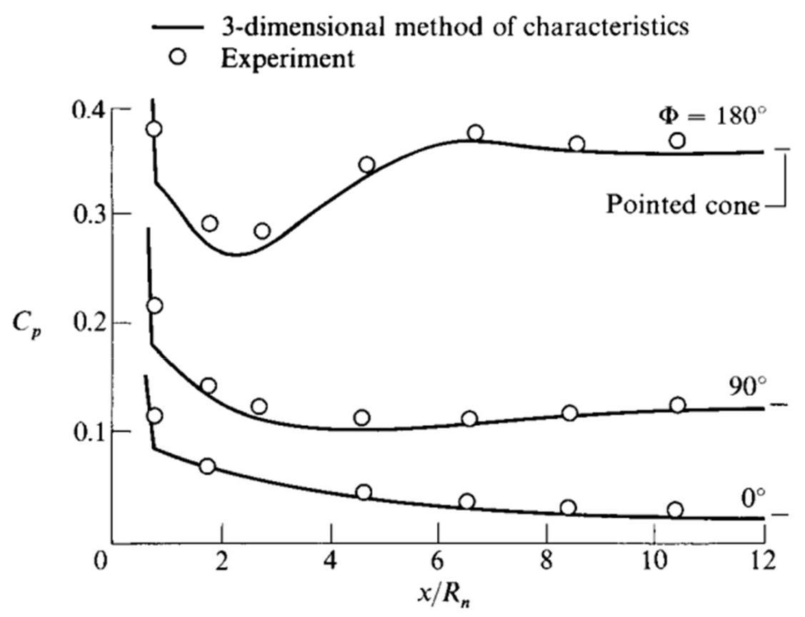

Fig. 5.16 Pressure distribution over a blunt-nosed cone; comparison between theory and experiment: ${\theta }_{c} = {15}\mathrm{{deg}},\alpha  = {10}\mathrm{{deg}},\operatorname{Re} = {0.6} \times  {10}^{6},{M}_{\infty } = {10}$ , and $\gamma  = {1.4}$ (from [59]).

# 时间推进有限差分法 (Time-Marching Finite Difference Method)

## 高超声速钝头体问题

是什么使得高超声速钝头体绕流最初难以解决, 为什么它现在成为了一种常规计算?

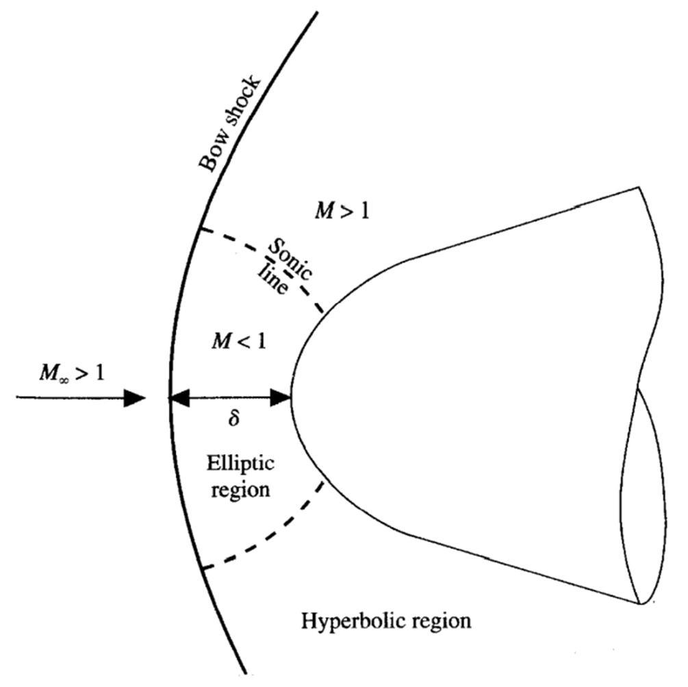

## 时间推进方法

非定常欧拉控制方程:

$$
\frac{\partial \rho }{\partial t} =  - \left\lbrack  {\frac{\partial \left( {\rho u}\right) }{\partial x} + \frac{\partial \left( {\rho v}\right) }{\partial y}}\right\rbrack
$$

$$
\frac{\partial u}{\partial t} =  - \left\lbrack  {u\frac{\partial u}{\partial x} + v\frac{\partial u}{\partial y} + \frac{1}{\rho }\frac{\partial p}{\partial x}}\right\rbrack
$$

$$
\frac{\partial v}{\partial t} =  - \left\lbrack  {u\frac{\partial v}{\partial x} + v\frac{\partial v}{\partial y} + \frac{1}{\rho }\frac{\partial p}{\partial y}}\right\rbrack
$$

$$
\frac{\partial }{\partial t}\left( \frac{p}{{\rho }^{\gamma }}\right)  =  - \left\lbrack  {u\frac{\partial }{\partial x}\left( \frac{p}{{\rho }^{\gamma }}\right)  + v\frac{\partial }{\partial y}\left( \frac{p}{{\rho }^{\gamma }}\right) }\right\rbrack
$$

求解步骤:

(1)考虑给定的物体外形。

(2)假设激波形状和激波脱体距离。

## 时间推进方法

(3)假定每个网格结点处的流场变量 $\rho , u, v, p$ 。这一假定流场作为 $\mathrm{t} = 0$ 时的初始流场。

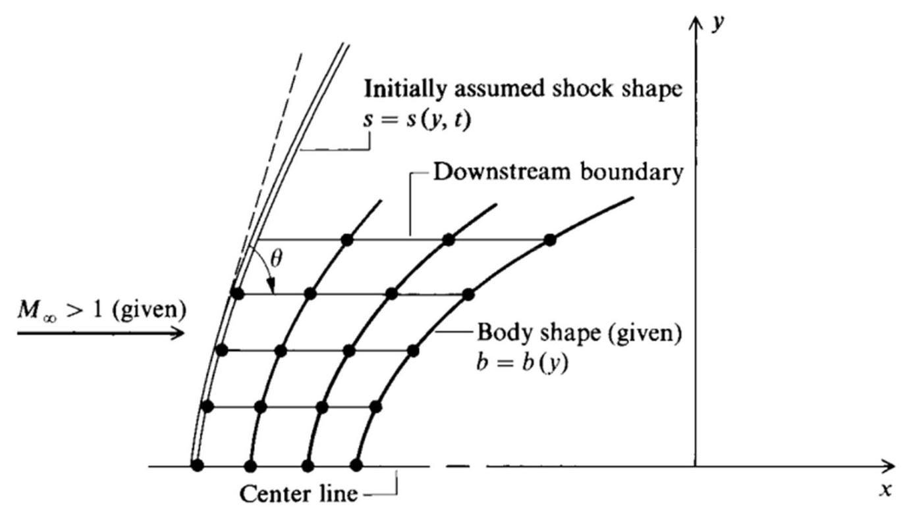

## 时间推进方法

(4)通过合适的有限差分解求得下一时间的流场。

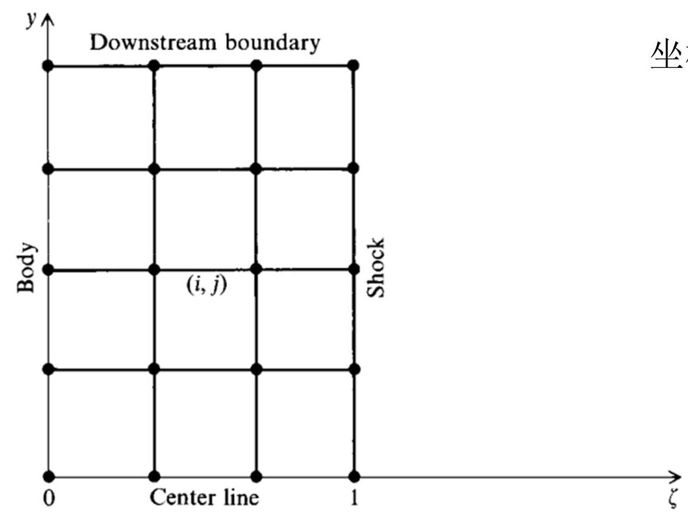

坐标变换:

$$
\zeta  = \frac{x - b}{\delta }
$$

## 时间推进方法

(5)对因变量进行变换。

$W = \frac{\mathrm{d}s}{\mathrm{\;d}t} = x$ component of the shock-wave velocity

$$
P = \ln p
$$

$$
C \equiv  \left( {\zeta  - 1}\right) \frac{\mathrm{d}b}{\mathrm{\;d}y} - \zeta \cot \theta
$$

$$
R = \ell {n\rho }
$$

$$
\psi  = \ell {np} - \gamma \ell {n\rho } = P - {\gamma R}
$$

$$
B = \frac{u - {W\zeta } + {vC}}{\delta }
$$

$$
\frac{\partial R}{\partial t} =  - \left\lbrack  {B\frac{\partial R}{\partial \zeta } + \frac{1}{\delta }\frac{\partial u}{\partial \zeta } + \frac{C}{\delta }\frac{\partial v}{\partial \zeta } + \frac{\partial v}{\partial y} + v\frac{\partial R}{\partial y}}\right\rbrack
$$

$$
\frac{\partial u}{\partial t} =  - \left\lbrack  {B\frac{\partial u}{\partial \zeta } + v\frac{\partial u}{\partial y} + \frac{p}{\rho \delta }\frac{\partial p}{\partial \zeta }}\right\rbrack  \;\frac{\partial v}{\partial t} =  - \left\lbrack  {B\frac{\partial v}{\partial \zeta } + v\frac{\partial v}{\partial y} + \frac{pC}{\rho \delta }\frac{\partial P}{\partial \zeta } + \frac{p}{\rho }\frac{\partial P}{\partial y}}\right\rbrack
$$

$$
\frac{\partial \psi }{\partial t} =  - \left\lbrack  {B\frac{\partial \psi }{\partial \zeta } + v\frac{\partial \psi }{\partial y}}\right\rbrack
$$

## 时间推进方法

(6)对流场计算进行说明。

$$
{u}_{i, j}^{t + {\Delta t}} = {u}_{i, j}^{t} + {\left( \frac{\partial u}{\partial t}\right) }_{\text{ ave }}{\Delta t}
$$

(7)对空间导数采用向前差分处理。

$$
{\left( \frac{\partial u}{\partial t}\right) }_{i, j}^{t} =  - \left\lbrack  {{B}_{i, j}^{t}\left( \frac{{u}_{i + 1, j}^{t} - {u}_{i, j}^{t}}{\Delta \zeta }\right)  + {v}_{i, j}^{t}\left( \frac{{u}_{i, j + 1}^{t} - {u}_{i, j}^{t}}{\Delta y}\right) }\right.
$$

$$
\left. {+{\left( \frac{p}{\rho \delta }\right) }_{i, j}^{t}\left( \frac{{p}_{i + 1, j}^{t} - {p}_{i, j}^{t}}{\Delta \zeta }\right) }\right\rbrack
$$

(8)从泰勒级数的前两项求得速度的预测值。

$$
{\bar{u}}_{i, j}^{t + {\Delta t}} = {u}_{i, j}^{t} + {\left( \frac{\partial u}{\partial t}\right) }_{i, j}^{t}{\Delta t}
$$

## 时间推进方法

(9)将步骤(8)得到的预测值带入欧拉方程中，对空间导数采用向后差分，计算校正步上的时间导数。

$$
{\left( \overline{\frac{\partial u}{\partial t}}\right) }_{i, j}^{t + {\Delta t}} =  - \left\lbrack  {{\bar{B}}_{i, j}^{t + {\Delta t}}\left( \frac{{\bar{u}}_{i, j}^{t + {\Delta t}} - {\bar{u}}_{i - 1, j}^{t + {\Delta t}}}{\Delta \zeta }\right)  + {\bar{v}}_{i, j}^{t + {\Delta t}}\left( \frac{{\bar{u}}_{i, j}^{t + {\Delta t}} - {\bar{u}}_{i, j - 1}^{t + {\Delta t}}}{\Delta y}\right) }\right.
$$

$$
\left. {+{\left( \frac{\bar{p}}{\overline{\rho }\delta }\right) }_{i, j}^{t + {\Delta t}}\left( \frac{{\bar{P}}_{i, j}^{t + {\Delta t}} - {\bar{P}}_{i - 1, j}^{t + {\Delta t}}}{\Delta \zeta }\right) }\right\rbrack
$$

(10)计算步骤(6)中的平均时间导数。

$$
{\left( \frac{\partial u}{\partial t}\right) }_{\text{ ave }} = \frac{1}{2}\left\lbrack  {{\left( \frac{\partial u}{\partial t}\right) }_{i, j}^{t} + {\left( \frac{\overline{\partial u}}{\partial t}\right) }_{i, j}^{t + {\Delta t}}}\right\rbrack
$$

(11)计算最终校正后的值。 $\;{u}_{i, j}^{t + {\Delta t}} = {u}_{i, j}^{t} + {\left( \frac{\partial u}{\partial t}\right) }_{\text{ ave }}{\Delta t}$

(12)多次重复步骤(7)-(11)。

## 激波边界条件

对步骤 (6) - (11) 中计算内部点流动的算法进行修改。

$$
\frac{{p}_{\text{ new }}}{{\rho }_{\text{ old }}} = {\left\lbrack  1 \pm  \frac{\gamma  - 1}{2}\left( \frac{{V}_{n}}{{a}_{\text{ old }}}\right) \right\rbrack  }^{{2\gamma }/\left( {\gamma  - t}\right) }
$$

$$
\frac{{T}_{\text{ new }}}{{T}_{\text{ old }}} = {\left\lbrack  1 \pm  \frac{\gamma  - 1}{2}\left( \frac{{V}_{n}}{{a}_{\text{ old }}}\right) \right\rbrack  }^{2}
$$

$$
{p}_{j + 1} = {p}_{j - 1};\;{T}_{j + 1} = {T}_{j - 1};\;{u}_{j + 1} = {u}_{j - 1}\;{v}_{j + 1} =  - {v}_{j - 1}
$$

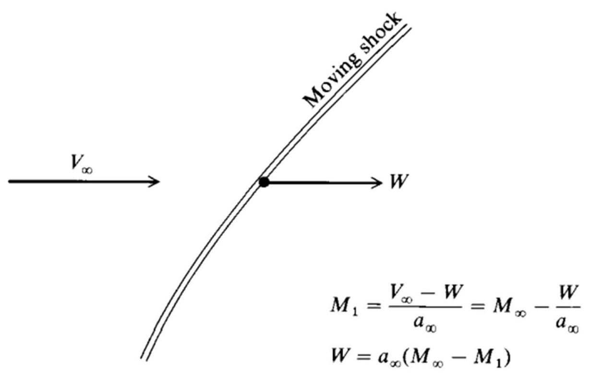

Fig. 5.21 Schematic of a moving shock wave.

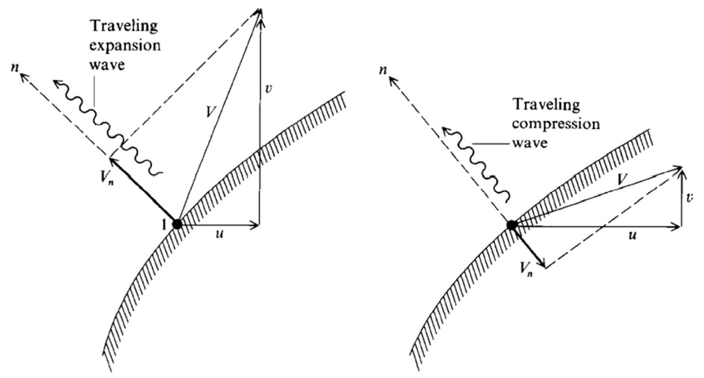

Fig. 5.22 Illustration of boundary condition at the wall.

Centerline

- $j - 1$

Fig. 5.23 Grid points above and below a centerline.

${\Delta t}$ 的稳定性判据:

$$
\Delta {t}_{y} = \frac{\Delta y}{v + a}
$$

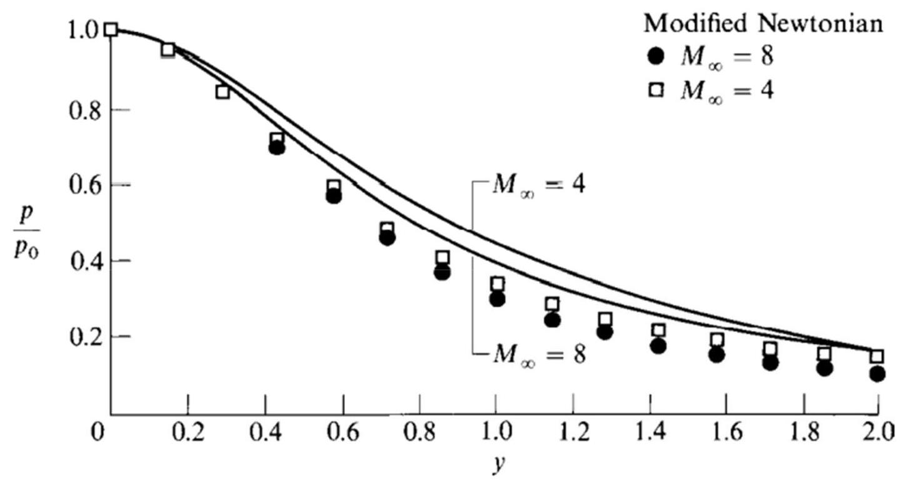

Fig. 5.26 Surface-pressure distribution, parabolic cylinder.

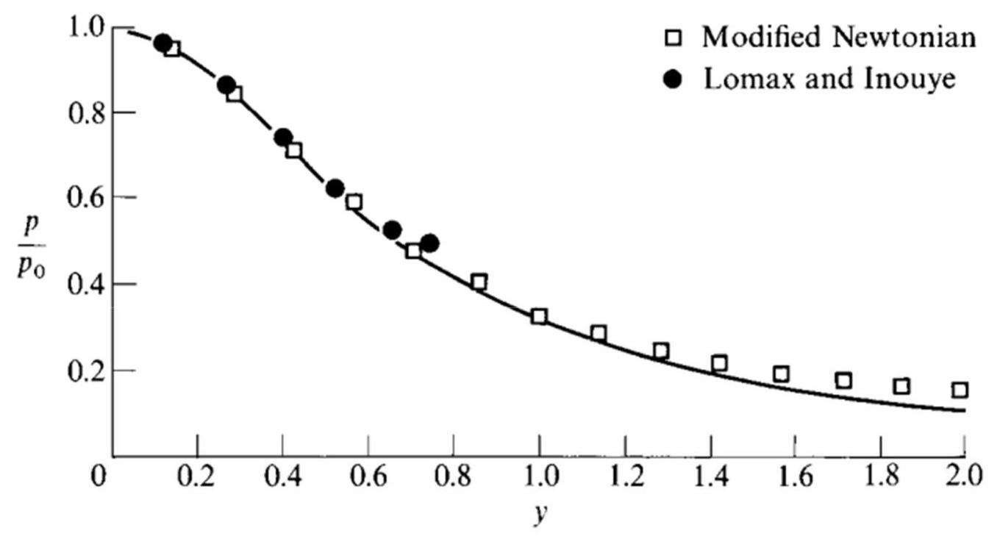

Fig. 5.27 Surface-pressure distribution, paraboloid, where ${M}_{\infty } = 4$ .

高超声速激波形状关系式与激波-激波干扰 (Correlations for Hypersonic Shock-Wave Shapes And Shock-Shock Interactions

## 激波形状关系式

假设双曲激波形状满足以下方程:

$$
x = R + \delta  - {R}_{c}{\cot }^{2}\beta \left\lbrack  {{\left( 1 + \frac{{y}^{2}{\tan }^{2}\beta }{{R}_{c}^{2}}\right) }^{1/2} - 1}\right\rbrack
$$

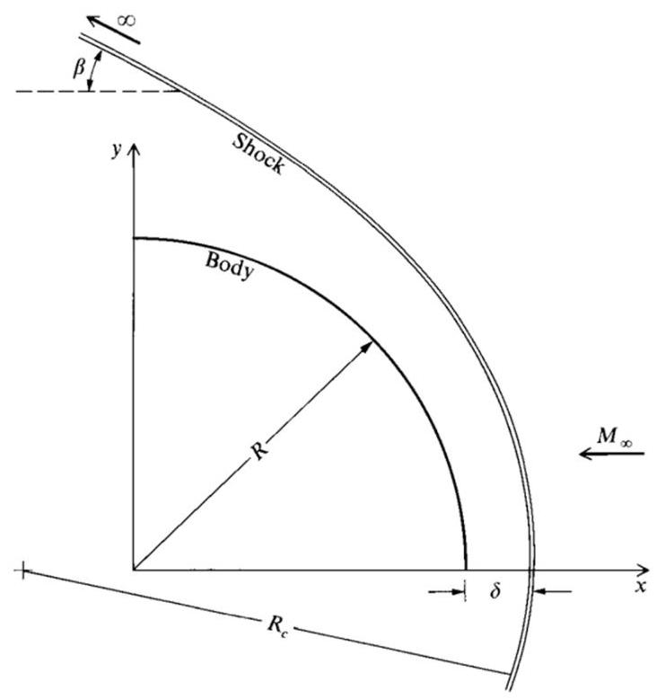

Fig. 5.34 Nomenclature for shock-wave shape correlations.

$\delta$ 和 ${R}_{\mathrm{c}}$ 有如下关系:

$$
\frac{\delta }{R} = \left\{  \begin{array}{ll} {0.143} & \exp \left\lbrack  {{3.24}/{M}_{\infty }^{2}}\right\rbrack  \\  {0.386} & \exp \left\lbrack  {{4.67}/{M}_{\infty }^{2}}\right\rbrack   \end{array}\right.
$$

sphere-cone

cylinder-wedge

和

$$
\frac{{R}_{c}}{R} = \left\{  \begin{array}{l} {1.143}\exp \left\lbrack  {{0.54}/{\left( {M}_{\infty } - 1\right) }^{1.2}}\right\rbrack  \\  {1.386}\exp \left\lbrack  {{1.8}/{\left( {M}_{\infty } - 1\right) }^{0.75}}\right\rbrack   \end{array}\right.
$$

sphere-cone

cylinder-wedge

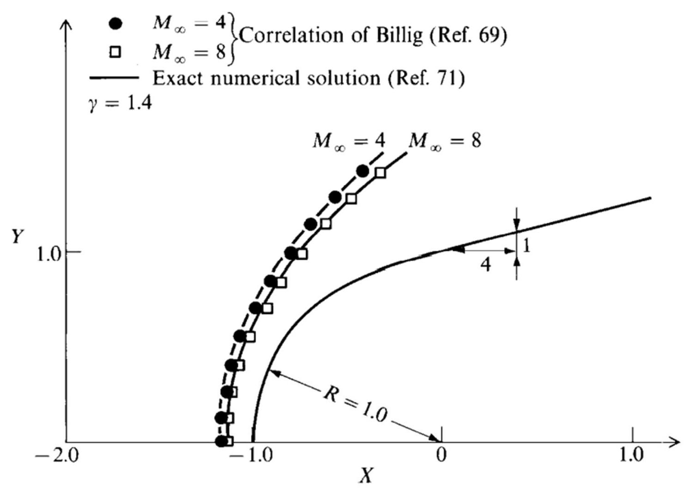

Fig. 5.35 Steady-state shock-wave shapes for a sphere-cone.

激波形状关系式

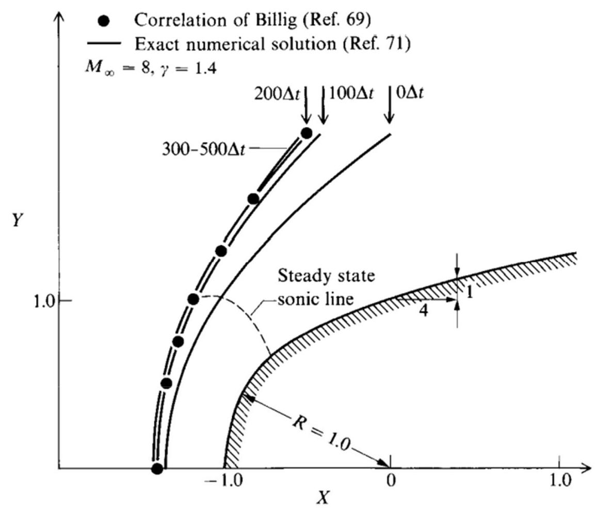

Fig. 5.36 Transient and steady-state shock-wave shapes for a cylinder-wedge (from [70]).

激波-激波干扰

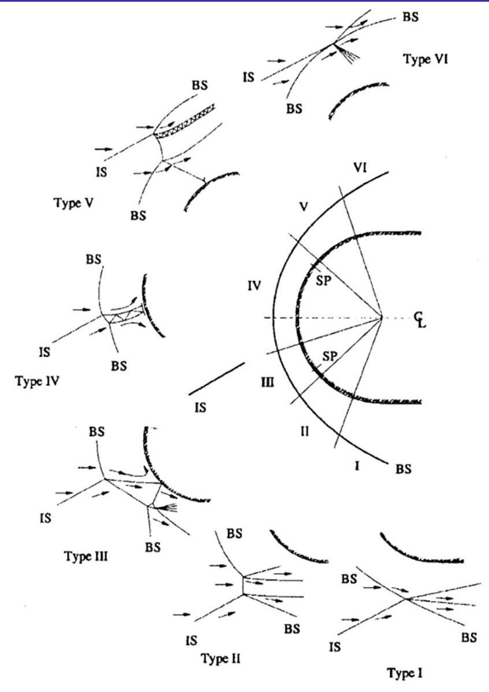

Fig. 5.38 Six types of shock-shock interactions:

SP denotes sonic point; IS,

impinging shock; and BS, bow shock (Lind [221]).

激波-激波干扰

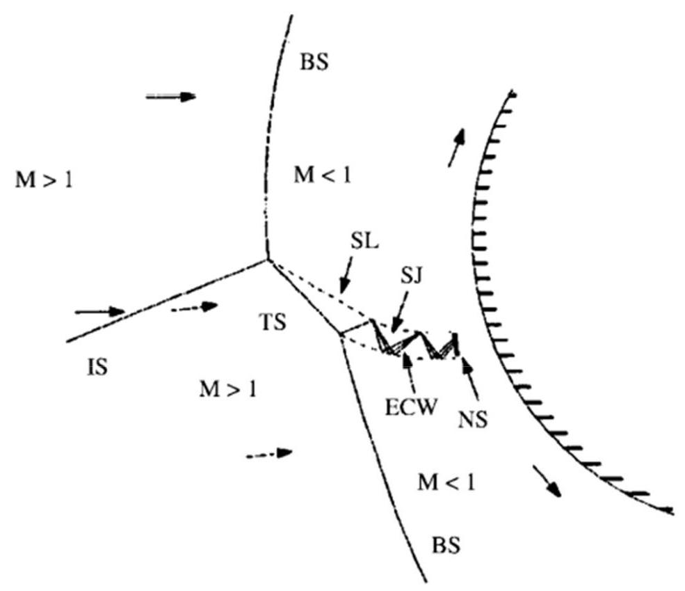

Fig. 5.39 Schematic of the type-IV shock interaction: BS denotes bow shock; ECW, expansion/compression waves; IS, impinging shock; NS, normal shock; SL, shear layer; SJ, supersonic jet; and TS, transmitted shock (Lind [221]).

有限差分空间推进法 (Space-Marching Finite Difference Method)

## 欧拉方程中的其他解法

考虑绕尖头体的二维或者轴对称定常流, 欧拉方程为:

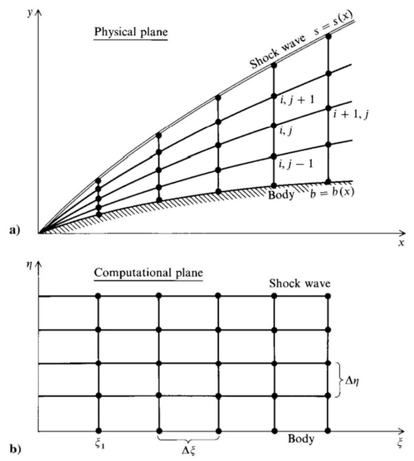

Fig. 5.41 Physical and computational planes.

Continuity:

$$
\frac{\partial \left( {\rho u}\right) }{\partial x} + \frac{\partial \left( {\rho v}\right) }{\partial y} + \frac{j\rho v}{y} = 0
$$

$x$ Momentum:

$$
{\rho u}\frac{\partial u}{\partial x} + {\rho v}\frac{\partial u}{\partial y} =  - \frac{\partial p}{\partial x}
$$

$y$ Momentum:

$$
{\rho u}\frac{\partial v}{\partial x} + {\rho v}\frac{\partial v}{\partial y} =  - \frac{\partial p}{\partial y}
$$

$$
h + \frac{{V}^{2}}{2} = {h}_{\infty } + \frac{{V}_{\infty }^{2}}{2} = {h}_{0}
$$

$$
\frac{\gamma }{\gamma  - 1}\left( \frac{p}{\rho }\right)  + \frac{{u}^{2} + {v}^{2}}{2} = {h}_{0}
$$

欧拉方程中的其他解法整理为:

$$
\frac{\partial E}{\partial \xi } =  - H - \frac{1}{\delta }\left( {-\eta \frac{\mathrm{d}\delta }{\mathrm{d}x} - \frac{\mathrm{d}b}{\mathrm{\;d}x}}\right) \frac{\partial E}{\partial \eta } - \frac{1}{\delta }\frac{\partial F}{\partial \eta }
$$

(5.51)

$$
\frac{\partial }{\partial x}\left( {p + \rho {u}^{2}}\right)  + \frac{\partial \left( {\rho uv}\right) }{\partial y} + \frac{j\rho uv}{y} = 0
$$

$$
\frac{\partial \left( {\rho uv}\right) }{\partial x} + \frac{\partial }{\partial y}\left( {p + \rho {v}^{2}}\right)  + \frac{{j\rho }{v}^{2}}{y} = 0
$$

$$
\frac{\partial E}{\partial x} + \frac{\partial F}{\partial y} + H = 0
$$

$$
E = \left\{  \begin{array}{l} {\rho u} \\  p + \rho {u}^{2} \\  {\rho uv} \end{array}\right\}  \;F = \left\{  \begin{array}{l} {\rho v} \\  {\rho uv} \\  p + \rho {v}^{2} \end{array}\right\}  \;H = \frac{j}{y}\left\{  \begin{array}{l} {\rho v} \\  {\rho uv} \\  \rho {v}^{2} \end{array}\right.
$$

坐标变换

$\xi  = x$

$$
\eta  = \frac{y - b}{\delta }
$$

步骤:

(1)选取某条 $\xi$ 线，作为初值线。

(2)知道 $\xi  = {\xi }_{1}$ 上的值后，其下游 $\xi  + {\Delta \xi }$ 处的流场参数可由下式求得:

$$
{E}_{i + 1, j} = {E}_{i, j} + {\left( \frac{\partial E}{\partial \xi }\right) }_{\text{ ave }}{\Delta \xi } \tag{5.52}
$$

(3)对步骤(2)公式中的 ${\left( \frac{\vartheta E}{\vartheta \xi }\right) }_{\mathrm{{ave}}}$ 进行求解。

$$
{\bar{E}}_{i + 1, j} = {E}_{i, j} + {\left( \frac{\partial E}{\partial \xi }\right) }_{i, j}{\Delta \xi }
$$

$$
{\left( \frac{\partial E}{\partial \xi }\right) }_{i, j} =  - {H}_{i, j} - \frac{1}{{\delta }_{ij}}{\left( -\eta \frac{\mathrm{d}\delta }{\mathrm{d}x} - \frac{\mathrm{d}b}{\mathrm{\;d}x}\right) }_{i, j}\left( \frac{{E}_{i, j + 1} - {E}_{i, j}}{\Delta \eta }\right)
$$

$$
- \frac{1}{{\delta }_{ij}}\left( \frac{{F}_{i, j + 1} - {F}_{i, j}}{\Delta \eta }\right)
$$

(4)将步骤(3)中的预估值带入式(5-51)，使用向后差分法:

$$
{\left( \frac{\overline{\partial E}}{\partial \xi }\right) }_{i + 1, j} =  - {\bar{H}}_{i + 1, j} - \frac{1}{{\delta }_{i + 1, j}}{\left( -\eta \frac{\mathrm{d}\delta }{\mathrm{d}x} - \frac{\mathrm{d}h}{\mathrm{\;d}x}\right) }_{i + 1, j}\left( \frac{{\bar{E}}_{i + 1, j} - {\bar{E}}_{i + 1, j - 1}}{\Delta \eta }\right)
$$

$$
- \frac{1}{{\delta }_{i + 1, j}}\left( \frac{{\bar{F}}_{i + 1, j} - {\bar{F}}_{i + 1, j - 1}}{\Delta \eta }\right)
$$

(5)求式(5-52)中出现的导数平均值:

$$
{\left( \frac{\partial E}{\partial \xi }\right) }_{\text{ ave }} = \frac{1}{2}\left\lbrack  {{\left( \frac{\partial E}{\partial \xi }\right) }_{i, j} + {\left( \frac{\overline{\partial E}}{\partial \xi }\right) }_{i + 1, j}}\right\rbrack
$$

(6)由式(5-52)计算最终的、修正后的 ${E}_{i + 1, j}$ 。

$$
{E}_{i + 1, j} = {E}_{i, j} + {\left( \frac{\partial E}{\partial \xi }\right) }_{\text{ avc }}{\Delta \xi }
$$

## 激波边界条件

(1)1点处的流动参数和激波角由向前推进法求得，2点出的流动参数由 MacCormack 方法步骤 (2) - (6) 来计算流场内点流动。

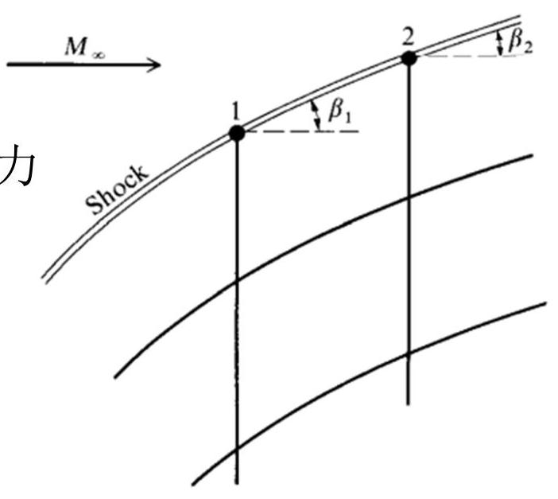

(2)从第(1)步求得2点处的流动参数再结合自由流的压力和马赫数得到 2 点处激波的两个参数: ${\mathrm{p}}_{2}/{p}_{\infty }$ 和 $M{\mathrm{a}}_{\infty }$ 。

(3)由斜激波关系式求出点2处 ${\rho }_{2}\text{ 、 }{T}_{2}\text{ 、 }{\mathrm{u}}_{2}\text{ 、 }{\mathrm{v}}_{2}$ 。

(4)构造点2处的激波形状与位置。画一条穿过点1、角度为 $\frac{1}{2}\left( {{\beta }_{1} + {\beta }_{2}}\right)$ 的直线。

## 物面边界条件

(1)1点处的流动参数由前面的计算得到，2点出的流动参数由MacCormack 方法步骤 (2) - (6) 来计算流场内点流动。

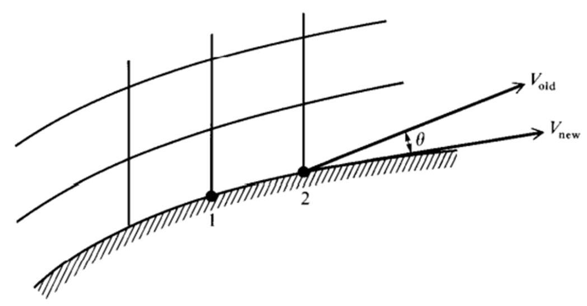

(2)由上一步得到点2处的流动参数为Prandtl - Meyer膨胀波上游的流场。通过 Prandtl - Meyer方程和等熵关系求出膨胀后的下游的流动参数，即为2点处的最终流场参数。

Fig. 5.45 Pressure distributions obtained for the body shown in Fig. 5.44 (calculations made by Stephen Corda, University of Maryland).